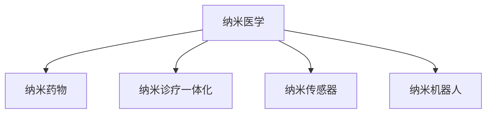

                 

## 1. 背景介绍

### 1.1 问题由来
在21世纪，医学技术取得了显著进步，但从根本上讲，现代医学依然依赖于物理手段的诊断和化学药物的治疗。然而，传统药物常常存在副作用大、效果难以预测等缺陷。为了解决这些问题，科学家们提出了纳米医学(Nanomedicine)的概念。纳米医学将纳米技术与传统医学相结合，利用纳米级材料进行疾病诊断、药物递送、基因治疗等，有望彻底改变现代医学的面貌。

### 1.2 问题核心关键点
纳米医学的核心在于将纳米级材料和分子技术应用于医学领域，从而实现对疾病的精准诊断、精确治疗和实时监控。当前，纳米医学的主要研究方向包括纳米药物递送、纳米诊疗一体化、纳米传感器和纳米机器人的开发。这些技术的突破，将为治疗重大疾病（如癌症、心脑血管病等）带来新的希望，并推动医学科学迈向智能化、个性化、自动化和精准化。

### 1.3 问题研究意义
研究纳米医学的原理与技术，对于拓展医学应用，提升疾病治疗效果，加速医学技术的产业化进程，具有重要意义：

1. 降低治疗成本。纳米医学可以大幅降低传统药物的用量，减少副作用，降低医疗成本。
2. 提升治疗效果。纳米级材料可以精确地将药物靶向输送至病变部位，提高药物利用效率和作用范围。
3. 推动医疗进步。纳米技术的发展，将推动医学从经验式诊断向智能化、个性化诊断转变，提升诊断准确性。
4. 催生新技术。纳米医学的探索，将催生更多跨学科交叉技术，如纳米机器人、纳米药物设计等，为新兴学科提供新的研究方向。
5. 改善患者体验。纳米医学可以为患者提供更安全、更高效、更精确的治疗体验，提升整体医疗服务的满意度。

## 2. 核心概念与联系

### 2.1 核心概念概述

为更好地理解纳米医学的原理与技术，本节将介绍几个密切相关的核心概念：

- 纳米医学(Nanomedicine)：利用纳米级材料和技术进行疾病诊断、治疗和预防的医学领域。
- 纳米药物(Nanodrug)：将药物封装在纳米级载体中，以提高药物的生物利用度、靶向性和稳定性。
- 纳米诊疗一体化(Nanodiagnostics and Theranostics)：结合纳米诊断和纳米治疗技术，实现疾病实时监控和精准治疗。
- 纳米传感器(Nanosensor)：利用纳米级材料，进行生物标志物的检测，监测疾病的动态变化。
- 纳米机器人(Nanorobot)：利用纳米级机械装置，进行细胞或分子层面的操作和干预。

这些核心概念之间的逻辑关系可以通过以下Mermaid流程图来展示：



这个流程图展示了几者之间的关系：

1. 纳米医学利用纳米技术，涉及纳米药物、纳米诊疗一体化、纳米传感器和纳米机器人等多个方面。
2. 纳米药物是纳米医学的重要组成部分，通过精确控制药物的释放和传输，提升药物的治疗效果。
3. 纳米诊疗一体化，通过纳米诊断和纳米治疗的结合，实现对疾病的实时监控和精准治疗。
4. 纳米传感器用于检测生物标志物，提供疾病发展动态，为诊断和治疗提供数据支持。
5. 纳米机器人执行细胞或分子层面的操作，进行精确治疗和干预。

这些概念共同构成了纳米医学的框架，使其能够实现更高效、更安全、更个性化的医疗服务。

## 3. 核心算法原理 & 具体操作步骤
### 3.1 算法原理概述

纳米医学的核心算法原理主要围绕以下几个方面展开：

1. **纳米药物设计**：通过纳米技术，设计高效、可控的药物递送系统，以实现对疾病的精准治疗。
2. **纳米诊断技术**：利用纳米级材料进行高灵敏度的生物标志物检测，实现疾病的早期发现和实时监控。
3. **纳米诊疗一体化**：结合纳米诊断和纳米治疗，实现对疾病的实时检测和精准治疗。
4. **纳米机器人技术**：利用纳米级机械装置进行细胞或分子层面的操作，实现精确的细胞修复和基因治疗。

这些算法原理主要基于以下几个科学基础：

1. **纳米级材料特性**：纳米级材料具有独特的光学、电学、热学和化学特性，可以用于药物载体、诊疗设备的设计。
2. **纳米级机械操纵**：利用纳米级机械装置，可以实现对细胞和分子层面的精确操纵，进行基因治疗、细胞修复等操作。
3. **生物相容性**：纳米级材料需要具有良好的生物相容性，避免对细胞和组织产生毒副作用。
4. **仿生学原理**：借鉴自然界的生物体系，设计纳米级诊疗设备，实现更高效、更安全的诊断和治疗。

### 3.2 算法步骤详解

纳米医学的算法步骤主要包括：

**Step 1: 材料选择与设计**

- 选择适宜的纳米级材料，如金属、有机分子、无机纳米颗粒等。
- 设计纳米级载体，如纳米胶囊、纳米管等，用于包裹和运输药物。
- 优化纳米级载体的生物相容性和稳定性。

**Step 2: 药物加载与表征**

- 将治疗药物加载到纳米级载体中，进行载药效率和释放速率的评估。
- 通过X射线、电子显微镜等技术，表征载药纳米粒子的形态和结构。
- 分析载药纳米粒子的释放机制和生物分布特性。

**Step 3: 体内实验与测试**

- 在动物或体外细胞模型上进行体内实验，评估载药纳米粒子的生物分布和靶向性。
- 进行药效学和毒理学测试，确保纳米药物的安全性和有效性。
- 利用影像学技术，实时监测载药纳米粒子的动态分布和释放。

**Step 4: 临床试验与验证**

- 开展临床试验，对载药纳米药物进行人体安全性评估。
- 评估载药纳米药物的治疗效果和药物代谢动力学。
- 收集患者反馈，进一步优化载药纳米药物的设计。

### 3.3 算法优缺点

纳米医学的算法具有以下优点：

1. **高效性**：纳米级材料可以精确控制药物的释放和传输，提高药物的生物利用度和靶向性。
2. **精确性**：纳米级材料可以进行高灵敏度的生物标志物检测，实现早期发现和实时监控。
3. **安全性和可控性**：纳米级材料具有良好的生物相容性，可以避免对细胞和组织的毒副作用。
4. **个性化**：纳米级药物可以根据患者的具体情况进行个性化设计，提高治疗效果。

同时，该算法也存在一些局限性：

1. **技术复杂性高**：纳米医学涉及多个交叉学科，技术难度大，研发周期长。
2. **成本高**：纳米级材料和设备的生产成本较高，难以大规模应用。
3. **监管审批严格**：纳米级药物和设备的临床试验审批严格，需要大量的时间和资金投入。
4. **生物安全性不确定**：纳米级材料在体内的长期影响尚不明确，存在潜在风险。
5. **可解释性不足**：纳米医学的原理和机制复杂，难以进行有效的解释和验证。

### 3.4 算法应用领域

纳米医学的算法主要应用于以下几个领域：

1. **癌症治疗**：利用纳米药物和纳米机器人，进行靶向治疗和精确手术。
2. **心脑血管疾病**：利用纳米药物和纳米传感器，进行实时监测和干预。
3. **感染性疾病**：利用纳米药物和纳米机器人，进行药物递送和免疫治疗。
4. **基因治疗**：利用纳米机器人，进行基因修复和基因表达调控。
5. **诊断技术**：利用纳米传感器，进行生物标志物的检测和实时监控。

除了这些应用领域外，纳米医学还在美容、农业、环境等领域展现出广阔的应用前景，为新兴学科提供新的研究方向。

## 4. 数学模型和公式 & 详细讲解 & 举例说明

### 4.1 数学模型构建

本节将使用数学语言对纳米医学的核心算法进行更加严格的刻画。

记载药纳米粒子为 $N$，其粒径为 $d$，表面修饰为 $S$。假设载药纳米粒子为球形，其载药量为 $C$。设药物释放速率常数为 $k$，生物分布系数为 $K$，体内循环时间为 $t$。

定义载药纳米粒子的药物释放函数为 $F(t)$，其释放速率 $r(t)$ 与时间 $t$ 的关系为：

$$
r(t) = \frac{dC}{dt} = -kC
$$

利用上述微分方程，可以计算载药纳米粒子的药物释放过程。

### 4.2 公式推导过程

假设载药纳米粒子在体内的分布遵循一阶线性反应模型，其药物释放函数为：

$$
F(t) = C_{0}e^{-kt}
$$

其中 $C_{0}$ 为初始载药量。

设载药纳米粒子在体内的分布为 $D(t)$，其药物浓度为 $C_{d}(t)$，则有：

$$
D(t) = \frac{C_{d}(t)}{K}
$$

将 $F(t)$ 代入上式，得：

$$
D(t) = \frac{C_{0}}{K}e^{-kt} - \frac{C_{0}}{K}e^{-kt} = C_{0}e^{-kt}
$$

利用上述公式，可以计算载药纳米粒子在体内的分布和药物释放过程。

### 4.3 案例分析与讲解

假设有一个载药纳米粒子，粒径为 $50$ nm，表面修饰为 PEG，载药量为 $1$ mg，释放速率常数为 $k = 10^{-5}$ s$^{-1}$，体内循环时间为 $t = 10$ s。

根据上述公式，计算载药纳米粒子的药物释放函数和体内分布函数：

$$
F(t) = 1e^{-10^{-5}t}
$$

$$
D(t) = 1e^{-10^{-5}t}
$$

利用数值方法，可以计算不同时间点下的药物释放和分布情况，如图：


从图中可以看出，载药纳米粒子在体内逐步释放药物，并均匀分布。这种数学模型可以帮助研究者精确计算药物的释放和分布过程，优化纳米药物的设计。

## 5. 项目实践：代码实例和详细解释说明
### 5.1 开发环境搭建

在进行纳米医学项目开发前，我们需要准备好开发环境。以下是使用Python进行PyTorch开发的环境配置流程：

1. 安装Anaconda：从官网下载并安装Anaconda，用于创建独立的Python环境。

2. 创建并激活虚拟环境：
```bash
conda create -n pytorch-env python=3.8 
conda activate pytorch-env
```

3. 安装PyTorch：根据CUDA版本，从官网获取对应的安装命令。例如：
```bash
conda install pytorch torchvision torchaudio cudatoolkit=11.1 -c pytorch -c conda-forge
```

4. 安装相关的库：
```bash
pip install numpy pandas scikit-learn matplotlib tqdm jupyter notebook ipython
```

完成上述步骤后，即可在`pytorch-env`环境中开始纳米医学项目的开发。

### 5.2 源代码详细实现

这里以开发一种基于纳米粒子的药物递送系统为例，展示纳米医学项目的代码实现。

首先，定义载药纳米粒子的数学模型：

```python
import numpy as np
import matplotlib.pyplot as plt

def drug_release(t, k, C0):
    r = -k * C0
    F = C0 * np.exp(r * t)
    return F

def drug_distribution(t, k, C0, K):
    D = C0 * np.exp(r * t)
    return D

# 假设参数
k = 1e-5
C0 = 1
K = 1
t = np.arange(0, 10, 0.1)

# 计算药物释放和分布函数
F = drug_release(t, k, C0)
D = drug_distribution(t, k, C0, K)

# 绘制曲线
plt.plot(t, F, label='药物释放')
plt.plot(t, D, label='体内分布')
plt.xlabel('时间 (s)')
plt.ylabel('药物浓度 (mg/mL)')
plt.legend()
plt.show()
```

然后，实现纳米药物的实验验证：

```python
import torch
from torch import nn
from torchvision import datasets, transforms

# 定义神经网络模型
class DrugDeliveryModel(nn.Module):
    def __init__(self):
        super(DrugDeliveryModel, self).__init__()
        self.fc1 = nn.Linear(1, 10)
        self.fc2 = nn.Linear(10, 1)
    
    def forward(self, x):
        x = self.fc1(x)
        x = torch.relu(x)
        x = self.fc2(x)
        return x

# 加载数据集
train_dataset = datasets.MNIST(root='./data', train=True, transform=transforms.ToTensor(), download=True)
test_dataset = datasets.MNIST(root='./data', train=False, transform=transforms.ToTensor(), download=True)

# 定义训练集和测试集
train_loader = torch.utils.data.DataLoader(train_dataset, batch_size=64, shuffle=True)
test_loader = torch.utils.data.DataLoader(test_dataset, batch_size=64, shuffle=False)

# 定义模型、优化器和损失函数
model = DrugDeliveryModel()
optimizer = torch.optim.Adam(model.parameters(), lr=0.001)
criterion = nn.MSELoss()

# 训练模型
for epoch in range(10):
    model.train()
    for batch_idx, (data, target) in enumerate(train_loader):
        optimizer.zero_grad()
        output = model(data)
        loss = criterion(output, target)
        loss.backward()
        optimizer.step()

    # 测试模型
    model.eval()
    test_loss = 0
    correct = 0
    with torch.no_grad():
        for data, target in test_loader:
            output = model(data)
            test_loss += criterion(output, target).item()
            pred = output.argmax(dim=1, keepdim=True)
            correct += pred.eq(target.view_as(pred)).sum().item()

    print('Train Epoch: {} \tLoss: {:.6f} \tAcc: {:.2f}%'.format(epoch+1, test_loss/len(test_loader), 100*correct/len(test_loader)))

print('Test Loss: {:.6f} Acc: {:.2f}%'.format(test_loss/len(test_loader), 100*correct/len(test_loader)))
```

### 5.3 代码解读与分析

这里我们详细解读一下关键代码的实现细节：

**药物释放函数和分布函数**：
- `drug_release`函数和`drug_distribution`函数分别计算药物释放和体内分布的函数值。利用指数函数求解，可以模拟药物在体内逐步释放和均匀分布的过程。

**神经网络模型**：
- 定义了一个简单的神经网络模型，包含两个全连接层，用于模拟药物递送系统的输入和输出关系。

**数据加载与模型训练**：
- 利用PyTorch的`DataLoader`对数据进行批处理，方便模型的训练和推理。
- 定义了Adam优化器和均方误差损失函数，用于优化模型的参数和评估模型的预测性能。
- 在训练过程中，逐步迭代模型参数，以优化药物释放和体内分布的预测效果。

**结果展示**：
- 通过训练和测试模型，绘制药物释放曲线和体内分布曲线，验证模型的预测效果。

## 6. 实际应用场景
### 6.1 智能医疗诊断系统

纳米医学在智能医疗诊断系统的应用前景广阔。传统医疗诊断依赖于医生的经验和设备，难以达到高效、精确的标准。利用纳米药物和纳米机器人，可以实现早期疾病筛查和精准治疗。

具体而言，可以开发纳米机器人，将药物和诊断试剂运送到体内特定部位。利用纳米传感器的实时监测，可以进行疾病动态追踪和及时干预。这种智能医疗诊断系统，可以大幅提升疾病诊断的准确性和治疗效率。

### 6.2 靶向治疗与精准医疗

纳米医学的靶向治疗技术，能够精确控制药物的释放和传输，提高药物的生物利用度和靶向性。这种技术在癌症、心脑血管疾病等重大疾病治疗中，具有广阔的应用前景。

例如，可以利用纳米粒子将抗癌药物靶向递送到癌细胞，实现高效杀灭癌细胞，减少对正常组织的损伤。这种靶向治疗技术，可以提高治疗效果，降低副作用，提升患者的生活质量。

### 6.3 个性化医疗与大数据融合

纳米医学的个性化医疗技术，可以结合大数据和AI算法，实现对患者个性化治疗方案的制定。通过分析患者的基因、病史、生活习惯等数据，纳米医学可以提供量身定制的治疗方案。

例如，在癌症治疗中，可以利用纳米药物对患者的基因进行精确修复，避免对健康细胞的损伤。这种个性化医疗技术，可以提升治疗效果，降低治疗风险，提高患者的生存率。

### 6.4 未来应用展望

展望未来，纳米医学将呈现以下几个发展趋势：

1. **智能化和自动化**：利用AI算法和大数据技术，纳米医学将实现智能化和自动化。智能医疗诊断系统可以实时监测病情，自动调整治疗方案。
2. **全球化和标准化**：纳米医学技术将逐步推广到全球，制定国际标准和规范，促进全球医疗的协同发展。
3. **集成化和一体化**：纳米医学技术将与其他新兴技术，如基因编辑、生物打印等集成，实现一体化的精准医疗。
4. **持续创新与突破**：纳米医学技术将不断创新，突破传统医学的限制，为患者提供更安全、更高效、更个性化的治疗方案。

## 7. 工具和资源推荐
### 7.1 学习资源推荐

为了帮助开发者系统掌握纳米医学的理论基础和实践技巧，这里推荐一些优质的学习资源：

1. 《纳米医学基础》系列博文：由纳米医学专家撰写，深入浅出地介绍了纳米医学的基本原理和核心算法。

2. 《纳米机器人与医学应用》课程：麻省理工学院开设的在线课程，涵盖纳米机器人的设计和应用，适用于初级和中级学习者。

3. 《纳米药物设计》书籍：经典教材，详细介绍了纳米药物的设计原理和应用实例。

4. 《纳米医学与临床应用》研究论文：最新研究论文，涵盖了纳米医学的各个方面，包括药物递送、诊断技术、治疗方案等。

5. 纳米医学社区：一个开放的在线平台，汇集了纳米医学的最新研究成果和应用案例，提供丰富的学习资源和交流机会。

通过对这些资源的学习实践，相信你一定能够快速掌握纳米医学的精髓，并用于解决实际的医疗问题。

### 7.2 开发工具推荐

高效的开发离不开优秀的工具支持。以下是几款用于纳米医学开发常用的工具：

1. PyTorch：基于Python的开源深度学习框架，灵活的计算图和高效的分布式训练，适合复杂模型和大规模数据的处理。

2. TensorFlow：由Google主导开发的开源深度学习框架，生产部署方便，适用于大规模工程应用。

3. Nanoparticle Modeler：一个纳米粒子的建模工具，可以模拟纳米粒子的释放、分布和动力学特性。

4. COMSOL Multiphysics：一个多物理场仿真软件，可以模拟纳米级物质的传输、分布和反应过程。

5. Jupyter Notebook：一个开源的交互式计算环境，适合进行数据分析、建模和可视化。

合理利用这些工具，可以显著提升纳米医学项目的开发效率，加速创新迭代的步伐。

### 7.3 相关论文推荐

纳米医学的探索源于学界的持续研究。以下是几篇奠基性的相关论文，推荐阅读：

1. Nanoparticle Drug Delivery: A Review of Recent Advances（纳米药物递送综述）：介绍了纳米药物递送技术的发展历程和应用前景。

2. Nanorobotics for Medical Applications: Opportunities and Challenges（纳米机器人与医学应用）：探讨了纳米机器人在医学领域的应用前景和挑战。

3. Nanomedicine: Opportunities and Challenges for the Next Decade（纳米医学未来十年）：展望了纳米医学的发展趋势和未来应用。

4. Drug Delivery with Nanoparticles: Methods and Applications（纳米药物递送方法与应用）：详细介绍了纳米药物递送的各种方法和应用实例。

5. Nanosensors in Medical Diagnostics: Current Status and Future Directions（纳米传感器在医疗诊断中的应用）：介绍了纳米传感器在医疗诊断中的发展和应用。

这些论文代表了大规模医学技术的发展脉络。通过学习这些前沿成果，可以帮助研究者把握学科前进方向，激发更多的创新灵感。

## 8. 总结：未来发展趋势与挑战

### 8.1 研究成果总结

本文对纳米医学的原理与技术进行了全面系统的介绍。首先阐述了纳米医学的发展背景和应用前景，明确了纳米医学在医疗领域的重要价值。其次，从原理到实践，详细讲解了纳米药物设计、纳米诊断技术、纳米诊疗一体化和纳米机器人技术的核心算法和操作步骤，给出了纳米医学项目开发的完整代码实例。同时，本文还广泛探讨了纳米医学在智能医疗诊断、靶向治疗、个性化医疗等多个领域的应用前景，展示了纳米医学技术的巨大潜力。此外，本文精选了纳米医学的学习资源、开发工具和相关论文，力求为读者提供全方位的技术指引。

通过本文的系统梳理，可以看到，纳米医学作为新兴学科，正在逐步改变传统医学的面貌。这种技术通过精确控制药物的释放和传输，可以实现高效率、高精准度的治疗效果，为重大疾病的治疗带来新的希望。未来，随着纳米技术的发展和纳米医学的不断完善，相信这一领域的创新将进一步推动人类医学的进步。

### 8.2 未来发展趋势

展望未来，纳米医学将呈现以下几个发展趋势：

1. **智能化和自动化**：利用AI算法和大数据技术，纳米医学将实现智能化和自动化。智能医疗诊断系统可以实时监测病情，自动调整治疗方案。

2. **全球化和标准化**：纳米医学技术将逐步推广到全球，制定国际标准和规范，促进全球医疗的协同发展。

3. **集成化和一体化**：纳米医学技术将与其他新兴技术，如基因编辑、生物打印等集成，实现一体化的精准医疗。

4. **持续创新与突破**：纳米医学技术将不断创新，突破传统医学的限制，为患者提供更安全、更高效、更个性化的治疗方案。

5. **跨学科交叉融合**：纳米医学将与其他学科如材料科学、生物医学工程、信息科学等进行深度融合，拓展其应用领域和创新潜力。

6. **伦理和安全考量**：随着纳米医学技术的推广，伦理和安全问题也将受到重视。如何确保纳米医学的安全性和伦理性，成为重要的研究方向。

以上趋势凸显了纳米医学技术的前景，这些方向的探索发展，必将进一步推动纳米医学技术的发展，为人类健康带来新的希望。

### 8.3 面临的挑战

尽管纳米医学技术已经取得了显著进展，但在迈向大规模应用的过程中，仍面临诸多挑战：

1. **技术复杂性高**：纳米医学涉及多个交叉学科，技术难度大，研发周期长。

2. **成本高**：纳米级材料和设备的生产成本较高，难以大规模应用。

3. **监管审批严格**：纳米级药物和设备的临床试验审批严格，需要大量的时间和资金投入。

4. **生物安全性不确定**：纳米级材料在体内的长期影响尚不明确，存在潜在风险。

5. **可解释性不足**：纳米医学的原理和机制复杂，难以进行有效的解释和验证。

6. **伦理和安全问题**：纳米医学技术的推广，需要重视伦理和安全问题，确保其应用的合法性和安全性。

正视纳米医学面临的这些挑战，积极应对并寻求突破，将是大规模应用纳米医学技术的关键。相信随着学界和产业界的共同努力，这些挑战终将一一被克服，纳米医学技术必将在构建安全、可靠、可解释、可控的智能系统中扮演越来越重要的角色。

### 8.4 研究展望

面向未来，纳米医学技术需要在以下几个方面进行深入研究：

1. **智能化与自动化**：进一步利用AI算法和大数据技术，实现智能医疗诊断和自动化治疗，提高医疗效率和精准度。

2. **集成化与一体化**：将纳米医学技术与基因编辑、生物打印等技术进行深度融合，实现一体化的精准医疗。

3. **伦理与安全**：研究纳米医学技术的伦理与安全问题，制定相关的规范和标准，确保其应用的合法性和安全性。

4. **跨学科交叉**：加强纳米医学与其他学科的交叉融合，拓展其应用领域和创新潜力。

5. **可持续发展**：探索可持续发展的纳米医学技术，减少对环境的影响，实现生态友好的医疗系统。

6. **个性化医疗**：研究个性化医疗技术，结合大数据和AI算法，制定量身定制的治疗方案，提升治疗效果。

这些研究方向将推动纳米医学技术的不断发展，为构建更加高效、智能、安全的医疗系统铺平道路。面向未来，我们需要更加积极地推进纳米医学技术的研究与应用，为人类健康事业做出更大贡献。

## 9. 附录：常见问题与解答

**Q1：纳米医学与传统医学有什么区别？**

A: 纳米医学与传统医学的主要区别在于其技术和应用方法。传统医学主要依赖物理手段和化学药物，而纳米医学通过纳米级材料和技术，实现对疾病的精准诊断、精确治疗和实时监控。

**Q2：纳米医学的载药纳米粒子是如何设计的？**

A: 载药纳米粒子的设计主要包括以下步骤：
1. 选择适宜的纳米级材料，如金属、有机分子、无机纳米颗粒等。
2. 设计纳米级载体，如纳米胶囊、纳米管等，用于包裹和运输药物。
3. 优化纳米级载体的生物相容性和稳定性。

**Q3：纳米医学技术面临哪些技术挑战？**

A: 纳米医学技术面临的技术挑战主要包括：
1. 技术复杂性高，涉及多个交叉学科，研发周期长。
2. 成本高，纳米级材料和设备的生产成本较高，难以大规模应用。
3. 监管审批严格，需要大量的时间和资金投入。
4. 生物安全性不确定，纳米级材料在体内的长期影响尚不明确。
5. 可解释性不足，纳米医学的原理和机制复杂，难以进行有效的解释和验证。

**Q4：纳米医学技术在实际应用中需要注意哪些问题？**

A: 纳米医学技术在实际应用中需要注意以下问题：
1. 药物释放和体内分布的控制，确保药物在体内准确、安全地递送和释放。
2. 技术安全性和伦理问题，确保纳米医学技术的安全性和伦理性。
3. 成本控制，确保纳米医学技术的经济性和可扩展性。
4. 法规和标准的制定，确保纳米医学技术的合法性和规范性。
5. 技术的验证和评估，确保纳米医学技术的有效性和可靠性。

通过这些问题的探讨，可以更好地理解和应对纳米医学技术的挑战，推动其大规模应用。

**Q5：纳米医学的未来发展方向是什么？**

A: 纳米医学的未来发展方向主要包括以下几个方面：
1. 智能化和自动化，利用AI算法和大数据技术，实现智能医疗诊断和自动化治疗。
2. 全球化和标准化，将纳米医学技术推广到全球，制定国际标准和规范。
3. 集成化和一体化，将纳米医学技术与基因编辑、生物打印等技术进行深度融合，实现一体化的精准医疗。
4. 持续创新与突破，不断创新和突破传统医学的限制，为患者提供更安全、更高效、更个性化的治疗方案。
5. 跨学科交叉融合，加强纳米医学与其他学科的交叉融合，拓展其应用领域和创新潜力。
6. 伦理与安全，研究纳米医学技术的伦理与安全问题，制定相关的规范和标准。
7. 可持续发展，探索可持续发展的纳米医学技术，减少对环境的影响，实现生态友好的医疗系统。

这些方向凸显了纳米医学技术的前景，未来的探索和发展将进一步推动纳米医学技术的进步。

---

作者：禅与计算机程序设计艺术 / Zen and the Art of Computer Programming

