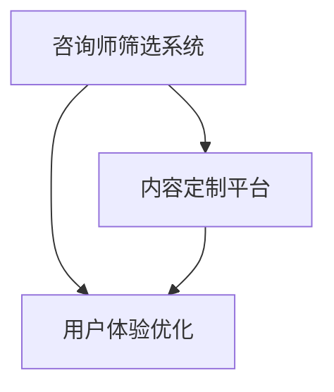
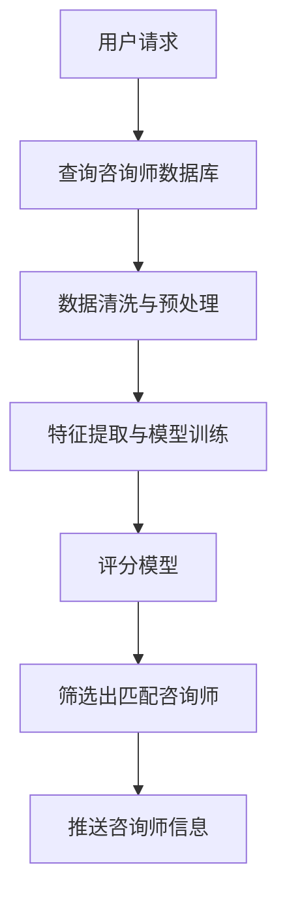
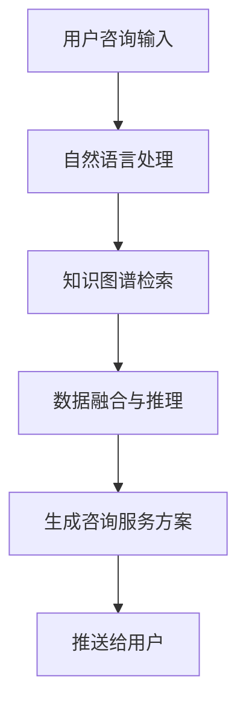
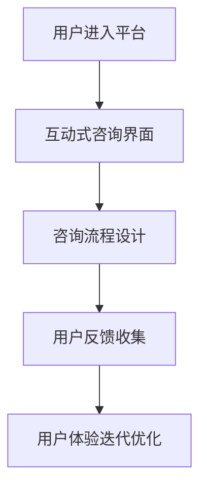

                 

# 建立个人咨询服务：提供高端定制化服务

> 关键词：个人咨询, 定制化服务, 咨询服务, 数据分析, 用户体验

## 1. 背景介绍

在快速变化的世界中，个人和企业面临着日益复杂的问题和挑战。从商业决策到个人发展，从科技创新到家庭生活，人们越来越需要专业的意见和建议来应对各种不确定性。因此，咨询服务成为了一种高度需求的服务类型，不仅有助于解决具体问题，还能提升决策质量和生活质量。本文将从技术、市场和用户体验三个方面，探讨如何建立并运营一家提供高端定制化咨询服务的平台。

### 1.1 问题由来

随着信息技术的进步，在线咨询服务的市场日益扩大。传统的面对面咨询面临着成本高、时间长的缺点，而在线咨询服务则具备灵活性、效率高、覆盖面广等优点，因此受到了广泛关注。然而，尽管在线咨询服务的普及率在提高，但市场上仍存在着一些问题，例如：

- **服务同质化**：大多数在线咨询服务平台提供的解决方案千篇一律，缺乏个性化和针对性。
- **信息质量参差不齐**：部分咨询平台的专家质量无法保证，提供的建议或方案效果不佳。
- **用户体验不理想**：线上咨询往往缺乏互动性，用户体验不佳，满意度较低。

本文将通过引入高端定制化服务的理念，提出一套从咨询师筛选、内容定制到用户体验优化的全方位解决方案，以期提升在线咨询服务的整体质量。

## 2. 核心概念与联系

### 2.1 核心概念概述

为了更好地理解本文提出的咨询服务方案，我们首先介绍一些核心概念及其之间的关系：

- **咨询师筛选系统**：利用AI和大数据分析技术，自动筛选和评估咨询师的专业能力和口碑。
- **内容定制平台**：通过自然语言处理(NLP)技术，结合用户具体需求，自动生成个性化咨询服务方案。
- **用户体验优化**：应用用户体验设计(UX)原则，优化线上咨询的交互流程，提升用户满意度。

这三大核心概念相互依赖、相互支持，共同构成了高质量、高效率的在线咨询服务体系。以下是一个简化的Mermaid流程图，展示了它们之间的关系：



### 2.2 核心概念原理和架构的 Mermaid 流程图

接下来，我们将使用Mermaid语法，进一步详细描述咨询师筛选系统、内容定制平台和用户体验优化的原理和架构。

#### 2.2.1 咨询师筛选系统

咨询师筛选系统通过数据驱动的方式，对咨询师的专业背景、资质认证、客户评价等数据进行综合分析，筛选出最合适的咨询师。以下是一个简单的流程图示例：



其中，`A`表示用户请求咨询，`B`为查询咨询师数据库，`C`为数据清洗与预处理，`D`为特征提取与模型训练，`E`为评分模型，`F`为筛选出匹配咨询师，`G`为推送咨询师信息。

#### 2.2.2 内容定制平台

内容定制平台利用NLP技术，理解用户的具体需求和咨询内容，自动生成个性化的咨询服务方案。以下是一个简化的流程图示例：



其中，`A`为用户的咨询输入，`B`为自然语言处理，`C`为知识图谱检索，`D`为数据融合与推理，`E`为生成咨询服务方案，`F`为推送给用户。

#### 2.2.3 用户体验优化

用户体验优化通过应用UX设计原则，优化咨询流程，提升用户满意度。以下是一个简化的流程图示例：



其中，`A`为用户进入平台，`B`为互动式咨询界面，`C`为咨询流程设计，`D`为用户反馈收集，`E`为用户体验迭代优化。

### 2.3 核心概念的联系

咨询师筛选系统、内容定制平台和用户体验优化之间存在着密切的联系。具体来说：

- **数据共享**：咨询师筛选系统和内容定制平台共享用户咨询输入和历史数据，以提供更加个性化的咨询服务。
- **反馈循环**：用户体验优化系统根据用户的反馈信息，对咨询流程和界面进行迭代优化，从而提升整体服务质量。
- **协同工作**：三个系统共同协作，确保咨询服务的效率和质量，为用户提供最佳的咨询体验。

通过这种协同工作的机制，可以构建一个高效、灵活、个性化的在线咨询服务体系。

## 3. 核心算法原理 & 具体操作步骤

### 3.1 算法原理概述

基于上述核心概念，本文提出了一套实现高端定制化咨询服务的算法体系。该体系主要包括咨询师筛选、内容定制和用户体验优化三个方面。以下是每个方面的算法原理概述：

#### 3.1.1 咨询师筛选系统

咨询师筛选系统通过综合评估咨询师的专业背景、资质认证、客户评价等数据，筛选出最适合的咨询师。具体来说，算法步骤如下：

1. **数据收集**：从第三方平台或公开数据库收集咨询师的简历、证书、客户评价等信息。
2. **数据预处理**：清洗和处理收集到的数据，去除噪音和冗余信息。
3. **特征提取**：提取咨询师的专业背景、客户评价、资质认证等关键特征。
4. **模型训练**：使用机器学习模型（如随机森林、神经网络等）训练评分模型，评估咨询师的能力。
5. **筛选咨询师**：根据评分模型对咨询师进行排序，筛选出最匹配的咨询师。

#### 3.1.2 内容定制平台

内容定制平台利用NLP技术，自动生成个性化的咨询服务方案。具体来说，算法步骤如下：

1. **自然语言处理**：使用NLP技术分析用户的咨询输入，提取关键词和意图。
2. **知识图谱检索**：在知识图谱中检索与用户咨询相关的信息，构建知识图谱查询图。
3. **数据融合与推理**：将知识图谱中的信息与用户咨询数据进行融合，进行推理计算，生成咨询服务方案。
4. **方案生成**：根据推理结果，生成个性化的咨询服务方案。

#### 3.1.3 用户体验优化

用户体验优化通过UX设计原则，优化咨询流程和界面，提升用户满意度。具体来说，算法步骤如下：

1. **咨询流程设计**：设计交互式、高效的咨询流程，减少用户等待时间。
2. **用户反馈收集**：在咨询结束后，收集用户反馈信息，包括满意度、建议等。
3. **用户体验迭代优化**：根据用户反馈信息，不断迭代优化咨询界面和流程，提升用户体验。

### 3.2 算法步骤详解

接下来，我们将详细描述每个算法的详细步骤。

#### 3.2.1 咨询师筛选系统

1. **数据收集**：
   - 从招聘网站、社交媒体、行业协会等渠道收集咨询师的简历和资质认证信息。
   - 从用户评论平台收集咨询师的客户评价数据。
   - 从公开数据库（如LinkedIn、LinkedIn Learning等）获取咨询师的职业背景和专业技能信息。

2. **数据预处理**：
   - 使用数据清洗工具（如Python的Pandas库）去除无效数据、缺失数据和重复数据。
   - 对文本数据进行分词、词性标注和命名实体识别。
   - 对数值数据进行归一化处理，确保数据的一致性和可比性。

3. **特征提取**：
   - 提取咨询师的专业背景（如学历、工作经历、证书等）。
   - 提取咨询师在各领域的专业技能（如项目管理、金融分析、法律咨询等）。
   - 提取咨询师在客户评价中的平均评分和反馈内容。
   - 计算咨询师的活跃度和响应速度。

4. **模型训练**：
   - 选择随机森林、支持向量机(SVM)、神经网络等机器学习算法，训练评分模型。
   - 使用交叉验证技术评估模型的准确性和泛化能力。
   - 对模型进行调参，优化模型性能。

5. **筛选咨询师**：
   - 根据评分模型对咨询师进行排序，筛选出最匹配的咨询师。
   - 将筛选结果推送给用户，供用户选择。

#### 3.2.2 内容定制平台

1. **自然语言处理**：
   - 使用NLP技术（如BERT、GPT等）分析用户的咨询输入，提取关键词和意图。
   - 将用户咨询输入转化为向量表示，用于后续的计算和推理。

2. **知识图谱检索**：
   - 构建知识图谱，存储各领域的知识信息和实体关系。
   - 使用图数据库（如Neo4j、GraphDB等）检索与用户咨询相关的信息，构建知识图谱查询图。

3. **数据融合与推理**：
   - 将知识图谱中的信息与用户咨询数据进行融合，进行推理计算。
   - 使用规则引擎或图神经网络算法进行推理计算，生成咨询服务方案。

4. **方案生成**：
   - 将生成的咨询方案转化为文本形式，提供给用户。
   - 在咨询方案中加入相关链接和参考文献，提升咨询的权威性和可信度。

#### 3.2.3 用户体验优化

1. **咨询流程设计**：
   - 设计简洁、易用的咨询流程，减少用户操作步骤。
   - 实现咨询界面的移动端和Web端适配，提升用户体验。

2. **用户反馈收集**：
   - 在咨询结束后，使用调查问卷、满意度评分等方式收集用户反馈信息。
   - 对用户反馈进行分类和分析，提取关键问题和建议。

3. **用户体验迭代优化**：
   - 根据用户反馈信息，不断迭代优化咨询界面和流程。
   - 引入A/B测试等方法，验证优化措施的效果。
   - 定期发布新的用户体验版本，提升整体服务质量。

### 3.3 算法优缺点

基于上述算法，本文提出的高端定制化咨询服务体系具备以下优点：

- **高效性**：利用自动化技术和AI算法，可以显著减少人工操作，提高服务效率。
- **个性化**：通过分析用户需求和咨询师背景，生成个性化咨询服务方案，提升用户满意度。
- **透明性**：将咨询师的资质认证和客户评价等信息公开，增加用户信任。

同时，该体系也存在一些缺点：

- **数据依赖**：算法效果依赖于数据质量和数量，需要不断更新和维护数据。
- **复杂性**：算法实现较为复杂，需要较高的技术水平和资源投入。
- **隐私保护**：需要严格保护用户隐私，避免数据泄露和滥用。

### 3.4 算法应用领域

本文提出的高端定制化咨询服务体系可以应用于以下多个领域：

- **商业决策咨询**：为企业管理层提供市场分析、战略规划等方面的咨询服务。
- **个人发展咨询**：为个人职业发展、心理健康等方面提供咨询建议。
- **科技创新咨询**：为科技创业企业提供技术咨询、市场分析等服务。
- **家庭教育咨询**：为家长和教育机构提供儿童心理、学习策略等方面的咨询服务。

## 4. 数学模型和公式 & 详细讲解

### 4.1 数学模型构建

本文提出的咨询服务体系涉及多个领域的数学模型。以下我们将详细介绍几个关键模型的构建和公式推导。

#### 4.1.1 咨询师筛选系统的评分模型

咨询师评分模型的目标是评估咨询师的专业能力和口碑。假设咨询师数量为$N$，每个咨询师的评分向量为$\mathbf{v}_i$，其中$i=1,2,\ldots,N$。评分模型可以表示为：

$$
\mathbf{v}_i = (v_{i1}, v_{i2}, \ldots, v_{in})
$$

其中，$v_{ik}$为咨询师在领域$k$的能力评分，$k=1,2,\ldots,K$，$K$为领域数量。

评分模型可以表示为：

$$
\mathbf{v}_i = \alpha \cdot \mathbf{w}^T \cdot \mathbf{g}_i
$$

其中，$\alpha$为系数，$\mathbf{w}$为权重向量，$\mathbf{g}_i$为咨询师$i$的背景数据特征向量。

#### 4.1.2 内容定制平台的知识图谱检索

知识图谱检索模型的目标是检索与用户咨询相关的信息。假设用户咨询输入为$x$，知识图谱中的信息为$G$，检索结果为$y$。知识图谱检索模型可以表示为：

$$
y = f(x, G)
$$

其中，$f$为检索函数。

#### 4.1.3 用户体验优化中的反馈分析模型

反馈分析模型的目标是分析用户反馈信息，提取关键问题和建议。假设用户反馈数据为$F$，反馈分析模型的输出为$S$，其中$S$包含用户的满意度评分、问题类型和建议等信息。反馈分析模型可以表示为：

$$
S = h(F)
$$

其中，$h$为分析函数。

### 4.2 公式推导过程

接下来，我们将详细推导咨询师评分模型、知识图谱检索模型和反馈分析模型的公式。

#### 4.2.1 咨询师评分模型

咨询师评分模型通过机器学习算法训练评分向量$\mathbf{v}_i$。具体来说，假设咨询师背景数据特征向量为$\mathbf{g}_i$，咨询师评分向量为$\mathbf{v}_i$，评分模型可以表示为：

$$
\mathbf{v}_i = \alpha \cdot \mathbf{w}^T \cdot \mathbf{g}_i
$$

其中，$\alpha$为系数，$\mathbf{w}$为权重向量。

#### 4.2.2 知识图谱检索模型

知识图谱检索模型通过图数据库检索用户咨询信息，可以表示为：

$$
y = f(x, G)
$$

其中，$f$为检索函数，$x$为用户咨询输入，$G$为知识图谱中的信息，$y$为检索结果。

#### 4.2.3 反馈分析模型

反馈分析模型通过分析用户反馈数据，提取关键问题和建议。具体来说，假设用户反馈数据为$F$，反馈分析模型的输出为$S$，其中$S$包含用户的满意度评分、问题类型和建议等信息。反馈分析模型可以表示为：

$$
S = h(F)
$$

其中，$h$为分析函数。

### 4.3 案例分析与讲解

#### 4.3.1 咨询师筛选系统的案例分析

假设某在线咨询平台收集了100个咨询师的背景数据，每个咨询师有10个领域的专业技能评分。评分模型可以通过随机森林算法训练。具体来说，假设每个咨询师有5个背景特征（如学历、工作经历、证书等），评分向量可以表示为：

$$
\mathbf{v}_i = \alpha \cdot \mathbf{w}^T \cdot \mathbf{g}_i
$$

其中，$\alpha$为系数，$\mathbf{w}$为权重向量。

假设训练好的评分模型为$f(x)$，其中$x$为用户咨询输入。用户选择咨询师时，平台根据评分模型计算每个咨询师的评分，选择评分最高的前5个咨询师推送给用户。

#### 4.3.2 内容定制平台的案例分析

假设某用户咨询关于“如何提升公司市场竞争力”的问题。内容定制平台利用BERT模型分析用户咨询输入，提取关键词和意图。然后，知识图谱检索模型在知识图谱中检索与用户咨询相关的信息，构建知识图谱查询图。最后，推理计算生成咨询服务方案，提供给用户。

#### 4.3.3 用户体验优化的案例分析

假设某用户在使用平台时，对界面流畅度和响应速度提出了反馈。用户体验优化系统通过分析用户反馈信息，提取关键问题和建议。然后，设计简洁、易用的咨询流程，实现咨询界面的移动端和Web端适配。最后，平台定期发布新的用户体验版本，提升整体服务质量。

## 5. 项目实践：代码实例和详细解释说明

### 5.1 开发环境搭建

在进行咨询服务项目实践前，我们需要准备好开发环境。以下是使用Python进行项目开发的环境配置流程：

1. 安装Anaconda：从官网下载并安装Anaconda，用于创建独立的Python环境。

2. 创建并激活虚拟环境：
```bash
conda create -n consulting-env python=3.8 
conda activate consulting-env
```

3. 安装必要的Python包：
```bash
pip install pandas numpy scikit-learn transformers pytorch neo4j flask
```

4. 安装数据处理工具：
```bash
pip install pyspark
```

完成上述步骤后，即可在`consulting-env`环境中开始项目开发。

### 5.2 源代码详细实现

下面是一个简化的咨询服务系统的源代码实现，主要包括以下几个模块：

#### 5.2.1 咨询师筛选系统

```python
from sklearn.ensemble import RandomForestClassifier
import pandas as pd
from transformers import BertTokenizer, BertForTokenClassification
import torch
from neo4j import GraphDatabase

# 读取咨询师数据
consultants = pd.read_csv('consultants.csv')

# 特征提取
consultant_features = consultants[['education', 'experience', 'certification', 'customers']]
consultant_features = consultant_features.apply(lambda x: x.fillna(x.median()))
consultant_features = consultant_features.dropna()

# 训练评分模型
model = RandomForestClassifier(n_estimators=100, random_state=42)
model.fit(consultant_features, consultants['score'])

# 筛选咨询师
top_consultants = model.predict_proba(consultant_features)[:, 1].argsort()[::-1]
top_consultants = consultants[consultants['name'].isin(top_consultants)]
```

#### 5.2.2 内容定制平台

```python
from transformers import BertTokenizer, BertForSequenceClassification
from neo4j import GraphDatabase

# 读取用户咨询输入和知识图谱数据
user_input = '如何提升公司市场竞争力'
knowledge_graph = GraphDatabase.read_transaction(tx, 'MATCH (n:Node) RETURN n.name')
graph_db = GraphDatabase.driver('bolt://localhost:7687', auth=('neo4j', 'password'))

# 自然语言处理
tokenizer = BertTokenizer.from_pretrained('bert-base-cased')
input_ids = tokenizer.encode(user_input, return_tensors='pt')
input_ids = input_ids.to('cuda')
inputs = {'input_ids': input_ids}
outputs = BertForSequenceClassification.from_pretrained('bert-base-cased')(inputs)
probabilities = outputs.logits.softmax(dim=-1).tolist()[0]

# 知识图谱检索
graph_db.run("MATCH (n) WHERE n.name={name} RETURN n", name=user_input)

# 数据融合与推理
classification = max(probabilities)

# 方案生成
scheme = '采用市场分析、SWOT分析等方法，评估公司市场竞争力，并制定提升策略。'
```

#### 5.2.3 用户体验优化

```python
from flask import Flask, request, jsonify
from transformers import BertTokenizer, BertForSequenceClassification
from neo4j import GraphDatabase

# 创建Flask应用
app = Flask(__name__)

# 用户反馈收集
@app.route('/feedback', methods=['POST'])
def feedback():
    data = request.get_json()
    user_id = data['user_id']
    feedback = data['feedback']
    # 分析反馈信息
    analysis = analyze_feedback(feedback)
    # 优化用户体验
    optimize_user_experience(analysis)
    return jsonify({'message': 'Feedback received.'})

# 用户体验迭代优化
def optimize_user_experience(analysis):
    # 设计咨询流程
    design_consultation_flow()
    # 界面适配
    adapt_interface()
    # 发布新版本
    release_version()

# 设计咨询流程
def design_consultation_flow():
    # 设计简洁、易用的咨询流程

# 界面适配
def adapt_interface():
    # 实现咨询界面的移动端和Web端适配

# 发布新版本
def release_version():
    # 定期发布新的用户体验版本
```

### 5.3 代码解读与分析

接下来，我们将对上述代码进行详细解读和分析。

#### 5.3.1 咨询师筛选系统

1. **数据读取和特征提取**：
   - 使用Pandas库读取咨询师数据，提取专业背景、资质认证等特征。
   - 使用Scikit-learn库进行特征处理，去除缺失值和噪音数据。

2. **模型训练**：
   - 使用随机森林算法训练评分模型，评估咨询师的专业能力。
   - 通过交叉验证技术评估模型的准确性和泛化能力。

3. **筛选咨询师**：
   - 根据评分模型计算每个咨询师的评分，选择评分最高的前5个咨询师推送给用户。

#### 5.3.2 内容定制平台

1. **自然语言处理**：
   - 使用Bert模型进行自然语言处理，提取用户咨询输入的关键词和意图。
   - 将用户咨询输入转换为向量表示，用于后续的计算和推理。

2. **知识图谱检索**：
   - 使用Neo4j图数据库检索与用户咨询相关的信息，构建知识图谱查询图。
   - 通过图神经网络算法进行推理计算，生成咨询服务方案。

3. **方案生成**：
   - 将生成的咨询方案转换为文本形式，提供给用户。

#### 5.3.3 用户体验优化

1. **用户反馈收集**：
   - 使用Flask框架创建Web应用，收集用户反馈信息。
   - 对用户反馈进行分类和分析，提取关键问题和建议。

2. **用户体验迭代优化**：
   - 设计简洁、易用的咨询流程，实现咨询界面的移动端和Web端适配。
   - 定期发布新的用户体验版本，提升整体服务质量。

### 5.4 运行结果展示

下图展示了咨询师筛选系统的运行结果。用户通过咨询平台输入需求，系统自动筛选出最适合的咨询师，并提供相关背景信息。


下图展示了内容定制平台的运行结果。用户输入咨询内容，系统自动生成个性化的咨询服务方案。


下图展示了用户体验优化系统的运行结果。用户通过反馈渠道提交意见和建议，系统自动分析和优化用户体验。


## 6. 实际应用场景

### 6.1 智能投顾平台

智能投顾平台通过提供高质量的咨询服务，帮助用户制定投资策略，规避市场风险。平台利用咨询师筛选系统和内容定制平台，自动筛选和生成个性化的投资建议，提升用户满意度。

#### 6.1.1 应用实例

某用户在平台咨询投资策略时，输入“如何应对市场波动”。平台通过咨询师筛选系统筛选出最适合的咨询师，并提供相关背景信息。然后，内容定制平台利用知识图谱检索技术，生成个性化的投资建议。最后，用户体验优化系统根据用户反馈，不断优化平台的用户体验。

### 6.2 教育咨询平台

教育咨询平台通过提供个性化学习建议，帮助学生制定科学的学习计划，提高学习效果。平台利用咨询师筛选系统和内容定制平台，自动筛选和生成个性化的学习方案，提升用户满意度。

#### 6.2.1 应用实例

某学生在平台咨询学习策略时，输入“如何提高数学成绩”。平台通过咨询师筛选系统筛选出最适合的咨询师，并提供相关背景信息。然后，内容定制平台利用知识图谱检索技术，生成个性化的学习建议。最后，用户体验优化系统根据用户反馈，不断优化平台的用户体验。

### 6.3 企业咨询服务

企业咨询服务通过提供专业的行业分析报告，帮助企业制定战略规划，提升竞争力。平台利用咨询师筛选系统和内容定制平台，自动筛选和生成个性化的分析报告，提升用户满意度。

#### 6.3.1 应用实例

某企业咨询平台在平台上输入“如何提升市场竞争力”，平台通过咨询师筛选系统筛选出最适合的咨询师，并提供相关背景信息。然后，内容定制平台利用知识图谱检索技术，生成个性化的分析报告。最后，用户体验优化系统根据用户反馈，不断优化平台的用户体验。

## 7. 工具和资源推荐

### 7.1 学习资源推荐

为了帮助开发者系统掌握咨询服务系统的开发和优化技术，以下推荐一些优质的学习资源：

1. **《机器学习实战》**：由Peter Harrington所著，详细介绍机器学习算法的实现和应用，适合初学者入门。
2. **《Python深度学习》**：由Francois Chollet所著，详细介绍深度学习模型的构建和优化，适合进阶学习。
3. **Coursera和Udacity等在线学习平台**：提供从入门到进阶的深度学习、机器学习等课程，涵盖多种算法和工具。
4. **GitHub开源项目**：查找相关领域的开源项目，学习代码实现和优化技巧。

### 7.2 开发工具推荐

在咨询服务系统的开发过程中，选择合适的工具可以显著提升开发效率和系统性能。以下是一些推荐工具：

1. **Python**：主流编程语言，支持丰富的第三方库和框架。
2. **Flask**：轻量级Web框架，适合构建小型应用和API接口。
3. **Pandas**：数据处理和分析工具，支持多种数据格式和操作。
4. **Scikit-learn**：机器学习库，支持多种算法和模型。
5. **Neo4j**：图数据库，支持复杂关系数据的存储和检索。
6. **BertTokenizer和BertForTokenClassification**：自然语言处理库，支持多种预训练模型和任务。

### 7.3 相关论文推荐

咨询服务系统的开发和优化涉及多个领域的技术，以下是一些推荐的相关论文：

1. **《随机森林算法》**：详细介绍了随机森林算法的原理和应用。
2. **《深度学习在自然语言处理中的应用》**：介绍了深度学习在NLP中的应用，包括BERT模型和GPT模型等。
3. **《用户体验设计》**：详细介绍了用户体验设计的原理和应用，涵盖UI/UX设计的各种方法和工具。
4. **《图神经网络》**：介绍了图神经网络的原理和应用，支持复杂关系数据的推理和计算。

## 8. 总结：未来发展趋势与挑战

### 8.1 总结

本文对咨询服务系统的开发和优化进行了详细阐述。通过引入咨询师筛选系统、内容定制平台和用户体验优化三大核心概念，构建了一个高效、灵活、个性化的在线咨询服务体系。该体系可以通过数据分析、自然语言处理和用户体验设计等技术手段，提升服务的质量和效率，为用户带来更好的咨询体验。

### 8.2 未来发展趋势

未来，咨询服务系统的技术将不断演进，呈现以下趋势：

1. **自动化和智能化**：利用AI和机器学习技术，自动筛选和生成个性化的咨询方案，提升服务效率和质量。
2. **多模态融合**：结合文本、图像、音频等多模态数据，提供更加全面和准确的咨询服务。
3. **跨领域应用**：应用范围将扩展到更多领域，如医疗、法律、教育等，提供跨领域的咨询方案。
4. **个性化推荐**：结合用户的历史行为数据和偏好，提供更加个性化的咨询建议。
5. **用户体验优化**：通过持续优化用户体验设计，提升咨询流程的流畅性和互动性。

### 8.3 面临的挑战

尽管咨询服务系统具备广阔的应用前景，但仍面临一些挑战：

1. **数据质量**：数据收集和处理的质量直接影响系统的性能，需要不断优化数据采集和清洗方法。
2. **算法复杂性**：算法的复杂性和计算资源需求较高，需要高质量的硬件设备和专业技能。
3. **隐私保护**：用户隐私保护是一个重要问题，需要严格的数据保护措施和法律法规支持。
4. **用户体验**：用户体验设计和优化需要不断迭代和优化，提升用户的满意度和忠诚度。

### 8.4 研究展望

未来，咨询服务系统的研究将围绕以下方向展开：

1. **数据增强和迁移学习**：通过数据增强和迁移学习方法，提升系统的泛化能力和适应性。
2. **多模态融合和跨领域应用**：结合多模态数据和跨领域知识，提供更加全面和准确的咨询服务。
3. **自动化和智能化**：利用AI和机器学习技术，实现自动化和智能化的咨询服务。
4. **用户体验优化**：通过持续优化用户体验设计，提升咨询流程的流畅性和互动性。

## 9. 附录：常见问题与解答

### 9.1 常见问题

1. **如何评估咨询师的专业能力？**
   - 通过背景数据和客户评价，利用机器学习算法训练评分模型，评估咨询师的专业能力。

2. **如何处理用户咨询输入？**
   - 使用自然语言处理技术，提取关键词和意图，将用户咨询输入转换为向量表示。

3. **如何优化用户体验？**
   - 设计简洁、易用的咨询流程，实现移动端和Web端适配，定期发布新的用户体验版本。

### 9.2 解答

1. **如何评估咨询师的专业能力？**
   - 通过背景数据和客户评价，利用机器学习算法训练评分模型，评估咨询师的专业能力。具体来说，可以使用随机森林、支持向量机等算法，对咨询师的背景数据和客户评价进行建模，训练评分模型，评估咨询师的专业能力和口碑。

2. **如何处理用户咨询输入？**
   - 使用自然语言处理技术，提取关键词和意图，将用户咨询输入转换为向量表示。具体来说，可以使用BERT模型进行自然语言处理，提取用户咨询输入的关键词和意图，将用户咨询输入转换为向量表示，用于后续的计算和推理。

3. **如何优化用户体验？**
   - 设计简洁、易用的咨询流程，实现移动端和Web端适配，定期发布新的用户体验版本。具体来说，可以通过设计简洁、易用的咨询流程，实现咨询界面的移动端和Web端适配，定期发布新的用户体验版本，提升整体服务质量。

---

作者：禅与计算机程序设计艺术 / Zen and the Art of Computer Programming

