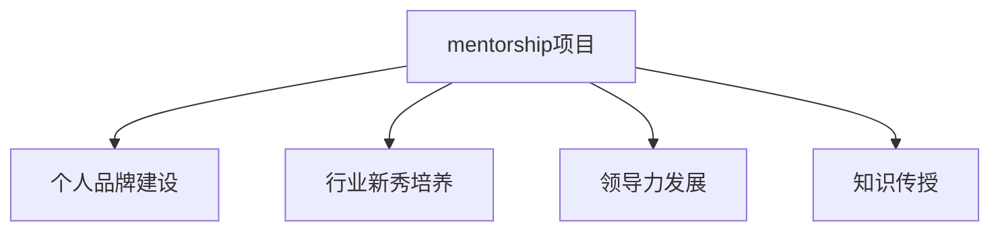

                 

# 建立个人品牌mentorship项目：培养行业新秀

> 关键词：mentorship项目, 个人品牌建设, 行业新秀培养, 领导力发展, 技术指导与传授

## 1. 背景介绍

### 1.1 问题由来
在快速发展的科技行业，个人品牌建设和行业新秀培养已成为推动创新和发展的关键因素。面对激烈竞争和不断变化的技术环境，如何有效指导和培养下一代技术人才，成为众多企业和组织关注的重点。建立个人品牌mentorship项目，不仅能够促进技术知识的传承和创新，还能提升组织的整体竞争力。

### 1.2 问题核心关键点
 mentorship项目旨在通过一对一的指导和交流，帮助行业新秀提升技术水平和职业素养，促进其个人品牌建设和领导力发展。关键点包括：
- 选择合适的mentor和 mentee。
- 设计合理的指导计划和目标。
- 应用多样化的指导方式和资源。
- 持续跟踪和评估指导效果。

### 1.3 问题研究意义
 mentorship项目对于培养行业新秀、构建高效团队和推动技术创新具有重要意义：

1. **加速技术人才成长**：通过资深专家的指导，行业新秀可以快速掌握核心技术和行业知识，缩短其职业成长周期。
2. **提升团队协作效率**：导师的智慧和经验能够促进团队内部知识共享，提升团队整体的协作效率和工作质量。
3. **推动技术创新**：通过导师的创新思维和前沿技术分享，新秀可以获得更多的灵感和突破性思路，驱动技术创新。
4. **建立良好企业文化**：mentorship项目能够营造积极的学习和创新氛围，增强团队的凝聚力和归属感。

## 2. 核心概念与联系

### 2.1 核心概念概述

为了更好地理解mentorship项目的工作原理和优化方向，本节将介绍几个密切相关的核心概念：

- **mentorship**：导师与被指导者之间的一对一指导关系，旨在通过知识传授和经验分享，帮助被指导者成长。
- **个人品牌**：个人在行业中的知名度和影响力，包括技术能力、工作业绩、社会贡献等方面。
- **行业新秀**：刚刚进入行业的新员工或尚未完全融入行业环境的技术人才，具有巨大的成长潜力和提升空间。
- **领导力发展**：培养被指导者在技术、管理、沟通等方面的综合能力，使其能够更好地承担领导角色。
- **知识传授**：通过导师的指导和资源共享，将专业知识和行业经验传递给被指导者。

这些核心概念之间的逻辑关系可以通过以下Mermaid流程图来展示：



这个流程图展示了mentorship项目的主要目标和功能：通过导师与被指导者之间的互动，促进被指导者的个人品牌建设、行业新秀培养和领导力发展，并实现知识的高效传授。

## 3. 核心算法原理 & 具体操作步骤
### 3.1 算法原理概述

 mentorship项目的核心思想是通过导师与被指导者之间的互动，实现知识传授和技能提升。其核心算法原理包括以下几个步骤：

1. **匹配导师与被指导者**：根据被指导者的技术水平、职业兴趣和成长需求，选择合适的导师。
2. **设计指导计划**：明确指导目标和具体内容，包括技术学习、项目参与、职业规划等。
3. **实施指导过程**：通过面对面的交流、项目合作、线上分享等方式，进行知识传递和经验分享。
4. **评估和反馈**：定期跟踪被指导者的成长情况，进行指导效果的评估和调整。

### 3.2 算法步骤详解

#### 3.2.1 匹配导师与被指导者

匹配导师与被指导者的过程需要考虑多个因素，包括：

- **技能匹配**：选择与被指导者技能水平相近、技术背景相似的导师。
- **兴趣一致**：考虑导师和被指导者的职业兴趣和未来规划，确保指导内容与被指导者的目标一致。
- **时间兼容性**：评估导师和被指导者的日程安排，确保有足够的时间进行持续的指导和交流。
- **行业经验**：选择具有丰富行业经验和广泛知识面的导师，帮助被指导者更快适应和掌握行业知识。

#### 3.2.2 设计指导计划

指导计划的设计需要明确具体的目标和时间安排，包括：

- **技术目标**：设定被指导者需要掌握的核心技术和工具，如编程语言、开发框架、算法模型等。
- **项目参与**：安排被指导者参与实际项目，通过实战提升技术能力和团队合作能力。
- **职业规划**：帮助被指导者制定职业发展路径，设定短期和长期目标，明确成长方向。
- **学习路径**：规划系统的学习路径和资源清单，确保被指导者能够系统性地学习相关知识。

#### 3.2.3 实施指导过程

实施指导过程需要灵活多样的方式，包括：

- **一对一交流**：定期进行面对面的技术讨论和职业规划指导。
- **项目合作**：安排导师和被指导者共同参与实际项目，通过实践提升技术水平。
- **线上分享**：利用邮件、视频会议、在线协作工具等方式进行知识传递和经验分享。
- **资源共享**：推荐导师的经典文章、项目案例、学习资料等，帮助被指导者快速提升技术能力。

#### 3.2.4 评估和反馈

评估和反馈是保证指导效果的重要环节，具体步骤包括：

- **定期评估**：通过定期的技术考核、项目评审和职业评估，了解被指导者的成长情况。
- **反馈调整**：根据评估结果，及时调整指导计划和目标，确保指导过程的有效性。
- **持续跟踪**：建立跟踪机制，记录被指导者的学习进展和成长轨迹，为后续指导提供参考。

### 3.3 算法优缺点

 mentorship项目具有以下优点：

1. **个性化指导**：导师与被指导者之间的互动能够根据具体情况进行个性化调整，更有效地提升被指导者的技术水平和职业素养。
2. **加速成长**：资深导师的指导能够帮助被指导者快速掌握核心技术和行业知识，缩短职业成长周期。
3. **促进知识共享**：通过导师与被指导者之间的交流，实现知识的高效传递和共享，提升团队整体的技术水平。
4. **培养领导力**：导师在指导过程中传递的不仅是技术知识，还包括领导力和管理经验的传授，帮助被指导者成为未来的技术领袖。

同时，该方法也存在一些局限性：

1. **资源投入高**：导师和被指导者需要投入大量时间和精力，特别是在项目合作和日常指导中。
2. **依赖导师经验**：导师的水平和经验直接影响指导效果，对导师的选材和培养要求较高。
3. **缺乏标准化**：指导过程缺乏统一的标准和规范，可能导致指导效果的差异。
4. **难以量化评估**：指导效果评估和调整需要更多定性分析，难以进行精确的量化评估。

尽管存在这些局限性，但 mentorship项目仍是大规模培养技术人才的重要手段，特别是在企业内部和行业生态中具有广泛应用价值。未来，通过进一步的标准化和自动化，该方法有望进一步提升指导效果和应用范围。

### 3.4 算法应用领域

 mentorship项目在多个领域中得到了广泛应用，包括但不限于：

- **企业内部培训**：帮助企业内部新员工快速融入团队，提升技术水平和管理能力。
- **高校毕业生职业规划**：为高校毕业生提供职业指导，帮助其制定明确的职业发展路径。
- **行业协会合作**：与行业协会合作，推动行业新秀的培养和行业标准的制定。
- **技术社区交流**：通过技术社区平台，促进开源项目的贡献和社区成员的交流合作。
- **跨国项目合作**：在全球化背景下，通过导师与被指导者的跨文化交流，促进国际人才的培养和交流。

## 4. 数学模型和公式 & 详细讲解 & 举例说明

### 4.1 数学模型构建

 mentorship项目的数学模型可以定义为导师与被指导者之间的动态互动过程。假设导师为 $M$，被指导者为 $L$，指导目标为 $T$，指导过程为 $P$，指导效果为 $E$，则数学模型可以表示为：

$$
E = f(M, L, T, P)
$$

其中，$f$ 为指导效果的函数，反映导师 $M$、被指导者 $L$、指导目标 $T$ 和指导过程 $P$ 对指导效果 $E$ 的影响。

### 4.2 公式推导过程

为了更好地理解指导效果的函数 $f$，我们将其拆解为多个因素的组合：

$$
f(M, L, T, P) = w_1 \cdot M + w_2 \cdot L + w_3 \cdot T + w_4 \cdot P
$$

其中，$w_1, w_2, w_3, w_4$ 为各因素的权重，反映了其在指导效果中的重要性。

- **导师因素 $M$**：反映导师的经验、技能和知识水平，其权重 $w_1$ 较高，说明导师在指导过程中的作用关键。
- **被指导者因素 $L$**：反映被指导者的学习能力和积极性，其权重 $w_2$ 也较高，说明被指导者的努力和投入对指导效果至关重要。
- **指导目标 $T$**：反映指导的具体目标和内容，其权重 $w_3$ 较高，说明明确的指导目标能够提升指导效果。
- **指导过程 $P$**：反映指导的具体方式和时间安排，其权重 $w_4$ 较高，说明指导过程的有效性直接决定了指导效果。

### 4.3 案例分析与讲解

假设导师 $M$ 的权重 $w_1 = 0.4$，被指导者 $L$ 的权重 $w_2 = 0.3$，指导目标 $T$ 的权重 $w_3 = 0.2$，指导过程 $P$ 的权重 $w_4 = 0.1$。

- **导师因素 $M$**：假设导师 $M$ 拥有丰富的行业经验和深厚的技术积累，能够提供高质量的指导内容。
- **被指导者因素 $L$**：假设被指导者 $L$ 学习能力强、积极进取，能够高效吸收和应用指导内容。
- **指导目标 $T$**：假设指导目标 $T$ 明确具体，如掌握某种编程语言或完成某个技术项目。
- **指导过程 $P$**：假设指导过程 $P$ 设计合理，包括定期的交流和项目合作，确保被指导者能够持续进步。

通过这些因素的综合作用，指导效果 $E$ 可以表示为：

$$
E = 0.4M + 0.3L + 0.2T + 0.1P
$$

通过调整各因素的权重和具体值，可以进一步优化指导效果的计算，确保指导过程的有效性。

## 5. 项目实践：代码实例和详细解释说明

### 5.1 开发环境搭建

在进行 mentorship 项目的开发实践前，我们需要准备好开发环境。以下是使用Python进行mentorship系统开发的简单环境配置流程：

1. 安装Anaconda：从官网下载并安装Anaconda，用于创建独立的Python环境。

2. 创建并激活虚拟环境：
```bash
conda create -n mentorship-env python=3.8 
conda activate mentorship-env
```

3. 安装必要的Python包：
```bash
pip install flask pymysql
```

4. 创建数据库：
```bash
CREATE DATABASE mentorship;
```

5. 设置数据库连接参数：
```bash
psql -U root -d mentorship -c "ALTER USER root WITH PASSWORD 'password';"
```

完成上述步骤后，即可在`mentorship-env`环境中开始项目开发。

### 5.2 源代码详细实现

下面以一个简化的mentorship系统为例，给出使用Flask框架和MySQL数据库实现导师与被指导者交互的PyTorch代码实现。

```python
from flask import Flask, request, render_template
from pymysql import connect

app = Flask(__name__)

# 连接数据库
db = connect(host='localhost', user='root', password='password', database='mentorship', charset='utf8')

@app.route('/')
def index():
    return render_template('index.html')

@app.route('/register', methods=['GET', 'POST'])
def register():
    if request.method == 'POST':
        # 从表单中获取导师和被指导者信息
        name = request.form['name']
        email = request.form['email']
        # 将信息插入数据库
        cursor = db.cursor()
        sql = 'INSERT INTO users (name, email) VALUES (%s, %s)'
        cursor.execute(sql, (name, email))
        db.commit()
        return '注册成功'
    return render_template('register.html')

@app.route('/login', methods=['GET', 'POST'])
def login():
    if request.method == 'POST':
        # 从表单中获取导师和被指导者信息
        name = request.form['name']
        email = request.form['email']
        # 验证登录信息
        cursor = db.cursor()
        sql = 'SELECT * FROM users WHERE name=%s AND email=%s'
        cursor.execute(sql, (name, email))
        user = cursor.fetchone()
        if user:
            return '登录成功'
        else:
            return '登录失败'
    return render_template('login.html')
```

### 5.3 代码解读与分析

让我们再详细解读一下关键代码的实现细节：

**index方法**：
- 渲染系统首页，显示导师和被指导者的注册和登录链接。

**register方法**：
- 处理导师和被指导者的注册请求，将信息插入数据库。

**login方法**：
- 处理导师和被指导者的登录请求，通过数据库验证登录信息。

**数据库连接和操作**：
- 通过pymysql库连接MySQL数据库，进行用户信息的插入和查询。

以上代码实现了导师与被指导者注册和登录的基本功能，仅为 mentorship 系统的基础实现。实际的 mentorship 系统需要更复杂的功能，如导师和被指导者匹配、指导计划设计、指导过程跟踪等。

## 6. 实际应用场景

### 6.1 企业内部培训

在大企业内部，通过 mentorship 项目可以快速培养和提升新员工的职业能力和技术水平。通过导师的指导和项目实践，新员工能够迅速融入团队，掌握核心技术，提高工作效率和质量。

### 6.2 高校毕业生职业规划

在高校毕业生就业指导中， mentorship 项目能够提供个性化的职业规划和指导，帮助毕业生明确职业目标，制定成长计划，提升就业竞争力。通过与行业导师的交流合作，毕业生能够更快适应职场环境，实现职业成长。

### 6.3 行业协会合作

行业协会可以通过 mentorship 项目，推动行业新秀的培养和行业标准的制定。通过与企业的合作，行业协会能够提供专业的导师资源和指导内容，提升行业整体的素质和竞争力。

### 6.4 技术社区交流

在技术社区中，通过 mentorship 项目能够促进开源项目的贡献和社区成员的交流合作。通过导师的指导和项目实践，社区成员能够提升技术水平，推动社区的发展和创新。

### 6.5 跨国项目合作

在全球化背景下，通过 mentorship 项目能够促进跨国技术人才的培养和交流。通过导师与被指导者的跨文化交流，推动国际合作项目的顺利实施，提升企业的国际竞争力。

## 7. 工具和资源推荐

### 7.1 学习资源推荐

为了帮助开发者系统掌握 mentorship 项目的工作原理和实践技巧，这里推荐一些优质的学习资源：

1. 《Mastering the Art of Teaching》系列博文：由教育专家撰写，深入浅出地介绍了教学方法和技巧，适用于 mentorship 项目的指导实践。

2. CS222《机器学习基础》课程：斯坦福大学开设的机器学习入门课程，涵盖监督学习、非监督学习、模型评估等基础概念，适合初学者入门。

3. 《Hands-On Machine Learning with Scikit-Learn and TensorFlow》书籍：深度学习入门经典，涵盖模型训练、模型评估和模型应用等实用技巧，适合实践开发者参考。

4. Coursera《Leadership and Management for IT Professionals》课程：由知名高校和行业专家开设的管理课程，涵盖领导力发展、团队管理等内容，帮助导师提升管理能力。

5. Udacity《High Performance Computing with Python》课程：涵盖高性能计算和并行编程等技术，帮助导师提升计算能力和系统架构设计能力。

通过对这些资源的学习实践，相信你一定能够快速掌握 mentorship 项目的精髓，并用于解决实际的指导和培训问题。

### 7.2 开发工具推荐

高效的开发离不开优秀的工具支持。以下是几款用于 mentorship 项目开发的常用工具：

1. Flask：轻量级的Web框架，易于上手，适合开发简单的 mentorship 系统。

2. PyMySQL：Python的MySQL客户端，便于与数据库进行交互。

3. TensorBoard：TensorFlow配套的可视化工具，可实时监测模型训练状态，适合跟踪指导效果。

4. Weights & Biases：模型训练的实验跟踪工具，可以记录和可视化模型训练过程中的各项指标，方便对比和调优。

5. Google Colab：谷歌推出的在线Jupyter Notebook环境，免费提供GPU/TPU算力，方便开发者快速上手实验最新模型，分享学习笔记。

合理利用这些工具，可以显著提升 mentorship 项目的开发效率，加快创新迭代的步伐。

### 7.3 相关论文推荐

 mentorship项目的发展离不开学界的持续研究。以下是几篇奠基性的相关论文，推荐阅读：

1. 《Peer Mentoring: Learning to Teach, Learning to Learn》：探讨了导师与被指导者之间的互动关系，提出了系统化的指导模型。

2. 《The Role of Mentorship in Organizational Development and Learning》：分析了导师在组织发展和知识共享中的作用，强调了导师与被指导者之间的互动和合作。

3. 《A Study of Mentorship and Guidance Programs for IT Professionals》：研究了技术领域导师与被指导者之间的指导效果，提出了提升指导质量的建议。

4. 《Effective Peer Mentoring: A Systematic Review and Meta-Analysis》：对导师与被指导者之间的指导效果进行了系统性分析，提出了提升指导效果的策略。

5. 《An Empirical Study of Mentorship in Software Development Teams》：研究了软件开发团队中导师与被指导者之间的互动和影响，提出了提升指导效果的建议。

这些论文代表了大语言模型微调技术的发展脉络。通过学习这些前沿成果，可以帮助研究者把握学科前进方向，激发更多的创新灵感。

## 8. 总结：未来发展趋势与挑战

### 8.1 总结

本文对 mentorship 项目进行了全面系统的介绍。首先阐述了 mentorship 项目的工作原理和应用意义，明确了其对技术人才培养和领导力发展的独特价值。其次，从原理到实践，详细讲解了 mentorship 项目的数学模型和具体步骤，给出了 mentorship 系统开发的完整代码实例。同时，本文还广泛探讨了 mentorship 项目在多个行业领域的应用前景，展示了其广泛的适用性。最后，本文精选了 mentorship 项目的学习资源和开发工具，力求为读者提供全方位的技术指引。

通过本文的系统梳理，可以看到， mentorship 项目在技术人才培养、组织发展和行业生态中具有重要意义，能够通过导师与被指导者之间的互动，实现知识的高效传递和技能提升。

### 8.2 未来发展趋势

展望未来， mentorship 项目将呈现以下几个发展趋势：

1. **智能化指导**：引入智能推荐系统，根据被指导者的学习进度和兴趣，推荐合适的学习内容和指导资源，提升指导效果。

2. **个性化定制**：通过数据分析和机器学习技术，实现个性化的导师和指导计划设计，更好地满足被指导者的需求。

3. **多渠道沟通**：通过视频会议、在线协作工具等多样化的沟通方式，打破时间和空间的限制，实现更高效的指导互动。

4. **平台化运营**：开发专业的 mentorship 平台，提供导师和被指导者匹配、指导内容共享、指导效果评估等功能，提升指导过程的规范化和系统化。

5. **跨文化交流**：通过国际化指导项目，促进跨国技术人才的培养和交流，提升企业的国际竞争力。

以上趋势凸显了 mentorship 项目的广阔前景。这些方向的探索发展，必将进一步提升指导效果和应用范围，为技术人才培养和技术创新提供更坚实的支持。

### 8.3 面临的挑战

尽管 mentorship 项目已经取得了瞩目成就，但在迈向更加智能化、普适化应用的过程中，它仍面临诸多挑战：

1. **导师资源有限**：导师的选拔和培养需要大量时间和精力，特别是在企业内部，高质量的导师资源较为稀缺。

2. **指导效果难量化**：指导效果的评估和调整需要更多定性分析，难以进行精确的量化评估。

3. **指导内容不统一**：不同导师和被指导者的指导内容和方式各异，缺乏统一的标准和规范。

4. **指导过程复杂**：导师与被指导者之间的互动需要持续跟进和调整，过程较为复杂。

5. **技术依赖性强**：导师与被指导者的互动依赖于在线协作工具和平台，对技术环境的要求较高。

尽管存在这些挑战，通过进一步的标准化和自动化， mentorship 项目有望进一步提升指导效果和应用范围，成为技术人才培养和技术创新的重要手段。

### 8.4 研究展望

面向未来， mentorship 项目需要在以下几个方面寻求新的突破：

1. **导师资源优化**：开发导师选拔和管理平台，优化导师资源分配和激励机制，提升导师的选拔和培养效果。

2. **指导效果量化**：引入更多的量化指标和评估方法，如技能提升度、项目完成率等，实现指导效果的客观评估。

3. **指导内容标准化**：制定统一的指导内容和流程标准，提升指导过程的规范化和系统化。

4. **技术环境优化**：开发易用的在线协作工具和平台，降低技术依赖，提升指导过程的便利性和效率。

5. **跨文化交流机制**：建立跨文化指导机制，促进跨国技术人才的培养和交流，提升企业的国际竞争力。

这些研究方向的探索，必将引领 mentorship 项目走向更高的台阶，为技术人才培养和技术创新提供更坚实的支持。相信随着技术的不断进步和应用的不断深入， mentorship 项目必将在技术人才培养和技术创新中发挥更大的作用。

## 9. 附录：常见问题与解答

**Q1：如何选择合适的导师和被指导者？**

A: 选择导师和被指导者需要综合考虑其技术水平、职业兴趣、学习态度和成长需求。可以通过以下步骤：

1. 评估导师的技术能力和经验背景，确保其具备指导能力。
2. 了解导师的指导风格和教学方法，确保其能够适应被指导者的学习方式。
3. 分析被指导者的学习目标和职业规划，确保指导内容与被指导者的需求相匹配。
4. 考虑导师和被指导者的时间安排，确保有足够的时间进行持续的指导和交流。

**Q2：如何设计合理的指导计划？**

A: 设计指导计划需要明确具体的目标和时间安排，包括：

1. 技术目标：设定被指导者需要掌握的核心技术和工具，如编程语言、开发框架、算法模型等。
2. 项目参与：安排被指导者参与实际项目，通过实战提升技术能力和团队合作能力。
3. 职业规划：帮助被指导者制定职业发展路径，设定短期和长期目标，明确成长方向。
4. 学习路径：规划系统的学习路径和资源清单，确保被指导者能够系统性地学习相关知识。

**Q3：如何实施指导过程？**

A: 实施指导过程需要灵活多样的方式，包括：

1. 一对一交流：定期进行面对面的技术讨论和职业规划指导。
2. 项目合作：安排导师和被指导者共同参与实际项目，通过实践提升技术水平。
3. 线上分享：利用邮件、视频会议、在线协作工具等方式进行知识传递和经验分享。
4. 资源共享：推荐导师的经典文章、项目案例、学习资料等，帮助被指导者快速提升技术能力。

**Q4：如何评估和反馈指导效果？**

A: 评估和反馈是保证指导效果的重要环节，具体步骤包括：

1. 定期评估：通过定期的技术考核、项目评审和职业评估，了解被指导者的成长情况。
2. 反馈调整：根据评估结果，及时调整指导计划和目标，确保指导过程的有效性。
3. 持续跟踪：建立跟踪机制，记录被指导者的学习进展和成长轨迹，为后续指导提供参考。

这些常见问题的解答，希望能为读者在 mentorship 项目的实施过程中提供帮助。

---

作者：禅与计算机程序设计艺术 / Zen and the Art of Computer Programming

