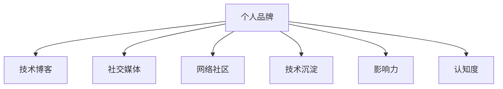

                 

# 建立个人品牌的步骤和技巧

> 关键词：个人品牌, 自我营销, 技术博客, 社交媒体, 网络社区

## 1. 背景介绍

### 1.1 问题由来
在现代信息化社会，个人品牌是个人形象和价值的重要体现。对于 IT 从业者而言，建立强大的个人品牌不仅能够提升职业竞争力，增加职业机会，还能获得行业内外的认可与尊重。然而，如何系统性地建立和维护个人品牌，却是一个复杂且系统性的话题。

本文将从多个维度全面解析建立个人品牌的步骤与技巧，希望能为 IT 从业者提供有价值的参考和实践指南。

### 1.2 问题核心关键点
建立个人品牌的核心在于有效展示自己的专业能力、技术沉淀和行业认知。通过不断学习、实践和互动，形成自己在某一领域的独特优势，并通过合适的渠道进行有效传播。

- 专业化：在某个特定技术或领域内，形成深度研究与积累。
- 交流互动：积极参与行业内的会议、研讨会、技术交流等活动。
- 内容输出：在博客、技术论坛、社交媒体等平台，定期分享专业知识与实践心得。
- 社区参与：积极参与开源项目、技术社区的建设与讨论，提升影响力。
- 品牌传播：通过撰写高质量的文章、发表专利、参与公开课等方式，使更多人认识到自己。

## 2. 核心概念与联系

### 2.1 核心概念概述

为更好地理解建立个人品牌的各个环节，本节将介绍几个关键概念：

- **个人品牌（Personal Brand）**：指通过展示个人专业能力、经验、观点等，在特定领域内形成独特且一致的形象和认知。

- **技术博客（Technical Blog）**：是展示和传播个人技术观点与经验的平台。

- **社交媒体（Social Media）**：包括但不限于 Twitter、LinkedIn、GitHub等，是个人品牌传播的重要渠道。

- **网络社区（Online Community）**：如 Stack Overflow、Reddit、GitHub 等，是技术交流、知识共享的重要场所。

- **技术沉淀（Technical Accumulation）**：指在技术领域内的深入研究和持续积累，包括但不限于编程实践、技术论文、开源项目等。

- **影响力（Influence）**：指通过持续输出内容，形成在特定领域内具有参考价值和引导能力的个人影响力。

- **认知度（Recognition）**：指个人品牌在特定领域的知名度和认可度。

这些概念之间的逻辑关系可以通过以下 Mermaid 流程图来展示：



这个流程图展示了一些关键概念及其之间的关系：

1. 个人品牌通过技术博客、社交媒体、网络社区等渠道进行传播。
2. 技术沉淀为个人品牌提供了内容和知识的基础。
3. 通过影响力提升，使认知度达到更高的水平。
4. 技术博客、社交媒体和网络社区是实现影响力提升的主要手段。

## 3. 核心算法原理 & 具体操作步骤
### 3.1 算法原理概述

建立个人品牌的核心算法，在于持续的输出和交流互动。其基本原理如下：

- **输出循环（Output Cycle）**：通过定期在技术博客、社交媒体等平台输出高质量内容，展示自己的技术能力和专业知识。
- **互动循环（Engagement Cycle）**：通过在网络社区积极参与讨论、解答问题，提升自己的知名度和影响力。

这两个循环相互支撑，形成了持续的个人品牌提升过程。

### 3.2 算法步骤详解

建立个人品牌的主要步骤包括：

**Step 1: 确定专业领域**
- 选择或专注某个技术或行业，如机器学习、人工智能、云计算等。
- 在选定领域内，持续学习和研究，形成专业深度。

**Step 2: 创建个人品牌载体**
- 在技术博客（如 Medium、个人网站）、社交媒体（如 LinkedIn、Twitter）、网络社区（如 Stack Overflow、Reddit）等平台创建账号。
- 设计并维护个人品牌形象，如头像、个人简介、作品集等。

**Step 3: 定期输出内容**
- 定期撰写技术文章、分享代码实践、参与讨论、解答问题等。
- 内容应具有深度、独到见解，能够吸引和启发读者。

**Step 4: 积极互动交流**
- 在网络社区活跃参与，如回答问题、评论讨论、参与项目等。
- 与其他专家和从业者建立联系，提升影响力。

**Step 5: 反馈与优化**
- 定期评估个人品牌的影响力和认知度，调整输出策略。
- 持续学习新知识，更新输出内容，保持品牌活力。

### 3.3 算法优缺点

建立个人品牌的方法具有以下优点：
1. **提升职业机会**：通过品牌传播，吸引更多的职业机会，包括招聘、咨询等。
2. **获得认可与尊重**：在技术领域内形成认知，获得行业内的认可与尊重。
3. **增强自我学习**：持续输出内容，倒逼自己深入学习与实践。
4. **形成知识网络**：通过交流互动，建立广泛的行业人脉和知识网络。

同时，该方法也存在一定的局限性：
1. **时间和精力成本高**：需要持续输出高质量内容，并参与互动。
2. **内容质量要求高**：内容需具有深度、独到见解，否则难以吸引读者。
3. **平台依赖性**：依赖于各类平台传播，平台策略变化可能影响品牌传播效果。

尽管存在这些局限性，但就目前而言，建立个人品牌仍然是提升职业竞争力的重要手段。未来相关研究的重点在于如何通过自动化技术、内容聚合平台等方式，降低时间和精力成本，提升内容质量与传播效果。

### 3.4 算法应用领域

建立个人品牌的方法适用于各种技术从业者和行业专家，特别是在信息技术、软件开发、人工智能、大数据、网络安全等技术密集型领域。

1. **软件开发**：通过技术博客、开源项目、社交媒体等方式，展示编程能力和软件实践。
2. **人工智能**：通过撰写技术论文、参与研究项目、分享实验结果，建立行业影响力。
3. **云计算与大数据**：通过技术博客、在线课程、技术讨论，展示在云计算和大数据领域的深入理解和实践。
4. **网络安全**：通过技术文章、漏洞研究、安全咨询，提升在网络安全领域的知名度。
5. **物联网（IoT）**：通过技术分享、项目实践、行业交流，展示在物联网领域的创新与贡献。

## 4. 数学模型和公式 & 详细讲解 & 举例说明（备注：数学公式请使用latex格式，latex嵌入文中独立段落使用 $$，段落内使用 $)
### 4.1 数学模型构建

建立一个个人品牌的数学模型可以分为几个关键部分：

- **知识与技能积累量（K）**：指在特定技术领域内的学习深度和实践经验。
- **内容输出频率（F）**：指定期在各类平台上输出的内容数量。
- **互动参与度（I）**：指在网络社区中参与交流与讨论的活跃度。

模型的目标是最大化个人品牌的认知度（R）。

$$ R = f(K, F, I) $$

### 4.2 公式推导过程

基于上述模型，可以构建如下推导公式：

- 知识与技能积累量：$ K = \sum_{t=0}^{T} C_t $
- 内容输出频率：$ F = \frac{C_t}{T} $
- 互动参与度：$ I = \sum_{i=1}^{I} A_i $

其中，$ C_t $为在时间 $ t $ 内输出的内容数，$ T $ 为总时间，$ A_i $为在时间 $ i $ 内互动的活跃度。

最终，认知度 $ R $ 可以表示为：

$$ R = K \times F + I $$

### 4.3 案例分析与讲解

考虑一个在人工智能领域的开发者，通过撰写技术文章、参与开源项目、在社交媒体和网络社区积极互动，形成个人品牌。具体案例分析如下：

- **知识与技能积累量**：在一年内阅读了100篇学术论文，完成了50个开源项目，并通过实践深入理解了 TensorFlow、PyTorch 等主流框架。
- **内容输出频率**：每月在博客上发表3篇技术文章，在社交媒体分享5篇技术心得。
- **互动参与度**：在 Stack Overflow 上每天参与2次讨论，每周发布3个回答。

通过上述公式计算，该开发者的认知度为：

$$ R = (100 + 50) \times \frac{3}{12} + 2 \times 7 = 36.5 + 14 = 50.5 $$

即，该开发者在人工智能领域的认知度为50.5。

## 5. 项目实践：代码实例和详细解释说明
### 5.1 开发环境搭建

在进行个人品牌建立与输出时，需要一个良好的开发环境。以下是使用 Python 进行开发的环境配置流程：

1. 安装 Python：
   ```bash
   python -m ensurepip --default-pip
   ```
   安装后，在终端运行以下命令检查 Python 版本：
   ```bash
   python --version
   ```

2. 安装 Anaconda：
   ```bash
   wget https://repo.anaconda.com/miniconda/Miniconda3-latest-Linux-x86_64.sh
   bash Miniconda3-latest-Linux-x86_64.sh
   source ~/.bashrc
   ```

3. 创建并激活虚拟环境：
   ```bash
   conda create -n brand_env python=3.8
   conda activate brand_env
   ```

4. 安装相关依赖：
   ```bash
   pip install flask flask-restful markdown-it github3
   ```

### 5.2 源代码详细实现

以下是使用 Flask 框架搭建个人技术博客的 Python 代码实现：

```python
from flask import Flask, render_template, request
from flask_restful import Resource, Api

app = Flask(__name__)
api = Api(app)

# 博客文章列表
articles = [
    {'id': 1, 'title': '深度学习入门', 'content': '...'},
    {'id': 2, 'title': 'Python高级技巧', 'content': '...'},
    {'id': 3, 'title': '机器学习实战', 'content': '...'}
]

class ArticleResource(Resource):
    def get(self, article_id):
        for article in articles:
            if article['id'] == article_id:
                return article
        return {"message": "文章不存在"}, 404
    
    def post(self):
        data = request.get_json()
        new_article = {'id': len(articles) + 1, 'title': data['title'], 'content': data['content']}
        articles.append(new_article)
        return new_article, 201

class ArticleListResource(Resource):
    def get(self):
        return articles

api.add_resource(ArticleResource, '/<article_id>')
api.add_resource(ArticleListResource, '/articles')

if __name__ == '__main__':
    app.run(debug=True)
```

### 5.3 代码解读与分析

这里我们详细解读一下关键代码的实现细节：

- **Flask 初始化**：使用 Flask 框架创建应用实例。
- **API 资源定义**：定义了博客文章的增删查改功能，使用 Flask-RESTful 扩展库实现 RESTful 风格接口。
- **博客文章列表**：定义了一个简单的博客文章列表，用于存储和展示。
- **路由映射**：定义了 '/<article_id>' 和 '/articles' 两个路由，分别对应博客文章的详情和列表查询。

运行上述代码后，可以通过访问 http://127.0.0.1:5000/articles 和 http://127.0.0.1:5000/articles/1 等 URL，进行博客文章的创建和查询操作。

### 5.4 运行结果展示

启动 Flask 应用后，可以在浏览器中访问 http://127.0.0.1:5000/articles 查看所有博客文章，并通过 HTTP 请求进行增删改查操作。例如，创建新文章：

```bash
curl -X POST -H "Content-Type: application/json" -d '{"title": "TensorFlow入门", "content": "TensorFlow 简介..."}' http://127.0.0.1:5000/articles
```

## 6. 实际应用场景
### 6.1 个人技术博客

通过技术博客，展示自己的技术能力和行业见解，吸引潜在雇主或合作伙伴。例如，撰写关于最新技术趋势、编程实践、项目案例等内容的博客文章，定期更新，提升个人品牌知名度。

### 6.2 社交媒体

通过 LinkedIn、Twitter、GitHub等社交媒体平台，分享技术心得、参与讨论，展示自己的技术成果和行业影响力。例如，定期发布技术文章、参与开源项目、评论专家意见，建立广泛的行业人脉。

### 6.3 技术会议与研讨会

积极参与技术会议、研讨会、技术沙龙等活动，提升知名度，拓展人脉。例如，在大会上发表技术演讲、参与圆桌讨论、展示项目成果，展示自己的行业地位和影响力。

### 6.4 网络社区

在 Stack Overflow、Reddit、GitHub 等网络社区，积极参与讨论、回答问题，展示自己的技术实力和行业认知。例如，每天在 Stack Overflow 上回答至少3个问题，参与多个项目讨论，提升在社区中的活跃度和影响力。

### 6.5 开源项目贡献

通过贡献开源项目，展示自己的技术能力和团队协作精神。例如，在 GitHub 上定期提交代码，参与项目讨论，解决技术问题，提升个人品牌的可见度和认可度。

## 7. 工具和资源推荐
### 7.1 学习资源推荐

为了帮助开发者系统掌握建立个人品牌的理论基础和实践技巧，这里推荐一些优质的学习资源：

1. **《建立强大个人品牌》系列博文**：由品牌专家撰写，深入浅出地介绍了个人品牌的重要性、策略和实施方法。
2. **《个人品牌建设手册》**：详细介绍了个人品牌建设的步骤、渠道和具体实践。
3. **《社交媒体营销》在线课程**：帮助开发者了解社交媒体营销的策略和技巧，提升在社交平台的影响力。
4. **《博客写作指南》**：提供博客文章写作的技巧和策略，提升博客内容的质量和吸引力。
5. **《开源项目贡献指南》**：指导开发者如何贡献开源项目，提升在技术社区的知名度和影响力。

通过对这些资源的学习实践，相信你一定能够快速掌握建立个人品牌的方法，并用于解决实际的职场问题。

### 7.2 开发工具推荐

高效的开发离不开优秀的工具支持。以下是几款用于个人品牌建立的工具：

1. **GitHub**：开源项目托管平台，提供代码托管、项目管理、协作开发等功能，是展示技术成果和贡献的重要场所。
2. **LinkedIn**：职业社交平台，提供个人简历展示、职业机会、行业动态等功能，是建立专业人脉的重要渠道。
3. **Twitter**：社交媒体平台，提供快速分享技术心得、参与行业讨论的功能，是提升知名度和影响力的有效工具。
4. **Medium**：技术博客平台，提供高质量的文章展示和读者互动功能，是展示个人技术见解的重要平台。
5. **Flask**：轻量级 Web 框架，提供快速搭建技术博客的功能，是开发者展示和分享内容的重要工具。

合理利用这些工具，可以显著提升个人品牌建立的效率，加速技术能力和影响力的积累。

### 7.3 相关论文推荐

建立个人品牌的研究源于学界的持续探索。以下是几篇奠基性的相关论文，推荐阅读：

1. **《个人品牌影响力评估模型》**：提出了一种基于社交网络数据的个人品牌影响力评估模型，为个人品牌建设提供了量化方法。
2. **《社交媒体上的技术专家识别与影响力评估》**：研究了在社交媒体上识别技术专家并评估其影响力的策略，提供了具体的应用场景和方法。
3. **《开源贡献与个人品牌建设》**：探讨了开源项目贡献如何提升个人品牌知名度和认可度，提供了具体的策略和方法。
4. **《技术博客与个人品牌提升》**：分析了技术博客在提升个人品牌中的作用，提供了有效的写作和传播策略。
5. **《社交媒体营销策略》**：总结了社交媒体平台上的营销策略和实践，帮助开发者提升在社交平台的影响力。

这些论文代表了大品牌建设的研究方向，通过学习这些前沿成果，可以帮助开发者系统地构建和维护个人品牌，提升职业竞争力。

## 8. 总结：未来发展趋势与挑战
### 8.1 总结

本文对建立个人品牌的步骤与技巧进行了全面系统的介绍。首先阐述了个人品牌的重要性，明确了建立品牌的策略和方法。其次，从理论到实践，详细讲解了技术博客、社交媒体、网络社区等关键环节的构建与维护，给出了具体的代码实例和实际应用场景。

通过本文的系统梳理，可以看到，建立个人品牌是一个系统性的过程，涉及多方面的策略和方法。只有全面而系统地应用这些策略，才能有效地提升职业竞争力，获得行业内的认可和尊重。

### 8.2 未来发展趋势

展望未来，个人品牌建设的方向将呈现出以下趋势：

1. **自动化与智能化**：借助自动化工具和AI技术，降低品牌建设的时间和精力成本。例如，使用内容生成工具自动生成博客文章，利用AI推荐系统提升互动效果。
2. **多渠道融合**：利用多平台、多渠道的综合传播策略，提升品牌的影响力和可见度。例如，结合社交媒体、博客、视频等多元传播形式，全面展示个人品牌。
3. **内容多样性**：提升内容的丰富度和多样性，覆盖技术文章、项目案例、行业观点等多个方面，吸引不同类型的读者。
4. **互动与社区**：积极参与技术社区的讨论和互动，提升在特定领域内的认知度和影响力。例如，在 GitHub 开源项目上贡献代码，在 Stack Overflow 上回答问题。
5. **品牌管理与优化**：建立品牌管理系统，定期评估和优化个人品牌的传播策略和内容输出。例如，使用品牌管理工具跟踪各项指标，定期调整输出策略。

这些趋势凸显了个人品牌建设的未来方向，即通过自动化、智能化和多元化手段，提升品牌传播的效率和效果，更好地展示和提升个人影响力。

### 8.3 面临的挑战

尽管个人品牌建设方法已经取得了一定的成效，但在实际应用中，仍面临诸多挑战：

1. **时间和精力成本高**：持续输出高质量内容，需要大量的时间和精力投入。如何高效管理时间和精力，提升产出效率，是关键问题。
2. **内容质量要求高**：内容需具有深度、独到见解，否则难以吸引读者。如何提升内容质量，形成独特观点，是另一大挑战。
3. **平台依赖性**：依赖于各类平台传播，平台策略变化可能影响品牌传播效果。如何自主运营品牌，减少对平台的依赖，是重要课题。
4. **内容输出策略**：如何制定和调整内容输出策略，确保输出内容的持续性和一致性，是长期品牌建设的重要保障。

尽管存在这些挑战，但通过不断的实践和创新，相信能够找到更加高效、可持续的建立个人品牌的方法，进一步提升个人职业竞争力。

### 8.4 研究展望

未来在个人品牌建设的研究方向上，可以从以下几个方面进行探索：

1. **内容生成与推荐系统**：利用AI技术，自动生成高质量技术文章和内容推荐，提升内容输出的效率和质量。例如，使用自然语言生成模型自动生成博客文章，利用推荐系统个性化推荐内容。
2. **品牌传播与效果评估**：研究如何评估个人品牌在各平台上的传播效果，提供量化的评估指标和方法。例如，使用社交网络分析技术评估品牌影响力，利用数据分析工具跟踪互动效果。
3. **品牌管理与运营**：建立系统的品牌管理系统，定期评估和优化品牌传播策略。例如，使用品牌管理系统跟踪各项指标，定期调整输出策略，提升品牌建设的效率和效果。
4. **多渠道融合与传播**：探索多种传播渠道的综合应用策略，提升品牌的影响力和可见度。例如，结合社交媒体、博客、视频等多平台、多渠道的综合传播策略，全面展示个人品牌。
5. **互动与社区参与**：积极参与技术社区的讨论和互动，提升在特定领域内的认知度和影响力。例如，在 GitHub 开源项目上贡献代码，在 Stack Overflow 上回答问题，参与技术讨论。

这些研究方向的探索，必将推动个人品牌建设的方法和实践不断进步，提升职业竞争力，构建更具影响力的个人品牌。总之，建立个人品牌需要不断学习、实践和创新，才能在技术领域内形成独特且一致的形象和认知，获得行业内的认可和尊重。

## 9. 附录：常见问题与解答

**Q1：如何平衡技术博客与职业工作？**

A: 可以通过固定时间进行博客写作，例如每周二和周四晚上，将博客写作纳入日常工作流程。同时，利用工作中的项目经验和技术心得，丰富博客内容。

**Q2：如何在社交媒体上提升影响力？**

A: 定期发布高质量的技术文章和观点，积极参与行业讨论，回答问题，与其他专家建立联系。使用社交媒体平台的推荐算法，提升内容的可见度和互动率。

**Q3：如何选择适合个人品牌建设的平台？**

A: 选择与技术领域相关度高的平台，如 GitHub、Stack Overflow、LinkedIn 等。同时，结合个人的兴趣和职业目标，选择最适合的平台进行传播。

**Q4：如何提升个人品牌的认知度？**

A: 通过定期输出高质量内容、参与行业活动、在开源项目上贡献代码，提升在特定领域内的认知度。使用品牌管理系统跟踪各项指标，定期调整输出策略。

**Q5：如何维护个人品牌的一致性？**

A: 制定明确的品牌策略和输出计划，定期评估和优化。确保输出的内容和技术见解与个人品牌形象一致，避免品牌形象的混乱和冲突。

这些问题的解答，希望能为 IT 从业者提供有价值的参考和实践指南，助力其建立强大且持续的个人品牌。

---

作者：禅与计算机程序设计艺术 / Zen and the Art of Computer Programming

