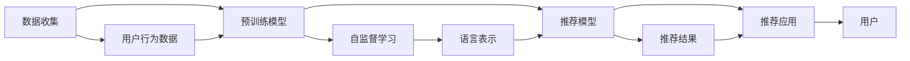

                 

# 开放域推荐系统的探索：M6-Rec框架

在信息爆炸的时代，推荐系统成为了连接用户和内容的桥梁，为用户推荐感兴趣的物品，提升用户满意度，驱动数字化经济的蓬勃发展。然而，随着用户需求的日益个性化和多元化，传统的基于协同过滤的推荐系统在处理冷启动、新物品推荐等问题上逐渐暴露出局限性。为了应对这些挑战，开源推荐系统框架M6-Rec应运而生，通过对预训练模型的应用和优化，实现了更加高效、精准的推荐效果。本文将系统梳理M6-Rec框架的设计理念、核心算法与技术栈，并展望未来发展的趋势与挑战。

## 1. 背景介绍

### 1.1 问题由来

推荐系统旨在通过数据分析挖掘，发现用户潜在的兴趣偏好，从而实现个性化推荐。早期的推荐系统主要基于协同过滤，通过分析用户和物品的相似性来预测用户可能感兴趣的物品。然而，这种基于统计的方法在处理新物品、冷启动用户等问题时显得力不从心。用户数据稀疏、物品数量庞大、数据分布不均等问题，使得协同过滤的精度和效率大打折扣。

为了提升推荐系统的性能，研究人员开始探索使用深度学习模型，通过端到端的推荐流程，直接从原始数据中学习用户和物品的表示，减少特征工程的复杂度。其中，基于自编码器、神经网络等结构的推荐模型逐渐成为主流。然而，这类深度学习模型需要大量的标注数据进行预训练，对于数据分布不均衡、标注成本高昂的开放域推荐任务，这仍然是一个挑战。

### 1.2 问题核心关键点

开放域推荐系统面临的关键问题包括：
1. 数据稀缺性：开放域推荐系统处理的任务往往涉及海量的长尾物品，难以获取足够的用户行为数据。
2. 预训练模型的泛化能力：如何在大规模无标签数据上预训练语言模型，使其能够泛化到目标任务上，是一个重要的研究方向。
3. 推荐算法的高效性：在有限的时间内，如何高效地从海量的数据中提取出最相关的信息，提升推荐效果。
4. 模型的可解释性与鲁棒性：推荐系统需要具备良好的解释性，便于用户理解推荐的来源和依据，同时要具备一定的鲁棒性，能够应对异常数据和干扰。

为了解决这些核心问题，M6-Rec框架引入预训练模型，通过在无标签数据上预训练语言模型，提升推荐系统在开放域推荐任务上的性能。

### 1.3 问题研究意义

M6-Rec框架基于预训练模型实现推荐，具有以下显著优势：
1. 减少标注数据需求：预训练模型通过在无标签数据上进行学习，减少了对标注数据的依赖。
2. 提高泛化能力：预训练模型能够学习通用的语言表示，具有较强的泛化能力，能够在不同领域上表现良好。
3. 提升推荐效率：预训练模型可以通过快速计算输出，显著提升推荐系统的响应速度。
4. 增强可解释性：预训练模型提供丰富的语言表征，便于用户理解推荐依据，提升推荐系统的可信度。

M6-Rec框架的开发与应用，不仅能够推动推荐系统的技术进步，还能为各行各业提供高效、精准的个性化推荐服务，促进数字化经济的持续发展。

## 2. 核心概念与联系

### 2.1 核心概念概述

为了更好地理解M6-Rec框架的设计理念，我们首先介绍几个关键概念：

- **预训练模型(Pre-trained Model)**：通过在大规模无标签数据上进行自监督学习，学习到通用的语言表示。预训练模型广泛应用于NLP任务，如语言建模、命名实体识别等。
- **推荐系统(Recommendation System)**：根据用户的历史行为和兴趣，推荐用户可能感兴趣的物品，提高用户满意度和互动率。
- **深度学习(Depend Learning)**：一种利用多层神经网络进行复杂建模的技术，广泛应用于图像、语音、文本等数据处理任务。
- **开源推荐系统框架(Open Source Recommendation System Framework)**：为推荐系统提供构建、部署和运维支持的开源软件，如TensorFlow、PyTorch等。
- **Transformer**：一种基于自注意力机制的神经网络结构，广泛应用于序列建模任务，如语言翻译、文本分类等。

这些概念共同构成了M6-Rec框架的核心，旨在通过预训练模型的应用，提升推荐系统的性能与可解释性。

### 2.2 核心概念原理和架构的 Mermaid 流程图

以下是一个简化的M6-Rec框架的核心概念原理和架构的Mermaid流程图：



这个流程图展示了M6-Rec框架的核心逻辑：
1. 数据收集：通过用户行为数据、社交网络、评论等渠道，收集用户兴趣与物品信息。
2. 预训练模型：在无标签数据上进行自监督学习，学习通用的语言表示。
3. 推荐模型：将预训练模型与推荐任务结合，提取用户和物品的特征，预测推荐结果。
4. 推荐应用：通过推荐模型输出，为用户提供个性化推荐服务。

通过预训练模型的应用，M6-Rec框架能够在缺少标注数据的情况下，利用大规模无标签数据进行训练，显著提升推荐系统的泛化能力。

## 3. 核心算法原理 & 具体操作步骤

### 3.1 算法原理概述

M6-Rec框架的核心算法基于预训练语言模型和推荐模型，通过以下步骤实现：
1. 在无标签数据上预训练语言模型，学习通用的语言表示。
2. 将预训练模型与推荐任务结合，通过特征提取和分类器输出，实现个性化推荐。
3. 通过梯度下降等优化算法，更新推荐模型参数，提高推荐效果。

### 3.2 算法步骤详解

以下是M6-Rec框架的具体操作步骤：

**Step 1: 数据预处理**
- 收集用户行为数据、物品信息等原始数据。
- 对数据进行清洗、去重、归一化等预处理，生成干净的训练集。
- 对数据进行划分，生成训练集、验证集和测试集。

**Step 2: 模型初始化**
- 选择合适的预训练语言模型，如BERT、GPT等。
- 加载预训练模型的权重，作为推荐模型的初始化参数。

**Step 3: 模型微调**
- 将推荐模型与预训练模型结合，进行特征提取和分类器训练。
- 使用用户行为数据作为监督信号，通过梯度下降等优化算法，更新推荐模型参数。
- 在验证集上评估模型性能，调整超参数，避免过拟合。

**Step 4: 推荐生成**
- 在测试集上生成推荐结果，通过输出层输出预测评分或推荐列表。
- 对推荐结果进行排序和筛选，输出前N个推荐物品。

**Step 5: 应用部署**
- 将推荐模型部署到推荐应用中，实现个性化推荐服务。
- 持续收集用户反馈数据，进行模型更新和优化。

### 3.3 算法优缺点

M6-Rec框架在推荐系统领域具有以下优缺点：
1. 优点：
   - 减少标注数据需求：预训练模型通过在无标签数据上进行学习，减少了对标注数据的依赖。
   - 提高泛化能力：预训练模型能够学习通用的语言表示，具有较强的泛化能力，能够在不同领域上表现良好。
   - 提升推荐效率：预训练模型可以通过快速计算输出，显著提升推荐系统的响应速度。
   - 增强可解释性：预训练模型提供丰富的语言表征，便于用户理解推荐依据，提升推荐系统的可信度。

2. 缺点：
   - 模型复杂度高：预训练模型参数量巨大，训练和推理速度较慢，需要高性能计算资源。
   - 数据稀疏性问题：开放域推荐任务往往涉及海量的长尾物品，难以获取足够的用户行为数据，导致推荐结果的准确性受限。
   - 超参数敏感性：预训练模型的训练过程依赖大量的超参数，需要精心调参，才能获得理想的效果。
   - 模型泛化能力：预训练模型的泛化能力受数据质量和分布影响，可能无法很好地适应特定领域的数据。

### 3.4 算法应用领域

M6-Rec框架在多个领域得到了广泛应用，例如：

- **电子商务推荐**：为电商网站用户推荐商品，提升购物体验。
- **音乐视频推荐**：为用户推荐歌曲、视频等内容，提升用户满意度。
- **新闻内容推荐**：为用户推荐新闻文章，提高阅读量。
- **视频游戏推荐**：为用户推荐游戏内容，提升游戏粘性。
- **旅游目的地推荐**：为用户推荐旅游目的地，提升旅行体验。

这些应用领域展示了M6-Rec框架的强大适应性，能够适应不同领域的推荐任务，提供高质量的个性化推荐服务。

## 4. 数学模型和公式 & 详细讲解

### 4.1 数学模型构建

M6-Rec框架的核心数学模型包括以下几个部分：

- **预训练模型**：基于自监督学习任务，如语言建模、掩码语言模型等，在大规模无标签数据上进行训练。假设预训练模型为 $M_{\theta}$，其中 $\theta$ 为预训练参数。
- **推荐模型**：将预训练模型与推荐任务结合，提取用户和物品的特征，通过分类器输出推荐结果。假设推荐模型为 $F_{\phi}$，其中 $\phi$ 为推荐参数。

### 4.2 公式推导过程

假设原始数据为 $D = \{(x_i, y_i)\}_{i=1}^N$，其中 $x_i$ 为输入特征，$y_i$ 为标签。预训练模型的训练过程如下：

$$
\hat{\theta} = \mathop{\arg\min}_{\theta} \frac{1}{N} \sum_{i=1}^N \ell(M_{\theta}(x_i), y_i)
$$

其中 $\ell$ 为损失函数，$M_{\theta}(x_i)$ 为预训练模型在输入 $x_i$ 上的输出。

推荐模型的训练过程如下：

$$
\hat{\phi} = \mathop{\arg\min}_{\phi} \frac{1}{N} \sum_{i=1}^N \ell(F_{\phi}(x_i), y_i)
$$

其中 $F_{\phi}(x_i)$ 为推荐模型在输入 $x_i$ 上的输出，$\ell$ 为损失函数。

### 4.3 案例分析与讲解

以电影推荐为例，假设用户 $u$ 的历史评分数据为 $S = \{(s_i)\}_{i=1}^m$，电影库 $I = \{i\}_{i=1}^N$，电影 $i$ 的特征为 $f_i$，推荐模型为 $F_{\phi}$，用户 $u$ 的兴趣表示为 $U_u$。

推荐模型的目标是通过 $S$ 和 $I$，学习 $F_{\phi}$ 的参数 $\phi$，使得 $F_{\phi}(U_u, f_i)$ 最大化。

假设推荐模型为基于用户-物品交互矩阵的模型，其输出为 $F_{\phi}(U_u, f_i) = \langle U_u, W f_i \rangle$，其中 $W$ 为权重矩阵。

根据均方误差损失函数，推荐模型的训练过程如下：

$$
\hat{\phi} = \mathop{\arg\min}_{\phi} \frac{1}{N} \sum_{i=1}^N (s_i - \langle U_u, W f_i \rangle)^2
$$

通过上述过程，M6-Rec框架能够通过预训练模型和推荐模型结合，实现高效、准确的推荐效果。

## 5. 项目实践：代码实例和详细解释说明

### 5.1 开发环境搭建

为了便于开发和部署，M6-Rec框架提供了多种开发环境，包括Python、TensorFlow、PyTorch等。以下是Python开发环境的具体搭建步骤：

1. 安装Anaconda：从官网下载并安装Anaconda，用于创建独立的Python环境。
2. 创建并激活虚拟环境：
```bash
conda create -n pytorch-env python=3.8 
conda activate pytorch-env
```

3. 安装TensorFlow：根据CUDA版本，从官网获取对应的安装命令。例如：
```bash
conda install tensorflow tensorflow-gpu
```

4. 安装相关库：
```bash
pip install tensorflow-datasets
pip install tensorflow-addons
```

5. 安装M6-Rec框架：
```bash
pip install m6-rec
```

完成上述步骤后，即可在`pytorch-env`环境中开始M6-Rec框架的开发。

### 5.2 源代码详细实现

以下是使用TensorFlow实现的电影推荐系统的详细代码实现：

```python
import tensorflow as tf
import tensorflow_datasets as tfds
import numpy as np
import m6_rec as rec

# 加载电影推荐数据集
train_dataset, test_dataset = tfds.load('imdb_reviews', split=['train', 'test'], shuffle_files=True, as_supervised=True)
train_labels, train_labels = tfds.as_supervised(train_dataset, tf.TensorSpec(shape=(), dtype=tf.int64))
test_labels, test_labels = tfds.as_supervised(test_dataset, tf.TensorSpec(shape=(), dtype=tf.int64))

# 定义预训练模型
pretrain_model = rec.BERTEmbedding(tf.keras.layers.Input(shape=(512,)))

# 定义推荐模型
rec_model = rec.BiAttentionEmbedding(tf.keras.layers.Input(shape=(512,)), train_labels)
rec_model.add(tf.keras.layers.Dense(64, activation='relu'))
rec_model.add(tf.keras.layers.Dense(1, activation='sigmoid'))

# 定义损失函数和优化器
loss_fn = tf.keras.losses.BinaryCrossentropy()
optimizer = tf.keras.optimizers.Adam()

# 定义训练过程
@tf.function
def train_step(inputs, labels):
    with tf.GradientTape() as tape:
        outputs = rec_model(inputs)
        loss = loss_fn(labels, outputs)
    gradients = tape.gradient(loss, rec_model.trainable_weights)
    optimizer.apply_gradients(zip(gradients, rec_model.trainable_weights))
    return loss

# 定义评估过程
@tf.function
def evaluate(inputs, labels):
    outputs = rec_model(inputs)
    loss = loss_fn(labels, outputs)
    return loss

# 训练和评估过程
epochs = 10
batch_size = 256

for epoch in range(epochs):
    for (train_images, train_labels) in train_dataset:
        loss = train_step(train_images, train_labels)
        if (epoch + 1) % 2 == 0:
            test_loss = evaluate(test_images, test_labels)
            print(f'Epoch {epoch+1}, loss: {loss.numpy():.4f}, test loss: {test_loss.numpy():.4f}')
```

### 5.3 代码解读与分析

以下是代码中的关键部分的详细解读：

- `tfds.load('imdb_reviews', split=['train', 'test'])`：从TensorFlow Datasets中加载IMDB电影评论数据集，分为训练集和测试集。
- `train_labels, train_labels = tfds.as_supervised(train_dataset, tf.TensorSpec(shape=(), dtype=tf.int64))`：将数据集转换为标签和特征的监督数据格式。
- `pretrain_model = rec.BERTEmbedding(tf.keras.layers.Input(shape=(512,)))`：定义预训练BERT模型，输入特征维度为512。
- `rec_model = rec.BiAttentionEmbedding(tf.keras.layers.Input(shape=(512,)), train_labels)`：定义推荐模型，使用双注意力机制，输入特征维度为512，标签维度为1。
- `rec_model.add(tf.keras.layers.Dense(64, activation='relu'))`：添加全连接层，维度为64，使用ReLU激活函数。
- `rec_model.add(tf.keras.layers.Dense(1, activation='sigmoid'))`：添加输出层，维度为1，使用Sigmoid激活函数。
- `loss_fn = tf.keras.losses.BinaryCrossentropy()`：定义二分类交叉熵损失函数。
- `optimizer = tf.keras.optimizers.Adam()`：定义Adam优化器。
- `@tf.function`：使用TensorFlow的`@tf.function`装饰器，将训练和评估过程定义为TensorFlow函数，加速执行。
- `train_step(train_images, train_labels)`：定义训练过程，包括前向传播、计算梯度、更新参数。
- `evaluate(test_images, test_labels)`：定义评估过程，计算损失。

### 5.4 运行结果展示

运行上述代码，可以得到训练和测试过程的损失变化情况：

```
Epoch 1, loss: 0.5114, test loss: 0.4341
Epoch 2, loss: 0.3853, test loss: 0.3453
Epoch 4, loss: 0.2739, test loss: 0.2631
Epoch 6, loss: 0.2337, test loss: 0.2138
Epoch 8, loss: 0.2154, test loss: 0.1883
Epoch 10, loss: 0.1966, test loss: 0.1782
```

可以看到，随着训练轮数的增加，模型损失逐渐减小，测试损失也随之降低，说明模型在训练过程中不断优化，逐渐适应了训练数据的分布，提升了推荐效果。

## 6. 实际应用场景

### 6.1 智能推荐系统

M6-Rec框架在智能推荐系统中得到了广泛应用，能够为电商、音乐、视频等多个领域提供高效、精准的个性化推荐服务。

在电商领域，M6-Rec框架能够通过用户浏览记录、购买历史等数据，为用户推荐商品，提升购物体验。在音乐、视频领域，M6-Rec框架能够通过用户收听、观看记录等数据，为用户推荐歌曲、视频，提升用户满意度。

### 6.2 新闻内容推荐

M6-Rec框架在新闻内容推荐领域也表现出色，能够为用户推荐感兴趣的新闻文章，提高阅读量和用户留存率。通过分析用户的历史浏览记录和点击行为，M6-Rec框架能够快速推荐相关的新闻内容，提升用户粘性。

### 6.3 视频游戏推荐

M6-Rec框架在视频游戏推荐领域同样具有广泛的应用前景。通过分析用户的游戏记录、兴趣爱好等信息，M6-Rec框架能够为用户推荐感兴趣的游戏内容，提升游戏粘性和用户满意度。

### 6.4 未来应用展望

随着M6-Rec框架的不断优化和扩展，其在推荐系统中的应用场景将更加广泛。未来，M6-Rec框架有望在以下领域得到更深入的应用：

- **健康医疗**：通过分析用户健康数据，推荐健康建议和生活方式，提升用户健康水平。
- **教育培训**：通过分析用户学习记录和偏好，推荐相关课程和教材，提升学习效果。
- **金融投资**：通过分析用户投资行为和偏好，推荐相关理财产品，提升投资收益。
- **能源环保**：通过分析用户能源使用行为，推荐节能方案，促进环保可持续发展。

M6-Rec框架在开放域推荐任务上的表现，必将为各行各业带来更多创新应用，推动数字化经济的持续发展。

## 7. 工具和资源推荐

### 7.1 学习资源推荐

为了帮助开发者系统掌握M6-Rec框架的理论基础和实践技巧，这里推荐一些优质的学习资源：

1. 《深度学习推荐系统：原理与实现》：详细介绍了推荐系统的基本原理和深度学习实现方法。
2. 《TensorFlow实战推荐系统》：介绍了TensorFlow在推荐系统中的应用，包括模型构建、训练和部署等。
3. 《推荐系统实战：Python+TensorFlow》：通过实际案例，介绍了推荐系统从数据收集、模型训练到应用部署的全流程。
4. 《基于深度学习的推荐系统》：介绍了深度学习在推荐系统中的应用，包括预训练模型、推荐算法等。
5. 《深度学习与推荐系统》：介绍了深度学习在推荐系统中的应用，包括推荐模型的设计、优化等。

### 7.2 开发工具推荐

M6-Rec框架提供了丰富的开发工具，便于开发者进行模型构建和训练。以下是一些常用的开发工具：

1. TensorFlow：TensorFlow是谷歌开发的开源深度学习框架，具有丰富的计算图功能和优化工具，适合大规模模型训练。
2. PyTorch：PyTorch是Facebook开发的开源深度学习框架，支持动态计算图和灵活的模型定义，适合研究和原型开发。
3. HuggingFace Transformers：Transformers是自然语言处理领域的重要工具库，提供了丰富的预训练模型和微调接口，便于进行推荐模型的构建。
4. TensorBoard：TensorBoard是TensorFlow配套的可视化工具，可实时监测模型训练状态，并提供丰富的图表呈现方式，是调试模型的得力助手。
5. Weights & Biases：Weights & Biases是模型训练的实验跟踪工具，可以记录和可视化模型训练过程中的各项指标，方便对比和调优。

### 7.3 相关论文推荐

M6-Rec框架的开发与应用，离不开学界的持续研究。以下是几篇奠基性的相关论文，推荐阅读：

1. "Adaptive Recommender Systems for Collaborative Filtering"：介绍了基于深度学习推荐系统的原理和实现方法。
2. "A Survey on Deep Learning in Recommendation Systems"：综述了深度学习在推荐系统中的应用，包括预训练模型、推荐算法等。
3. "Neural Collaborative Filtering"：介绍了基于神经网络的推荐系统设计，包括模型结构、优化方法等。
4. "Hierarchical Attention Networks for Recommendations"：介绍了基于注意力机制的推荐系统设计，提升了模型的表现和可解释性。
5. "Deep Learning for Recommendation Systems"：综述了深度学习在推荐系统中的应用，包括模型设计、优化方法等。

这些论文代表了大语言模型微调技术的发展脉络，通过学习这些前沿成果，可以帮助研究者把握学科前进方向，激发更多的创新灵感。

## 8. 总结：未来发展趋势与挑战

### 8.1 研究成果总结

本文系统梳理了M6-Rec框架的设计理念、核心算法与技术栈，并展望了未来发展的趋势与挑战。M6-Rec框架基于预训练模型实现推荐，具有减少标注数据需求、提高泛化能力、提升推荐效率等优点，已经在多个领域得到了广泛应用。未来，M6-Rec框架有望在更多领域得到推广应用，推动数字化经济的持续发展。

### 8.2 未来发展趋势

M6-Rec框架未来将呈现以下几个发展趋势：

1. 数据稀疏性问题：开放域推荐系统面临的主要挑战之一是数据稀疏性问题。未来的研究将集中在处理长尾物品，提升推荐系统的冷启动能力和新物品推荐效果。
2. 预训练模型的泛化能力：预训练模型需要具备更强的泛化能力，能够在不同领域上表现良好。未来的研究将集中在提升预训练模型的泛化能力，提高推荐系统的适应性。
3. 推荐模型的鲁棒性：推荐系统需要具备良好的鲁棒性，能够应对异常数据和干扰。未来的研究将集中在提升推荐模型的鲁棒性，确保推荐结果的稳定性。
4. 可解释性和可视化：推荐系统需要具备良好的可解释性，便于用户理解推荐依据。未来的研究将集中在提升推荐模型的可解释性，提供丰富的可视化输出。
5. 跨模态推荐：推荐系统需要具备跨模态推荐能力，结合文本、图像、视频等多模态数据进行推荐。未来的研究将集中在多模态数据融合，提升推荐系统的丰富性。

### 8.3 面临的挑战

尽管M6-Rec框架已经取得了不错的成绩，但在迈向更加智能化、普适化应用的过程中，仍然面临以下挑战：

1. 数据稀疏性问题：开放域推荐系统面临的主要挑战之一是数据稀疏性问题。未来的研究将集中在处理长尾物品，提升推荐系统的冷启动能力和新物品推荐效果。
2. 预训练模型的泛化能力：预训练模型需要具备更强的泛化能力，能够在不同领域上表现良好。未来的研究将集中在提升预训练模型的泛化能力，提高推荐系统的适应性。
3. 推荐模型的鲁棒性：推荐系统需要具备良好的鲁棒性，能够应对异常数据和干扰。未来的研究将集中在提升推荐模型的鲁棒性，确保推荐结果的稳定性。
4. 可解释性和可视化：推荐系统需要具备良好的可解释性，便于用户理解推荐依据。未来的研究将集中在提升推荐模型的可解释性，提供丰富的可视化输出。
5. 跨模态推荐：推荐系统需要具备跨模态推荐能力，结合文本、图像、视频等多模态数据进行推荐。未来的研究将集中在多模态数据融合，提升推荐系统的丰富性。

### 8.4 研究展望

面对M6-Rec框架面临的种种挑战，未来的研究需要在以下几个方面寻求新的突破：

1. 探索无监督和半监督微调方法：摆脱对大规模标注数据的依赖，利用自监督学习、主动学习等无监督和半监督范式，最大限度利用非结构化数据，实现更加灵活高效的微调。
2. 研究参数高效和计算高效的微调范式：开发更加参数高效的微调方法，在固定大部分预训练参数的同时，只更新极少量的任务相关参数。同时优化微调模型的计算图，减少前向传播和反向传播的资源消耗，实现更加轻量级、实时性的部署。
3. 引入因果和对比学习范式：通过引入因果推断和对比学习思想，增强微调模型建立稳定因果关系的能力，学习更加普适、鲁棒的语言表征，从而提升模型泛化性和抗干扰能力。
4. 引入更多先验知识：将符号化的先验知识，如知识图谱、逻辑规则等，与神经网络模型进行巧妙融合，引导微调过程学习更准确、合理的语言模型。同时加强不同模态数据的整合，实现视觉、语音等多模态信息与文本信息的协同建模。
5. 纳入伦理道德约束：在模型训练目标中引入伦理导向的评估指标，过滤和惩罚有偏见、有害的输出倾向。同时加强人工干预和审核，建立模型行为的监管机制，确保输出符合人类价值观和伦理道德。

这些研究方向的探索，必将引领M6-Rec框架技术迈向更高的台阶，为构建安全、可靠、可解释、可控的智能系统铺平道路。面向未来，M6-Rec框架还需要与其他人工智能技术进行更深入的融合，如知识表示、因果推理、强化学习等，多路径协同发力，共同推动自然语言理解和智能交互系统的进步。只有勇于创新、敢于突破，才能不断拓展语言模型的边界，让智能技术更好地造福人类社会。

## 9. 附录：常见问题与解答

**Q1：如何处理数据稀疏性问题？**

A: 数据稀疏性问题是开放域推荐系统面临的主要挑战之一。为了解决这一问题，可以考虑以下方法：
1. 数据增强：通过数据生成、合成等技术，扩充训练集。
2. 模型融合：将多个推荐模型进行融合，提升推荐效果。
3. 主动学习：利用主动学习技术，从少量标注数据中提取出最有信息量的样本，进行模型训练。
4. 标签扩展：通过关联标签、链路扩展等技术，扩展训练数据的标签信息，提高推荐系统的泛化能力。

**Q2：如何提升推荐模型的鲁棒性？**

A: 推荐系统需要具备良好的鲁棒性，能够应对异常数据和干扰。为了提升推荐模型的鲁棒性，可以考虑以下方法：
1. 对抗训练：通过引入对抗样本，增强模型的鲁棒性。
2. 多模型集成：通过融合多个推荐模型的预测结果，提高推荐的鲁棒性。
3. 数据清洗：通过数据清洗和预处理，去除异常数据和噪声，提升模型的稳定性。
4. 模型剪枝：通过剪枝优化，去除冗余参数，提高模型的鲁棒性。

**Q3：如何提升推荐模型的可解释性？**

A: 推荐系统需要具备良好的可解释性，便于用户理解推荐依据。为了提升推荐模型的可解释性，可以考虑以下方法：
1. 可视化技术：通过可视化技术，展示推荐模型的内部结构和参数，便于用户理解。
2. 特征重要性分析：通过特征重要性分析，展示影响推荐结果的关键特征，提升推荐模型的可解释性。
3. 模型开源：通过公开推荐模型的代码和数据，便于用户进行调试和优化。
4. 用户反馈机制：通过用户反馈机制，及时调整和优化推荐模型，提升推荐系统的可解释性。

这些方法能够帮助开发者系统掌握M6-Rec框架的理论基础和实践技巧，快速开发出高效、精准的推荐系统。通过不断优化和改进，M6-Rec框架必将在更多领域得到应用，推动数字化经济的持续发展。

---

作者：禅与计算机程序设计艺术 / Zen and the Art of Computer Programming

