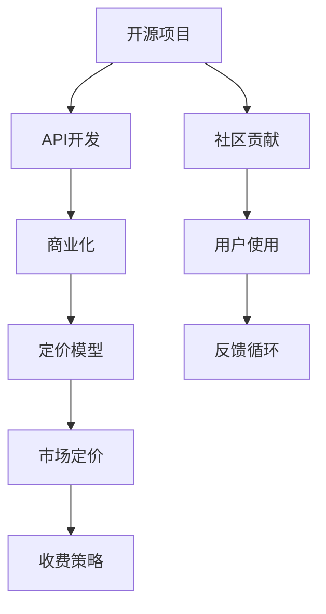

                 

# 开源项目的API商业化：策略和定价模型

> 关键词：开源项目, API, 商业化, 策略, 定价模型

## 1. 背景介绍

随着开源运动的蓬勃发展，越来越多的软件开发项目选择开源，在社区中协作贡献，以满足全球用户的需求。开源项目的成功，不仅取决于高质量的代码，更依赖于良好的社区生态和商业模式。然而，开源项目如何从源代码到产品，将技术转化为价值，仍然是一个需要深入研究的课题。

在开源项目的商业化过程中，API成为连接开发者、企业客户和技术市场的桥梁。API商业化策略的设计和定价模型，直接影响着项目的收入和用户满意度。一个合理的商业化策略和定价模型，不仅能确保开源项目的可持续运营，还能提升项目的市场竞争力和用户价值。

本文将深入探讨开源项目的API商业化策略，重点介绍如何构建和优化API定价模型，以期为开源项目开发者和商业化运营团队提供实用的指导和建议。

## 2. 核心概念与联系

### 2.1 核心概念概述

为更好地理解开源项目API商业化策略和定价模型，本节将介绍几个关键概念：

- **开源项目**：指通过开源许可证发布、免费共享的源代码项目。开源项目通过社区协作，推动技术进步和创新。

- **API (Application Programming Interface)**：指一组定义了软件组件之间通信的规则和协议。API使得开发者能够访问和调用特定功能，简化软件开发过程。

- **商业化**：指将开源项目中的技术和服务转化为商业产品，以获取收入和利润的过程。

- **定价模型**：指基于市场需求、成本结构和竞争环境等因素，设计合理的收费策略，以最大化项目收益。

这些概念之间的联系可以通过以下Mermaid流程图来展示：



这个流程图展示了许多关键概念及其相互关系：

1. 开源项目通过社区贡献和用户使用，不断迭代和优化API功能。
2. 商业化过程将API开发成果转化为商业产品，获取收益。
3. 定价模型基于市场情况，确定合适的收费策略，以支撑商业化运营。
4. 市场定价受到定价模型的指导，进而影响收费策略和用户接受度。
5. 用户反馈通过反馈循环影响API的迭代和优化。

## 3. 核心算法原理 & 具体操作步骤

### 3.1 算法原理概述

开源项目API商业化的核心在于平衡社区生态和商业收益，设计合理的定价模型以实现这一平衡。其核心思想是：

- **满足需求**：根据市场需求，设计差异化的API产品，满足不同用户的个性化需求。
- **控制成本**：合理估算API的开发、运营和维护成本，确保商业化项目的盈利能力。
- **竞争优势**：通过差异化的定价策略和高质量的API服务，在市场中保持竞争优势。

基于此，本文将详细介绍开源项目API商业化策略和定价模型的核心算法原理。

### 3.2 算法步骤详解

#### 3.2.1 需求分析

开源项目API的商业化过程，首先需要进行详细的需求分析。这包括：

1. **识别用户需求**：通过用户调查、社区反馈和竞品分析，了解目标用户的痛点和需求。
2. **设计API产品**：根据用户需求，设计API的功能和特性，确保其能够满足用户的实际使用场景。
3. **制定服务套餐**：根据不同的用户需求，设计不同的API服务套餐，提供多样化的服务选择。

#### 3.2.2 成本估算

成本估算环节主要包括以下步骤：

1. **开发成本**：估算API开发的初期成本，包括技术研发、测试和文档编写等。
2. **运营成本**：估算API的持续运营成本，包括服务器维护、安全防护、市场推广等。
3. **维护成本**：估算API的日常维护成本，包括Bug修复、功能更新和性能优化等。

#### 3.2.3 定价策略

定价策略的设计需要综合考虑市场需求、成本结构和竞争环境。以下是几个常用的定价策略：

1. **成本加成定价**：根据API的开发和运营成本，加上一定的利润率，计算出最终的收费标准。
2. **价值定价**：基于API对用户的实际价值和使用频率，设计不同的定价策略，满足不同用户的需求。
3. **竞争定价**：根据市场上同类API的定价，调整自己的定价策略，保持竞争力。

#### 3.2.4 市场推广

市场推广环节主要包括以下步骤：

1. **选择合适的渠道**：根据目标用户群体，选择合适的市场推广渠道，如社交媒体、技术博客、在线研讨会等。
2. **制定推广计划**：设计详细的推广计划，包括内容创作、活动策划和用户互动等。
3. **监测推广效果**：通过数据分析工具，监测推广效果，不断优化推广策略。

### 3.3 算法优缺点

开源项目API商业化策略和定价模型具有以下优点：

1. **成本透明**：开源项目的代码公开透明，使得成本估算更加可信和可控。
2. **用户社区参与**：通过开源社区的参与和贡献，提升API的可靠性和用户满意度。
3. **市场灵活性**：灵活的定价策略，可以更好地适应市场变化和用户需求。

同时，该方法也存在一定的局限性：

1. **收益不确定**：开源项目往往依赖社区贡献，收益具有不确定性。
2. **依赖用户信任**：开源项目的商业模式依赖于用户的信任和支持，风险较高。
3. **资源投入大**：API的开发和运营需要大量的资源投入，尤其是在初期阶段。

尽管存在这些局限性，但就目前而言，开源项目API商业化策略和定价模型仍是较为可行和有效的方法，能够帮助开源项目在商业化道路上取得成功。

### 3.4 算法应用领域

开源项目API商业化策略和定价模型在多个领域得到应用，例如：

- **云服务**：如AWS、Azure等云服务提供商，通过API提供计算、存储、网络等基础设施服务，实现商业化运营。
- **数据服务**：如Google Analytics、Mixpanel等数据服务平台，通过API提供用户行为数据分析和可视化服务，获取商业收益。
- **API市场**：如Programming.io、API Market等API市场平台，将各类API进行聚合和封装，提供API订阅和交易服务。
- **软件即服务(SaaS)**：如Slack、GitHub等SaaS平台，通过API提供工具、应用和平台服务，实现商业化运营。

## 4. 数学模型和公式 & 详细讲解 & 举例说明

### 4.1 数学模型构建

本节将使用数学语言对开源项目API商业化策略和定价模型进行严格的刻画。

记API的需求函数为 $D(Q)$，其中 $Q$ 为API的使用量，$D(Q)$ 为需求量。API的单位成本为 $C(Q)$，其中 $C(Q)$ 为API的使用量。API的定价为 $P(Q)$，其中 $P(Q)$ 为API的单位价格。

### 4.2 公式推导过程

根据经济学中的需求理论，API的需求函数 $D(Q)$ 可以表示为：

$$
D(Q) = a - bQ
$$

其中，$a$ 为初始需求量，$b$ 为需求价格弹性系数。

API的单位成本 $C(Q)$ 可以表示为：

$$
C(Q) = c_0 + c_1Q
$$

其中，$c_0$ 为固定成本，$c_1$ 为边际成本。

根据需求理论，API的定价 $P(Q)$ 应满足：

$$
P(Q) = \frac{D(Q)C(Q)}{Q}
$$

将需求函数 $D(Q)$ 和单位成本 $C(Q)$ 代入上述公式，得到：

$$
P(Q) = \frac{(a - bQ)(c_0 + c_1Q)}{Q}
$$

化简得：

$$
P(Q) = c_0 - \frac{c_0a}{Q} + c_1b + c_1bQ
$$

在实际应用中，API的定价模型还可以考虑以下因素：

- **需求弹性**：根据不同用户群体的需求弹性，设计差异化的定价策略。
- **市场竞争**：根据市场上其他API的定价，调整自己的定价策略，保持竞争力。
- **用户反馈**：根据用户的反馈和满意度，不断优化定价模型。

### 4.3 案例分析与讲解

以一个开源项目的API为例，假设该项目的API为统计分析服务，用户可以通过API获取数据集和分析结果。

**需求函数**：
- 初始需求量为 $a=100$
- 需求价格弹性系数 $b=0.8$

**单位成本**：
- 固定成本 $c_0=1000$
- 边际成本 $c_1=0.1$

根据上述公式，API的定价模型为：

$$
P(Q) = 1000 - \frac{1000}{Q} + 0.1 \times 0.8 + 0.1 \times 0.8Q
$$

化简得：

$$
P(Q) = 1000 - \frac{1000}{Q} + 0.08 + 0.08Q
$$

假设API的月度使用量为 $Q=1000$，代入上述公式计算得到定价 $P(Q)=1000.88$。

这意味着，为了获得1000个API请求，用户需要支付1000.88美元。

## 5. 项目实践：代码实例和详细解释说明

### 5.1 开发环境搭建

在进行API商业化策略和定价模型的开发前，我们需要准备好开发环境。以下是使用Python进行Flask框架开发的简单环境配置流程：

1. 安装Anaconda：从官网下载并安装Anaconda，用于创建独立的Python环境。

2. 创建并激活虚拟环境：
```bash
conda create -n flask-env python=3.8 
conda activate flask-env
```

3. 安装Flask：
```bash
pip install flask
```

4. 安装必要的第三方库：
```bash
pip install flask-restful flask-sqlalchemy flask-migrate
```

完成上述步骤后，即可在`flask-env`环境中开始API商业化策略和定价模型的开发。

### 5.2 源代码详细实现

下面是一个简单的API定价模型示例，使用Flask框架实现：

```python
from flask import Flask, request
from flask_restful import Resource, Api
from flask_sqlalchemy import SQLAlchemy
from sqlalchemy import Column, Integer, Float

app = Flask(__name__)
api = Api(app)
db = SQLAlchemy(app)

class PricingModel(db.Model):
    id = Column(Integer, primary_key=True)
    price = Column(Float)
    quantity = Column(Integer)

    def __init__(self, price, quantity):
        self.price = price
        self.quantity = quantity

@app.route('/pricing', methods=['GET'])
def get_pricing():
    pricing = PricingModel.query.first()
    return {'price': pricing.price, 'quantity': pricing.quantity}

@app.route('/pricing', methods=['POST'])
def update_pricing():
    price = request.json.get('price')
    quantity = request.json.get('quantity')
    pricing = PricingModel(price=price, quantity=quantity)
    db.session.add(pricing)
    db.session.commit()
    return {'message': 'Pricing updated successfully'}

if __name__ == '__main__':
    app.run(debug=True)
```

在上述代码中，我们使用Flask框架创建了一个简单的API定价模型应用，包括一个`PricingModel`模型，用于存储API定价信息，以及两个API端点，一个用于获取定价信息，一个用于更新定价信息。

### 5.3 代码解读与分析

让我们再详细解读一下关键代码的实现细节：

**PricingModel类**：
- `__init__`方法：初始化定价模型，包含价格和数量信息。
- `id`列：自动生成的主键，用于唯一标识定价记录。

**Flask路由**：
- `@app.route('/pricing', methods=['GET'])`：定义一个GET请求路由，用于获取定价信息。
- `@app.route('/pricing', methods=['POST'])`：定义一个POST请求路由，用于更新定价信息。

**Flask端点**：
- `get_pricing`函数：处理GET请求，查询数据库中存储的定价信息，并返回JSON格式的定价数据。
- `update_pricing`函数：处理POST请求，根据请求体中的价格和数量信息，更新定价模型，并返回成功消息。

该代码示例展示了如何使用Flask框架实现API定价模型的基础功能。开发者可以根据实际需求，添加更多的业务逻辑和数据验证。

### 5.4 运行结果展示

运行上述代码，即可访问`http://localhost:5000/pricing`，查看和更新API定价信息。例如，可以发送以下JSON格式的请求体：

```json
{
    "price": 10.0,
    "quantity": 100
}
```

将返回成功更新定价信息的消息。

## 6. 实际应用场景

### 6.1 云服务

云服务提供商通常提供API接口，用户可以通过API访问和管理云资源。例如，AWS提供了丰富的API接口，如Amazon S3、Amazon EC2等，用户可以通过API进行文件存储、虚拟机管理和网络配置等操作。

### 6.2 数据服务

数据服务平台通过API提供数据分析、可视化等服务。例如，Google Analytics通过API提供网站访问统计信息，帮助用户了解网站流量和用户行为。Mixpanel通过API提供用户行为分析，帮助应用开发者优化用户留存和转化率。

### 6.3 软件即服务(SaaS)

SaaS平台通过API提供软件工具和应用服务。例如，Slack通过API提供聊天、文件共享和项目管理等功能，帮助团队协作。GitHub通过API提供代码托管、版本控制和项目管理等服务，促进开源社区的协作。

### 6.4 未来应用展望

随着API技术的不断演进，开源项目API商业化策略和定价模型将在更多领域得到应用，为各行各业带来新的机遇和挑战。

在智慧城市建设中，API可以提供智能交通、智慧能源、智慧环保等服务，提升城市管理效率和居民生活质量。在医疗健康领域，API可以提供电子病历、远程诊疗、健康管理等服务，推动医疗服务的数字化转型。

此外，在智能制造、教育培训、金融科技等领域，API也将发挥重要作用，推动各行业的数字化进程和创新发展。未来，随着API技术的不断成熟，API商业化策略和定价模型将迎来更多的应用场景和发展机遇。

## 7. 工具和资源推荐

### 7.1 学习资源推荐

为了帮助开发者系统掌握开源项目API商业化策略和定价模型的理论基础和实践技巧，这里推荐一些优质的学习资源：

1. **《API商业化：从开源到盈利》**：由知名开源项目维护者所著，深入浅出地介绍了开源项目如何通过API商业化实现盈利，并提供了丰富的案例和最佳实践。

2. **《API设计与实现》**：详细介绍API设计、开发和部署的最佳实践，涵盖API生命周期的全流程。

3. **《API定价与策略》**：深入分析API定价模型和定价策略，帮助开发者设计出合理的收费方案。

4. **Hacker News**：社区中有关API商业化和定价策略的讨论和经验分享，提供丰富的学习资源和灵感。

5. **GitHub**：GitHub是全球最大的开源社区，提供大量开源项目的商业化案例和代码库，方便开发者学习和借鉴。

通过这些资源的学习实践，相信你一定能够快速掌握开源项目API商业化策略和定价模型的精髓，并用于解决实际的API商业化问题。

### 7.2 开发工具推荐

高效的开发离不开优秀的工具支持。以下是几款用于开源项目API商业化策略和定价模型开发的常用工具：

1. **Flask**：基于Python的开源Web框架，简单易用，适合快速迭代和原型开发。

2. **PostgreSQL**：开源关系型数据库，支持复杂的查询和事务处理，适合存储API定价数据。

3. **Docker**：开源容器化平台，方便构建和管理API应用，支持多环境部署。

4. **Kubernetes**：开源容器编排平台，支持分布式部署和管理，适合大规模API服务。

5. **JIRA**：项目管理工具，帮助团队规划和跟踪API项目进度，提升开发效率。

合理利用这些工具，可以显著提升开源项目API商业化策略和定价模型的开发效率，加快创新迭代的步伐。

### 7.3 相关论文推荐

开源项目API商业化策略和定价模型的发展源于学界的持续研究。以下是几篇奠基性的相关论文，推荐阅读：

1. **《开源社区中的API商业化研究》**：分析开源项目如何通过API商业化获取收益，探讨API定价模型和市场策略。

2. **《API定价与市场竞争》**：深入分析API定价模型和市场竞争策略，帮助开发者制定合理收费方案。

3. **《API定价与用户满意度》**：研究API定价模型对用户满意度的影响，提出优化策略，提升用户体验。

4. **《开源项目API定价理论研究》**：分析API定价模型的理论基础和实际应用，提供系统化的研究框架。

这些论文代表了大语言模型微调技术的发展脉络。通过学习这些前沿成果，可以帮助研究者把握学科前进方向，激发更多的创新灵感。

## 8. 总结：未来发展趋势与挑战

### 8.1 总结

本文对开源项目API商业化策略和定价模型进行了全面系统的介绍。首先阐述了开源项目API商业化的背景和意义，明确了API商业化在开源项目中的重要性和挑战。其次，从原理到实践，详细讲解了API商业化策略和定价模型的核心算法原理和具体操作步骤。最后，本文还探讨了API商业化策略和定价模型在多个领域的应用前景，并提供了相关的学习资源和工具推荐。

通过本文的系统梳理，可以看到，开源项目API商业化策略和定价模型正在成为开源项目开发和运营的重要方向，能够帮助开源项目实现可持续发展，提升社区生态和用户满意度。未来，伴随API技术和市场的不断发展，API商业化策略和定价模型将迎来更多的应用场景和挑战，需要开发者不断探索和创新。

### 8.2 未来发展趋势

展望未来，开源项目API商业化策略和定价模型将呈现以下几个发展趋势：

1. **API差异化服务**：根据不同用户群体的需求，提供差异化的API服务，满足个性化需求。
2. **API定价模型优化**：引入先进算法和数据模型，优化API定价模型，提升定价准确性和用户满意度。
3. **市场策略多样化**：结合市场动态和用户反馈，制定多样化的市场策略，提升市场竞争力。
4. **用户参与度提升**：增强用户参与度，促进API社区生态的建设和发展。
5. **技术集成深化**：将API技术与更多新兴技术如区块链、人工智能等深度融合，拓展API应用场景。

以上趋势凸显了开源项目API商业化策略和定价模型的广阔前景。这些方向的探索发展，必将进一步提升开源项目的市场竞争力和用户价值。

### 8.3 面临的挑战

尽管开源项目API商业化策略和定价模型已经取得了一定进展，但在迈向更加智能化、普适化应用的过程中，它仍面临着诸多挑战：

1. **需求多样性**：不同用户群体的需求差异较大，如何设计满足多样需求的API服务，是一个重要挑战。
2. **成本控制**：API的开发和运营需要大量资源投入，如何在控制成本的同时，保证商业化收益，是一个关键问题。
3. **市场竞争**：市场上有大量同类API，如何通过差异化策略和优质服务，在激烈竞争中脱颖而出，是一个难点。
4. **用户满意度**：用户对API服务的满意度直接影响项目的商业化收益，如何提升用户满意度，是一个重要课题。
5. **技术复杂度**：API的复杂度和技术实现难度较大，如何降低技术复杂度，提升开发效率，是一个挑战。

正视开源项目API商业化面临的这些挑战，积极应对并寻求突破，将是大语言模型微调走向成熟的必由之路。相信随着学界和产业界的共同努力，这些挑战终将一一被克服，开源项目API商业化策略和定价模型必将在开源项目中发挥越来越重要的作用。

### 8.4 研究展望

面对开源项目API商业化策略和定价模型所面临的种种挑战，未来的研究需要在以下几个方面寻求新的突破：

1. **市场细分研究**：针对不同市场和用户群体，进行深入的市场细分和需求分析，设计差异化的API服务。
2. **定价模型优化**：引入先进算法和数据模型，优化API定价模型，提升定价准确性和用户满意度。
3. **技术集成研究**：将API技术与更多新兴技术如区块链、人工智能等深度融合，拓展API应用场景。
4. **用户反馈机制**：建立完善的用户反馈机制，不断优化API服务，提升用户满意度。
5. **市场推广策略**：结合市场动态和用户反馈，制定多样化的市场推广策略，提升市场竞争力。

这些研究方向的探索，必将引领开源项目API商业化策略和定价模型走向新的高度，为开源项目开发者和运营团队提供更多的指导和建议，推动开源项目的可持续发展。总之，开源项目API商业化策略和定价模型需要开发者从多个维度进行深入研究，以实现开源项目的商业化成功和市场竞争力提升。

## 9. 附录：常见问题与解答

**Q1：开源项目如何选择合适的API定价模型？**

A: 选择合适的API定价模型需要综合考虑多个因素，如市场需求、成本结构和竞争环境。一般建议从以下几个方面入手：
1. **需求分析**：通过用户调查和竞品分析，了解目标用户群体的需求和使用场景。
2. **成本估算**：详细估算API的开发、运营和维护成本，确保定价模型能够覆盖成本。
3. **竞争分析**：分析市场上同类API的定价策略，制定合理的竞争定价。

**Q2：如何优化API定价模型？**

A: 优化API定价模型需要结合实际需求和市场反馈，不断迭代和改进。以下是一些常用的优化方法：
1. **数据分析**：通过数据分析工具，收集和分析用户反馈，优化定价策略。
2. **市场调研**：进行市场调研，了解用户需求和市场动态，及时调整定价模型。
3. **A/B测试**：采用A/B测试，对比不同定价策略的效果，选择最优方案。

**Q3：开源项目在API商业化过程中需要注意哪些问题？**

A: 开源项目在API商业化过程中需要注意以下问题：
1. **社区生态**：保护开源项目的社区生态，确保社区贡献和用户反馈。
2. **市场竞争**：在激烈的市场竞争中，制定合理的市场策略，提升市场竞争力。
3. **用户满意度**：关注用户满意度，提升API服务的质量和使用体验。
4. **成本控制**：控制API的开发和运营成本，确保商业化收益。

**Q4：如何提升开源项目API的差异化服务？**

A: 提升开源项目API的差异化服务需要从以下几个方面入手：
1. **需求分析**：深入了解不同用户群体的需求和使用场景，设计差异化的API服务。
2. **功能扩展**：根据用户反馈和市场需求，不断扩展API的功能和特性。
3. **服务套餐**：提供多样化的服务套餐，满足不同用户的需求。

**Q5：如何提升开源项目API的用户满意度？**

A: 提升开源项目API的用户满意度需要从以下几个方面入手：
1. **用户体验**：优化API的用户体验，提供友好的API接口和文档。
2. **服务质量**：提升API的服务质量，减少错误和故障。
3. **用户反馈**：建立完善的用户反馈机制，及时回应和解决问题。

这些问题的解答，有助于开源项目开发者和运营团队更好地理解API商业化策略和定价模型，为开源项目的商业化运营提供实用的指导和建议。

---

作者：禅与计算机程序设计艺术 / Zen and the Art of Computer Programming

