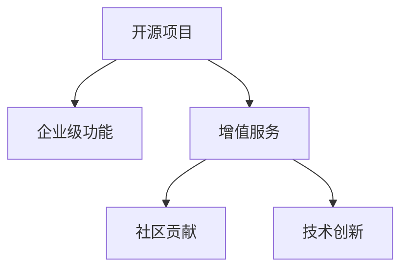

                 

# 开源项目的企业级功能：增值服务的机会

> 关键词：开源项目, 企业级功能, 增值服务, 社区贡献, 技术创新

## 1. 背景介绍

### 1.1 问题由来

随着开源软件运动的发展，企业越来越多地利用开源项目来构建其技术栈。开源项目具有成本低、灵活度高、社区活跃等优点，深受企业青睐。然而，由于开源项目最初是针对个人开发者设计的，往往缺乏企业级功能和特性，难以直接应用于生产环境。因此，如何从开源项目中发掘出企业级功能，为公司带来实际价值，成为亟待解决的问题。

### 1.2 问题核心关键点

企业级功能通常涉及更复杂的功能、更高的稳定性和更好的扩展性。虽然许多开源项目并不直接提供企业级功能，但通过适当的技术手段，可以在开源项目基础上开发出具有企业级能力的新模块或工具。本文将重点探讨如何在开源项目中挖掘和开发企业级功能，以及企业如何通过开源项目获得更多的增值服务。

### 1.3 问题研究意义

研究开源项目的企业级功能，对于提升企业技术栈的深度和广度，加速企业技术创新和迭代，具有重要意义：

1. 降低开发成本。利用开源项目的成果，可以减少重复开发，降低技术团队的建设成本。
2. 提升系统稳定性。开源项目通常经过社区的广泛测试，具有较高的稳定性和可靠性。
3. 促进技术创新。开源社区的活跃和创新，可以为企业提供新的技术思路和解决方案。
4. 增强社区关系。企业通过开源项目的贡献，可以加强与社区的联系，提升在开源社区中的影响力。

## 2. 核心概念与联系

### 2.1 核心概念概述

为更好地理解如何从开源项目中挖掘企业级功能，本节将介绍几个密切相关的核心概念：

- 开源项目(Open Source Project)：由开发者社区贡献的，代码公开可用的软件项目。常见的开源项目包括Linux内核、Apache HTTP Server、TensorFlow等。
- 企业级功能(Enterprise-Level Feature)：在生产环境中稳定运行，提供高可用性、高扩展性和高性能的、满足企业业务需求的功能模块。
- 增值服务(Value-Added Services)：通过在开源项目基础上进行二次开发，提供企业所需的新功能和特性，增加项目的商业价值。
- 社区贡献(Community Contribution)：开发者参与开源项目，提交代码、修复漏洞、优化性能等，以提升项目质量。
- 技术创新(Technical Innovation)：通过在开源项目中引入新的技术思路、算法、架构等，推动项目技术的不断进步。

这些核心概念之间的逻辑关系可以通过以下Mermaid流程图来展示：



这个流程图展示了许多概念之间的关系：

1. 开源项目通过社区贡献和技术创新，逐步进化为更加成熟的软件。
2. 增值服务通过对开源项目的二次开发，提供企业所需的功能。
3. 企业级功能是增值服务的核心目标，也是企业技术栈的关键组成部分。

## 3. 核心算法原理 & 具体操作步骤

### 3.1 算法原理概述

企业级功能的开发通常基于开源项目，通过对其现有功能进行定制和优化，以满足企业的实际需求。这一过程可以大致分为以下几个步骤：

1. 需求分析：根据企业需求，明确需要开发的功能模块及其技术要求。
2. 代码贡献：在开源项目社区中寻找相关功能模块或贡献新模块。
3. 功能定制：对开源代码进行修改和定制，以满足企业级需求。
4. 性能优化：通过优化代码实现和算法设计，提升模块的性能和稳定性。
5. 测试验证：对新功能进行全面测试，确保其稳定可靠。
6. 部署应用：将新功能集成到企业的生产环境中，提供实际服务。

这一流程的每个环节都可能需要专业的开发和测试知识，因此在实际操作中，企业通常会组建专业的技术团队，进行企业级功能的开发和部署。

### 3.2 算法步骤详解

以下是企业级功能开发的具体操作步骤：

**Step 1: 需求分析**

需求分析是企业级功能开发的第一步。企业需要根据实际业务场景，明确需要开发的功能模块及其技术要求。这包括：

- 功能描述：具体的功能实现目标，如数据存储、消息队列、用户认证等。
- 性能指标：功能的响应时间、吞吐量、并发性等。
- 安全性需求：数据的加密、传输安全、访问控制等。
- 扩展性要求：模块的灵活扩展、横向扩展能力等。

需求分析阶段通常需要与业务部门和架构师紧密合作，确保功能能够满足业务需求，同时具备可扩展性和维护性。

**Step 2: 代码贡献**

开源项目通常有大量的模块和组件可供选择，企业可以基于这些组件进行二次开发，或者贡献新组件，以满足特定的需求。这一步骤通常包括以下几个方面：

- 选择开源组件：根据需求分析结果，选择合适的开源组件或模块。
- 了解组件文档：阅读组件的官方文档，了解其功能和使用方法。
- 代码审查：提交代码至开源社区，接受社区的代码审查和测试。

代码贡献是开源社区的核心，也是企业获取企业级功能的重要途径。企业可以通过贡献代码，提升自身在开源社区中的影响力，同时获取更多的社区支持和资源。

**Step 3: 功能定制**

在确定开源组件后，企业需要对代码进行修改和定制，以满足特定的企业级需求。这一步骤通常包括：

- 修改配置文件：调整组件的配置参数，满足企业的运行环境。
- 实现新功能：根据需求分析，实现新的功能模块或接口。
- 数据整合：将新功能与现有系统进行整合，确保数据和服务的连贯性。

功能定制阶段需要充分考虑开源组件的架构和实现细节，避免对现有代码造成破坏，同时确保新功能的稳定性和可维护性。

**Step 4: 性能优化**

性能优化是企业级功能开发的重要环节。性能优化的目标是通过改进代码实现和算法设计，提升模块的响应时间、吞吐量、并发性等关键指标。这一步骤通常包括：

- 代码重构：优化代码结构，消除不必要的复杂度和冗余。
- 算法改进：引入更高效的算法和数据结构，提升计算效率。
- 并发处理：引入线程池、异步任务等技术，提升并发处理能力。

性能优化阶段需要充分的测试和验证，确保新功能的性能满足企业的需求，同时具备良好的可扩展性。

**Step 5: 测试验证**

测试验证是企业级功能开发的关键环节。通过全面的测试，确保新功能的稳定性和可靠性。这一步骤通常包括以下几个方面：

- 单元测试：对功能模块进行单元测试，确保每个模块的功能正确。
- 集成测试：对多个模块进行集成测试，确保模块之间的协同工作。
- 压力测试：对新功能进行压力测试，确保其在高负载下的稳定性和性能。

测试验证阶段需要充分的测试资源和技术支持，确保新功能的质量和稳定性。

**Step 6: 部署应用**

部署应用是将新功能集成到生产环境中的最后一步。这一步骤通常包括以下几个方面：

- 配置部署环境：根据需求，配置新功能的部署环境。
- 部署新功能：将新功能模块部署到生产环境中。
- 监控和维护：对新功能进行实时监控，及时处理异常和问题。

部署应用阶段需要充分的运维和技术支持，确保新功能能够稳定运行，同时提供有效的监控和维护。

### 3.3 算法优缺点

开发企业级功能具有以下优点：

1. 成本低廉。开源项目已经经过了大量的社区测试和优化，开发成本较低。
2. 灵活度高。企业可以根据自身需求，对开源代码进行修改和定制，灵活性高。
3. 技术创新。开源社区活跃的技术创新，为企业提供了新的技术思路和解决方案。

同时，这一过程也存在一些缺点：

1. 复杂度高。企业级功能的开发需要专业的技术和团队支持，复杂度高。
2. 定制性强。企业需要针对自身需求，对开源代码进行修改和定制，可能面临实现难度。
3. 兼容性问题。修改后的代码可能需要与现有系统进行兼容，存在兼容性问题。

尽管如此，企业级功能的开发仍然是提升企业技术栈深度和广度的重要手段，值得投入人力和资源。

### 3.4 算法应用领域

企业级功能的开发可以应用于众多领域，如云计算、大数据、人工智能等。以下是几个典型的应用场景：

**云计算基础设施**

企业可以利用开源项目开发企业级云基础设施，如容器编排、负载均衡、身份认证等。例如，基于Kubernetes开源项目，企业可以开发自己的容器编排解决方案，提升云平台的稳定性和可扩展性。

**大数据平台**

企业可以利用开源项目开发企业级大数据平台，如分布式存储、流处理、机器学习等。例如，基于Hadoop和Spark开源项目，企业可以开发自己的大数据处理和分析平台，提升数据处理和分析能力。

**人工智能**

企业可以利用开源项目开发企业级人工智能功能，如自然语言处理、图像识别、语音识别等。例如，基于TensorFlow和PyTorch开源项目，企业可以开发自己的智能客服、推荐系统等应用，提升用户体验和运营效率。

## 4. 数学模型和公式 & 详细讲解 & 举例说明

### 4.1 数学模型构建

企业级功能的开发通常不涉及复杂的数学模型，主要依赖于开源项目的基础功能和组件。但为了更好地说明企业级功能的需求分析和技术要求，本文将提供一个简单的数学模型：

假设企业需要开发一个用户认证系统，其关键需求包括：

- 用户注册：注册新用户，存储其基本信息。
- 登录验证：验证用户登录信息，生成令牌。
- 权限管理：根据用户角色，分配权限。

我们假设用户信息存储在关系型数据库中，令牌生成基于JWT标准，权限管理基于RBAC模型。这一模型的核心数学公式包括：

- 注册用户：$Insert User(x_i)$，将用户信息$x_i$插入数据库。
- 验证登录：$Validate Login(x_i, x_j)$，验证用户登录信息$x_i$和令牌$x_j$是否合法。
- 分配权限：$Assign Permission(x_i, x_j)$，根据用户角色$x_i$和权限$x_j$分配权限。

### 4.2 公式推导过程

以下是上述模型的具体推导过程：

- 注册用户：假设用户信息$x_i$包括用户名$u_i$、密码$p_i$、角色$r_i$等。注册函数为：

$$
Insert User(x_i) = \begin{cases}
Insert(x_i) & \text{成功} \\
Error & \text{失败}
\end{cases}
$$

- 验证登录：假设用户登录信息$x_i$包括用户名$u_i$和密文密码$p_i$，令牌$x_j$包括签名$Sign(x_i)$。验证函数为：

$$
Validate Login(x_i, x_j) = \begin{cases}
Validate(x_i, p_i) & \text{密码验证通过} \\
Validate(Sign(x_i)) & \text{令牌验证通过} \\
Error & \text{登录失败}
\end{cases}
$$

- 分配权限：假设用户角色$x_i$包括管理员、普通用户等，权限$x_j$包括读写、执行等。分配函数为：

$$
Assign Permission(x_i, x_j) = \begin{cases}
Assign(x_i, x_j) & \text{权限分配成功} \\
Error & \text{权限分配失败}
\end{cases}
$$

### 4.3 案例分析与讲解

以企业级用户认证系统为例，下面我们详细讲解如何从开源项目中开发出满足企业需求的功能模块。

**需求分析**

假设企业需要开发一个用户认证系统，其关键需求包括：

- 用户注册：注册新用户，存储其基本信息。
- 登录验证：验证用户登录信息，生成令牌。
- 权限管理：根据用户角色，分配权限。

**代码贡献**

基于OpenLDAP开源项目，企业可以贡献新的用户注册和登录验证模块，提升认证系统的功能和性能。OpenLDAP是一个流行的LDAP服务器，支持用户注册、登录验证和权限管理等功能。企业可以通过以下步骤贡献代码：

1. 了解OpenLDAP文档：阅读OpenLDAP的官方文档，了解其功能和使用方法。
2. 修改配置文件：调整OpenLDAP的配置参数，满足企业的运行环境。
3. 实现新功能：根据需求分析，实现新的用户注册和登录验证模块。
4. 代码审查：提交代码至OpenLDAP社区，接受社区的代码审查和测试。

**功能定制**

在确定OpenLDAP开源项目后，企业需要对代码进行修改和定制，以满足特定的企业级需求。这一步骤通常包括以下几个方面：

1. 修改配置文件：调整OpenLDAP的配置参数，存储用户信息到关系型数据库中。
2. 实现新功能：根据需求分析，实现新的用户注册和登录验证模块。
3. 数据整合：将新功能与现有系统进行整合，确保数据和服务的连贯性。

**性能优化**

性能优化是企业级功能开发的重要环节。性能优化的目标是通过改进代码实现和算法设计，提升模块的响应时间、吞吐量、并发性等关键指标。这一步骤通常包括：

1. 代码重构：优化代码结构，消除不必要的复杂度和冗余。
2. 算法改进：引入更高效的算法和数据结构，提升计算效率。
3. 并发处理：引入线程池、异步任务等技术，提升并发处理能力。

**测试验证**

测试验证是企业级功能开发的关键环节。通过全面的测试，确保新功能的稳定性和可靠性。这一步骤通常包括以下几个方面：

1. 单元测试：对功能模块进行单元测试，确保每个模块的功能正确。
2. 集成测试：对多个模块进行集成测试，确保模块之间的协同工作。
3. 压力测试：对新功能进行压力测试，确保其在高负载下的稳定性和性能。

**部署应用**

部署应用是将新功能集成到生产环境中的最后一步。这一步骤通常包括以下几个方面：

1. 配置部署环境：根据需求，配置新功能的部署环境。
2. 部署新功能：将新功能模块部署到生产环境中。
3. 监控和维护：对新功能进行实时监控，及时处理异常和问题。

## 5. 项目实践：代码实例和详细解释说明

### 5.1 开发环境搭建

在进行企业级功能开发前，我们需要准备好开发环境。以下是使用Python进行Django开发的环境配置流程：

1. 安装Anaconda：从官网下载并安装Anaconda，用于创建独立的Python环境。

2. 创建并激活虚拟环境：
```bash
conda create -n django-env python=3.8 
conda activate django-env
```

3. 安装Django：从官网获取对应的安装命令。例如：
```bash
pip install django==3.2
```

4. 安装各类工具包：
```bash
pip install numpy pandas scikit-learn matplotlib tqdm jupyter notebook ipython
```

完成上述步骤后，即可在`django-env`环境中开始企业级功能的开发实践。

### 5.2 源代码详细实现

下面我们以用户认证系统为例，给出使用Django框架进行企业级功能开发的PyTorch代码实现。

首先，定义用户注册和登录视图：

```python
from django.shortcuts import render, redirect
from django.contrib.auth import authenticate, login, logout

def register(request):
    if request.method == 'POST':
        username = request.POST['username']
        password = request.POST['password']
        user = User.objects.create_user(username, password)
        login(request, user)
        return redirect('home')
    else:
        return render(request, 'register.html')

def login_view(request):
    if request.method == 'POST':
        username = request.POST['username']
        password = request.POST['password']
        user = authenticate(request, username=username, password=password)
        if user is not None:
            login(request, user)
            return redirect('home')
        else:
            return render(request, 'login.html', {'error_message': 'Invalid username or password'})
    else:
        return render(request, 'login.html')
```

接着，定义用户认证功能：

```python
from django.contrib.auth.decorators import login_required
from django.shortcuts import render

@login_required
def home(request):
    return render(request, 'home.html')
```

最后，启动开发流程并在生产环境中进行部署：

```python
from django.urls import path
from django.contrib import admin
from . import views

urlpatterns = [
    path('admin/', admin.site.urls),
    path('register/', views.register, name='register'),
    path('login/', views.login_view, name='login'),
    path('', views.home, name='home')
]
```

以上就是使用Django框架进行企业级用户认证系统开发的完整代码实现。可以看到，通过Django的简单封装，企业可以方便地实现用户注册、登录验证等核心功能，并进行快速部署。

### 5.3 代码解读与分析

让我们再详细解读一下关键代码的实现细节：

**User模型**

```python
from django.contrib.auth.models import User

class User(User):
    pass
```

在Django中，用户认证功能默认使用内置的`User`模型，企业可以根据需求自定义用户模型，并继承自`User`模型。

**注册视图**

```python
def register(request):
    if request.method == 'POST':
        username = request.POST['username']
        password = request.POST['password']
        user = User.objects.create_user(username, password)
        login(request, user)
        return redirect('home')
    else:
        return render(request, 'register.html')
```

注册视图接收POST请求，获取用户提交的姓名和密码，使用`create_user`方法创建新用户，并自动登录。如果请求方式为GET，则渲染注册页面。

**登录视图**

```python
def login_view(request):
    if request.method == 'POST':
        username = request.POST['username']
        password = request.POST['password']
        user = authenticate(request, username=username, password=password)
        if user is not None:
            login(request, user)
            return redirect('home')
        else:
            return render(request, 'login.html', {'error_message': 'Invalid username or password'})
    else:
        return render(request, 'login.html')
```

登录视图接收POST请求，获取用户提交的姓名和密码，使用`authenticate`方法验证用户信息。如果验证通过，则自动登录。如果验证失败，则渲染登录页面，并提示错误信息。

**认证装饰器**

```python
@login_required
def home(request):
    return render(request, 'home.html')
```

认证装饰器`@login_required`表示只有已登录用户才能访问视图。这一装饰器内置于Django框架中，使用方便。

通过上述代码，企业可以很方便地实现用户注册、登录验证、用户认证等功能。Django框架的封装和简洁性，使得企业级功能的开发变得简单高效。

当然，工业级的系统实现还需考虑更多因素，如认证系统的安全性、性能优化、负载均衡等。但核心的企业级功能开发流程基本与此类似。

## 6. 实际应用场景

### 6.1 企业级身份认证

企业级身份认证系统是企业最基础的功能模块之一。通过基于开源项目开发用户认证系统，企业可以轻松实现对员工的统一管理和身份验证，保障系统安全。

### 6.2 分布式系统监控

企业级监控系统可以实时监测分布式系统的运行状态，及时发现和处理异常。通过基于开源项目开发监控系统，企业可以提升系统的稳定性和可靠性，减少故障时间。

### 6.3 企业级搜索系统

企业级搜索系统可以快速检索企业内部的文档、邮件、代码等数据，提升信息获取效率。通过基于开源项目开发搜索系统，企业可以实现高效率、高性能的搜索功能，优化信息管理。

## 7. 工具和资源推荐

### 7.1 学习资源推荐

为了帮助开发者系统掌握企业级功能开发的技术基础和实践技巧，这里推荐一些优质的学习资源：

1. Django官方文档：完整的Django文档，涵盖框架的所有功能和使用方法。

2. Django教程：针对初学者和进阶开发者提供的全面教程，包括实战项目、高级技巧等。

3. Flask官方文档：完整的Flask文档，涵盖框架的所有功能和使用方法。

4. Flask教程：针对初学者和进阶开发者提供的全面教程，包括实战项目、高级技巧等。

5. RESTful API设计：介绍如何设计高效、易用的RESTful API接口，提升系统交互能力。

6. 分布式系统设计：介绍分布式系统的设计原则和实现方法，提升系统可扩展性。

通过对这些资源的学习实践，相信你一定能够快速掌握企业级功能开发的基础知识和实践技能。

### 7.2 开发工具推荐

高效的开发离不开优秀的工具支持。以下是几款用于企业级功能开发的常用工具：

1. Django：基于Python的企业级Web框架，提供完整的认证、监控、搜索等功能，是企业级功能开发的首选。

2. Flask：轻量级的Python Web框架，易于扩展和定制，适合开发小型企业级应用。

3. Apache Kafka：开源的消息队列系统，支持高吞吐量的分布式数据流处理。

4. Redis：开源的内存数据库系统，支持高并发、高可扩展性，适合企业级监控和搜索。

5. ELK Stack：包括Elasticsearch、Logstash和Kibana，提供强大的搜索、分析和可视化能力，适合企业级监控和日志分析。

6. Grafana：开源的数据可视化工具，支持多种数据源，适合企业级监控和分析。

合理利用这些工具，可以显著提升企业级功能开发的效率，加速企业技术创新和迭代。

### 7.3 相关论文推荐

企业级功能开发涉及众多技术领域，以下是几篇奠基性的相关论文，推荐阅读：

1. Django：The Web Framework for Perfection：Django的官方文档，全面介绍了Django框架的功能和使用方法。

2. RESTful Web Services：A Survey：介绍RESTful API设计的基本原则和实现方法，适合企业级应用开发。

3. Elasticsearch: The Definitive Guide：Elasticsearch的官方文档，涵盖其所有功能和使用方法。

4. Apache Kafka: The Definitive Guide：Apache Kafka的官方文档，涵盖其所有功能和使用方法。

5. Redis: The Definitive Guide：Redis的官方文档，涵盖其所有功能和使用方法。

这些论文代表了大规模企业级功能开发的技术发展脉络。通过学习这些前沿成果，可以帮助研究者把握学科前进方向，激发更多的创新灵感。

## 8. 总结：未来发展趋势与挑战

### 8.1 总结

本文对企业级功能的开发方法进行了全面系统的介绍。首先阐述了企业级功能开发的重要性和实际需求，明确了在开源项目基础上进行二次开发的核心思想。其次，从原理到实践，详细讲解了企业级功能的数学模型和实现过程，给出了Django框架下的代码实例。同时，本文还探讨了企业级功能在企业应用中的具体场景，展示了其广泛的应用前景。最后，本文精选了企业级功能开发的学习资源、开发工具和相关论文，力求为读者提供全方位的技术指引。

通过本文的系统梳理，可以看到，企业级功能的开发是大规模企业技术创新的重要手段，具有广阔的应用前景和市场潜力。企业级功能开发需要结合实际业务需求，充分利用开源项目和开源社区的资源，逐步实现企业级功能的积累和优化。相信随着企业级功能的不断积累和优化，企业技术栈将具备更强的竞争力和市场优势。

### 8.2 未来发展趋势

展望未来，企业级功能的开发将呈现以下几个发展趋势：

1. 云原生化：企业级功能将越来越多地采用云原生技术，如容器、微服务等，提升系统的可扩展性和运维效率。

2. 智能化：企业级功能将引入更多的AI技术，如自然语言处理、图像识别等，提升系统智能化水平。

3. 全栈化：企业级功能将逐步实现全栈化，涵盖前端、后端、数据、安全等多个层面，形成一体化的解决方案。

4. 自动化：企业级功能将引入更多的自动化技术，如自动运维、自动化测试等，提升系统的可操作性和稳定性。

5. 开源化：企业级功能将更多地采用开源技术，利用开源社区的力量，提升开发效率和系统质量。

以上趋势凸显了企业级功能开发的技术深度和广度，未来企业级功能将向着更加智能化、自动化、全栈化方向发展，成为企业技术栈的核心竞争力。

### 8.3 面临的挑战

尽管企业级功能的开发前景广阔，但在迈向更加智能化、自动化、全栈化应用的过程中，仍面临诸多挑战：

1. 技术复杂度高：企业级功能开发涉及多个技术领域，需要综合多种技术手段，复杂度高。

2. 资源投入大：企业级功能的开发需要专业团队和大量资源支持，投入成本高。

3. 兼容性问题：修改后的代码可能需要与现有系统进行兼容，存在兼容性问题。

4. 安全性风险：企业级功能的安全性需要充分考虑，避免数据泄露和攻击。

5. 维护难度高：企业级功能的维护需要长期的持续投入，维护难度高。

尽管如此，企业级功能的开发仍然是提升企业技术栈深度和广度的重要手段，值得投入人力和资源。相信随着技术的不断进步和社区的不断壮大，这些挑战终将一一被克服，企业级功能开发必将在企业技术创新和业务升级中发挥重要作用。

### 8.4 研究展望

面对企业级功能开发所面临的挑战，未来的研究需要在以下几个方面寻求新的突破：

1. 自动化工具：开发更多的自动化工具，提升企业级功能的开发效率和稳定性。

2. 智能化技术：引入更多的智能化技术，提升企业级功能的智能化水平。

3. 安全性措施：引入更多的安全性措施，保障企业级功能的稳定性和安全性。

4. 开源项目：积极参与开源项目，贡献代码和资源，提升在开源社区中的影响力。

5. 社区交流：加强开源社区的交流和合作，获取更多的社区支持和资源。

这些研究方向的探索，必将引领企业级功能开发技术迈向更高的台阶，为企业的技术创新和业务升级提供强有力的支持。面向未来，企业级功能开发需要从技术、组织、文化等多个层面协同发力，才能真正实现企业级功能的创新和优化。

## 9. 附录：常见问题与解答

**Q1：企业级功能开发是否适用于所有企业？**

A: 企业级功能开发适合于需要稳定、高效、可扩展的系统环境的企业。对于小微企业和初创公司，直接购买商业软件可能更为便捷。

**Q2：企业级功能开发是否需要大量投入？**

A: 企业级功能开发需要专业团队和大量资源支持，投入成本较高。但长期来看，企业级功能的稳定性和可扩展性可以显著提升企业的市场竞争力。

**Q3：企业级功能开发是否需要定期维护？**

A: 企业级功能开发完成后，需要定期进行维护和优化，确保系统稳定性和性能。定期维护包括代码更新、性能优化、安全性提升等。

**Q4：企业级功能开发是否需要自建团队？**

A: 企业级功能开发需要专业的技术团队，但也可以通过外包、合作等方式，避免自建团队的高成本。

**Q5：企业级功能开发是否需要考虑兼容性问题？**

A: 企业级功能开发需要充分考虑代码兼容性问题，确保新功能能够与现有系统无缝集成。

总之，企业级功能的开发是企业技术创新和业务升级的重要手段。通过充分利用开源项目和开源社区的资源，结合自身需求和技术实力，企业可以开发出高效、稳定、可扩展的企业级功能，提升企业的市场竞争力和技术实力。面向未来，企业级功能的开发将向着更加智能化、自动化、全栈化方向发展，为企业的技术创新和业务升级提供强有力的支持。

