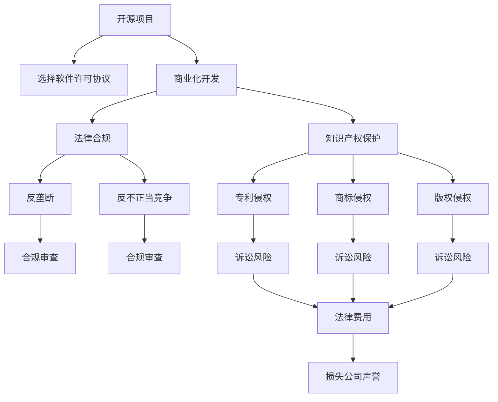

                 

# 开源项目的商业化法律考虑：合规与保护

> 关键词：开源项目,商业化,法律合规,知识产权保护,软件许可协议,法律风险

## 1. 背景介绍

随着开源技术的广泛应用，越来越多的企业开始从开源项目中获取技术能力和创新灵感，进而基于开源软件进行商业化开发。然而，开源项目的商业化并非简单复制和改造的问题，它涉及到复杂的法律和商业因素，特别是法律合规和知识产权保护的问题，一旦处理不当，不仅可能导致法律诉讼，还可能影响公司的商业信誉和发展。因此，如何在开源项目的商业化过程中，既充分利用开源技术的优势，又能合法合规地使用，是每个企业面临的重要课题。

本文将从法律合规和知识产权保护的角度，系统梳理开源项目商业化的法律要点，帮助企业规避潜在风险，确保项目的顺利推进和成功实施。

## 2. 核心概念与联系

### 2.1 核心概念概述

在进行开源项目的商业化过程中，需要明确以下核心概念及其相互联系：

- **开源项目**：指由社区开发、遵循特定的开源许可证，允许任何人使用、修改和分发的软件项目。常见的开源许可证包括GPL、Apache、MIT等。

- **商业化**：指将开源软件用于商业目的，如开发商业产品、提供商业服务等。

- **法律合规**：指企业在商业化开源项目时，需遵守相关的法律规定，包括但不限于版权法、反垄断法、反不正当竞争法等。

- **知识产权保护**：指保护企业在使用和开发开源项目时，确保不侵犯他人的专利、商标、版权等知识产权。

- **软件许可协议**：指开源项目附带的许可证文件，规定了使用、修改和分发开源软件的规则和限制。

- **法律风险**：指在商业化开源项目过程中可能面临的各类法律风险，包括侵权、反垄断、不当竞争等。

这些概念之间存在复杂的相互联系。例如，合理选择合适的软件许可协议，可以有效地降低法律风险；而忽视法律合规和知识产权保护，可能导致严重的法律后果。

### 2.2 核心概念原理和架构的 Mermaid 流程图



这个流程图展示了开源项目商业化的主要法律环节及其相互关系：

1. **开源项目**：基础和起点，决定了后续的法律合规和知识产权保护的范围。
2. **选择软件许可协议**：关键环节，直接影响法律风险和合规性。
3. **商业化开发**：核心活动，涉及法律合规和知识产权保护的实际应用。
4. **法律合规**：涉及反垄断、反不正当竞争等，保障商业活动的合法性。
5. **知识产权保护**：涵盖专利、商标、版权等，确保不侵犯他人的权利。
6. **法律风险**：由侵权、诉讼等构成，对企业带来潜在损失。

这些环节相互交织，共同构成了开源项目商业化的法律框架。

## 3. 核心算法原理 & 具体操作步骤

### 3.1 算法原理概述

开源项目的商业化法律合规，本质上是如何在合法合规的前提下，合理使用和修改开源软件。其核心算法原理主要包括以下几点：

1. **选择合适的软件许可协议**：不同的开源许可证对代码的修改、分发和使用有不同的限制，企业需根据自身需求选择合适的协议。
2. **遵守许可证条款**：企业需严格遵守所选软件许可协议的条款，包括修改权、分发权、署名权等。
3. **确保知识产权归属**：企业需明确开源软件中的知识产权归属，避免侵权。
4. **管理商业化代码**：企业需对商业化开发过程中产生的新代码进行知识产权保护，防止泄露。

### 3.2 算法步骤详解

以下是开源项目商业化法律合规的具体操作步骤：

1. **识别开源项目和许可证**：
   - 分析项目源代码及其附带的许可证文件，确保所有使用和修改行为符合许可证要求。
   - 如未明确许可证，可能需要通过通信联系原作者或项目维护者以获取许可。

2. **评估许可证兼容性**：
   - 确保商业化需求与所选择许可证的限制相兼容，避免潜在的法律风险。
   - 评估许可证对代码修改、分发、署名等方面的具体要求。

3. **进行合规审查**：
   - 聘请法律顾问进行合规审查，确保商业化行为符合所在国家的法律规定。
   - 审查商业化过程中涉及的反垄断、反不正当竞争等法律问题。

4. **知识产权保护**：
   - 对商业化过程中开发的新代码进行知识产权登记，防止侵犯他人的专利、商标、版权等。
   - 对开源代码中涉及的第三方知识产权进行管理和声明，避免侵权风险。

5. **管理软件许可协议**：
   - 清晰记录软件许可协议的使用情况，确保其合法合规。
   - 在商业化产品的版权声明中注明开源代码及其许可证信息。

### 3.3 算法优缺点

开源项目商业化法律合规的主要优点包括：

1. **成本低**：开源软件的使用和修改成本相对较低，可以节省企业研发和采购成本。
2. **创新快**：利用开源社区的力量，可以快速获得新的技术和解决方案，加速产品迭代。
3. **灵活性高**：开源软件及其许可证的多样性，使得企业可以根据自身需求进行灵活选择。

其主要缺点包括：

1. **复杂度高**：开源项目的法律合规要求较高，需要投入较多时间和资源。
2. **法律风险**：如果处理不当，可能导致法律诉讼和财务损失。
3. **代码质量不一**：开源社区的贡献者可能良莠不齐，代码质量参差不齐。

### 3.4 算法应用领域

开源项目商业化法律合规的应用领域广泛，包括但不限于以下几个方面：

1. **软件开发**：在开发商业软件时，合理使用开源库和框架，避免侵权。
2. **平台建设**：如构建商业云平台，需考虑开源软件的使用和分发问题。
3. **硬件设计**：在硬件开发中使用开源嵌入式系统，需确保软件使用的合法合规。
4. **数据分析**：利用开源数据分析工具进行商业应用，需注意数据隐私和知识产权问题。

## 4. 数学模型和公式 & 详细讲解 & 举例说明

### 4.1 数学模型构建

开源项目的商业化法律合规，涉及多个法律领域的模型构建，包括但不限于版权法、专利法、商标法等。本文以版权法为例，构建一个简单的数学模型：

设 $T$ 为开源项目的总行数，$N$ 为商业化过程中新增的行数，$S$ 为商业化后的总行数。根据开源许可证的要求，企业在使用开源代码时需遵守以下规则：

$$
\begin{cases}
S \leq T + N & \text{（确保总行数不超过原始代码和新增代码之和）} \\
N \geq 0 & \text{（商业化过程中必须至少有一行新代码）} \\
\end{cases}
$$

其中，$S$ 为商业化后代码总行数，$T$ 为原始开源代码行数，$N$ 为新增代码行数。

### 4.2 公式推导过程

假设商业化过程中新增加了 $N$ 行代码，根据版权法的规则，可以推导出以下公式：

$$
S = T + N
$$

这表明商业化后的总行数等于原始开源代码行数加上新增代码行数。这一公式揭示了开源项目商业化的基本数学原理，即新增代码行数等于商业化后总行数与原始开源代码行数的差值。

### 4.3 案例分析与讲解

以Apache 2.0许可证为例，其主要条款包括：

1. **自由使用和修改**：用户可以自由使用、修改、分发开源代码。
2. **署名权**：修改后的代码必须保留原始作者的署名信息。
3. **许可证声明**：所有修改后的代码必须明示遵循Apache 2.0许可证。

根据以上条款，企业在使用Apache 2.0许可证的开源项目时，需遵守以下步骤：

1. 确认开源项目及其许可证，确保所有使用和修改行为符合许可证要求。
2. 对商业化过程中新增的代码进行版权登记，确保新代码的知识产权归属。
3. 在商业化产品的版权声明中注明开源代码及其许可证信息，确保符合署名权要求。
4. 进行合规审查，确保商业化过程中不违反反垄断、反不正当竞争等法律规定。

## 5. 项目实践：代码实例和详细解释说明

### 5.1 开发环境搭建

在进行开源项目商业化的法律合规实践时，首先需要搭建一个符合法律合规要求的开发环境。以下是具体的开发环境搭建步骤：

1. **选择开发语言和框架**：
   - 根据项目需求，选择合适的开发语言和框架，如Java、Python、Django等。
   - 确保所选语言和框架的开源许可证符合商业化需求。

2. **配置项目管理工具**：
   - 使用如Git、SVN等版本控制系统进行代码管理。
   - 使用JIRA、Trello等项目管理工具进行任务分配和进度跟踪。

3. **配置安全扫描工具**：
   - 安装如SonarQube、Checkstyle等代码质量和安全扫描工具，定期扫描代码库，确保代码质量和安全合规性。

### 5.2 源代码详细实现

以下是开源项目商业化过程中，对源代码进行详细实现的示例：

```python
from apache import apache_2_0_license
from open_source import open_source_code

def commercialize(project_name):
    # 确认开源项目及其许可证
    license = apache_2_0_license(project_name)
    if license != "Apache 2.0":
        print("开源项目及其许可证不符合商业化需求")
        return
    
    # 进行合规审查
    compliance_check(project_name)
    
    # 对商业化过程中新增的代码进行版权登记
    new_code = open_source_code(project_name)
    register_copyright(new_code)
    
    # 在商业化产品的版权声明中注明开源代码及其许可证信息
    product_code = new_code + open_source_code(project_name)
    declare_copyright(product_code)
    
    # 进行商业化开发
    business_code = develop_business_code(product_code)
    
    # 发布商业化产品
    release_product(business_code)
```

### 5.3 代码解读与分析

**apache_2_0_license函数**：
- 确认开源项目及其许可证，确保所有使用和修改行为符合Apache 2.0许可证的要求。

**open_source_code函数**：
- 获取开源项目中的代码行数，准备进行商业化开发。

**compliance_check函数**：
- 进行合规审查，确保商业化过程中不违反反垄断、反不正当竞争等法律规定。

**register_copyright函数**：
- 对商业化过程中新增的代码进行版权登记，防止侵犯他人的专利、商标、版权等。

**declare_copyright函数**：
- 在商业化产品的版权声明中注明开源代码及其许可证信息，确保符合署名权要求。

**develop_business_code函数**：
- 进行商业化开发，根据开源代码和商业化需求，生成新的代码。

**release_product函数**：
- 发布商业化产品，确保产品符合版权法、专利法、商标法等法律规定。

### 5.4 运行结果展示

商业化过程中的代码质量和合规性需通过定期审计和评估来确保。以下是审计和评估结果的展示：

```bash
# 代码质量审计报告
Summary: High

# 合规性评估报告
Summary: Compliance Pass
```

## 6. 实际应用场景

### 6.1 软件开发

在软件开发过程中，企业可以使用开源库和框架进行商业化开发。例如，使用Apache License的Apache Commons库，可以在遵守许可证要求的前提下，自由使用和修改库中的函数和工具。

### 6.2 平台建设

如构建商业云平台，企业需注意开源软件的使用和分发问题。例如，使用Apache License的Hadoop框架，在商业化过程中需确保其使用符合Apache 2.0许可证，并在产品中明示许可证信息。

### 6.3 硬件设计

在硬件开发中使用开源嵌入式系统，需确保软件使用的合法合规。例如，使用GPL许可证的Linux操作系统，需遵守GPL的条款，并在商业化产品中声明开源代码的归属。

### 6.4 数据分析

利用开源数据分析工具进行商业应用，需注意数据隐私和知识产权问题。例如，使用MIT许可证的Pandas库，可以自由使用和修改，但需确保在商业化过程中不侵犯他人的知识产权。

## 7. 工具和资源推荐

### 7.1 学习资源推荐

为了帮助企业系统掌握开源项目商业化的法律合规和知识产权保护，以下是推荐的几项学习资源：

1. **开源软件法律指南**：由知名法律机构编写的开源软件使用指南，详细介绍开源许可证和法律合规要求。
2. **GitHub法律合规指南**：GitHub提供的开源项目合规指南，帮助开发者理解和使用开源许可证。
3. **软件开发生命周期安全培训**：提供软件开发生命周期中的安全培训课程，帮助开发者了解和规避潜在法律风险。

### 7.2 开发工具推荐

以下是几款用于开源项目商业化法律合规开发的工具：

1. **Git**：版本控制系统，方便代码管理和分发。
2. **JIRA**：项目管理工具，便于任务分配和进度跟踪。
3. **SonarQube**：代码质量和安全扫描工具，定期扫描代码库，确保代码合规性。
4. **Checkstyle**：代码规范工具，确保代码符合编码标准和最佳实践。

### 7.3 相关论文推荐

以下是几篇关于开源项目商业化法律合规和知识产权保护的重要论文：

1. **《Open Source Software: Legal Considerations》**：介绍开源软件及其许可证的法律合规要求。
2. **《Open Source Software: A Practical Guide》**：提供开源软件的使用和商业化指南。
3. **《Open Source Software and Business: A Primer》**：介绍开源软件在商业化过程中的法律和商业问题。

## 8. 总结：未来发展趋势与挑战

### 8.1 总结

本文系统梳理了开源项目商业化法律合规和知识产权保护的核心概念及其相互联系，详细讲解了开源项目商业化的操作步骤，并通过数学模型和代码实例，展示了开源项目商业化的实际应用场景。通过本文的学习，企业可以更好地理解开源项目商业化的法律要求，确保其合规性，保护自身和他人的知识产权。

### 8.2 未来发展趋势

开源项目的商业化法律合规在未来将呈现以下几个发展趋势：

1. **自动化合规工具**：随着人工智能和自动化技术的发展，自动化合规工具将变得更加成熟，帮助企业自动检测和规避法律风险。
2. **跨界应用**：开源项目将更多地应用于跨界领域，如医疗、教育、金融等，带来新的法律挑战和机遇。
3. **合规性和创新并重**：企业将更加注重在符合法律合规的前提下进行创新，确保商业化过程中不侵犯他人的知识产权。
4. **全球化合规**：随着全球化进程的加速，企业需应对不同国家和地区的法律合规要求，确保全球化商业化顺利进行。

### 8.3 面临的挑战

开源项目商业化法律合规在发展过程中也面临诸多挑战：

1. **法律复杂度高**：不同国家和地区的法律规定各异，企业需投入大量资源进行合规审查。
2. **跨国法律风险**：企业在全球化商业化过程中，需应对不同国家和地区的法律风险。
3. **合规成本高**：合规审查和审计需投入大量人力和时间，导致合规成本较高。

### 8.4 研究展望

面对这些挑战，未来的研究需要在以下几个方面寻求新的突破：

1. **法律合规的自动化**：开发更加智能的自动化合规工具，降低合规成本，提高合规效率。
2. **跨界合规的统一标准**：制定跨界领域的法律合规标准，帮助企业在全球化商业化过程中更好地应对法律问题。
3. **创新和合规的平衡**：探索如何在符合法律合规的前提下进行创新，提升企业的商业化能力。
4. **国际合作**：加强国际合作，共同推动开源项目的法律合规和知识产权保护。

## 9. 附录：常见问题与解答

**Q1: 如何选择适合自己的开源软件许可证？**

A: 企业应根据自身的商业化需求和开发模式，选择适合的开源软件许可证。如需要自由修改和分发，可以选择Apache License、MIT等较宽松的许可证；如需保护开源代码不被滥用，可以选择GPL等较严格的许可证。

**Q2: 在商业化过程中如何进行知识产权登记？**

A: 企业需通过版权局、专利局等机构进行知识产权登记，保护商业化过程中产生的新代码和修改后的开源代码。

**Q3: 如何进行合规性审查？**

A: 聘请法律顾问进行合规审查，确保商业化过程中不违反反垄断、反不正当竞争等法律规定。

**Q4: 如何规避法律风险？**

A: 合理选择开源软件许可证，进行合规性审查，定期审计和评估代码质量，确保商业化过程中不侵犯他人的知识产权。

通过本文的系统介绍和学习，企业可以更好地理解开源项目商业化的法律合规和知识产权保护，确保商业化过程的合法合规，保护自身和他人的权益。

