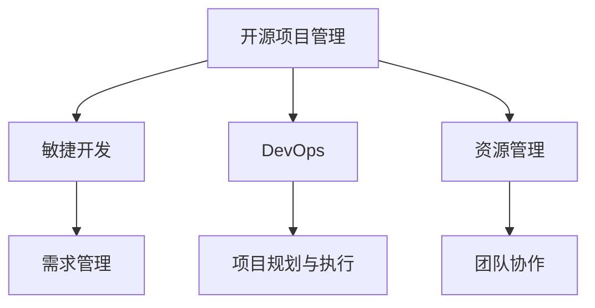

                 

# 开源项目的商业化项目管理：项目规划与执行

> 关键词：开源项目管理,商业化项目,敏捷开发,DevOps,项目规划与执行

## 1. 背景介绍

### 1.1 问题由来

随着开源技术在各行各业的应用深入，越来越多的企业开始采用开源项目来解决实际业务问题。然而，与商业化项目不同，开源项目的核心目标并非盈利，而是推动技术创新与社区发展。因此，开源项目的商业化过程往往面临诸多挑战。如何在开源项目中高效地实现商业化管理，成为了众多企业迫切需要解决的问题。

### 1.2 问题核心关键点

开源项目的商业化管理核心关键点在于：

- 如何在开放环境中平衡贡献者和企业的利益。
- 如何在快速迭代和高质量交付之间找到平衡点。
- 如何高效地进行需求规划和需求变更管理。
- 如何构建高效的团队协作和沟通机制。
- 如何充分利用开源社区资源和商业化技术能力。

## 2. 核心概念与联系

### 2.1 核心概念概述

为了更好地理解开源项目商业化管理的流程和方法，本节将介绍几个密切相关的核心概念：

- **开源项目管理**：指在开放源代码环境下，对开源项目进行规划、执行、监控和交付的过程。
- **敏捷开发**：一种快速响应变化需求、迭代交付的软件开发方法，强调在每个迭代周期内实现可交付价值。
- **DevOps**：一种强调开发与运维协作、自动化持续交付和持续集成的方法论。
- **项目规划与执行**：指在开源项目中，通过制定项目计划、需求管理、资源分配、进度跟踪等手段，确保项目按时高质量交付的过程。

这些核心概念之间的逻辑关系可以通过以下Mermaid流程图来展示：



这个流程图展示了几项关键概念之间的相互作用：

1. 开源项目管理是整体框架，敏捷开发和DevOps是其重要组成部分。
2. 敏捷开发强调快速响应需求，DevOps注重持续交付和集成，两者相辅相成。
3. 项目规划与执行则是确保项目成功的核心，涉及需求管理、资源分配和团队协作等环节。

## 3. 核心算法原理 & 具体操作步骤

### 3.1 算法原理概述

开源项目的商业化管理主要依赖于敏捷开发和DevOps的理念和方法。核心算法原理可以概括为以下几个方面：

- **敏捷开发**：通过迭代周期、用户故事、持续集成等手段，快速响应变化需求，高效交付可交付价值。
- **DevOps**：通过持续交付、持续集成、自动化测试等手段，提高交付效率和稳定性。
- **项目规划与执行**：通过需求分析、风险评估、资源优化等手段，确保项目按时高质量交付。

### 3.2 算法步骤详解

开源项目的商业化管理可以大致分为以下几个步骤：

1. **需求分析与评估**：收集项目需求，进行需求分析和优先级排序，明确项目目标和商业价值。
2. **项目规划与设计**：制定项目计划和设计文档，确定开发流程、交付物和技术栈。
3. **团队组建与协作**：选择合适的团队成员，建立团队协作机制，包括沟通工具、协作流程等。
4. **敏捷开发实施**：按照敏捷开发方法论，进行迭代开发，每轮迭代结束后评估输出和用户反馈。
5. **DevOps实践**：引入自动化测试、持续集成、持续交付等DevOps实践，提高交付效率和稳定性。
6. **监控与反馈**：使用项目管理工具监控项目进度和质量，根据反馈不断调整优化。
7. **迭代迭代迭代**：持续迭代，直至项目交付完成。

### 3.3 算法优缺点

开源项目商业化管理的主要优点包括：

- **快速响应需求**：敏捷开发和DevOps方法论能够快速响应变化需求，提高交付效率。
- **社区参与与贡献**：开源项目能够充分利用社区资源，提高开发效率和代码质量。
- **透明与协作**：开放源代码的环境有助于透明沟通和协作，提高项目成功率。

主要缺点包括：

- **需求变更管理困难**：开源项目的开放特性可能使得需求变更频繁且难以控制。
- **代码质量难以保证**：社区贡献的代码质量可能参差不齐，需要额外的质量保障措施。
- **资源分配复杂**：开源项目往往跨多个组织和社区，资源分配和协作难度较大。

### 3.4 算法应用领域

开源项目的商业化管理在各个领域都有广泛应用，例如：

- **软件开发**：如企业内部软件、开源社区的软件。
- **数据分析**：利用开源数据分析工具，进行数据挖掘和可视化。
- **运维管理**：使用开源运维工具，进行监控、自动化和配置管理。
- **人工智能**：通过开源AI框架和工具，进行模型训练和部署。
- **云计算**：利用开源云计算平台，构建云服务。

## 4. 数学模型和公式 & 详细讲解 & 举例说明

### 4.1 数学模型构建

本节将使用数学语言对开源项目商业化管理的过程进行更加严格的刻画。

定义项目需求为 $D=\{d_1,d_2,\dots,d_n\}$，其中 $d_i$ 表示第 $i$ 个需求。需求优先级为 $P=\{p_1,p_2,\dots,p_n\}$，其中 $p_i$ 表示第 $i$ 个需求的优先级。项目计划为 $P=\{T_1,T_2,\dots,T_k\}$，其中 $T_i$ 表示第 $i$ 个迭代周期。项目进度为 $S=\{s_1,s_2,\dots,s_k\}$，其中 $s_i$ 表示第 $i$ 个迭代周期的进度。

定义需求完成度为 $C=\{c_1,c_2,\dots,c_n\}$，其中 $c_i$ 表示第 $i$ 个需求的完成度。需求风险为 $R=\{r_1,r_2,\dots,r_n\}$，其中 $r_i$ 表示第 $i$ 个需求的风险。

项目风险为 $Q$，定义为所有需求风险的加权和：

$$
Q = \sum_{i=1}^n p_i \times r_i
$$

项目进度为 $S$，定义为所有迭代周期的进度和：

$$
S = \sum_{i=1}^k s_i
$$

项目需求完成度为 $C$，定义为所有需求完成度的加权和：

$$
C = \sum_{i=1}^n p_i \times c_i
$$

### 4.2 公式推导过程

以下我们以软件开发项目为例，推导敏捷开发和DevOps的数学模型：

假设需求 $d_i$ 在迭代周期 $T_j$ 完成，其进度为 $s_{i,j}$，风险为 $r_i$。则该需求在项目周期内的进度为：

$$
s_i = \sum_{j=1}^k s_{i,j}
$$

需求完成度 $c_i$ 定义为：

$$
c_i = \frac{s_i}{p_i}
$$

需求风险 $r_i$ 定义为：

$$
r_i = \frac{1}{1+p_i}
$$

项目风险 $Q$ 定义为：

$$
Q = \sum_{i=1}^n p_i \times r_i = \sum_{i=1}^n \frac{p_i}{1+p_i}
$$

项目进度 $S$ 定义为：

$$
S = \sum_{i=1}^n p_i \times s_i = \sum_{i=1}^n p_i \times \sum_{j=1}^k s_{i,j}
$$

通过这些数学公式，可以清晰地表达和计算敏捷开发和DevOps的关键指标。

### 4.3 案例分析与讲解

考虑一个软件开发项目，项目需求为 20 个，优先级和风险如下表所示：

| 需求 | 优先级 $p_i$ | 风险 $r_i$ |
|------|-------------|-----------|
| d1   | 3           | 0.5       |
| d2   | 2           | 0.3       |
| ...  | ...         | ...       |
| d20  | 1           | 0.2       |

假设每个迭代周期为 2 周，前 4 个迭代周期已完成，进度和需求完成度如下表所示：

| 迭代周期 $T_j$ | 进度 $s_{i,j}$ | 需求完成度 $c_i$ |
|---------------|--------------|----------------|
| T1            | ...          | ...            |
| T2            | ...          | ...            |
| ...           | ...          | ...            |
| T4            | ...          | ...            |

通过上述公式，可以计算出项目风险 $Q$ 和项目进度 $S$ 的值，用于评估项目的整体风险和进度状态。

## 5. 项目实践：代码实例和详细解释说明

### 5.1 开发环境搭建

在进行开源项目商业化管理的实践前，我们需要准备好开发环境。以下是使用Python进行JIRA系统开发的环境配置流程：

1. 安装JIRA软件：从Atlassian官网下载并安装JIRA软件。
2. 配置数据库：设置MySQL或PostgreSQL数据库，用于存储JIRA项目数据。
3. 安装JIRA插件：根据需要安装JIRA插件，如Confluence、Bitbucket等。
4. 安装开发工具：安装Eclipse或IntelliJ IDEA等开发工具，用于编写JIRA相关代码。
5. 安装部署工具：安装Jenkins或GitLab CI等部署工具，用于自动化构建和部署JIRA系统。

完成上述步骤后，即可在开发环境中部署JIRA系统，并进行商业化项目的管理。

### 5.2 源代码详细实现

这里我们以JIRA的需求管理模块为例，给出JIRA系统的代码实现：

```python
import jira
import time

class JIRA:
    def __init__(self, jira_url, username, password):
        self.jira = jira.JIRA(jira_url, username, password)
    
    def create_issue(self, project_key, summary, description, issuetype):
        issue = self.jira.create_issue(project_key, summary, description, issuetype)
        print("Issue created:", issue.key)
    
    def update_issue(self, issue_key, field, value):
        self.jira.update_issue(issue_key, {field: value})
        print("Issue updated:", issue_key)
    
    def close_issue(self, issue_key):
        self.jira.update_issue(issue_key, {'status': {'self': self.jira.state("done", project_key)}}
        print("Issue closed:", issue_key)

# 初始化JIRA对象
jira_obj = JIRA("https://your-jira-server.com", "your-username", "your-password")

# 创建需求
jira_obj.create_issue("PROJ-1", "需求1", "需求描述1", "任务")
jira_obj.create_issue("PROJ-1", "需求2", "需求描述2", "任务")
...

# 更新需求
jira_obj.update_issue("PROJ-1-1", "优先级", "3")
jira_obj.update_issue("PROJ-1-2", "优先级", "2")
...

# 关闭需求
jira_obj.close_issue("PROJ-1-1")
jira_obj.close_issue("PROJ-1-2")
...
```

### 5.3 代码解读与分析

让我们再详细解读一下关键代码的实现细节：

**JIRA类**：
- `__init__`方法：初始化JIRA对象，包括JIRA服务器URL、用户名和密码。
- `create_issue`方法：创建JIRA需求，指定项目、摘要、描述和类型。
- `update_issue`方法：更新JIRA需求，指定字段名和新值。
- `close_issue`方法：关闭JIRA需求，指定需求编号。

**JIRA对象初始化**：
- 在 `__init__` 方法中，通过JIRA官方提供的SDK创建JIRA对象，并传入服务器URL、用户名和密码。
- 初始化完成后，即可使用 `create_issue`、`update_issue`、`close_issue` 等方法，对需求进行创建、更新和关闭操作。

**需求创建与更新**：
- 在 `create_issue` 和 `update_issue` 方法中，通过指定参数创建和更新需求，生成需求ID并打印输出。

**需求关闭**：
- 在 `close_issue` 方法中，通过指定需求ID和关闭状态，关闭已完成的需求。

可以看到，JIRA系统的代码实现相对简单，但功能强大，能够高效管理开源项目的需求。

### 5.4 运行结果展示

以下是JIRA系统的主要功能展示：

1. **需求管理**：在项目首页，列出所有项目的需求列表，并提供创建、更新和关闭操作。
2. **任务追踪**：在需求详情页，可以查看需求的状态、优先级、风险等信息。
3. **进度追踪**：通过迭代周期和需求完成度，评估项目的进度和风险。
4. **协作工具**：提供讨论区、附件上传等功能，方便团队协作。

这些功能展示了JIRA系统在开源项目商业化管理中的强大能力，能够帮助团队高效管理项目需求，确保项目的顺利交付。

## 6. 实际应用场景

### 6.1 企业内部软件开发

企业内部软件开发项目往往涉及多个团队和部门，需求频繁变更。通过JIRA等项目管理工具，可以高效地进行需求管理、任务追踪和进度跟踪，确保项目的顺利推进。例如，某企业通过JIRA系统，实现了对多个部门的项目需求统一管理，提高了开发效率和代码质量。

### 6.2 开源社区项目

开源社区项目通常采用开源许可证，强调社区贡献和合作。通过JIRA等工具，社区成员可以方便地提交和跟踪需求，协作开发，提高项目的贡献度和质量。例如，Apache基金会使用JIRA系统，管理社区的开源项目需求，推动社区的持续发展和壮大。

### 6.3 企业级运维管理

企业级运维管理涉及多个部门和系统，需求变化频繁。通过JIRA等工具，可以高效地进行故障单管理、配置管理、服务请求等操作，确保系统的稳定运行。例如，某电信公司通过JIRA系统，实现了对网络系统的高效管理，提升了运维效率和系统稳定性。

### 6.4 未来应用展望

随着开源项目管理工具的不断发展，未来在开源项目的商业化管理中，将呈现以下几个发展趋势：

1. **AI驱动的自动化**：引入AI技术，实现自动化的需求分析、风险评估和进度跟踪，提高管理效率和准确性。
2. **跨团队协作**：通过DevOps和敏捷开发，实现跨团队的协作和沟通，提升项目的协同性。
3. **云平台集成**：将项目管理工具集成到云平台，实现云资源的高效管理和调度。
4. **可视化管理**：通过可视化工具，展示项目进度、需求状态、风险评估等关键指标，帮助管理者做出更好的决策。

这些趋势将进一步推动开源项目管理工具的发展，使其更好地适应商业化需求，提升项目的成功率和价值。

## 7. 工具和资源推荐

### 7.1 学习资源推荐

为了帮助开发者系统掌握开源项目管理的方法，这里推荐一些优质的学习资源：

1. **《敏捷开发实践》系列书籍**：由Agile联盟发布的经典书籍，深入浅出地介绍了敏捷开发的核心思想和实践方法。
2. **《DevOps：持续交付与持续集成》课程**：Coursera上由Georgia Tech大学开设的课程，详细讲解了DevOps的方法论和实践技巧。
3. **《JIRA官方文档》**：Atlassian提供的JIRA系统官方文档，涵盖了系统配置、开发和运维等各方面的内容。
4. **《项目管理工具实战》博客**：作者Fred George的博客，分享了多种项目管理工具的使用经验和技术实践。

通过对这些资源的学习实践，相信你一定能够快速掌握开源项目管理的方法，并用于解决实际的业务问题。

### 7.2 开发工具推荐

高效的开发离不开优秀的工具支持。以下是几款用于开源项目管理开发的常用工具：

1. **JIRA**：Atlassian公司的项目管理工具，支持敏捷开发和DevOps实践。
2. **Confluence**：Atlassian公司的协作工具，支持文档管理和团队协作。
3. **Bitbucket**：Atlassian公司的代码托管平台，支持版本控制和项目管理。
4. **GitLab CI**：GitLab提供的持续集成和持续交付工具，支持自动化构建和部署。
5. **Jenkins**：开源的自动化构建和持续集成工具，支持多种集成和部署方式。

合理利用这些工具，可以显著提升开源项目商业化管理的开发效率，加快创新迭代的步伐。

### 7.3 相关论文推荐

开源项目管理技术的发展源于学界的持续研究。以下是几篇奠基性的相关论文，推荐阅读：

1. **《敏捷宣言》**：Agile联盟发布的经典宣言，提出了敏捷开发的12条原则。
2. **《DevOps最佳实践》**：Docker和Rackspace公司发布的白皮书，详细介绍了DevOps的实践方法和工具。
3. **《项目管理工具与敏捷开发》**：PMP认证考试推荐书籍，介绍了多种项目管理工具的使用方法。

这些论文代表了大语言模型微调技术的发展脉络。通过学习这些前沿成果，可以帮助研究者把握学科前进方向，激发更多的创新灵感。

## 8. 总结：未来发展趋势与挑战

### 8.1 研究成果总结

本文对开源项目的商业化项目管理进行了全面系统的介绍。首先阐述了开源项目管理的核心关键点，明确了敏捷开发和DevOps在项目管理中的重要地位。其次，从原理到实践，详细讲解了敏捷开发和DevOps的关键步骤，给出了开源项目管理的完整代码实例。同时，本文还广泛探讨了开源项目管理工具在各个领域的应用前景，展示了开源项目管理技术的广阔前景。

通过本文的系统梳理，可以看到，敏捷开发和DevOps方法在开源项目管理中发挥了重要作用，帮助企业高效管理开源项目，确保项目的顺利交付。未来，伴随敏捷开发和DevOps技术的持续演进，开源项目管理工具必将进一步提升项目的成功率和价值。

### 8.2 未来发展趋势

展望未来，开源项目管理工具的发展将呈现以下几个趋势：

1. **AI驱动的自动化**：引入AI技术，实现自动化的需求分析、风险评估和进度跟踪，提高管理效率和准确性。
2. **跨团队协作**：通过DevOps和敏捷开发，实现跨团队的协作和沟通，提升项目的协同性。
3. **云平台集成**：将项目管理工具集成到云平台，实现云资源的高效管理和调度。
4. **可视化管理**：通过可视化工具，展示项目进度、需求状态、风险评估等关键指标，帮助管理者做出更好的决策。

这些趋势将进一步推动开源项目管理工具的发展，使其更好地适应商业化需求，提升项目的成功率和价值。

### 8.3 面临的挑战

尽管敏捷开发和DevOps方法在开源项目管理中取得了显著效果，但在迈向更加智能化、普适化应用的过程中，它仍面临诸多挑战：

1. **需求变更管理困难**：开源项目的开放特性可能使得需求变更频繁且难以控制。如何更好地应对需求变更，是项目管理的重要挑战。
2. **代码质量难以保证**：社区贡献的代码质量可能参差不齐，需要额外的质量保障措施。如何在保证代码质量的同时，提高贡献度，是项目管理的重要课题。
3. **资源分配复杂**：开源项目往往跨多个组织和社区，资源分配和协作难度较大。如何高效地分配资源，确保协作顺利，是项目管理的重要方向。

### 8.4 研究展望

面对开源项目管理面临的种种挑战，未来的研究需要在以下几个方面寻求新的突破：

1. **引入AI技术**：通过引入AI技术，实现自动化的需求分析、风险评估和进度跟踪，提高管理效率和准确性。
2. **跨团队协作**：通过DevOps和敏捷开发，实现跨团队的协作和沟通，提升项目的协同性。
3. **云平台集成**：将项目管理工具集成到云平台，实现云资源的高效管理和调度。
4. **可视化管理**：通过可视化工具，展示项目进度、需求状态、风险评估等关键指标，帮助管理者做出更好的决策。

这些研究方向的探索，必将引领开源项目管理技术迈向更高的台阶，为构建安全、可靠、可解释、可控的智能系统铺平道路。面向未来，开源项目管理技术还需要与其他人工智能技术进行更深入的融合，如知识表示、因果推理、强化学习等，多路径协同发力，共同推动自然语言理解和智能交互系统的进步。只有勇于创新、敢于突破，才能不断拓展开源项目管理技术的边界，让智能技术更好地造福人类社会。

## 9. 附录：常见问题与解答

**Q1：如何平衡敏捷开发和高质量交付？**

A: 敏捷开发和高质量交付并非不可兼得。通过引入自动化测试、持续集成、持续交付等DevOps实践，可以有效提高交付质量和效率。在敏捷开发过程中，注重代码审查、需求评审等环节，确保代码质量和需求一致性。同时，通过跨团队协作和沟通，减少误解和返工，提高交付效率。

**Q2：开源项目的需求变更管理有哪些策略？**

A: 开源项目的需求变更管理需要灵活应对。常用的策略包括：
1. 需求优先级排序：根据需求的重要性和紧急程度，确定优先级。
2. 需求变更评审：在变更前进行评审，评估变更的必要性和可行性。
3. 版本发布管理：使用版本管理工具，记录需求变更的历史和进度。
4. 透明沟通机制：建立透明的沟通渠道，及时通知变更内容和影响。

**Q3：如何在开源项目中实现高效的团队协作？**

A: 高效的团队协作需要良好的沟通和协作机制。常用的策略包括：
1. 敏捷开发工具：使用敏捷开发工具，如JIRA、Trello等，帮助团队协作和任务管理。
2. 定期沟通：建立定期的沟通机制，如站会、邮件等，及时解决协作中的问题。
3. 文档共享：使用文档共享工具，如Confluence、Google Drive等，方便团队协作和知识共享。
4. 代码审查：使用代码审查工具，如Gerrit、GitLab CI等，确保代码质量和一致性。

这些策略有助于提高团队的协作效率，确保项目的顺利推进。

**Q4：如何在开源项目中实现持续交付和持续集成？**

A: 持续交付和持续集成是DevOps的核心实践。常用的策略包括：
1. 自动化测试：使用自动化测试工具，如Selenium、JUnit等，确保代码质量。
2. 持续集成：使用持续集成工具，如Jenkins、GitLab CI等，自动构建和测试代码。
3. 自动化部署：使用自动化部署工具，如Ansible、Chef等，自动化部署代码。
4. 持续反馈：建立持续反馈机制，及时发现和解决问题。

这些策略有助于提高项目的交付效率和稳定性，确保项目的顺利交付。

**Q5：如何应对开源项目中的资源分配问题？**

A: 开源项目的资源分配需要综合考虑多个因素。常用的策略包括：
1. 资源规划：在项目规划阶段，合理规划资源需求。
2. 资源共享：建立资源共享机制，跨团队共享资源。
3. 任务拆分：将复杂任务拆分为多个小任务，分阶段完成。
4. 沟通协调：建立高效的沟通渠道，及时解决资源分配中的问题。

这些策略有助于提高资源利用率，确保项目顺利推进。

通过这些问题的解答，相信你一定能够更好地理解开源项目管理的方法，并在实际应用中取得更好的效果。

