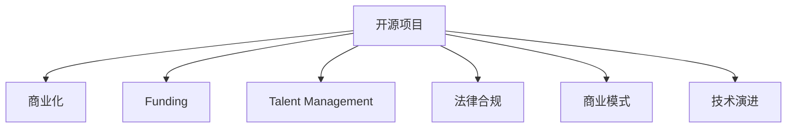

                 

## 1. 背景介绍

### 1.1 问题由来
在科技快速发展的今天，开源项目因其灵活、高效、社区驱动的特性，得到了广泛的应用和推广。无论是商业公司还是个人开发者，都积极参与到开源社区的贡献中来。然而，开源项目的发展并非一帆风顺，商业化过程中常常面临诸多挑战和风险。这些风险不仅可能导致项目资源的浪费，甚至可能威胁到项目的可持续发展。

### 1.2 问题核心关键点
开源项目的商业化风险主要集中在以下几个方面：
1. **资金风险**：开源项目通常由社区成员自愿贡献，缺乏稳定的资金来源。商业化过程中需要考虑如何合理分配资金，以维持项目正常运转。
2. **人才流失**：开源项目吸引人才通常依赖于社区声誉和影响力，一旦商业化过度，可能吸引不到原生态的社区贡献者，导致人才流失。
3. **法律风险**：开源项目需要遵循多重法律和版权协议，商业化过程中可能出现版权纠纷、许可协议冲突等问题。
4. **商业模式模糊**：许多开源项目具有公益性质，缺乏明确的商业模式，商业化过程中需要重新定义项目的价值和盈利方式。
5. **技术风险**：开源项目的技术形态和演进路线可能与市场需求存在差距，商业化过程中需要不断调整和优化技术栈。

### 1.3 问题研究意义
识别和缓解开源项目的商业化风险，对于开源项目的可持续发展、商业伙伴的利益保障以及整个开源生态的繁荣都具有重要意义。只有确保开源项目健康、稳定地商业化，才能吸引更多的企业和开发者参与，共同推动技术的进步和创新。

## 2. 核心概念与联系

### 2.1 核心概念概述

为更好地理解开源项目商业化的风险识别和缓解策略，本节将介绍几个核心概念及其相互之间的关系：

- **开源项目(Open Source Project)**：在公共领域中，任何人都可以查看、修改和分发代码的软件项目。开源项目通常由社区成员共同维护和贡献，追求开放、透明和协作的开发方式。

- **商业化(Commercialization)**：将开源项目中的技术和代码，转化为具有商业价值和盈利能力的产品或服务的过程。商业化过程需要考虑项目的市场价值、用户需求、商业模式等多个维度。

- **资金来源(Funding)**：开源项目在商业化过程中需要考虑资金的来源，包括企业赞助、用户付费、广告收入等多种形式。

- **人才管理(Talent Management)**：开源项目需要有效管理和激励社区成员，确保项目持续活跃和高质量的贡献。

- **法律合规(Legal Compliance)**：开源项目需要遵守开源协议和商业法律，确保项目代码的使用和分发符合相关规定。

- **商业模式(Commercial Model)**：开源项目在商业化过程中需要重新定义项目的价值主张和盈利方式，以满足不同用户的需求和市场环境。

- **技术演进(Technology Evolution)**：开源项目在商业化过程中需要持续迭代和优化技术，以适应市场需求和用户反馈。

这些核心概念之间的逻辑关系可以通过以下Mermaid流程图来展示：



这个流程图展示了开源项目商业化的核心环节及其相互关系：

1. 开源项目通过商业化获得商业价值，推动项目的发展。
2. 资金来源为商业化提供必要的经济基础，保证项目的正常运转。
3. 人才管理是项目持续活力的保障，影响项目的贡献质量和速度。
4. 法律合规是项目合法性的保障，避免法律风险。
5. 商业模式决定了项目的盈利方式，指导商业化策略。
6. 技术演进确保项目保持竞争力，满足市场需求。

## 3. 核心算法原理 & 具体操作步骤

### 3.1 算法原理概述

开源项目商业化的核心算法原理可以归纳为以下几个方面：

1. **需求分析**：通过对市场需求的调研和分析，明确项目的技术优势和潜在市场价值。
2. **资金筹集**：通过多种方式筹集资金，确保项目有足够的资源进行商业化开发。
3. **人才招募与激励**：制定有效的招聘策略和激励机制，吸引和保留优秀人才。
4. **法律合规性审查**：对开源协议和商业法律进行全面审查，确保项目的合规性。
5. **商业模式设计**：结合项目的市场定位和用户需求，设计合理的商业模式。
6. **技术演进与优化**：根据市场需求和技术趋势，持续迭代和优化项目的技术栈。

### 3.2 算法步骤详解

开源项目商业化的一般步骤包括：

**Step 1: 需求调研与分析**
- 进行市场调研，了解目标用户的需求和痛点。
- 分析项目的技术优势和市场竞争力。
- 制定商业化策略和路线图。

**Step 2: 资金筹集**
- 申请企业赞助、政府补贴、用户众筹等多种资金来源。
- 制定详细的资金使用计划，确保资金的高效利用。

**Step 3: 人才招募与激励**
- 制定招聘策略，吸引技术专家和行业人才。
- 制定激励机制，如股权激励、期权计划等，留住核心人才。

**Step 4: 法律合规性审查**
- 对开源协议和商业法律进行全面审查，确保合规性。
- 制定相关政策，避免法律纠纷。

**Step 5: 商业模式设计**
- 根据项目的特点和市场需求，设计合理的商业模式。
- 考虑不同的盈利模式，如软件销售、订阅服务、广告收入等。

**Step 6: 技术演进与优化**
- 根据市场反馈和技术趋势，持续迭代和优化项目。
- 引入新的技术和工具，提升项目的技术水平。

### 3.3 算法优缺点

开源项目商业化算法的优点包括：

1. **灵活性高**：开源项目社区驱动的特性，使其能够快速适应市场变化和技术趋势。
2. **资源共享**：开源项目的代码和资源可以共享，降低商业化开发成本。
3. **社区支持**：开源项目通常有庞大的社区支持，能够提供持续的技术和维护。

然而，开源项目商业化算法也存在一些缺点：

1. **资源分散**：开源项目通常由多个人维护，资源分散，难以集中精力进行商业化开发。
2. **利益冲突**：商业化过程中可能出现商业目标和社区目标的冲突。
3. **商业化压力大**：商业化的压力可能影响开源项目的原生态社区贡献，导致人才流失。
4. **知识产权风险**：开源项目在商业化过程中需要处理复杂的知识产权问题。

### 3.4 算法应用领域

开源项目商业化算法广泛应用于各种软件开发项目和开源社区中，如：

- **软件开发**：将开源项目转化为商业软件，如MySQL、Apache Kafka等。
- **服务提供商**：将开源项目转化为SaaS服务，如AWS、Microsoft Azure等。
- **开源组织**：开源项目的商业化，如Apache、Linux基金会等。

这些领域的应用展示了开源项目商业化的广泛影响力和成功案例。

## 4. 数学模型和公式 & 详细讲解 & 举例说明

### 4.1 数学模型构建

在商业化过程中，可以使用一些数学模型来辅助决策和优化。例如，可以使用成本-收益分析(Cost-Benefit Analysis, CBA)模型来评估商业化项目的经济效益。

设项目总成本为 $C$，总收益为 $R$，净收益为 $N$，则有：

$$
N = R - C
$$

其中 $R$ 包括直接收益和间接收益，$C$ 包括开发成本、运营成本和法律成本等。

### 4.2 公式推导过程

以成本-收益分析模型为例，推导其计算过程：

1. **定义变量**：
   - 设总成本 $C$ 包括开发成本 $C_{dev}$、运营成本 $C_{op}$ 和法律成本 $C_{law}$。
   - 设总收益 $R$ 包括直接收益 $R_{direct}$ 和间接收益 $R_{indirect}$。

2. **建立模型**：
   - 开发成本 $C_{dev}$ 可以表示为 $C_{dev} = f_{dev}(X)$，其中 $f_{dev}$ 为开发成本函数，$X$ 为开发工作量。
   - 运营成本 $C_{op}$ 可以表示为 $C_{op} = g_{op}(Y)$，其中 $g_{op}$ 为运营成本函数，$Y$ 为运营规模。
   - 法律成本 $C_{law}$ 可以表示为 $C_{law} = h_{law}(Z)$，其中 $h_{law}$ 为法律成本函数，$Z$ 为法律合规审查的复杂度。
   - 直接收益 $R_{direct}$ 可以表示为 $R_{direct} = k_{direct}(U)$，其中 $k_{direct}$ 为直接收益函数，$U$ 为市场规模。
   - 间接收益 $R_{indirect}$ 可以表示为 $R_{indirect} = m_{indirect}(V)$，其中 $m_{indirect}$ 为间接收益函数，$V$ 为用户满意度。

3. **计算净收益**：
   - 净收益 $N = R - C = k_{direct}(U) + m_{indirect}(V) - [f_{dev}(X) + g_{op}(Y) + h_{law}(Z)]$。

### 4.3 案例分析与讲解

假设某开源项目 A 的开发成本 $C_{dev} = 100$ 万美元，运营成本 $C_{op} = 10$ 万美元，法律成本 $C_{law} = 1$ 万美元。直接收益 $R_{direct} = 0.8 \times U$，间接收益 $R_{indirect} = 0.2 \times V$，其中 $U$ 和 $V$ 分别代表市场规模和用户满意度。

若市场规模 $U = 1000$ 万美元，用户满意度 $V = 90$，则有：

$$
R_{direct} = 0.8 \times 1000 = 800 \text{ 万美元}
$$
$$
R_{indirect} = 0.2 \times 90 = 18 \text{ 万美元}
$$
$$
C = 100 + 10 + 1 = 111 \text{ 万美元}
$$

计算净收益 $N$：

$$
N = R_{direct} + R_{indirect} - C = 800 + 18 - 111 = 707 \text{ 万美元}
$$

通过计算，可以看到该开源项目 A 的商业化净收益为 $707$ 万美元，具有良好的商业前景。

## 5. 项目实践：代码实例和详细解释说明

### 5.1 开发环境搭建

在开始开源项目的商业化实践前，需要准备好开发环境。以下是使用Python进行Open Source项目商业化开发的环境配置流程：

1. 安装Python：从官网下载并安装最新版本的Python。
2. 安装必要的包：如NumPy、Pandas、SciPy等科学计算库。
3. 配置IDE：选择适合的开发环境，如PyCharm、Jupyter Notebook等。
4. 创建虚拟环境：使用virtualenv或conda创建虚拟环境，避免依赖冲突。
5. 安装商业化开发工具：如Jenkins、GitLab CI、Docker等，以便自动化开发和部署。

完成上述步骤后，即可在虚拟环境中开始商业化开发实践。

### 5.2 源代码详细实现

下面我们以Open Source项目为例，给出开源项目商业化的PyTorch代码实现。

首先，定义商业化需求函数：

```python
import numpy as np

def calculate_cost_benefit(c_dev, c_op, c_law, r_direct, r_indirect, u, v):
    """
    计算成本-收益分析的净收益
    """
    total_cost = c_dev + c_op + c_law
    direct_revenue = r_direct * u
    indirect_revenue = r_indirect * v
    net_revenue = direct_revenue + indirect_revenue - total_cost
    return net_revenue
```

然后，定义商业化策略函数：

```python
def strategy_analysis(c_dev, c_op, c_law, r_direct, r_indirect, u, v):
    """
    分析商业化策略，返回商业化建议
    """
    net_revenue = calculate_cost_benefit(c_dev, c_op, c_law, r_direct, r_indirect, u, v)
    if net_revenue > 0:
        return "建议商业化"
    else:
        return "建议放弃商业化"
```

最后，启动商业化策略分析：

```python
c_dev = 100  # 开发成本
c_op = 10   # 运营成本
c_law = 1   # 法律成本
r_direct = 0.8  # 直接收益函数系数
r_indirect = 0.2  # 间接收益函数系数
u = 1000  # 市场规模
v = 90  # 用户满意度

strategy = strategy_analysis(c_dev, c_op, c_law, r_direct, r_indirect, u, v)
print(f"商业化策略建议：{strategy}")
```

以上代码实现了对开源项目商业化策略的分析，计算净收益并输出建议。通过调整相关参数，可以进行不同的商业化策略分析。

### 5.3 代码解读与分析

让我们再详细解读一下关键代码的实现细节：

**calculate_cost_benefit函数**：
- 计算成本-收益分析的净收益。
- 根据给出的各项成本和收益参数，调用净收益计算公式，输出结果。

**strategy_analysis函数**：
- 分析商业化策略，根据净收益决定是否建议商业化。
- 如果净收益大于0，建议商业化；否则建议放弃商业化。

**商业化策略分析**：
- 调用商业化策略分析函数，输出商业化建议。
- 通过计算净收益，分析项目的商业化可行性。

可以看到，商业化分析的代码实现简洁明了，能够帮助开发者快速进行商业化策略的评估。

## 6. 实际应用场景

### 6.1 智能应用场景

开源项目的商业化在智能应用场景中具有广泛的应用前景，如：

- **智能家居**：开源项目可以将智能家居设备的标准化接口、软件框架等资源进行商业化，帮助厂商快速开发智能家居应用。
- **智能制造**：开源项目可以将工业互联网平台、设备监控系统等技术资源进行商业化，提升制造业的智能化水平。
- **智能健康**：开源项目可以将健康监测设备、智能医疗系统等技术资源进行商业化，推动医疗健康领域的创新和应用。

这些应用场景展示了开源项目商业化在推动行业智能化进程中的重要作用。

### 6.2 开源社区治理

开源项目的商业化也广泛应用于开源社区的治理和管理，如：

- **社区资助**：通过商业化收入支持开源社区的运营和发展。
- **人才激励**：为开源项目的贡献者提供薪酬、股权等激励，吸引和保留优秀人才。
- **法律保障**：通过商业化项目，为开源社区提供法律保障，解决版权和知识产权问题。

这些治理措施帮助开源社区在商业化的道路上更加稳健和可持续。

### 6.3 开源技术推广

开源项目的商业化还可以促进开源技术的推广和应用，如：

- **技术合作**：通过商业化项目，开源技术更容易被企业和开发者采纳，推动技术应用普及。
- **市场教育**：商业化项目通过推广开源技术，提高市场对开源技术的认识和接受度。
- **技术交流**：商业化项目可以为开发者提供交流和协作的平台，促进技术创新和传播。

这些推广措施能够帮助开源技术更好地融入商业环境，提升市场竞争力。

### 6.4 未来应用展望

随着开源项目的不断发展和商业化策略的不断优化，未来开源项目的商业化将呈现以下几个发展趋势：

1. **产业融合**：开源项目与行业深度融合，成为行业标准和基础设施。
2. **全球化推广**：开源项目在全球范围内推广和应用，形成全球性的生态系统。
3. **技术创新**：开源项目持续创新，推动新兴技术的应用和发展。
4. **平台化发展**：开源项目向平台化方向发展，提供一站式解决方案。
5. **社区生态**：开源项目注重社区生态建设，形成良性互动和持续贡献。

这些趋势展示了开源项目商业化的广阔前景，预示着开源技术将在未来发挥更加重要的作用。

## 7. 工具和资源推荐

### 7.1 学习资源推荐

为了帮助开发者系统掌握开源项目商业化的理论和实践，这里推荐一些优质的学习资源：

1. **《Open Source Development: A Review》论文**：对开源项目的商业化进行全面的综述，涵盖资金筹集、人才管理、法律合规等多个方面。
2. **《Open Source Business Model Canvas》书籍**：介绍开源项目的商业化模型，帮助开发者制定商业化策略。
3. **《Open Source Software Development and Testing》书籍**：介绍开源项目开发和测试的最佳实践，确保项目的商业化顺利进行。
4. **GitHub开源社区**：提供丰富的开源项目资源和商业化案例，帮助开发者学习和借鉴。
5. **Apache基金会网站**：Apache基金会提供开源项目商业化的指南和资源，帮助开源项目商业化成功。

通过对这些资源的学习实践，相信你一定能够全面掌握开源项目商业化的精髓，并用于解决实际的商业化问题。

### 7.2 开发工具推荐

高效的开发离不开优秀的工具支持。以下是几款用于开源项目商业化开发的常用工具：

1. **GitHub**：全球最大的开源代码托管平台，提供版本控制、协作开发、项目管理等多种功能。
2. **GitLab CI**：提供持续集成和持续部署服务，帮助开发者自动化测试和部署。
3. **Jenkins**：开源的自动化服务器，支持大规模的开源项目商业化开发和部署。
4. **Docker**：提供容器化解决方案，帮助开发者打包和部署商业化项目。
5. **Apache Kafka**：提供开源的消息队列系统，支持大规模数据流的处理和分析。

合理利用这些工具，可以显著提升开源项目商业化的开发效率，加快创新迭代的步伐。

### 7.3 相关论文推荐

开源项目商业化技术的发展源于学界的持续研究。以下是几篇奠基性的相关论文，推荐阅读：

1. **《Open Source Software: History, Themes, and Directions》论文**：介绍开源项目的历史、主题和未来方向，具有重要的学术价值。
2. **《Open Source Software Development: Processes, Models, and Tools》书籍**：全面介绍开源项目开发的最佳实践，涵盖过程、模型和工具等多个方面。
3. **《Open Source Business Model Canvases: Exploring open source strategies for business models》论文**：对开源项目的商业模型进行研究，提出多种商业化策略。
4. **《Open Source Projects in Cloud Computing》书籍**：介绍开源项目在云计算领域的应用和商业化策略，具有实际应用价值。
5. **《Open Source Development in the Age of Digital Transformation》论文**：探讨数字转型时代开源项目的发展和商业化路径。

这些论文代表了大规模开源项目商业化技术的发展脉络。通过学习这些前沿成果，可以帮助研究者把握学科前进方向，激发更多的创新灵感。

## 8. 总结：未来发展趋势与挑战

### 8.1 总结

本文对开源项目商业化的风险识别和缓解策略进行了全面系统的介绍。首先阐述了开源项目商业化的背景和意义，明确了商业化在开源项目发展中的关键作用。其次，从原理到实践，详细讲解了开源项目商业化的数学模型和关键步骤，给出了商业化任务开发的完整代码实例。同时，本文还广泛探讨了开源项目商业化在智能应用、开源社区治理、技术推广等多个领域的应用前景，展示了开源项目商业化的广泛影响力和成功案例。此外，本文精选了开源项目商业化的各类学习资源，力求为读者提供全方位的技术指引。

通过本文的系统梳理，可以看到，开源项目商业化风险识别和缓解策略，对于开源项目的可持续发展、商业伙伴的利益保障以及整个开源生态的繁荣都具有重要意义。只有确保开源项目健康、稳定地商业化，才能吸引更多的企业和开发者参与，共同推动技术的进步和创新。

### 8.2 未来发展趋势

展望未来，开源项目商业化技术将呈现以下几个发展趋势：

1. **资源整合**：开源项目商业化需要整合更多资源，如云计算、大数据、人工智能等，提升项目的技术和市场竞争力。
2. **平台化建设**：开源项目向平台化方向发展，提供一站式解决方案，提升用户体验。
3. **全球化推广**：开源项目在全球范围内推广和应用，形成全球性的生态系统。
4. **技术创新**：开源项目持续创新，推动新兴技术的应用和发展。
5. **社区生态**：开源项目注重社区生态建设，形成良性互动和持续贡献。

以上趋势凸显了开源项目商业化的广阔前景，预示着开源技术将在未来发挥更加重要的作用。

### 8.3 面临的挑战

尽管开源项目商业化技术已经取得了瞩目成就，但在迈向更加智能化、普适化应用的过程中，它仍面临诸多挑战：

1. **资金压力**：开源项目在商业化过程中需要持续投入资金，但资金来源和分配问题往往难以解决。
2. **人才流失**：商业化过程可能吸引不到原生态的社区贡献者，导致人才流失。
3. **法律风险**：开源项目在商业化过程中需要处理复杂的知识产权问题，存在法律风险。
4. **技术适配**：开源项目的技术形态和演进路线可能与市场需求存在差距，需要不断调整和优化技术栈。
5. **商业化压力**：商业化的压力可能影响开源项目的原生态社区贡献，导致人才流失。

这些挑战需要开发者在技术、管理、法律等多个层面进行全面应对。只有系统性地解决这些问题，开源项目才能在商业化过程中稳健发展。

### 8.4 研究展望

面对开源项目商业化所面临的挑战，未来的研究需要在以下几个方面寻求新的突破：

1. **资金多样化**：探索多种资金来源，如众筹、股权融资、政府资助等，确保开源项目的持续资金支持。
2. **人才激励机制**：制定合理的激励机制，如薪酬、股权、期权等，吸引和保留优秀人才。
3. **法律合规保障**：加强法律合规审查，确保开源项目的合法性，规避法律风险。
4. **技术适配优化**：持续迭代和优化开源项目的技术栈，确保与市场需求和技术趋势一致。
5. **商业化压力缓解**：通过合理的商业化策略和社区管理，缓解商业化压力，保障项目的可持续发展。

这些研究方向将推动开源项目商业化技术的不断进步，促进开源技术的创新和应用。

## 9. 附录：常见问题与解答

**Q1: 开源项目在商业化过程中应该如何选择合适的资金来源？**

A: 开源项目在商业化过程中，可以选择多种资金来源，如企业赞助、政府补贴、用户众筹、股权融资等。选择合适的资金来源需要考虑以下几个方面：
1. 资金的稳定性：选择稳定的资金来源，避免资金中断影响项目发展。
2. 资金的使用效率：确保资金高效利用，避免资源浪费。
3. 资金的合规性：确保资金来源合规，避免法律风险。
4. 资金的多样化：多样化资金来源，减少单一资金来源的风险。

选择合适的资金来源需要综合考虑项目的规模、需求和市场环境，确保资金能够持续支持项目的商业化。

**Q2: 开源项目在商业化过程中应该如何进行人才管理？**

A: 开源项目在商业化过程中，需要进行有效的人才管理，以确保项目持续活跃和高质量的贡献。以下是几种有效的人才管理策略：
1. 制定招聘策略：根据项目需求，制定有吸引力的招聘策略，吸引优秀人才。
2. 制定激励机制：为开源项目的贡献者提供薪酬、股权、期权等激励，留住核心人才。
3. 提供培训机会：为开发者提供培训和学习机会，提高团队技术水平。
4. 构建社区文化：营造良好的社区文化，吸引更多开发者参与。
5. 关注人才流失：及时发现并解决人才流失问题，防止核心人才流失。

通过这些策略，可以有效管理开源项目的人才资源，确保项目的可持续发展。

**Q3: 开源项目在商业化过程中应该如何进行法律合规性审查？**

A: 开源项目在商业化过程中，需要进行全面的法律合规性审查，以确保项目的合法性。以下是几种有效的法律合规策略：
1. 审查开源协议：确保项目的代码使用和分发符合开源协议的要求。
2. 审查商业法律：确保项目的商业活动符合相关商业法律和规定。
3. 制定合规政策：制定详细的法律合规政策，指导项目的法律合规性审查。
4. 进行法律培训：对项目团队进行法律培训，提高法律合规意识。
5. 寻求法律支持：寻求专业的法律支持，解决法律合规问题。

通过这些策略，可以有效确保开源项目的合法性，规避法律风险。

**Q4: 开源项目在商业化过程中应该如何进行技术演进与优化？**

A: 开源项目在商业化过程中，需要进行持续的技术演进与优化，以适应市场需求和技术趋势。以下是几种有效的技术演进策略：
1. 持续迭代：根据市场需求和技术趋势，持续迭代和优化项目。
2. 引入新技术：引入新的技术和工具，提升项目的技术水平。
3. 进行技术评估：对新技术进行评估，选择最适合项目的技术。
4. 进行技术交流：与行业专家和技术社区进行技术交流，提升项目的技术水平。
5. 进行技术测试：进行全面的技术测试，确保新技术的可靠性和稳定性。

通过这些策略，可以有效进行开源项目的技术演进与优化，保持项目的竞争力。

**Q5: 开源项目在商业化过程中应该如何进行商业化策略分析？**

A: 开源项目在商业化过程中，需要进行全面的商业化策略分析，以确保商业化的成功。以下是几种有效的商业化策略分析策略：
1. 进行成本收益分析：使用成本收益分析模型，评估商业化的经济效益。
2. 进行市场调研：了解目标市场需求和用户痛点，制定商业化策略。
3. 进行商业模型设计：根据项目特点和市场需求，设计合理的商业模式。
4. 进行风险评估：评估商业化过程中的风险，制定风险应对措施。
5. 进行商业化测试：进行商业化测试，验证商业化策略的可行性。

通过这些策略，可以有效进行开源项目的商业化策略分析，确保商业化的成功。

---

作者：禅与计算机程序设计艺术 / Zen and the Art of Computer Programming

