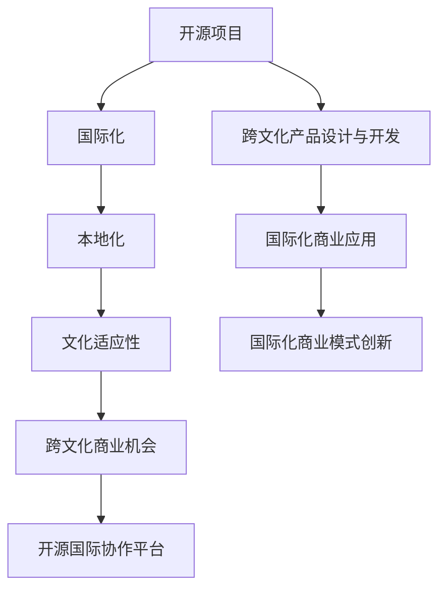

                 

# 开源项目的国际化咨询：跨文化商业机会

## 1. 背景介绍

在全球化的大背景下，开源项目已成为推动全球技术创新和应用普及的重要力量。然而，随着不同国家和地区的文化差异、市场需求和技术成熟度的提升，开源项目的国际化变得愈发重要。从开源社区的全球布局到商业模式的国际拓展，再到跨文化产品的设计与开发，开源项目的国际化咨询已成为企业发展的重要议题。本文将从大背景入手，全面探讨开源项目国际化的核心概念、核心算法和具体操作步骤，帮助读者建立清晰的国际化视野。

## 2. 核心概念与联系

### 2.1 核心概念概述

为更好地理解开源项目国际化，本节将介绍几个密切相关的核心概念：

- **开源项目(Open Source Project)**：指公开源代码、免费供他人使用的软件项目。开源项目通过社区协作开发，实现技术共享，加速创新，降低成本。

- **国际化(Internationalization)**：指将软件产品开发为能在全球多个国家和地区正确运行的本地化过程。

- **本地化(Localization)**：指将产品本地化为特定语言和地区，满足特定市场和文化需求的流程。

- **文化适应性(Cultural Adaptability)**：指软件产品满足不同文化背景用户需求的能力，包括语言、习俗、法规等方面的适应。

- **跨文化商业机会(Cross-Cultural Business Opportunities)**：指开源项目通过国际化拓展市场、技术和商业模式，开拓新的商业机会和价值。

- **开源国际协作平台**：如GitHub、Apache Foundation等，提供全球化的协作和代码托管环境，帮助项目进行国际化的开发和运营。

这些核心概念之间的逻辑关系可以通过以下Mermaid流程图来展示：



这个流程图展示了大规模开源项目的核心概念及其之间的关系：

1. 开源项目通过全球协作开发，产生源代码和软件产品。
2. 国际化过程将软件产品适配为全球多个地区的本地化需求。
3. 本地化过程中实现文化适应性，满足不同文化背景用户的需求。
4. 通过跨文化商业机会，开源项目拓展全球市场和商业模式。
5. 开源国际协作平台提供全球协作环境，支持国际化进程。
6. 跨文化产品设计与开发，直接面向国际用户。
7. 国际化商业应用将国际化产品应用到全球市场中。
8. 国际化商业模式创新，开拓新的商业路径和盈利方式。

## 3. 核心算法原理 & 具体操作步骤

### 3.1 算法原理概述

开源项目国际化涉及多个算法和策略，核心算法原理主要集中在本地化和国际化设计上。以下是对几个关键算法的详细介绍：

1. **本地化算法**：通过自动翻译和本地化处理，将源代码和产品文本适配为特定语言和地区。主要算法包括机器翻译、自动文本生成和字符编码转换等。

2. **国际化设计算法**：确保软件产品能够在全球范围内正确运行，不依赖特定本地环境。主要算法包括国际日期格式、货币格式、文本排序和字符集处理等。

3. **文化适应性算法**：通过算法处理，使软件产品满足不同文化背景用户的需求。主要算法包括节假日处理、宗教习俗适应、法规合规检查等。

### 3.2 算法步骤详解

开源项目国际化的核心步骤包括：

**Step 1: 需求分析**
- 分析目标市场的需求，确定本地化和国际化的具体要求。

**Step 2: 源代码本地化**
- 对源代码进行本地化处理，包括字符编码转换、文本注释修改和工具链适配等。

**Step 3: 产品本地化**
- 将软件产品适配为本地化，包括自动翻译、语言包安装和本地化界面设计等。

**Step 4: 文化适应性处理**
- 对软件产品进行文化适应性处理，确保符合不同文化背景用户的需求。

**Step 5: 国际化测试**
- 在目标市场进行国际化测试，检查软件产品的正确性和稳定性。

**Step 6: 国际化部署与运营**
- 将国际化软件产品部署到目标市场，进行国际化的用户支持和市场推广。

### 3.3 算法优缺点

开源项目国际化算法具有以下优点：

- 促进全球协作，加速技术创新和代码共享。
- 满足全球用户需求，提升市场竞争力。
- 降低本地化成本，提高国际市场渗透率。

同时，该算法也存在一些缺点：

- 复杂的本地化工作量大，需要投入大量人力和资源。
- 不同地区文化和语言差异可能导致产品兼容性问题。
- 国际化的产品设计、测试和维护成本较高。

### 3.4 算法应用领域

开源项目国际化算法在多个领域得到广泛应用：

- **开源社区和项目**：如Linux、Apache HTTP Server、Mozilla Firefox等，通过国际化协作平台提供全球化的代码和产品。

- **跨文化软件产品**：如OpenOffice、Google Chrome、Mozilla Thunderbird等，满足全球用户在不同文化背景下的使用需求。

- **国际化商业应用**：如Salesforce、Shopify、Slack等，通过国际化的产品和服务拓展全球市场。

## 4. 数学模型和公式 & 详细讲解 & 举例说明

### 4.1 数学模型构建

假设有一个开源项目，源代码和软件产品需要适配多个语言和地区。我们定义一个语言集合 $L$ 和一个地区集合 $R$。对每个语言 $l \in L$ 和地区 $r \in R$，定义对应的本地化函数 $f_{l,r}$，表示将源代码和产品文本适配为该语言和地区的过程。定义目标市场的集合 $M$，表示所有需要适配的市场。

### 4.2 公式推导过程

对每个市场 $m \in M$，定义本地化成本函数 $C(m)$，表示在该市场上进行本地化处理的总成本。定义用户满意度函数 $S(m)$，表示在该市场上用户对本地化产品的满意度。本地化算法目标为最小化本地化成本函数，同时最大化用户满意度函数：

$$
\min_{f_{l,r}} C(m) \quad \text{subject to} \quad S(m) \geq \epsilon
$$

其中 $\epsilon$ 为用户满意度的最小值。

### 4.3 案例分析与讲解

我们以GitHub国际化为例，分析其本地化算法的实现过程：

GitHub的本地化算法包括以下步骤：

1. 收集全球用户反馈和需求，确定需要本地化的语言和地区。

2. 对源代码进行字符编码转换和工具链适配，确保代码兼容不同本地环境。

3. 利用机器翻译技术，将产品文本翻译为多种语言，并生成对应的语言包。

4. 在本地化过程中进行文化适应性处理，确保产品符合不同文化背景用户的需求。

5. 在国际化测试中检查产品性能，确保在不同地区的正确性和稳定性。

6. 部署和推广国际化产品，提供跨文化用户支持和市场推广。

## 5. 项目实践：代码实例和详细解释说明

### 5.1 开发环境搭建

在进行国际化实践前，我们需要准备好开发环境。以下是使用Python进行OpenPyXL开发的环境配置流程：

1. 安装Anaconda：从官网下载并安装Anaconda，用于创建独立的Python环境。

2. 创建并激活虚拟环境：
```bash
conda create -n py3k python=3.8 
conda activate py3k
```

3. 安装OpenPyXL：
```bash
pip install openpyxl
```

4. 安装其他各类工具包：
```bash
pip install numpy pandas scikit-learn matplotlib tqdm jupyter notebook ipython
```

完成上述步骤后，即可在`py3k`环境中开始国际化实践。

### 5.2 源代码详细实现

下面以一个简单的国际化示例为例，给出使用OpenPyXL进行Excel文件本地化的Python代码实现。

首先，定义本地化函数，用于将Excel文本适配为指定语言：

```python
import openpyxl
from openpyxl.styles import Font, Alignment

def localize_excel(excel_file, target_language):
    wb = openpyxl.load_workbook(excel_file)
    ws = wb.active
    ws.title = ws.title + " (" + target_language + ")"
    
    # 设置字体和对齐方式
    for cell in ws.iter_rows(values_only=True):
        for col_idx, value in enumerate(cell):
            if value and value != "":
                ws.cell(row=cell[0][0], column=col_idx+1).value = value
                ws.cell(row=cell[0][0], column=col_idx+1).font = Font(name=target_language)
                ws.cell(row=cell[0][0], column=col_idx+1).alignment = Alignment(horizontal='center')
    wb.save(excel_file)
```

然后，定义测试函数，用于生成本地化的Excel文件：

```python
from openpyxl.utils import get_column_letter

def test_localize_excel():
    # 生成示例Excel文件
    wb = openpyxl.Workbook()
    ws = wb.active
    ws.title = "Sample Data"
    ws.cell(row=1, column=1).value = "Name"
    ws.cell(row=1, column=2).value = "Email"
    ws.cell(row=2, column=1).value = "Alice"
    ws.cell(row=2, column=2).value = "alice@example.com"
    ws.cell(row=3, column=1).value = "Bob"
    ws.cell(row=3, column=2).value = "bob@example.com"
    
    # 本地化Excel文件
    for lang in ["zh-CN", "en-US"]:
        localize_excel(wb.filename, lang)
        print(f"Localization complete for {lang} language.")
        
    # 输出本地化后的Excel文件名
    print(f"Localization completed for {len(wb.sheetnames)} languages.")
```

最后，启动本地化过程：

```python
test_localize_excel()
```

以上就是使用OpenPyXL对Excel文件进行本地化的完整代码实现。可以看到，通过OpenPyXL库，我们可以方便地进行Excel文件的本地化处理，满足不同语言和地区的需求。

### 5.3 代码解读与分析

让我们再详细解读一下关键代码的实现细节：

**localize_excel函数**：
- 对传入的Excel文件进行本地化处理，包括设置语言标题、字体和对齐方式等。

**test_localize_excel函数**：
- 生成一个示例Excel文件，并对其进行本地化处理。
- 循环处理不同语言，生成多个本地化文件。
- 输出本地化完成情况和文件数量。

通过这个例子，我们可以看到，OpenPyXL库提供了强大的本地化处理功能，使得Excel文件的国际化变得简单易行。开发者可以根据实际需求，进一步扩展本地化功能，满足更多业务场景。

## 6. 实际应用场景

### 6.1 跨国企业软件

跨国企业软件的国际化需求尤为突出，如Salesforce、Oracle、Microsoft Office等。国际化软件能够满足全球用户的本地化需求，提升用户体验和满意度。

具体而言，国际化软件需要具备以下特点：

- 多语言支持：软件界面和文本能够根据用户语言自动切换。
- 多地区支持：软件功能根据不同地区的法规和标准进行调整。
- 多时区支持：软件时间根据用户时区自动调整。
- 本地化测试：在目标市场进行测试，确保软件性能和稳定性。

### 6.2 开源社区和项目

开源社区和项目如GitHub、Apache Foundation等，通过国际化协作平台提供全球化的代码和产品。国际化的开源项目能够吸引全球开发者，加速技术创新和代码共享。

例如，GitHub提供代码的语言、地区、时区等本地化功能，支持开发者在不同地区协作开发，并进行本地化测试和部署。

### 6.3 企业级应用

企业级应用如Salesforce、Shopify、Slack等，通过国际化的产品和服务拓展全球市场。国际化应用能够满足不同地区和用户需求，提升企业竞争力。

例如，Salesforce的国际化支持语言、时区、货币、法规等本地化功能，能够在全球范围内提供一致的用户体验和业务支持。

## 7. 工具和资源推荐

### 7.1 学习资源推荐

为帮助开发者系统掌握开源项目国际化的理论基础和实践技巧，这里推荐一些优质的学习资源：

1. **《开源项目的国际化实践》系列博文**：由开源社区专家撰写，深入浅出地介绍了开源项目国际化的核心概念、实践技巧和案例分析。

2. **《软件国际化设计》课程**：由Coursera平台提供，系统讲解了软件国际化设计的原理、技术和工具。

3. **《GitHub官方文档》**：GitHub的国际化官方文档，提供了详细的国际化指南和样例代码，是上手实践的必备资料。

4. **《开源社区国际化指南》**：Apache Foundation等开源社区提供的国际化指南，涵盖了国际化协作和产品设计的最佳实践。

5. **《软件国际化的挑战与对策》**：详细探讨了软件国际化面临的技术和商业挑战，提供了相应的解决方案。

通过对这些资源的学习实践，相信你一定能够快速掌握开源项目国际化的精髓，并用于解决实际的业务问题。

### 7.2 开发工具推荐

高效的开发离不开优秀的工具支持。以下是几款用于开源项目国际化的常用工具：

1. **GitHub**：开源社区协作和代码托管平台，提供全球化的协作环境和本地化支持。

2. **OpenPyXL**：Python库，用于操作Excel文件，支持多语言本地化。

3. **i18next**：JavaScript库，用于前端国际化，支持多语言切换和本地化处理。

4. **PyExcel**：Python库，用于操作Excel文件，支持多语言本地化。

5. **Unicode**：Python内置模块，提供字符编码和本地化支持。

合理利用这些工具，可以显著提升开源项目国际化的开发效率，加快创新迭代的步伐。

### 7.3 相关论文推荐

开源项目国际化的研究已经取得了丰硕的成果，以下是几篇奠基性的相关论文，推荐阅读：

1. **《开源项目的国际化挑战与应对》**：详细探讨了开源项目国际化的挑战和解决方案，提供了丰富的案例分析。

2. **《软件国际化设计原理与实践》**：系统讲解了软件国际化的设计原则和技术方法，为国际化开发提供了理论基础。

3. **《开源社区的国际化协作模式》**：研究了开源社区的国际化协作模式，提出了有效的协作机制和工具。

4. **《跨文化产品设计与开发》**：介绍了跨文化产品设计的原理和实践，为国际化产品的开发提供了指南。

这些论文代表了大规模开源项目国际化的发展脉络。通过学习这些前沿成果，可以帮助研究者把握学科前进方向，激发更多的创新灵感。

## 8. 总结：未来发展趋势与挑战

### 8.1 总结

本文对开源项目国际化进行了全面系统的介绍。首先阐述了开源项目国际化的研究背景和意义，明确了国际化在促进全球协作、提升市场竞争力和拓展新商业机会方面的独特价值。其次，从原理到实践，详细讲解了国际化算法的核心步骤和具体操作步骤，给出了国际化任务开发的完整代码实例。同时，本文还广泛探讨了国际化在跨国企业软件、开源社区和项目、企业级应用等领域的实际应用场景，展示了国际化的广泛应用前景。

通过本文的系统梳理，可以看到，开源项目的国际化咨询已成为企业发展的重要议题，在推动全球技术创新和市场拓展方面具有重要作用。未来，伴随国际化协作平台的不断完善和国际市场需求的持续增长，开源项目的国际化将迎来更加广阔的发展空间。

### 8.2 未来发展趋势

展望未来，开源项目国际化将呈现以下几个发展趋势：

1. **自动化本地化工具**：随着AI和机器学习技术的发展，本地化工作将逐步自动化，减少人力投入，提高效率。

2. **跨文化智能优化**：通过智能算法优化，软件产品能够更好地适应不同文化背景用户的需求，提升用户体验。

3. **全球协作平台的发展**：开源国际协作平台将进一步完善，促进全球开发者和企业间的协作与交流。

4. **多模态国际化**：国际化不仅限于代码和文本，还包括多模态数据的本地化，如语音、图像等。

5. **全球数据标准**：建立全球数据标准，确保国际化产品的数据格式和接口规范一致，促进跨国数据共享。

以上趋势凸显了开源项目国际化的广阔前景。这些方向的探索发展，必将进一步推动全球技术创新和市场拓展，加速人类社会的数字化进程。

### 8.3 面临的挑战

尽管开源项目国际化已经取得了显著成就，但在迈向更加智能化、普适化应用的过程中，仍面临诸多挑战：

1. **文化和语言差异**：不同国家和地区的文化和语言差异可能导致产品兼容性问题。

2. **本地化成本**：本地化过程需要投入大量人力和资源，成本较高。

3. **法规和合规**：不同地区的法规和标准不同，国际化产品需要符合不同地区的要求。

4. **用户反馈和测试**：国际市场的需求和用户反馈需要持续收集和处理，测试环境复杂。

5. **技术和工具支持**：现有技术和工具可能不完善，需要进一步优化和改进。

### 8.4 研究展望

面对开源项目国际化面临的种种挑战，未来的研究需要在以下几个方面寻求新的突破：

1. **智能化本地化**：引入AI和机器学习技术，实现本地化的自动化和智能化。

2. **跨文化知识图谱**：构建跨文化知识图谱，增强国际化产品的语义理解和语境适应能力。

3. **多模态国际化设计**：结合视觉、语音、图像等多模态数据，实现更加全面和精确的国际化产品。

4. **分布式协作平台**：构建全球分布式协作平台，支持多地区、多文化的开发者协作开发。

5. **全球数据治理**：建立全球数据治理机制，确保国际化产品的数据安全和合规性。

这些研究方向的探索，必将引领开源项目国际化技术迈向更高的台阶，为构建全球技术生态和市场应用铺平道路。总之，开源项目国际化需要开发者从文化适应性、用户需求、市场拓展等多个维度进行深入思考和持续优化，方能实现理想的效果。

## 9. 附录：常见问题与解答

**Q1：开源项目的国际化过程中需要注意哪些关键点？**

A: 开源项目国际化过程中需要注意以下几个关键点：

- **需求分析**：明确目标市场的用户需求和本地化要求。

- **本地化工具**：选择合适的本地化工具和平台，如OpenPyXL、GitHub等。

- **文化适应性处理**：确保软件产品符合不同文化背景用户的需求，如节假日、宗教习俗、法规等。

- **国际化测试**：在目标市场进行国际化测试，确保软件性能和稳定性。

- **本地化文档和支持**：提供多语言的本地化文档和用户支持，提升用户满意度。

- **持续优化**：根据用户反馈和市场需求，持续优化国际化产品。

**Q2：如何降低开源项目国际化的成本？**

A: 降低开源项目国际化的成本可以从以下几个方面入手：

- **自动化工具**：引入自动化本地化工具，减少人力投入。

- **众包本地化**：利用众包平台，收集全球用户的本地化建议和反馈。

- **开源协作**：利用开源社区的力量，共同开发和维护国际化产品。

- **分布式协作**：构建分布式协作平台，促进全球开发者和企业间的协作与交流。

**Q3：如何进行跨文化产品设计与开发？**

A: 进行跨文化产品设计与开发需要以下几个步骤：

- **需求调研**：收集不同文化背景用户的需求和反馈。

- **多文化原型设计**：创建多文化原型，并进行用户测试。

- **多语言翻译和本地化**：将产品文本翻译为多种语言，并进行本地化处理。

- **文化适应性处理**：确保产品符合不同文化背景用户的需求，如节假日、宗教习俗、法规等。

- **国际化测试**：在目标市场进行国际化测试，确保产品性能和稳定性。

- **用户支持和反馈**：提供多语言的本地化文档和用户支持，并根据用户反馈持续优化产品。

**Q4：开源项目的国际化过程中如何保障数据安全？**

A: 开源项目的国际化过程中，保障数据安全需要以下几个措施：

- **数据加密**：对敏感数据进行加密处理，防止数据泄露。

- **数据备份**：定期备份重要数据，防止数据丢失。

- **访问控制**：设置严格的访问控制权限，防止未经授权的访问。

- **合规性检查**：确保国际化产品符合不同地区的法规和标准。

- **用户隐私保护**：保护用户隐私，避免数据滥用。

**Q5：如何进行跨文化商业机会的开拓？**

A: 进行跨文化商业机会的开拓需要以下几个步骤：

- **市场调研**：收集目标市场的用户需求和市场趋势。

- **产品本地化**：将产品适配为本地化，确保符合不同文化背景用户的需求。

- **市场推广**：制定全球市场推广策略，提升品牌知名度。

- **本地化销售**：设立本地化销售渠道，满足本地化市场需求。

- **本地化服务**：提供本地化的客户服务和支持，提升用户满意度。

通过以上问题的解答，相信读者对开源项目国际化的理解和实践能力得到了进一步的提升。开源项目国际化不仅涉及技术层面，还涵盖文化、法规、商业等多个维度，需要综合考虑，才能实现最佳效果。

---

作者：禅与计算机程序设计艺术 / Zen and the Art of Computer Programming

