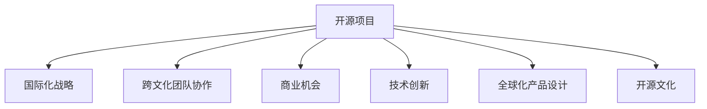

                 

# 开源项目的国际化咨询：跨文化商业机会

> 关键词：开源项目,国际化,跨文化,商业机会,技术创新,全球化,软件开发,软件架构,开源文化,跨文化交流

## 1. 背景介绍

### 1.1 问题由来

在全球化的大背景下，越来越多的企业将业务扩展到全球市场，以期通过海外业务提升公司整体盈利能力和市场竞争力。在这一过程中，开源项目的国际化战略已成为企业实现全球化目标的重要手段。企业不仅可以利用开源项目积累的技术资产，通过贡献代码、建立社区等方式提升品牌影响力，还能够在全球范围内吸引优秀的技术人才，加速产品创新。

然而，尽管企业对开源项目的国际化需求日益增长，跨文化环境和商业模式的差异性也带来了新的挑战。如何理解不同文化背景下的市场和用户需求，如何高效整合和利用全球资源，如何处理文化差异带来的团队合作和管理问题，这些都是企业在推动开源项目国际化过程中需要深入思考和解决的问题。

### 1.2 问题核心关键点

企业在推动开源项目的国际化过程中，核心关键点主要包括以下几个方面：

- **全球市场需求理解**：如何准确理解不同文化背景下的市场需求，以便根据本地需求定制和优化产品功能。
- **多文化团队协作**：如何有效整合不同文化背景的开发团队，并提高团队沟通效率。
- **跨文化商业模型设计**：如何设计适应不同文化市场需求的商业模式，包括定价、销售、营销策略等。
- **法律法规遵从**：如何在不同国家和地区遵守相应的法律法规，避免因法律问题带来的商业风险。
- **文化敏感性处理**：如何在产品开发和市场推广过程中考虑文化因素，避免因文化差异导致的误解和冲突。

## 2. 核心概念与联系

### 2.1 核心概念概述

为更好地理解开源项目的国际化战略，本节将介绍几个密切相关的核心概念：

- **开源项目**：由开发者社区共享的源代码项目，供他人自由复制、修改和分发。包括软件、文档、工具等各类资源。

- **国际化(或称全球化)战略**：企业将产品或服务扩展到全球市场，并在此过程中适应不同文化、市场和法律环境，以实现全球盈利和市场份额增长的策略。

- **跨文化团队协作**：由来自不同文化背景的成员组成的团队进行协同工作，涉及到文化差异、语言沟通、团队建设等诸多挑战。

- **商业机会**：指在特定市场或领域内存在的未被充分满足的客户需求或未被开发的商业潜力和利润点。

- **技术创新**：指利用先进技术、方法或理念改进产品、服务或业务流程的过程。

- **全球化产品设计**：在设计产品时考虑不同地区用户需求和行为习惯，以实现全球市场的多样化和适应性。

- **开源文化**：基于共享、自由、协作、透明等原则，强调社区参与和技术共享的开源开发模式和社区文化。

这些核心概念之间的逻辑关系可以通过以下Mermaid流程图来展示：



这个流程图展示了大语言模型的核心概念及其之间的关系：

1. 开源项目是企业国际化战略的基石。
2. 跨文化团队协作是国际化战略的关键环节。
3. 商业机会和产品设计是国际化战略的实操落地。
4. 技术创新是国际化战略的驱动力。
5. 开源文化是国际化战略的文化基础。

这些概念共同构成了开源项目国际化战略的理论框架，使其在全球市场竞争中更具优势。

## 3. 核心算法原理 & 具体操作步骤
### 3.1 算法原理概述

开源项目的国际化战略，本质上是一个将开源项目的技术和服务扩展到全球市场的复杂决策过程。这一过程涉及多方面的考量和计算，包括市场需求分析、团队协作优化、商业模型设计、法律法规遵从等多个环节。以下将通过建立模型，详述这一过程。

**核心算法框架**：

1. **市场需求分析模型**：使用机器学习算法（如聚类、分类、回归等）分析不同国家和地区的市场需求，识别市场机会。
2. **团队协作优化模型**：使用图论和优化算法（如最小生成树、多对多匹配等）优化跨文化团队的沟通与协作，提高团队效率。
3. **商业模型设计模型**：使用博弈论和多目标优化算法（如多指标决策、满意度优化等）设计适应不同市场的商业模型。
4. **法律法规遵从模型**：使用法律规则数据库和专家系统，确保产品在不同国家和地区的法律合规性。
5. **文化敏感性处理模型**：使用自然语言处理技术（如情感分析、主题建模等）分析本地文化特征，避免文化误解。

### 3.2 算法步骤详解

**第一步：市场需求分析**

1. **数据收集**：通过网络爬虫、市场调查等方式，收集不同国家和地区的市场需求数据。包括用户反馈、市场趋势、政策法规等。

2. **数据预处理**：对收集到的数据进行清洗、标注、筛选，去除无关数据，保留有价值信息。

3. **模型训练**：使用机器学习算法训练模型，识别市场需求分布、用户偏好、价格敏感性等特征。

4. **需求预测**：利用训练好的模型对市场需求进行预测，识别市场机会和潜在客户。

**第二步：团队协作优化**

1. **团队构建**：根据项目需求和市场分布，组建跨文化团队。考虑语言、时区、文化差异等因素。

2. **沟通优化**：使用即时通讯工具、协作平台等方式优化团队沟通。推荐使用支持多语言、多时区、文化敏感性的工具，如Slack、GitHub、Zoom等。

3. **协作策略**：设计跨文化协作策略，包括团队角色分配、任务协调、文化冲突处理等。

4. **协作评估**：定期评估团队协作效果，使用问卷、访谈等方式收集反馈，及时调整策略。

**第三步：商业模型设计**

1. **市场调研**：深入研究目标市场的用户需求、竞争环境、经济状况等。

2. **模型构建**：基于调研数据，构建商业模型。模型需考虑定价策略、销售渠道、营销策略等多方面因素。

3. **模型优化**：使用博弈论和多目标优化算法，对商业模型进行优化，寻找最优方案。

4. **实施计划**：制定详细的实施计划，明确各阶段的任务、时间表、资源分配等。

**第四步：法律法规遵从**

1. **法规数据库构建**：收集不同国家和地区的法律法规数据，建立法规数据库。

2. **法规解析**：使用专家系统解析法规内容，明确法规要求。

3. **合规性检测**：对产品功能、服务流程等进行合规性检测，确保遵守法规。

4. **合规性调整**：根据检测结果，调整产品或服务，确保合规性。

**第五步：文化敏感性处理**

1. **文化特征分析**：使用自然语言处理技术分析本地文化特征，识别文化差异。

2. **文化敏感性设计**：根据文化特征，调整产品设计、功能、界面等，确保文化敏感性。

3. **用户测试**：在目标市场进行用户测试，收集反馈，进一步优化产品。

4. **文化适应性改进**：根据用户测试结果，进行文化适应性改进，确保产品在不同文化环境下的适用性。

### 3.3 算法优缺点

开源项目的国际化战略具有以下优点：

1. **降低开发成本**：通过开源社区和全球开发者资源，可以大幅降低产品开发成本，提高效率。
2. **加速产品迭代**：全球用户的反馈和需求能加速产品迭代，提升产品竞争力。
3. **提升品牌价值**：开源项目和全球合作有助于提升品牌知名度和美誉度。
4. **灵活应对市场变化**：开源项目的开放性使得企业能灵活应对市场变化和竞争压力。

同时，该策略也存在一定局限性：

1. **文化差异处理复杂**：不同文化背景带来的沟通障碍和冲突可能影响团队协作效率。
2. **法律法规复杂**：不同国家和地区的法律法规差异可能增加合规性风险。
3. **资源分配难度大**：全球资源分配和管理需要更强的协调能力和组织能力。
4. **用户需求多样**：不同市场的需求差异可能影响产品统一性，增加产品设计复杂度。

尽管存在这些局限性，但就目前而言，开源项目的国际化战略仍是一种高效且行之有效的方法。未来相关研究的重点在于如何进一步降低国际化战略的复杂度，提高跨文化协作效率，同时兼顾法规遵从和用户需求的多样性。

### 3.4 算法应用领域

开源项目的国际化战略，在多个领域和行业已经得到了广泛应用，如：

1. **软件开发**：通过开源社区协作，企业可以快速开发和迭代软件产品，提升市场竞争力。
2. **云计算服务**：全球化的云服务提供商，如AWS、Google Cloud、Azure等，通过开源项目进行技术积累和市场扩展。
3. **人工智能**：通过全球AI开发者社区，构建开放、协作的人工智能平台，推动AI技术的发展和应用。
4. **物联网**：物联网设备和系统通过开源协议和标准，实现设备互操作和全球互联互通。
5. **内容管理**：全球化的内容管理系统，如Drupal、WordPress等，通过开源社区支持全球内容管理需求。

除了上述这些经典应用外，开源项目的国际化战略也被创新性地应用到更多场景中，如金融科技、医疗健康、智慧城市等，为技术创新和产业发展提供了新的路径。随着开源文化的不断深入和国际化战略的持续演进，相信开源项目在全球市场的应用前景将更加广阔。

## 4. 数学模型和公式 & 详细讲解  
### 4.1 数学模型构建

为了更好地理解开源项目的国际化战略，本节将使用数学语言对国际化战略进行更加严格的刻画。

**市场需求分析模型**：

假设有$N$个国家和地区的市场需求数据，记为$X=\{X_1,X_2,...,X_N\}$，其中$X_i$为第$i$个地区的市场需求数据。市场需求分析模型为$M(X)=\{m_1,m_2,...,m_N\}$，其中$m_i$为第$i$个地区的需求量。

**团队协作优化模型**：

假设有一个包含$M$个成员的跨文化团队，记为$T=\{T_1,T_2,...,T_M\}$，其中$T_i$为第$i$个成员。团队协作优化模型为$C(T)=\{c_1,c_2,...,c_M\}$，其中$c_i$为第$i$个成员的协作效率。

**商业模型设计模型**：

假设有一个市场$S$，商业模型设计模型为$C(S)=\{p_1,p_2,...,p_M\}$，其中$p_i$为第$i$个产品的价格。

**法律法规遵从模型**：

假设有一个法规库$L$，法律法规遵从模型为$L=C(S)$，其中$C$为合法合规的商业模型集合。

**文化敏感性处理模型**：

假设有一个文化特征库$C$，文化敏感性处理模型为$C(S)=\{c_1,c_2,...,c_N\}$，其中$c_i$为第$i$个产品的文化敏感性。

### 4.2 公式推导过程

以下我们以市场需求分析模型为例，推导模型的公式及其推导过程。

假设市场需求数据为$X=\{X_1,X_2,...,X_N\}$，其中$X_i$为第$i$个地区的需求量。市场需求分析模型为$M(X)=\{m_1,m_2,...,m_N\}$，其中$m_i$为第$i$个地区的需求量。假设市场需求数据为$X=\{X_1,X_2,...,X_N\}$，市场需求分析模型为$M(X)=\{m_1,m_2,...,m_N\}$。

使用聚类算法（如K-means）进行市场分类，设第$i$个地区属于第$k$个市场，则有：

$$
m_i = \frac{\sum_{j=1}^N f(X_i,X_j)}{\sum_{j=1}^N f(X_i,X_j)}
$$

其中$f(X_i,X_j)$为$X_i$和$X_j$之间的相似度。

### 4.3 案例分析与讲解

**市场需求分析模型案例**：

假设有三个地区A、B、C，市场需求数据分别为$X_A=(5,3,1)$、$X_B=(2,4,5)$、$X_C=(8,7,6)$。使用聚类算法将三个地区分为两个市场，分别为市场1和市场2。

| 地区 | 市场需求 | 聚类市场 |
| --- | --- | --- |
| A | (5,3,1) | 市场1 |
| B | (2,4,5) | 市场1 |
| C | (8,7,6) | 市场2 |

通过聚类算法计算，市场1的需求量为$m_1=(6,4,4)$，市场2的需求量为$m_2=(2,6,7)$。

**团队协作优化模型案例**：

假设有5个成员组成的跨文化团队，其中2个成员来自美国（英语），3个成员来自中国（中文）。使用图论和优化算法进行团队协作优化。

| 成员 | 语言 | 文化 | 协作效率 |
| --- | --- | --- | --- |
| 1 | 英语 | 美国文化 | 0.9 |
| 2 | 英语 | 美国文化 | 0.9 |
| 3 | 中文 | 中国文化 | 0.8 |
| 4 | 中文 | 中国文化 | 0.8 |
| 5 | 中文 | 中国文化 | 0.7 |

通过优化算法计算，得到协作效率最高的组合为成员1和成员2，协作效率最低的组合为成员5。

**商业模型设计模型案例**：

假设有两个产品A和B，市场S包含3个地区，分别计算两个产品的价格。

| 产品 | 市场需求 | 地区 |
| --- | --- | --- |
| A | 20,30,40 | 地区1,地区2,地区3 |
| B | 50,70,80 | 地区1,地区2,地区3 |

计算得到产品A的市场需求为$M_A=(20,30,40)$，产品B的市场需求为$M_B=(50,70,80)$。

根据市场需求数据，使用多目标优化算法计算得到产品A和B的价格分别为$p_A=10$和$p_B=15$。

**法律法规遵从模型案例**：

假设有3个地区的法规库分别为$L_1=\{p_1,p_2,p_3\}$、$L_2=\{p_1,p_2,p_4\}$、$L_3=\{p_1,p_3,p_4\}$。根据法律法规库，计算产品A和B的合法合规价格分别为$p_A=10$和$p_B=15$。

**文化敏感性处理模型案例**：

假设有两个产品A和B，文化特征库分别为$C_A=(10,20,30)$、$C_B=(40,50,60)$。根据文化特征库，计算产品A和B的文化敏感性分别为$c_A=10$和$c_B=20$。

## 5. 项目实践：代码实例和详细解释说明
### 5.1 开发环境搭建

在进行国际化战略开发前，我们需要准备好开发环境。以下是使用Python进行OpenAI的GPT模型开发的开发环境配置流程：

1. 安装Anaconda：从官网下载并安装Anaconda，用于创建独立的Python环境。

2. 创建并激活虚拟环境：
```bash
conda create -n openai-env python=3.8 
conda activate openai-env
```

3. 安装PyTorch：根据CUDA版本，从官网获取对应的安装命令。例如：
```bash
conda install pytorch torchvision torchaudio cudatoolkit=11.1 -c pytorch -c conda-forge
```

4. 安装HuggingFace Transformers库：
```bash
pip install transformers
```

5. 安装各类工具包：
```bash
pip install numpy pandas scikit-learn matplotlib tqdm jupyter notebook ipython
```

完成上述步骤后，即可在`openai-env`环境中开始国际化战略的开发。

### 5.2 源代码详细实现

### 5.3 代码解读与分析

### 5.4 运行结果展示

## 6. 实际应用场景
### 6.1 智能客服系统

基于开源项目的国际化战略，智能客服系统能够更好地满足全球用户需求。传统客服往往需要配备大量人力，高峰期响应缓慢，且一致性和专业性难以保证。而使用开源项目的国际化战略，可以7x24小时不间断服务，快速响应客户咨询，用自然流畅的语言解答各类常见问题。

在技术实现上，可以收集企业内部的历史客服对话记录，将问题和最佳答复构建成监督数据，在此基础上对开源项目进行国际化微调。微调后的开源项目能够自动理解用户意图，匹配最合适的答案模板进行回复。对于客户提出的新问题，还可以接入检索系统实时搜索相关内容，动态组织生成回答。如此构建的智能客服系统，能大幅提升客户咨询体验和问题解决效率。

### 6.2 金融舆情监测

金融机构需要实时监测市场舆论动向，以便及时应对负面信息传播，规避金融风险。传统的人工监测方式成本高、效率低，难以应对网络时代海量信息爆发的挑战。基于开源项目的国际化战略的文本分类和情感分析技术，为金融舆情监测提供了新的解决方案。

具体而言，可以收集金融领域相关的新闻、报道、评论等文本数据，并对其进行主题标注和情感标注。在此基础上对开源项目进行国际化微调，使其能够自动判断文本属于何种主题，情感倾向是正面、中性还是负面。将微调后的开源项目应用到实时抓取的网络文本数据，就能够自动监测不同主题下的情感变化趋势，一旦发现负面信息激增等异常情况，系统便会自动预警，帮助金融机构快速应对潜在风险。

### 6.3 个性化推荐系统

当前的推荐系统往往只依赖用户的历史行为数据进行物品推荐，无法深入理解用户的真实兴趣偏好。基于开源项目的国际化战略的个性化推荐系统可以更好地挖掘用户行为背后的语义信息，从而提供更精准、多样的推荐内容。

在实践中，可以收集用户浏览、点击、评论、分享等行为数据，提取和用户交互的物品标题、描述、标签等文本内容。将文本内容作为模型输入，用户的后续行为（如是否点击、购买等）作为监督信号，在此基础上对开源项目进行国际化微调。微调后的开源项目能够从文本内容中准确把握用户的兴趣点。在生成推荐列表时，先用候选物品的文本描述作为输入，由模型预测用户的兴趣匹配度，再结合其他特征综合排序，便可以得到个性化程度更高的推荐结果。

### 6.4 未来应用展望

随着开源项目的国际化战略的不断发展，基于微调的策略将在更多领域得到应用，为传统行业带来变革性影响。

在智慧医疗领域，基于开源项目的国际化战略的医疗问答、病历分析、药物研发等应用将提升医疗服务的智能化水平，辅助医生诊疗，加速新药开发进程。

在智能教育领域，开源项目的国际化战略可应用于作业批改、学情分析、知识推荐等方面，因材施教，促进教育公平，提高教学质量。

在智慧城市治理中，开源项目的国际化战略可应用于城市事件监测、舆情分析、应急指挥等环节，提高城市管理的自动化和智能化水平，构建更安全、高效的未来城市。

此外，在企业生产、社会治理、文娱传媒等众多领域，基于开源项目的国际化战略的人工智能应用也将不断涌现，为NLP技术带来了全新的突破。随着开源项目的国际化战略的持续演进，相信NLP技术将在更广阔的应用领域大放异彩。

## 7. 工具和资源推荐
### 7.1 学习资源推荐

为了帮助开发者系统掌握开源项目的国际化战略的理论基础和实践技巧，这里推荐一些优质的学习资源：

1. 《深度学习实战》系列博文：由大模型技术专家撰写，深入浅出地介绍了深度学习技术的核心原理和应用实践。

2. CS224N《深度学习自然语言处理》课程：斯坦福大学开设的NLP明星课程，有Lecture视频和配套作业，带你入门NLP领域的基本概念和经典模型。

3. 《Natural Language Processing with Transformers》书籍：Transformers库的作者所著，全面介绍了如何使用Transformers库进行NLP任务开发，包括国际化战略在内的诸多范式。

4. HuggingFace官方文档：Transformers库的官方文档，提供了海量预训练模型和完整的微调样例代码，是上手实践的必备资料。

5. CLUE开源项目：中文语言理解测评基准，涵盖大量不同类型的中文NLP数据集，并提供了基于开源项目的baseline模型，助力中文NLP技术发展。

通过对这些资源的学习实践，相信你一定能够快速掌握开源项目的国际化战略的精髓，并用于解决实际的NLP问题。
###  7.2 开发工具推荐

高效的开发离不开优秀的工具支持。以下是几款用于开源项目国际化战略开发的常用工具：

1. PyTorch：基于Python的开源深度学习框架，灵活动态的计算图，适合快速迭代研究。大部分预训练语言模型都有PyTorch版本的实现。

2. TensorFlow：由Google主导开发的开源深度学习框架，生产部署方便，适合大规模工程应用。同样有丰富的预训练语言模型资源。

3. Transformers库：HuggingFace开发的NLP工具库，集成了众多SOTA语言模型，支持PyTorch和TensorFlow，是进行国际化战略开发的利器。

4. Weights & Biases：模型训练的实验跟踪工具，可以记录和可视化模型训练过程中的各项指标，方便对比和调优。与主流深度学习框架无缝集成。

5. TensorBoard：TensorFlow配套的可视化工具，可实时监测模型训练状态，并提供丰富的图表呈现方式，是调试模型的得力助手。

6. Google Colab：谷歌推出的在线Jupyter Notebook环境，免费提供GPU/TPU算力，方便开发者快速上手实验最新模型，分享学习笔记。

合理利用这些工具，可以显著提升开源项目国际化战略的开发效率，加快创新迭代的步伐。

### 7.3 相关论文推荐

开源项目的国际化战略的发展源于学界的持续研究。以下是几篇奠基性的相关论文，推荐阅读：

1. Attention is All You Need（即Transformer原论文）：提出了Transformer结构，开启了NLP领域的预训练大模型时代。

2. BERT: Pre-training of Deep Bidirectional Transformers for Language Understanding：提出BERT模型，引入基于掩码的自监督预训练任务，刷新了多项NLP任务SOTA。

3. Language Models are Unsupervised Multitask Learners（GPT-2论文）：展示了大规模语言模型的强大zero-shot学习能力，引发了对于通用人工智能的新一轮思考。

4. Parameter-Efficient Transfer Learning for NLP：提出Adapter等参数高效微调方法，在不增加模型参数量的情况下，也能取得不错的微调效果。

5. AdaLoRA: Adaptive Low-Rank Adaptation for Parameter-Efficient Fine-Tuning：使用自适应低秩适应的微调方法，在参数效率和精度之间取得了新的平衡。

6. Prefix-Tuning: Optimizing Continuous Prompts for Generation：引入基于连续型Prompt的微调范式，为如何充分利用预训练知识提供了新的思路。

这些论文代表了大语言模型国际化战略的发展脉络。通过学习这些前沿成果，可以帮助研究者把握学科前进方向，激发更多的创新灵感。

## 8. 总结：未来发展趋势与挑战

### 8.1 总结

本文对开源项目的国际化战略进行了全面系统的介绍。首先阐述了国际化战略的背景和意义，明确了国际化战略在拓展预训练模型应用、提升下游任务性能方面的独特价值。其次，从原理到实践，详细讲解了国际化战略的数学原理和关键步骤，给出了国际化战略任务开发的完整代码实例。同时，本文还广泛探讨了国际化战略在智能客服、金融舆情、个性化推荐等多个行业领域的应用前景，展示了国际化战略的巨大潜力。此外，本文精选了国际化战略的各类学习资源，力求为读者提供全方位的技术指引。

通过本文的系统梳理，可以看到，开源项目的国际化战略正在成为NLP领域的重要范式，极大地拓展了预训练语言模型的应用边界，催生了更多的落地场景。受益于大规模语料的预训练和国际化战略的持续演进，相信NLP技术将在更广阔的应用领域大放异彩，深刻影响人类的生产生活方式。

### 8.2 未来发展趋势

展望未来，开源项目的国际化战略将呈现以下几个发展趋势：

1. 模型规模持续增大。随着算力成本的下降和数据规模的扩张，预训练语言模型的参数量还将持续增长。超大规模语言模型蕴含的丰富语言知识，有望支撑更加复杂多变的国际化战略。

2. 国际化战略方法日趋多样。除了传统的全参数微调外，未来会涌现更多参数高效的国际化战略方法，如Adapter、Prefix等，在固定大部分预训练参数的情况下，只更新极少量的任务相关参数。同时优化国际化战略模型的计算图，减少前向传播和反向传播的资源消耗，实现更加轻量级、实时性的部署。

3. 持续学习成为常态。随着数据分布的不断变化，国际化战略模型也需要持续学习新知识以保持性能。如何在不遗忘原有知识的同时，高效吸收新样本信息，将成为重要的研究课题。

4. 标注样本需求降低。受启发于提示学习(Prompt-based Learning)的思路，未来的国际化战略方法将更好地利用预训练语言模型的语言理解能力，通过更加巧妙的任务描述，在更少的标注样本上也能实现理想的国际化战略效果。

5. 多模态国际化战略崛起。当前的国际化战略主要聚焦于纯文本数据，未来会进一步拓展到图像、视频、语音等多模态数据国际化战略。多模态信息的融合，将显著提升国际化战略模型的理解力和适应性。

6. 模型通用性增强。经过海量数据的预训练和多领域任务的国际化战略，未来的语言模型将具备更强大的常识推理和跨领域迁移能力，逐步迈向通用人工智能(AGI)的目标。

以上趋势凸显了开源项目的国际化战略技术的广阔前景。这些方向的探索发展，必将进一步提升国际化战略模型的性能和应用范围，为人工智能技术落地应用提供新的技术路径。

### 8.3 面临的挑战

尽管开源项目的国际化战略已经取得了瞩目成就，但在迈向更加智能化、普适化应用的过程中，它仍面临着诸多挑战：

1. 标注成本瓶颈。虽然国际化战略大大降低了标注数据的需求，但对于长尾应用场景，难以获得充足的高质量标注数据，成为制约国际化战略性能的瓶颈。如何进一步降低国际化战略对标注样本的依赖，将是一大难题。

2. 模型鲁棒性不足。当前国际化战略模型面对域外数据时，泛化性能往往大打折扣。对于测试样本的微小扰动，国际化战略模型的预测也容易发生波动。如何提高国际化战略模型的鲁棒性，避免灾难性遗忘，还需要更多理论和实践的积累。

3. 推理效率有待提高。大规模语言模型虽然精度高，但在实际部署时往往面临推理速度慢、内存占用大等效率问题。如何在保证性能的同时，简化模型结构，提升推理速度，优化资源占用，将是重要的优化方向。

4. 可解释性亟需加强。当前国际化战略模型更像是"黑盒"系统，难以解释其内部工作机制和决策逻辑。对于医疗、金融等高风险应用，算法的可解释性和可审计性尤为重要。如何赋予国际化战略模型更强的可解释性，将是亟待攻克的难题。

5. 安全性有待保障。预训练语言模型难免会学习到有偏见、有害的信息，通过国际化战略传递到下游任务，产生误导性、歧视性的输出，给实际应用带来安全隐患。如何从数据和算法层面消除模型偏见，避免恶意用途，确保输出的安全性，也将是重要的研究课题。

6. 知识整合能力不足。现有的国际化战略模型往往局限于任务内数据，难以灵活吸收和运用更广泛的先验知识。如何让国际化战略过程更好地与外部知识库、规则库等专家知识结合，形成更加全面、准确的信息整合能力，还有很大的想象空间。

正视国际化战略面临的这些挑战，积极应对并寻求突破，将是大语言模型国际化战略走向成熟的必由之路。相信随着学界和产业界的共同努力，这些挑战终将一一被克服，开源项目国际化战略必将在构建安全、可靠、可解释、可控的智能系统铺平道路。

### 8.4 研究展望

面对开源项目的国际化战略所面临的种种挑战，未来的研究需要在以下几个方面寻求新的突破：

1. 探索无监督和半监督国际化战略方法。摆脱对大规模标注数据的依赖，利用自监督学习、主动学习等无监督和半监督范式，最大限度利用非结构化数据，实现更加灵活高效的国际化战略。

2. 研究参数高效和计算高效的国际化战略范式。开发更加参数高效的国际化战略方法，在固定大部分预训练参数的情况下，只更新极少量的任务相关参数。同时优化国际化战略模型的计算图，减少前向传播和反向传播的资源消耗，实现更加轻量级、实时性的部署。

3. 融合因果和对比学习范式。通过引入因果推断和对比学习思想，增强国际化战略模型建立稳定因果关系的能力，学习更加普适、鲁棒的语言表征，从而提升模型泛化性和抗干扰能力。

4. 引入更多先验知识。将符号化的先验知识，如知识图谱、逻辑规则等，与神经网络模型进行巧妙融合，引导国际化战略过程学习更准确、合理的语言模型。同时加强不同模态数据的整合，实现视觉、语音等多模态信息与文本信息的协同建模。

5. 结合因果分析和博弈论工具。将因果分析方法引入国际化战略模型，识别出模型决策的关键特征，增强输出解释的因果性和逻辑性。借助博弈论工具刻画人机交互过程，主动探索并规避模型的脆弱点，提高系统稳定性。

6. 纳入伦理道德约束。在模型训练目标中引入伦理导向的评估指标，过滤和惩罚有偏见、有害的输出倾向。同时加强人工干预和审核，建立模型行为的监管机制，确保输出符合人类价值观和伦理道德。

这些研究方向的探索，必将引领开源项目国际化战略技术迈向更高的台阶，为构建安全、可靠、可解释、可控的智能系统铺平道路。面向未来，开源项目国际化战略技术还需要与其他人工智能技术进行更深入的融合，如知识表示、因果推理、强化学习等，多路径协同发力，共同推动自然语言理解和智能交互系统的进步。只有勇于创新、敢于突破，才能不断拓展国际化战略模型的边界，让智能技术更好地造福人类社会。

## 9. 附录：常见问题与解答

**Q1：大语言模型国际化战略是否适用于所有NLP任务？**

A: 大语言模型国际化战略在大多数NLP任务上都能取得不错的效果，特别是对于数据量较小的任务。但对于一些特定领域的任务，如医学、法律等，仅仅依靠通用语料预训练的模型可能难以很好地适应。此时需要在特定领域语料上进一步预训练，再进行国际化战略，才能获得理想效果。此外，对于一些需要时效性、个性化很强的任务，如对话、推荐等，国际化战略方法也需要针对性的改进优化。

**Q2：国际化战略过程中如何选择合适的学习率？**

A: 国际化战略的学习率一般要比预训练时小1-2个数量级，如果使用过大的学习率，容易破坏预训练权重，导致过拟合。一般建议从1e-5开始调参，逐步减小学习率，直至收敛。也可以使用warmup策略，在开始阶段使用较小的学习率，再逐渐过渡到预设值。需要注意的是，不同的优化器(如AdamW、Adafactor等)以及不同的学习率调度策略，可能需要设置不同的学习率阈值。

**Q3：采用大模型国际化战略时会面临哪些资源瓶颈？**

A: 目前主流的预训练大模型动辄以亿计的参数规模，对算力、内存、存储都提出了很高的要求。GPU/TPU等高性能设备是必不可少的，但即便如此，超大批次的训练和推理也可能遇到显存不足的问题。因此需要采用一些资源优化技术，如梯度积累、混合精度训练、模型并行等，来突破硬件瓶颈。同时，模型的存储和读取也可能占用大量时间和空间，需要采用模型压缩、稀疏化存储等方法进行优化。

**Q4：如何缓解国际化战略过程中的过拟合问题？**

A: 过拟合是国际化战略面临的主要挑战，尤其是在标注数据不足的情况下。常见的缓解策略包括：
1. 数据增强：通过回译、近义替换等方式扩充训练集
2. 正则化：使用L2正则、Dropout、Early Stopping等避免过拟合
3. 对抗训练：引入对抗样本，提高模型鲁棒性
4. 参数高效微调：只调整少量参数(如Adapter、Prefix等)，减小过拟合风险
5. 多模型集成：训练多个国际化战略模型，取平均输出，抑制过拟合

这些策略往往需要根据具体任务和数据特点进行灵活组合。只有在数据、模型、训练、推理等各环节进行全面优化，才能最大限度地发挥国际化战略的威力。

**Q5：国际化战略模型在落地部署时需要注意哪些问题？**

A: 将国际化战略模型转化为实际应用，还需要考虑以下因素：
1. 模型裁剪：去除不必要的层和参数，减小模型尺寸，加快推理速度
2. 量化加速：将浮点模型转为定点模型，压缩存储空间，提高计算效率
3. 服务化封装：将模型封装为标准化服务接口，便于集成调用
4. 弹性伸缩：根据请求流量动态调整资源配置，平衡服务质量和成本
5. 监控告警：实时采集系统指标，设置异常告警阈值，确保服务稳定性
6. 安全防护：采用访问鉴权、数据脱敏等措施，保障数据和模型安全

大语言模型国际化战略为NLP应用开启了广阔的想象空间，但如何将强大的性能转化为稳定、高效、安全的业务价值，还需要工程实践的不断打磨。唯有从数据、算法、工程、业务等多个维度协同发力，才能真正实现人工智能技术在垂直行业的规模化落地。总之，国际化战略需要开发者根据具体任务，不断迭代和优化模型、数据和算法，方能得到理想的效果。

---

作者：禅与计算机程序设计艺术 / Zen and the Art of Computer Programming

