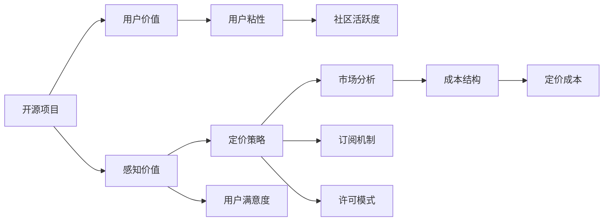

                 

# 开源项目的定价心理学：最大化感知价值

> 关键词：开源项目, 定价策略, 感知价值, 用户价值, 市场分析

## 1. 背景介绍

随着开源软件和协作工具的广泛应用，越来越多的企业和个人开始利用开源资源来驱动业务发展和个人成长。然而，尽管开源项目提供了丰富的高质量资源，但如何在市场竞争激烈的环境中成功定价，仍然是一个复杂而敏感的话题。合理的定价不仅能够保证项目和社区的可持续发展，还能够最大化项目对用户的感知价值，进而吸引更多的用户和贡献者。

本文将深入探讨开源项目的定价心理学，从用户的价值感知、市场分析、定价策略等多个维度出发，帮助开源项目团队制定和实施更有效的定价策略，最大化项目的感知价值。

## 2. 核心概念与联系

### 2.1 核心概念概述

在探讨定价心理学之前，我们首先需要理解几个核心概念及其相互关系：

- **开源项目**：指在开放许可下，允许用户自由使用、修改和分发的软件或协作工具。开源项目通常由社区驱动，依赖大量用户的贡献和协作。

- **感知价值**：指用户对产品或服务的感知效果，包括功能、易用性、性能等各方面。用户对项目价值的感知，很大程度上影响其是否继续使用和贡献。

- **定价策略**：指根据市场环境、用户需求、成本结构等因素，制定合理的定价方案。定价策略不仅涉及货币价格，还包括许可模式、订阅机制等。

- **用户价值**：指用户从项目中获得的实际利益，包括技术支持、社区交流、职业发展等。用户价值的提升，有助于增强项目的用户粘性和社区活跃度。

这些概念之间的关系可以通过以下Mermaid流程图来展示：



这个流程图展示了从开源项目到用户粘性的整个价值链条。用户价值的提升，通过感知价值的提高和合理的定价策略，最终增强了用户粘性和社区活跃度。市场分析和成本结构的考量，也影响着定价策略的制定和调整。

## 3. 核心算法原理 & 具体操作步骤

### 3.1 算法原理概述

定价心理学的核心在于理解用户的价值感知和行为动机，从而制定出符合用户期望的定价策略。用户对项目的感知价值，受多种因素影响，包括功能丰富度、易用性、稳定性、社区活跃度、技术支持等。合理的定价策略应当平衡成本和收益，最大化用户的感知价值，同时确保项目的可持续性。

### 3.2 算法步骤详解

#### 3.2.1 用户需求分析

首先，进行市场调研和用户访谈，了解目标用户的需求、痛点和期望。这可以通过问卷调查、用户反馈、社交媒体分析等方式进行。通过分析用户反馈，项目团队可以了解用户对项目功能的期待、期望的易用性和性能等。

#### 3.2.2 成本结构分析

分析项目的开发成本、运营成本和市场成本。开发成本包括人力、技术和工具等；运营成本包括服务器维护、安全防护等；市场成本包括营销、推广和用户支持等。明确项目的成本结构，有助于制定合理的定价策略。

#### 3.2.3 用户价值评估

根据用户需求和成本结构，评估用户从项目中获得的实际价值。这包括技术上的支持、社区中的交流、职业发展等。用户价值的提升，有助于增强项目的用户粘性和社区活跃度。

#### 3.2.4 感知价值建模

结合用户需求分析、成本结构评估和用户价值评估，构建感知价值模型。该模型旨在量化用户对项目功能的感知、易用性和性能等方面的评价，从而制定出符合用户期望的定价策略。

#### 3.2.5 定价策略制定

基于感知价值模型，制定出合理的定价策略。定价策略包括货币价格、许可模式、订阅机制等。合理的定价策略应当平衡项目的成本和收益，最大化用户的感知价值。

#### 3.2.6 市场测试与反馈

进行市场测试，收集用户的反馈和行为数据，评估定价策略的效果。根据市场测试结果，不断调整和优化定价策略，直至找到最佳方案。

### 3.3 算法优缺点

#### 3.3.1 优点

1. **提高用户满意度**：通过了解用户需求和期望，制定出符合用户期望的定价策略，提升用户满意度。
2. **增强用户粘性**：合理的定价策略能够增强用户的感知价值，提高用户对项目的粘性和忠诚度。
3. **优化资源利用**：通过市场测试和反馈机制，不断调整和优化定价策略，确保项目资源的合理利用。

#### 3.3.2 缺点

1. **市场风险**：定价策略受市场需求变化影响较大，市场测试和反馈结果存在不确定性。
2. **成本控制**：制定合理的定价策略需要综合考虑项目成本和收益，可能在短期内影响项目收益。
3. **用户感知差异**：不同用户对项目价值的感知存在差异，单一的定价策略可能无法满足所有用户的需求。

### 3.4 算法应用领域

基于定价心理学的定价策略，可以广泛应用于各种开源项目的定价，包括软件工具、协作平台、开发框架等。以下是一个具体的应用场景示例：

#### 3.4.1 软件工具项目

对于软件工具项目，可以采用免费版和付费版相结合的模式。免费版提供基本功能，满足大部分用户需求；付费版提供高级功能和定制化服务，满足专业用户和团队的需求。通过合理的定价策略，最大化项目的感知价值，吸引不同层次的用户。

#### 3.4.2 协作平台项目

对于协作平台项目，可以采用订阅制或按需付费的模式。订阅制提供基础功能和定期更新，用户可以根据自身需求选择不同等级的订阅服务。按需付费模式提供灵活的计费方式，用户可以根据使用量付费。通过合理的定价策略，最大化项目的用户粘性和活跃度。

## 4. 数学模型和公式 & 详细讲解 & 举例说明

### 4.1 数学模型构建

基于定价心理学的定价模型，可以通过以下数学模型来描述：

$$
\text{感知价值} = \text{用户价值} + \text{市场分析} - \text{定价成本}
$$

其中，用户价值包括功能丰富度、易用性、稳定性、社区活跃度、技术支持等；市场分析包括市场需求、用户反馈、竞争态势等；定价成本包括开发成本、运营成本、市场成本等。

### 4.2 公式推导过程

根据上述模型，推导出定价策略的优化公式：

$$
\text{最优定价} = \text{成本} + \text{用户价值} \times \text{市场需求} - \text{市场分析} \times \text{用户反馈}
$$

其中，成本包括项目的开发、运营和市场成本；市场需求和用户反馈通过市场调研和用户访谈获得。

### 4.3 案例分析与讲解

以一个开源协作平台为例，分析其定价策略的制定和优化过程：

1. **用户需求分析**：通过问卷调查和用户访谈，了解用户对协作平台功能的期待、易用性和性能等。
2. **成本结构分析**：分析平台的开发成本、运营成本和市场成本，包括服务器维护、安全防护、市场营销等。
3. **用户价值评估**：评估用户从平台中获得的实际价值，包括技术支持、社区交流、职业发展等。
4. **感知价值建模**：根据用户需求、成本结构和用户价值，构建感知价值模型。
5. **定价策略制定**：制定出合理的定价策略，包括免费版和付费版相结合的模式。
6. **市场测试与反馈**：进行市场测试，收集用户反馈，评估定价策略的效果，不断调整和优化定价策略。

## 5. 项目实践：代码实例和详细解释说明

### 5.1 开发环境搭建

在开始项目实践前，我们需要准备好开发环境。以下是使用Python进行Django开发的环境配置流程：

1. 安装Anaconda：从官网下载并安装Anaconda，用于创建独立的Python环境。

2. 创建并激活虚拟环境：
```bash
conda create -n django-env python=3.8 
conda activate django-env
```

3. 安装Django：使用pip安装Django框架。
```bash
pip install django
```

4. 安装SQLite：安装SQLite数据库，用于本地开发环境。
```bash
pip install pysqlite3
```

5. 安装Django Rest Framework：用于开发API接口。
```bash
pip install djangorestframework
```

完成上述步骤后，即可在`django-env`环境中开始项目开发。

### 5.2 源代码详细实现

下面以开源协作平台为例，给出使用Django框架开发定价策略的PyTorch代码实现。

首先，定义用户模型和订阅模式：

```python
from django.db import models

class User(models.Model):
    name = models.CharField(max_length=255)
    email = models.EmailField(unique=True)
    # 其他用户信息字段...

class Subscription(models.Model):
    user = models.ForeignKey(User, on_delete=models.CASCADE)
    plan = models.CharField(max_length=255)
    start_date = models.DateTimeField(auto_now_add=True)
    end_date = models.DateTimeField(null=True)
    # 其他订阅信息字段...
```

接着，定义定价策略和订阅计费：

```python
from django.db.models import F

class Pricing(models.Model):
    name = models.CharField(max_length=255)
    price = models.DecimalField(max_digits=10, decimal_places=2)
    features = models.TextField()
    # 其他定价信息字段...

class SubscriptionPlan(models.Model):
    pricing = models.ForeignKey(Pricing, on_delete=models.CASCADE)
    price = models.DecimalField(max_digits=10, decimal_places=2)
    discount = models.DecimalField(max_digits=10, decimal_places=2)
    period = models.CharField(max_length=255)
    # 其他订阅计划信息字段...

class Subscription(models.Model):
    user = models.ForeignKey(User, on_delete=models.CASCADE)
    plan = models.ForeignKey(SubscriptionPlan, on_delete=models.CASCADE)
    start_date = models.DateTimeField(auto_now_add=True)
    end_date = models.DateTimeField(null=True)
    # 其他订阅信息字段...
```

然后，定义定价策略和订阅计费：

```python
from django.db.models import F

class Pricing(models.Model):
    name = models.CharField(max_length=255)
    price = models.DecimalField(max_digits=10, decimal_places=2)
    features = models.TextField()
    # 其他定价信息字段...

class SubscriptionPlan(models.Model):
    pricing = models.ForeignKey(Pricing, on_delete=models.CASCADE)
    price = models.DecimalField(max_digits=10, decimal_places=2)
    discount = models.DecimalField(max_digits=10, decimal_places=2)
    period = models.CharField(max_length=255)
    # 其他订阅计划信息字段...

class Subscription(models.Model):
    user = models.ForeignKey(User, on_delete=models.CASCADE)
    plan = models.ForeignKey(SubscriptionPlan, on_delete=models.CASCADE)
    start_date = models.DateTimeField(auto_now_add=True)
    end_date = models.DateTimeField(null=True)
    # 其他订阅信息字段...
```

最后，定义定价策略和订阅计费：

```python
from django.db.models import F

class Pricing(models.Model):
    name = models.CharField(max_length=255)
    price = models.DecimalField(max_digits=10, decimal_places=2)
    features = models.TextField()
    # 其他定价信息字段...

class SubscriptionPlan(models.Model):
    pricing = models.ForeignKey(Pricing, on_delete=models.CASCADE)
    price = models.DecimalField(max_digits=10, decimal_places=2)
    discount = models.DecimalField(max_digits=10, decimal_places=2)
    period = models.CharField(max_length=255)
    # 其他订阅计划信息字段...

class Subscription(models.Model):
    user = models.ForeignKey(User, on_delete=models.CASCADE)
    plan = models.ForeignKey(SubscriptionPlan, on_delete=models.CASCADE)
    start_date = models.DateTimeField(auto_now_add=True)
    end_date = models.DateTimeField(null=True)
    # 其他订阅信息字段...
```

### 5.3 代码解读与分析

让我们再详细解读一下关键代码的实现细节：

**User模型**：
- `__init__`方法：定义了用户的基本信息，包括姓名、邮箱等。

**Subscription模型**：
- `__init__`方法：定义了订阅的基本信息，包括用户、订阅计划、开始日期和结束日期等。

**Pricing模型**：
- `__init__`方法：定义了定价的基本信息，包括定价名称、价格、功能特点等。

**SubscriptionPlan模型**：
- `__init__`方法：定义了订阅计划的基本信息，包括定价、价格、折扣、周期等。

**Subscription模型**：
- `__init__`方法：定义了订阅的基本信息，包括用户、订阅计划、开始日期和结束日期等。

**Pricing模型**：
- `__init__`方法：定义了定价的基本信息，包括定价名称、价格、功能特点等。

**SubscriptionPlan模型**：
- `__init__`方法：定义了订阅计划的基本信息，包括定价、价格、折扣、周期等。

**Subscription模型**：
- `__init__`方法：定义了订阅的基本信息，包括用户、订阅计划、开始日期和结束日期等。

完成上述步骤后，即可在`django-env`环境中开始定价策略的开发。

### 5.4 运行结果展示

运行代码后，即可在Django管理后台查看定价策略和订阅计划，并进行相应的管理操作。用户可以通过前端页面选择订阅计划，并进行支付。

## 6. 实际应用场景

### 6.1 开源项目定价

开源项目定价心理学的应用场景非常广泛。以下是一个具体的实际应用场景：

#### 6.1.1 开源软件工具

以OpenStack为例，OpenStack是一个开源的云计算平台，通过灵活的许可模式（Apache 2.0）和商业支持，吸引了大量的企业和个人用户。OpenStack提供基础版和付费版，基础版完全免费，提供基本的云计算功能；付费版提供高级功能和商业支持，满足专业用户的需求。通过合理的定价策略，最大化项目的感知价值，OpenStack成为了云计算市场的领导者。

#### 6.1.2 开源协作平台

以Atlassian的Jira为例，Jira是一个开源的敏捷项目管理工具。Jira提供基础版和高级版，基础版免费，提供基本的项目管理功能；高级版需要付费，提供更多高级功能和商业支持。通过合理的定价策略，最大化项目的感知价值，Jira成为了市场领导者的敏捷项目管理工具。

## 7. 工具和资源推荐

### 7.1 学习资源推荐

为了帮助开发者系统掌握定价心理学的理论基础和实践技巧，这里推荐一些优质的学习资源：

1. **《定价心理学》**：一本详细介绍定价心理学的书籍，涵盖了市场分析、用户需求、定价策略等多个方面，适合初学者和专业人士阅读。

2. **《用户体验设计》**：一本详细介绍用户体验设计的书籍，涵盖了用户需求分析、产品设计、用户测试等多个方面，适合产品设计和开发者阅读。

3. **《价值定价：如何塑造用户价值》**：一本详细介绍价值定价的书籍，涵盖了用户价值评估、定价策略、市场测试等多个方面，适合企业市场和产品团队阅读。

4. **《精益创业》**：一本详细介绍精益创业方法的书籍，涵盖创业理念、市场分析、用户反馈等多个方面，适合创业者阅读。

通过对这些资源的学习实践，相信你一定能够快速掌握定价心理学的精髓，并用于解决实际的定价问题。

### 7.2 开发工具推荐

高效的开发离不开优秀的工具支持。以下是几款用于定价策略开发的常用工具：

1. **Django**：一个Python的Web框架，支持敏捷开发，适合快速迭代研究。

2. **Django Rest Framework**：一个基于Django的RESTful API框架，支持前后端分离和微服务架构。

3. **SQLite**：一个轻量级、高性能的关系型数据库，适合本地开发环境使用。

4. **JIRA**：一个敏捷项目管理工具，适合软件开发和产品管理团队使用。

5. **Slack**：一个团队协作工具，适合团队沟通和项目管理。

合理利用这些工具，可以显著提升定价策略的开发效率，加快创新迭代的步伐。

### 7.3 相关论文推荐

定价心理学的研究源于学界的持续研究。以下是几篇奠基性的相关论文，推荐阅读：

1. **《定价心理学：理论与实践》**：一篇详细介绍定价心理学的论文，涵盖了市场分析、用户需求、定价策略等多个方面，适合初学者和专业人士阅读。

2. **《用户体验设计：用户需求与产品设计》**：一篇详细介绍用户体验设计的论文，涵盖了用户需求分析、产品设计、用户测试等多个方面，适合产品设计和开发者阅读。

3. **《价值定价：如何塑造用户价值》**：一篇详细介绍价值定价的论文，涵盖了用户价值评估、定价策略、市场测试等多个方面，适合企业市场和产品团队阅读。

4. **《精益创业：如何实现快速迭代》**：一篇详细介绍精益创业方法的论文，涵盖创业理念、市场分析、用户反馈等多个方面，适合创业者阅读。

这些论文代表了大语言模型微调技术的发展脉络。通过学习这些前沿成果，可以帮助研究者把握学科前进方向，激发更多的创新灵感。

## 8. 总结：未来发展趋势与挑战

### 8.1 总结

本文对开源项目的定价心理学进行了全面系统的介绍。首先阐述了定价心理学的研究背景和意义，明确了定价策略在开源项目中的重要性。其次，从用户的价值感知、市场分析、定价策略等多个维度出发，详细讲解了定价心理学的核心概念和关键步骤。通过具体案例分析和代码实现，展示了定价策略在开源项目中的应用实践。

通过本文的系统梳理，可以看到，定价心理学在大语言模型微调中的应用，不仅有助于项目团队的收益最大化，还能够提升用户对项目的感知价值，增强项目的用户粘性和社区活跃度。未来，伴随定价心理学的不断演进，开源项目团队必将能够更好地应对市场竞争，实现可持续发展。

### 8.2 未来发展趋势

展望未来，定价心理学的研究将继续深入，衍生出更多前沿方法和应用方向：

1. **智能定价**：借助人工智能和大数据分析技术，实现定价策略的自动化和优化。智能定价可以实时监测市场变化和用户行为，动态调整定价策略，确保项目收益最大化。

2. **用户细分定价**：根据用户的价值感知和行为特征，进行用户细分，制定不同的定价策略。用户细分定价能够更好地满足不同用户群体的需求，提升用户满意度和忠诚度。

3. **价值导向定价**：以用户价值为导向，制定符合用户需求的定价策略。价值导向定价能够更好地提升用户对项目的感知价值，增强项目的用户粘性和社区活跃度。

4. **全渠道定价**：在多渠道市场环境下，制定统一的定价策略，确保用户在不同渠道上的体验一致。全渠道定价能够提升用户对项目的整体感知价值，增强品牌影响力和市场竞争力。

5. **生态系统定价**：在项目生态系统中，制定多方共赢的定价策略，确保生态系统内各方的利益均衡。生态系统定价能够促进生态系统的健康发展和持续创新。

以上趋势凸显了定价心理学的广阔前景。这些方向的探索发展，必将进一步提升开源项目的市场竞争力和用户满意度，为开源社区和企业的可持续发展提供重要支撑。

### 8.3 面临的挑战

尽管定价心理学在大语言模型微调中的应用前景广阔，但在实现过程中仍然面临诸多挑战：

1. **市场风险**：定价策略受市场需求变化影响较大，市场测试和反馈结果存在不确定性。如何在动态市场环境中制定和调整定价策略，是未来研究的重要方向。

2. **成本控制**：制定合理的定价策略需要综合考虑项目成本和收益，可能在短期内影响项目收益。如何在保证用户价值最大化的同时，控制成本支出，是未来研究的重要课题。

3. **用户感知差异**：不同用户对项目价值的感知存在差异，单一的定价策略可能无法满足所有用户的需求。如何在多用户群体的背景下制定合理的定价策略，是未来研究的重要方向。

4. **技术支持**：定价心理学的实现需要借助人工智能和大数据分析技术，但这些技术的应用门槛较高，如何在实践中推广和应用，是未来研究的重要方向。

5. **用户行为预测**：用户行为预测是定价心理学的关键，但预测模型的准确性和可靠性仍需进一步提升。如何在保证模型预测精度的同时，增强模型的解释性和可解释性，是未来研究的重要方向。

6. **伦理与法律**：定价心理学的应用可能涉及用户隐私、公平性等问题，如何确保定价策略的合法性和道德性，是未来研究的重要方向。

这些挑战凸显了定价心理学在大语言模型微调中的复杂性。只有在不断解决这些挑战的过程中，定价心理学才能更好地服务于开源项目和社区，实现可持续发展。

### 8.4 研究展望

面对定价心理学在大语言模型微调中所面临的挑战，未来的研究需要在以下几个方面寻求新的突破：

1. **智能定价算法**：借助人工智能和大数据分析技术，开发智能定价算法，实时监测市场变化和用户行为，动态调整定价策略，确保项目收益最大化。

2. **用户细分定价模型**：根据用户的价值感知和行为特征，构建用户细分定价模型，制定符合不同用户群体的定价策略，提升用户满意度和忠诚度。

3. **价值导向定价框架**：以用户价值为导向，构建价值导向定价框架，确保定价策略符合用户需求，提升用户对项目的感知价值，增强项目的用户粘性和社区活跃度。

4. **全渠道定价策略**：在多渠道市场环境下，制定全渠道定价策略，确保用户在不同渠道上的体验一致，提升用户对项目的整体感知价值，增强品牌影响力和市场竞争力。

5. **生态系统定价模型**：在项目生态系统中，构建生态系统定价模型，确保生态系统内各方的利益均衡，促进生态系统的健康发展和持续创新。

6. **用户行为预测模型**：开发用户行为预测模型，提升预测模型的准确性和可靠性，增强模型的解释性和可解释性，确保定价策略的合理性和有效性。

这些研究方向的探索，必将引领定价心理学向更高层次发展，为开源项目和社区的可持续发展提供重要支撑。面向未来，定价心理学需要与其他技术进行更深入的融合，共同推动开源项目和社区的创新发展。

## 9. 附录：常见问题与解答

**Q1：开源项目定价是否应该考虑用户贡献？**

A: 开源项目定价是否考虑用户贡献，取决于项目的目标和商业模式。如果项目的目标是通过商业化盈利，可以考虑通过积分系统、股权激励等方式，对有贡献的用户进行奖励，并根据其贡献度定价。如果项目的目标是通过社区贡献和资源共享，可以采用免费的模式，强调社区的互助和合作精神。

**Q2：如何衡量用户对项目的贡献？**

A: 衡量用户对项目的贡献，可以通过提交的代码行数、修复的bug数量、参与的讨论次数等多个指标进行评估。可以将这些指标转化为积分或贡献度，用于定价策略的制定和调整。

**Q3：定价策略如何应对市场变化？**

A: 定价策略应对市场变化，可以通过动态定价和灵活定价的方式实现。动态定价可以根据市场需求和竞争态势，实时调整定价策略。灵活定价可以根据用户需求和行为，提供多样化的选择和定制化服务，提升用户满意度和忠诚度。

**Q4：定价策略如何平衡成本和收益？**

A: 定价策略平衡成本和收益，需要综合考虑项目的开发成本、运营成本、市场成本等。可以设置合理的定价区间，根据市场需求和用户反馈进行调整。同时，可以通过多样化的收入来源（如广告、赞助、捐赠等），降低对单一收入来源的依赖，提升项目的抗风险能力。

**Q5：定价策略如何提升用户感知价值？**

A: 定价策略提升用户感知价值，需要结合用户需求和期望，制定合理的定价方案。可以通过用户访谈、市场调研等方式了解用户需求，结合市场分析进行定价决策。同时，可以通过提供优质的技术支持、社区交流、个性化服务等方式，提升用户的感知价值，增强用户粘性和忠诚度。

---

作者：禅与计算机程序设计艺术 / Zen and the Art of Computer Programming

