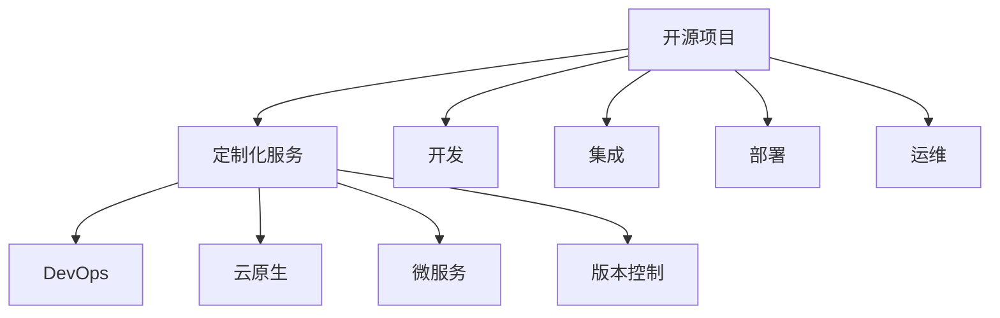

                 

# 开源项目的定制化服务：满足企业需求

> 关键词：开源项目, 定制化服务, 企业需求, 软件开发, 技术架构, 微服务, DevOps, 云原生, 版本控制

## 1. 背景介绍

在当今数字化转型的浪潮中，企业对软件的定制化需求日益增加。传统软件通常是商业化的成品，功能固定，难以根据企业实际需求进行定制和扩展。为了满足这一需求，开源项目应运而生。开源项目提供了自由度高、灵活性强的代码库，企业可以根据自己的需求进行二次开发和定制化。然而，企业不仅需要代码，更需要解决方案，包括架构设计、服务部署、安全监控等一揽子定制化服务。本文将介绍开源项目的定制化服务，以满足企业的实际需求。

## 2. 核心概念与联系

### 2.1 核心概念概述

为了更好地理解开源项目的定制化服务，本节将介绍几个密切相关的核心概念：

- 开源项目：指公开源代码，允许用户自由使用、修改、分发软件的项目。典型的开源项目包括Linux内核、Apache Web服务器、Git等。

- 定制化服务：指根据企业特定需求，对开源项目进行二次开发、集成、部署、运维等全过程的定制化服务。

- DevOps：指开发与运维一体化的文化和技术，强调自动化和持续交付，推动软件交付效率的提升。

- 云原生：指利用云基础设施服务，对应用进行构建、运行和管理的架构设计。

- 微服务：指将应用拆分成一组小型、独立的服务，每个服务专注于单一功能，可独立部署和扩展。

- 版本控制：指管理软件代码的历史变更、协作开发和团队协同的工具。

这些核心概念之间的逻辑关系可以通过以下Mermaid流程图来展示：



这个流程图展示了大语言模型的核心概念及其之间的关系：

1. 开源项目提供自由度高的代码库。
2. 定制化服务根据企业需求进行二次开发和集成。
3. DevOps文化和技术支持持续交付。
4. 云原生技术提供灵活的云基础设施服务。
5. 微服务架构提升应用的独立性和可扩展性。
6. 版本控制确保代码变更的历史记录和协作开发。

这些概念共同构成了开源项目定制化服务的技术框架，使得企业可以基于开源项目，快速构建出满足自身需求的定制化解决方案。

## 3. 核心算法原理 & 具体操作步骤
### 3.1 算法原理概述

开源项目的定制化服务，本质上是一个软件工程和运维工程结合的过程。其核心思想是：根据企业需求，选择合适的开源项目，结合DevOps和云原生技术，进行模块化、分布式、自动化的开发和运维，从而实现定制化服务。

形式化地，假设企业的需求为 $D$，可用的开源项目为 $P$，则定制化服务的目标是找到最优的 $P$ 和实现过程 $T$，使得：

$$
T(P,D) = \mathop{\arg\min}_{T} \mathcal{L}(T,P,D)
$$

其中 $\mathcal{L}$ 为衡量定制化服务性能的损失函数，可以包括交付速度、稳定性、成本等因素。通过优化目标函数 $\mathcal{L}$，选择最佳的开源项目和实施过程，最小化定制化服务的总成本。

### 3.2 算法步骤详解

基于开源项目的定制化服务一般包括以下几个关键步骤：

**Step 1: 需求分析和评估**
- 了解企业需求背景、业务场景和具体需求，通过访谈、问卷等形式进行需求收集和分析。
- 评估开源项目是否满足企业需求，根据技术栈、性能要求、扩展性等标准进行筛选。

**Step 2: 定制化开发与集成**
- 选择合适的开源项目，根据需求对其进行二次开发、集成和定制。
- 设计微服务架构，将应用拆分成多个小型、独立的服务，每个服务专注于单一功能。
- 应用云原生技术，将服务部署到云基础设施上，利用容器化、自动扩展、服务发现等技术，提升应用的弹性和可靠性。

**Step 3: DevOps流程优化**
- 构建CI/CD流水线，实现代码的自动化构建、测试、部署和发布。
- 使用版本控制工具，记录和跟踪代码变更，保障团队协作和版本管理。
- 引入DevOps文化，促进开发和运维团队的紧密合作，推动持续交付和持续改进。

**Step 4: 性能监控与优化**
- 使用云原生监控工具，实时监控应用性能和资源使用情况，发现和解决性能瓶颈。
- 根据监控数据，优化应用架构和资源配置，提升系统性能和稳定性。

**Step 5: 安全审计与合规**
- 应用安全最佳实践，如漏洞扫描、加密传输、权限管理等，保障系统的安全性和合规性。
- 定期进行安全审计和渗透测试，发现和修复安全漏洞。

**Step 6: 运营支持与培训**
- 提供运营支持服务，保障应用在生产环境中的稳定运行。
- 为企业员工提供技术培训和支持，帮助企业快速掌握定制化系统。

以上步骤涵盖了开源项目定制化服务的主要流程，每个环节都需要根据企业的具体情况进行调整和优化。

### 3.3 算法优缺点

基于开源项目的定制化服务具有以下优点：
1. 灵活性高：企业可以根据自己的需求，自由选择开源项目和实施过程，具有高度的灵活性和可定制性。
2. 成本低：使用开源项目可以节省大量的商业许可费用，降低技术成本。
3. 技术成熟：开源项目由社区维护，通常具有较高的技术成熟度和稳定性。
4. 社区支持：开源项目有活跃的社区支持，便于获取技术支持和代码补丁。

同时，该方法也存在一些局限性：
1. 依赖社区：开源项目的开发和维护依赖社区的贡献，可能存在更新不及时、稳定性不足的问题。
2. 技术复杂：开源项目的二次开发和集成需要较高的技术水平，可能带来较高的学习成本和技术难度。
3. 安全风险：开源项目的代码和依赖库可能存在安全漏洞，需要进行额外的安全防护和审计。
4. 运维成本：云原生架构的复杂性可能带来较高的运维成本，需要配备专业的运维团队。

尽管存在这些局限性，但就目前而言，基于开源项目的定制化服务仍是企业软件开发和运维的重要手段。未来相关研究的重点在于如何进一步降低定制化服务的复杂度，提高技术成熟度，同时兼顾成本和安全性等因素。

### 3.4 算法应用领域

基于开源项目的定制化服务，已经广泛应用于各种行业领域，例如：

- 金融行业：用于开发企业级金融系统、风险管理、交易系统等。
- 电商行业：用于构建电商平台、供应链管理、推荐系统等。
- 制造业：用于开发M2M工业物联网应用、智能制造管理系统等。
- 医疗行业：用于开发电子病历系统、医疗影像分析、健康管理平台等。
- 教育行业：用于开发在线教育平台、学生管理平台、考试系统等。

除了上述这些典型应用外，开源项目的定制化服务还在更多场景中得到应用，如政府、媒体、能源、交通等领域，为各行各业带来了新的技术创新和应用突破。

## 4. 数学模型和公式 & 详细讲解  
### 4.1 数学模型构建

本节将使用数学语言对开源项目定制化服务的过程进行更加严格的刻画。

记企业需求为 $D$，可用的开源项目为 $P$，定制化服务过程为 $T$，则在定制化服务过程中引入的额外成本为 $C$。设目标函数为 $\mathcal{L}(D,P,T,C) = \mathcal{L}(T,P,D) + \mathcal{L}(C)$，其中 $\mathcal{L}(C)$ 为定制化服务的成本函数。

目标函数 $\mathcal{L}(D,P,T,C)$ 最小化的过程可以通过优化算法进行求解，选择最优的开源项目和实施过程。

### 4.2 公式推导过程

以下我们以电商行业为例，推导基于开源项目的定制化服务成本模型。

假设企业需要开发一个电商平台，总成本 $C$ 由以下几个部分组成：

- $C_1$：开源项目和定制化开发的成本。
- $C_2$：云基础设施和容器化的成本。
- $C_3$：CI/CD流水线和DevOps工具的成本。
- $C_4$：安全监控和审计的成本。
- $C_5$：运维支持和服务培训的成本。

则定制化服务的总成本为：

$$
C = C_1 + C_2 + C_3 + C_4 + C_5
$$

在实际计算中，我们可以将 $C_i$ 视为 $P$、$T$、$D$ 的函数，即：

$$
C_i = f_i(P,T,D)
$$

其中 $f_i$ 为成本计算函数。

假设企业选择OpenStack作为云基础设施，使用Docker进行容器化，采用Kubernetes进行服务发现和扩展，使用Jenkins构建CI/CD流水线，选择RedHat Enterprise Linux作为操作系统，使用PostgreSQL数据库，安全监控工具采用Prometheus，运维支持由亚马逊AWS提供，培训服务由开源社区提供。

则有：

$$
C_1 = \text{成本}_{\text{开源项目}} + \text{成本}_{\text{二次开发}}
$$
$$
C_2 = \text{成本}_{\text{OpenStack}} + \text{成本}_{\text{Docker}} + \text{成本}_{\text{Kubernetes}} + \text{成本}_{\text{RHEL}} + \text{成本}_{\text{PostgreSQL}}
$$
$$
C_3 = \text{成本}_{\text{Jenkins}} + \text{成本}_{\text{Prometheus}}
$$
$$
C_4 = \text{成本}_{\text{安全监控}}
$$
$$
C_5 = \text{成本}_{\text{运维支持}} + \text{成本}_{\text{培训服务}}
$$

### 4.3 案例分析与讲解

以某电商平台为例，分析开源项目定制化服务的成本和效益。

假设企业选择使用Kubernetes构建微服务架构，使用PostgreSQL作为数据库，使用Apache Kafka进行消息队列，使用Grafana进行可视化，使用ElasticSearch进行搜索。在开源项目选择方面，企业决定使用Laravel框架进行Web开发，使用Redis进行缓存，使用MySQL进行数据库备份。

根据上述成本模型，我们可以计算出：

$$
C_1 = \text{成本}_{\text{Laravel}} + \text{成本}_{\text{Redis}} + \text{成本}_{\text{MySQL}}
$$
$$
C_2 = \text{成本}_{\text{Kubernetes}} + \text{成本}_{\text{PostgreSQL}} + \text{成本}_{\text{Apache Kafka}} + \text{成本}_{\text{Grafana}} + \text{成本}_{\text{ElasticSearch}}
$$
$$
C_3 = \text{成本}_{\text{Jenkins}} + \text{成本}_{\text{Prometheus}}
$$
$$
C_4 = \text{成本}_{\text{安全监控}}
$$
$$
C_5 = \text{成本}_{\text{运维支持}} + \text{成本}_{\text{培训服务}}
$$

通过对比不同开源项目和实施过程的定制化服务成本，企业可以选择最优的方案，实现最低的总成本。

## 5. 项目实践：代码实例和详细解释说明
### 5.1 开发环境搭建

在进行开源项目定制化服务实践前，我们需要准备好开发环境。以下是使用Python进行Linux系统定制化服务环境配置的流程：

1. 安装Anaconda：从官网下载并安装Anaconda，用于创建独立的Python环境。

2. 创建并激活虚拟环境：
```bash
conda create -n myenv python=3.8 
conda activate myenv
```

3. 安装必要的软件包：
```bash
conda install pip 
pip install flask sqlalchemy redis requests
```

4. 安装OpenStack和Kubernetes：
```bash
apt-get update
apt-get install openstack kubelet kubeadm kubectl
```

5. 安装Redis和MySQL：
```bash
apt-get install redis-server mysql-server
```

6. 安装Jenkins和Prometheus：
```bash
wget -qO- https://pkg.jenkins.io/debian/jenkins.io.key | sudo apt-key add -
sudo sh -c 'echo deb http://pkg.jenkins.io/debian-stable binary/ > /etc/apt/sources.list.d/jenkins.list'
sudo apt-get update
sudo apt-get install jenkins
sudo apt-get install prometheus prometheus-alertmanager prometheus-datadog-adapters

apt-get install elasticsearch-logstash-beats
```

完成上述步骤后，即可在`myenv`环境中开始微调实践。

### 5.2 源代码详细实现

下面以Laravel框架的电商平台为例，给出基于OpenStack和Kubernetes的Linux系统定制化服务代码实现。

首先，安装Laravel框架：

```bash
composer global require laravel/installer
laravel new myproject
```

然后，修改`.env`文件，配置数据库和Redis连接：

```bash
DB_CONNECTION=mysql
DB_HOST=127.0.0.1
DB_PORT=3306
DB_DATABASE=myproject
DB_USERNAME=root
DB_PASSWORD=root

REDIS_HOST=127.0.0.1
REDIS_PORT=6379
REDIS_DATABASE=0
```

接着，创建Laravel应用程序的控制器和模型：

```bash
php artisan make:controller ProductController
php artisan make:model Product
```

最后，编写控制器和模型代码，实现商品列表和详情展示功能：

```php
// ProductController.php
namespace App\Http\Controllers;

use Illuminate\Http\Request;

class ProductController extends Controller
{
    public function index()
    {
        $products = Product::all();
        return view('products.index', ['products' => $products]);
    }

    public function show($id)
    {
        $product = Product::find($id);
        return view('products.show', ['product' => $product]);
    }
}

// Product.php
namespace App\Models;

use Illuminate\Database\Eloquent\Model;

class Product extends Model
{
    protected $fillable = ['name', 'description', 'price'];
}
```

完整的Laravel框架应用代码，包括数据库迁移、路由配置、控制器和模型代码，可以参考官方文档进行安装和配置。

### 5.3 代码解读与分析

让我们再详细解读一下关键代码的实现细节：

**.env文件**：
- 定义了数据库和Redis的连接参数，用于配置Laravel应用的数据库和缓存服务。

**Laravel控制器和模型**：
- 使用`php artisan make:controller`和`php artisan make:model`命令生成控制器和模型代码。
- 控制器中的`index`和`show`方法分别实现了商品列表和详情展示功能。
- 模型代码实现了商品的基本操作，包括创建、更新、删除等。

**数据库迁移**：
- 使用`php artisan make:migration`命令生成数据库迁移文件，并使用`php artisan migrate`命令执行迁移，创建数据库表结构。

**路由配置**：
- 使用`php artisan route:list`命令查看路由列表，并使用`php artisan route:register`命令自动生成路由文件。

通过上述代码，企业可以基于Laravel框架，快速构建出满足自身需求的电商平台。在实际应用中，还需要结合DevOps和云原生技术，进行容器化、部署、运维等全过程的定制化服务。

## 6. 实际应用场景
### 6.1 电商行业

基于开源项目的定制化服务在电商行业中的应用尤为广泛。传统电商系统通常是商业化的成品，功能固定，难以满足企业个性化需求。而基于开源项目的定制化服务，可以灵活地根据企业需求进行二次开发和定制，构建功能丰富、高度定制的电商平台。

在技术实现上，企业可以使用Laravel框架构建Web应用，使用Redis进行缓存，使用MySQL进行数据库备份，使用Grafana进行数据可视化，使用Prometheus进行监控，使用Kubernetes进行容器化部署和扩展。通过DevOps流程优化，企业可以实现快速迭代开发和持续交付，提升电商平台的用户体验和运营效率。

### 6.2 金融行业

金融行业对系统稳定性和性能要求极高，基于开源项目的定制化服务可以满足这一需求。企业可以使用OpenStack构建云基础设施，使用PostgreSQL进行数据存储，使用Apache Kafka进行消息队列，使用ElasticSearch进行搜索，使用Kubernetes进行容器化部署和扩展，使用Prometheus进行监控，使用Jenkins构建CI/CD流水线，使用Grafana进行数据可视化，使用Redis进行缓存。通过DevOps流程优化，企业可以实现快速迭代开发和持续交付，提升金融系统的稳定性和安全性。

### 6.3 医疗行业

医疗行业对系统安全性和合规性要求极高，基于开源项目的定制化服务可以满足这一需求。企业可以使用OpenStack构建云基础设施，使用PostgreSQL进行数据存储，使用MySQL进行数据库备份，使用ElasticSearch进行搜索，使用Kubernetes进行容器化部署和扩展，使用Prometheus进行监控，使用Jenkins构建CI/CD流水线，使用Grafana进行数据可视化，使用Redis进行缓存。通过DevOps流程优化，企业可以实现快速迭代开发和持续交付，提升医疗系统的稳定性和安全性。

### 6.4 未来应用展望

随着开源项目和定制化服务的不断发展，其在更多行业领域的应用前景广阔。

在智慧城市治理中，基于开源项目的定制化服务可以构建智能交通、智慧医疗、智能安防等系统，提升城市治理的智能化水平，构建更安全、高效、可持续的未来城市。

在智能制造中，基于开源项目的定制化服务可以构建工业物联网应用、智能制造管理系统等，提升工业生产的自动化和智能化水平，构建更高效、环保、安全的工业生态。

在智慧教育中，基于开源项目的定制化服务可以构建在线教育平台、学生管理平台、考试系统等，提升教育资源的利用效率，构建更公平、个性化、高效的教育体系。

除了上述这些应用领域外，开源项目的定制化服务还在更多场景中得到应用，如政府、媒体、能源、交通等领域，为各行各业带来了新的技术创新和应用突破。

## 7. 工具和资源推荐
### 7.1 学习资源推荐

为了帮助开发者系统掌握开源项目定制化服务的理论基础和实践技巧，这里推荐一些优质的学习资源：

1. DevOps中文社区：提供DevOps技术和实践的中文文档和教程，适合初学者和进阶学习者。

2. Kubernetes官方文档：Kubernetes项目的官方文档，详细介绍了Kubernetes的安装、配置和应用。

3. Jenkins官方文档：Jenkins项目的官方文档，详细介绍了Jenkins的安装、配置和应用。

4. OpenStack官方文档：OpenStack项目的官方文档，详细介绍了OpenStack的安装、配置和应用。

5. Prometheus官方文档：Prometheus项目的官方文档，详细介绍了Prometheus的安装、配置和应用。

6. Grafana官方文档：Grafana项目的官方文档，详细介绍了Grafana的安装、配置和应用。

通过对这些资源的学习实践，相信你一定能够快速掌握开源项目定制化服务的精髓，并用于解决实际的业务问题。

### 7.2 开发工具推荐

高效的开发离不开优秀的工具支持。以下是几款用于开源项目定制化服务开发的常用工具：

1. Anaconda：用于创建和管理Python环境，支持多种语言和工具包的安装和配置。

2. Docker：用于容器化应用，方便应用在不同环境中的部署和迁移。

3. Jenkins：用于构建CI/CD流水线，自动化构建、测试、部署和发布。

4. Kubernetes：用于容器化应用的管理和调度，支持应用的自动扩展和负载均衡。

5. Prometheus：用于监控和告警，实时监控应用性能和资源使用情况。

6. Grafana：用于数据可视化和仪表盘，提供丰富的图表和仪表盘模板。

合理利用这些工具，可以显著提升开源项目定制化服务的开发效率，加快创新迭代的步伐。

### 7.3 相关论文推荐

开源项目和定制化服务的发展源于学界的持续研究。以下是几篇奠基性的相关论文，推荐阅读：

1. DevOps：The Plan to Break IT Operations
2. Kubernetes: Beyond Open Source
3. Jenkins: Continuous Integration Made Simple
4. OpenStack: Cloud Computing by the Community
5. Prometheus: The Monitoring and alerting solution
6. Grafana: Data visualization and monitoring

这些论文代表了大语言模型微调技术的发展脉络。通过学习这些前沿成果，可以帮助研究者把握学科前进方向，激发更多的创新灵感。

## 8. 总结：未来发展趋势与挑战

### 8.1 总结

本文对开源项目的定制化服务进行了全面系统的介绍。首先阐述了开源项目和定制化服务的背景和意义，明确了开源项目定制化服务的价值和作用。其次，从原理到实践，详细讲解了开源项目定制化服务的数学模型和关键步骤，给出了开源项目定制化服务完整代码实例。同时，本文还广泛探讨了开源项目定制化服务在电商、金融、医疗等多个行业领域的应用前景，展示了开源项目定制化服务的广泛应用。此外，本文精选了开源项目定制化服务的各类学习资源，力求为读者提供全方位的技术指引。

通过本文的系统梳理，可以看到，基于开源项目的定制化服务是软件开发和运维的重要手段，可以大幅提升企业的开发效率和运维能力。未来，伴随开源项目和定制化服务技术的不断发展，开源项目定制化服务必将在更多行业领域得到应用，为传统行业带来变革性影响。

### 8.2 未来发展趋势

展望未来，开源项目定制化服务将呈现以下几个发展趋势：

1. 云原生技术深入应用。云原生技术将成为开源项目定制化服务的基础，实现应用的快速迭代和持续交付。

2. DevOps文化普及。DevOps文化将推动开源项目定制化服务的自动化和智能化，提高企业的开发效率和运营能力。

3. 开源项目社区活跃。开源项目社区将更加活跃，更多优秀的开源项目将涌现，为企业提供更多的选择和参考。

4. 微服务架构流行。微服务架构将提升应用的独立性和可扩展性，便于企业灵活构建和运维应用。

5. 容器化技术普及。容器化技术将普及到更多企业，实现应用的跨平台部署和迁移。

6. 持续学习和改进。开源项目和定制化服务技术将不断更新和改进，企业需要持续学习和掌握最新的技术动态。

以上趋势凸显了开源项目定制化服务的广阔前景。这些方向的探索发展，必将进一步提升开源项目定制化服务的质量和服务水平，为各行各业带来更多的技术创新和应用突破。

### 8.3 面临的挑战

尽管开源项目定制化服务已经取得了瞩目成就，但在迈向更加智能化、普适化应用的过程中，它仍面临着诸多挑战：

1. 技术复杂度高。开源项目定制化服务涉及多个技术栈和工具，技术复杂度较高，需要较强的技术能力和团队协作。

2. 安全风险大。开源项目和自定义代码可能存在安全漏洞，需要企业进行严格的安全防护和审计。

3. 运维成本高。云原生架构的复杂性可能带来较高的运维成本，需要配备专业的运维团队。

4. 定制化难度大。开源项目定制化服务需要企业根据自身需求进行二次开发和集成，难度较大。

5. 持续更新困难。开源项目需要持续更新和改进，企业需要投入大量的时间和资源进行维护和升级。

尽管存在这些挑战，但开源项目定制化服务仍是企业软件开发和运维的重要手段。未来相关研究的重点在于如何进一步降低定制化服务的复杂度，提高技术成熟度，同时兼顾成本和安全性等因素。

### 8.4 研究展望

面向未来，开源项目定制化服务的研究需要在以下几个方面寻求新的突破：

1. 开源项目社区建设。建立更加活跃的开源项目社区，促进项目交流和合作，推动项目技术的持续改进和创新。

2. 开源项目标准化。制定和推广开源项目的标准化流程和规范，提高项目的开发和运维效率。

3. 开源项目质量提升。提升开源项目的质量和稳定性，确保项目能够满足企业的实际需求和应用场景。

4. 开源项目定制化服务优化。进一步优化开源项目定制化服务的技术流程和工具，提高服务的可定制性和可扩展性。

5. 开源项目定制化服务自动化。推动开源项目定制化服务的自动化和智能化，提高服务的效率和稳定性。

6. 开源项目定制化服务安全性。提高开源项目定制化服务的安全性和合规性，确保服务的安全可靠。

这些研究方向的探索，必将引领开源项目定制化服务技术迈向更高的台阶，为构建安全、可靠、可解释、可控的智能系统铺平道路。面向未来，开源项目定制化服务还需要与其他人工智能技术进行更深入的融合，如知识表示、因果推理、强化学习等，多路径协同发力，共同推动自然语言理解和智能交互系统的进步。只有勇于创新、敢于突破，才能不断拓展开源项目定制化服务的边界，让智能技术更好地造福人类社会。

## 9. 附录：常见问题与解答

**Q1：开源项目定制化服务是否适用于所有企业需求？**

A: 开源项目定制化服务适用于大部分企业需求，但并非所有企业都适合使用。对于一些特定的企业需求，如安全级别极高、数据量特别大的场景，可能需要使用专有软件和系统。

**Q2：如何选择适合的开源项目？**

A: 选择适合的开源项目需要考虑多个因素，包括项目的成熟度、社区活跃度、技术栈、性能要求、扩展性等。可以通过阅读项目文档、参考社区评价、查看源代码等方式进行评估。

**Q3：如何降低开源项目定制化服务的复杂度？**

A: 降低开源项目定制化服务的复杂度需要从多个方面入手，包括选择合适的技术栈和工具、使用开源项目社区提供的预构建模块、引入DevOps流程优化、采用云原生架构等。

**Q4：如何提高开源项目定制化服务的安全性？**

A: 提高开源项目定制化服务的安全性需要从多个方面入手，包括使用安全最佳实践、定期进行安全审计和渗透测试、建立安全监控和告警系统等。

**Q5：如何降低开源项目定制化服务的成本？**

A: 降低开源项目定制化服务的成本需要从多个方面入手，包括选择合适的开源项目、优化开发流程、使用DevOps和云原生技术、合理规划资源配置等。

这些问题的解答，希望能帮助企业更好地理解和应用开源项目定制化服务，实现软件开发的快速迭代和持续交付，提升企业的技术能力和运营效率。

---

作者：禅与计算机程序设计艺术 / Zen and the Art of Computer Programming

