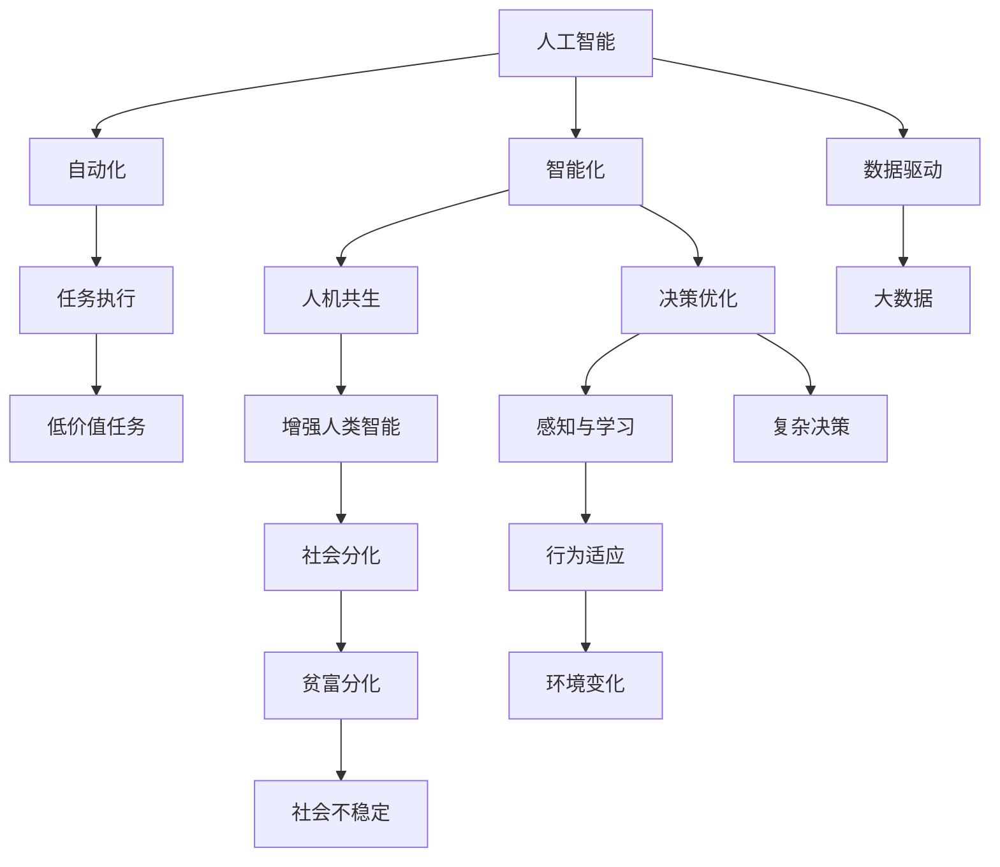

                 

## 1. 背景介绍

### 1.1 问题由来

随着人工智能技术的快速发展，我们正处于一个前所未有的变革时期。从自动驾驶、智能制造到智慧医疗，人工智能的触角已经深入到社会的各个角落。但正如库布里克的科幻电影《2001太空漫游》所描绘的那样，随着技术的进步，我们可能会面临全新的社会结构、伦理困境和文化冲击。

在2050年的遥远未来，人工智能将如何影响人类的生活？我们该如何应对这些变化？本文将从技术、社会、伦理等角度出发，畅想一个可能的未来，探讨人类走近2050的世界将如何不同。

### 1.2 问题核心关键点

未来世界畅想需要从多个维度进行探讨：

- **技术进步**：未来30年内，人工智能将在哪些领域取得突破性进展？这些技术将如何改变我们的生活方式？
- **社会结构**：随着自动化和智能化水平的提升，工作性质、社会分工将如何变化？人类与AI的关系将如何演化？
- **伦理道德**：AI在带来便利的同时，也可能带来伦理困境。如何建立合理的伦理框架，确保AI技术的可控性？
- **文化冲击**：人类与AI共存的未来，文化将如何融合？人工智能将如何塑造我们的认知、情感和价值观念？

## 2. 核心概念与联系

### 2.1 核心概念概述

为更好地理解未来世界的技术和社会趋势，本节将介绍几个核心概念及其之间的联系：

- **人工智能(AI)**：指通过计算机算法和数据处理，使计算机系统具备类似人类智能行为的能力。人工智能包括机器学习、深度学习、自然语言处理等技术领域。

- **自动化**：指通过人工智能技术，自动完成重复性、低价值的任务，减少对人力的依赖。

- **智能化**：指系统具备自主决策、感知和学习能力，能够根据环境变化灵活调整行为。

- **自动化与智能化的结合**：未来世界，自动化将与智能化深度融合，形成更加复杂、精细的智能系统。

- **人机共生**：人类与AI的协同工作，实现互补优势。AI负责处理数据、执行任务，而人类则负责决策、监督。

- **增强人类智能**：AI技术被用于提升人类的认知、决策和协作能力，帮助人类应对更加复杂的任务。

- **社会分化**：AI和智能化水平的不均衡，可能导致社会分化加剧，富裕与贫困、技能与非技能劳动力之间的差距扩大。

这些核心概念之间相互关联，共同构成了未来世界畅想的理论基础。

### 2.2 核心概念原理和架构的 Mermaid 流程图



### 2.3 核心概念的联系

通过上述流程图，可以看到不同概念之间的联系：

- 数据驱动：AI的进步离不开数据的支撑，大数据和数据处理技术将为AI的发展提供坚实基础。
- 任务执行：自动化将任务执行交给AI系统，减少人为干预。
- 决策优化：智能化使AI系统具备决策能力，能够自动优化行为策略。
- 感知与学习：AI通过感知和适应环境变化，不断学习和提升。
- 行为适应：智能化系统的行为能够根据环境变化灵活调整。
- 增强人类智能：AI技术帮助人类解决复杂问题，提升认知和协作能力。
- 社会分化：自动化和智能化水平的差异，可能导致社会结构的分化。

这些联系共同构成了未来世界畅想的逻辑框架。

## 3. 核心算法原理 & 具体操作步骤

### 3.1 算法原理概述

未来世界畅想涉及到多个技术领域，以下从几个关键技术角度进行探讨：

- **深度学习**：未来，深度学习将在图像识别、自然语言处理、语音识别等领域取得新的突破，推动自动化和智能化水平的提升。

- **自然语言处理(NLP)**：NLP技术将进一步发展，使AI系统能够理解和生成人类语言，支持智能客服、机器翻译、文本摘要等应用。

- **计算机视觉(CV)**：CV技术将提升图像识别和处理能力，支持自动驾驶、医疗影像分析、机器人导航等应用。

- **增强现实(AR)/虚拟现实(VR)**：AR/VR技术将与AI结合，构建更加沉浸和互动的体验，改变人类的认知和社交方式。

- **量子计算**：量子计算有望解决某些传统计算机无法处理的复杂问题，推动科学研究、金融分析等领域的发展。

### 3.2 算法步骤详解

以下是未来世界畅想的几个关键技术步骤：

**Step 1: 数据收集与处理**

数据是AI技术的基础，未来世界需要大量的高质量数据来训练和优化AI模型。为此，需要构建完善的开源数据集、标准化的数据管理平台，支持自动化数据收集和处理。

**Step 2: 模型训练与优化**

基于收集到的数据，使用深度学习算法训练AI模型，并进行模型优化。未来，自动化和智能化的需求将推动模型规模和复杂度的提升，同时优化算法也将更加高效。

**Step 3: 模型部署与应用**

训练好的AI模型需要部署到实际应用场景中，如智能家居、智能交通、智能医疗等。模型部署需要考虑数据传输、计算资源、安全隐私等问题。

**Step 4: 反馈与优化**

AI模型需要根据实际应用场景的反馈进行持续优化。通过不断的迭代和改进，提高模型的准确性和泛化能力，确保其长期稳定运行。

### 3.3 算法优缺点

未来世界畅想的技术发展有以下优缺点：

**优点**：

- **效率提升**：自动化和智能化技术将大幅提升工作效率，减少人力成本。
- **决策优化**：AI系统能够基于大数据和模型优化，提供更加科学的决策支持。
- **新应用场景**：AI技术将开拓新的应用场景，提升生活质量。

**缺点**：

- **数据依赖**：高质量数据的获取和处理仍是AI发展的瓶颈。
- **伦理问题**：AI系统的决策可能面临伦理道德的挑战，需要建立合理的监管机制。
- **安全性**：AI系统可能面临黑客攻击、数据泄露等安全问题，需要加强防护。

### 3.4 算法应用领域

未来世界的AI技术将应用于各个领域，以下列举几个典型应用：

- **医疗**：智能医疗系统能够提供疾病诊断、药物研发、个性化治疗等服务。
- **交通**：自动驾驶、智能交通管理等技术将提升交通安全和效率。
- **教育**：智能教育系统能够提供个性化教学、智能评估等服务。
- **金融**：金融分析、风险控制等AI应用将提升金融服务质量。
- **农业**：农业自动化和智能化技术将提高农业生产效率和可持续发展能力。

## 4. 数学模型和公式 & 详细讲解 & 举例说明

### 4.1 数学模型构建

未来世界的AI技术发展将涉及到复杂的数学模型和算法，以下列举几个典型的数学模型：

- **深度神经网络**：用于图像识别、自然语言处理等任务，包括卷积神经网络(CNN)、循环神经网络(RNN)、变压器(Transformer)等。

- **强化学习**：用于智能决策和机器人控制，包括Q-learning、策略梯度等算法。

- **自然语言处理模型**：包括BERT、GPT、T5等预训练模型，以及基于这些模型的微调模型。

### 4.2 公式推导过程

以BERT模型为例，其数学模型如下：

$$
\text{BERT}_{\theta}(x) = \text{Transformer}_{\theta}^{[CLS]}(x) \quad \text{(1)}
$$

其中，$\theta$为模型参数，$x$为输入文本，$[\text{CLS}]$为BERT的[CLS]表示向量。BERT模型的训练过程如下：

1. 输入文本$x$，使用BERT模型计算表示向量$h$。
2. 将表示向量$h$输入到分类器，输出预测结果$y$。
3. 计算损失函数$\mathcal{L}(y,\hat{y})$。
4. 使用反向传播算法更新模型参数$\theta$。

通过上述过程，BERT模型能够从大量无标签文本中学习到语言的通用表示，用于下游任务的微调。

### 4.3 案例分析与讲解

以BERT在命名实体识别(NER)任务上的应用为例，其步骤如下：

1. 准备标注数据集，将文本和实体标签构建成监督数据。
2. 加载预训练的BERT模型，并添加任务适配层。
3. 使用Adam优化器进行微调，调整模型参数以适应NER任务。
4. 在验证集上评估模型性能，调整学习率、批次大小等超参数。
5. 在测试集上测试模型，输出命名实体识别结果。

## 5. 项目实践：代码实例和详细解释说明

### 5.1 开发环境搭建

未来世界的AI应用开发需要强大的计算资源和工具支持，以下列出常见的开发环境搭建步骤：

1. 安装Python：Python是AI开发的主流编程语言，需要选择版本稳定、性能优秀的Python版本。
2. 安装TensorFlow或PyTorch：这两个深度学习框架是目前最流行的开源工具，选择适合自己项目的框架。
3. 安装相应的第三方库：如Numpy、Pandas、Scikit-learn等，用于数据处理和模型训练。
4. 安装GPU和TPU：如果项目需要高性能计算，可以考虑使用NVIDIA的GPU或Google的TPU。
5. 安装分布式计算框架：如TensorFlow、Ray等，支持大规模模型训练和分布式部署。

### 5.2 源代码详细实现

以下以BERT在命名实体识别任务上的微调为例，展示PyTorch代码实现：

```python
import torch
import torch.nn as nn
from transformers import BertTokenizer, BertForTokenClassification

class BERTNER(nn.Module):
    def __init__(self, num_labels):
        super(BERTNER, self).__init__()
        self.bert = BertForTokenClassification.from_pretrained('bert-base-cased', num_labels=num_labels)
        self.dropout = nn.Dropout(0.1)
        self.classifier = nn.Linear(768, num_labels)
    
    def forward(self, input_ids, attention_mask):
        outputs = self.bert(input_ids, attention_mask=attention_mask)
        pooled_output = outputs[1]
        pooled_output = self.dropout(pooled_output)
        logits = self.classifier(pooled_output)
        return logits

# 准备数据集
tokenizer = BertTokenizer.from_pretrained('bert-base-cased')
train_dataset = BERTNERDataset(train_texts, train_tags, tokenizer, max_len=128)
dev_dataset = BERTNERDataset(dev_texts, dev_tags, tokenizer, max_len=128)
test_dataset = BERTNERDataset(test_texts, test_tags, tokenizer, max_len=128)

# 模型初始化
model = BERTNER(num_labels=len(tag2id))
model.to('cuda')

# 训练过程
optimizer = torch.optim.Adam(model.parameters(), lr=2e-5)
for epoch in range(epochs):
    train_loss = train_epoch(model, train_dataset, optimizer, device='cuda')
    dev_loss = evaluate(model, dev_dataset, device='cuda')
    test_loss = test_epoch(model, test_dataset, device='cuda')
    print(f'Epoch {epoch+1}, train loss: {train_loss:.3f}, dev loss: {dev_loss:.3f}, test loss: {test_loss:.3f}')
```

### 5.3 代码解读与分析

上述代码实现了BERT模型在命名实体识别任务上的微调。具体步骤如下：

1. 定义BERTNER类，继承nn.Module，并初始化BERTForTokenClassification模型和分类器。
2. 加载数据集，并使用BertTokenizer进行分词和编码。
3. 定义训练过程，使用Adam优化器进行模型微调。
4. 在验证集和测试集上进行评估，输出损失。
5. 在训练过程中不断调整模型参数和学习率。

## 6. 实际应用场景

### 6.1 智能医疗

未来，AI技术将在医疗领域发挥重要作用，推动智能医疗系统的普及。智能医疗系统能够通过分析患者数据，提供个性化治疗方案、疾病预测、药物研发等服务。例如，AI可以通过分析患者的历史病历、基因数据、环境因素等，预测疾病发展趋势，提供个性化的治疗建议。

### 6.2 智能交通

未来世界的交通系统将更加智能化，自动驾驶技术将普及。自动驾驶汽车能够通过感知和决策算法，实现自主导航、避障、路径规划等功能。智能交通管理系统能够实时监控交通流量，优化交通信号灯控制，提升道路通行效率。

### 6.3 智能教育

未来教育系统将借助AI技术，实现个性化教学、智能评估和智能推荐。智能教育系统能够根据学生的学习行为和表现，提供个性化的学习方案，推荐适合的学习资源。通过智能评估，系统能够实时分析学生的学习效果，提供有针对性的反馈和指导。

### 6.4 未来应用展望

未来世界的AI应用将更加普及和深入，以下是几个可能的展望：

1. **智慧城市**：AI将应用于城市管理、智慧交通、公共安全等领域，提升城市运行效率和居民生活质量。
2. **智能家居**：智能家居系统将通过AI技术实现语音控制、智能推荐、能源管理等功能。
3. **工业制造**：AI将在制造业中广泛应用，实现智能制造、质量控制、供应链管理等。
4. **金融科技**：AI将推动金融科技的发展，提升金融服务的智能化水平，实现智能投顾、风险管理等功能。
5. **环保科技**：AI将应用于环境保护、资源管理等领域，提升环境监测和治理能力。

## 7. 工具和资源推荐

### 7.1 学习资源推荐

为了帮助开发者系统掌握AI技术，以下是一些优质的学习资源：

1. **深度学习基础**：斯坦福大学的CS231n课程，讲解深度学习的基本概念和算法。
2. **自然语言处理**：Coursera上的自然语言处理专项课程，涵盖语言模型、词向量、机器翻译等内容。
3. **强化学习**：DeepMind开设的强化学习课程，涵盖Q-learning、策略梯度等算法。
4. **计算机视觉**：CS231n课程，讲解计算机视觉的基本理论和应用。
5. **量子计算**：MIT的OpenQiskit课程，讲解量子计算的基础知识和应用。

### 7.2 开发工具推荐

未来世界的AI开发需要高效的开发环境和工具支持，以下是一些推荐工具：

1. **PyTorch**：灵活的深度学习框架，支持动态图和静态图。
2. **TensorFlow**：功能强大的深度学习框架，支持分布式计算和模型部署。
3. **TensorBoard**：可视化工具，用于监控模型训练和性能分析。
4. **Weights & Biases**：实验跟踪工具，记录和分析模型训练过程。
5. **Anaconda**：虚拟环境管理工具，支持多个Python环境的管理。

### 7.3 相关论文推荐

未来世界的AI技术发展离不开最新的研究成果。以下是一些重要的相关论文：

1. **AlphaGo**：DeepMind开发的围棋AI，展示了深度学习在复杂决策问题上的潜力。
2. **BERT**：Google开发的预训练语言模型，展示了无监督学习的强大能力。
3. **GANs**：生成对抗网络，展示了生成模型在图像生成、自然语言生成等任务上的应用。
4. **Transformer**：Google开发的自注意力机制，展示了模型在自然语言处理任务上的优异表现。
5. **量子计算**：IBM的量子计算研究，展示了量子计算在复杂问题上的应用潜力。

## 8. 总结：未来发展趋势与挑战

### 8.1 研究成果总结

未来世界的AI技术发展已经取得了显著进展，以下是对一些重要成果的总结：

1. **深度学习**：深度学习在图像识别、自然语言处理等领域取得了突破性进展，推动了自动化和智能化的发展。
2. **自然语言处理**：NLP技术能够理解和生成人类语言，支持智能客服、机器翻译、文本摘要等应用。
3. **计算机视觉**：CV技术提升了图像识别和处理能力，支持自动驾驶、医疗影像分析等应用。
4. **增强现实/虚拟现实**：AR/VR技术结合AI，提供了沉浸式的用户体验。
5. **量子计算**：量子计算在复杂问题上展示了巨大的潜力。

### 8.2 未来发展趋势

未来世界的AI技术将有以下趋势：

1. **更强的通用性**：AI将在更多领域实现突破，涵盖自然语言处理、计算机视觉、机器人控制等。
2. **更高的智能化水平**：AI系统将具备更加复杂的决策和推理能力，支持自主导航、情感分析等。
3. **更好的适应性**：AI系统能够根据环境变化灵活调整行为策略，适应多样化的应用场景。
4. **更高效的数据处理**：数据驱动的AI技术将得到广泛应用，提升数据处理和分析的效率。
5. **更广泛的应用场景**：AI技术将广泛应用于智慧医疗、智能交通、智能教育等领域。

### 8.3 面临的挑战

未来世界的AI技术发展仍面临诸多挑战：

1. **数据质量和数量**：高质量数据的获取和处理仍是AI发展的瓶颈。
2. **伦理和安全问题**：AI系统的决策可能面临伦理道德的挑战，需要建立合理的监管机制。
3. **资源消耗**：大规模模型训练和推理需要大量的计算资源和内存。
4. **模型可解释性**：AI系统的决策过程缺乏可解释性，难以对其推理逻辑进行分析和调试。
5. **技术局限性**：当前AI技术在某些复杂问题上仍存在局限性，需要进一步研究和改进。

### 8.4 研究展望

未来世界的AI技术研究需要从多个维度进行探索：

1. **无监督学习和半监督学习**：通过无监督和半监督学习，降低对标注数据的依赖。
2. **可解释性和透明度**：开发可解释的AI系统，增强模型的透明度和可解释性。
3. **多模态学习**：将符号化的先验知识与神经网络模型结合，提升模型的适应性和鲁棒性。
4. **模型压缩和优化**：通过模型压缩和优化，提升模型的效率和性能。
5. **跨领域应用**：将AI技术应用于更多领域，推动技术的广泛应用和产业化进程。

## 9. 附录：常见问题与解答

### Q1: AI技术如何影响未来就业？

A: AI技术将替代部分重复性、低价值的工作，同时创造新的就业机会。AI系统需要大量的维护、优化和监督人员，同时新的技术领域也会涌现出更多专业人才。

### Q2: 未来世界是否会出现AI统治人类的情况？

A: AI技术的发展需要谨慎控制，避免出现不可控的情况。通过建立合理的监管机制和伦理框架，确保AI技术的发展符合人类利益。

### Q3: 未来世界的AI技术是否会导致数据隐私泄露？

A: AI技术的发展需要重视数据隐私和安全。通过数据加密、访问控制等手段，确保数据隐私得到有效保护。

### Q4: AI技术如何在未来社会中发挥作用？

A: AI技术将支持智能决策、优化资源配置、提高生活质量等方面。通过与人类协作，AI技术将为社会带来更多便利和创新。

### Q5: 未来世界的AI技术是否会推动人类智慧的进化？

A: AI技术将推动人类的认知和协作能力提升，加速知识创新和传播。但人类智慧的核心在于创造力、情感和道德，AI技术可以辅助但无法完全替代人类智慧。

---

作者：禅与计算机程序设计艺术 / Zen and the Art of Computer Programming

