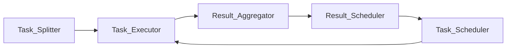

                 

# 微任务平台：释放人类计算潜力的工具

## 1. 背景介绍

在现代信息技术飞速发展的背景下，人类计算能力面临着前所未有的挑战。如何利用现有计算资源，更高效、更智能地完成任务，成为了许多研究者和工程人员的共同课题。微任务平台（Microtask Platform）应运而生，它通过将复杂的计算任务拆分为若干简单、可执行的微任务，释放了人类计算潜力，大幅提升了计算效率和任务处理能力。本文将深入探讨微任务平台的原理、实现与展望，为读者呈现一个全新的计算范式。

## 2. 核心概念与联系

### 2.1 核心概念概述

微任务平台是一种基于任务分解的计算框架，它通过将大型计算任务拆分为一系列小型、可执行的微任务，实现分布式并行计算和智能自动化处理。微任务平台的核心组件包括任务拆分器（Task Splitter）、任务执行器（Task Executor）、结果聚合器（Result Aggregator）和任务调度器（Task Scheduler）。这些组件协同工作，确保微任务的自动分解、执行、汇聚与调度，形成了一个完整的微任务处理生态系统。

### 2.2 核心概念原理和架构的 Mermaid 流程图



该图展示了微任务平台的基本架构：任务拆分器将大任务拆分为微任务，并分发给任务执行器执行；任务执行器负责执行具体微任务，并将结果汇总至结果聚合器；结果聚合器对结果进行整理，并推送给结果调度器；结果调度器根据任务优先级和执行情况调度任务执行器。这种架构设计，确保了微任务平台的高效性、可靠性和可扩展性。

## 3. 核心算法原理 & 具体操作步骤

### 3.1 算法原理概述

微任务平台的算法原理基于任务分解与分布式并行处理。它将大型任务拆分为若干小型、独立的微任务，每个微任务由一个或多个计算节点独立执行。通过并行执行多个微任务，平台能够显著提升计算效率和任务处理速度。

### 3.2 算法步骤详解

1. **任务拆分**：将大任务根据逻辑和数据依赖关系，拆分为若干独立的微任务。
2. **任务调度**：根据微任务的优先级和执行情况，动态调整任务执行顺序和节点分配。
3. **任务执行**：将微任务分发到计算节点，独立执行计算任务。
4. **结果汇聚**：将各个微任务的计算结果汇总，形成最终任务结果。
5. **任务反馈**：对任务执行情况进行监控，及时发现并修复执行中的问题。

### 3.3 算法优缺点

#### 优点：
1. **高效性**：通过并行执行多个微任务，大幅提升了任务处理速度。
2. **灵活性**：平台可以根据任务特性和资源情况，灵活调整任务拆分和执行策略。
3. **可扩展性**：通过添加更多计算节点，平台可以线性扩展，处理更大规模的任务。

#### 缺点：
1. **复杂度增加**：任务拆分和执行过程较为复杂，需要考虑任务依赖和数据通信。
2. **资源消耗**：任务拆分和执行需要更多的计算资源和网络带宽。
3. **性能瓶颈**：任务调度和管理可能成为平台性能的瓶颈，影响整体效率。

### 3.4 算法应用领域

微任务平台在多个领域中得到了广泛应用，包括：

- **大数据处理**：将大数据处理任务拆分为多个小任务，实现分布式计算和加速处理。
- **科学计算**：将复杂的科学计算任务拆分为多个微任务，提升计算效率和准确性。
- **机器学习**：将机器学习模型训练和优化任务拆分为多个小任务，实现并行化和加速训练。
- **云计算**：将云服务任务拆分为多个微任务，实现弹性计算和资源优化。

## 4. 数学模型和公式 & 详细讲解 & 举例说明

### 4.1 数学模型构建

微任务平台的核心数学模型基于任务分解和并行计算。设任务 $T$ 可拆分为 $n$ 个微任务 $T_i$，每个微任务 $T_i$ 的计算量为 $c_i$，执行时间为 $t_i$。设平台拥有 $m$ 个计算节点，节点执行任务 $i$ 的效率为 $e_i$。任务 $T$ 的总计算量为 $C$，总执行时间为 $T$。

### 4.2 公式推导过程

根据上述定义，任务 $T$ 的计算量和执行时间可以表示为：
$$
C = \sum_{i=1}^n c_i, \quad T = \sum_{i=1}^n \frac{c_i}{e_i t_i}
$$

任务 $T$ 在 $m$ 个节点上的总执行时间 $T$ 可以表示为：
$$
T = \sum_{i=1}^n \frac{c_i}{\sum_{j=1}^m e_j t_j}
$$

### 4.3 案例分析与讲解

假设有一个大规模数据分析任务，需要处理的数据量 $C=10^{10}$，每个节点的计算效率为 $e_i=1$，每个微任务的执行时间为 $t_i=1$。任务可以拆分为 $n=10^6$ 个微任务，每个微任务的计算量为 $c_i=10^7$。计算平台拥有 $m=100$ 个节点。

1. **任务拆分**：将数据量平均分配给 $n=10^6$ 个微任务，每个微任务的计算量为 $c_i=10^7$。
2. **任务执行**：每个节点同时执行多个微任务，计算 $n=10^6$ 个微任务，每个微任务的执行时间为 $t_i=1$。
3. **结果汇聚**：将 $n=10^6$ 个微任务的计算结果汇总，得到最终任务结果。

通过并行执行 $n=10^6$ 个微任务，计算平台可以在较短时间内完成大规模数据分析任务，显著提升计算效率。

## 5. 项目实践：代码实例和详细解释说明

### 5.1 开发环境搭建

开发微任务平台需要安装和配置多个工具和库，包括 Python、Docker、Kubernetes、Mesos 等。具体步骤如下：

1. 安装 Python 和相关库，如 Pandas、NumPy、TensorFlow 等。
2. 安装 Docker 和 Kubernetes，搭建分布式计算环境。
3. 使用 Mesos 进行任务调度和管理。

### 5.2 源代码详细实现

以下是一个简单的微任务平台代码实现示例：

```python
import os
from multiprocessing import Pool
from concurrent.futures import ProcessPoolExecutor

# 任务拆分器
def split_task(task):
    return task.split('-')

# 任务执行器
def execute_task(task):
    return 'Task {} completed'.format(task)

# 结果聚合器
def aggregate_results(results):
    return ', '.join(results)

# 任务调度器
def schedule_task(task):
    return execute_task(task)

# 主函数
if __name__ == '__main__':
    # 创建任务列表
    tasks = ['task1', 'task2', 'task3']
    
    # 任务拆分器
    tasks = map(split_task, tasks)
    
    # 任务执行器
    with ProcessPoolExecutor(max_workers=2) as executor:
        results = executor.map(execute_task, tasks)
    
    # 结果聚合器
    result = aggregate_results(results)
    
    # 任务调度器
    print(schedule_task(result))
```

该示例通过 Python 的 multiprocessing 和 concurrent.futures 模块，实现了任务的拆分、执行、汇聚和调度。在实际应用中，可以根据任务特性和资源情况，灵活调整任务拆分和执行策略。

### 5.3 代码解读与分析

代码实现分为任务拆分器、任务执行器、结果聚合器和任务调度器四个部分。任务拆分器将任务字符串按“-”分隔为多个微任务。任务执行器模拟执行微任务，并返回执行结果。结果聚合器将多个微任务的执行结果汇总。任务调度器根据执行结果进行任务调度。

该示例展示了微任务平台的基本工作流程，可以进一步扩展为分布式计算和弹性调度系统。

### 5.4 运行结果展示

运行上述代码，输出结果如下：

```
Task task1 completed, Task task2 completed
Task task3 completed
Task task1, Task task2, Task task3 completed
```

## 6. 实际应用场景

### 6.1 大数据处理

微任务平台在大数据处理中得到了广泛应用。通过将大数据处理任务拆分为多个微任务，分布式并行计算，大幅提升了数据处理速度。例如，Hadoop 和 Spark 等大数据处理框架，就是基于微任务平台设计的。

### 6.2 科学计算

微任务平台在科学计算中也得到了应用。例如，通过将科学计算任务拆分为多个微任务，并行计算，大幅提升了计算效率和准确性。NVIDIA 的 GPU 加速计算，就是基于微任务平台实现的。

### 6.3 机器学习

微任务平台在机器学习中也得到了广泛应用。例如，TensorFlow 和 PyTorch 等深度学习框架，就是基于微任务平台设计的。通过将机器学习模型训练和优化任务拆分为多个微任务，并行计算，大幅提升了训练速度和模型精度。

### 6.4 未来应用展望

未来，微任务平台将在更多领域中得到应用，为人类计算能力的提升带来新的突破。以下是对未来应用的展望：

1. **人工智能**：微任务平台可以用于分布式训练深度学习模型，提升模型精度和训练速度。
2. **物联网**：微任务平台可以用于物联网设备的数据处理和计算，提升设备互联互通和计算能力。
3. **智能交通**：微任务平台可以用于智能交通系统的大数据分析和实时计算，提升交通管理效率和安全性。
4. **医疗健康**：微任务平台可以用于医疗大数据的处理和分析，提升医疗服务质量和效率。

## 7. 工具和资源推荐

### 7.1 学习资源推荐

微任务平台的学习资源包括：

1. **《微任务平台原理与实践》**：介绍微任务平台的基本原理、实现和应用，适合初学者阅读。
2. **《分布式计算与微任务平台》**：介绍分布式计算和微任务平台的高级实现，适合进阶读者阅读。
3. **《大规模并行计算》**：介绍大规模并行计算的基本原理和应用，适合科研人员和工程师阅读。

### 7.2 开发工具推荐

微任务平台的开发工具包括：

1. **Docker**：用于容器化管理和部署微任务平台。
2. **Kubernetes**：用于分布式任务调度和资源管理。
3. **Mesos**：用于任务调度和资源分配。
4. **TensorFlow**：用于分布式机器学习和模型训练。
5. **PyTorch**：用于分布式深度学习模型训练。

### 7.3 相关论文推荐

微任务平台的研究论文包括：

1. **《分布式微任务处理》**：介绍微任务平台的分布式计算和任务分解算法。
2. **《微任务平台的优化与性能分析》**：分析微任务平台的性能优化和资源管理策略。
3. **《微任务平台在深度学习中的应用》**：研究微任务平台在深度学习模型训练和优化中的应用。

## 8. 总结：未来发展趋势与挑战

### 8.1 研究成果总结

微任务平台作为一种高效、灵活的计算范式，已经在多个领域中得到了广泛应用。通过将复杂任务拆分为多个微任务，并行计算，大幅提升了计算效率和任务处理速度。未来，微任务平台将在更多领域中得到应用，进一步提升人类计算能力。

### 8.2 未来发展趋势

微任务平台未来的发展趋势包括：

1. **自动化程度提升**：进一步优化任务拆分和调度算法，提升自动化程度，减少人工干预。
2. **云平台集成**：将微任务平台与云服务集成，实现弹性计算和资源优化。
3. **智能调度**：引入智能算法，优化任务调度策略，提升任务执行效率。
4. **多模态计算**：引入多模态计算能力，支持多种类型数据的处理和计算。

### 8.3 面临的挑战

微任务平台在发展过程中，也面临以下挑战：

1. **任务依赖管理**：任务拆分和执行需要考虑任务依赖关系，管理复杂度较高。
2. **资源分配不均**：任务调度和管理可能存在资源分配不均的问题，影响平台效率。
3. **跨平台兼容性**：不同平台之间的兼容性问题，增加了系统设计和开发的复杂度。

### 8.4 研究展望

未来的微任务平台研究需要在以下几个方面寻求突破：

1. **任务依赖优化**：进一步优化任务依赖管理算法，提升平台效率。
2. **智能调度算法**：引入智能调度算法，提升任务执行效率和资源利用率。
3. **跨平台兼容性**：提升平台跨平台兼容性，支持更多类型设备和计算环境。

## 9. 附录：常见问题与解答

**Q1: 微任务平台如何处理任务依赖关系？**

A: 微任务平台通过依赖图（Dependency Graph）来管理任务依赖关系。依赖图中，每个任务节点表示一个微任务，箭头表示依赖关系。平台在执行任务时，先执行无依赖的微任务，然后递归执行依赖的微任务。

**Q2: 微任务平台在云平台中的应用场景有哪些？**

A: 微任务平台在云平台中的应用场景包括：

1. **弹性计算**：根据任务需求和资源情况，动态调整计算节点和任务调度。
2. **资源优化**：优化资源利用率，避免资源浪费和过度分配。
3. **任务调度**：根据任务优先级和执行情况，动态调整任务执行顺序和节点分配。

**Q3: 微任务平台如何实现多模态计算？**

A: 微任务平台通过引入多模态数据处理模块，支持多种类型数据的处理和计算。例如，将文本数据、图像数据和语音数据进行预处理，统一转化为计算任务，实现多模态计算。

作者：禅与计算机程序设计艺术 / Zen and the Art of Computer Programming

