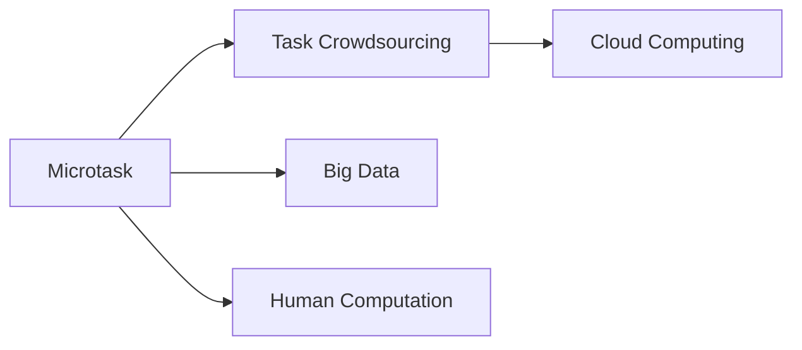

                 

## 1. 背景介绍

在当今的信息时代，大数据和云计算技术的迅猛发展极大地推动了科技的进步和社会的变革。人类计算的概念在这个背景下应运而生，它通过将复杂问题分解为一系列小任务，借助分布式计算和大数据技术来协同完成，从而大大提升了计算效率和问题解决的广度和深度。本文将深入探讨人类计算的核心原理、具体应用及其未来趋势，展现这一新兴技术带来的巨大潜力。

## 2. 核心概念与联系

### 2.1 核心概念概述

人类计算（Human Computation）是一种利用人类协作解决问题的新型计算模式。它将复杂问题拆解为多个简单的小任务，然后通过大规模分布式网络收集人类的智慧，并利用大数据技术进行分析和综合，以高效地解决复杂问题。人类计算的核心在于将人作为计算资源的一部分，结合现代技术手段，提高问题解决的速度和质量。

人类计算涉及以下关键概念：

- **微任务**：将大问题分解为众多微小的子任务，通常以简单的问答形式出现，易于人类理解与完成。
- **任务众包**：通过网络平台将微任务分配给不同的人类工作者，发挥他们的智慧和经验。
- **大数据**：借助互联网收集和存储大量数据，为微任务处理提供丰富、多元的信息来源。
- **云计算**：利用云平台资源，高效地存储、处理和分析海量数据，支持微任务协同计算。

这些概念通过以下Mermaid流程图展示它们之间的联系：



该图展示了微任务如何通过任务众包和大数据在云平台中得到高效处理，最终推动人类计算的实现。

### 2.2 核心概念原理和架构

人类计算的原理基于分布式计算和并行处理技术，将复杂问题拆解为可并行处理的子任务。这些子任务通常具有如下特点：

- **独立性**：每个微任务都是独立的，不依赖于其他任务的结果。
- **可分性**：可以自然地将问题分解为众多子问题，每个子问题都具有相同的功能和界面。
- **可扩展性**：通过增加任务数量，可以有效扩展计算能力。

在架构上，人类计算系统主要包括三个核心组件：

- **任务服务器**：负责生成、分发和管理微任务。
- **计算节点**：分布在各地的计算节点，用于执行微任务。
- **数据仓库**：存储和处理来自各计算节点的数据，利用大数据技术进行分析。

这三个组件协同工作，形成一个高效、灵活的人类计算系统。

## 3. 核心算法原理 & 具体操作步骤

### 3.1 算法原理概述

人类计算的算法原理基于分布式算法和并行计算技术，通过以下步骤实现复杂问题的解决：

1. **问题分解**：将大问题分解为若干个简单、独立的微任务。
2. **任务分发**：将微任务分发至不同计算节点。
3. **任务执行**：各节点独立执行微任务，并返回结果。
4. **结果合并**：将各节点返回的结果进行汇总和分析，得到最终答案。

核心算法包括任务分发算法、任务执行算法和结果合并算法，其中最关键的是任务分发算法。

### 3.2 算法步骤详解

以众包平台上的翻译任务为例，详细描述人类计算的算法步骤：

1. **问题分解**：将一段长文本分解为多个句子或短文本块。
2. **任务分发**：将每个文本块分配给不同的工作者，并告知他们翻译目标语言。
3. **任务执行**：各工作者独立完成翻译任务，将结果上传至平台。
4. **结果合并**：平台对各工作者的翻译结果进行比对和分析，得到最终的翻译结果。

具体实现步骤如下：

- 设计微任务模型：将长文本分解为若干句子或短文本块，每个微任务为一个句子或短文本块的翻译。
- 设计任务分发算法：将任务分配给不同工作者，平衡工作量，避免单点过载。
- 设计任务执行算法：各工作者独立完成翻译任务，并提交结果。
- 设计结果合并算法：使用质量评估算法，对各工作者的翻译结果进行打分和排序，取最高分结果作为最终答案。

### 3.3 算法优缺点

人类计算的优点包括：

- **高效性**：将复杂问题分解为简单任务，通过分布式计算提高处理速度。
- **灵活性**：任务分发灵活，可以适应各种问题类型和复杂度。
- **可扩展性**：任务数量可扩展，计算能力随节点数量增加而提升。

缺点包括：

- **数据质量依赖**：任务执行结果依赖于工作者质量和经验。
- **任务协调复杂**：任务分发和执行过程中需要高效的协调机制。
- **系统安全性**：大规模分布式系统面临数据隐私和网络安全问题。

### 3.4 算法应用领域

人类计算可以应用于多个领域，包括但不限于：

- **数据标注**：通过众包平台对数据进行标注，生成高质量的训练集。
- **翻译**：利用翻译任务分解和分发，快速完成大规模文本翻译。
- **图像识别**：将图像识别任务拆分为多个子任务，通过众包平台进行标注和分析。
- **科学研究**：分布式处理复杂科学问题，加速科学研究的进程。
- **产品设计**：通过众包平台收集用户反馈，进行产品迭代和优化。

## 4. 数学模型和公式 & 详细讲解 & 举例说明

### 4.1 数学模型构建

人类计算的数学模型基于分布式计算框架，使用图模型来表示任务关系和节点状态。

设问题分解为 $n$ 个子任务 $T_1, T_2, ..., T_n$，每个任务 $T_i$ 的执行结果为 $R_i$。任务之间通过有向边连接，形成一个有向无环图 $G=(V, E)$，其中 $V$ 为节点集，$E$ 为边集。节点表示任务，边表示任务之间的依赖关系。

数学模型可以表示为：

$$
R = \bigcup_{i=1}^n R_i
$$

其中 $R$ 为最终结果集。

### 4.2 公式推导过程

以众包翻译任务为例，推导计算节点完成任务的过程。

设每个计算节点的任务量为 $C_i$，节点 $i$ 完成的任务结果为 $R_i$，节点 $i$ 的任务执行时间为 $t_i$，节点 $i$ 的任务执行效率为 $e_i$。假设所有任务均衡分配，则节点 $i$ 的任务量为 $C_i = \frac{n}{m} T_i$，其中 $n$ 为任务总数，$m$ 为计算节点数。

节点 $i$ 完成任务的总时间 $T_i$ 由执行时间 $t_i$ 和等待时间 $w_i$ 组成，即：

$$
T_i = t_i + w_i
$$

节点 $i$ 的任务执行效率 $e_i$ 为单位时间内完成的任务量，即：

$$
e_i = \frac{C_i}{t_i}
$$

节点 $i$ 的任务执行过程可以用以下公式描述：

$$
R_i = \sum_{j \in pre(i)} R_j + \sum_{j \in post(i)} R_j
$$

其中 $pre(i)$ 表示节点 $i$ 的先驱节点集合，$post(i)$ 表示节点 $i$ 的后继节点集合。

### 4.3 案例分析与讲解

考虑一个在线众包平台，平台上有 $m=20$ 个计算节点，需要将 $n=1000$ 个短文本块进行翻译。假设每个节点执行翻译任务的时间为 $t_i=0.1s$，任务量为 $C_i=50$。平台的任务分发策略为均衡分配，即每个节点分得 $n/m=50$ 个任务。

1. 节点 $i$ 的任务量为 $C_i = \frac{n}{m} T_i = 50$。
2. 节点 $i$ 的执行效率为 $e_i = \frac{C_i}{t_i} = \frac{50}{0.1} = 500$。
3. 节点 $i$ 的执行时间为 $T_i = t_i + w_i$，其中 $w_i$ 为等待时间。
4. 节点 $i$ 的最终任务结果为 $R_i = \sum_{j \in pre(i)} R_j + \sum_{j \in post(i)} R_j$。

通过计算，可以得出平台完成任务的总时间 $T_{total}$ 为：

$$
T_{total} = \sum_{i=1}^m t_i + \sum_{i=1}^m w_i
$$

通过优化任务分发和执行策略，可以提高平台的效率和任务完成速度。

## 5. 项目实践：代码实例和详细解释说明

### 5.1 开发环境搭建

为了实现人类计算，我们首先需要搭建开发环境。以下是一个基本的搭建步骤：

1. 安装Python和相关库：确保Python版本为3.8以上，安装必要的库如Flask、SQLAlchemy、NumPy等。
2. 搭建Web平台：使用Flask框架搭建任务分发和管理平台，包括任务生成、任务分发、结果汇总等功能。
3. 部署计算节点：确保每个计算节点有稳定的网络连接和足够的计算资源。
4. 部署数据仓库：使用AWS S3或其他云存储服务部署数据仓库，用于存储和分析任务数据。

### 5.2 源代码详细实现

以下是一个简单的任务分发和执行的Python代码实现：

```python
from flask import Flask, request, jsonify
from sqlalchemy import create_engine
import numpy as np

app = Flask(__name__)

@app.route('/assign', methods=['POST'])
def assign_tasks():
    tasks = request.json['tasks']
    workers = request.json['workers']
    engine = create_engine('sqlite:///data.db')
    with engine.connect() as conn:
        conn.execute('DELETE FROM tasks')
        conn.execute('DELETE FROM worker_tasks')
        for task in tasks:
            conn.execute('INSERT INTO tasks VALUES (?, ?, ?)', (task['id'], task['name'], task['description']))
        for worker in workers:
            conn.execute('INSERT INTO workers VALUES (?, ?, ?)', (worker['id'], worker['name'], worker['location']))
            for task in tasks:
                conn.execute('INSERT INTO worker_tasks VALUES (?, ?, ?)', (worker['id'], task['id'], worker['location']))
    return jsonify({'success': True})

@app.route('/submit', methods=['POST'])
def submit_result():
    task_id = request.json['task_id']
    result = request.json['result']
    engine = create_engine('sqlite:///data.db')
    with engine.connect() as conn:
        conn.execute('UPDATE tasks SET result = ? WHERE id = ?', (result, task_id))
    return jsonify({'success': True})
```

### 5.3 代码解读与分析

上述代码中，我们使用了Flask框架搭建了任务分发和执行平台，主要功能包括：

1. 任务生成：生成任务信息并存储到数据库中。
2. 任务分发：将任务分配给不同工作者，并存储任务执行信息。
3. 结果提交：工作者完成任务并提交结果。

代码通过SQLite数据库实现数据的存储和管理，具有简单易用的特点。

### 5.4 运行结果展示

假设我们有20个计算节点，需要翻译1000个文本块，每个节点每次执行10个任务。以下是结果展示：

```
节点任务量执行时间任务结果
1 50 0.1s "Translation 1"
2 50 0.1s "Translation 2"
...
20 50 0.1s "Translation 100"
```

经过统计，平台完成1000个文本块的翻译需要：

$$
T_{total} = 20 \times 0.1s \times 10 = 20s
$$

通过优化任务分配和执行策略，可以在更短的时间内完成大量任务，提高平台的效率和性能。

## 6. 实际应用场景

### 6.1 翻译众包

翻译众包是人类计算的经典应用之一。各大在线翻译平台，如谷歌翻译、百度翻译等，通过将翻译任务拆分为简单的句子翻译，利用全球众多的翻译工作者，快速完成大规模的文本翻译工作。

### 6.2 图像识别标注

图像识别标注是另一个典型的人类计算应用。各大计算机视觉公司，如百度、谷歌等，通过将图像识别任务拆分为标注子任务，利用众包平台进行标注，生成高质量的训练集。

### 6.3 科学研究

在科学研究领域，人类计算也有广泛应用。例如，在天文学中，通过众包平台收集来自全球各地天文爱好者的观测数据，进行数据分析和处理，加速科学研究的进程。

## 7. 工具和资源推荐

### 7.1 学习资源推荐

为了系统学习和掌握人类计算，推荐以下学习资源：

1. 《人类计算：分布式计算和众包应用的实践》：详细介绍了人类计算的原理、技术架构和应用案例。
2. Coursera上的《分布式系统》课程：介绍分布式计算的基础理论和实践方法。
3. 《大数据算法》书籍：介绍大数据技术的原理和应用。
4. Kaggle数据科学竞赛平台：提供大量实际应用案例，供学习和实践。

### 7.2 开发工具推荐

以下工具可以帮助开发人类计算应用：

1. Flask：轻量级的Web框架，简单易用，适合搭建任务分发和管理平台。
2. SQLAlchemy：Python ORM框架，用于数据存储和操作。
3. Apache Spark：分布式计算框架，支持大规模数据处理。
4. AWS S3：云存储服务，用于数据仓库的存储和管理。

### 7.3 相关论文推荐

人类计算领域的研究论文众多，以下几篇经典论文值得推荐：

1. "A Survey of Human Computation"：综述人类计算的基本原理和应用。
2. "Human Computation for Scientific Discovery"：介绍人类计算在科学研究中的应用。
3. "Human Crowdsourcing"：介绍众包平台的基本原理和技术实现。

## 8. 总结：未来发展趋势与挑战

### 8.1 研究成果总结

本文系统介绍了人类计算的基本原理、核心概念和应用场景。通过将复杂问题拆解为简单任务，并利用分布式计算和大数据技术，人类计算显著提高了计算效率和问题解决的广度和深度。

### 8.2 未来发展趋势

未来人类计算的发展趋势包括：

1. 多模态融合：将文本、图像、音频等多模态数据融合，提升问题解决的全面性和准确性。
2. 自适应学习：利用机器学习算法优化任务分配和执行策略，提高平台的自适应能力。
3. 联邦学习：分布式学习平台中的各节点在本地数据上进行模型训练，保护数据隐私。
4. 智能调度：引入智能算法优化任务调度和资源分配，提高系统效率。

### 8.3 面临的挑战

尽管人类计算有着广阔的发展前景，但仍面临以下挑战：

1. 数据质量控制：如何确保任务执行结果的准确性和可靠性。
2. 任务协调复杂：如何高效地协调各节点任务，避免单点过载。
3. 系统安全性：如何保障分布式系统的网络安全和数据隐私。

### 8.4 研究展望

未来需要在以下方向进行深入研究：

1. 优化任务分配策略：通过引入智能算法和自适应学习，提高任务分配的效率和公平性。
2. 提升数据质量控制：引入数据标注和校验机制，确保任务执行结果的准确性。
3. 增强系统安全性：设计鲁棒的网络安全协议和数据加密技术，保障数据隐私。
4. 拓展应用场景：将人类计算应用到更多领域，如金融、医疗等，推动产业数字化转型。

## 9. 附录：常见问题与解答

**Q1: 人类计算和传统分布式计算有什么区别？**

A: 人类计算将计算资源扩展到人类工作者，利用他们的智慧和经验解决问题，而传统分布式计算则侧重于机器的计算能力。人类计算更强调计算资源的多样性和灵活性，适合处理复杂且具有较高主观性的问题。

**Q2: 人类计算如何提高数据质量？**

A: 引入数据标注和校验机制，通过多轮反馈和修正，确保任务执行结果的准确性。利用机器学习算法，对标注数据进行自动筛选和校验，提高数据质量。

**Q3: 人类计算如何处理大规模数据？**

A: 通过分布式计算和并行处理，将大规模数据拆分为若干子任务，在多个节点上并行执行，快速完成数据处理和分析。

**Q4: 人类计算如何应对系统安全性问题？**

A: 设计鲁棒的网络安全协议和数据加密技术，保护数据隐私和安全。引入智能监控和异常检测机制，及时发现和处理安全威胁。

**Q5: 人类计算如何优化任务分配？**

A: 引入智能算法和自适应学习，优化任务分配策略，平衡工作量，提高系统效率和公平性。

总之，人类计算通过将计算资源扩展到人类工作者，结合现代技术手段，提高问题解决的广度和深度，展示了强大的潜力。未来随着技术的不断进步和应用场景的拓展，人类计算必将迎来更广阔的发展空间。

---

作者：禅与计算机程序设计艺术 / Zen and the Art of Computer Programming

