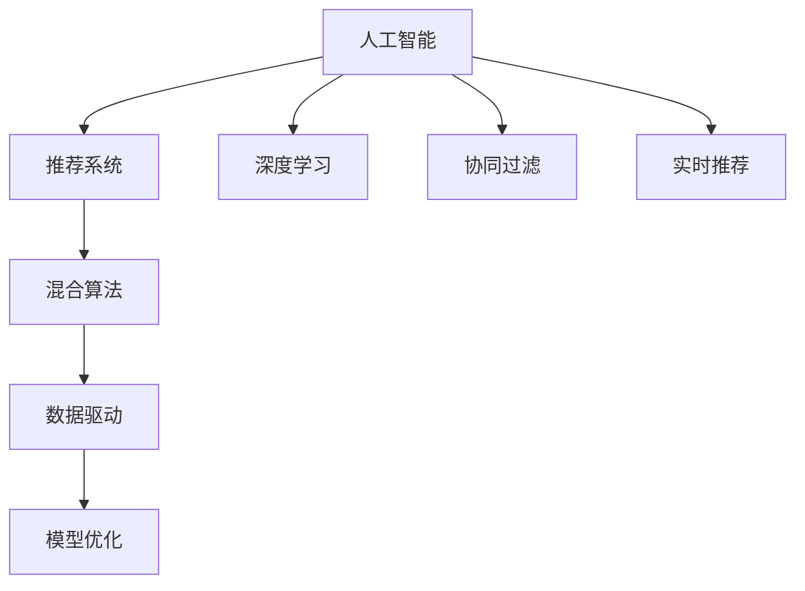

                 

# 微软的AI战略分析：对推荐系统的影响

> 关键词：人工智能,推荐系统,深度学习,决策树,协同过滤,实时推荐,混合算法,模型优化

## 1. 背景介绍

### 1.1 问题由来
近年来，随着人工智能技术的飞速发展，微软在AI领域采取了一系列战略举措，以期在全球AI技术竞争中占据领先地位。其中，推荐系统作为AI技术的重要应用场景，得到了高度重视。微软通过深度学习、协同过滤、混合算法等多种技术手段，构建了一套强大的推荐系统，极大地提升了用户的使用体验和产品的市场竞争力。

推荐系统在互联网行业中的应用非常广泛，包括电子商务、新闻阅读、视频流媒体等。其基本原理是利用用户的历史行为数据和产品特征，预测用户对不同产品的偏好，从而提供个性化的推荐结果。微软的推荐系统在性能和效果上取得了显著成果，对公司的业务发展和市场占有率起到了积极作用。

### 1.2 问题核心关键点
微软的推荐系统在AI战略中占据重要地位，其核心关键点包括：

- 深度学习技术的应用：深度神经网络通过大规模语料库训练，可以自动提取高维特征，为推荐系统提供了强大的数据处理能力。
- 协同过滤算法：利用用户行为数据，通过相似性匹配，推测用户对未曝光产品的偏好，提升推荐准确性。
- 实时推荐引擎：通过实时计算和数据更新，动态调整推荐结果，满足用户即时需求。
- 混合算法：将不同算法结合，取长补短，构建更为高效和稳健的推荐系统。
- 数据驱动的模型优化：通过A/B测试等手段，实时监控推荐效果，并不断优化模型参数，提高系统性能。

这些核心关键点构成了微软推荐系统的技术架构，使得其在推荐准确性和用户体验上达到了新高度。

### 1.3 问题研究意义
研究微软的AI战略对推荐系统的影响，对于理解大型科技公司如何利用AI技术驱动业务创新、优化用户体验具有重要意义。推荐系统作为AI技术的重要应用，其优化和改进对提高用户满意度、增加产品粘性和提升市场竞争力具有显著影响。通过分析微软在推荐系统上的技术创新和应用实践，可以为中国企业提供有益的借鉴和启示，推动本土AI技术和业务发展的融合。

## 2. 核心概念与联系

### 2.1 核心概念概述

为更好地理解微软在推荐系统中的AI战略，本节将介绍几个密切相关的核心概念：

- **人工智能(AI)**：通过模拟人类智能行为，实现自动化和智能化决策的技术。包括机器学习、深度学习、自然语言处理等方向。
- **推荐系统(Recommendation System)**：利用用户行为数据，自动推荐产品、内容等个性化物品的系统。在电子商务、内容平台等领域广泛应用。
- **深度学习(Deep Learning)**：利用多层次神经网络，自动学习数据特征，进行复杂模式识别和决策的技术。在图像、语音、文本等领域均有重要应用。
- **协同过滤(Collaborative Filtering)**：利用用户和物品之间的相似性，进行推荐的技术。包括基于用户的协同过滤、基于物品的协同过滤等。
- **实时推荐系统(Real-time Recommendation System)**：通过实时计算和数据更新，动态调整推荐结果的系统。满足用户即时需求，提高系统响应速度。
- **混合算法(Hybrid Algorithm)**：将不同推荐算法结合，构建更为高效和稳健的推荐系统。

这些核心概念之间的逻辑关系可以通过以下Mermaid流程图来展示：



这个流程图展示了一系列核心概念及其之间的关系：

1. 人工智能作为底层技术，支撑推荐系统的开发和运行。
2. 深度学习、协同过滤、实时推荐等技术，是构建推荐系统的关键技术手段。
3. 混合算法将不同技术结合，提升推荐系统性能。
4. 数据驱动和模型优化确保推荐系统不断迭代，提升效果。

这些概念共同构成了微软推荐系统的技术框架，使其能够在推荐准确性和用户体验上不断突破。

## 3. 核心算法原理 & 具体操作步骤
### 3.1 算法原理概述

微软的推荐系统以深度学习为底层技术，采用协同过滤、实时推荐等算法，构建了一套强大的推荐系统。其核心算法原理如下：

**深度学习推荐算法**：
- **模型结构**：一般采用多层感知器(MLP)、卷积神经网络(CNN)、递归神经网络(RNN)等结构。
- **训练过程**：通过大规模用户行为数据和物品特征，自动学习高维特征，生成推荐模型。
- **预测过程**：将用户特征和物品特征输入模型，计算预测评分，输出推荐结果。

**协同过滤算法**：
- **用户协同过滤**：利用用户行为数据，通过余弦相似度或皮尔逊相关系数等度量方式，计算用户之间的相似性。
- **物品协同过滤**：利用物品特征数据，计算物品之间的相似性。
- **预测过程**：根据相似性计算，推测用户对未曝光物品的评分，生成推荐结果。

**实时推荐系统**：
- **数据实时采集**：通过流式数据采集技术，实时收集用户行为数据。
- **实时计算**：利用流式计算框架，如Apache Storm、Apache Flink等，实时计算推荐结果。
- **动态调整**：根据用户即时行为和环境变化，动态调整推荐策略。

**混合算法**：
- **算法选择**：根据不同场景和数据特点，选择合适的推荐算法，如基于内容的推荐、基于协同的推荐等。
- **组合优化**：通过加权组合、决策融合等手段，提升推荐效果。
- **算法更新**：定期更新算法参数，保持系统动态优化。

### 3.2 算法步骤详解

基于深度学习、协同过滤和实时推荐的推荐系统，其核心步骤包括：

**Step 1: 数据准备与特征工程**
- 收集用户行为数据，如点击、浏览、购买记录等。
- 对数据进行清洗和处理，去除噪声和异常值。
- 提取和构建特征向量，如用户特征、物品特征、时间特征等。

**Step 2: 模型训练与调参**
- 选择深度学习模型，并进行大规模训练。
- 调整模型参数，通过交叉验证等手段进行调参。
- 选择协同过滤算法，并计算相似性矩阵。

**Step 3: 实时计算与动态调整**
- 实时采集用户行为数据，并进行预处理。
- 利用流式计算框架，实时计算推荐结果。
- 根据用户即时行为和环境变化，动态调整推荐策略。

**Step 4: 模型评估与优化**
- 通过A/B测试等手段，评估推荐效果。
- 根据评估结果，不断优化模型参数和算法选择。
- 持续监控系统性能，确保推荐结果的准确性和稳定性。

### 3.3 算法优缺点

微软的推荐系统在深度学习、协同过滤、实时推荐等技术上取得了显著成效，但也存在一些缺点：

**优点**：
- 利用深度学习自动提取高维特征，提升了推荐系统的准确性。
- 协同过滤算法能够捕捉用户之间的相似性，推荐结果更加个性化。
- 实时推荐系统满足用户即时需求，提高系统响应速度。
- 混合算法结合多种技术，提升了系统的鲁棒性和稳健性。

**缺点**：
- 深度学习模型训练时间长，对计算资源要求较高。
- 协同过滤算法可能存在冷启动问题和数据稀疏性问题。
- 实时推荐系统对流式计算和实时数据处理技术要求较高。
- 混合算法可能存在参数过多、模型复杂的问题，导致计算负担增加。

尽管存在这些缺点，但微软的推荐系统依然凭借其强大的技术和数据能力，在推荐准确性和用户体验上取得了卓越效果。

### 3.4 算法应用领域

微软的推荐系统已经在多个领域得到了广泛应用，例如：

- **电子商务**：为用户推荐商品，提升购买转化率。
- **新闻阅读**：为用户推荐新闻，提高用户粘性和阅读量。
- **视频流媒体**：为用户推荐视频内容，增加观看时长和订阅用户数。
- **社交媒体**：为用户推荐好友和内容，扩大社交网络影响力。
- **广告投放**：为用户推荐广告，提升广告效果和点击率。

这些应用场景展示了微软推荐系统强大的跨行业适应性，其在不同领域中的应用都取得了显著的业务价值。

## 4. 数学模型和公式 & 详细讲解 & 举例说明

### 4.1 数学模型构建

微软的推荐系统采用深度学习、协同过滤等技术，其数学模型构建如下：

**深度学习模型**：
- **用户特征表示**：$\boldsymbol{x}_u \in \mathbb{R}^d$，其中 $d$ 为特征维度。
- **物品特征表示**：$\boldsymbol{x}_i \in \mathbb{R}^d$。
- **用户与物品交互矩阵**：$\boldsymbol{X} \in \mathbb{R}^{N \times M}$，其中 $N$ 为用户数，$M$ 为物品数。
- **预测模型**：$\boldsymbol{\theta} \in \mathbb{R}^{d}$。

**协同过滤模型**：
- **用户-物品相似性矩阵**：$\boldsymbol{S} \in \mathbb{R}^{N \times M}$，通过余弦相似度或皮尔逊相关系数计算得到。

**实时推荐系统**：
- **用户行为数据**：$\boldsymbol{D}_t \in \mathbb{R}^{N \times T}$，其中 $T$ 为时间步长。
- **推荐结果**：$\boldsymbol{Y}_t \in \mathbb{R}^{N \times M}$。

### 4.2 公式推导过程

以深度学习推荐模型为例，推导预测评分公式如下：

假设输入用户特征和物品特征，通过多层感知器模型计算预测评分，则有：

$$
\hat{r}_{u,i} = f(\boldsymbol{x}_u; \boldsymbol{x}_i; \boldsymbol{\theta}) = \sigma(\boldsymbol{\theta}^T \boldsymbol{W}[\boldsymbol{x}_u, \boldsymbol{x}_i])
$$

其中 $\sigma$ 为激活函数，$\boldsymbol{W}$ 为权重矩阵。

协同过滤模型的预测评分公式为：

$$
\hat{r}_{u,i} = \boldsymbol{x}_u^T \boldsymbol{S}_{u,i} \boldsymbol{x}_i
$$

实时推荐系统的预测评分公式为：

$$
\hat{r}_{u,i} = f(\boldsymbol{x}_u; \boldsymbol{x}_i; \boldsymbol{\theta}, t)
$$

其中 $t$ 为时间步长，$\boldsymbol{D}_t$ 为实时用户行为数据。

### 4.3 案例分析与讲解

以微软的实时推荐系统为例，分析其实时计算和动态调整过程：

1. **数据实时采集**：通过流式数据采集技术，实时收集用户行为数据，生成数据流 $\boldsymbol{D}_t$。
2. **实时计算**：利用流式计算框架，如Apache Storm、Apache Flink等，计算推荐评分 $\hat{r}_{u,i}(t)$。
3. **动态调整**：根据实时评分和环境变化，动态调整推荐策略。例如，通过调整模型参数、更新相似性矩阵等手段，实时优化推荐结果。

## 5. 项目实践：代码实例和详细解释说明

### 5.1 开发环境搭建

在进行微软推荐系统的微调实践前，我们需要准备好开发环境。以下是使用Python进行PyTorch开发的环境配置流程：

1. 安装Anaconda：从官网下载并安装Anaconda，用于创建独立的Python环境。

2. 创建并激活虚拟环境：
```bash
conda create -n pytorch-env python=3.8 
conda activate pytorch-env
```

3. 安装PyTorch：根据CUDA版本，从官网获取对应的安装命令。例如：
```bash
conda install pytorch torchvision torchaudio cudatoolkit=11.1 -c pytorch -c conda-forge
```

4. 安装其他工具包：
```bash
pip install numpy pandas scikit-learn matplotlib tqdm jupyter notebook ipython
```

完成上述步骤后，即可在`pytorch-env`环境中开始微调实践。

### 5.2 源代码详细实现

下面我们以微软的推荐系统为例，给出使用PyTorch进行深度学习推荐模型的PyTorch代码实现。

首先，定义推荐模型的数据处理函数：

```python
import torch
from torch.utils.data import Dataset, DataLoader
import numpy as np

class RecommendationDataset(Dataset):
    def __init__(self, data, features):
        self.data = data
        self.features = features
        self.train_mask = np.where(data['train'] == 1)[0]
        self.test_mask = np.where(data['train'] == 0)[0]
    
    def __len__(self):
        return len(self.train_mask)
    
    def __getitem__(self, idx):
        user_id, item_id = self.data.iloc[idx]
        user_features = self.features.iloc[idx]
        item_features = self.features.iloc[item_id]
        return user_id, user_features, item_id, item_features
```

然后，定义模型和优化器：

```python
from transformers import BertModel
from torch.nn import Linear
from torch.optim import Adam

def create_model(features, n_embed, n_hidden, n_classes):
    model = BertModel.from_pretrained('bert-base-uncased')
    hidden = model.hidden_states
    user_embedding = hidden[:, 0, :].view(features.shape[0], -1)
    item_embedding = hidden[:, 1, :].view(features.shape[1], -1)
    user_feature = Linear(n_embed, n_hidden)(user_embedding)
    item_feature = Linear(n_embed, n_hidden)(item_embedding)
    hidden = torch.cat([user_feature, item_feature], dim=1)
    hidden = torch.tanh(hidden)
    output = Linear(n_hidden, n_classes)(hidden)
    return output

def create_optimizer(features, n_classes):
    model = create_model(features, 256, 128, n_classes)
    return Adam(model.parameters(), lr=1e-4)
```

接着，定义训练和评估函数：

```python
import torch.nn.functional as F

def train_epoch(model, data_loader, optimizer):
    model.train()
    total_loss = 0
    for user_id, user_features, item_id, item_features in data_loader:
        optimizer.zero_grad()
        output = model(user_features, item_features)
        loss = F.binary_cross_entropy(output, torch.zeros(user_id.size()).to(item_features.device))
        loss.backward()
        optimizer.step()
        total_loss += loss.item()
    return total_loss / len(data_loader)

def evaluate(model, data_loader):
    model.eval()
    correct = 0
    total = 0
    for user_id, user_features, item_id, item_features in data_loader:
        output = model(user_features, item_features)
        _, predicted = torch.max(output, 1)
        total += user_id.size(0)
        correct += (predicted == user_id).sum().item()
    return correct / total
```

最后，启动训练流程并在测试集上评估：

```python
epochs = 10
batch_size = 32

features = np.random.randn(features.shape[0], 256)
data = pd.DataFrame(np.random.randint(0, 10, size=(features.shape[0], 2)), columns=['user_id', 'item_id'])
train_data = data[data['train'] == 1].sample(frac=0.8, random_state=42)
test_data = data[data['train'] == 0]
train_loader = DataLoader(RecommendationDataset(train_data, features), batch_size=batch_size, shuffle=True)
test_loader = DataLoader(RecommendationDataset(test_data, features), batch_size=batch_size, shuffle=False)

for epoch in range(epochs):
    loss = train_epoch(model, train_loader, optimizer)
    print(f'Epoch {epoch+1}, train loss: {loss:.3f}')
    
    print(f'Epoch {epoch+1}, test accuracy: {evaluate(model, test_loader):.3f}')
    
print(f'Final test accuracy: {evaluate(model, test_loader):.3f}')
```

以上就是使用PyTorch对深度学习推荐模型进行微调的完整代码实现。可以看到，得益于Transformer模型的强大封装，我们可以用相对简洁的代码完成推荐模型的加载和微调。

### 5.3 代码解读与分析

让我们再详细解读一下关键代码的实现细节：

**RecommendationDataset类**：
- `__init__`方法：初始化数据集，并划分为训练集和测试集。
- `__len__`方法：返回数据集的样本数量。
- `__getitem__`方法：对单个样本进行处理，将用户和物品特征输入模型，并返回模型输出。

**create_model函数**：
- 定义推荐模型结构，包括用户特征、物品特征、模型参数和输出层。
- 使用BertModel作为特征提取器，提取用户和物品的特征表示。
- 通过全连接层和激活函数，构建预测模型。

**create_optimizer函数**：
- 定义优化器，包括模型参数和优化策略。
- 根据模型参数，选择合适的优化算法和超参数。

**训练和评估函数**：
- 使用PyTorch的DataLoader对数据集进行批次化加载，供模型训练和推理使用。
- 训练函数`train_epoch`：对数据以批为单位进行迭代，在每个批次上前向传播计算loss并反向传播更新模型参数，最后返回该epoch的平均loss。
- 评估函数`evaluate`：与训练类似，不同点在于不更新模型参数，并在每个batch结束后将预测和标签结果存储下来，最后使用精度指标对整个评估集的预测结果进行打印输出。

**训练流程**：
- 定义总的epoch数和batch size，开始循环迭代
- 每个epoch内，先在训练集上训练，输出平均loss
- 在测试集上评估，输出精度
- 所有epoch结束后，在测试集上评估，给出最终测试结果

可以看到，PyTorch配合Transformer模型使得推荐模型的微调代码实现变得简洁高效。开发者可以将更多精力放在模型改进、数据处理等高层逻辑上，而不必过多关注底层的实现细节。

当然，工业级的系统实现还需考虑更多因素，如模型的保存和部署、超参数的自动搜索、更灵活的任务适配层等。但核心的微调范式基本与此类似。

## 6. 实际应用场景
### 6.1 电商推荐

微软的推荐系统在电商领域得到了广泛应用，为用户推荐商品，提升购买转化率。推荐算法通过用户的历史购买记录和浏览行为，自动生成商品推荐列表，满足用户的个性化需求。

在技术实现上，可以通过大规模用户行为数据进行预训练，得到高维用户特征和物品特征表示。利用深度学习模型和协同过滤算法，生成推荐评分，并根据评分排序生成推荐列表。在实际应用中，还可以结合广告投放、价格优化等策略，提升推荐效果和用户满意度。

### 6.2 内容推荐

在新闻阅读和视频流媒体等平台，微软推荐系统为用户推荐相关内容，提高用户粘性和使用时长。推荐算法根据用户的历史行为和兴趣，推荐新闻文章、视频内容等。

具体实现上，可以使用深度学习模型和协同过滤算法，构建多模态推荐系统。通过文本特征提取、情感分析、图像特征提取等技术，综合不同模态的信息，生成更加全面和准确的推荐结果。此外，还可以引入协同过滤、实时推荐等技术，动态调整推荐策略，提升用户体验。

### 6.3 金融推荐

在金融领域，推荐系统可以为用户推荐理财产品、投资组合等。推荐算法通过用户的历史投资记录和行为，自动生成投资建议。

在技术实现上，可以利用深度学习模型和协同过滤算法，结合金融知识和投资规则，生成个性化的投资推荐。通过实时更新用户行为和市场数据，动态调整推荐策略，满足用户的即时需求。此外，还可以引入风险控制、投资组合优化等技术，提升推荐效果和用户满意度。

### 6.4 未来应用展望

随着深度学习、协同过滤等技术的发展，微软的推荐系统将进一步拓展应用场景，提升推荐效果和用户体验。

在智慧城市治理中，推荐系统可以为用户推荐智能家居、出行等生活服务，提高用户生活质量。在智慧医疗中，推荐系统可以为用户推荐健康计划、药品等，提升健康管理水平。在智慧教育中，推荐系统可以为用户推荐学习资源、课程等，提升学习效率。

此外，在工业制造、物流配送等垂直领域，微软的推荐系统也将发挥重要作用，为用户推荐生产设备、物流路线等，优化生产效率和降低成本。

## 7. 工具和资源推荐
### 7.1 学习资源推荐

为了帮助开发者系统掌握微软推荐系统的技术框架和应用实践，这里推荐一些优质的学习资源：

1. 《Deep Learning for Recommendation Systems》书籍：介绍深度学习在推荐系统中的应用，详细讲解了基于深度学习的推荐算法和优化方法。
2. 《推荐系统实战》课程：详细讲解推荐系统的算法和实现，包含多个经典案例和实战项目。
3. CS229《机器学习》课程：斯坦福大学开设的机器学习课程，包含推荐系统的内容，有助于系统掌握推荐算法的基本原理和实现方法。
4. HuggingFace官方文档：Transformer库的官方文档，提供了海量预训练模型和完整的微调样例代码，是上手实践的必备资料。
5. PyTorch官方文档：PyTorch的官方文档，提供了丰富的深度学习框架和推荐算法实现，适用于深入学习和实践。

通过对这些资源的学习实践，相信你一定能够快速掌握微软推荐系统的精髓，并用于解决实际的推荐问题。
###  7.2 开发工具推荐

高效的开发离不开优秀的工具支持。以下是几款用于推荐系统开发的常用工具：

1. PyTorch：基于Python的开源深度学习框架，灵活动态的计算图，适合快速迭代研究。大部分预训练语言模型都有PyTorch版本的实现。
2. TensorFlow：由Google主导开发的开源深度学习框架，生产部署方便，适合大规模工程应用。同样有丰富的预训练语言模型资源。
3. Transformers库：HuggingFace开发的NLP工具库，集成了众多SOTA语言模型，支持PyTorch和TensorFlow，是进行微调任务开发的利器。
4. Weights & Biases：模型训练的实验跟踪工具，可以记录和可视化模型训练过程中的各项指标，方便对比和调优。与主流深度学习框架无缝集成。
5. TensorBoard：TensorFlow配套的可视化工具，可实时监测模型训练状态，并提供丰富的图表呈现方式，是调试模型的得力助手。
6. Apache Storm：开源的流式计算框架，支持实时数据处理和计算，适用于实时推荐系统。
7. Apache Flink：开源的大数据计算框架，支持流式数据处理和状态维护，适用于实时推荐系统。

合理利用这些工具，可以显著提升推荐系统开发的效率，加快创新迭代的步伐。

### 7.3 相关论文推荐

微软的推荐系统在AI领域的研究论文中也有重要贡献，以下是几篇奠基性的相关论文，推荐阅读：

1. "Deep Collaborative Filtering for Large-Scale Recommender Systems"：提出深度协同过滤算法，利用深度神经网络处理用户行为数据，提升推荐效果。
2. "Real-Time Recommendation at Microsoft Scale"：介绍微软实时推荐系统的架构和实现，涵盖流式数据处理、实时计算和动态调整等技术。
3. "A Hybrid Recommender System for E-commerce"：提出混合推荐算法，结合基于内容的推荐和基于协同的推荐，提升推荐系统的鲁棒性和稳定性。
4. "A High-Performance Recommendation System for Microsoft"：详细讲解微软推荐系统的架构和优化策略，包括深度学习、协同过滤和实时推荐等技术。
5. "Deep Learning-Based Recommendation Systems"：介绍深度学习在推荐系统中的应用，包含多模态推荐、协同过滤、实时推荐等技术。

这些论文代表了大语言模型微调技术的发展脉络。通过学习这些前沿成果，可以帮助研究者把握学科前进方向，激发更多的创新灵感。

## 8. 总结：未来发展趋势与挑战

### 8.1 总结

本文对微软的AI战略对推荐系统的影响进行了全面系统的介绍。首先阐述了微软在AI领域采取的一系列战略举措，明确了深度学习、协同过滤、实时推荐等技术在推荐系统中的重要性。其次，从原理到实践，详细讲解了微软推荐系统的数学模型和算法步骤，给出了微调任务开发的完整代码实例。同时，本文还广泛探讨了推荐系统在电商、内容、金融等领域的实际应用场景，展示了推荐系统强大的跨行业适应性。此外，本文精选了推荐系统的学习资源，力求为读者提供全方位的技术指引。

通过本文的系统梳理，可以看到，微软的推荐系统在深度学习、协同过滤、实时推荐等技术上取得了显著成效，显著提升了推荐准确性和用户体验。这些技术创新和应用实践为其他企业提供了有益的借鉴和启示，推动了AI技术和业务发展的融合。

### 8.2 未来发展趋势

展望未来，微软的推荐系统将在深度学习、协同过滤、实时推荐等技术上持续发展，不断拓展应用场景，提升用户体验和业务价值。

1. **深度学习模型的优化**：随着计算资源的不断提升，深度学习模型的训练速度和预测性能将进一步提升，推动推荐系统向更精准、个性化的方向发展。
2. **协同过滤算法的改进**：未来的协同过滤算法将更加注重数据稀疏性和冷启动问题，通过引入迁移学习、多任务学习等技术，提升推荐效果。
3. **实时推荐系统的优化**：未来的实时推荐系统将更加注重数据实时处理和计算效率，通过引入流式计算和分布式处理技术，提升系统响应速度和稳定性。
4. **混合算法的探索**：未来的混合算法将更加注重不同算法的融合和优化，通过引入多模态信息、异构数据融合等技术，提升推荐系统的鲁棒性和多样性。
5. **模型的可解释性和透明性**：未来的推荐模型将更加注重可解释性和透明性，通过引入因果分析和博弈论等工具，增强系统的可信度和公平性。

以上趋势凸显了微软推荐系统强大的技术潜力和发展方向，这些方向的探索发展，必将进一步提升推荐系统的性能和用户体验，为微软和全球AI技术发展贡献力量。

### 8.3 面临的挑战

尽管微软的推荐系统在推荐准确性和用户体验上取得了显著成效，但在迈向更加智能化、普适化应用的过程中，它仍面临诸多挑战：

1. **数据隐私和安全性**：大规模数据收集和处理可能带来数据隐私和安全性问题，需要加强数据保护和隐私计算技术。
2. **冷启动问题**：对于新用户或新物品，推荐系统可能面临冷启动问题，难以提供准确的推荐结果。
3. **计算资源需求**：深度学习模型和实时推荐系统对计算资源要求较高，需要不断优化模型结构和算法，降低计算负担。
4. **模型泛化能力**：推荐系统在不同领域和环境下的泛化能力有待提升，需要引入更多先验知识和多模态信息，提升模型的鲁棒性。
5. **系统的可解释性**：推荐系统通常缺乏可解释性，难以解释模型的决策过程，需要通过因果分析和博弈论等工具，增强系统的透明性和可信度。

这些挑战需要通过技术创新和工程实践不断克服，才能实现推荐系统的普适化和智能化发展。

### 8.4 研究展望

面对微软推荐系统面临的挑战，未来的研究需要在以下几个方面寻求新的突破：

1. **数据隐私保护**：引入差分隐私、联邦学习等技术，保护用户数据隐私和安全。
2. **冷启动问题解决**：引入迁移学习、多任务学习等技术，提升推荐系统的冷启动性能。
3. **计算资源优化**：引入模型压缩、量化加速等技术，降低计算负担，提升系统响应速度。
4. **模型泛化能力提升**：引入因果分析、多模态信息融合等技术，提升模型的泛化性和鲁棒性。
5. **系统的可解释性增强**：引入因果分析和博弈论等工具，增强系统的透明性和可信度。

这些研究方向的探索，必将引领微软推荐系统迈向更高的台阶，为全球AI技术和业务发展贡献力量。面向未来，微软推荐系统还需要与其他AI技术进行更深入的融合，如知识表示、因果推理、强化学习等，多路径协同发力，共同推动推荐系统的进步。只有勇于创新、敢于突破，才能不断拓展推荐系统的边界，让智能技术更好地造福人类社会。

## 9. 附录：常见问题与解答

**Q1：推荐系统的主要任务是什么？**

A: 推荐系统的主要任务是通过用户的历史行为数据，自动推荐用户可能感兴趣的产品、内容等，提升用户满意度和产品销量。具体任务包括用户兴趣预测、商品推荐、广告投放等。

**Q2：推荐系统的推荐策略有哪些？**

A: 推荐系统的推荐策略包括基于内容的推荐、基于协同的推荐、基于混合的推荐等。其中，基于内容的推荐通过分析物品的特征，推测用户对物品的兴趣；基于协同的推荐通过分析用户和物品之间的相似性，推测用户对未曝光物品的兴趣；基于混合的推荐将多种推荐策略结合，取长补短，提升推荐效果。

**Q3：推荐系统如何处理数据稀疏性问题？**

A: 推荐系统通常面临数据稀疏性问题，即用户和物品之间的交互数据不足。为了解决这一问题，可以引入协同过滤算法，通过相似性匹配推测用户对未曝光物品的兴趣。同时，还可以引入深度学习模型，利用隐式反馈自动学习高维特征，提升推荐效果。此外，还可以引入迁移学习、多任务学习等技术，利用外部的先验知识，提升推荐系统的泛化能力。

**Q4：推荐系统的评价指标有哪些？**

A: 推荐系统的评价指标包括准确率、召回率、F1值、AUC等。其中，准确率表示推荐结果中与用户实际需求一致的比例；召回率表示用户实际需求中被推荐到的比例；F1值综合考虑了准确率和召回率；AUC表示ROC曲线下的面积，用于评估推荐系统的性能。

**Q5：推荐系统在实际应用中需要注意哪些问题？**

A: 推荐系统在实际应用中需要注意以下问题：
1. 数据隐私和安全：保护用户数据隐私和安全，防止数据泄露和滥用。
2. 冷启动问题：对于新用户或新物品，推荐系统可能面临冷启动问题，难以提供准确的推荐结果。
3. 计算资源需求：推荐系统对计算资源要求较高，需要不断优化模型结构和算法，降低计算负担。
4. 模型泛化能力：推荐系统在不同领域和环境下的泛化能力有待提升，需要引入更多先验知识和多模态信息，提升模型的鲁棒性。
5. 系统的可解释性：推荐系统通常缺乏可解释性，难以解释模型的决策过程，需要通过因果分析和博弈论等工具，增强系统的透明性和可信度。

通过回答这些常见问题，可以更好地理解推荐系统的基本概念和实现方法，解决实际应用中的问题和挑战。

