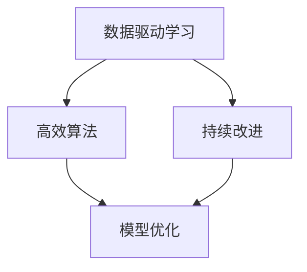

                 

# 快速学习:立于不败之地的根本

> 关键词：快速学习, 数据驱动, 高效算法, 持续改进, 人工智能, 深度学习

## 1. 背景介绍

### 1.1 问题由来
在现代信息时代，数据和计算能力已经成为推动科技发展的两大引擎。随着深度学习技术的崛起，人工智能(AI)领域不断涌现出一系列新算法、新工具和新应用，推动了数据驱动的快速学习范式的发展。在这一过程中，如何高效利用数据，如何设计高效算法，成为实现人工智能应用的核心问题。

### 1.2 问题核心关键点
本主题聚焦于如何在数据驱动的环境下，通过高效学习和持续改进，构建高效、可靠、可扩展的人工智能系统。我们认为，快速学习是实现这一目标的根本途径。

### 1.3 问题研究意义
快速学习技术的广泛应用，是提升人工智能系统性能、降低开发成本、加速技术迭代的重要方法。它不仅对提高人工智能算法的效率和效果具有重要意义，还能够帮助企业在激烈的市场竞争中保持领先地位。

## 2. 核心概念与联系

### 2.1 核心概念概述

快速学习（Rapid Learning）是一种在短时间内通过高效算法和数据驱动的方法，快速提升模型性能的技术。与传统的机器学习不同，快速学习强调对现有数据的深度利用和对已有模型的快速迭代改进，以快速响应环境变化和需求变化。

为更好地理解快速学习的核心思想和应用场景，本节将介绍几个密切相关的核心概念：

- 数据驱动学习（Data-driven Learning）：一种利用大数据进行模型训练和改进的方法。通过收集、清洗和标注数据，不断迭代模型，使其在特定任务上表现更佳。
- 高效算法（Efficient Algorithms）：快速学习中使用的各类算法，如随机梯度下降（SGD）、Adam、梯度提升（Boosting）等，这些算法在保证训练效果的同时，尽可能降低计算复杂度和时间成本。
- 持续改进（Continuous Improvement）：快速学习强调的是在已有模型基础上不断优化，以适应新的数据和任务需求。这通常通过增量式训练（Incremental Training）和在线学习（Online Learning）等方式实现。
- 模型优化（Model Optimization）：包括模型压缩、参数剪枝、模型融合等技术，以提升模型性能和计算效率。

这些概念之间的逻辑关系可以通过以下Mermaid流程图来展示：



这个流程图展示了我們讨论的核心概念之间的关系：

1. 数据驱动学习为高效算法提供了数据基础。
2. 高效算法提高了模型训练效率。
3. 持续改进不断优化已有模型。
4. 模型优化提升模型性能和效率。

这些概念共同构成了快速学习的学习框架，使得快速学习的理念在实际应用中得以体现。

## 3. 核心算法原理 & 具体操作步骤
### 3.1 算法原理概述

快速学习的基础是数据驱动和高效算法。它通过迭代训练和优化，使模型能够在极短时间内从原始数据中学习到关键特征，并实现性能提升。在快速学习的过程中，通常包括以下几个关键步骤：

1. **数据收集与清洗**：获取相关数据，并进行预处理，包括去噪、归一化、分词、标注等。
2. **模型初始化**：选择适合的模型架构和初始权重，并对其进行训练。
3. **迭代训练**：使用数据驱动的高效算法，不断更新模型参数，迭代优化模型。
4. **模型评估**：通过交叉验证、ROC曲线等方法，对模型进行性能评估。
5. **模型部署与应用**：将优化后的模型部署到实际应用中，进行预测和决策。

### 3.2 算法步骤详解

具体来说，以下是一个快速学习过程的详细步骤：

**Step 1: 数据收集与清洗**
- 收集与任务相关的数据集，确保数据的多样性和代表性。
- 对数据进行清洗，包括去除噪声、处理缺失值、数据归一化等。

**Step 2: 模型初始化**
- 选择合适的模型架构，如深度神经网络、支持向量机、决策树等。
- 对模型进行预训练或初始化，设定合适的超参数，如学习率、批大小、迭代次数等。

**Step 3: 迭代训练**
- 使用高效算法，如随机梯度下降（SGD）或Adam优化器，对模型进行迭代训练。
- 使用交叉验证技术，对模型进行验证，防止过拟合。
- 使用增量式训练或在线学习技术，不断更新模型，以适应新的数据和任务需求。

**Step 4: 模型评估**
- 对模型进行性能评估，使用各种指标如精确度、召回率、F1分数、ROC曲线等。
- 根据评估结果，调整模型参数和超参数，优化模型性能。

**Step 5: 模型部署与应用**
- 将优化后的模型部署到实际应用中，进行预测和决策。
- 定期更新数据，重新训练模型，以应对新的数据和任务需求。

### 3.3 算法优缺点

快速学习的优点包括：
1. 快速响应变化：快速学习能够快速适应数据和任务的变化，从而及时调整模型，提高性能。
2. 降低成本：快速学习在构建和优化模型时，无需大量标注数据和计算资源，降低了研发成本。
3. 提高效率：通过高效的算法和数据驱动的方法，快速学习可以显著提高模型训练效率。
4. 增强鲁棒性：快速学习通过对现有模型的不断迭代改进，增强了模型的鲁棒性和泛化能力。

同时，快速学习也存在一些局限性：
1. 数据质量要求高：快速学习对数据的准确性和多样性要求较高，否则容易出现过拟合或欠拟合问题。
2. 模型复杂性增加：快速学习通过不断的迭代优化，可能导致模型参数增加，模型复杂性提升。
3. 无法处理新任务：如果新任务与已有任务差异较大，快速学习的效果可能不佳。
4. 依赖于已有知识：快速学习需要依赖于已有的知识和方法，难以在完全未知的场景中进行学习。

尽管有这些局限性，但快速学习仍然是当前数据驱动的人工智能领域的重要方法，对于提升模型性能和适应新任务具有重要意义。

### 3.4 算法应用领域

快速学习已经在多个领域得到了广泛的应用，例如：

- 金融风控：通过快速学习，构建实时风险评估模型，有效识别和防范金融欺诈。
- 医疗诊断：利用快速学习，训练诊断模型，实时识别和预测疾病，提升诊断效率和准确性。
- 智能推荐：使用快速学习，构建个性化推荐模型，提升用户体验和转化率。
- 语音识别：通过快速学习，训练语音识别模型，实时识别和转录语音内容。
- 自然语言处理：利用快速学习，训练文本分类、情感分析、机器翻译等模型，提升自然语言处理能力。

除了上述这些经典应用外，快速学习还在更多场景中得到创新应用，如自动化驾驶、智能制造、智慧城市等，为各行各业带来了新的变革。

## 4. 数学模型和公式 & 详细讲解 & 举例说明

### 4.1 数学模型构建

快速学习的数学模型通常基于以下几个关键要素：

- 数据集 $D=\{(x_i, y_i)\}_{i=1}^N$，其中 $x_i$ 为输入， $y_i$ 为输出标签。
- 模型 $M_{\theta}$，其中 $\theta$ 为模型参数。
- 损失函数 $L(M_{\theta}, D)$，用于衡量模型预测输出与真实标签之间的差异。
- 优化算法 $O$，用于更新模型参数 $\theta$。

假设我们有一个简单的线性回归模型，其数学模型为：

$$
y_i = \theta_0 + \sum_{j=1}^{n} x_{ij}\theta_j
$$

其中 $\theta_0, \theta_j$ 为模型参数，$n$ 为输入特征维度。

### 4.2 公式推导过程

以线性回归模型为例，推导最小二乘法的损失函数和梯度更新公式：

**最小二乘法损失函数**

$$
L(\theta) = \frac{1}{2N} \sum_{i=1}^{N} (y_i - \hat{y}_i)^2
$$

其中 $\hat{y}_i$ 为模型预测输出。

**梯度更新公式**

根据链式法则，损失函数对模型参数 $\theta$ 的梯度为：

$$
\frac{\partial L(\theta)}{\partial \theta} = \frac{1}{N} \sum_{i=1}^{N} (y_i - \hat{y}_i)x_i
$$

将梯度代入梯度下降算法：

$$
\theta \leftarrow \theta - \eta \frac{1}{N} \sum_{i=1}^{N} (y_i - \hat{y}_i)x_i
$$

其中 $\eta$ 为学习率。

### 4.3 案例分析与讲解

**案例分析：股票价格预测**

假设我们有一个包含历史股票价格数据的集合，需要预测未来股票价格走势。我们使用快速学习中的线性回归模型进行训练和预测。

**数据准备**

- 收集历史股票价格数据，包括开盘价、收盘价、成交量等。
- 对数据进行清洗和预处理，包括去除异常值、归一化等。

**模型训练**

- 初始化模型参数 $\theta$。
- 使用随机梯度下降（SGD）算法，对模型进行迭代训练。
- 在训练过程中，使用交叉验证技术，评估模型性能。
- 根据评估结果，调整学习率和模型参数。

**模型评估**

- 使用ROC曲线、MAE（均方误差）等指标，评估模型预测效果。
- 根据评估结果，进一步优化模型参数和超参数。

**模型部署**

- 将优化后的模型部署到实际应用中，进行股票价格预测。
- 定期更新数据，重新训练模型，以应对新的数据和任务需求。

## 5. 项目实践：代码实例和详细解释说明

### 5.1 开发环境搭建

在进行快速学习实践前，我们需要准备好开发环境。以下是使用Python进行TensorFlow开发的环境配置流程：

1. 安装Anaconda：从官网下载并安装Anaconda，用于创建独立的Python环境。

2. 创建并激活虚拟环境：
```bash
conda create -n tf-env python=3.8 
conda activate tf-env
```

3. 安装TensorFlow：根据CUDA版本，从官网获取对应的安装命令。例如：
```bash
pip install tensorflow
```

4. 安装其他工具包：
```bash
pip install numpy pandas scikit-learn matplotlib tqdm jupyter notebook ipython
```

完成上述步骤后，即可在`tf-env`环境中开始快速学习实践。

### 5.2 源代码详细实现

以下是一个使用TensorFlow进行线性回归模型训练的代码实现：

```python
import tensorflow as tf
import numpy as np
from sklearn.datasets import load_boston
from sklearn.model_selection import train_test_split
from sklearn.preprocessing import StandardScaler
from sklearn.metrics import mean_squared_error

# 加载数据
boston = load_boston()
X, y = boston.data, boston.target

# 数据预处理
scaler = StandardScaler()
X = scaler.fit_transform(X)

# 划分数据集
X_train, X_test, y_train, y_test = train_test_split(X, y, test_size=0.2, random_state=42)

# 模型初始化
model = tf.keras.Sequential([
    tf.keras.layers.Dense(1, input_shape=(X.shape[1],))
])

# 设置损失函数和优化器
model.compile(optimizer=tf.keras.optimizers.Adam(learning_rate=0.001),
              loss='mean_squared_error')

# 训练模型
model.fit(X_train, y_train, epochs=100, batch_size=32, validation_data=(X_test, y_test))

# 评估模型
y_pred = model.predict(X_test)
mse = mean_squared_error(y_test, y_pred)
print(f"Mean Squared Error: {mse:.2f}")
```

### 5.3 代码解读与分析

让我们再详细解读一下关键代码的实现细节：

**数据加载与预处理**

- `load_boston`：从scikit-learn库中加载波士顿房价数据集。
- `StandardScaler`：对数据进行标准化处理，使得不同特征具有相同的尺度。

**模型初始化**

- `Sequential`：定义一个序列模型，包含一个全连接层。
- `Dense`：定义一个全连接层，输出维度为1，输入维度为数据集的特征数。

**模型编译**

- `compile`：设置优化器为Adam，学习率为0.001，损失函数为均方误差。

**模型训练**

- `fit`：对模型进行迭代训练，指定训练数据集、批次大小、迭代次数等参数。

**模型评估**

- `predict`：使用模型对测试集进行预测。
- `mean_squared_error`：计算预测值与真实值之间的均方误差。

可以看到，TensorFlow提供的API使得模型训练和评估变得简单高效。开发者可以将更多精力放在模型架构的设计和超参数的调优上，而不必过多关注底层的实现细节。

当然，工业级的系统实现还需考虑更多因素，如模型的保存和部署、超参数的自动搜索、更灵活的模型架构等。但核心的快速学习过程基本与此类似。

## 6. 实际应用场景

### 6.1 智能推荐系统

快速学习在智能推荐系统中的应用尤为广泛。推荐系统需要实时处理大量的用户行为数据，并快速响应变化，从而提升推荐效果。通过快速学习，推荐系统可以实时更新模型，及时调整推荐策略，提高推荐准确率和用户体验。

在技术实现上，可以收集用户浏览、点击、购买等行为数据，构建基于用户历史行为的推荐模型。通过快速学习，训练模型快速响应用户行为的变化，及时更新推荐结果。

### 6.2 金融风控系统

金融行业对风险的敏感性极高，需要实时监控市场动向，快速识别和防范欺诈行为。快速学习技术可以构建实时风险评估模型，快速处理海量数据，实现实时监控和风险预警。

在实现上，可以收集用户交易数据，包括交易金额、时间、地点等信息。通过快速学习，训练模型实时分析交易行为，识别异常交易，及时发出预警。

### 6.3 医疗影像诊断

医疗影像诊断需要快速处理海量图像数据，并实时输出诊断结果。快速学习技术可以构建实时图像诊断模型，快速识别和预测疾病，提高诊断效率和准确性。

在实现上，可以收集患者的影像数据，包括CT、MRI等。通过快速学习，训练模型实时分析影像，快速输出诊断结果，帮助医生及时发现疾病。

### 6.4 未来应用展望

随着快速学习技术的不断发展，其应用领域将会更加广泛，对各行各业带来深远的影响。

- 自动驾驶：通过快速学习，训练自动驾驶模型，实时处理传感器数据，快速做出决策，提高驾驶安全性和效率。
- 智慧城市：利用快速学习，构建智能交通、智能安防等系统，实时响应城市事件，提高城市管理效率。
- 智能制造：通过快速学习，构建质量检测、设备预测等模型，实时优化生产流程，提高生产效率和质量。

未来，随着技术的进步和数据的积累，快速学习必将在更多领域得到应用，为各行各业带来新的变革。

## 7. 工具和资源推荐

### 7.1 学习资源推荐

为了帮助开发者系统掌握快速学习技术的理论基础和实践技巧，这里推荐一些优质的学习资源：

1. 《深度学习》课程：斯坦福大学李飞飞教授的深度学习课程，详细讲解了深度学习的基本概念和算法。
2. TensorFlow官方文档：TensorFlow的官方文档，提供了详细的API和案例，方便快速学习模型的开发和部署。
3. PyTorch官方文档：PyTorch的官方文档，提供了丰富的模型和算法库，支持快速学习模型的构建和优化。
4. Kaggle竞赛：Kaggle平台上的数据竞赛，提供了大量的真实场景数据和算法实现，是实践快速学习的最佳场所。

通过对这些资源的学习实践，相信你一定能够快速掌握快速学习的精髓，并用于解决实际的NLP问题。

### 7.2 开发工具推荐

高效的开发离不开优秀的工具支持。以下是几款用于快速学习开发的常用工具：

1. TensorFlow：由Google主导开发的开源深度学习框架，生产部署方便，适合大规模工程应用。
2. PyTorch：基于Python的开源深度学习框架，灵活高效，支持动态计算图，适合研究性应用。
3. Jupyter Notebook：Python数据分析的强大工具，支持代码块和数学公式的混合编写，方便快速迭代。
4. GitHub：代码托管和协作平台，方便分享和讨论代码，加速开发进程。

合理利用这些工具，可以显著提升快速学习的开发效率，加快创新迭代的步伐。

### 7.3 相关论文推荐

快速学习技术的发展源于学界的持续研究。以下是几篇奠基性的相关论文，推荐阅读：

1. "Adaptive Moment Estimation"：提出了Adam优化算法，在深度学习领域广泛应用。
2. "Deep Residual Learning for Image Recognition"：提出了残差网络（ResNet），推动了深度学习的快速发展。
3. "Batch Normalization: Accelerating Deep Network Training by Reducing Internal Covariate Shift"：提出了批归一化（Batch Normalization），提高了深度学习的训练速度和稳定性。
4. "Training Neural Networks"：提出了神经网络训练的梯度下降算法，奠定了深度学习的基础。

这些论文代表了大模型微调技术的发展脉络。通过学习这些前沿成果，可以帮助研究者把握学科前进方向，激发更多的创新灵感。

## 8. 总结：未来发展趋势与挑战

### 8.1 总结

本文对快速学习的核心概念和技术进行了系统介绍。首先阐述了快速学习的背景和意义，明确了快速学习在提升人工智能系统性能、降低开发成本、加速技术迭代方面的独特价值。其次，从原理到实践，详细讲解了快速学习数学模型和算法步骤，给出了快速学习任务开发的完整代码实例。同时，本文还探讨了快速学习在智能推荐、金融风控、医疗影像等多个行业领域的应用前景，展示了快速学习的巨大潜力。最后，本文精选了快速学习的各类学习资源，力求为读者提供全方位的技术指引。

通过本文的系统梳理，可以看到，快速学习技术的广泛应用，是提升人工智能系统性能、降低开发成本、加速技术迭代的重要方法。它不仅对提高人工智能算法的效率和效果具有重要意义，还能够帮助企业在激烈的市场竞争中保持领先地位。

### 8.2 未来发展趋势

展望未来，快速学习技术将呈现以下几个发展趋势：

1. 数据驱动的持续改进：随着数据规模的不断增大，快速学习将在数据驱动的框架下持续优化模型，提升模型的泛化能力和鲁棒性。
2. 高效的算法和工具：更多高效算法和工具的开发，将进一步提升快速学习的速度和效果，降低研发成本。
3. 跨领域的融合应用：快速学习将与其他人工智能技术进行更深入的融合，如知识图谱、因果推理、强化学习等，推动跨领域的智能化发展。
4. 实时性和可扩展性：快速学习技术将更注重实时性和可扩展性，以应对大规模数据的处理需求，提升系统的响应速度和计算效率。

以上趋势凸显了快速学习的广阔前景。这些方向的探索发展，必将进一步提升人工智能系统的性能和应用范围，为人类认知智能的进化带来深远影响。

### 8.3 面临的挑战

尽管快速学习技术已经取得了瞩目成就，但在迈向更加智能化、普适化应用的过程中，它仍面临着诸多挑战：

1. 数据质量和多样性：快速学习对数据的准确性和多样性要求较高，否则容易出现过拟合或欠拟合问题。如何有效获取和清洗数据，提升数据质量，是一个重要的挑战。
2. 计算资源需求：快速学习模型往往需要大量的计算资源，如何高效利用算力，优化模型结构，是一个迫切需要解决的问题。
3. 模型可解释性：快速学习模型通常被视为"黑盒"系统，难以解释其内部工作机制和决策逻辑。如何在保证模型性能的同时，增强模型的可解释性，也是一个重要的研究方向。
4. 安全和隐私保护：快速学习模型在处理敏感数据时，如何保障数据安全和隐私，避免数据泄露和滥用，是一个重要的问题。

### 8.4 研究展望

面对快速学习面临的这些挑战，未来的研究需要在以下几个方面寻求新的突破：

1. 高效的数据预处理和清洗技术：开发更多高效的数据预处理和清洗算法，提升数据质量，降低过拟合和欠拟合风险。
2. 轻量级和可扩展的模型架构：开发更多轻量级和可扩展的模型架构，提高计算效率，降低计算资源需求。
3. 增强模型的可解释性和透明度：引入更多可解释性和透明度的技术，如可视化、因果分析等，增强模型的可解释性，提高用户信任度。
4. 数据安全和隐私保护技术：开发更多数据安全和隐私保护技术，如差分隐私、联邦学习等，确保数据安全和隐私保护。

这些研究方向将进一步推动快速学习技术的发展，使其在更多领域得到广泛应用，为人类认知智能的进化带来深远影响。

## 9. 附录：常见问题与解答

**Q1: 快速学习如何处理大规模数据？**

A: 快速学习在处理大规模数据时，可以采用增量式训练和在线学习等技术，分批处理数据，避免一次性加载全部数据带来的内存和计算压力。同时，可以使用数据压缩和分布式训练等技术，提高计算效率和系统可扩展性。

**Q2: 快速学习在实际应用中需要注意哪些问题？**

A: 在实际应用中，快速学习需要注意以下问题：

1. 模型裁剪：去除不必要的层和参数，减小模型尺寸，加快推理速度。
2. 量化加速：将浮点模型转为定点模型，压缩存储空间，提高计算效率。
3. 服务化封装：将模型封装为标准化服务接口，便于集成调用。
4. 监控告警：实时采集系统指标，设置异常告警阈值，确保服务稳定性。
5. 安全防护：采用访问鉴权、数据脱敏等措施，保障数据和模型安全。

这些问题是快速学习从研发到部署的各个环节需要重点关注的问题。只有从数据、算法、工程、业务等多个维度协同发力，才能真正实现快速学习的价值。

---

作者：禅与计算机程序设计艺术 / Zen and the Art of Computer Programming

