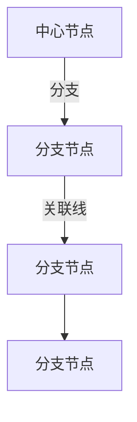
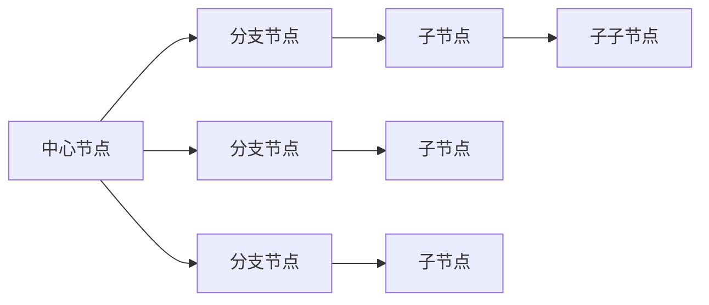
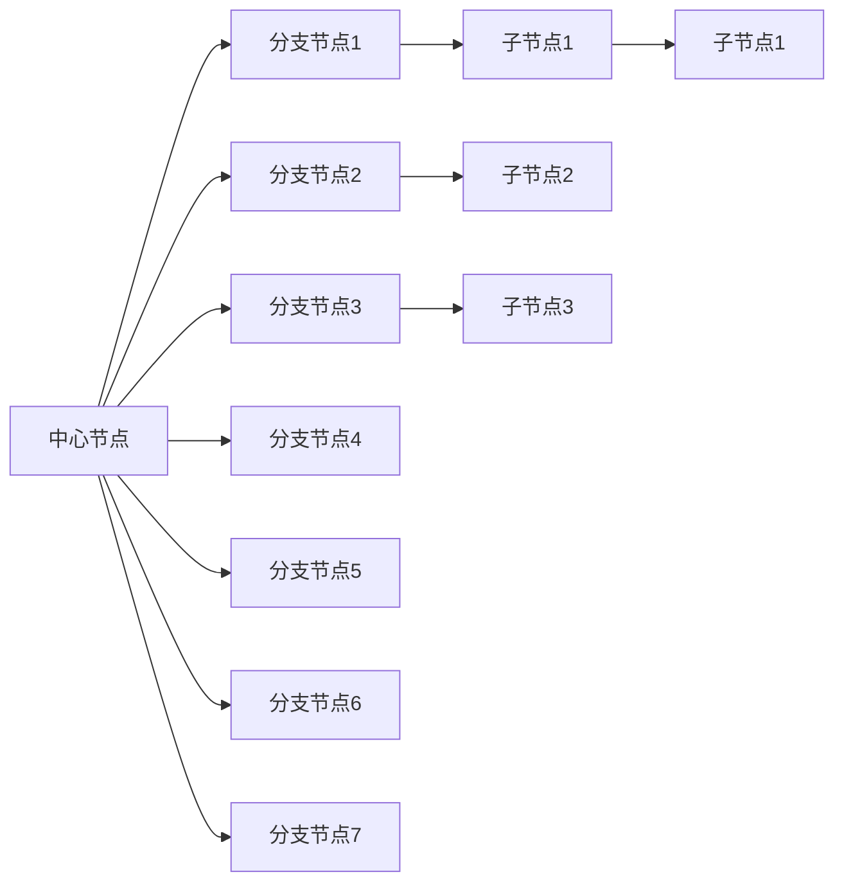

                 

# 思维导图：可视化知识组织工具

> 关键词：思维导图, 可视化, 知识组织, 认知工具, 逻辑结构, 信息管理, 创新思维, 学习和工作流程优化

## 1. 背景介绍

### 1.1 问题由来
随着信息时代的到来，人类日常工作和学习中产生了海量的数据和信息，传统的线性文本信息组织方式已无法满足复杂多变的知识管理需求。如何高效地组织和利用这些信息，成为众多领域的普遍挑战。思维导图示例：

```mermaid
graph TD
    "信息源" --> "整理和分类" --> "思维导图"
```

为了解决这一问题，思维导图（Mind Map）应运而生。作为一种图形化信息管理工具，思维导图能够以层次化的结构展现知识，通过视觉化表达逻辑关系，帮助人们更好地组织、理解和应用信息。

### 1.2 问题核心关键点
思维导图的核心优势在于其独特的图形化表示和层级结构，使得信息组织和提取更加直观、高效。其关键点在于：
1. 通过视觉化展现知识结构，便于快速理解复杂信息。
2. 支持多级分类和关联，便于知识扩展和深度挖掘。
3. 利用颜色、图标等视觉元素，增强信息展示的吸引力。
4. 支持灵活的编辑和调整，适应不断变化的信息内容。
5. 广泛用于教育和培训、项目管理、研究写作等多个领域。

这些关键点共同构成了思维导图的核心功能，使其在信息管理中具有无可比拟的优势。

## 2. 核心概念与联系

### 2.1 核心概念概述

思维导图是一种图形化的信息组织工具，旨在通过视觉化表达逻辑关系，帮助人们更好地理解和应用信息。其主要组成元素包括：
1. **中心节点**：代表主题或核心概念，位于思维导图中心。
2. **分支节点**：从中心节点延伸出去的子节点，表示主题的子概念或相关信息。
3. **关联线**：连接中心节点和分支节点的线条，表示两者之间的关系。
4. **颜色和图标**：用于区分不同类型或重要性的节点，增强信息展示的直观性。

思维导图通过层级结构，将复杂的信息组织成易于理解和处理的图形化形式，帮助用户快速获取关键信息，发现知识之间的内在联系，激发创新思维。

### 2.2 核心概念原理和架构的 Mermaid 流程图



这个流程图展示了思维导图的基本结构，其中：
- 中心节点A代表主要概念。
- 分支节点B、C、D分别从中心节点A延伸出来，表示不同的子概念或相关信息。
- 关联线表示节点之间的连接关系。

### 2.3 核心算法原理 & 具体操作步骤

思维导图并不涉及复杂的算法，其原理和操作步骤相对简单，主要基于以下几个步骤：

1. **定义主题**：选择一个中心节点，作为思维导图的主题或核心概念。
2. **添加分支节点**：根据中心节点，添加多个分支节点，表示相关的子概念或信息。
3. **绘制关联线**：在分支节点之间绘制线条，表示它们之间的关联和逻辑关系。
4. **优化结构**：根据信息的重要性和相关性，调整节点的位置和大小，优化思维导图结构。
5. **视觉设计**：使用颜色、图标等视觉元素，增强信息展示的吸引力和可读性。

### 2.4 核心算法优缺点

思维导图的主要优点在于其直观和高效的信息组织方式，能够快速帮助用户理解和提取关键信息，激发创新思维。其缺点在于：
1. **缺乏结构性**：思维导图过于自由，可能导致信息过于松散，难以形成系统性的知识体系。
2. **易受主观影响**：思维导图的层级结构依赖于设计者的个人理解，可能导致信息展示的不一致性。
3. **操作复杂度**：对于复杂的信息体系，需要较高的设计能力和操作技能，非专业人员难以掌握。

### 2.5 核心算法应用领域

思维导图作为一种通用的信息组织工具，广泛应用于教育、研究、项目管理、知识管理等多个领域。

- **教育领域**：帮助学生整理和理解课程内容，激发创新思维和自主学习能力。
- **研究写作**：用于文献综述、项目规划、论文撰写等，帮助研究者系统化地组织和分析信息。
- **项目管理**：作为项目计划和任务分配的工具，帮助团队清晰地理解项目结构和进度。
- **知识管理**：用于企业内部知识库构建，促进团队协作和知识共享。
- **个人学习**：作为个人学习和自我提升的工具，帮助用户系统化地管理知识和技能。

## 4. 数学模型和公式 & 详细讲解 & 举例说明

### 4.1 数学模型构建

思维导图的构建过程本质上是一个信息组织和结构化的过程。可以将其抽象为图论模型，其中节点表示信息单元，边表示节点之间的关系。

### 4.2 公式推导过程

对于任意的思维导图，可以定义一个有向图 $G=(V,E)$，其中 $V$ 为节点集合，$E$ 为边集合。设 $n$ 为节点数，$m$ 为边数，则思维导图的构建过程可以表示为：

$$
G = \left\{\begin{aligned}
& A_0 = (0,0) \\
& A_i = (x_i, y_i), 1 \leq i \leq n \\
& E = \{(A_i, A_j)|(i,j) \in \{1,2,\ldots,n\}^2, i \neq j\}
\end{aligned}\right.
$$

其中 $A_0$ 为起点节点，$A_i$ 为其他节点，$E$ 为连接节点的边。

### 4.3 案例分析与讲解

以一个简单的思维导图为例，展示其构建过程：



在这个例子中，中心节点 $A$ 表示“人工智能”，分支节点 $B$ 和 $E$ 分别表示“机器学习”和“深度学习”，子节点 $C$ 和 $F$ 表示更具体的概念，如“算法”和“模型”。通过这种方式，思维导图能够直观地展示信息之间的层级结构和逻辑关系。

## 5. 项目实践：代码实例和详细解释说明

### 5.1 开发环境搭建

为了进行思维导图的开发和实现，首先需要搭建一个基本的开发环境。以下是使用 Python 和 NetworkX 库进行思维导图开发的流程：

1. 安装 Python 和 NetworkX：
```bash
pip install python
pip install networkx
```

2. 创建一个 Python 文件，用于编写思维导图代码：
```python
from networkx import DiGraph, nx, draw

# 创建一个有向图
graph = DiGraph()

# 添加节点和边
graph.add_node(0, label="中心节点")
graph.add_node(1, label="分支节点1")
graph.add_node(2, label="分支节点2")
graph.add_edge(0, 1)
graph.add_edge(0, 2)

# 绘制思维导图
pos = nx.spring_layout(graph)
nx.draw(graph, pos, with_labels=True, font_size=10)
```

通过上述代码，可以创建一个基本的思维导图，展示中心节点和两个分支节点之间的关联。

### 5.2 源代码详细实现

接下来，我们进一步完善代码，增加更多节点和关联，展示更复杂的信息体系：

```python
from networkx import DiGraph, nx, draw

# 创建一个有向图
graph = DiGraph()

# 添加节点和边
graph.add_node(0, label="中心节点")
graph.add_node(1, label="分支节点1")
graph.add_node(2, label="分支节点2")
graph.add_node(3, label="分支节点3")
graph.add_node(4, label="分支节点4")
graph.add_node(5, label="分支节点5")
graph.add_edge(0, 1)
graph.add_edge(0, 2)
graph.add_edge(1, 3)
graph.add_edge(1, 4)
graph.add_edge(2, 5)

# 绘制思维导图
pos = nx.spring_layout(graph)
nx.draw(graph, pos, with_labels=True, font_size=10)

# 添加颜色和图标
for node in graph.nodes():
    if node == 0:
        nx.draw_networkx_labels(graph, pos, labels={node: "中心节点"})
        nx.draw_networkx_node_labels(graph, pos, labels={node: "中心节点"})
    else:
        nx.draw_networkx_labels(graph, pos, labels={node: str(node)})

# 显示思维导图
plt.show()
```

这段代码在基本思维导图的基础上，添加了更多的节点和边，并通过颜色和图标区分节点类型，增强信息的展示效果。

### 5.3 代码解读与分析

在这个代码示例中，我们使用了 NetworkX 库来创建和绘制思维导图。具体步骤包括：

1. **创建有向图**：通过 `DiGraph()` 创建有向图对象。
2. **添加节点和边**：使用 `add_node()` 和 `add_edge()` 方法添加节点和边。
3. **布局优化**：使用 `spring_layout()` 方法对节点进行布局，使得思维导图更美观。
4. **绘制和显示**：使用 `draw()` 方法绘制思维导图，并通过 `plt.show()` 显示结果。

通过这些步骤，可以高效地创建和展示思维导图，方便用户理解和应用信息。

### 5.4 运行结果展示

运行上述代码，可以得到一个基本的思维导图，展示信息之间的层次结构和关联关系。通过颜色和图标的装饰，信息展示更加直观和吸引人。



## 6. 实际应用场景

### 6.1 教育领域

在教育领域，思维导图可以帮助学生更好地理解和掌握课程内容，激发创新思维和自主学习能力。例如，在数学学习中，学生可以通过思维导图构建知识框架，理清概念之间的关系，提高学习效率。

**教育应用示例**：

```mermaid
graph LR
    "中心节点" --> "数学概念" --> "代数" --> "线性代数"
    "中心节点" --> "几何" --> "平面几何" --> "立体几何"
    "中心节点" --> "统计" --> "概率统计" --> "数理统计"
```

### 6.2 研究写作

在研究写作中，思维导图用于文献综述、项目规划、论文撰写等，帮助研究者系统化地组织和分析信息。例如，在进行文献综述时，研究者可以构建思维导图，展示各个研究领域的关键概念和关系，清晰地呈现研究进展和方向。

**研究写作应用示例**：

```mermaid
graph LR
    "中心节点" --> "研究领域1" --> "研究方向1" --> "子研究方向1"
    "中心节点" --> "研究方向2" --> "子研究方向2"
    "中心节点" --> "研究方向3" --> "子研究方向3"
    "中心节点" --> "研究方向4" --> "子研究方向4"
    "中心节点" --> "研究方向5" --> "子研究方向5"
```

### 6.3 项目管理

在项目管理中，思维导图作为项目计划和任务分配的工具，帮助团队清晰地理解项目结构和进度。例如，项目管理团队可以通过思维导图展示项目的主要任务和子任务，明确责任分配和完成时间。

**项目管理应用示例**：

```mermaid
graph LR
    "中心节点" --> "项目1" --> "子任务1" --> "子任务1.1"
    "中心节点" --> "子任务1.2"
    "中心节点" --> "项目2" --> "子任务2" --> "子任务2.1"
    "中心节点" --> "子任务2.2"
    "中心节点" --> "项目3" --> "子任务3" --> "子任务3.1"
    "中心节点" --> "子任务3.2"
```

### 6.4 未来应用展望

随着技术的不断进步，思维导图的应用场景将进一步扩展，其功能也将更加丰富和强大。未来的发展趋势包括：

1. **智能化设计**：利用人工智能技术，自动生成和优化思维导图结构，提高设计效率和信息展示质量。
2. **云端协作**：支持多人在线协作编辑思维导图，实现实时共享和讨论。
3. **多模态融合**：与语音、视频等多模态信息结合，增强信息展示的丰富性和互动性。
4. **数据驱动**：通过数据分析和挖掘，自动优化思维导图的设计和内容，提高信息管理的效果。
5. **应用场景扩展**：在医疗、金融、法律等多个领域得到广泛应用，成为行业知识管理的重要工具。

## 7. 工具和资源推荐

### 7.1 学习资源推荐

1. **《思维导图》一书**：详细介绍了思维导图的基本概念、原理和应用方法，适合初学者入门。
2. **MindMeister**：在线思维导图制作工具，提供丰富的模板和协作功能，适合个人和团队使用。
3. **XMind**：桌面思维导图软件，功能强大，支持多种导出格式，适合专业用户使用。
4. **MindManager**：专业的项目管理工具，支持思维导图和任务管理结合，适合商业应用。
5. **Coggle**：在线思维导图工具，界面简洁，适合快速制作和共享思维导图。

### 7.2 开发工具推荐

1. **Python NetworkX库**：用于创建和操作图形，支持多种布局算法和数据可视化，适合进行复杂思维导图的开发。
2. **JavaScript D3.js库**：用于创建动态和交互式的数据可视化，适合制作动态思维导图。
3. **Web-based Mind Mapping Tools**：如Coggle、Miro等，支持实时协作和云端存储，适合团队协作使用。
4. **Office 365 / Google Workspace**：支持在Word、PowerPoint、Google Docs等办公软件中嵌入思维导图，方便日常使用。

### 7.3 相关论文推荐

1. **A Review of Mind Mapping Techniques in Educational Settings**：总结了思维导图在教育中的应用和效果，提供了丰富的案例和实践建议。
2. **The Use of Mind Mapping in Research Writing**：探讨了思维导图在研究写作中的作用，展示了其对文献综述和项目规划的帮助。
3. **Mind Mapping as a Project Management Tool**：分析了思维导图在项目管理中的应用，提供了实际案例和优化建议。
4. **A Comparative Study of Mind Mapping Tools**：比较了不同类型的思维导图工具，帮助用户选择合适的应用工具。

## 8. 总结：未来发展趋势与挑战

### 8.1 研究成果总结

思维导图作为一种强大的信息组织工具，已经广泛应用于教育、研究、项目管理等多个领域。其直观、高效的信息展示方式，使其成为信息管理和知识发现的利器。

### 8.2 未来发展趋势

1. **智能化设计**：未来的思维导图将利用人工智能技术，自动生成和优化思维导图结构，提高设计效率和信息展示质量。
2. **云端协作**：支持多人在线协作编辑思维导图，实现实时共享和讨论。
3. **多模态融合**：与语音、视频等多模态信息结合，增强信息展示的丰富性和互动性。
4. **数据驱动**：通过数据分析和挖掘，自动优化思维导图的设计和内容，提高信息管理的效果。
5. **应用场景扩展**：在医疗、金融、法律等多个领域得到广泛应用，成为行业知识管理的重要工具。

### 8.3 面临的挑战

1. **设计复杂度**：思维导图的设计需要较高的专业能力和时间投入，非专业人员难以掌握。
2. **信息结构化难度**：复杂的信息体系需要精细的结构化设计，才能真正发挥思维导图的作用。
3. **协作和共享问题**：多人协作编辑思维导图时，可能会遇到版本冲突和信息同步问题。

### 8.4 研究展望

未来的思维导图研究需要从以下几个方向进行突破：

1. **自动化设计工具**：开发智能化的思维导图设计工具，帮助用户快速生成和优化思维导图。
2. **多模态融合技术**：研究如何将语音、视频等多模态信息与思维导图结合，增强信息展示的丰富性和互动性。
3. **知识图谱结合**：探索如何将思维导图与知识图谱结合，构建更加系统化和结构化的知识体系。
4. **社交和协作功能**：增强思维导图的社会化和协作功能，支持多人在线协作和共享，提升其应用价值。
5. **跨平台和跨设备支持**：实现思维导图在各种设备和平台上的无缝使用，提高用户的使用体验。

这些研究方向的探索，必将引领思维导图技术迈向更高的台阶，为人类认知智能的进化带来深远影响。

## 9. 附录：常见问题与解答

**Q1: 如何构建一个完整的思维导图？**

A: 构建一个完整的思维导图，需要以下步骤：
1. 确定中心节点，代表主要概念或主题。
2. 根据中心节点，添加多个分支节点，表示相关的子概念或信息。
3. 在分支节点之间绘制线条，表示它们之间的关联和逻辑关系。
4. 使用颜色和图标区分节点类型和重要性，增强信息展示的直观性。

**Q2: 思维导图与流程图有什么区别？**

A: 思维导图和流程图都是图形化信息组织工具，但主要区别在于：
1. 思维导图强调信息的层次结构，通过层级展示信息之间的关系。
2. 流程图强调流程的逻辑关系，通过箭头表示流程的先后顺序和控制流。
3. 思维导图更适用于知识管理、学习、创意发散等场景，而流程图更适用于流程分析和自动化过程设计。

**Q3: 如何使用思维导图进行知识管理？**

A: 使用思维导图进行知识管理，可以按照以下步骤：
1. 确定中心节点，代表主要知识领域或主题。
2. 添加多个分支节点，表示相关的子主题或知识点。
3. 在分支节点之间绘制线条，表示它们之间的关联和逻辑关系。
4. 使用颜色和图标区分节点类型和重要性，增强信息展示的直观性。
5. 定期更新和维护思维导图，保持知识体系的完整性和准确性。

**Q4: 如何利用思维导图进行团队协作？**

A: 利用思维导图进行团队协作，可以按照以下步骤：
1. 创建共享思维导图，支持多人在线协作编辑。
2. 使用任务列表和标签等功能，分配和管理团队任务。
3. 定期同步和审查思维导图，确保信息的一致性和准确性。
4. 使用评论和讨论功能，增强团队协作和信息交流。

这些问题的解答，展示了思维导图在实际应用中的广泛价值和使用方法，希望读者能够在实际工作和学习中充分发挥其作用。

---

作者：禅与计算机程序设计艺术 / Zen and the Art of Computer Programming

