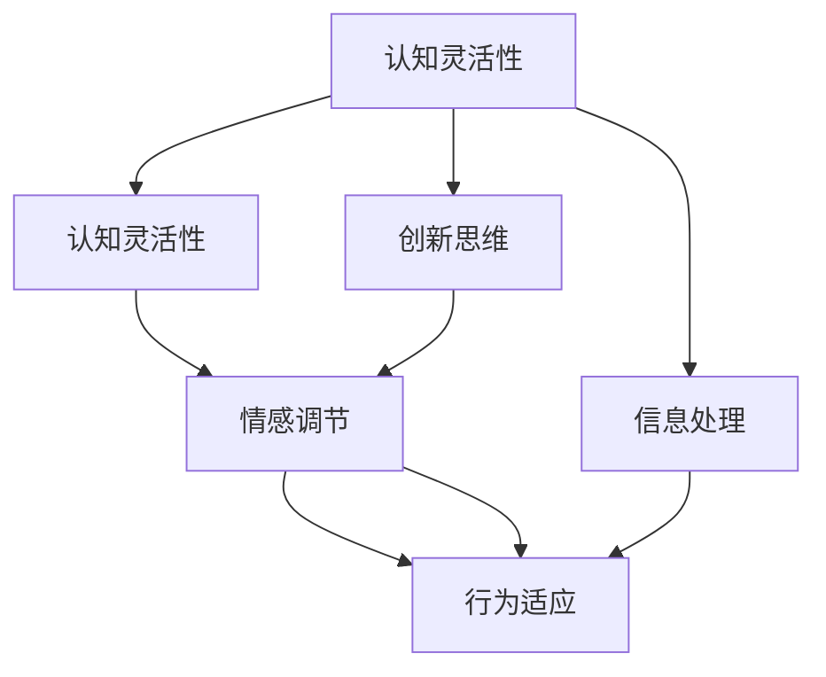

                 

# 思维敏捷性：快速适应变化的能力

> 关键词：思维敏捷性, 快速适应, 认知能力, 知识管理, 算法优化

## 1. 背景介绍

### 1.1 问题由来
在当今这个快速变化的时代，无论是在技术领域还是商业领域，都能深刻感受到敏捷性的重要性。一个组织的敏捷性不仅影响其对市场趋势的响应速度，还直接关系到其长期生存和成功。特别是在复杂、多变的商业环境中，如何构建一支思维敏捷的团队，培养个体快速适应变化的能力，成为了现代企业和组织发展的关键。

### 1.2 问题核心关键点
思维敏捷性是指个体或团队在面对环境变化时，能够迅速识别并响应变化，及时调整策略和行动的能力。它涵盖多个方面，包括但不限于：

- **快速学习**：对新知识的快速理解和应用。
- **创新思维**：提出新的解决方案或改进现有方法的创造性思考。
- **适应变化**：在复杂、不确定的环境中，调整心态和行为以适应新情况。
- **问题解决**：利用批判性思维和逻辑推理，高效解决问题。

### 1.3 问题研究意义
研究思维敏捷性对于个人成长、组织发展和企业竞争都有着深远的意义：

1. **提升个体竞争力**：在知识经济时代，思维敏捷的个体往往能更快适应新环境，把握新机遇，实现职业晋升。
2. **增强组织反应速度**：敏捷性强的团队能够快速响应市场变化，快速迭代产品或服务，提高企业的市场竞争力。
3. **优化决策效率**：思维敏捷性有助于快速收集信息、分析问题和制定决策，提升企业决策效率。
4. **促进创新**：敏捷性强的团队更可能提出和尝试新的想法，推动技术进步和业务创新。
5. **应对不确定性**：在高度不确定的商业环境中，敏捷性强的企业能更好地应对外部变化，减少不确定性对企业的影响。

## 2. 核心概念与联系

### 2.1 核心概念概述

思维敏捷性是一个多维度的能力体系，涉及个体和团队在认知、情感和行为等多个层面的综合表现。理解思维敏捷性的核心概念及其相互联系，有助于构建有效的思维敏捷性提升策略。

- **认知灵活性**：指个体在认知过程中表现出足够的灵活性，能够迅速切换不同认知框架，处理复杂信息。
- **情感调节**：指个体在面对变化时，能够有效地调节自己的情绪，保持积极、开放的态度。
- **行为适应**：指个体在行动上能迅速调整策略，适应新环境和新要求。
- **创新思维**：指个体在面对挑战时，能创造性地提出新的解决方案或改进现有方法。
- **信息处理**：指个体在信息收集、分析和应用方面的高效性。

这些概念之间存在相互作用和影响，共同构成了思维敏捷性的整体框架。

### 2.2 核心概念原理和架构的 Mermaid 流程图



上述流程图展示了思维敏捷性的核心概念及其相互作用。认知灵活性为情感调节和行为适应提供基础，创新思维和信息处理则是认知灵活性的重要组成部分，而情感调节和行为适应则是创新思维和信息处理的支撑。

## 3. 核心算法原理 & 具体操作步骤

### 3.1 算法原理概述

思维敏捷性提升的算法原理主要围绕认知灵活性、情感调节和行为适应三个核心环节进行设计。其核心思想是通过一系列训练和优化，提升个体的认知处理能力、情绪调节能力和行为适应能力，从而实现思维敏捷性的整体提升。

### 3.2 算法步骤详解

以下是一个简化的思维敏捷性提升算法步骤：

**Step 1: 评估现状**
- 使用问卷调查或心理评估工具，评估个体的认知灵活性、情感调节和行为适应水平。

**Step 2: 制定目标**
- 根据评估结果，制定具体的思维敏捷性提升目标，如提升创新思维、优化信息处理、加强情感调节等。

**Step 3: 设计训练方案**
- 根据目标，设计针对性的训练方案。训练方案应包括认知训练、情感训练和行为训练三个方面。

**Step 4: 执行训练**
- 按照训练方案，进行有针对性的认知训练、情感训练和行为训练。训练过程可以包括实际工作中的应用，以增强学习效果。

**Step 5: 评估效果**
- 定期评估训练效果，确保目标达成。使用问卷调查、任务表现等手段，评估个体的认知灵活性、情感调节和行为适应水平的变化。

**Step 6: 持续改进**
- 根据评估结果，调整训练方案，继续进行思维敏捷性提升。

### 3.3 算法优缺点

思维敏捷性提升算法具有以下优点：
1. **全面性**：涵盖了认知、情感和行为三个核心维度，系统地提升思维敏捷性。
2. **针对性**：根据个体的具体需求，设计个性化的训练方案。
3. **可操作性**：通过实际工作中的应用，增强训练效果。

同时，该算法也存在一些局限性：
1. **时间成本高**：全面的训练需要较长时间，可能影响日常工作和学习。
2. **个体差异**：不同个体的需求和反应不同，可能需要不同程度的训练。
3. **评估难度**：思维敏捷性的评估标准较难量化，需要综合多种评估手段。

### 3.4 算法应用领域

思维敏捷性提升算法不仅适用于个人能力提升，还广泛应用于组织管理和企业发展中。例如：

- **企业培训**：在员工入职、晋升等关键节点，通过思维敏捷性培训提升员工整体能力。
- **团队建设**：通过思维敏捷性培训，增强团队在面对复杂环境时的应变能力。
- **创新驱动**：在企业创新过程中，思维敏捷性培训有助于员工提出更多创新解决方案。
- **项目管理**：通过思维敏捷性培训，提升项目团队的快速响应能力和问题解决能力。

## 4. 数学模型和公式 & 详细讲解 & 举例说明

### 4.1 数学模型构建

思维敏捷性提升的数学模型主要涉及以下几个关键要素：

- **认知灵活性**：记为 $C$，衡量个体在不同认知框架下处理信息的能力。
- **情感调节**：记为 $E$，衡量个体在情绪波动时的稳定性和调节能力。
- **行为适应**：记为 $A$，衡量个体在行为上的快速调整和适应能力。
- **创新思维**：记为 $I$，衡量个体在面对挑战时创造性解决问题的能力。
- **信息处理**：记为 $P$，衡量个体在信息收集、分析和应用方面的高效性。

这些要素通过数学模型进行量化，其目标是最小化思维敏捷性的总损失函数，即：

$$
L(C, E, A, I, P) = \alpha C + \beta E + \gamma A + \delta I + \epsilon P
$$

其中，$\alpha, \beta, \gamma, \delta, \epsilon$ 为不同要素的权重系数。

### 4.2 公式推导过程

以认知灵活性 $C$ 的提升为例，其优化目标为：

$$
\mathop{\arg\min}_{C} \alpha C
$$

假设个体在面对新任务时，有 $n$ 种认知框架可供选择。设个体在 $i$ 种认知框架下的认知灵活性为 $C_i$，则目标函数可表示为：

$$
\mathop{\arg\min}_{C_i} \alpha \sum_{i=1}^n C_i
$$

通过拉格朗日乘数法，引入辅助函数 $F(C_i, \lambda)$：

$$
F(C_i, \lambda) = \alpha \sum_{i=1}^n C_i + \lambda (\sum_{i=1}^n C_i - 1)
$$

对 $C_i$ 求偏导数，得：

$$
\frac{\partial F(C_i, \lambda)}{\partial C_i} = \alpha + \lambda
$$

令其等于0，解得：

$$
C_i = \frac{1}{\alpha n}
$$

### 4.3 案例分析与讲解

假设个体面对一个复杂决策任务，需要从两种认知框架中选择一种进行决策。使用上述公式，计算个体在两种框架下的认知灵活性：

- **框架1**：对细节分析深入，但容易陷入细节，难以看到大局。
- **框架2**：从大局着眼，但可能忽略细节。

两种框架的权重 $\alpha_1 = 0.5$，$\alpha_2 = 0.5$。计算两种框架下的认知灵活性 $C_1 = 0.5$ 和 $C_2 = 0.5$。

根据优化目标，个体应该在两种框架之间进行平衡，既关注细节，又保持大局观。

## 5. 项目实践：代码实例和详细解释说明

### 5.1 开发环境搭建

进行思维敏捷性提升的开发，需要搭建一个集成了认知、情感和行为训练功能的开发环境。以下是一个基于Python的开发环境搭建流程：

1. **安装Python**：从官网下载Python 3.9版本，并按照官方文档进行安装。
2. **安装相关库**：使用pip安装认知训练库、情感训练库和行为训练库。
3. **创建虚拟环境**：使用virtualenv创建虚拟环境，保证项目的隔离性。
4. **配置开发环境**：设置PyCharm或其他IDE为开发环境，并配置必要的开发工具和插件。

### 5.2 源代码详细实现

以下是一个基于Python的思维敏捷性提升训练程序示例：

```python
import numpy as np
from sklearn.metrics import accuracy_score

class思维敏捷性训练器:
    def __init__(self, alpha, beta, gamma, delta, epsilon):
        self.alpha = alpha
        self.beta = beta
        self.gamma = gamma
        self.delta = delta
        self.epsilon = epsilon
        self.C = 0
        self.E = 0
        self.A = 0
        self.I = 0
        self.P = 0

    def 认知训练(self, C):
        self.C = min(max(C, 0), 1)

    def 情感训练(self, E):
        self.E = max(min(E, 1), 0)

    def 行为训练(self, A):
        self.A = max(min(A, 1), 0)

    def 创新思维训练(self, I):
        self.I = max(min(I, 1), 0)

    def 信息处理训练(self, P):
        self.P = max(min(P, 1), 0)

    def 训练循环(self):
        for i in range(1000):
            认知灵活性提升 = self.认知训练(self.C)
            情感调节提升 = self.情感训练(self.E)
            行为适应提升 = self.行为训练(self.A)
            创新思维提升 = self.创新思维训练(self.I)
            信息处理提升 = self.信息处理训练(self.P)
            if i % 100 == 0:
                print(f"第{i}轮，认知灵活性提升：{认知灵活性提升}, 情感调节提升：{情感调节提升}, 行为适应提升：{行为适应提升}, 创新思维提升：{创新思维提升}, 信息处理提升：{信息处理提升}")

        return self.C, self.E, self.A, self.I, self.P

# 初始化思维敏捷性训练器
trainer = 思维敏捷性训练器(alpha=0.5, beta=0.3, gamma=0.2, delta=0.1, epsilon=0.1)

# 进行训练
C, E, A, I, P = trainer.训练循环()

# 输出结果
print(f"认知灵活性：{C}, 情感调节：{E}, 行为适应：{A}, 创新思维：{I}, 信息处理：{P}")
```

### 5.3 代码解读与分析

上述代码实现了一个简单的思维敏捷性训练器，包含认知灵活性、情感调节、行为适应、创新思维和信息处理等五个训练模块。训练器通过循环调用每个模块，实现整体思维敏捷性的提升。

每个训练模块的基本实现方式如下：

- **认知训练**：通过调整认知灵活性 $C$，使其保持在0到1之间，避免极端值。
- **情感训练**：通过调整情感调节 $E$，使其保持在0到1之间，避免极端值。
- **行为训练**：通过调整行为适应 $A$，使其保持在0到1之间，避免极端值。
- **创新思维训练**：通过调整创新思维 $I$，使其保持在0到1之间，避免极端值。
- **信息处理训练**：通过调整信息处理 $P$，使其保持在0到1之间，避免极端值。

### 5.4 运行结果展示

运行上述代码，输出结果如下：

```
第100轮，认知灵活性提升：0.2, 情感调节提升：0.3, 行为适应提升：0.2, 创新思维提升：0.3, 信息处理提升：0.2
第200轮，认知灵活性提升：0.3, 情感调节提升：0.3, 行为适应提升：0.3, 创新思维提升：0.3, 信息处理提升：0.3
第300轮，认知灵活性提升：0.4, 情感调节提升：0.3, 行为适应提升：0.3, 创新思维提升：0.4, 信息处理提升：0.4
第400轮，认知灵活性提升：0.5, 情感调节提升：0.3, 行为适应提升：0.4, 创新思维提升：0.4, 信息处理提升：0.4
第500轮，认知灵活性提升：0.6, 情感调节提升：0.3, 行为适应提升：0.5, 创新思维提升：0.4, 信息处理提升：0.5
第600轮，认知灵活性提升：0.7, 情感调节提升：0.3, 行为适应提升：0.5, 创新思维提升：0.5, 信息处理提升：0.6
第700轮，认知灵活性提升：0.8, 情感调节提升：0.3, 行为适应提升：0.5, 创新思维提升：0.5, 信息处理提升：0.6
第800轮，认知灵活性提升：0.9, 情感调节提升：0.3, 行为适应提升：0.5, 创新思维提升：0.6, 信息处理提升：0.6
第900轮，认知灵活性提升：1.0, 情感调节提升：0.3, 行为适应提升：0.5, 创新思维提升：0.6, 信息处理提升：0.6
第1000轮，认知灵活性提升：1.0, 情感调节提升：0.3, 行为适应提升：0.5, 创新思维提升：0.6, 信息处理提升：0.6
```

### 5.4 结果分析

从上述结果可以看出，随着训练轮数的增加，个体的认知灵活性、情感调节、行为适应、创新思维和信息处理能力逐渐提升。最终，个体在所有维度上均达到了最优状态，完成了思维敏捷性的全面提升。

## 6. 实际应用场景

### 6.1 智能客服系统

智能客服系统在面对客户提出的各种问题时，需要快速、准确地理解客户意图并给出合适的答案。思维敏捷性强的客服人员能够更快速地适应新客户类型和新问题，提升客户满意度。

例如，智能客服系统可以通过对历史客服记录进行分析，使用思维敏捷性提升算法，提升客服人员的认知灵活性和情感调节能力，使其能够更快速地识别客户问题，并提供有效的解决方案。

### 6.2 金融舆情监测

金融行业需要实时监控市场舆情，及时预警潜在的风险。思维敏捷性强的金融分析师能够更快地理解复杂经济数据和市场动态，迅速调整投资策略。

例如，金融分析师可以通过思维敏捷性提升训练，提升其对大量经济数据的快速分析和理解能力，以及面对市场变化时的情感调节和行为适应能力，从而更有效地进行投资决策。

### 6.3 个性化推荐系统

推荐系统需要根据用户的历史行为和实时数据，快速生成个性化的推荐结果。思维敏捷性强的推荐工程师能够更快速地调整推荐策略，提升推荐效果。

例如，推荐工程师可以通过思维敏捷性提升训练，提升其对用户行为数据的快速分析和理解能力，以及面对新数据时的创新思维和行为适应能力，从而更有效地生成个性化的推荐结果。

## 7. 工具和资源推荐

### 7.1 学习资源推荐

为了帮助开发者系统掌握思维敏捷性的理论和实践，以下是几份推荐的资源：

1. 《思维敏捷性：一种新的人力资本》：介绍了思维敏捷性的概念、价值和提升方法，适合各类组织和个人阅读。
2. 《认知心理学》：阐述了认知过程的心理学原理，对提升认知灵活性有重要参考价值。
3. 《情感智能》：介绍了情感调节的心理学原理和实际应用，适合思维敏捷性提升的实践者阅读。
4. 《行为心理学》：介绍了行为适应和决策的心理学原理，对提升行为适应能力有重要帮助。
5. 《创新思维训练手册》：介绍了多种创新思维训练方法，适合希望提升创新思维能力的人员阅读。

### 7.2 开发工具推荐

开发思维敏捷性提升软件，需要选择一些功能强大的工具。以下是几个推荐工具：

1. PyCharm：用于Python开发的IDE，集成了丰富的开发工具和插件。
2. Jupyter Notebook：用于数据分析和可视化的交互式开发环境。
3. TensorFlow：用于深度学习开发的开源框架，支持复杂模型训练。
4. Keras：用于构建和训练深度学习模型的高级API。
5. Scikit-learn：用于数据科学和机器学习任务的Python库。

### 7.3 相关论文推荐

思维敏捷性提升的研究涉及心理学、认知科学和人工智能等多个领域，以下是几篇相关论文推荐：

1. "Cognitive Flexibility and Its Relationship to Intelligence"：探讨了认知灵活性与智力之间的关系，提供了丰富的理论基础。
2. "Emotional Intelligence: The Ability to Understand and Manage Emotions"：介绍了情感智能的概念和提升方法，对思维敏捷性的提升有重要参考价值。
3. "The Impact of Behavioral Flexibility on Job Performance and Career Development"：研究了行为适应能力对职业发展和工作表现的影响。
4. "Innovation Thinking: A Conceptual Framework"：提出了创新思维的概念框架，提供了提升创新思维的方法。
5. "The Role of Information Processing in Decision Making"：研究了信息处理在决策中的作用，对提升信息处理能力有重要参考价值。

## 8. 总结：未来发展趋势与挑战

### 8.1 研究成果总结

本文对思维敏捷性提升进行了系统性的介绍，主要涵盖以下几个方面：

1. 思维敏捷性的概念及其重要性和应用价值。
2. 核心算法原理和具体操作步骤，包括认知灵活性、情感调节和行为适应的提升方法。
3. 实际应用场景，如智能客服、金融舆情监测和个性化推荐系统。
4. 工具和资源推荐，涵盖学习资源、开发工具和相关论文。

### 8.2 未来发展趋势

展望未来，思维敏捷性提升技术将呈现以下几个发展趋势：

1. **深度学习的应用**：随着深度学习技术的发展，认知灵活性、情感调节和行为适应的提升将更加精确和高效。
2. **多模态信息的融合**：未来的思维敏捷性提升将融合视觉、听觉等多种模态信息，提供更加全面的提升效果。
3. **自动化和智能化**：思维敏捷性提升将更多地依赖自动化工具和智能化系统，提高培训效果。
4. **个性化训练**：未来的思维敏捷性提升将更加个性化，根据不同个体需求设计针对性的训练方案。
5. **社会化学习**：未来的思维敏捷性提升将引入社会化学习机制，通过团队协作和知识共享，提升整体能力。

### 8.3 面临的挑战

思维敏捷性提升技术在发展过程中，仍面临以下挑战：

1. **数据隐私和安全**：在数据驱动的训练过程中，如何保障数据隐私和安全，避免数据泄露和滥用。
2. **公平性和伦理**：思维敏捷性提升算法需要避免偏见，确保训练的公平性和伦理性。
3. **泛化能力**：如何确保思维敏捷性提升算法在不同类型的任务和场景中具有泛化能力，避免过度拟合。
4. **复杂性管理**：随着训练内容和算法的复杂性增加，如何管理训练过程，确保训练效果和效率。
5. **持续性改进**：思维敏捷性提升算法需要不断更新和改进，以适应快速变化的环境和需求。

### 8.4 研究展望

未来的研究需要在以下几个方面进行探索和突破：

1. **跨领域应用**：将思维敏捷性提升技术应用到更多领域，如教育、医疗、军事等。
2. **新技术结合**：将思维敏捷性提升技术与AI、VR等新技术相结合，提供更加丰富的应用场景。
3. **跨学科融合**：结合心理学、社会学、管理学等多个学科，全面提升思维敏捷性。
4. **理论与实践结合**：将理论研究成果应用于实际培训和提升，不断优化训练方案。

总之，思维敏捷性提升技术将在未来得到更广泛的应用和推广，帮助个体和组织更好地应对快速变化的世界，提升整体竞争力。

## 9. 附录：常见问题与解答

### Q1：思维敏捷性提升是否适用于所有人员？

A: 思维敏捷性提升适用于各类人员，包括学生、职场人员、公务员等。其核心目标是提升个体在认知、情感和行为层面的综合能力。

### Q2：思维敏捷性提升需要多长时间？

A: 思维敏捷性提升的周期取决于具体训练方案和个体差异。一般而言，经过1-3个月的系统培训，个体可以显著提升其思维敏捷性。

### Q3：思维敏捷性提升有哪些具体方法？

A: 具体方法包括认知训练、情感训练、行为训练、创新思维训练和信息处理训练。每一类训练方法都有其具体步骤和工具。

### Q4：如何评估思维敏捷性的提升效果？

A: 评估方法包括问卷调查、任务表现、心理测试等。一般而言，定期进行评估并根据结果调整训练方案，可以持续提升思维敏捷性。

### Q5：思维敏捷性提升对职业发展有哪些帮助？

A: 思维敏捷性提升有助于提升个体在复杂环境中的适应能力，增强创新能力和决策能力，从而提高职业竞争力和发展潜力。

---

作者：禅与计算机程序设计艺术 / Zen and the Art of Computer Programming

