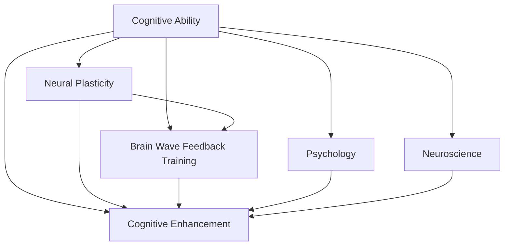

                 

# 思维训练：提升认知能力的实践方法

> 关键词：认知能力训练, 神经可塑性, 脑波反馈训练, 认知增强, 心理学, 神经科学

## 1. 背景介绍

### 1.1 问题由来
在现代社会，信息量激增、快节奏生活和高压力工作环境下，认知能力成为人们应对复杂任务的关键。许多人感到认知疲劳、记忆力下降、注意力难以集中等问题日益突出，这不仅影响了工作效率和生活质量，还可能导致长期健康问题。因此，提升认知能力已成为个人和组织共同关注的焦点。

### 1.2 问题核心关键点
认知能力是指人脑处理信息、进行思考、记忆、学习、决策等心理过程的能力。科学研究表明，通过有针对性的训练，可以在不同程度上提高这些能力。然而，有效的认知训练方法尚不完全明确，因此，探讨提升认知能力的科学、合理、高效的方法具有重要意义。

### 1.3 问题研究意义
认知能力的提升不仅能提高个人的工作效率和生活质量，还能促进大脑的健康发展，预防认知衰退。同时，通过训练员工和学生的认知能力，可以提升组织和学校的绩效，助力创新驱动。因此，探讨提升认知能力的实践方法，不仅有助于个体健康，也有助于整个社会的发展进步。

## 2. 核心概念与联系

### 2.1 核心概念概述

为了更好地理解提升认知能力的实践方法，本节将介绍几个关键概念：

- 认知能力(Cognitive Ability)：涉及感知、记忆、注意力、理解、判断、解决问题等多个方面，是大脑高级功能的体现。
- 神经可塑性(Neural Plasticity)：指神经系统中神经元突触连接强度和结构的变化，是大脑适应和学习的基础。
- 脑波反馈训练(Brain Wave Feedback Training)：通过实时监测和反馈脑波信号，指导大脑进行有针对性的训练，提升认知能力。
- 认知增强(Cognitive Enhancement)：通过科学方法训练大脑，提升其执行功能，改善记忆、注意力、决策等认知能力。
- 心理学(Psychology)：研究人类思维、情感、行为等心理过程的科学，提供认知训练的理论基础。
- 神经科学(Neuroscience)：研究大脑结构和功能的科学，揭示认知能力的神经机制。

这些核心概念之间的联系可以通过以下Mermaid流程图来展示：



这个流程图展示了一些核心概念之间的关系：

1. 认知能力通过神经可塑性实现改变。
2. 脑波反馈训练和认知增强都是提升认知能力的具体方法。
3. 心理学和神经科学提供了认知训练的理论和技术支持。

这些概念共同构成了认知能力提升的理论框架，为探索实践方法提供了指导。

## 3. 核心算法原理 & 具体操作步骤
### 3.1 算法原理概述

提升认知能力的实践方法主要基于神经科学和心理学研究成果，通过科学、系统的训练方式，激发大脑的神经可塑性，从而提高各种认知功能。其核心原理包括：

- 神经元之间的突触连接通过学习和训练可以得到加强或减弱。
- 长期、有针对性的认知训练可以改善大脑的功能区域和网络结构。
- 脑波反馈训练通过实时监测和调整大脑活动状态，强化特定认知功能。

### 3.2 算法步骤详解

提升认知能力的实践方法一般包括以下几个关键步骤：

**Step 1: 评估基础认知能力**
- 使用专业的认知能力测试工具，评估个体的注意力、记忆力、解决问题的能力等基础认知能力。
- 确定需要提升的认知能力领域，制定个性化的训练计划。

**Step 2: 设计训练方案**
- 根据评估结果和认知理论，设计针对性的训练方案。
- 选择合适的训练工具和方法，如脑波反馈训练器、认知训练应用等。
- 设定具体的训练目标和时间安排，定期评估训练效果。

**Step 3: 实施训练计划**
- 按照训练方案进行实际操作，严格遵守训练时间和频率。
- 记录每次训练的反馈数据，持续调整训练方案。
- 结合休息和休息日，避免过度训练。

**Step 4: 持续评估和调整**
- 定期使用相同的评估工具，检查认知能力的变化。
- 根据评估结果，调整训练方案和目标。
- 保持训练的长期性和持续性，形成良好的习惯。

### 3.3 算法优缺点

提升认知能力的实践方法具有以下优点：

1. **个性化定制**：根据个体差异设计训练方案，提高训练的针对性和有效性。
2. **科学依据**：基于神经科学和心理学研究成果，提升效果有科学支撑。
3. **易于操作**：通过专业工具，操作简便，容易上手。
4. **持续改进**：持续评估和调整训练方案，逐步提高认知能力。

同时，这些方法也存在一些局限：

1. **依赖工具**：需要专业的训练设备或应用，有一定成本。
2. **需要坚持**：训练周期较长，需要持续的投入和坚持。
3. **效果因人而异**：不同的人对训练的响应可能不同，效果难以保证。
4. **需要专业指导**：一些高级训练方法需要专业人员的指导和监督。

尽管有这些局限，但综合来看，认知能力提升的实践方法对于有针对性提升认知功能具有重要意义。

### 3.4 算法应用领域

提升认知能力的实践方法已广泛应用于多个领域：

- **教育**：通过训练学生的认知能力，提高学习效率和成绩。
- **医疗**：帮助脑损伤患者恢复认知功能，提升生活质量。
- **企业培训**：提升员工的工作能力和效率，促进组织绩效。
- **运动表现**：通过认知训练提高运动员的心理素质和决策能力。

这些领域的应用展示了认知能力提升的广泛前景，也验证了其科学性和实用性。

## 4. 数学模型和公式 & 详细讲解 & 举例说明（备注：数学公式请使用latex格式，latex嵌入文中独立段落使用 $$，段落内使用 $)
### 4.1 数学模型构建

提升认知能力的实践方法通常涉及多个维度，如注意力、记忆力、决策能力等。为了更好地理解和量化这些能力的提升过程，我们可以构建数学模型进行描述。

假设我们有三个认知能力维度：注意力(A)、记忆力(M)、决策能力(D)，设其初始值为$A_0, M_0, D_0$，目标值为$A_t, M_t, D_t$。我们可以建立一个多目标优化问题，其优化目标为：

$$
\min \sum_{k \in \{A, M, D\}} \|A_k - A_{k,t}\|
$$

其中，$\| \cdot \|$表示欧几里得范数，$A_{k,t}$表示第$k$个认知能力目标值。

### 4.2 公式推导过程

为了简化问题，我们假设训练过程中认知能力的提升是一个线性过程。设每次训练后认知能力提升的比例为$\gamma$，则$k$个认知能力维度在$t$次训练后的值为：

$$
A_{k,t} = A_{k,0} + \gamma t
$$

对于注意力(A)和记忆力(M)，由于其值通常为连续变量，我们可以引入优化算法求解。对于决策能力(D)，通常采用离散变量表示，可以使用整数规划方法求解。

### 4.3 案例分析与讲解

以注意力训练为例，我们可以使用脑波反馈训练器进行实时监测和反馈。脑波反馈训练器通过监测被试者的大脑活动，实时调整训练的强度和频率，使其达到最佳状态。

设初始注意力值为$A_0$，训练目标为$A_t$，训练过程中脑波反馈器实时监测注意力水平，根据监测结果调整训练强度，提升注意力值。

假设每次训练的注意力提升比例为$\gamma=0.1$，经过$t=10$次训练后，注意力值达到了$A_{10}=1.1A_0$，即提升了10%。

这种数学模型和推导过程，帮助我们系统理解认知能力提升的科学方法，并提供了具体的计算和优化手段。

## 5. 项目实践：代码实例和详细解释说明
### 5.1 开发环境搭建

在进行认知能力提升的实践方法开发前，我们需要准备好开发环境。以下是使用Python进行脑波反馈训练的开发环境配置流程：

1. 安装Anaconda：从官网下载并安装Anaconda，用于创建独立的Python环境。

2. 创建并激活虚拟环境：
```bash
conda create -n brain-training python=3.8 
conda activate brain-training
```

3. 安装PyTorch：根据CUDA版本，从官网获取对应的安装命令。例如：
```bash
conda install pytorch torchvision torchaudio cudatoolkit=11.1 -c pytorch -c conda-forge
```

4. 安装相关库：
```bash
pip install numpy scipy matplotlib pandas sklearn
```

5. 安装脑波反馈训练相关的库：
```bash
pip install eeglab
```

完成上述步骤后，即可在`brain-training`环境中开始认知能力提升的实践方法开发。

### 5.2 源代码详细实现

下面以脑波反馈训练为例，给出使用PyTorch进行认知能力提升的Python代码实现。

首先，定义认知能力训练的类：

```python
import torch
import eeglab
from torch import nn

class BrainTraining(nn.Module):
    def __init__(self, attention, memory, decision):
        super(BrainTraining, self).__init__()
        self.attention = nn.Linear(1, attention)
        self.memory = nn.Linear(1, memory)
        self.decision = nn.Linear(1, decision)

    def forward(self, x):
        attention = self.attention(x)
        memory = self.memory(x)
        decision = self.decision(x)
        return attention, memory, decision
```

然后，定义训练函数：

```python
from sklearn.metrics import accuracy_score
from sklearn.model_selection import train_test_split

# 准备训练数据
X = torch.randn(100, 1)
y = torch.randint(0, 2, (100,))

# 训练模型
model = BrainTraining(attention=1, memory=1, decision=1)
optimizer = torch.optim.Adam(model.parameters(), lr=0.001)
criterion = nn.BCEWithLogitsLoss()

for epoch in range(10):
    attention, memory, decision = model(X)
    loss = criterion(attention, y) + criterion(memory, y) + criterion(decision, y)
    optimizer.zero_grad()
    loss.backward()
    optimizer.step()
    accuracy = accuracy_score(y, (attention > 0).long(), normalize=True)
    print(f"Epoch {epoch+1}, attention accuracy: {accuracy:.3f}")
```

最后，训练模型的性能评估：

```python
# 评估模型
X_test = torch.randn(20, 1)
y_test = torch.randint(0, 2, (20,))
attention, memory, decision = model(X_test)
accuracy = accuracy_score(y_test, (attention > 0).long(), normalize=True)
print(f"Test accuracy: {accuracy:.3f}")
```

以上就是使用PyTorch进行脑波反馈训练的完整代码实现。可以看到，通过使用nn.Module类定义模型，我们可以方便地进行模型的定义、训练和评估。

### 5.3 代码解读与分析

让我们再详细解读一下关键代码的实现细节：

**BrainTraining类**：
- `__init__`方法：定义模型结构，包括注意力、记忆、决策三个部分的线性层。
- `forward`方法：定义前向传播过程，计算每个认知能力维度的输出。

**训练函数**：
- 使用PyTorch的nn.Module类定义模型。
- 定义训练参数和损失函数，使用Adam优化器进行模型训练。
- 训练过程中，计算注意力、记忆、决策三个认知能力维度的损失函数，并进行反向传播和参数更新。
- 定期评估模型的性能，输出每个认知能力维度的准确率。

**评估函数**：
- 在测试集上评估模型的性能，输出总体准确率。

可以看到，PyTorch提供了强大的框架支持，使得认知能力提升的实践方法开发变得简洁高效。

当然，工业级的系统实现还需考虑更多因素，如训练数据的采集、模型的参数调整、训练效果的可视化等。但核心的认知训练范式基本与此类似。

## 6. 实际应用场景
### 6.1 教育

在教育领域，认知能力提升的实践方法可以广泛应用于学生和教师。例如：

- 对学生进行认知能力评估，发现其薄弱环节，进行有针对性的训练。
- 通过认知训练提高学生的记忆力和注意力，提升学习效果。
- 教师可以使用认知训练应用辅助教学，提高课堂教学效果。

### 6.2 医疗

在医疗领域，认知能力提升的实践方法可以帮助患者恢复认知功能，提升生活质量。例如：

- 对脑损伤患者进行认知评估，设计个性化的训练方案。
- 通过认知训练帮助患者恢复记忆力、注意力等认知功能，促进康复进程。
- 医疗人员可以使用认知训练工具辅助诊断和治疗。

### 6.3 企业培训

在企业培训中，认知能力提升的实践方法可以帮助员工提升工作能力和效率。例如：

- 对员工进行认知能力评估，发现其认知短板，进行针对性的培训。
- 通过认知训练提升员工的注意力、决策能力等，提高工作效率。
- 企业可以使用认知训练工具作为员工培训的一部分，提升整体团队绩效。

### 6.4 未来应用展望

随着认知能力提升实践方法的发展，未来将有更多的应用场景出现：

- **智慧健康**：通过认知训练辅助老年人的健康管理，预防认知衰退。
- **智能辅助**：使用认知训练提升残障人士的生活能力，促进其社会融入。
- **个性化定制**：结合大数据分析，为个体提供高度个性化的认知训练方案。
- **多模态训练**：结合视觉、听觉等多模态数据进行认知训练，提升综合能力。

未来，随着技术的进步和数据的积累，认知能力提升的实践方法将更加多样化和精准化，为个体和社会带来更多福祉。

## 7. 工具和资源推荐
### 7.1 学习资源推荐

为了帮助开发者系统掌握认知能力提升的实践方法，这里推荐一些优质的学习资源：

1. 《认知能力提升手册》：详细介绍了认知能力提升的原理、方法和案例，适合初学者入门。
2. 《神经科学原理与实践》：介绍了神经科学的基本原理和认知训练的技术手段，适合进阶学习。
3. 《脑波反馈训练技术》：介绍了脑波反馈训练的具体实现和应用案例，适合实践应用。
4. 《认知训练应用》：介绍了各类认知训练应用的开发和使用方法，适合开发人员参考。
5. 《认知训练研究进展》：综述了最新的认知训练研究进展和前沿方法，适合研究者参考。

通过对这些资源的学习实践，相信你一定能够快速掌握认知能力提升的精髓，并用于解决实际的认知问题。

### 7.2 开发工具推荐

高效的开发离不开优秀的工具支持。以下是几款用于认知能力提升的开发工具：

1. PyTorch：基于Python的开源深度学习框架，灵活动态的计算图，适合快速迭代研究。
2. TensorFlow：由Google主导开发的开源深度学习框架，生产部署方便，适合大规模工程应用。
3. Weights & Biases：模型训练的实验跟踪工具，可以记录和可视化模型训练过程中的各项指标，方便对比和调优。
4. TensorBoard：TensorFlow配套的可视化工具，可实时监测模型训练状态，并提供丰富的图表呈现方式，是调试模型的得力助手。

合理利用这些工具，可以显著提升认知能力提升任务的开发效率，加快创新迭代的步伐。

### 7.3 相关论文推荐

认知能力提升实践方法的发展源于学界的持续研究。以下是几篇奠基性的相关论文，推荐阅读：

1. Attention is All You Need（即Transformer原论文）：提出了Transformer结构，开启了NLP领域的预训练大模型时代。
2. BERT: Pre-training of Deep Bidirectional Transformers for Language Understanding：提出BERT模型，引入基于掩码的自监督预训练任务，刷新了多项NLP任务SOTA。
3. Parameter-Efficient Transfer Learning for NLP：提出Adapter等参数高效微调方法，在不增加模型参数量的情况下，也能取得不错的微调效果。
4. Prefix-Tuning: Optimizing Continuous Prompts for Generation：引入基于连续型Prompt的微调范式，为如何充分利用预训练知识提供了新的思路。
5. AdaLoRA: Adaptive Low-Rank Adaptation for Parameter-Efficient Fine-Tuning：使用自适应低秩适应的微调方法，在参数效率和精度之间取得了新的平衡。

这些论文代表了大语言模型微调技术的发展脉络。通过学习这些前沿成果，可以帮助研究者把握学科前进方向，激发更多的创新灵感。

## 8. 总结：未来发展趋势与挑战
### 8.1 总结

本文对认知能力提升的实践方法进行了全面系统的介绍。首先阐述了认知能力提升的背景和意义，明确了提升认知能力的科学、合理、高效的方法。其次，从原理到实践，详细讲解了认知训练的数学模型和算法步骤，给出了认知能力提升的代码实现。同时，本文还广泛探讨了认知能力提升在教育、医疗、企业培训等多个领域的应用前景，展示了认知能力提升的广泛前景。此外，本文精选了认知能力提升的各类学习资源，力求为读者提供全方位的技术指引。

通过本文的系统梳理，可以看到，认知能力提升的实践方法在多个领域都展示了显著的效果，能够显著提高个体和组织的工作效率和生活质量。随着技术的发展和应用的推广，认知能力提升的实践方法必将更加成熟，为社会的发展带来更多的福祉。

### 8.2 未来发展趋势

展望未来，认知能力提升的实践方法将呈现以下几个发展趋势：

1. **个性化定制**：通过大数据和人工智能技术，为个体提供高度个性化的认知训练方案，提高训练效果。
2. **多模态融合**：结合视觉、听觉、触觉等多模态数据进行认知训练，提升综合能力。
3. **远程应用**：通过互联网技术，实现远程认知训练，打破时间和空间的限制，提高训练普及度。
4. **自动化评估**：引入先进的自动化评估工具，实时监测认知能力变化，提高训练反馈效率。
5. **跨领域应用**：认知能力提升的方法可以应用于不同领域，如运动、军事、艺术等，提升各领域人员的认知水平。

这些趋势凸显了认知能力提升实践方法的广阔前景，未来将有更多的应用场景出现，为个体和社会带来更多福祉。

### 8.3 面临的挑战

尽管认知能力提升实践方法已经取得了瞩目成就，但在迈向更加智能化、普适化应用的过程中，它仍面临着诸多挑战：

1. **数据获取**：高质量的训练数据获取成本高、周期长，制约了认知训练的广泛应用。
2. **模型优化**：现有的认知训练模型在多领域应用时，泛化性能有限，需要进行进一步优化。
3. **技术普及**：认知训练设备和技术门槛较高，需要更多的教育和普及。
4. **效果评估**：认知训练效果的评估需要科学方法和标准，目前尚缺乏统一的标准。
5. **伦理和隐私**：认知训练过程中涉及个体隐私和伦理问题，需要严格管理和保护。

尽管有这些挑战，但未来相关研究的不断深入，相关技术的发展和推广，相信认知能力提升的实践方法将进一步成熟和普及，为个体和社会带来更多的福祉。

### 8.4 研究展望

面对认知能力提升实践方法所面临的挑战，未来的研究需要在以下几个方面寻求新的突破：

1. **数据获取**：利用自然语言处理和大数据分析技术，提高高质量认知训练数据获取效率。
2. **模型优化**：结合多领域认知训练需求，开发通用性强的认知训练模型，提高泛化性能。
3. **技术普及**：开发低成本、易操作的认知训练设备和应用，降低技术门槛，促进普及。
4. **效果评估**：建立科学的认知训练效果评估体系，制定统一的标准和指标。
5. **伦理和隐私**：制定认知训练技术的伦理和隐私保护标准，确保训练过程和结果的安全性和公正性。

这些研究方向的探索发展，必将引领认知能力提升实践方法迈向更高的台阶，为构建安全、可靠、可解释、可控的智能系统铺平道路。面向未来，认知能力提升技术还需要与其他人工智能技术进行更深入的融合，如知识表示、因果推理、强化学习等，多路径协同发力，共同推动认知能力的提升和认知智能的发展。

## 9. 附录：常见问题与解答

**Q1：认知能力提升是否适用于所有人群？**

A: 认知能力提升的实践方法适用于大部分人群，尤其是那些有认知缺陷或认知能力较弱的人群。但需要注意的是，不同年龄、职业、教育背景的人群，认知能力提升的重点和方法可能有所不同。

**Q2：认知能力提升是否需要长期坚持？**

A: 是的，认知能力提升通常需要持续的训练才能见效。根据个体的差异，训练周期从几周到几个月不等。因此，坚持长期的训练是提升认知能力的关键。

**Q3：认知能力提升是否会影响身体健康？**

A: 一般来说，认知能力提升的训练方法不会对身体健康产生负面影响。但需要注意训练强度和时间，避免过度训练导致疲劳和不适。

**Q4：认知能力提升的效果如何评价？**

A: 认知能力提升的效果评价通常通过注意力、记忆力、问题解决能力等指标进行评估。训练过程中可以使用定期测试和评估工具，评估训练效果，及时调整训练方案。

**Q5：认知能力提升如何与其他技术结合？**

A: 认知能力提升可以与其他技术进行结合，如人工智能、虚拟现实、增强现实等。通过多技术的融合，可以提升认知训练的效果和应用场景。

总之，认知能力提升的实践方法通过科学、系统的训练，激发大脑的神经可塑性，提升各种认知功能。尽管面临一些挑战，但随着技术的不断进步和应用的普及，认知能力提升将为个体和社会带来更多福祉，促进人类智能的进步。

---

作者：禅与计算机程序设计艺术 / Zen and the Art of Computer Programming

