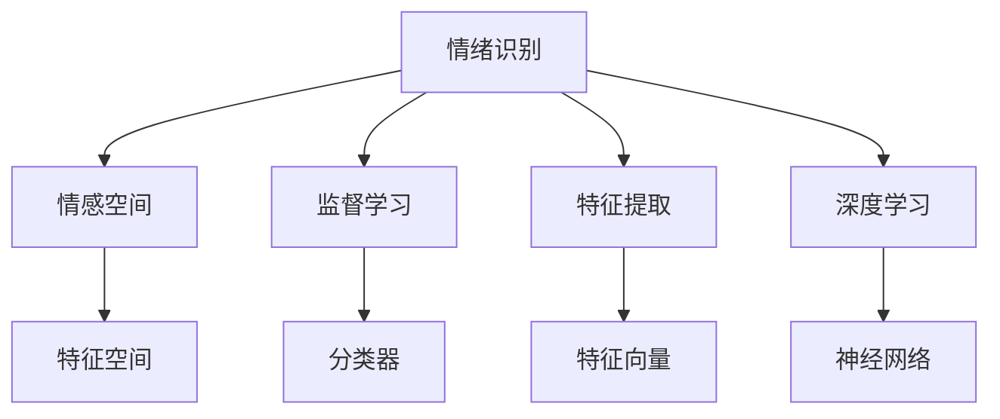

                 

## 1. 背景介绍

### 1.1 问题由来
随着人工智能技术的飞速发展，情绪识别技术逐渐成为人机交互领域的研究热点。它不仅能够提升用户体验，还能够帮助企业洞察用户情绪，提升产品设计和服务质量。尤其是在智能客服、虚拟助手、游戏娱乐等场景中，情绪识别技术应用广泛。

情绪识别（Emotion Recognition）是指通过分析用户的声音、文本、图像等数据，自动识别用户当前的情感状态，如快乐、悲伤、愤怒、恐惧等。在过去几年中，深度学习技术在图像识别、自然语言处理等方面取得了巨大成功，这为情绪识别技术的发展提供了坚实的基础。

### 1.2 问题核心关键点
情绪识别的核心在于如何从复杂多变的数据中提取情感特征，并将其映射为具体的情感类别。当前，主流的方法包括使用深度学习模型（如CNN、RNN、Transformer等），将情感特征映射到情感空间，再使用分类器（如SVM、CNN等）进行分类。这种基于监督学习的方法，需要大量标注数据进行训练，同时还需要进行特征工程和模型调优，才能获得较好的性能。

## 2. 核心概念与联系

### 2.1 核心概念概述

为了更好地理解情绪识别技术，本节将介绍几个密切相关的核心概念：

- **情绪识别（Emotion Recognition）**：通过分析用户的声音、文本、图像等数据，自动识别用户当前的情感状态。
- **情感空间（Emotion Space）**：将不同情感映射到多维空间中，使得计算机可以通过机器学习算法进行分类。
- **监督学习（Supervised Learning）**：利用有标签数据训练模型，使其能够识别特定情感。
- **特征提取（Feature Extraction）**：从原始数据中提取有意义的特征，用于情感分类。
- **深度学习（Deep Learning）**：利用多层神经网络进行复杂的特征提取和分类。

这些核心概念之间的逻辑关系可以通过以下Mermaid流程图来展示：



这个流程图展示了情绪识别的核心概念及其之间的关系：

1. 情绪识别基于用户的多模态数据，如文本、声音、图像等。
2. 这些数据经过特征提取，转换成特征向量。
3. 特征向量通过深度学习模型进行建模，得到情感空间中的表示。
4. 分类器根据情感空间中的表示，对情感进行分类。

## 3. 核心算法原理 & 具体操作步骤
### 3.1 算法原理概述

情绪识别技术本质上是基于监督学习的一种分类问题。其核心思想是利用有标签数据，训练一个分类模型，使其能够识别和分类用户的情感。

假设我们有一个情感识别模型 $M$，它可以将输入的特征 $x$ 映射到情感空间中的向量 $y$。我们的目标是通过监督学习，使得模型能够准确地预测用户的情感状态。

形式化地，假设我们有 $N$ 个标注样本 $(x_i, y_i)$，其中 $x_i$ 是输入的特征向量，$y_i$ 是对应的情感标签。我们的目标是最小化损失函数：

$$
\mathcal{L}(M) = \frac{1}{N}\sum_{i=1}^N \ell(M(x_i), y_i)
$$

其中 $\ell$ 是损失函数，通常使用交叉熵损失函数。

### 3.2 算法步骤详解

情绪识别的一般步骤包括数据预处理、特征提取、模型训练和模型评估。

**Step 1: 数据预处理**
1. 收集用户的多模态数据，如文本、声音、图像等。
2. 对数据进行预处理，如清洗、归一化等。
3. 将多模态数据转换为统一的特征向量。

**Step 2: 特征提取**
1. 对预处理后的数据进行特征提取，生成特征向量。
2. 常用的特征提取方法包括文本分词、图像卷积、声音特征提取等。
3. 使用深度学习模型对特征向量进行建模，得到情感空间中的表示。

**Step 3: 模型训练**
1. 选择合适的深度学习模型，如卷积神经网络（CNN）、循环神经网络（RNN）、Transformer等。
2. 使用有标签数据训练模型，调整模型参数。
3. 使用交叉熵损失函数，最小化模型预测误差。

**Step 4: 模型评估**
1. 使用测试集评估模型性能。
2. 计算分类准确率、召回率、F1-score等指标。
3. 对模型进行调整，以提高性能。

### 3.3 算法优缺点

情绪识别技术的主要优点包括：
1. 精度高：利用深度学习模型，可以自动提取复杂特征，实现较高的分类准确率。
2. 实时性：基于神经网络模型的情绪识别技术可以实现实时处理。
3. 泛化能力强：深度学习模型可以自动学习特征，对新的情感类别也有较好的泛化能力。

同时，该技术也存在一些局限性：
1. 依赖标注数据：情绪识别的准确性高度依赖标注数据的数量和质量，标注成本较高。
2. 数据处理难度大：多模态数据处理复杂，需要多种技术协同工作。
3. 鲁棒性不足：对于异常数据和噪声，深度学习模型容易过拟合。
4. 可解释性差：深度学习模型的决策过程不透明，难以解释。

尽管存在这些局限性，但情绪识别技术在实际应用中已经取得了显著效果，广泛应用于智能客服、虚拟助手、游戏娱乐等场景。

### 3.4 算法应用领域

情绪识别技术在多个领域中都有广泛应用，例如：

- **智能客服**：通过分析用户的语音和文本，识别用户的情感状态，提供个性化服务。
- **虚拟助手**：在聊天机器人中，利用情绪识别技术，提供更加自然的交互体验。
- **游戏娱乐**：在游戏场景中，识别玩家的情绪状态，调整游戏难度和体验。
- **健康医疗**：分析患者的情绪状态，辅助医生进行心理治疗。
- **教育培训**：在在线教育中，识别学生的情绪状态，调整教学策略。

## 4. 数学模型和公式 & 详细讲解  
### 4.1 数学模型构建

在本节中，我们将详细讲解情绪识别模型的数学模型构建。

假设我们有一个情感分类问题，输入特征 $x$ 为 $n$ 维向量，情感类别 $y$ 为 $m$ 分类标签。我们的目标是通过监督学习，训练一个分类器 $M$，使得对新的输入特征 $x$，能够预测正确的情感类别 $y$。

形式化地，我们的目标是最小化损失函数：

$$
\mathcal{L}(M) = \frac{1}{N}\sum_{i=1}^N \ell(M(x_i), y_i)
$$

其中 $\ell$ 是损失函数，通常使用交叉熵损失函数。

假设我们选择一个深度神经网络模型 $M$，它将输入特征 $x$ 映射到情感空间中的向量 $z$，然后通过一个分类器 $C$ 对情感进行分类。

我们的目标是最小化损失函数：

$$
\mathcal{L}(M) = \frac{1}{N}\sum_{i=1}^N \ell(C(z_i), y_i)
$$

其中 $z_i = M(x_i)$，$C$ 是分类器。

### 4.2 公式推导过程

以下是交叉熵损失函数的推导过程：

假设我们有一个二分类问题，目标是最小化损失函数：

$$
\mathcal{L}(M) = -\frac{1}{N}\sum_{i=1}^N [y_i\log \hat{y_i} + (1-y_i)\log(1-\hat{y_i})]
$$

其中 $\hat{y_i}$ 是对输入 $x_i$ 的分类器输出，$y_i$ 是对应的情感标签。

将损失函数代入交叉熵公式：

$$
\mathcal{L}(M) = -\frac{1}{N}\sum_{i=1}^N y_i\log \hat{y_i} + \frac{1}{N}\sum_{i=1}^N (1-y_i)\log(1-\hat{y_i})
$$

我们对 $M$ 求导，得到梯度：

$$
\nabla_{\theta} \mathcal{L}(M) = -\frac{1}{N}\sum_{i=1}^N y_i \frac{\nabla_{\theta} \hat{y_i}}{1-\hat{y_i}} + \frac{1}{N}\sum_{i=1}^N (1-y_i) \frac{\nabla_{\theta} (1-\hat{y_i})}{\hat{y_i}}
$$

其中 $\nabla_{\theta} \hat{y_i} = \frac{\partial \hat{y_i}}{\partial \theta}$，即分类器输出的梯度。

### 4.3 案例分析与讲解

以一个简单的情感分类任务为例，我们将通过一个文本分类器的实现，展示情绪识别模型的应用。

假设我们有一个文本情感分类任务，输入文本 $x$ 为字符串，情感类别 $y$ 为 $m$ 分类标签。我们的目标是通过监督学习，训练一个分类器 $M$，使得对新的输入文本 $x$，能够预测正确的情感类别 $y$。

假设我们选择一个文本卷积神经网络（TextCNN）作为分类器，将输入文本 $x$ 映射到 $n$ 维向量 $z$，然后通过一个分类器 $C$ 对情感进行分类。

我们的目标是最小化损失函数：

$$
\mathcal{L}(M) = \frac{1}{N}\sum_{i=1}^N \ell(C(z_i), y_i)
$$

其中 $z_i = M(x_i)$，$C$ 是分类器。

## 5. 项目实践：代码实例和详细解释说明
### 5.1 开发环境搭建

在进行情绪识别项目实践前，我们需要准备好开发环境。以下是使用Python进行Keras开发的Python环境配置流程：

1. 安装Anaconda：从官网下载并安装Anaconda，用于创建独立的Python环境。

2. 创建并激活虚拟环境：
```bash
conda create -n keras-env python=3.8 
conda activate keras-env
```

3. 安装Keras：
```bash
pip install keras
```

4. 安装TensorFlow和其他库：
```bash
pip install tensorflow
pip install numpy pandas scikit-learn
```

完成上述步骤后，即可在`keras-env`环境中开始情绪识别模型的开发。

### 5.2 源代码详细实现

下面我们以一个文本情感分类任务为例，给出使用Keras对TextCNN模型进行情绪识别的代码实现。

首先，定义数据集类：

```python
import numpy as np
from keras.datasets import imdb

class Dataset:
    def __init__(self, path):
        self.path = path
        self.load_data()

    def load_data(self):
        (X_train, y_train), (X_test, y_test) = imdb.load_data(num_words=10000)
        self.X_train = X_train
        self.y_train = y_train
        self.X_test = X_test
        self.y_test = y_test

    def get_data(self, data, maxlen=256, padding='post'):
        return np.array([pad_sequences(x, maxlen=maxlen, padding=padding) for x in data])
```

然后，定义模型类：

```python
from keras.models import Sequential
from keras.layers import Embedding, Conv1D, GlobalMaxPooling1D, Dense

class Model:
    def __init__(self, num_classes):
        self.model = Sequential([
            Embedding(input_dim=10000, output_dim=128, input_length=100),
            Conv1D(128, 7, activation='relu'),
            GlobalMaxPooling1D(),
            Dense(128, activation='relu'),
            Dense(num_classes, activation='softmax')
        ])
        self.model.compile(loss='categorical_crossentropy', optimizer='adam', metrics=['accuracy'])

    def train(self, X_train, y_train):
        self.model.fit(X_train, y_train, epochs=10, batch_size=64, validation_split=0.2)
```

最后，启动训练流程并在测试集上评估：

```python
num_classes = 2
dataset = Dataset('imdb.npz')
X_train, y_train = dataset.get_data(dataset.X_train)
X_test, y_test = dataset.get_data(dataset.X_test)
model = Model(num_classes)
model.train(X_train, y_train)
test_loss, test_acc = model.model.evaluate(X_test, y_test)
print('Test accuracy:', test_acc)
```

以上就是使用Keras对TextCNN模型进行情感分类的完整代码实现。可以看到，得益于Keras的强大封装，我们可以用相对简洁的代码完成模型搭建和训练。

### 5.3 代码解读与分析

让我们再详细解读一下关键代码的实现细节：

**Dataset类**：
- `__init__`方法：初始化数据集类，并加载IMDB数据集。
- `load_data`方法：从IMDB数据集中加载训练集和测试集的文本和标签数据。
- `get_data`方法：对数据集进行padding，并返回处理后的特征向量。

**Model类**：
- `__init__`方法：初始化模型结构，包括嵌入层、卷积层、池化层、全连接层和输出层。
- `train`方法：对模型进行训练，并返回测试集上的评估结果。

**训练流程**：
- 定义数据集和模型
- 加载数据
- 对数据进行padding处理
- 训练模型
- 在测试集上评估模型

## 6. 实际应用场景
### 6.1 智能客服系统

基于情绪识别技术，可以构建智能客服系统，为用户提供更加个性化和人性化的服务。传统的客服系统依赖人工处理，高峰期响应缓慢，且一致性和专业性难以保证。而基于情绪识别技术的智能客服系统，可以24小时不间断服务，快速响应客户咨询，提供自然流畅的语言回复。

在技术实现上，可以收集企业内部的历史客服对话记录，将问题和最佳答复构建成监督数据，在此基础上对预训练模型进行微调。微调后的模型能够自动理解用户意图，匹配最合适的答案模板进行回复。对于客户提出的新问题，还可以接入检索系统实时搜索相关内容，动态组织生成回答。如此构建的智能客服系统，能大幅提升客户咨询体验和问题解决效率。

### 6.2 虚拟助手

虚拟助手是另一个重要应用场景。在聊天机器人中，利用情绪识别技术，可以更加自然地与用户互动。例如，可以检测用户情绪的变化，调整回复策略，或推荐不同的解决方案。

在技术实现上，可以通过收集用户的聊天记录，分析用户情绪变化，调整机器人的回复策略，实现情感导向的交互。例如，当用户表达出负面情绪时，可以及时给出安慰或帮助，提升用户体验。

### 6.3 游戏娱乐

在游戏场景中，情绪识别技术也有广泛应用。例如，可以通过分析玩家的情绪状态，调整游戏难度和体验。例如，当玩家表现出沮丧或愤怒情绪时，可以降低游戏难度或给出提示，提升游戏体验。

在技术实现上，可以通过收集玩家的游戏行为数据，分析玩家的情绪状态，调整游戏策略。例如，当玩家在游戏中表现出沮丧情绪时，可以调整游戏难度，提升游戏体验。

### 6.4 未来应用展望

随着情绪识别技术的不断进步，其在更多领域中将会得到应用，为传统行业带来变革性影响。

在智慧医疗领域，基于情绪识别技术的心理健康评估工具，可以及时发现患者的情绪问题，提供心理辅导和支持。这对于预防心理疾病和提高患者治疗效果有重要意义。

在智能教育领域，情绪识别技术可以帮助教师了解学生的学习状态，调整教学策略，提升教学质量。例如，当学生表现出焦虑或沮丧情绪时，教师可以及时调整教学策略，帮助学生更好地学习。

在智慧城市治理中，情绪识别技术可以帮助城市管理者了解市民的情绪状态，调整城市管理策略，提升城市管理水平。例如，当市民表现出不满情绪时，可以及时调整城市服务策略，提升市民满意度。

此外，在企业生产、社会治理、文娱传媒等众多领域，情绪识别技术的应用也将不断涌现，为传统行业数字化转型升级提供新的技术路径。相信随着技术的日益成熟，情绪识别技术将在构建人机协同的智能时代中扮演越来越重要的角色。

## 7. 工具和资源推荐
### 7.1 学习资源推荐

为了帮助开发者系统掌握情绪识别技术，这里推荐一些优质的学习资源：

1. 《深度学习：理论与实践》系列博文：由深度学习领域专家撰写，深入浅出地介绍了深度学习模型的原理和实现，包括情绪识别技术。

2. CS231n《卷积神经网络》课程：斯坦福大学开设的计算机视觉明星课程，包含卷积神经网络模型的理论和实践，对理解情绪识别模型有重要帮助。

3. 《自然语言处理综述》书籍：深度学习领域的经典教材，介绍了自然语言处理的各个方面，包括情绪识别技术。

4. TensorFlow官方文档：TensorFlow的官方文档，提供了丰富的情绪识别样例代码，适合初学者快速上手。

5. Kaggle比赛平台：Kaggle平台上有很多情绪识别相关的比赛，可以实践和检验自己的算法。

通过对这些资源的学习实践，相信你一定能够快速掌握情绪识别技术的精髓，并用于解决实际的NLP问题。

### 7.2 开发工具推荐

高效的开发离不开优秀的工具支持。以下是几款用于情绪识别开发的常用工具：

1. Keras：基于Python的深度学习框架，简单易用，适合快速迭代研究。

2. TensorFlow：由Google主导开发的深度学习框架，生产部署方便，适合大规模工程应用。

3. PyTorch：由Facebook主导的深度学习框架，灵活易用，适合学术研究。

4. Weights & Biases：模型训练的实验跟踪工具，可以记录和可视化模型训练过程中的各项指标，方便对比和调优。

5. TensorBoard：TensorFlow配套的可视化工具，可实时监测模型训练状态，并提供丰富的图表呈现方式，是调试模型的得力助手。

合理利用这些工具，可以显著提升情绪识别模型的开发效率，加快创新迭代的步伐。

### 7.3 相关论文推荐

情绪识别技术的发展源于学界的持续研究。以下是几篇奠基性的相关论文，推荐阅读：

1. Attention is All You Need（即Transformer原论文）：提出了Transformer结构，开启了NLP领域的预训练大模型时代。

2. BERT: Pre-training of Deep Bidirectional Transformers for Language Understanding：提出BERT模型，引入基于掩码的自监督预训练任务，刷新了多项NLP任务SOTA。

3. Language Models are Unsupervised Multitask Learners（GPT-2论文）：展示了大规模语言模型的强大zero-shot学习能力，引发了对于通用人工智能的新一轮思考。

4. Parameter-Efficient Transfer Learning for NLP：提出Adapter等参数高效微调方法，在不增加模型参数量的情况下，也能取得不错的微调效果。

5. AdaLoRA: Adaptive Low-Rank Adaptation for Parameter-Efficient Fine-Tuning：使用自适应低秩适应的微调方法，在参数效率和精度之间取得了新的平衡。

这些论文代表了大语言模型微调技术的发展脉络。通过学习这些前沿成果，可以帮助研究者把握学科前进方向，激发更多的创新灵感。

## 8. 总结：未来发展趋势与挑战

### 8.1 总结

本文对基于监督学习的大语言模型微调方法进行了全面系统的介绍。首先阐述了大语言模型和微调技术的研究背景和意义，明确了微调在拓展预训练模型应用、提升下游任务性能方面的独特价值。其次，从原理到实践，详细讲解了情绪识别模型的数学原理和关键步骤，给出了情绪识别任务开发的完整代码实例。同时，本文还广泛探讨了情绪识别技术在智能客服、虚拟助手、游戏娱乐等场景中的广泛应用，展示了情绪识别范式的巨大潜力。

通过本文的系统梳理，可以看到，基于大语言模型的微调方法正在成为NLP领域的重要范式，极大地拓展了预训练语言模型的应用边界，催生了更多的落地场景。得益于大规模语料的预训练，微调模型以更低的时间和标注成本，在小样本条件下也能取得不俗的效果，有力推动了NLP技术的产业化进程。未来，伴随预训练语言模型和微调方法的持续演进，相信NLP技术将在更广阔的应用领域大放异彩，深刻影响人类的生产生活方式。

### 8.2 未来发展趋势

展望未来，大语言模型微调技术将呈现以下几个发展趋势：

1. 模型规模持续增大。随着算力成本的下降和数据规模的扩张，预训练语言模型的参数量还将持续增长。超大规模语言模型蕴含的丰富语言知识，有望支撑更加复杂多变的下游任务微调。

2. 微调方法日趋多样。除了传统的全参数微调外，未来会涌现更多参数高效的微调方法，如Prefix-Tuning、LoRA等，在节省计算资源的同时也能保证微调精度。

3. 持续学习成为常态。随着数据分布的不断变化，微调模型也需要持续学习新知识以保持性能。如何在不遗忘原有知识的同时，高效吸收新样本信息，将成为重要的研究课题。

4. 标注样本需求降低。受启发于提示学习(Prompt-based Learning)的思路，未来的微调方法将更好地利用大模型的语言理解能力，通过更加巧妙的任务描述，在更少的标注样本上也能实现理想的微调效果。

5. 少样本学习(Few-shot Learning)崛起。少样本学习是指在只有少量标注样本的情况下，模型能够快速适应新任务的学习方法。在大语言模型中，通常通过在输入中提供少量示例来实现，无需更新模型参数。

6. 多模态微调崛起。当前的微调主要聚焦于纯文本数据，未来会进一步拓展到图像、视频、语音等多模态数据微调。多模态信息的融合，将显著提升语言模型对现实世界的理解和建模能力。

以上趋势凸显了大语言模型微调技术的广阔前景。这些方向的探索发展，必将进一步提升NLP系统的性能和应用范围，为人类认知智能的进化带来深远影响。

### 8.3 面临的挑战

尽管大语言模型微调技术已经取得了瞩目成就，但在迈向更加智能化、普适化应用的过程中，它仍面临着诸多挑战：

1. 标注成本瓶颈。虽然微调大大降低了标注数据的需求，但对于长尾应用场景，难以获得充足的高质量标注数据，成为制约微调性能的瓶颈。如何进一步降低微调对标注样本的依赖，将是一大难题。

2. 模型鲁棒性不足。当前微调模型面对域外数据时，泛化性能往往大打折扣。对于测试样本的微小扰动，微调模型的预测也容易发生波动。如何提高微调模型的鲁棒性，避免灾难性遗忘，还需要更多理论和实践的积累。

3. 推理效率有待提高。大规模语言模型虽然精度高，但在实际部署时往往面临推理速度慢、内存占用大等效率问题。如何在保证性能的同时，简化模型结构，提升推理速度，优化资源占用，将是重要的优化方向。

4. 可解释性亟需加强。当前微调模型更像是"黑盒"系统，难以解释其内部工作机制和决策逻辑。对于医疗、金融等高风险应用，算法的可解释性和可审计性尤为重要。如何赋予微调模型更强的可解释性，将是亟待攻克的难题。

5. 安全性有待保障。预训练语言模型难免会学习到有偏见、有害的信息，通过微调传递到下游任务，产生误导性、歧视性的输出，给实际应用带来安全隐患。如何从数据和算法层面消除模型偏见，避免恶意用途，确保输出的安全性，也将是重要的研究课题。

6. 知识整合能力不足。现有的微调模型往往局限于任务内数据，难以灵活吸收和运用更广泛的先验知识。如何让微调过程更好地与外部知识库、规则库等专家知识结合，形成更加全面、准确的信息整合能力，还有很大的想象空间。

正视微调面临的这些挑战，积极应对并寻求突破，将是大语言模型微调走向成熟的必由之路。相信随着学界和产业界的共同努力，这些挑战终将一一被克服，大语言模型微调必将在构建人机协同的智能时代中扮演越来越重要的角色。

### 8.4 研究展望

面向未来，大语言模型微调技术需要在以下几个方面寻求新的突破：

1. 探索无监督和半监督微调方法。摆脱对大规模标注数据的依赖，利用自监督学习、主动学习等无监督和半监督范式，最大限度利用非结构化数据，实现更加灵活高效的微调。

2. 研究参数高效和计算高效的微调范式。开发更加参数高效的微调方法，在固定大部分预训练参数的同时，只更新极少量的任务相关参数。同时优化微调模型的计算图，减少前向传播和反向传播的资源消耗，实现更加轻量级、实时性的部署。

3. 融合因果和对比学习范式。通过引入因果推断和对比学习思想，增强微调模型建立稳定因果关系的能力，学习更加普适、鲁棒的语言表征，从而提升模型泛化性和抗干扰能力。

4. 引入更多先验知识。将符号化的先验知识，如知识图谱、逻辑规则等，与神经网络模型进行巧妙融合，引导微调过程学习更准确、合理的语言模型。同时加强不同模态数据的整合，实现视觉、语音等多模态信息与文本信息的协同建模。

5. 结合因果分析和博弈论工具。将因果分析方法引入微调模型，识别出模型决策的关键特征，增强输出解释的因果性和逻辑性。借助博弈论工具刻画人机交互过程，主动探索并规避模型的脆弱点，提高系统稳定性。

6. 纳入伦理道德约束。在模型训练目标中引入伦理导向的评估指标，过滤和惩罚有偏见、有害的输出倾向。同时加强人工干预和审核，建立模型行为的监管机制，确保输出符合人类价值观和伦理道德。

这些研究方向的探索，必将引领大语言模型微调技术迈向更高的台阶，为构建安全、可靠、可解释、可控的智能系统铺平道路。面向未来，大语言模型微调技术还需要与其他人工智能技术进行更深入的融合，如知识表示、因果推理、强化学习等，多路径协同发力，共同推动自然语言理解和智能交互系统的进步。只有勇于创新、敢于突破，才能不断拓展语言模型的边界，让智能技术更好地造福人类社会。

## 9. 附录：常见问题与解答

**Q1：大语言模型微调是否适用于所有NLP任务？**

A: 大语言模型微调在大多数NLP任务上都能取得不错的效果，特别是对于数据量较小的任务。但对于一些特定领域的任务，如医学、法律等，仅仅依靠通用语料预训练的模型可能难以很好地适应。此时需要在特定领域语料上进一步预训练，再进行微调，才能获得理想效果。此外，对于一些需要时效性、个性化很强的任务，如对话、推荐等，微调方法也需要针对性的改进优化。

**Q2：采用大模型微调时会面临哪些资源瓶颈？**

A: 目前主流的预训练大模型动辄以亿计的参数规模，对算力、内存、存储都提出了很高的要求。GPU/TPU等高性能设备是必不可少的，但即便如此，超大批次的训练和推理也可能遇到显存不足的问题。因此需要采用一些资源优化技术，如梯度积累、混合精度训练、模型并行等，来突破硬件瓶颈。同时，模型的存储和读取也可能占用大量时间和空间，需要采用模型压缩、稀疏化存储等方法进行优化。

**Q3：如何缓解微调过程中的过拟合问题？**

A: 过拟合是微调面临的主要挑战，尤其是在标注数据不足的情况下。常见的缓解策略包括：
1. 数据增强：通过回译、近义替换等方式扩充训练集
2. 正则化：使用L2正则、Dropout、Early Stopping等避免过拟合
3. 对抗训练：引入对抗样本，提高模型鲁棒性
4. 参数高效微调：只调整少量参数(如Adapter、Prefix等)，减小过拟合风险
5. 多模型集成：训练多个微调模型，取平均输出，抑制过拟合

这些策略往往需要根据具体任务和数据特点进行灵活组合。只有在数据、模型、训练、推理等各环节进行全面优化，才能最大限度地发挥大模型微调的威力。

**Q4：微调模型在落地部署时需要注意哪些问题？**

A: 将微调模型转化为实际应用，还需要考虑以下因素：
1. 模型裁剪：去除不必要的层和参数，减小模型尺寸，加快推理速度
2. 量化加速：将浮点模型转为定点模型，压缩存储空间，提高计算效率
3. 服务化封装：将模型封装为标准化服务接口，便于集成调用
4. 弹性伸缩：根据请求流量动态调整资源配置，平衡服务质量和成本
5. 监控告警：实时采集系统指标，设置异常告警阈值，确保服务稳定性
6. 安全防护：采用访问鉴权、数据脱敏等措施，保障数据和模型安全

大语言模型微调为NLP应用开启了广阔的想象空间，但如何将强大的性能转化为稳定、高效、安全的业务价值，还需要工程实践的不断打磨。唯有从数据、算法、工程、业务等多个维度协同发力，才能真正实现人工智能技术在垂直行业的规模化落地。总之，微调需要开发者根据具体任务，不断迭代和优化模型、数据和算法，方能得到理想的效果。

