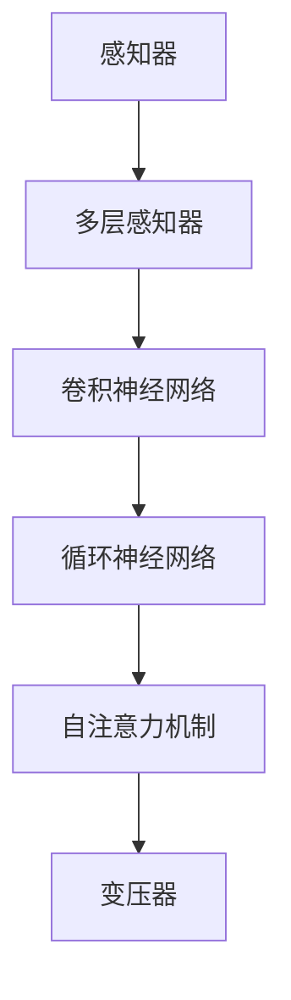

                 

# 感知器到变压器：神经网络的演进

> 关键词：神经网络, 感知器, 多层感知器, 卷积神经网络, 循环神经网络, 自注意力机制, 变压器, 深度学习, 计算机视觉, 自然语言处理

## 1. 背景介绍

### 1.1 问题由来

在计算机科学中，神经网络（Neural Network, NN）作为模拟生物神经网络功能的计算模型，自1950年代诞生以来，经历了多次重大演进，从单一的感知器、多层感知器，到卷积神经网络、循环神经网络，最终演进至以自注意力机制为核心的变压器（Transformer）。这些演进不仅仅是模型结构的简单变化，更是计算能力和理论基础的巨大飞跃。

神经网络在计算机视觉、自然语言处理、语音识别等领域取得了举世瞩目的成就。在2012年，深度学习的三巨头AlexNet、Hinton等，以突破性的思路和算法，成功应用神经网络来解决图像分类问题，推动了深度学习技术的迅猛发展，开启了计算机视觉的新时代。2014年，卷积神经网络（Convolutional Neural Network, CNN）的横空出世，进一步提升了图像识别的准确性。2015年，基于长短期记忆网络（Long Short-Term Memory, LSTM）的循环神经网络（Recurrent Neural Network, RNN），成功解决了序列数据的预测问题。然而，这些模型在处理复杂、长序列数据时，依然存在计算资源消耗大、模型复杂度高的问题。

2017年，变压器作为机器学习领域的革命性突破，通过自注意力机制大幅提升了模型的并行计算能力和表达能力，逐渐成为神经网络的主流模型。自注意力机制不仅提升了模型对长期依赖的捕捉能力，还使得模型可以轻松处理不同长度、不同种类的输入数据，引起了学术界和工业界的广泛关注。

### 1.2 问题核心关键点

神经网络的发展经历了多个重要阶段，其核心关键点包括：

- **感知器与多层感知器（Perceptron and Multi-Layer Perceptron, MLP）**：最早期的神经网络结构，主要用于简单的分类和回归任务。
- **卷积神经网络（Convolutional Neural Network, CNN）**：通过卷积操作捕捉局部特征，适用于图像处理等任务。
- **循环神经网络（Recurrent Neural Network, RNN）**：通过循环结构，使得模型可以处理序列数据，如自然语言处理中的文本分析。
- **自注意力机制（Self-Attention Mechanism）**：通过计算输入序列中各部分之间的相似度，提升模型的长期依赖捕捉能力。
- **变压器（Transformer）**：通过自注意力机制构建的模型，广泛应用于自然语言处理、计算机视觉等任务。

这些关键点的演进，反映了神经网络在理论和实践上的不断进步，推动了深度学习技术的快速发展。

## 2. 核心概念与联系

### 2.1 核心概念概述

为更好地理解神经网络从感知器到变压器的演进过程，本节将介绍几个密切相关的核心概念：

- **感知器（Perceptron）**：最早的神经网络结构，通过简单的逻辑函数进行二分类。
- **多层感知器（Multi-Layer Perceptron, MLP）**：由多个线性变换和激活函数组成的神经网络。
- **卷积神经网络（Convolutional Neural Network, CNN）**：通过卷积和池化操作，提取局部特征，常用于图像处理任务。
- **循环神经网络（Recurrent Neural Network, RNN）**：通过循环结构，处理序列数据，常用于文本处理任务。
- **自注意力机制（Self-Attention Mechanism）**：通过计算输入序列中各部分之间的相似度，提升模型的长期依赖捕捉能力。
- **变压器（Transformer）**：通过自注意力机制构建的模型，广泛应用于自然语言处理、计算机视觉等任务。

这些概念之间的逻辑关系可以通过以下Mermaid流程图来展示：



这个流程图展示了从感知器到变压器的演变路径，每一阶段都是在前一阶段的基础上，通过不断优化和演进，引入新的计算单元和网络结构，以应对更复杂的任务需求。

## 3. 核心算法原理 & 具体操作步骤
### 3.1 算法原理概述

神经网络是一种通过层级结构和非线性变换来模拟生物神经系统的计算模型。其核心原理是通过大量参数的训练，使得模型能够学习到输入数据中的复杂模式和结构，从而对新的数据进行预测或分类。

神经网络一般包括输入层、隐藏层（中间层）和输出层。其中，输入层接收原始数据，输出层产生最终预测结果，隐藏层则通过一系列非线性变换，提取数据中的高层次特征。隐藏层的参数是通过反向传播算法（Backpropagation）在训练过程中不断调整，以最小化模型预测误差。

### 3.2 算法步骤详解

神经网络的基本训练过程包括以下几个步骤：

1. **数据准备**：将原始数据进行预处理，包括数据清洗、归一化、分块等，生成输入和输出对。
2. **模型初始化**：随机初始化网络中的权重和偏置。
3. **前向传播**：将输入数据逐层传递，通过激活函数进行非线性变换，最终生成输出结果。
4. **计算损失函数**：将输出结果与真实标签进行比较，计算模型预测误差。
5. **反向传播**：通过链式法则计算损失函数对每一层参数的梯度，更新参数。
6. **参数更新**：根据梯度下降等优化算法，更新模型参数。
7. **重复迭代**：重复上述步骤，直到模型收敛或达到预设的训练轮数。

以多层感知器为例，其前向传播过程如下：

$$
x^{(1)} = W^{(1)}x^{(0)} + b^{(1)}
$$
$$
x^{(2)} = \sigma(W^{(2)}x^{(1)} + b^{(2)})
$$
$$
y = W^{(3)}x^{(2)} + b^{(3)}
$$

其中，$x^{(0)}$ 为输入，$y$ 为输出，$W^{(i)}$ 和 $b^{(i)}$ 分别为第 $i$ 层的权重矩阵和偏置向量，$\sigma$ 为激活函数。

### 3.3 算法优缺点

神经网络具有以下优点：

1. **模型表达能力强**：通过多层的非线性变换，可以捕捉输入数据的复杂模式和结构。
2. **泛化能力强**：大量数据训练可以使模型泛化到新数据上，表现良好。
3. **可解释性差**：神经网络通常是“黑盒”模型，难以解释其内部计算过程。

但同时也存在一些缺点：

1. **参数量庞大**：随着网络层数的增加，模型参数量呈指数增长，导致计算资源消耗大。
2. **局部最优问题**：优化算法可能会陷入局部最优，无法得到全局最优解。
3. **过拟合风险**：在大规模数据训练中，容易发生过拟合，泛化能力下降。

### 3.4 算法应用领域

神经网络在计算机视觉、自然语言处理、语音识别、推荐系统等多个领域得到了广泛应用，具体如下：

- **计算机视觉**：如图像分类、目标检测、图像分割等。
- **自然语言处理**：如语言模型、文本分类、机器翻译等。
- **语音识别**：如语音转文本、情感分析、语音合成等。
- **推荐系统**：如商品推荐、用户画像、广告定向等。

## 4. 数学模型和公式 & 详细讲解 & 举例说明
### 4.1 数学模型构建

在本节中，我们将使用数学语言对神经网络的构建和训练过程进行更加严格的刻画。

记神经网络模型为 $N(x; \theta)$，其中 $x$ 为输入，$\theta$ 为模型参数。设输入层和隐藏层（中间层）的权重分别为 $W^{(0)}$ 和 $W^{(1)}$，激活函数为 $\sigma$，输出层权重为 $W^{(2)}$。则神经网络的计算过程可以表示为：

$$
z^{(1)} = W^{(1)}x + b^{(1)}
$$
$$
a^{(1)} = \sigma(z^{(1)})
$$
$$
z^{(2)} = W^{(2)}a^{(1)} + b^{(2)}
$$
$$
y = \sigma(z^{(2)})
$$

其中，$z^{(1)}$ 为隐藏层的输入，$a^{(1)}$ 为隐藏层的输出，$z^{(2)}$ 为输出层的输入。

神经网络的损失函数一般为交叉熵损失函数，定义为：

$$
\mathcal{L} = -\frac{1}{N}\sum_{i=1}^N y_i\log(N^{(1)}x_i)
$$

其中，$N^{(1)}$ 为隐藏层的输出矩阵，$y_i$ 为真实标签。

### 4.2 公式推导过程

以下我们将以多层感知器为例，推导反向传播算法的详细公式。

假设模型 $N(x; \theta)$ 在输入 $x$ 上的输出为 $y = N(x; \theta)$，则模型的损失函数为：

$$
\mathcal{L} = -\frac{1}{N}\sum_{i=1}^N y_i\log(N^{(1)}x_i)
$$

将模型表示为：

$$
a^{(1)} = \sigma(z^{(1)}) = \sigma(W^{(1)}x + b^{(1)})
$$
$$
y = \sigma(z^{(2)}) = \sigma(W^{(2)}a^{(1)} + b^{(2)})
$$

其中，$z^{(1)} = W^{(1)}x + b^{(1)}$，$z^{(2)} = W^{(2)}a^{(1)} + b^{(2)}$。

对 $W^{(1)}$ 和 $W^{(2)}$ 分别求偏导，得到：

$$
\frac{\partial \mathcal{L}}{\partial W^{(1)}} = -\frac{1}{N}\sum_{i=1}^N (y_i - N^{(1)}x_i) \sigma'(z^{(1)}) W^{(2)}
$$
$$
\frac{\partial \mathcal{L}}{\partial W^{(2)}} = -\frac{1}{N}\sum_{i=1}^N (y_i - N^{(1)}x_i) \sigma'(z^{(2)}) a^{(1)}
$$

其中，$\sigma'(z)$ 为激活函数的导数。

将上述公式展开，得到：

$$
\frac{\partial \mathcal{L}}{\partial W^{(1)}} = -\frac{1}{N}\sum_{i=1}^N (y_i - N^{(1)}x_i) \sigma'(z^{(1)}) W^{(2)}_{ij}
$$
$$
\frac{\partial \mathcal{L}}{\partial W^{(2)}} = -\frac{1}{N}\sum_{i=1}^N (y_i - N^{(1)}x_i) \sigma'(z^{(2)}) a^{(1)}_j
$$

由此，我们可以得到反向传播算法中的关键公式，用于更新模型参数。

### 4.3 案例分析与讲解

以图像分类任务为例，我们将使用多层感知器模型对MNIST手写数字数据集进行训练。

首先，准备数据集，将手写数字图像转换成向量形式，并将向量作为输入。然后，将输入向量传递给多层感知器模型，输出层通过一个 softmax 函数将输出转化为概率分布。最后，使用交叉熵损失函数计算模型预测误差，通过反向传播算法更新模型参数。

在实际应用中，为了加速计算和提高模型效果，还可以引入一些优化技巧，如正则化、Dropout、批量归一化等。

## 5. 项目实践：代码实例和详细解释说明
### 5.1 开发环境搭建

在进行神经网络开发前，我们需要准备好开发环境。以下是使用Python进行TensorFlow开发的环境配置流程：

1. 安装Anaconda：从官网下载并安装Anaconda，用于创建独立的Python环境。

2. 创建并激活虚拟环境：
```bash
conda create -n tf-env python=3.8 
conda activate tf-env
```

3. 安装TensorFlow：根据CUDA版本，从官网获取对应的安装命令。例如：
```bash
conda install tensorflow tensorflow-gpu -c conda-forge
```

4. 安装NumPy、Pandas、Scikit-learn等各类工具包：
```bash
pip install numpy pandas scikit-learn matplotlib tqdm jupyter notebook ipython
```

5. 安装TensorBoard：TensorFlow配套的可视化工具，用于实时监测模型训练状态，提供图表呈现方式，是调试模型的得力助手。
```bash
pip install tensorboard
```

完成上述步骤后，即可在`tf-env`环境中开始神经网络实践。

### 5.2 源代码详细实现

下面我们以多层感知器模型为例，给出使用TensorFlow进行神经网络训练的Python代码实现。

首先，定义多层感知器模型：

```python
import tensorflow as tf
from tensorflow.keras import layers

class MLP(tf.keras.Model):
    def __init__(self, input_size, hidden_size, output_size):
        super(MLP, self).__init__()
        self.dense1 = layers.Dense(hidden_size, activation='relu')
        self.dense2 = layers.Dense(output_size, activation='softmax')

    def call(self, x):
        x = self.dense1(x)
        x = self.dense2(x)
        return x

# 构建模型
input_size = 784
hidden_size = 128
output_size = 10
mlp = MLP(input_size, hidden_size, output_size)
```

然后，定义训练过程：

```python
from tensorflow.keras.datasets import mnist
from tensorflow.keras.utils import to_categorical

# 加载数据集
(x_train, y_train), (x_test, y_test) = mnist.load_data()

# 数据预处理
x_train = x_train.reshape(-1, 28*28) / 255.0
x_test = x_test.reshape(-1, 28*28) / 255.0
y_train = to_categorical(y_train)
y_test = to_categorical(y_test)

# 定义优化器
optimizer = tf.keras.optimizers.Adam(learning_rate=0.001)

# 定义损失函数
loss_fn = tf.keras.losses.CategoricalCrossentropy()

# 定义训练过程
@tf.function
def train_step(x, y):
    with tf.GradientTape() as tape:
        logits = mlp(x)
        loss = loss_fn(y, logits)
    grads = tape.gradient(loss, mlp.trainable_variables)
    optimizer.apply_gradients(zip(grads, mlp.trainable_variables))

# 训练模型
batch_size = 64
epochs = 10
for epoch in range(epochs):
    for i in range(0, len(x_train), batch_size):
        train_step(x_train[i:i+batch_size], y_train[i:i+batch_size])
    if epoch % 1 == 0:
        test_loss = loss_fn(y_test, mlp(x_test)).numpy()
        print(f"Epoch {epoch+1}, test loss: {test_loss:.4f}")
```

最后，运行训练流程：

```python
mlp.compile(optimizer=optimizer, loss=loss_fn, metrics=['accuracy'])
mlp.fit(x_train, y_train, epochs=epochs, batch_size=batch_size, validation_data=(x_test, y_test))
```

以上就是使用TensorFlow进行多层感知器模型训练的完整代码实现。可以看到，TensorFlow提供了强大的高层API，使得模型构建和训练过程变得简洁高效。

### 5.3 代码解读与分析

让我们再详细解读一下关键代码的实现细节：

**MLP类**：
- `__init__`方法：初始化多层感知器的层数和激活函数。
- `call`方法：实现前向传播，将输入数据通过多层隐藏层，最终输出到输出层。

**数据预处理**：
- 将图像数据展平，并将像素值归一化到 [0, 1] 之间。
- 使用`to_categorical`函数将标签转换为one-hot编码，适合使用交叉熵损失函数进行训练。

**训练过程**：
- 定义优化器和损失函数。
- 使用`tf.function`装饰器进行图模式计算，优化多次运行同一模型的效率。
- 在训练过程中，使用梯度下降算法更新模型参数。
- 在每个epoch结束后，在测试集上评估模型性能。

**模型训练**：
- 使用`compile`方法设置模型的优化器、损失函数和评估指标。
- 使用`fit`方法开始模型的训练，设置训练数据、epoch数和批量大小。

可以看出，TensorFlow的API设计使得神经网络的构建和训练过程变得非常简便，开发者可以将更多精力放在模型的优化和调参上。

## 6. 实际应用场景
### 6.1 计算机视觉

在计算机视觉领域，神经网络已经广泛应用于图像分类、目标检测、图像分割等任务。以图像分类为例，通过训练神经网络模型，可以实现手写数字、交通标志、物体识别等分类任务。

在实际应用中，我们可以收集大量的图像数据，并标注相应的类别，构建监督学习任务。然后，使用神经网络模型进行训练，并通过验证集评估模型性能。最后，将训练好的模型应用于新数据的分类任务中，获取准确率等评估指标。

### 6.2 自然语言处理

在自然语言处理领域，神经网络模型广泛应用于文本分类、语言模型、机器翻译等任务。以机器翻译为例，通过训练神经网络模型，可以将一种语言的文本自动翻译成另一种语言。

在实际应用中，我们可以收集双语对照的语料，并标注源语言和目标语言对应的文本。然后，使用神经网络模型进行训练，并通过验证集评估模型性能。最后，将训练好的模型应用于新文本的翻译任务中，获取翻译结果。

## 7. 工具和资源推荐
### 7.1 学习资源推荐

为了帮助开发者系统掌握神经网络的理论基础和实践技巧，这里推荐一些优质的学习资源：

1. 《深度学习》书籍：Ian Goodfellow、Yoshua Bengio、Aaron Courville合著，涵盖了深度学习的核心概念和前沿技术，适合入门学习。

2. CS231n《卷积神经网络》课程：斯坦福大学开设的计算机视觉课程，内容全面，有Lecture视频和配套作业，适合深入学习。

3. CS224N《自然语言处理》课程：斯坦福大学开设的NLP课程，涵盖自然语言处理的基本概念和经典模型，适合入门学习。

4. 《动手学深度学习》书籍：李沐等著，结合Python和TensorFlow等工具，系统介绍了深度学习的各个模块，适合实战练习。

5. Deep Learning Specialization课程：Andrew Ng教授主讲的深度学习课程，从基础到高级，系统讲解深度学习框架和应用，适合进阶学习。

通过对这些资源的学习实践，相信你一定能够快速掌握神经网络的基本原理和实践方法，并用于解决实际的NLP问题。

### 7.2 开发工具推荐

高效的开发离不开优秀的工具支持。以下是几款用于神经网络开发常用的工具：

1. TensorFlow：由Google主导开发的深度学习框架，支持多种计算图和优化算法，适合大规模工程应用。

2. PyTorch：由Facebook开发的开源深度学习框架，灵活动态的计算图，适合快速迭代研究。

3. Keras：高层次的深度学习API，简洁易用，适合初学者和快速原型设计。

4. MXNet：由Apache开发的深度学习框架，支持多种编程语言和硬件平台，适合跨平台开发。

5. Caffe：由Berkeley Vision and Learning Center开发的深度学习框架，适合图像处理和视觉任务。

6. MXNet、Caffe等框架提供了丰富的预训练模型和工具库，方便开发者快速上手和优化模型。

合理利用这些工具，可以显著提升神经网络开发的效率，加快模型训练和迭代的速度。

### 7.3 相关论文推荐

神经网络的发展源于学界的持续研究。以下是几篇奠基性的相关论文，推荐阅读：

1. A Framework for Probabilistic Neural Network Learning and Computation：Hinton等人的经典论文，提出了反向传播算法，奠定了深度学习的基础。

2. Convolutional Neural Networks for Images, Videos, and Recommendations：Goodfellow等人的论文，介绍了卷积神经网络的基本原理和应用场景。

3. Learning Phrase Representations using RNN Encoder-Decoder for Statistical Machine Translation：Sutskever等人的论文，提出了序列到序列模型，并成功应用于机器翻译任务。

4. Attention is All You Need：Vaswani等人的论文，提出了变压器模型，彻底改变了自然语言处理的范式。

5. Parameter-Efficient Neural Machine Translation：Ahmad等人的论文，提出Adapter等参数高效微调方法，在不增加模型参数量的情况下，也能取得不错的微调效果。

这些论文代表了大神经网络演进的脉络，通过学习这些前沿成果，可以帮助研究者把握学科前进方向，激发更多的创新灵感。

## 8. 总结：未来发展趋势与挑战

### 8.1 总结

本文对神经网络从感知器到变压器的演进过程进行了全面系统的介绍。首先阐述了神经网络的发展历程和关键点，明确了深度学习技术在计算机视觉、自然语言处理等领域的重要作用。其次，从原理到实践，详细讲解了神经网络的构建和训练过程，给出了神经网络训练的完整代码实例。同时，本文还广泛探讨了神经网络在实际应用中的诸多场景，展示了神经网络的强大应用能力。此外，本文精选了神经网络学习的各类资源，力求为读者提供全方位的技术指引。

通过本文的系统梳理，可以看到，神经网络在计算能力、理论基础和实际应用上取得了巨大的突破，成为推动人工智能技术发展的重要驱动力。未来，伴随深度学习技术的不断进步，神经网络必将在更多领域得到应用，为人类认知智能的进化带来深远影响。

### 8.2 未来发展趋势

展望未来，神经网络技术将呈现以下几个发展趋势：

1. **深度学习的泛化能力**：深度学习模型能够更好地泛化到新数据上，实现跨领域、跨模态的应用。
2. **自适应学习算法**：通过自适应学习算法，提高模型的训练速度和鲁棒性，避免过拟合和灾难性遗忘。
3. **多模态学习**：将视觉、语音、文本等多模态数据进行融合，构建更加全面、准确的模型。
4. **参数高效训练**：开发更加参数高效的训练方法，提高模型的训练速度和性能。
5. **弱监督学习**：利用弱监督数据进行训练，提高模型的泛化能力和数据利用率。
6. **联邦学习**：通过分布式计算，在多客户端进行模型训练，保护数据隐私。

以上趋势凸显了神经网络技术的广阔前景。这些方向的探索发展，必将进一步提升神经网络的性能和应用范围，为人工智能技术的发展提供新的动力。

### 8.3 面临的挑战

尽管神经网络技术已经取得了瞩目成就，但在迈向更加智能化、普适化应用的过程中，仍面临诸多挑战：

1. **计算资源消耗大**：深度学习模型通常需要大量的计算资源进行训练和推理，如何在资源受限的情况下进行高效训练，是未来的一个重要研究方向。
2. **模型复杂度高**：神经网络模型参数量庞大，难以解释其内部计算过程，如何降低模型复杂度，提高模型可解释性，是研究者需要解决的难题。
3. **数据需求高**：深度学习模型对数据的依赖性较高，如何通过数据增强、迁移学习等方法，提升模型的泛化能力，是未来的重要课题。
4. **模型鲁棒性不足**：神经网络模型在面对噪声、对抗样本等情况下，泛化性能会大幅下降，如何提高模型的鲁棒性，是研究者需要关注的方向。
5. **模型应用难度大**：神经网络模型需要大量的数据和计算资源，如何在实际应用中构建高效、稳定的系统，是研究者需要解决的问题。

### 8.4 研究展望

面对神经网络面临的诸多挑战，未来的研究需要在以下几个方面寻求新的突破：

1. **高效计算**：开发高效的计算算法，如分布式训练、量化加速、混合精度训练等，提高模型训练和推理的效率。
2. **模型压缩**：通过模型剪枝、知识蒸馏等方法，降低模型参数量，提高模型的可解释性和应用性。
3. **弱监督学习**：利用弱监督数据进行训练，提高模型的泛化能力和数据利用率。
4. **联邦学习**：通过分布式计算，在多客户端进行模型训练，保护数据隐私。
5. **跨模态学习**：将视觉、语音、文本等多模态数据进行融合，构建更加全面、准确的模型。
6. **自适应学习**：通过自适应学习算法，提高模型的训练速度和鲁棒性，避免过拟合和灾难性遗忘。

这些研究方向的探索，必将引领神经网络技术迈向更高的台阶，为构建安全、可靠、可解释、可控的智能系统铺平道路。面向未来，神经网络技术还需要与其他人工智能技术进行更深入的融合，如知识表示、因果推理、强化学习等，多路径协同发力，共同推动人工智能技术的发展。只有勇于创新、敢于突破，才能不断拓展神经网络技术的边界，让智能技术更好地造福人类社会。

## 9. 附录：常见问题与解答

**Q1：深度学习与传统机器学习的区别是什么？**

A: 深度学习与传统机器学习的区别在于，深度学习通过多层神经网络进行特征提取和模型训练，具有更强的非线性建模能力和泛化能力，而传统机器学习则通常通过手工提取特征，进行线性或多项式回归等简单建模。

**Q2：神经网络在图像识别中的表现如何？**

A: 神经网络在图像识别中表现出色，尤其是在大规模数据集上的训练和测试中，能够达到甚至超过人类的识别水平。如在ImageNet图像识别任务中，通过训练深度卷积神经网络，可以达到超高的识别准确率。

**Q3：如何选择合适的激活函数？**

A: 激活函数的选择应根据任务需求和网络结构进行。常见的激活函数包括Sigmoid、ReLU、Tanh、LeakyReLU等。Sigmoid函数通常用于二分类任务，ReLU函数在大多数情况下表现较好，Tanh函数可以用于某些特殊的网络结构。

**Q4：深度学习模型的可解释性差，如何解决？**

A: 深度学习模型的可解释性差是一个普遍问题。为了解决这个问题，可以采用以下方法：
1. 可视化：通过可视化技术，观察模型内部计算过程和参数分布，帮助理解模型行为。
2. 模型简化：将复杂模型进行剪枝和知识蒸馏，降低模型复杂度，提高可解释性。
3. 特征提取：通过特征提取技术，将模型参数转化为可解释的特征表示，帮助理解模型行为。

**Q5：深度学习在自然语言处理中的作用是什么？**

A: 深度学习在自然语言处理中具有广泛的应用，包括文本分类、机器翻译、情感分析等。通过深度学习模型，可以自动学习语言中的语法、语义和上下文信息，提升模型的自然语言理解和生成能力。

通过对这些资源的学习实践，相信你一定能够快速掌握神经网络的基本原理和实践方法，并用于解决实际的NLP问题。

