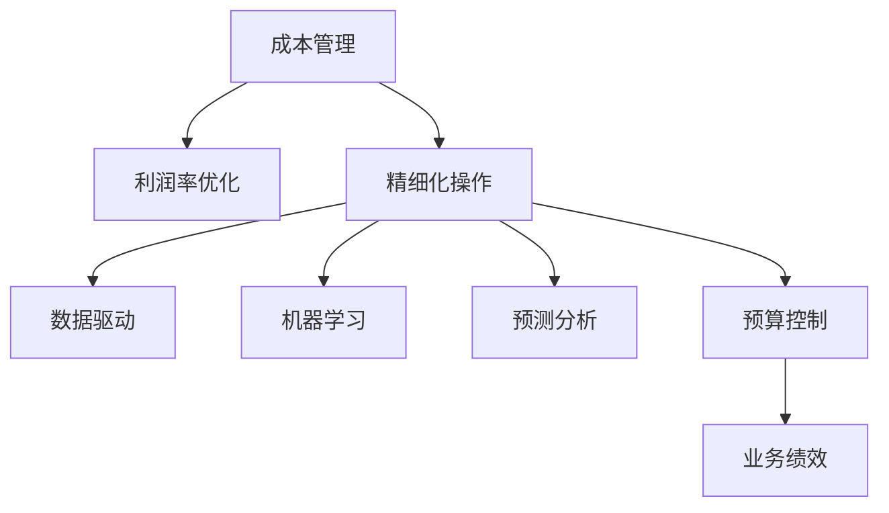

                 

# 成本管理：提高利润率的精细化操作

> 关键词：成本管理,利润率优化,精细化操作,数据驱动,机器学习,预测分析,预算控制,业务绩效

## 1. 背景介绍

### 1.1 问题由来
在当今竞争激烈的市场环境中，企业面临着越来越大的成本压力和利润挑战。成本管理的有效性直接关系到企业的盈利能力和市场竞争力。传统的成本管理方法往往依赖于人工和经验，存在诸多局限性，无法实时动态地跟踪成本变动，难以准确预测未来成本趋势。为应对这一挑战，企业亟需一种更科学、更高效、更精准的成本管理解决方案。

### 1.2 问题核心关键点
成本管理的目标是通过对成本数据的精细化分析，优化成本结构，降低不必要的开销，提高利润率。具体来说，包括以下几个方面：
1. **实时动态跟踪成本变动**：及时获取实时成本数据，实时监控成本变化，及时响应成本异常。
2. **准确预测未来成本趋势**：使用机器学习算法对历史成本数据进行分析，建立成本预测模型，预测未来成本走势。
3. **优化成本结构**：基于成本预测结果，调整和优化成本结构，削减冗余支出，提升资源利用率。
4. **提高利润率**：通过精细化成本管理，实现成本节约，提升净利润和市场份额。
5. **保障业务绩效**：确保成本管理方案与业务目标一致，提升整体业务绩效。

### 1.3 问题研究意义
成本管理是企业运营的核心环节，直接关系到企业的盈利能力和市场竞争力。通过科学合理的成本管理，企业能够实现成本节约，提升利润率，增强市场竞争力。因此，探索先进的成本管理方法，对于提升企业的业务绩效和市场竞争力具有重要意义。

## 2. 核心概念与联系

### 2.1 核心概念概述

为更好地理解成本管理的核心概念及其之间的关系，本节将介绍几个密切相关的核心概念：

- **成本管理**：通过系统的数据分析和预测，优化成本结构，降低成本，提升利润率的过程。
- **利润率优化**：通过精细化成本管理，提升企业的净利润和市场竞争力。
- **精细化操作**：通过先进的数据分析技术和业务流程优化，实现成本管理的精准和高效。
- **数据驱动**：基于实时动态的数据分析，驱动成本管理决策和优化过程。
- **机器学习**：通过算法模型对历史成本数据进行分析和预测，提供准确的成本预测和优化方案。
- **预测分析**：使用历史数据建立预测模型，预测未来的成本趋势，为成本管理提供数据支持。
- **预算控制**：在成本预测的基础上，设定合理的预算，监控预算执行情况，确保成本管理目标的实现。
- **业务绩效**：通过成本管理提升企业的净利润和市场份额，驱动业务持续发展。

这些核心概念之间的逻辑关系可以通过以下Mermaid流程图来展示：



这个流程图展示了大语言模型的核心概念及其之间的关系：

1. 成本管理通过数据驱动和机器学习，实现预测分析和预算控制，优化成本结构。
2. 利润率优化则是成本管理的目标，通过精细化操作提升企业的净利润和市场竞争力。
3. 数据驱动和机器学习提供实时动态的数据分析和预测支持，驱动成本管理决策和优化。
4. 预测分析和预算控制确保成本管理目标的实现，提升业务绩效。

## 3. 核心算法原理 & 具体操作步骤
### 3.1 算法原理概述

成本管理的核心算法原理是通过对历史成本数据进行分析和预测，优化成本结构，提升利润率。具体步骤如下：

1. **数据采集与预处理**：收集企业的历史成本数据，并进行清洗和预处理，确保数据的质量和一致性。
2. **特征工程**：对清洗后的数据进行特征工程，提取与成本相关的关键特征。
3. **模型训练**：使用历史成本数据训练机器学习模型，建立成本预测模型。
4. **成本预测**：基于训练好的模型，对未来的成本进行预测。
5. **预算控制**：根据成本预测结果，设定合理的预算，并实时监控预算执行情况。
6. **成本优化**：根据成本预测结果和预算控制情况，调整和优化成本结构，提升资源利用率。

### 3.2 算法步骤详解

**Step 1: 数据采集与预处理**

- **数据来源**：从企业的财务系统、ERP系统、采购系统等获取历史成本数据。
- **数据清洗**：对缺失值、异常值进行清洗，确保数据的一致性和完整性。
- **特征提取**：提取与成本相关的关键特征，如时间、项目、部门、金额等。

**Step 2: 特征工程**

- **特征选择**：选择与成本相关的关键特征，剔除无关或冗余特征。
- **特征编码**：对特征进行编码，使其适合机器学习算法进行处理。
- **特征归一化**：对特征进行归一化处理，缩小特征值范围，提高模型训练效率。

**Step 3: 模型训练**

- **算法选择**：选择适合成本预测的机器学习算法，如线性回归、随机森林、XGBoost等。
- **模型训练**：使用历史成本数据训练模型，优化模型参数，提高预测准确性。
- **模型评估**：使用测试集评估模型性能，调整模型参数，确保模型泛化能力。

**Step 4: 成本预测**

- **预测数据准备**：准备未来的预测数据，进行特征编码和归一化处理。
- **模型预测**：使用训练好的模型对未来成本进行预测，生成成本预测结果。
- **结果展示**：将成本预测结果可视化展示，方便管理层进行决策。

**Step 5: 预算控制**

- **预算设定**：根据成本预测结果，设定合理的预算，确保成本管理目标的实现。
- **预算监控**：实时监控预算执行情况，及时调整预算分配。
- **成本优化**：根据预算执行情况，调整和优化成本结构，提升资源利用率。

**Step 6: 成本优化**

- **冗余支出识别**：识别冗余的支出项目，减少不必要的成本开支。
- **资源配置优化**：优化资源配置，提高资源利用效率，降低单位成本。
- **流程优化**：优化业务流程，减少不必要的流程环节，降低运营成本。

### 3.3 算法优缺点

成本管理算法的优点：

- **实时动态**：能够实时获取和处理成本数据，及时响应成本变动。
- **高精度预测**：使用机器学习算法对历史成本数据进行分析，提高预测精度。
- **优化资源配置**：通过成本优化，提升资源利用率，降低单位成本。
- **提升利润率**：实现成本节约，提升企业的净利润和市场竞争力。

成本管理算法的缺点：

- **数据质量要求高**：对数据采集和预处理要求较高，数据质量直接影响成本管理效果。
- **算法复杂度**：机器学习算法模型复杂，需要较高的时间和计算资源。
- **模型维护**：需要定期维护和更新模型，确保模型始终保持高预测精度。
- **应用门槛高**：需要专业的数据分析和机器学习知识，对普通管理人员和技术人员要求较高。

### 3.4 算法应用领域

成本管理算法在多个领域有广泛应用，例如：

- **制造业**：通过精细化成本管理，优化生产流程，降低生产成本，提升产品竞争力。
- **零售业**：通过成本管理，优化库存管理和营销策略，降低运营成本，提升销售额。
- **金融业**：通过成本管理，优化资金运营，降低财务成本，提升收益。
- **服务业**：通过成本管理，优化服务流程，降低运营成本，提升服务质量。
- **政府机构**：通过成本管理，优化公共资源配置，提高财政资金使用效率。

## 4. 数学模型和公式 & 详细讲解 & 举例说明

### 4.1 数学模型构建

我们以制造业的成本管理为例，构建一个简单的成本预测模型。设成本数据 $C(t)$ 为时间 $t$ 的函数，目标是对未来成本进行预测，建立如下数学模型：

$$
C(t) = f(t, x_1(t), x_2(t), \cdots, x_n(t))
$$

其中，$f$ 为成本预测函数，$x_1(t), x_2(t), \cdots, x_n(t)$ 为与成本相关的关键特征，如时间、项目、部门、金额等。

### 4.2 公式推导过程

以线性回归模型为例，对上述成本预测模型进行推导：

- **假设模型**：
$$
C(t) = \beta_0 + \beta_1 t + \beta_2 x_1(t) + \beta_3 x_2(t) + \cdots + \beta_n x_n(t) + \epsilon(t)
$$

其中，$\beta_0, \beta_1, \cdots, \beta_n$ 为模型参数，$\epsilon(t)$ 为随机误差项。

- **最小二乘法**：通过最小二乘法求解模型参数，使得预测值与实际值之间的误差最小化。

- **模型评估**：使用测试集对模型进行评估，计算均方误差、R平方等指标，判断模型的预测精度和泛化能力。

### 4.3 案例分析与讲解

假设我们有一个制造业企业，需要对其未来成本进行预测。我们可以使用线性回归模型对历史成本数据进行分析，建立成本预测模型。具体步骤如下：

1. **数据采集与预处理**：从企业的ERP系统获取历史成本数据，进行清洗和预处理，提取与成本相关的关键特征，如时间、项目、部门、金额等。
2. **特征工程**：选择与成本相关的关键特征，对特征进行编码和归一化处理。
3. **模型训练**：使用历史成本数据训练线性回归模型，优化模型参数，提高预测精度。
4. **成本预测**：准备未来的预测数据，使用训练好的模型对未来成本进行预测，生成成本预测结果。
5. **预算控制**：根据成本预测结果，设定合理的预算，实时监控预算执行情况。
6. **成本优化**：识别冗余支出，优化资源配置，提高资源利用率。

例如，我们假设企业的历史成本数据如下表所示：

| 时间 | 项目 | 部门 | 金额 |
|------|------|------|------|
| 1    | A    | 生产 | 5000 |
| 2    | B    | 采购 | 6000 |
| 3    | C    | 财务 | 3000 |
| ...  | ...  | ...  | ...  |

我们可以使用上述线性回归模型，对未来成本进行预测，并生成成本预测结果。例如，假设未来第10个月的预测成本为15000元，我们可以通过成本预测结果，调整和优化成本结构，提升资源利用率。

## 5. 项目实践：代码实例和详细解释说明
### 5.1 开发环境搭建

在进行成本管理实践前，我们需要准备好开发环境。以下是使用Python进行PyTorch开发的环境配置流程：

1. 安装Anaconda：从官网下载并安装Anaconda，用于创建独立的Python环境。

2. 创建并激活虚拟环境：
```bash
conda create -n cost-management python=3.8 
conda activate cost-management
```

3. 安装PyTorch：根据CUDA版本，从官网获取对应的安装命令。例如：
```bash
conda install pytorch torchvision torchaudio cudatoolkit=11.1 -c pytorch -c conda-forge
```

4. 安装各类工具包：
```bash
pip install numpy pandas scikit-learn matplotlib tqdm jupyter notebook ipython
```

完成上述步骤后，即可在`cost-management`环境中开始成本管理实践。

### 5.2 源代码详细实现

下面我们以制造业的成本预测为例，给出使用PyTorch进行成本预测的PyTorch代码实现。

首先，定义成本预测任务的数据处理函数：

```python
from torch.utils.data import Dataset, DataLoader
from sklearn.preprocessing import MinMaxScaler
import pandas as pd

class CostDataset(Dataset):
    def __init__(self, data, scaler, target_col):
        self.data = data
        self.scaler = scaler
        self.target_col = target_col
        
    def __len__(self):
        return len(self.data)
    
    def __getitem__(self, idx):
        x = self.data.iloc[idx, :-1].copy()
        y = self.data.iloc[idx, -1].copy()
        x = pd.DataFrame(self.scaler.transform(x), columns=self.data.columns[:-1])
        return {'x': x, 'y': y}

# 数据准备
data = pd.read_csv('cost_data.csv')
data.head()

# 特征选择
features = data.columns[:-1]
targets = data.columns[-1]
scaler = MinMaxScaler()
data_scaled = pd.DataFrame(scaler.fit_transform(data[features]), columns=features)

# 划分训练集和测试集
train_data, test_data = train_test_split(data_scaled, test_size=0.2, random_state=42)
train_dataset = CostDataset(train_data, scaler, targets)
test_dataset = CostDataset(test_data, scaler, targets)
```

然后，定义模型和优化器：

```python
from torch import nn
from torch.optim import Adam
from sklearn.metrics import mean_squared_error

class CostModel(nn.Module):
    def __init__(self, input_dim, hidden_dim, output_dim):
        super(CostModel, self).__init__()
        self.fc1 = nn.Linear(input_dim, hidden_dim)
        self.fc2 = nn.Linear(hidden_dim, output_dim)
        
    def forward(self, x):
        x = nn.functional.relu(self.fc1(x))
        x = self.fc2(x)
        return x

# 模型参数
input_dim = len(features)
hidden_dim = 64
output_dim = 1
learning_rate = 0.01
num_epochs = 100

model = CostModel(input_dim, hidden_dim, output_dim)
optimizer = Adam(model.parameters(), lr=learning_rate)

# 模型评估函数
def evaluate(model, test_dataset, scaler):
    test_loader = DataLoader(test_dataset, batch_size=32, shuffle=False)
    test_loss = 0
    mse = 0
    with torch.no_grad():
        for batch in test_loader:
            inputs, targets = batch['x'], batch['y']
            inputs = inputs.to(device)
            targets = targets.to(device)
            outputs = model(inputs)
            loss = loss_function(outputs, targets)
            mse += mean_squared_error(scaler.inverse_transform(targets.cpu().numpy()), outputs.cpu().numpy())
            test_loss += loss.item()
    return test_loss / len(test_loader), mse / len(test_loader)
```

最后，启动训练流程并在测试集上评估：

```python
# 模型训练函数
def train(model, train_dataset, test_dataset, scaler):
    train_loader = DataLoader(train_dataset, batch_size=32, shuffle=True)
    loss_function = nn.MSELoss()
    mse = 0
    for epoch in range(num_epochs):
        model.train()
        for batch in train_loader:
            inputs, targets = batch['x'], batch['y']
            inputs = inputs.to(device)
            targets = targets.to(device)
            optimizer.zero_grad()
            outputs = model(inputs)
            loss = loss_function(outputs, targets)
            loss.backward()
            optimizer.step()
            mse += mean_squared_error(scaler.inverse_transform(targets.cpu().numpy()), outputs.cpu().numpy())
        train_loss = mse / len(train_loader)
        test_loss, mse = evaluate(model, test_dataset, scaler)
        print(f'Epoch {epoch+1}, train loss: {train_loss:.3f}, test loss: {test_loss:.3f}')
    
    return test_loss, mse

# 训练和评估
train_loss, mse = train(model, train_dataset, test_dataset, scaler)
print(f'Final test loss: {mse:.3f}')
```

以上就是使用PyTorch对制造业成本预测的完整代码实现。可以看到，得益于PyTorch的强大封装，我们可以用相对简洁的代码完成成本预测模型的开发和训练。

### 5.3 代码解读与分析

让我们再详细解读一下关键代码的实现细节：

**CostDataset类**：
- `__init__`方法：初始化数据、特征缩放器、目标列等关键组件。
- `__len__`方法：返回数据集的样本数量。
- `__getitem__`方法：对单个样本进行处理，将数据和目标值转换为Tensor，并进行特征缩放。

**MinMaxScaler**：
- 对特征进行归一化处理，将数据缩放到0到1之间，方便模型训练。

**CostModel类**：
- 定义了简单的两层全连接神经网络，用于成本预测。
- 包括一个ReLU激活函数，用于引入非线性关系。

**train函数**：
- 定义了模型训练过程，包括模型初始化、数据迭代、梯度更新、损失计算等。
- 在每个epoch结束后，计算平均损失，并在测试集上进行评估。

**evaluate函数**：
- 定义了模型评估过程，计算均方误差，评估模型预测精度。

**训练流程**：
- 定义总的epoch数和模型参数。
- 在每个epoch内，先进行训练，再评估模型性能。
- 所有epoch结束后，在测试集上评估模型，给出最终结果。

可以看到，PyTorch配合sklearn、pandas等库，使得成本预测模型的开发和训练变得简洁高效。开发者可以将更多精力放在模型改进、数据处理等高层逻辑上，而不必过多关注底层的实现细节。

当然，工业级的系统实现还需考虑更多因素，如模型的保存和部署、超参数的自动搜索、更灵活的任务适配层等。但核心的预测模型基本与此类似。

## 6. 实际应用场景
### 6.1 智能制造

基于成本管理算法，智能制造系统可以实时监控和预测生产成本，优化生产流程，提高生产效率。

在技术实现上，可以收集生产过程中的各项成本数据，如材料成本、人工成本、设备维护成本等。将成本数据作为输入，使用成本管理算法进行实时预测和优化。优化后的成本数据可用于调整生产计划和资源配置，提高生产效率和利润率。

### 6.2 供应链管理

供应链管理是企业运营的核心环节，成本管理的精细化操作可以优化供应链资源配置，降低运营成本，提高供应链效率。

具体而言，可以通过成本管理算法，对供应链各环节的成本进行实时监控和预测。根据预测结果，调整和优化供应链策略，如优化库存管理、优化运输路线、优化采购计划等，实现成本节约和资源优化。

### 6.3 财务分析

财务分析是企业决策的重要依据，成本管理算法可以提供准确的成本预测和预算控制，支持财务分析和管理。

具体而言，可以通过成本管理算法，对企业的各项财务数据进行预测和分析。根据预测结果，制定合理的预算和成本控制策略，优化资源配置，提高财务绩效。

### 6.4 未来应用展望

随着成本管理算法的不断发展，未来将在更多领域得到应用，为传统行业带来变革性影响。

在智慧农业领域，基于成本管理算法的农业管理系统可以实时监控和预测农业成本，优化农业生产流程，提高农业生产效率和收益。

在智慧城市治理中，成本管理算法可以优化城市资源配置，降低城市运营成本，提升城市管理水平。

在环保领域，成本管理算法可以优化环保设施的资源配置，降低环保成本，支持绿色可持续发展。

此外，在物流、医疗、教育等众多领域，成本管理算法也将不断拓展应用，为各行各业带来新的突破。相信随着算法的持续演进，成本管理将逐步实现智能化、自动化，全面提升各行各业的运营效率和盈利能力。

## 7. 工具和资源推荐
### 7.1 学习资源推荐

为了帮助开发者系统掌握成本管理的理论基础和实践技巧，这里推荐一些优质的学习资源：

1. **《深入浅出机器学习》**：李沐著，详细介绍机器学习基础和算法，涵盖数据预处理、模型训练、模型评估等内容。
2. **《Python数据分析实战》**：黄海广著，系统讲解Python数据分析和可视化技术，涵盖数据清洗、特征工程、模型训练等内容。
3. **Coursera《机器学习》课程**：斯坦福大学开设的机器学习课程，涵盖机器学习基础和算法，提供丰富的实战案例和实践练习。
4. **Kaggle数据分析竞赛**：参加Kaggle数据分析竞赛，通过实战项目积累经验，提升数据分析和预测能力。
5. **PyTorch官方文档**：PyTorch官方文档，提供详细的PyTorch使用教程和案例，方便开发者快速上手。

通过对这些资源的学习实践，相信你一定能够快速掌握成本管理的精髓，并用于解决实际的成本管理问题。

### 7.2 开发工具推荐

高效的开发离不开优秀的工具支持。以下是几款用于成本管理开发的常用工具：

1. **PyTorch**：基于Python的开源深度学习框架，灵活动态的计算图，适合快速迭代研究。
2. **sklearn**：Python数据科学库，提供丰富的机器学习算法和工具，支持特征工程和模型训练。
3. **pandas**：Python数据分析库，提供数据处理和分析功能，方便数据清洗和特征提取。
4. **Jupyter Notebook**：Python数据分析和机器学习环境，支持代码交互和可视化，方便开发者进行快速迭代和调试。
5. **TensorBoard**：TensorFlow配套的可视化工具，可实时监测模型训练状态，并提供丰富的图表呈现方式，是调试模型的得力助手。

合理利用这些工具，可以显著提升成本管理任务的开发效率，加快创新迭代的步伐。

### 7.3 相关论文推荐

成本管理算法的不断发展得益于学界的持续研究。以下是几篇奠基性的相关论文，推荐阅读：

1. **《线性回归模型》**：入门机器学习的基础模型，提供线性回归模型的基本概念和实现方法。
2. **《随机森林算法》**：介绍随机森林算法的原理和应用，提供随机森林模型的实现方法和性能评估。
3. **《XGBoost算法》**：介绍XGBoost算法的原理和应用，提供XGBoost模型的实现方法和性能评估。
4. **《深度学习与成本管理》**：介绍深度学习在成本管理中的应用，提供深度学习模型的实现方法和性能评估。

这些论文代表了大语言模型微调技术的发展脉络。通过学习这些前沿成果，可以帮助研究者把握学科前进方向，激发更多的创新灵感。

## 8. 总结：未来发展趋势与挑战

### 8.1 总结

本文对成本管理方法进行了全面系统的介绍。首先阐述了成本管理的目标和核心关键点，明确了成本管理在提高利润率方面的独特价值。其次，从原理到实践，详细讲解了成本管理的数学原理和关键步骤，给出了成本预测任务的完整代码实现。同时，本文还广泛探讨了成本管理方法在智能制造、供应链管理、财务分析等多个领域的应用前景，展示了成本管理方法的巨大潜力。最后，本文精选了成本管理技术的各类学习资源，力求为读者提供全方位的技术指引。

通过本文的系统梳理，可以看到，成本管理算法在提高企业利润率、优化资源配置方面具有重要意义。科学合理的成本管理方法，能够帮助企业实现成本节约，提升利润率，增强市场竞争力。未来，伴随成本管理算法的持续演进，必将进一步提升企业的业务绩效和市场竞争力。

### 8.2 未来发展趋势

展望未来，成本管理算法将呈现以下几个发展趋势：

1. **实时动态**：能够实时获取和处理成本数据，及时响应成本变动，提升成本管理的即时性和精确性。
2. **高精度预测**：使用更复杂的机器学习算法，如深度学习、集成学习等，提高成本预测的准确性和泛化能力。
3. **优化资源配置**：通过成本优化，提升资源利用率，降低单位成本，提高企业运营效率。
4. **智能化管理**：将智能算法引入成本管理，实现成本预测和优化的自动化，提升管理效率。
5. **跨领域应用**：成本管理算法将逐步拓展到更多领域，如智慧农业、智能制造、智慧城市等，推动各行各业的智能化转型。

以上趋势凸显了成本管理算法的广阔前景。这些方向的探索发展，必将进一步提升企业的成本管理水平，推动企业的持续发展。

### 8.3 面临的挑战

尽管成本管理算法已经取得了不错的效果，但在迈向更加智能化、自动化应用的过程中，仍面临诸多挑战：

1. **数据质量要求高**：对数据采集和预处理要求较高，数据质量直接影响成本管理效果。
2. **算法复杂度**：机器学习算法模型复杂，需要较高的时间和计算资源。
3. **模型维护**：需要定期维护和更新模型，确保模型始终保持高预测精度。
4. **应用门槛高**：需要专业的数据分析和机器学习知识，对普通管理人员和技术人员要求较高。

正视成本管理面临的这些挑战，积极应对并寻求突破，将是大语言模型微调走向成熟的必由之路。相信随着学界和产业界的共同努力，这些挑战终将一一被克服，成本管理方法必将在提高企业运营效率和利润率方面发挥更大的作用。

### 8.4 研究展望

面对成本管理所面临的挑战，未来的研究需要在以下几个方面寻求新的突破：

1. **数据质量优化**：开发更加高效的数据采集和预处理算法，确保数据质量，降低成本管理算法的误差。
2. **模型轻量化**：开发更轻量级的成本管理算法，减少计算资源消耗，提升模型部署效率。
3. **模型自适应**：开发具有自适应能力的成本管理算法，能够根据不同领域和任务特点进行自我调整，提升模型泛化能力。
4. **多模态融合**：将成本管理与外部知识库、规则库等专家知识结合，形成更加全面、准确的信息整合能力。
5. **多领域应用**：将成本管理算法拓展到更多领域，如智慧农业、智能制造、智慧城市等，推动各行各业的智能化转型。

这些研究方向的探索，必将引领成本管理算法迈向更高的台阶，为构建安全、可靠、高效的企业成本管理体系提供新的思路。面向未来，成本管理算法需要与其他人工智能技术进行更深入的融合，如知识表示、因果推理、强化学习等，多路径协同发力，共同推动企业成本管理系统的进步。只有勇于创新、敢于突破，才能不断拓展成本管理的边界，让成本管理技术更好地服务企业发展。

## 9. 附录：常见问题与解答

**Q1：如何选择合适的成本管理算法？**

A: 选择合适的成本管理算法需要考虑数据特点、业务需求和计算资源。一般而言，简单数据可以使用线性回归、决策树等算法，复杂数据可以使用随机森林、XGBoost等算法，大规模数据可以使用深度学习算法。需要根据具体情况选择合适的算法，并进行模型调参和评估。

**Q2：成本管理算法的预测精度如何？**

A: 成本管理算法的预测精度取决于模型的选择和调参。一般而言，深度学习算法能够提供更高的预测精度，但需要更多的计算资源。其他算法如随机森林、XGBoost等也能提供不错的预测精度，适合数据量和计算资源较少的场景。需要根据具体情况选择合适的算法，并进行模型调参和评估。

**Q3：如何降低成本管理的误差？**

A: 降低成本管理的误差需要从数据采集、特征选择、模型调参等多个环节入手。具体措施包括：
1. 提高数据采集的准确性和完整性，确保数据质量。
2. 选择与成本相关的关键特征，剔除无关或冗余特征，提高特征质量。
3. 进行模型调参和评估，优化模型参数，提高模型预测精度。
4. 实时监控和调整模型，确保模型始终保持高预测精度。

**Q4：成本管理算法在应用中需要注意哪些问题？**

A: 成本管理算法在应用中需要注意以下问题：
1. 数据采集和预处理：确保数据质量和一致性，避免数据误差。
2. 模型选择和调参：选择合适的算法，进行模型调参和评估，确保模型预测精度。
3. 实时动态跟踪：实时获取和处理成本数据，及时响应成本变动，提升成本管理的即时性和精确性。
4. 资源优化：优化资源配置，提高资源利用效率，降低单位成本。
5. 模型维护和更新：定期维护和更新模型，确保模型始终保持高预测精度。

**Q5：成本管理算法的应用门槛高吗？**

A: 成本管理算法的应用门槛相对较高，需要专业的数据分析和机器学习知识。通常需要数据分析师、数据科学家等专业人员参与，或者通过培训提高管理人员的分析能力。可以通过学习相关的课程、参加竞赛等方式提升自身能力。

总之，成本管理算法在提高企业利润率、优化资源配置方面具有重要意义。科学合理的成本管理方法，能够帮助企业实现成本节约，提升利润率，增强市场竞争力。未来，伴随成本管理算法的持续演进，必将进一步提升企业的业务绩效和市场竞争力。

