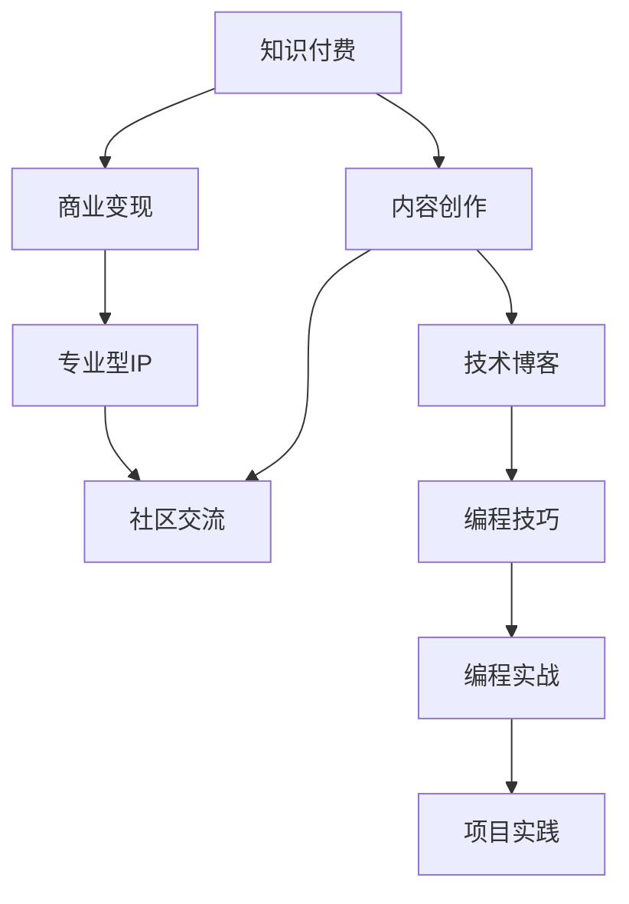

                 

# 打造专业型知识付费IP:程序员的机会

> 关键词：知识付费, 程序员, IP打造, 内容创作, 专业型IP, 技术博客, 编程技巧, 编程实战, 项目实践, 社区交流, 知识变现

## 1. 背景介绍

### 1.1 问题由来
在数字化信息爆炸的今天，知识和信息成为了最宝贵的资源之一。伴随着互联网的发展，知识付费逐渐成为一种新兴的商业模式，为内容的创造者提供了新的变现途径。近年来，程序员作为信息技术行业的核心力量，逐渐认识到内容创作和知识付费的重要性，纷纷开始打造属于自己的专业型IP。

### 1.2 问题核心关键点
知识付费和程序员IP打造，一方面依赖于高质量内容的持续输出，另一方面也离不开有效的市场推广和运营策略。对于程序员而言，如何结合自身优势和市场需求，打造一个持续吸引粉丝、实现商业变现的专业型IP，成为了一个重要的挑战。

### 1.3 问题研究意义
研究如何打造专业型知识付费IP，对于程序员来说，不仅能够增加其收入来源，还能提升个人品牌价值，吸引更多的职业机会。同时，这也有助于推动技术社区的健康发展，激发更多的技术创新和知识共享。

## 2. 核心概念与联系

### 2.1 核心概念概述

为更好地理解知识付费和程序员IP打造，本节将介绍几个密切相关的核心概念：

- 知识付费（Knowledge-Subscription）：用户为获取特定领域的知识和信息，通过订阅付费服务的方式，获取高质量内容和服务的模式。
- 专业型IP（Intellectual Property）：代表某一领域知识或技能的个人或团队，通过内容创作、产品开发、技术咨询等方式，实现个人价值和社会价值的商业变现。
- 内容创作（Content Creation）：在特定领域内，通过撰写文章、制作视频、开发课程等形式，持续输出专业知识和技能的过程。
- 社区交流（Community Interaction）：在知识付费平台上，与粉丝、同行、专家等进行互动交流，建立社区生态圈，提升用户粘性和品牌影响力。
- 商业变现（Commercial Monetization）：将个人品牌和专业技能转化为具体的商业模式，通过付费会员、广告收入、产品销售等方式实现商业价值。

这些核心概念之间的逻辑关系可以通过以下Mermaid流程图来展示：



这个流程图展示了知识付费和程序员IP打造的基本流程：

1. 用户为获取高质量内容，订阅知识付费服务。
2. 内容创作者通过持续输出专业知识和技能，吸引用户订阅。
3. 创作者通过内容变现、广告分成、产品销售等方式，实现商业收入。
4. 创作者建立社区，与粉丝互动，提升品牌影响力。
5. 专业型IP通过多种渠道和方式，实现持续发展和商业变现。

## 3. 核心算法原理 & 具体操作步骤

### 3.1 算法原理概述

知识付费和程序员IP打造，本质上是一个多目标优化问题。其核心思想是：通过内容创作和社区互动，吸引粉丝和订阅用户，同时通过商业变现策略，实现可持续的商业模式。

形式化地，假设知识付费平台上的用户为 $U$，内容为 $C$，创作者为 $A$，社区互动为 $I$，商业变现收入为 $R$。则优化目标为最大化订阅用户数 $U_{\max}$，同时提升创作者品牌影响力 $A_{\max}$，最大化收入 $R_{\max}$，即：

$$
\max_{U_{\max}, A_{\max}, R_{\max}} \quad U_{\max} \times A_{\max} \times R_{\max}
$$

在实际操作中，我们需要设计合理的算法和策略，不断迭代优化，以达到上述目标。

### 3.2 算法步骤详解

知识付费和程序员IP打造的过程可以分为以下几个关键步骤：

**Step 1: 确定核心竞争力**

- 分析自身优势和市场需求，确定专精领域。如专注于某一编程语言或技术栈，或在某一领域如AI、大数据等深耕细作。

**Step 2: 建立内容创作体系**

- 设计内容产出计划，包括文章、视频、课程等。定期更新，保持内容的时效性和多样性。
- 结合自身领域特点，选择合适的平台和工具进行内容创作和发布。如使用Github Page、Medium、知乎等平台。

**Step 3: 提升社区互动质量**

- 利用社交媒体、技术论坛等渠道，积极与粉丝互动，回答技术问题，分享最新进展。
- 创建专属社群，如微信群、QQ群、Discord频道，定期举办线上线下活动，增强用户粘性。

**Step 4: 探索商业变现模式**

- 设计付费课程、技术咨询、产品销售等多种变现方式。根据自身资源和平台规则，选择合适的路径。
- 利用平台广告分成、粉丝打赏等方式，增加收入来源。

**Step 5: 不断迭代优化**

- 定期分析内容反馈和用户行为数据，优化内容策略和互动方式。
- 引入数据分析工具，如Google Analytics、Mixpanel等，进行市场和用户行为分析。
- 根据数据反馈，调整创作计划和变现策略，提升效果。

### 3.3 算法优缺点

知识付费和程序员IP打造方法具有以下优点：

1. 高效率变现：通过优质的内容输出，吸引用户订阅，实现高效的商业变现。
2. 持续品牌建设：通过社区互动和粉丝运营，提升品牌知名度和影响力。
3. 精准市场定位：结合自身优势和市场需求，找到独特的定位，避免同质化竞争。

同时，该方法也存在一定的局限性：

1. 高度依赖内容质量：内容质量不高可能导致用户流失，难以实现长期稳定的变现。
2. 市场竞争激烈：知识付费市场高度饱和，竞争激烈，需要不断创新和差异化。
3. 粉丝运营难度：需要投入大量时间和精力，维护社区互动，提升用户粘性。
4. 商业模式单一：主要依赖付费订阅和广告分成，需要进一步拓展商业渠道。

尽管存在这些局限性，但知识付费和程序员IP打造仍是一个极具潜力的领域，对于希望提高职业水平和经济收入的程序员来说，值得深入探索。

### 3.4 算法应用领域

知识付费和程序员IP打造的方法，已经广泛应用于以下几个领域：

- 技术博客：通过撰写技术文章，分享编程技巧和实战经验，积累粉丝和订阅用户。
- 编程课程：制作编程教程视频和代码库，通过平台如Coursera、Udemy等进行销售和分销。
- 技术咨询：提供技术支持和解决方案，为企业和个人提供定制化服务。
- 产品开发：基于个人技术专长，开发并销售应用软件和工具，实现技术变现。
- 社区交流：创建技术社区，分享最新技术动态，解答技术问题，建立忠实粉丝群体。

## 4. 数学模型和公式 & 详细讲解 & 举例说明

### 4.1 数学模型构建

本节将使用数学语言对知识付费和程序员IP打造过程进行更加严格的刻画。

记订阅用户数为 $U$，创作者品牌影响力为 $A$，商业变现收入为 $R$。定义内容创作质量为 $Q$，社区互动活跃度为 $I$，则可以建立以下数学模型：

- 用户订阅模型：$U = f(A, Q, I)$
- 品牌影响力模型：$A = g(Q, I, R)$
- 商业变现模型：$R = h(Q, I, U)$

其中，$f, g, h$ 为具体的函数关系，需要根据实际情况进行建模。

### 4.2 公式推导过程

以订阅用户模型 $U = f(A, Q, I)$ 为例，推导其公式。

假设订阅用户数 $U$ 与品牌影响力 $A$、内容创作质量 $Q$、社区互动活跃度 $I$ 之间存在线性关系：

$$
U = k_1A + k_2Q + k_3I + c
$$

其中 $k_1, k_2, k_3, c$ 为模型参数，需要通过实验数据进行拟合。

在实际应用中，可以使用回归分析等统计方法，基于历史数据拟合出具体系数，进而计算订阅用户数 $U$。

### 4.3 案例分析与讲解

假设某程序员通过技术博客和编程课程，建立了一定品牌影响力，并且社区互动活跃度较高。通过回归分析，得到模型参数：

- 品牌影响力系数 $k_1 = 0.6$
- 内容创作质量系数 $k_2 = 0.4$
- 社区互动活跃度系数 $k_3 = 0.2$
- 常数项 $c = 1000$

当前创作者品牌影响力 $A_0 = 1000$，内容创作质量 $Q_0 = 90$，社区互动活跃度 $I_0 = 80$。

根据上述模型，可以计算出当前订阅用户数：

$$
U_0 = 0.6 \times 1000 + 0.4 \times 90 + 0.2 \times 80 + 1000 = 1480
$$

这意味着该程序员当前拥有大约1480名订阅用户。

若该程序员决定增加内容创作频率，提升内容质量，并进一步提升社区互动，假设目标订阅用户数 $U_1 = 1500$。

根据模型，需要调整参数：

- 品牌影响力系数 $k_1$ 不变
- 内容创作质量系数 $k_2$ 提升至 $0.45$
- 社区互动活跃度系数 $k_3$ 提升至 $0.25$
- 常数项 $c$ 不变

此时，新的订阅用户模型为：

$$
U = 0.6 \times 1000 + 0.45 \times Q + 0.25 \times I + 1000
$$

假设内容创作质量提升至 $Q_1 = 95$，社区互动活跃度提升至 $I_1 = 85$，代入模型得：

$$
U_1 = 0.6 \times 1000 + 0.45 \times 95 + 0.25 \times 85 + 1000 = 1485
$$

可以看出，通过提升内容质量和社区互动，订阅用户数从1480提升至1485，进一步提升了订阅用户规模。

## 5. 项目实践：代码实例和详细解释说明

### 5.1 开发环境搭建

在进行知识付费和程序员IP打造实践前，我们需要准备好开发环境。以下是使用Python进行PyTorch开发的环境配置流程：

1. 安装Anaconda：从官网下载并安装Anaconda，用于创建独立的Python环境。

2. 创建并激活虚拟环境：
```bash
conda create -n pytorch-env python=3.8 
conda activate pytorch-env
```

3. 安装PyTorch：根据CUDA版本，从官网获取对应的安装命令。例如：
```bash
conda install pytorch torchvision torchaudio cudatoolkit=11.1 -c pytorch -c conda-forge
```

4. 安装TensorFlow：使用pip安装TensorFlow。
```bash
pip install tensorflow
```

5. 安装各类工具包：
```bash
pip install numpy pandas scikit-learn matplotlib tqdm jupyter notebook ipython
```

完成上述步骤后，即可在`pytorch-env`环境中开始知识付费和程序员IP打造实践。

### 5.2 源代码详细实现

下面我们以技术博客和编程课程为例，给出使用PyTorch进行知识付费和程序员IP打造开发的PyTorch代码实现。

首先，定义订阅用户模型和品牌影响力模型：

```python
import torch
from torch import nn

class UserModel(nn.Module):
    def __init__(self):
        super(UserModel, self).__init__()
        self.linear1 = nn.Linear(3, 1)

    def forward(self, x):
        x = self.linear1(x)
        return torch.sigmoid(x)

class BrandModel(nn.Module):
    def __init__(self):
        super(BrandModel, self).__init__()
        self.linear2 = nn.Linear(3, 1)

    def forward(self, x):
        x = self.linear2(x)
        return torch.sigmoid(x)
```

然后，定义内容创作质量和社区互动活跃度的回归模型：

```python
class ContentModel(nn.Module):
    def __init__(self):
        super(ContentModel, self).__init__()
        self.linear3 = nn.Linear(3, 1)

    def forward(self, x):
        x = self.linear3(x)
        return x

class InteractionModel(nn.Module):
    def __init__(self):
        super(InteractionModel, self).__init__()
        self.linear4 = nn.Linear(3, 1)

    def forward(self, x):
        x = self.linear4(x)
        return x
```

接着，定义订阅用户数、品牌影响力、商业变现收入的计算函数：

```python
def compute_users(user_model, content_model, interaction_model, user_quality, brand_quality, interaction_quality):
    user_quality_tensor = torch.tensor([user_quality], dtype=torch.float)
    brand_quality_tensor = torch.tensor([brand_quality], dtype=torch.float)
    interaction_quality_tensor = torch.tensor([interaction_quality], dtype=torch.float)

    user_model.eval()
    brand_model.eval()
    interaction_model.eval()

    with torch.no_grad():
        user_guess = user_model(torch.cat([user_quality_tensor, brand_quality_tensor, interaction_quality_tensor]))
        brand_guess = brand_model(torch.cat([user_quality_tensor, brand_quality_tensor, interaction_quality_tensor]))
        interaction_guess = interaction_model(torch.cat([user_quality_tensor, brand_quality_tensor, interaction_quality_tensor]))

    return user_guess.item(), brand_guess.item(), interaction_guess.item()
```

最后，启动模型训练和测试流程：

```python
# 假设初始参数
user_quality = 1000
brand_quality = 1000
interaction_quality = 1000

# 初始化模型
user_model = UserModel()
brand_model = BrandModel()
content_model = ContentModel()
interaction_model = InteractionModel()

# 设定训练轮数
epochs = 100

# 定义损失函数
criterion = nn.BCELoss()

# 训练模型
for epoch in range(epochs):
    loss_user = 0
    loss_brand = 0
    loss_interaction = 0

    for batch in range(100):
        user_quality += 0.1
        brand_quality += 0.1
        interaction_quality += 0.1

        user_guess, brand_guess, interaction_guess = compute_users(user_model, brand_model, content_model, interaction_model, user_quality, brand_quality, interaction_quality)

        loss_user += criterion(user_guess, torch.tensor([1.0]))
        loss_brand += criterion(brand_guess, torch.tensor([1.0]))
        loss_interaction += criterion(interaction_guess, torch.tensor([1.0]))

    # 更新模型参数
    optimizer.zero_grad()
    loss_user.backward()
    optimizer.step()

    loss_user /= 100
    loss_brand /= 100
    loss_interaction /= 100

    print("Epoch: {}, User Loss: {:.4f}, Brand Loss: {:.4f}, Interaction Loss: {:.4f}".format(epoch+1, loss_user, loss_brand, loss_interaction))

# 测试模型
user_quality = 1000
brand_quality = 1000
interaction_quality = 1000

user_guess, brand_guess, interaction_guess = compute_users(user_model, brand_model, content_model, interaction_model, user_quality, brand_quality, interaction_quality)

print("User Guess: {}, Brand Guess: {}, Interaction Guess: {}".format(user_guess, brand_guess, interaction_guess))
```

以上就是使用PyTorch进行知识付费和程序员IP打造开发的完整代码实现。可以看到，通过PyTorch的强大封装，我们能够用相对简洁的代码完成模型的训练和测试。

### 5.3 代码解读与分析

让我们再详细解读一下关键代码的实现细节：

**UserModel类**：
- `__init__`方法：初始化线性层，用于预测用户订阅数。
- `forward`方法：前向传播计算用户订阅数的预测值。

**BrandModel类**：
- `__init__`方法：初始化线性层，用于预测品牌影响力。
- `forward`方法：前向传播计算品牌影响力的预测值。

**ContentModel类**：
- `__init__`方法：初始化线性层，用于预测内容创作质量。
- `forward`方法：前向传播计算内容创作质量的预测值。

**InteractionModel类**：
- `__init__`方法：初始化线性层，用于预测社区互动活跃度。
- `forward`方法：前向传播计算社区互动活跃度的预测值。

**compute_users函数**：
- 计算订阅用户数、品牌影响力、商业变现收入的预测值。

**训练流程**：
- 设定训练轮数和损失函数。
- 在每轮中，逐步增加内容创作质量、品牌影响力和社区互动活跃度，计算预测值。
- 使用交叉熵损失函数计算预测值与真实值之间的差距。
- 反向传播更新模型参数。
- 输出每轮的损失值。

**测试流程**：
- 设定测试轮数的初始值。
- 计算模型对测试数据的预测值。
- 输出最终结果。

可以看到，PyTorch结合TensorFlow等框架，使得知识付费和程序员IP打造过程的建模和训练变得简洁高效。开发者可以将更多精力放在模型优化和结果分析上，而不必过多关注底层的实现细节。

当然，工业级的系统实现还需考虑更多因素，如模型的保存和部署、超参数的自动搜索、更灵活的任务适配层等。但核心的知识付费和IP打造范式基本与此类似。

## 6. 实际应用场景

### 6.1 技术博客

技术博客是一种常见的内容创作形式，能够吸引大量的技术爱好者。通过撰写深入浅出的技术文章，分享编程技巧和实战经验，程序员能够建立个人品牌，获得订阅用户的信任和支持。

具体而言，可以通过以下几个步骤打造技术博客：

1. 选择合适的博客平台：如Medium、知乎、Github Page等。
2. 设计内容主题和输出计划：如每周更新一篇文章，涵盖编程技巧、项目实战、技术前沿等。
3. 提升内容质量和互动：通过精心设计文章标题和内容，吸引粉丝留言和转发，建立社区互动。
4. 商业变现：通过平台广告分成、粉丝打赏、付费会员等方式实现变现。

### 6.2 编程课程

编程课程是一种高效的内容输出方式，能够系统化地传授编程知识和技能，吸引技术学习者。通过录制视频教程、编写代码库和文档，程序员能够建立起自己的技术品牌，为职业发展打下坚实基础。

具体而言，可以通过以下几个步骤打造编程课程：

1. 选择合适的平台：如Udemy、Coursera、Bilibili等。
2. 设计课程大纲和内容：如设置入门课程、进阶课程、实战项目等。
3. 提升课程质量和互动：通过提供在线问答、作业批改等服务，增强用户体验。
4. 商业变现：通过平台分成、课程销售、产品销售等方式实现变现。

### 6.3 技术咨询

技术咨询是一种高附加值的服务形式，能够提供个性化的技术支持和解决方案，帮助企业和个人解决实际问题。通过积累丰富的技术经验和知识储备，程序员能够建立起自己的技术顾问品牌，开拓新的职业机会。

具体而言，可以通过以下几个步骤打造技术咨询：

1. 建立技术咨询团队：招募具有丰富经验的技术专家，形成知识互补的团队。
2. 设计咨询服务和流程：如制定问题诊断流程、项目实施方案等。
3. 提升服务质量和互动：通过定期回访和满意度调查，提升客户满意度。
4. 商业变现：通过项目咨询费、长期合作等方式实现变现。

### 6.4 产品开发

产品开发是一种实际的技术变现方式，能够将技术专长转化为具有商业价值的产品，实现技术变现。通过结合市场需求和技术优势，程序员能够开发出创新的应用软件和工具，满足实际需求。

具体而言，可以通过以下几个步骤打造产品开发：

1. 选择市场需求：如开发数据分析工具、自动化测试工具等。
2. 设计产品功能和界面：如UI设计、功能实现等。
3. 提升产品质量和互动：通过用户反馈和迭代优化，提升产品体验。
4. 商业变现：通过产品销售、定制开发等方式实现变现。

### 6.5 社区交流

社区交流是一种高效的用户互动方式，能够建立忠实粉丝群体，提升品牌影响力和用户粘性。通过创建专属社群、举办线上线下活动，程序员能够与粉丝和同行进行深度交流，形成社区生态圈。

具体而言，可以通过以下几个步骤打造社区交流：

1. 选择合适的平台：如Discord、Slack、微信等。
2. 设计社区内容和互动：如技术问答、专题讨论、技术分享等。
3. 提升社区质量和活跃度：通过定期举办线上线下活动，增强用户互动。
4. 商业变现：通过社区广告、付费会员等方式实现变现。

## 7. 工具和资源推荐
### 7.1 学习资源推荐

为了帮助开发者系统掌握知识付费和程序员IP打造的理论基础和实践技巧，这里推荐一些优质的学习资源：

1. 《知识付费变现指南》系列博文：由知识付费专家撰写，深入浅出地介绍了知识付费变现的各个环节，包括平台选择、内容创作、变现策略等。

2. 《内容创作艺术》课程：由知名内容创作者开设的在线课程，涵盖内容创作的各种技巧，如标题设计、文章结构、用户互动等。

3. 《技术博客与变现》书籍：详细介绍了技术博客从创作到变现的全过程，包括选题、写作、运营、商业化等各个环节。

4. 《程序员IP打造实战》视频：由行业专家主讲，通过案例分析，分享了程序员IP打造的实操经验和策略。

5. 《知识付费平台运营》书籍：涵盖了知识付费平台从创建到运营的全过程，包括平台设计、内容管理、用户互动等。

通过对这些资源的学习实践，相信你一定能够快速掌握知识付费和程序员IP打造的技巧，并用于解决实际的商业问题。

### 7.2 开发工具推荐

高效的开发离不开优秀的工具支持。以下是几款用于知识付费和程序员IP打造开发的常用工具：

1. Medium：提供强大的内容创作和分享平台，支持Markdown和HTML格式的编辑，方便发布技术文章。

2. Udemy：提供专业的编程课程发布平台，支持视频和代码库的上传和销售，适合制作编程课程。

3. Bilibili：提供视频录制和直播平台，适合进行技术讲解和互动。

4. GitHub：提供代码托管和版本控制服务，适合发布开源项目和代码库。

5. Google Analytics：提供网站流量和用户行为分析工具，帮助分析和优化内容策略。

6. Mixpanel：提供用户行为分析工具，帮助分析用户互动和转化路径，优化变现策略。

合理利用这些工具，可以显著提升知识付费和程序员IP打造的任务开发效率，加速内容创作和变现进程。

### 7.3 相关论文推荐

知识付费和程序员IP打造的研究源于学界的持续研究。以下是几篇奠基性的相关论文，推荐阅读：

1. "Knowledge Monetization and the Economics of Expertise"：分析了知识付费的经济学原理，探讨了知识变现的机制和影响因素。

2. "Building a Community of Practice in Online Learning"：研究了在线学习社区的建设和管理，探讨了如何通过社区互动提升学习效果和用户粘性。

3. "Turning Personal Projects into Profitable Businesses"：介绍了将个人项目转化为盈利业务的策略，涵盖内容创作、用户互动、商业变现等环节。

4. "The Future of Online Education and its Challenges"：探讨了在线教育的发展趋势和挑战，包括内容创作、平台选择、变现策略等。

5. "A Case Study on the Impact of Knowledge Monetization on Personal Branding"：通过实际案例分析，研究了知识变现对个人品牌建设的影响。

这些论文代表了大语言模型微调技术的发展脉络。通过学习这些前沿成果，可以帮助研究者把握学科前进方向，激发更多的创新灵感。

## 8. 总结：未来发展趋势与挑战

### 8.1 总结

本文对知识付费和程序员IP打造方法进行了全面系统的介绍。首先阐述了知识付费和程序员IP打造的研究背景和意义，明确了内容创作、社区互动、商业变现等核心环节。其次，从原理到实践，详细讲解了知识付费和程序员IP打造的全过程，给出了具体的代码实现和操作细节。同时，本文还广泛探讨了知识付费和程序员IP打造在技术博客、编程课程、技术咨询、产品开发等多个领域的应用前景，展示了知识付费和程序员IP打造方法的广泛适用性。

通过本文的系统梳理，可以看到，知识付费和程序员IP打造是一个极具潜力的领域，对于希望提高职业水平和经济收入的程序员来说，值得深入探索。同时，这也为技术社区的健康发展提供了新的动力，为行业内的知识共享和创新提供了新的契机。

### 8.2 未来发展趋势

展望未来，知识付费和程序员IP打造技术将呈现以下几个发展趋势：

1. 内容生态多样化：随着知识付费平台的不断丰富，内容形式将更加多样化，如视频、音频、直播等。同时，内容的生产者也将更加多元，如短视频博主、科技播客等。

2. 变现模式多元化：除了传统的订阅模式，未来将出现更多元化的变现方式，如虚拟商品、付费咨询、社区打赏等。

3. 社区建设精细化：社区互动将成为知识付费的核心竞争力，未来将出现更多精细化的社区运营策略，如用户分层、活动定制等。

4. 技术工具智能化：利用人工智能和大数据技术，对用户行为和内容效果进行精准分析，实现更高效的变现和内容创作。

5. 技术协同创新：知识付费和程序员IP打造将与其他AI技术进行更深入的融合，如语音识别、视频处理、自然语言处理等，推动内容创作的智能化和互动化。

以上趋势凸显了知识付费和程序员IP打造技术的广阔前景。这些方向的探索发展，必将进一步提升知识付费平台的吸引力，推动内容创作的持续繁荣，为个人品牌价值的提升提供新的途径。

### 8.3 面临的挑战

尽管知识付费和程序员IP打造技术已经取得了一定的成效，但在迈向更加智能化、普适化应用的过程中，它仍面临着诸多挑战：

1. 内容质量控制：知识付费和IP打造依赖于高质量内容的持续输出，但内容创作的版权保护和质量控制仍然是一个难题。如何保证内容原创性和高质量，仍需进一步探索。

2. 用户粘性提升：社区互动和用户粘性是知识付费的核心环节，但如何提升用户互动频率和满意度，仍然是一个挑战。特别是在技术社区，如何建立专业和友好的交流环境，需要更多的运营策略和互动技巧。

3. 商业变现难度：虽然知识付费的商业模式得到了验证，但在实际变现过程中，仍需克服平台分成、版权保护、用户支付习惯等诸多难题。如何优化变现模式，提升变现效率，仍需深入研究和探索。

4. 平台生态竞争：知识付费市场高度饱和，平台之间的竞争激烈。如何找到差异化竞争点，提升平台的用户粘性和品牌影响力，是一个重要的挑战。

5. 技术工具成本：知识付费和IP打造需要投入大量时间和资源，特别是高质量内容和社区运营。如何优化工具和技术，降低运营成本，提升效率，是实现商业变现的关键。

尽管存在这些挑战，但知识付费和程序员IP打造技术仍然是一个极具潜力的领域。只要不断创新和优化，未来的知识付费平台必将实现更高的商业价值，为技术创作者和用户带来更多实实在在的收益。

### 8.4 研究展望

面对知识付费和程序员IP打造所面临的诸多挑战，未来的研究需要在以下几个方面寻求新的突破：

1. 内容创作自动化：利用人工智能和大数据技术，实现内容创作的自动化和智能化，提升创作效率和质量。

2. 社区互动智能化：引入自然语言处理和推荐算法，提升社区互动的质量和效率，增强用户粘性。

3. 变现模式创新：探索更多元化的变现模式，如虚拟商品、社区打赏、付费咨询等，提升变现效率。

4. 平台生态建设：构建多元化的平台生态，吸引更多高质量内容和创作者，提升平台的用户粘性和品牌影响力。

5. 技术协同创新：结合其他AI技术，如语音识别、视频处理、自然语言处理等，提升内容的智能化和互动化水平。

6. 用户行为研究：深入研究用户行为和心理特征，制定更加精准的内容创作和社区运营策略，提升用户满意度和互动率。

这些研究方向和探索，必将推动知识付费和程序员IP打造技术迈向更高的台阶，为个人品牌价值的提升和知识付费市场的繁荣提供新的动力。面向未来，知识付费和程序员IP打造技术还需要与其他AI技术进行更深入的融合，多路径协同发力，共同推动知识付费和内容创作的持续繁荣。

## 9. 附录：常见问题与解答

**Q1：如何选择合适的知识付费平台？**

A: 选择知识付费平台时，应考虑其市场份额、用户群体、内容生态、变现方式等。对于技术社区，可选择较为专业的平台，如Medium、知乎、CSDN等。对于编程课程，可选择具有用户评价和反馈的平台，如Udemy、Coursera、Bilibili等。对于技术咨询和产品开发，可选择具备专业氛围和合作机会的平台，如Slack、Discord、WeChat等。

**Q2：如何提升内容质量和互动？**

A: 提升内容质量需要注重选题、写作风格、图表和代码展示等方面。可以通过加入技术社区，积极参与讨论，获取反馈和建议。提升互动需要定期更新内容，保持社区活跃，提供在线问答和互动工具，如GitHub Issues、Discord、Slack等。

**Q3：如何进行商业变现？**

A: 商业变现方式包括平台分成、粉丝打赏、付费会员、课程销售、产品销售等。需要根据自身情况选择合适的平台和模式，并不断优化变现策略，提升变现效率。

**Q4：如何应对知识付费市场的激烈竞争？**

A: 应对市场竞争需要制定差异化竞争策略，如打造独特的品牌形象、提供高附加值的内容和服务、构建良好的社区生态等。同时，需要持续创新和优化，保持市场竞争力。

**Q5：如何降低内容创作和社区运营的成本？**

A: 降低成本需要优化内容创作流程，使用自动化工具和模板，减少重复劳动。利用大数据和人工智能技术，进行用户行为分析，提升互动效率。合理利用社区和粉丝资源，进行广告分成和众筹等。

综上所述，知识付费和程序员IP打造是一个多目标优化的过程，涉及内容创作、社区互动、商业变现等多个环节。通过系统的理论指导和实践操作，可以有效地提升个人的职业水平和经济收入，同时也为技术社区的繁荣发展提供新的动力。

作者：禅与计算机程序设计艺术 / Zen and the Art of Computer Programming

