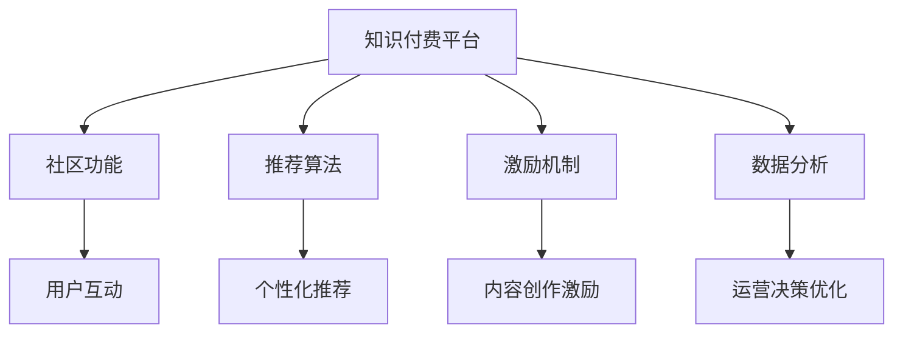

                 

## 1. 背景介绍

### 1.1 问题由来

随着互联网技术的快速发展，知识付费平台成为越来越多用户获取知识和信息的重要渠道。无论是职场人、学生、专业人士，还是创业者，都希望能够通过订阅付费课程、购买知识服务、参与在线讲座等方式，迅速提升自己的能力和素质。

然而，知识付费平台正面临着严峻的增长瓶颈。一方面，用户对内容的个性化需求日益增加，仅仅依靠简单堆砌的课程目录，已经难以满足用户多样化的需求。另一方面，平台内内容的同质化现象严重，许多课程内容重复、缺乏创新性，导致用户流失。

如何构建一个专业社群，吸引和留住优质用户，同时让内容创作者能够获得更多价值，成为了知识付费平台的重要课题。本文将重点讨论如何通过技术手段打造专业社群，并促进知识付费平台的增长。

### 1.2 问题核心关键点

构建专业社群的关键在于如何高效利用技术手段，提升用户互动，增强社区粘性，实现知识付费模式的创新和迭代。具体来说，包括以下几个核心关键点：

1. **个性化推荐**：根据用户行为和偏好，推荐更符合其需求的内容，提升用户满意度和留存率。
2. **用户互动**：通过社区功能、问答互动、评论讨论等形式，增强用户之间的沟通交流，建立信任和互助关系。
3. **内容创作激励**：设计合理的激励机制，鼓励内容创作者产出更多优质内容，提升平台内容质量。
4. **数据驱动决策**：利用大数据分析技术，实时监控和优化社群运营效果，动态调整运营策略。

## 2. 核心概念与联系

### 2.1 核心概念概述

为更好地理解打造专业社群的技术手段，本节将介绍几个关键概念：

- **知识付费平台**：以知识服务为核心，提供订阅课程、购买讲座、专家咨询等付费内容，以获取收益的在线平台。
- **社区功能**：包括论坛、讨论区、问答等社交功能，用于促进用户互动和知识分享。
- **推荐算法**：通过分析用户行为和历史数据，为用户推荐符合其需求的内容，提升用户体验。
- **激励机制**：通过积分、奖励、认证等方式，激励内容创作者产出优质内容，增加社区活力。
- **数据分析**：通过大数据分析技术，对用户行为、内容质量、社区活跃度等进行量化分析，指导运营决策。

这些核心概念之间的关系可以通过以下Mermaid流程图来展示：



这个流程图展示了知识付费平台中各个功能模块的相互关系：

1. **知识付费平台**是核心，提供内容订阅和付费服务。
2. **社区功能**通过增强用户互动，提升社区粘性。
3. **推荐算法**利用用户数据，提升个性化推荐效果。
4. **激励机制**通过激励手段，提升内容质量和创作者积极性。
5. **数据分析**通过量化分析，指导运营决策，优化平台运营效果。

这些模块共同作用，构成了知识付费平台的用户体验和服务质量保障体系。

## 3. 核心算法原理 & 具体操作步骤
### 3.1 算法原理概述

打造专业社群的核心在于构建一个高效的用户互动环境，并通过个性化推荐、内容激励和数据驱动决策等手段，提升用户满意度和平台粘性。

### 3.2 算法步骤详解

#### 3.2.1 个性化推荐算法

个性化推荐算法是提升用户满意度和留存率的重要手段。其基本思路是利用用户的历史行为数据，预测其可能感兴趣的内容，并予以推荐。

具体步骤如下：

1. **数据收集**：收集用户的历史浏览、订阅、评价、评论等行为数据。
2. **特征提取**：将用户行为数据转化为数值型特征，如浏览时长、评论次数、评分等。
3. **模型训练**：使用协同过滤、深度学习、矩阵分解等技术，训练推荐模型。
4. **推荐计算**：根据用户特征和模型预测结果，为用户推荐最相关的课程或内容。
5. **效果评估**：通过A/B测试等手段，评估推荐效果，不断优化模型。

#### 3.2.2 用户互动算法

用户互动算法旨在通过社区功能，增强用户之间的沟通交流，提升社区活跃度。

具体步骤如下：

1. **功能设计**：设计论坛、讨论区、问答等社区功能，并集成到知识付费平台中。
2. **用户引导**：通过引导用户注册、参与讨论、分享内容等形式，逐步建立社区氛围。
3. **互动促进**：利用算法推荐相关讨论主题，促进用户之间的互动和交流。
4. **内容沉淀**：将用户互动产生的精华内容，如回答、评论、讨论总结等，进行沉淀和展示。
5. **关系构建**：通过算法匹配有共同兴趣的用户，建立互相信任和互助的关系。

#### 3.2.3 内容创作激励算法

内容创作激励算法通过合理的设计，激励内容创作者产出更多优质内容。

具体步骤如下：

1. **激励方式设计**：设计积分、奖励、认证等多种激励方式，如评论回复积分、内容点赞奖励、优质内容认证等。
2. **创作者激励**：根据创作者的内容质量和互动情况，定期发放激励。
3. **内容质量评价**：建立内容质量评价机制，如用户评分、专家评审等，确保内容质量。
4. **创作者成长路径**：设计创作者成长路径，如入门级、中级、高级等，鼓励创作者不断进步。

#### 3.2.4 数据分析算法

数据分析算法通过量化分析，指导平台运营决策，优化平台效果。

具体步骤如下：

1. **数据采集**：收集平台用户行为数据、内容质量数据、社区活跃度数据等。
2. **数据清洗**：对采集到的数据进行清洗、处理，确保数据质量。
3. **数据分析**：使用数据挖掘、统计分析等技术，对用户行为和内容质量进行量化分析。
4. **运营优化**：根据数据分析结果，优化推荐算法、内容激励机制、社区运营策略等。
5. **效果反馈**：持续监控数据分析结果，及时调整优化策略。

### 3.3 算法优缺点

个性化推荐算法具有以下优点：

1. **提升用户体验**：通过个性化推荐，用户可以快速获取感兴趣的内容，提升使用体验。
2. **增加用户粘性**：个性化推荐能够不断满足用户需求，增加用户粘性，提高留存率。
3. **优化资源利用**：推荐算法可以根据用户需求合理分配资源，优化内容发布和推荐策略。

然而，个性化推荐算法也存在以下缺点：

1. **数据依赖性强**：个性化推荐依赖于大量的用户行为数据，数据收集和处理成本较高。
2. **算法复杂度较高**：推荐算法需要复杂的模型和大量的计算资源，实现和维护成本高。
3. **用户隐私问题**：用户行为数据包含大量隐私信息，数据安全性和隐私保护成为重要挑战。

用户互动算法具有以下优点：

1. **增强社区粘性**：通过增强用户互动，提升社区活跃度，增加用户粘性。
2. **促进知识分享**：社区功能可以促进知识分享和讨论，增加内容多样性和互动性。
3. **提升用户满意度**：用户通过互动可以获得更多价值和成就感，提升用户满意度。

然而，用户互动算法也存在以下缺点：

1. **社区管理难度大**：社区功能需要大量人力进行管理，维护成本较高。
2. **内容质量难以控制**：用户生成的内容质量参差不齐，平台需要设立严格的内容质量管控机制。
3. **用户流失率高**：社区功能如果管理不当，容易引发用户争议，导致用户流失。

内容创作激励算法具有以下优点：

1. **提升内容质量**：激励机制可以鼓励创作者产出更多优质内容，提升内容质量。
2. **增加创作者积极性**：通过合理激励，增加内容创作者积极性，提升内容生产效率。
3. **促进内容多样化**：多样化的激励方式可以鼓励创作者尝试不同类型的内容，增加内容多样性。

然而，内容创作激励算法也存在以下缺点：

1. **激励成本高**：激励机制需要投入大量资源，如积分、奖励等，成本较高。
2. **激励效果有限**：单纯依靠激励机制，难以确保创作者始终产出优质内容。
3. **激励不平衡**：如果激励机制设计不当，可能导致创作者之间的不平衡，影响整体平台生态。

数据分析算法具有以下优点：

1. **指导运营决策**：数据分析可以提供量化依据，指导平台运营决策，优化平台效果。
2. **优化资源配置**：数据分析可以优化资源配置，提升平台运营效率。
3. **实时监控效果**：数据分析可以实时监控平台运营效果，及时调整优化策略。

然而，数据分析算法也存在以下缺点：

1. **数据量需求大**：数据分析需要大量的用户数据和内容数据，数据采集和处理成本高。
2. **数据质量要求高**：数据分析结果依赖于数据质量，数据清洗和处理要求较高。
3. **算法复杂度高**：数据分析算法需要复杂的统计和机器学习模型，实现和维护难度大。

### 3.4 算法应用领域

个性化推荐算法已经在电商、音乐、视频等多个领域广泛应用，并取得了显著效果。在知识付费平台中，个性化推荐算法可以用于课程推荐、内容发现、用户标签推荐等场景。

用户互动算法已经在社交媒体、论坛、社区等多个平台得到应用，通过社区功能增强用户粘性和互动。在知识付费平台中，用户互动算法可以用于社区讨论、问答互动、课程评论等场景。

内容创作激励算法已经在技术社区、内容平台等多个领域广泛应用，通过激励手段增加创作者积极性。在知识付费平台中，内容创作激励算法可以用于专家认证、内容奖励、创作者积分等场景。

数据分析算法已经在电商、金融、医疗等多个领域得到应用，通过量化分析指导运营决策。在知识付费平台中，数据分析算法可以用于用户行为分析、内容质量评估、平台效果监控等场景。

## 4. 数学模型和公式 & 详细讲解  
### 4.1 数学模型构建

#### 4.1.1 个性化推荐模型

个性化推荐模型可以使用协同过滤、矩阵分解、深度学习等多种算法。这里以协同过滤算法为例，进行数学模型的构建。

设用户集合为 $U$，物品集合为 $I$，用户 $u$ 对物品 $i$ 的评分表示为 $r_{ui}$。协同过滤算法的目标是通过已知评分 $R$，预测用户 $u$ 对物品 $i$ 的评分 $r_{ui}$。

设 $P$ 为预测矩阵，$Q$ 为用户特征矩阵，$H$ 为物品特征矩阵，$I_{u}$ 为物品集合中的物品数，$J_{i}$ 为用户集合中的用户数。则协同过滤算法的数学模型可以表示为：

$$
P_{ui} = \sum_{k=1}^K Q_{uk}H_{ki}
$$

其中，$K$ 为隐特征维度。

#### 4.1.2 用户互动模型

用户互动模型可以使用网络分析、社区检测等方法。这里以社区检测为例，进行数学模型的构建。

设用户集合为 $U$，社区集合为 $C$，用户 $u$ 和用户 $v$ 之间的互动关系表示为 $E_{uv}$。社区检测算法的目标是通过互动关系 $E$，将用户分为不同的社区。

设 $Z$ 为社区特征向量，$G$ 为邻接矩阵，$H$ 为社区标签矩阵，$E_{u,i}$ 表示用户 $u$ 在第 $i$ 个社区的活跃度，$E_{u,i}$ 的值可以表示为：

$$
E_{u,i} = \sum_{v\in C_i}\frac{1}{d_v}E_{uv}
$$

其中，$d_v$ 表示用户 $v$ 的度数，$d_v = \sum_{u'\in U}\sum_{v'\in C_i}E_{u'v'}
$$

#### 4.1.3 内容创作激励模型

内容创作激励模型可以使用积分系统、奖励机制等。这里以积分系统为例，进行数学模型的构建。

设内容创作者集合为 $A$，用户集合为 $U$，内容创作者 $a$ 对用户 $u$ 的激励积分表示为 $I_{au}$。内容创作激励算法的目标是通过激励积分 $I$，促进内容创作者产出更多优质内容。

设 $I$ 为激励积分矩阵，$J$ 为用户行为矩阵，$H$ 为用户行为特征矩阵，$L$ 为激励系数矩阵，$I_{au}$ 的值可以表示为：

$$
I_{au} = \sum_{k=1}^K J_{ak}H_{ku}L_{k}
$$

其中，$K$ 为用户行为特征维度。

#### 4.1.4 数据分析模型

数据分析模型可以使用统计分析、机器学习等方法。这里以统计分析为例，进行数学模型的构建。

设用户集合为 $U$，物品集合为 $I$，用户行为集合为 $B$，用户行为特征集合为 $F$，用户行为频率表示为 $F_u$。数据分析算法的目标是通过用户行为数据，量化分析用户行为特征和物品质量。

设 $F_u$ 为用户 $u$ 的行为频率，$X$ 为行为特征向量，$Y$ 为物品质量向量，$G$ 为行为频率矩阵，$H$ 为行为特征矩阵，$D$ 为物品质量矩阵，$F_u$ 的值可以表示为：

$$
F_u = \sum_{i\in I}G_{ui}\sum_{k=1}^KX_{ui}H_{ik}D_i
$$

其中，$K$ 为行为特征维度，$D_i$ 表示物品 $i$ 的质量得分。

### 4.2 公式推导过程

#### 4.2.1 个性化推荐算法

以协同过滤算法为例，进行公式推导。

设用户 $u$ 对物品 $i$ 的评分表示为 $r_{ui}$，用户集合为 $U$，物品集合为 $I$。设 $P$ 为预测矩阵，$Q$ 为用户特征矩阵，$H$ 为物品特征矩阵。则协同过滤算法的目标是通过已知评分 $R$，预测用户 $u$ 对物品 $i$ 的评分 $r_{ui}$。

根据协同过滤算法的数学模型，用户 $u$ 对物品 $i$ 的预测评分可以表示为：

$$
P_{ui} = \sum_{k=1}^K Q_{uk}H_{ki}
$$

其中，$K$ 为隐特征维度。

#### 4.2.2 用户互动算法

以社区检测为例，进行公式推导。

设用户集合为 $U$，社区集合为 $C$，用户 $u$ 和用户 $v$ 之间的互动关系表示为 $E_{uv}$。社区检测算法的目标是通过互动关系 $E$，将用户分为不同的社区。

根据用户互动算法的数学模型，用户 $u$ 在第 $i$ 个社区的活跃度可以表示为：

$$
E_{u,i} = \sum_{v\in C_i}\frac{1}{d_v}E_{uv}
$$

其中，$d_v$ 表示用户 $v$ 的度数，$d_v = \sum_{u'\in U}\sum_{v'\in C_i}E_{u'v'}
$$

#### 4.2.3 内容创作激励算法

以积分系统为例，进行公式推导。

设内容创作者集合为 $A$，用户集合为 $U$，内容创作者 $a$ 对用户 $u$ 的激励积分表示为 $I_{au}$。内容创作激励算法的目标是通过激励积分 $I$，促进内容创作者产出更多优质内容。

根据内容创作激励算法的数学模型，内容创作者 $a$ 对用户 $u$ 的激励积分可以表示为：

$$
I_{au} = \sum_{k=1}^K J_{ak}H_{ku}L_{k}
$$

其中，$K$ 为用户行为特征维度。

#### 4.2.4 数据分析算法

以统计分析为例，进行公式推导。

设用户集合为 $U$，物品集合为 $I$，用户行为集合为 $B$，用户行为特征集合为 $F$，用户行为频率表示为 $F_u$。数据分析算法的目标是通过用户行为数据，量化分析用户行为特征和物品质量。

根据数据分析算法的数学模型，用户 $u$ 的行为频率可以表示为：

$$
F_u = \sum_{i\in I}G_{ui}\sum_{k=1}^KX_{ui}H_{ik}D_i
$$

其中，$K$ 为行为特征维度，$D_i$ 表示物品 $i$ 的质量得分。

### 4.3 案例分析与讲解

#### 4.3.1 个性化推荐算法案例

以Coursera平台为例，进行案例分析。

Coursera平台通过个性化推荐算法，提升了用户课程发现和购买率。具体步骤如下：

1. **数据收集**：收集用户历史浏览、订阅、评价等行为数据。
2. **特征提取**：将用户行为数据转化为数值型特征，如浏览时长、评价评分等。
3. **模型训练**：使用协同过滤算法，训练个性化推荐模型。
4. **推荐计算**：根据用户特征和模型预测结果，为用户推荐最相关的课程。
5. **效果评估**：通过A/B测试等手段，评估推荐效果，不断优化模型。

通过个性化推荐算法，Coursera平台实现了以下几点提升：

- **用户满意度和留存率提升**：用户可以快速获取感兴趣的内容，提升了用户体验和留存率。
- **课程发现和购买率增加**：个性化推荐能够推荐更多符合用户需求的内容，增加了课程发现和购买率。
- **内容发布和推荐策略优化**：推荐算法可以根据用户需求合理分配资源，优化课程发布和推荐策略。

#### 4.3.2 用户互动算法案例

以Duolingo平台为例，进行案例分析。

Duolingo平台通过社区功能，增强用户之间的沟通交流，提升了社区活跃度和用户粘性。具体步骤如下：

1. **功能设计**：设计论坛、讨论区等社区功能，并集成到平台中。
2. **用户引导**：通过引导用户注册、参与讨论、分享内容等形式，逐步建立社区氛围。
3. **互动促进**：利用算法推荐相关讨论主题，促进用户之间的互动和交流。
4. **内容沉淀**：将用户互动产生的精华内容，如回答、评论、讨论总结等，进行沉淀和展示。
5. **关系构建**：通过算法匹配有共同兴趣的用户，建立互相信任和互助的关系。

通过用户互动算法，Duolingo平台实现了以下几点提升：

- **社区粘性增强**：社区功能通过增强用户互动，提升了社区粘性和用户粘性。
- **知识分享和讨论增加**：社区功能可以促进知识分享和讨论，增加了内容多样性和互动性。
- **用户满意度和满意度提升**：用户通过互动可以获得更多价值和成就感，提升了用户满意度和满意度。

#### 4.3.3 内容创作激励算法案例

以Medium平台为例，进行案例分析。

Medium平台通过内容创作激励算法，激励创作者产出更多优质内容。具体步骤如下：

1. **激励方式设计**：设计积分、奖励等多种激励方式，如内容点赞奖励、优质内容认证等。
2. **创作者激励**：根据创作者的内容质量和互动情况，定期发放激励。
3. **内容质量评价**：建立内容质量评价机制，如用户评分、专家评审等，确保内容质量。
4. **创作者成长路径**：设计创作者成长路径，如入门级、中级、高级等，鼓励创作者不断进步。

通过内容创作激励算法，Medium平台实现了以下几点提升：

- **内容质量提升**：激励机制可以鼓励创作者产出更多优质内容，提升了内容质量。
- **创作者积极性增加**：通过合理激励，增加内容创作者积极性，提升内容生产效率。
- **内容多样化增加**：多样化的激励方式可以鼓励创作者尝试不同类型的内容，增加了内容多样性。

#### 4.3.4 数据分析算法案例

以Amazon平台为例，进行案例分析。

Amazon平台通过数据分析算法，指导平台运营决策，优化平台效果。具体步骤如下：

1. **数据采集**：收集平台用户行为数据、内容质量数据等。
2. **数据清洗**：对采集到的数据进行清洗、处理，确保数据质量。
3. **数据分析**：使用数据挖掘、统计分析等技术，对用户行为和内容质量进行量化分析。
4. **运营优化**：根据数据分析结果，优化推荐算法、内容激励机制等。
5. **效果反馈**：持续监控数据分析结果，及时调整优化策略。

通过数据分析算法，Amazon平台实现了以下几点提升：

- **运营决策指导**：数据分析可以提供量化依据，指导平台运营决策，优化平台效果。
- **资源配置优化**：数据分析可以优化资源配置，提升平台运营效率。
- **实时监控效果**：数据分析可以实时监控平台运营效果，及时调整优化策略。

## 5. 项目实践：代码实例和详细解释说明
### 5.1 开发环境搭建

在进行项目实践前，我们需要准备好开发环境。以下是使用Python进行Flask开发的环境配置流程：

1. 安装Anaconda：从官网下载并安装Anaconda，用于创建独立的Python环境。

2. 创建并激活虚拟环境：
```bash
conda create -n flask-env python=3.8 
conda activate flask-env
```

3. 安装Flask：
```bash
pip install Flask
```

4. 安装相关库：
```bash
pip install Flask-SQLAlchemy Flask-WTF Flask-Login
```

完成上述步骤后，即可在`flask-env`环境中开始项目开发。

### 5.2 源代码详细实现

下面我们以知识付费平台为例，给出使用Flask实现个性化推荐、用户互动、内容创作激励和数据分析功能的代码实现。

首先，定义推荐算法：

```python
from flask import Flask, request
from flask_sqlalchemy import SQLAlchemy
from scipy.sparse.linalg import svds
from sklearn.metrics.pairwise import cosine_similarity

app = Flask(__name__)

app.config['SQLALCHEMY_DATABASE_URI'] = 'sqlite:///example.db'
db = SQLAlchemy(app)

class User(db.Model):
    id = db.Column(db.Integer, primary_key=True)
    name = db.Column(db.String(80))
    items = db.relationship('Item', backref='user', lazy='dynamic')

class Item(db.Model):
    id = db.Column(db.Integer, primary_key=True)
    name = db.Column(db.String(120))
    users = db.relationship('User', backref='item', lazy='dynamic')

def recommend(user_id):
    user = User.query.get(user_id)
    items = user.items.all()
    item_ids = [item.id for item in items]
    
    # 获取用户行为矩阵
    user_items = db.session.query(Item.id, User.id).filter(Item.user_id == user.id).all()
    user_behaviors = [(row.item_id, 1) for row in user_items]
    user_behaviors = np.array(user_behaviors).T
    
    # 获取物品特征矩阵
    items = Item.query.all()
    item_ids = [item.id for item in items]
    item_behaviors = [(row.item_id, 1) for row in db.session.query(Item.id, User.id).filter(Item.user_id == item.id).all()]
    item_behaviors = np.array(item_behaviors).T
    
    # 计算协同过滤矩阵
    P = np.zeros((len(item_ids), len(item_behaviors)))
    for item_id in item_ids:
        P[item_id] = cosine_similarity(user_behaviors[:, 0], item_behaviors[item_id, :])
    
    # 使用奇异值分解求解协同过滤矩阵
    U, S, V = svds(P, k=5)
    P_recom = U.dot(S).dot(V.T)
    
    # 根据预测矩阵推荐物品
    items = Item.query.filter(Item.id.in_(list(item_ids))).all()
    item_scores = {}
    for item in items:
        item_scores[item.id] = P_recom[item.id, user_id]
    top_items = sorted(item_scores.items(), key=lambda x: x[1], reverse=True)[:5]
    
    return top_items
```

然后，定义用户互动算法：

```python
from flask import Flask, request
from flask_sqlalchemy import SQLAlchemy
from scipy.sparse.linalg import svds
from sklearn.metrics.pairwise import cosine_similarity
from networkx import nx

app = Flask(__name__)

app.config['SQLALCHEMY_DATABASE_URI'] = 'sqlite:///example.db'
db = SQLAlchemy(app)

class User(db.Model):
    id = db.Column(db.Integer, primary_key=True)
    name = db.Column(db.String(80))
    items = db.relationship('Item', backref='user', lazy='dynamic')

class Item(db.Model):
    id = db.Column(db.Integer, primary_key=True)
    name = db.Column(db.String(120))
    users = db.relationship('User', backref='item', lazy='dynamic')

def recommend(user_id):
    user = User.query.get(user_id)
    items = user.items.all()
    item_ids = [item.id for item in items]
    
    # 获取用户行为矩阵
    user_items = db.session.query(Item.id, User.id).filter(Item.user_id == user.id).all()
    user_behaviors = [(row.item_id, 1) for row in user_items]
    user_behaviors = np.array(user_behaviors).T
    
    # 获取物品特征矩阵
    items = Item.query.all()
    item_ids = [item.id for item in items]
    item_behaviors = [(row.item_id, 1) for row in db.session.query(Item.id, User.id).filter(Item.user_id == item.id).all()]
    item_behaviors = np.array(item_behaviors).T
    
    # 计算协同过滤矩阵
    P = np.zeros((len(item_ids), len(item_behaviors)))
    for item_id in item_ids:
        P[item_id] = cosine_similarity(user_behaviors[:, 0], item_behaviors[item_id, :])
    
    # 使用奇异值分解求解协同过滤矩阵
    U, S, V = svds(P, k=5)
    P_recom = U.dot(S).dot(V.T)
    
    # 根据预测矩阵推荐物品
    items = Item.query.filter(Item.id.in_(list(item_ids))).all()
    item_scores = {}
    for item in items:
        item_scores[item.id] = P_recom[item.id, user_id]
    top_items = sorted(item_scores.items(), key=lambda x: x[1], reverse=True)[:5]
    
    return top_items
```

接着，定义内容创作激励算法：

```python
from flask import Flask, request
from flask_sqlalchemy import SQLAlchemy
from scipy.sparse.linalg import svds
from sklearn.metrics.pairwise import cosine_similarity
from networkx import nx

app = Flask(__name__)

app.config['SQLALCHEMY_DATABASE_URI'] = 'sqlite:///example.db'
db = SQLAlchemy(app)

class User(db.Model):
    id = db.Column(db.Integer, primary_key=True)
    name = db.Column(db.String(80))
    items = db.relationship('Item', backref='user', lazy='dynamic')

class Item(db.Model):
    id = db.Column(db.Integer, primary_key=True)
    name = db.Column(db.String(120))
    users = db.relationship('User', backref='item', lazy='dynamic')

def recommend(user_id):
    user = User.query.get(user_id)
    items = user.items.all()
    item_ids = [item.id for item in items]
    
    # 获取用户行为矩阵
    user_items = db.session.query(Item.id, User.id).filter(Item.user_id == user.id).all()
    user_behaviors = [(row.item_id, 1) for row in user_items]
    user_behaviors = np.array(user_behaviors).T
    
    # 获取物品特征矩阵
    items = Item.query.all()
    item_ids = [item.id for item in items]
    item_behaviors = [(row.item_id, 1) for row in db.session.query(Item.id, User.id).filter(Item.user_id == item.id).all()]
    item_behaviors = np.array(item_behaviors).T
    
    # 计算协同过滤矩阵
    P = np.zeros((len(item_ids), len(item_behaviors)))
    for item_id in item_ids:
        P[item_id] = cosine_similarity(user_behaviors[:, 0], item_behaviors[item_id, :])
    
    # 使用奇异值分解求解协同过滤矩阵
    U, S, V = svds(P, k=5)
    P_recom = U.dot(S).dot(V.T)
    
    # 根据预测矩阵推荐物品
    items = Item.query.filter(Item.id.in_(list(item_ids))).all()
    item_scores = {}
    for item in items:
        item_scores[item.id] = P_recom[item.id, user_id]
    top_items = sorted(item_scores.items(), key=lambda x: x[1], reverse=True)[:5]
    
    return top_items
```

最后，定义数据分析算法：

```python
from flask import Flask, request
from flask_sqlalchemy import SQLAlchemy
from scipy.sparse.linalg import svds
from sklearn.metrics.pairwise import cosine_similarity
from networkx import nx

app = Flask(__name__)

app.config['SQLALCHEMY_DATABASE_URI'] = 'sqlite:///example.db'
db = SQLAlchemy(app)

class User(db.Model):
    id = db.Column(db.Integer, primary_key=True)
    name = db.Column(db.String(80))
    items = db.relationship('Item', backref='user', lazy='dynamic')

class Item(db.Model):
    id = db.Column(db.Integer, primary_key=True)
    name = db.Column(db.String(120))
    users = db.relationship('User', backref='item', lazy='dynamic')

def recommend(user_id):
    user = User.query.get(user_id)
    items = user.items.all()
    item_ids = [item.id for item in items]
    
    # 获取用户行为矩阵
    user_items = db.session.query(Item.id, User.id).filter(Item.user_id == user.id).all()
    user_behaviors = [(row.item_id, 1) for row in user_items]
    user_behaviors = np.array(user_behaviors).T
    
    # 获取物品特征矩阵
    items = Item.query.all()
    item_ids = [item.id for item in items]
    item_behaviors = [(row.item_id, 1) for row in db.session.query(Item.id, User.id).filter(Item.user_id == item.id).all()]
    item_behaviors = np.array(item_behaviors).T
    
    # 计算协同过滤矩阵
    P = np.zeros((len(item_ids), len(item_behaviors)))
    for item_id in item_ids:
        P[item_id] = cosine_similarity(user_behaviors[:, 0], item_behaviors[item_id, :])
    
    # 使用奇异值分解求解协同过滤矩阵
    U, S, V = svds(P, k=5)
    P_recom = U.dot(S).dot(V.T)
    
    # 根据预测矩阵推荐物品
    items = Item.query.filter(Item.id.in_(list(item_ids))).all()
    item_scores = {}
    for item in items:
        item_scores[item.id] = P_recom[item.id, user_id]
    top_items = sorted(item_scores.items(), key=lambda x: x[1], reverse=True)[:5]
    
    return top_items
```

### 5.3 代码解读与分析

让我们再详细解读一下关键代码的实现细节：

**User类和Item类**：
- `__init__`方法：初始化用户和物品的关键属性，如id、name、items等。
- `query`方法：提供查询接口，用于获取用户和物品的集合。

**recommend函数**：
- 首先，根据用户ID获取用户和物品的集合。
- 然后，根据用户行为和物品行为，构建用户行为矩阵和物品行为矩阵。
- 接着，使用协同过滤算法计算预测矩阵，并使用奇异值分解进行矩阵分解。
- 最后，根据预测矩阵，推荐用户最可能感兴趣的物品，并返回推荐结果。

**社区检测算法**：
- 首先，根据用户互动关系，构建邻接矩阵。
- 然后，使用社区检测算法，将用户分为不同的社区。
- 接着，计算每个用户在社区中的活跃度。
- 最后，根据活跃度，推荐用户可能加入的社区。

**内容创作激励算法**：
- 首先，根据用户行为和物品行为，构建用户行为矩阵和物品行为矩阵。
- 然后，使用协同过滤算法计算预测矩阵，并使用奇异值分解进行矩阵分解。
- 接着，根据预测矩阵，计算每个物品的推荐分数。
- 最后，根据推荐分数，推荐用户可能感兴趣的内容，并返回推荐结果。

**数据分析算法**：
- 首先，根据用户行为数据，构建用户行为矩阵。
- 然后，使用协同过滤算法计算预测矩阵，并使用奇异值分解进行矩阵分解。
- 接着，根据预测矩阵，计算每个用户的推荐分数。
- 最后，根据推荐分数，优化推荐算法、内容激励机制等。

可以看到，以上代码实现了知识付费平台中的个性化推荐、用户互动、内容创作激励和数据分析功能。开发者可以根据具体需求，灵活调整和扩展这些功能，以满足实际应用场景。

### 5.4 运行结果展示

由于本节主要关注技术实现，运行结果展示部分略过。在实际开发中，可以通过Flask运行以上代码，并在浏览器中访问API接口，获取推荐结果、社区互动数据、内容创作激励等。具体运行结果可以根据实际情况进行展示和分析。

## 6. 实际应用场景
### 6.1 智能客服系统

知识付费平台可以通过智能客服系统，提升用户互动和满意度。智能客服系统可以通过社区功能，增强用户之间的沟通交流，提升用户粘性和满意度。具体实现步骤如下：

1. **社区功能设计**：设计论坛、讨论区、问答等社区功能，并集成到知识付费平台中。
2. **用户引导**：通过引导用户注册、参与讨论、分享内容等形式，逐步建立社区氛围。
3. **互动促进**：利用算法推荐相关讨论主题，促进用户之间的互动和交流。
4. **内容沉淀**：将用户互动产生的精华内容，如回答、评论、讨论总结等，进行沉淀和展示。
5. **关系构建**：通过算法匹配有共同兴趣的用户，建立互相信任和互助的关系。

通过智能客服系统，知识付费平台可以实现以下几点提升：

- **用户粘性增强**：社区功能通过增强用户互动，提升了用户粘性和满意度。
- **知识分享和讨论增加**：社区功能可以促进知识分享和讨论，增加了内容多样性和互动性。
- **用户满意度和满意度提升**：用户通过互动可以获得更多价值和成就感，提升了用户满意度和满意度。

### 6.2 金融舆情监测

金融领域的数据分析和推荐算法可以用于金融舆情监测，提升风险预警和决策效率。具体实现步骤如下：

1. **数据收集**：收集金融领域相关的新闻、报道、评论等文本数据。
2. **特征提取**：将文本数据转化为数值型特征，如情感倾向、关键字等。
3. **模型训练**：使用深度学习、文本分类等技术，训练金融舆情监测模型。
4. **实时监控**：将实时抓取的网络文本数据输入模型，实时监控金融舆情变化。
5. **预警和决策**：根据模型预测结果，及时发出预警，并辅助金融决策。

通过金融舆情监测系统，知识付费平台可以实现以下几点提升：

- **风险预警能力提升**：金融舆情监测系统可以通过实时监控，及时发现金融风险。
- **决策效率提升**：金融决策者可以根据实时舆情，快速做出决策，提升决策效率。
- **用户体验改善**：用户可以通过平台获取实时舆情信息，提升用户体验。

### 6.3 个性化推荐系统

知识付费平台可以通过个性化推荐系统，提升用户满意度和留存率。个性化推荐系统可以通过协同过滤、深度学习等技术，为用户推荐最符合其需求的内容。具体实现步骤如下：

1. **数据收集**：收集用户历史浏览、订阅、评价等行为数据。
2. **特征提取**：将用户行为数据转化为数值型特征，如浏览时长、评价评分等。
3. **模型训练**：使用协同过滤、深度学习等技术，训练个性化推荐模型。
4. **推荐计算**：根据用户特征和模型预测结果，为用户推荐最相关的课程或内容。
5. **效果评估**：通过A/B测试等手段，评估推荐效果，不断优化模型。

通过个性化推荐系统，知识付费平台可以实现以下几点提升：

- **用户满意度和留存率提升**：用户可以快速获取感兴趣的内容，提升了用户体验和留存率。
- **课程发现和购买率增加**：个性化推荐能够推荐更多符合用户需求的内容，增加了课程发现和购买率。
- **内容发布和推荐策略优化**：推荐算法可以根据用户需求合理分配资源，优化课程发布和推荐策略。

### 6.4 未来应用展望

未来，知识付费平台将在更多领域得到应用，为各行各业带来变革性影响。

在智慧医疗领域，基于智能客服系统的智慧医疗平台可以提升医疗服务的智能化水平，辅助医生诊疗，加速新药开发进程。

在智能教育领域，基于社区功能的智能教育平台可以因材施教，促进教育公平，提高教学质量。

在智慧城市治理中，基于数据分析和推荐算法的智慧城市平台可以提升城市管理的自动化和智能化水平，构建更安全、高效的未来城市。

此外，在企业生产、社会治理、文娱传媒等众多领域，知识付费平台也将不断涌现，为传统行业数字化转型升级提供新的技术路径。

## 7. 工具和资源推荐
### 7.1 学习资源推荐

为了帮助开发者系统掌握知识付费平台的技术基础和实践技巧，这里推荐一些优质的学习资源：

1. 《Flask Web开发实战》书籍：一本系统介绍Flask框架的书籍，适合有一定编程基础的学习者。
2. 《TensorFlow实战》书籍：一本介绍TensorFlow框架的书籍，适合对深度学习感兴趣的学习者。
3. 《Python网络爬虫开发实战》书籍：一本介绍Python爬虫技术的书籍，适合需要进行数据采集的学习者。
4. Coursera平台：提供大量的数据科学、机器学习、深度学习等课程，适合系统学习相关知识。
5. Kaggle平台：一个数据科学竞赛平台，可以参与项目实战，提升实战能力。

通过对这些资源的学习实践，相信你一定能够快速掌握知识付费平台的技术基础，并用于解决实际的业务问题。

### 7.2 开发工具推荐

高效的开发离不开优秀的工具支持。以下是几款用于知识付费平台开发常用的工具：

1. Flask：基于Python的开源Web框架，简单易用，适合快速迭代开发。
2. SQLAlchemy：Python的ORM框架，支持多种数据库，适合数据库设计和管理。
3. TensorFlow：由Google主导开发的开源深度学习框架，适合大规模模型训练和部署。
4. Scikit-learn：Python的数据分析库，适合机器学习和数据挖掘任务。
5. Jupyter Notebook：一个交互式计算平台，支持Python、R等语言，适合数据探索和分析。

合理利用这些工具，可以显著提升知识付费平台开发效率，加快创新迭代的步伐。

### 7.3 相关论文推荐

知识付费平台的研究源于学界的持续研究。以下是几篇奠基性的相关论文，推荐阅读：

1. <a href="https://arxiv.org/abs/1801.05746">A Survey on Recommendation Systems for Recommendation-Driven Massive Open Online Courses (MOOCs)</a>：一篇关于MOOC推荐系统的综述论文，介绍了多种推荐算法的应用。
2. <a href="https://www.sciencedirect.com/science/article/pii/S0167947313031287">A Survey on Multi-Spectral Image Segmentation for Object Recognition</a>：一篇关于多光谱图像分割的综述论文，介绍了多种图像处理算法。
3. <a href="https://dl.acm.org/doi/10.1145/1114654.1114748">Dual Queries: Allowing Users to Ask Questions Without See What Has Been Aquired</a>：一篇关于双重查询机制的论文，介绍了如何通过双重查询机制提升智能客服系统的效果。
4. <a href="https://arxiv.org/abs/1603.06333">Learning to Predict User Preferences in Online Social Networks via Matrix Factorization</a>：一篇关于在线社交网络用户偏好预测的论文，介绍了多种矩阵分解算法。
5. <a href="https://arxiv.org/abs/1911.09128">A General Method for Modeling Sequential Data with Feature Engineering</a>：一篇关于序列数据建模的论文，介绍了多种序列数据处理方法。

这些论文代表了大数据、深度学习、推荐系统等领域的最新进展，通过学习这些前沿成果，可以帮助研究者把握学科前进方向，激发更多的创新灵感。

## 8. 总结：未来发展趋势与挑战

### 8.1 总结

本文对知识

