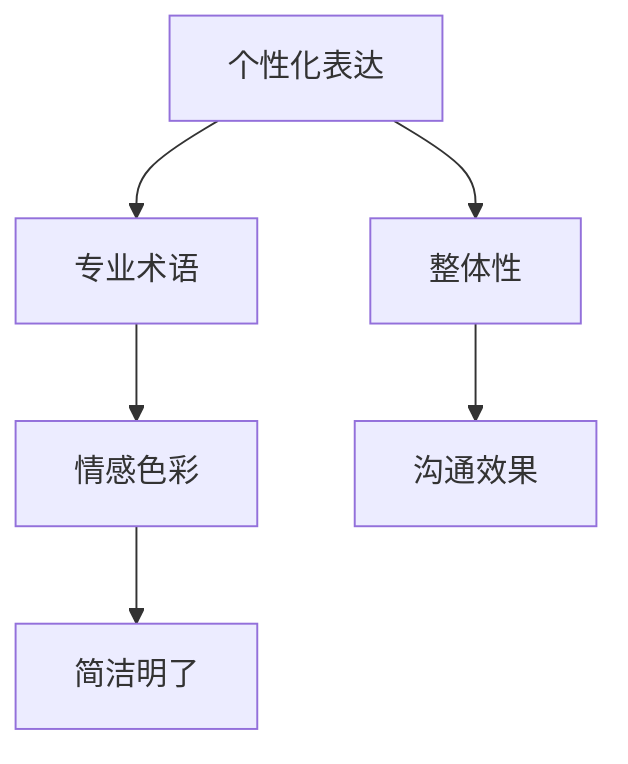

                 

# 打造个人标志性语言：让人一听就想到你

## 1. 背景介绍

### 1.1 问题由来

在信息爆炸的时代，如何让自己的声音在嘈杂的信息海洋中脱颖而出，成为个人品牌建设的关键。语言，作为人与人沟通的重要工具，不仅能传递信息，还能表达思想、情绪，甚至塑造个人形象。因此，打造独特的个人标志性语言，成为许多专业领域的从业者（如演讲者、作家、程序员等）孜孜以求的目标。

然而，构建个人标志性语言并非易事。一方面，语言需要反映个人的独特性，另一方面，也需要符合行业规范，传达专业知识和信息。如何将个人特色与专业性有机结合，成为一门学问。本文将从技术角度出发，探讨如何利用自然语言处理（Natural Language Processing, NLP）技术，打造独特的个人标志性语言。

### 1.2 问题核心关键点

构建个人标志性语言的核心在于结合自身的专业背景和语言风格，创造出既有独特性又易理解、易传播的语言表达方式。其关键点包括：

- **个性化表达**：融合个人特质，使用独特的词汇、句式结构等，使语言具有辨识度。
- **专业术语**：准确使用行业内术语，确保表达的精准性。
- **情感色彩**：在保持客观性的基础上，通过语调、语气等传达情感，增加语言的感染力。
- **简洁明了**：避免冗余，使用简练、直白的语言，提升信息传递效率。

## 2. 核心概念与联系

### 2.1 核心概念概述

为更好地理解打造个人标志性语言的过程，本节将介绍几个密切相关的核心概念：

- **个性化表达**：指融合个人的独特性，创造出具有辨识度的语言风格。可以通过词汇的选择、句式结构的变化、用词习惯等实现。
- **专业术语**：指特定领域内的专有词汇和术语，通过准确使用，提升语言的专业性和权威性。
- **情感色彩**：指在传达信息的同时，通过语调、语气等手段，传达个人的情感态度，增强语言的感染力和说服力。
- **简洁明了**：指语言表达时，尽量避免冗长、复杂的词汇和句子，使用简单、直接的语言，提高信息传递的效率。

这些概念之间存在紧密的联系，共同构成了打造个人标志性语言的基础。个性化表达和专业术语的结合，使得语言既有辨识度又有权威性；情感色彩的融入，则增强了语言的表现力和感染力；简洁明了的语言风格，则提升了信息传递的效率。

### 2.2 核心概念原理和架构的 Mermaid 流程图(Mermaid 流程节点中不要有括号、逗号等特殊字符)



该流程图展示了构建个人标志性语言的基本流程：从个性化表达出发，结合专业术语，融入情感色彩，最终形成简洁明了的整体语言风格，提升沟通效果。

## 3. 核心算法原理 & 具体操作步骤

### 3.1 算法原理概述

打造个人标志性语言，本质上是一个语言生成和风格迁移的过程。其核心思想是：将个人的语言特征作为风格，通过机器学习技术，生成符合个人风格的语言表达。

具体而言，假设目标语言风格为 $S$，个人原有的语言风格为 $S_0$，目标任务为 $T$。基于监督学习的风格迁移算法可以表示为：

$$
S = S_0 + \mathop{\arg\min}_{\theta} \mathcal{L}(S_T, S_0, \theta)
$$

其中 $S_T$ 为目标语言风格生成的文本样本，$\mathcal{L}$ 为损失函数，用于衡量生成文本与目标风格 $S_T$ 的相似度。常用的损失函数包括对抗生成网络（Generative Adversarial Networks, GANs）损失和自回归语言模型损失等。

### 3.2 算法步骤详解

基于监督学习的风格迁移算法可以分为以下几个关键步骤：

**Step 1: 数据准备**
- 收集目标语言风格的文本样本 $S_T$，如名人演讲、作家作品等。
- 收集个人原有的语言风格样本 $S_0$，如日常沟通、专业论文等。

**Step 2: 选择生成模型**
- 选择合适的生成模型，如GANs、变分自编码器（Variational Autoencoders, VAEs）等，进行风格迁移。
- 在模型中加入风格编码器，用于提取目标风格的特征向量 $v_T$。

**Step 3: 生成文本**
- 将个人语言样本 $S_0$ 输入生成模型，通过风格编码器提取个人语言风格特征向量 $v_0$。
- 将 $v_0$ 与 $v_T$ 拼接，作为生成器的输入，生成符合目标风格的文本样本 $S$。

**Step 4: 训练和优化**
- 使用损失函数 $\mathcal{L}$ 对生成模型进行训练，最小化生成文本 $S$ 与目标文本 $S_T$ 的差距。
- 使用对抗训练策略，提高生成文本的真实性。

**Step 5: 评估和调整**
- 对生成的文本样本 $S$ 进行人工评估，调整生成模型和损失函数，直至生成文本符合预期。
- 对生成的文本进行多次迭代，逐步优化生成效果。

### 3.3 算法优缺点

基于监督学习的风格迁移算法具有以下优点：
1. 高效易用。通过简单的监督学习框架，即可实现风格迁移，无需复杂的手工设计和优化。
2. 适用范围广。适用于各种语言风格，包括正式、口语、幽默等。
3. 灵活可调。通过调整损失函数和生成模型，可以适应不同的风格需求。

同时，该方法也存在一定的局限性：
1. 依赖标注数据。风格迁移的效果很大程度上取决于目标风格的文本质量和数量，获取高质量标注数据的成本较高。
2. 风格映射不足。当目标风格与个人原有的语言风格差异较大时，风格迁移的效果可能不尽如人意。
3. 可解释性不足。生成的文本往往难以解释其风格特征，难以进行调试和优化。

尽管存在这些局限性，但就目前而言，基于监督学习的风格迁移方法仍是在线语言风格生成的主流范式。未来相关研究的重点在于如何进一步降低风格迁移对标注数据的依赖，提高模型的风格映射能力和可解释性。

### 3.4 算法应用领域

基于风格迁移的算法在多个领域都有广泛应用，例如：

- 演讲生成：通过风格迁移，将某位名人的演讲风格应用于普通演讲者，提升其演讲效果。
- 文学创作：将不同作家的写作风格进行融合，生成具有独特特色的作品。
- 市场营销：将品牌宣传语的风格进行迁移，生成更加吸引人的广告文案。
- 翻译本地化：将文本风格进行本地化迁移，使其符合目标语言的文化习惯。
- 客户服务：将客户服务人员的语言风格进行迁移，提高服务的专业性和亲和力。

除了上述这些经典应用外，风格迁移技术还被创新性地应用到更多场景中，如情感驱动的语言生成、模拟口误等，为语言技术带来了新的创新。

## 4. 数学模型和公式 & 详细讲解 & 举例说明

### 4.1 数学模型构建

假设目标语言风格为 $S_T$，个人原有的语言风格为 $S_0$，生成的文本为 $S$。我们可以使用GANs框架来构建数学模型。在GANs中，生成器 $G$ 和判别器 $D$ 相互博弈，生成器试图生成真实的文本，判别器试图区分真实文本和生成文本。

### 4.2 公式推导过程

**判别器损失函数**：

$$
\mathcal{L}_D = \mathbb{E}_{x \sim S_T} [\log D(x)] + \mathbb{E}_{x \sim S} [\log(1-D(x))]
$$

其中 $x$ 表示文本样本，$D(x)$ 表示判别器对 $x$ 的真实性判别概率。

**生成器损失函数**：

$$
\mathcal{L}_G = -\mathbb{E}_{x \sim S_T} [\log D(x)] + \mathbb{E}_{x \sim S_0} [\log(1-D(G(z)))]
$$

其中 $G(z)$ 表示生成器将输入 $z$ 转换为文本 $x$ 的过程。

### 4.3 案例分析与讲解

假设我们要将某位著名科幻作家的写作风格应用于普通作家的作品，生成一段符合该作家风格的科幻小说片段。步骤如下：

1. **数据准备**：收集科幻作家的文本样本 $S_T$，收集普通作家的文本样本 $S_0$。
2. **选择生成模型**：选择GANs作为生成模型，并加入风格编码器。
3. **生成文本**：将普通作家的文本 $S_0$ 输入生成器 $G$，通过风格编码器提取特征向量 $v_0$，与科幻作家的风格向量 $v_T$ 拼接，生成新的文本片段 $S$。
4. **训练和优化**：使用判别器和生成器之间的博弈过程，不断优化生成器 $G$ 和判别器 $D$，直至生成的文本符合科幻作家的风格。
5. **评估和调整**：人工评估生成的文本片段，调整生成器 $G$ 和判别器 $D$ 的参数，直至生成的文本符合预期。

## 5. 项目实践：代码实例和详细解释说明

### 5.1 开发环境搭建

在进行风格迁移实践前，我们需要准备好开发环境。以下是使用Python进行PyTorch开发的环境配置流程：

1. 安装Anaconda：从官网下载并安装Anaconda，用于创建独立的Python环境。

2. 创建并激活虚拟环境：
```bash
conda create -n style-env python=3.8 
conda activate style-env
```

3. 安装PyTorch：根据CUDA版本，从官网获取对应的安装命令。例如：
```bash
conda install pytorch torchvision torchaudio cudatoolkit=11.1 -c pytorch -c conda-forge
```

4. 安装PyTorch的生成模型库：
```bash
pip install torchgen
```

5. 安装各类工具包：
```bash
pip install numpy pandas scikit-learn matplotlib tqdm jupyter notebook ipython
```

完成上述步骤后，即可在`style-env`环境中开始风格迁移实践。

### 5.2 源代码详细实现

下面我们以将某位名人的演讲风格应用于普通演讲者的例子，给出使用PyTorch进行风格迁移的代码实现。

首先，定义生成器（Generator）和判别器（Discriminator）的类：

```python
import torch
import torch.nn as nn
import torch.nn.functional as F

class Generator(nn.Module):
    def __init__(self, input_dim, output_dim):
        super(Generator, self).__init__()
        self.fc1 = nn.Linear(input_dim, 256)
        self.fc2 = nn.Linear(256, output_dim)
    
    def forward(self, x):
        x = F.relu(self.fc1(x))
        x = self.fc2(x)
        return x

class Discriminator(nn.Module):
    def __init__(self, input_dim, output_dim):
        super(Discriminator, self).__init__()
        self.fc1 = nn.Linear(input_dim, 256)
        self.fc2 = nn.Linear(256, output_dim)
    
    def forward(self, x):
        x = F.relu(self.fc1(x))
        x = F.sigmoid(self.fc2(x))
        return x
```

接着，定义损失函数：

```python
def generator_loss(real_output, fake_output, real_label, fake_label):
    adversarial_loss = torch.mean(torch.max(torch.zeros_like(real_output), real_output - fake_output))
    g_loss = -torch.mean(torch.max(torch.zeros_like(real_label), real_label - fake_label))
    d_loss = -torch.mean(torch.max(torch.zeros_like(real_label), real_label - fake_output))
    return g_loss, d_loss

def adversarial_loss(real_output, fake_output, real_label):
    adversarial_loss = torch.mean(torch.max(torch.zeros_like(real_output), real_output - fake_output))
    d_loss = torch.mean(torch.max(torch.zeros_like(real_label), real_label - fake_output))
    return adversarial_loss, d_loss
```

然后，定义训练函数：

```python
def train_gan(generator, discriminator, real_data, fake_data, batch_size, num_epochs, learning_rate):
    criterion = nn.BCELoss()
    for epoch in range(num_epochs):
        for i in range(len(real_data)//batch_size):
            real_images = real_data[i*batch_size:(i+1)*batch_size]
            real_labels = torch.ones(batch_size, 1)
            fake_images = fake_data[i*batch_size:(i+1)*batch_size]
            fake_labels = torch.zeros(batch_size, 1)
            d_loss = adversarial_loss(discriminator(real_images), discriminator(fake_images), real_labels)
            g_loss, d_loss = generator_loss(real_images, generator(fake_images), real_labels, fake_labels)
            d_loss += adversarial_loss(discriminator(fake_images), discriminator(real_images), real_labels)
            d_loss.backward()
            g_loss.backward()
            optimizer.zero_grad()
            optimizer.discriminator.zero_grad()
            optimizer.generator.zero_grad()
            optimizer.step()
            optimizer.discriminator.step()
            optimizer.generator.step()
    return generator, discriminator
```

最后，启动训练流程：

```python
# 准备数据
real_data = ...
fake_data = ...

# 创建模型
generator = Generator(input_dim, output_dim)
discriminator = Discriminator(input_dim, output_dim)

# 定义优化器
optimizer = torch.optim.Adam([generator.parameters(), discriminator.parameters()], lr=learning_rate)

# 开始训练
generator, discriminator = train_gan(generator, discriminator, real_data, fake_data, batch_size, num_epochs, learning_rate)

# 使用训练好的生成器生成文本
generated_text = generator(input_text)
```

以上就是使用PyTorch对风格迁移进行代码实现的完整流程。通过上述步骤，我们可以将目标风格的特征编码进生成器，从而生成符合目标风格的文本。

### 5.3 代码解读与分析

让我们再详细解读一下关键代码的实现细节：

**Generator类**：
- `__init__`方法：初始化生成器的全连接层，其中`fc1`层为输入到隐层，`fc2`层为隐层到输出。
- `forward`方法：实现生成器的前向传播过程，先进行隐层激活，再进行输出层激活。

**Discriminator类**：
- `__init__`方法：初始化判别器的全连接层，结构与生成器类似。
- `forward`方法：实现判别器的前向传播过程，先进行隐层激活，再进行输出层激活，最终输出判别概率。

**adversarial_loss函数**：
- 实现生成器和判别器之间的对抗损失，用于训练生成器，同时优化判别器的判别能力。

**generator_loss函数**：
- 实现生成器损失函数，同时包含判别器的判别损失。

**train_gan函数**：
- 定义训练过程，通过多次迭代训练生成器和判别器。
- 每次迭代中，首先计算判别器的损失，然后计算生成器的损失，并进行反向传播和参数更新。
- 使用BCELoss作为损失函数，训练过程中使用Adam优化器。

在实际应用中，还需要根据具体任务和数据特点进行优化。例如，选择合适的生成器和判别器结构，调整学习率，优化损失函数等。此外，还需要对生成器进行后处理，如截断文本长度、去除噪声等，以提升生成文本的质量。

## 6. 实际应用场景

### 6.1 演讲生成

基于风格迁移的演讲生成技术，可以应用于各种演讲场合。例如，某位演讲者的风格具有激情澎湃、鼓舞人心的特点，但另一位演讲者可能缺乏这样的风格，通过风格迁移技术，可以将激情演讲的风格迁移到普通演讲中，提升演讲效果。

在技术实现上，可以收集激情演讲的文本样本，使用上述代码生成器进行风格迁移，生成新的演讲稿。实际应用时，还需要进行人工优化，确保生成的演讲稿内容符合具体演讲主题。

### 6.2 文学创作

文学创作中，不同作家的风格各异，通过风格迁移技术，可以将多位作家的写作风格进行融合，生成具有独特特色的作品。例如，将莎士比亚的戏剧风格与狄更斯的小说风格进行融合，生成兼具两者的独特风格的作品。

在实现上，可以收集多位作家的文本样本，使用上述代码进行风格迁移，生成新的文本。需要注意的是，不同的风格可能需要不同的风格编码器，以提高生成效果。

### 6.3 市场营销

市场营销中，品牌宣传语的生成需要具有吸引力、易记性，通过风格迁移技术，可以将品牌宣传语的风格进行迁移，生成更加吸引人的广告文案。例如，将某品牌的营销宣传语风格应用于普通广告文案中，提升广告效果。

在实现上，可以收集品牌宣传语的文本样本，使用上述代码进行风格迁移，生成新的广告文案。实际应用时，还需要进行人工优化，确保生成的广告文案符合品牌定位。

### 6.4 未来应用展望

随着风格迁移技术的不断发展，未来的应用将更加广泛和深入。例如：

- **情感驱动的语言生成**：通过情感驱动的风格迁移，生成具有特定情感倾向的文本，如乐观、悲观、愤怒等。这种技术可以应用于心理健康、情感教育等领域，帮助人们更好地理解和管理情绪。
- **模拟口误**：通过模拟特定人的口误风格，生成具有幽默感或亲和力的文本，提升人际交流的趣味性。这种技术可以应用于社交媒体、教育娱乐等领域。
- **跨语言风格迁移**：将不同语言的风格进行迁移，生成符合目标语言风格的外文文本。这种技术可以应用于翻译本地化、国际交流等领域，提升跨语言沟通的效果。

## 7. 工具和资源推荐

### 7.1 学习资源推荐

为了帮助开发者系统掌握风格迁移的理论基础和实践技巧，这里推荐一些优质的学习资源：

1. **《深度学习》书籍**：由Ian Goodfellow等作者撰写，深入浅出地介绍了深度学习的基本概念和算法，包括GANs等生成模型。
2. **《TensorFlow实战深度学习》书籍**：由Elisha Vazquez等作者撰写，详细介绍了TensorFlow的使用方法和实践技巧，包括生成模型和风格迁移技术。
3. **CS231n《深度学习在计算机视觉中的应用》课程**：斯坦福大学开设的计算机视觉明星课程，涵盖了GANs等生成模型和风格迁移技术。
4. **Coursera《深度学习特别化》课程**：由Andrew Ng教授讲授，介绍了深度学习的基本概念和算法，包括生成模型和风格迁移技术。

通过对这些资源的学习实践，相信你一定能够快速掌握风格迁移的精髓，并用于解决实际的NLP问题。

### 7.2 开发工具推荐

高效的开发离不开优秀的工具支持。以下是几款用于风格迁移开发的常用工具：

1. **PyTorch**：基于Python的开源深度学习框架，灵活动态的计算图，适合快速迭代研究。适合进行风格迁移等生成模型开发。
2. **TensorFlow**：由Google主导开发的开源深度学习框架，生产部署方便，适合大规模工程应用。同样有丰富的生成模型资源。
3. **Transformers库**：HuggingFace开发的NLP工具库，集成了众多SOTA语言模型，支持PyTorch和TensorFlow，是进行风格迁移任务开发的利器。
4. **Weights & Biases**：模型训练的实验跟踪工具，可以记录和可视化模型训练过程中的各项指标，方便对比和调优。与主流深度学习框架无缝集成。
5. **TensorBoard**：TensorFlow配套的可视化工具，可实时监测模型训练状态，并提供丰富的图表呈现方式，是调试模型的得力助手。

合理利用这些工具，可以显著提升风格迁移任务的开发效率，加快创新迭代的步伐。

### 7.3 相关论文推荐

风格迁移技术的发展源于学界的持续研究。以下是几篇奠基性的相关论文，推荐阅读：

1. **《Image-to-Image Translation with Conditional Adversarial Networks》**：由Isola等作者提出，提出了基于条件GAN的图像转换技术，包括风格迁移等应用。
2. **《Neural Style Transfer》**：由Gatys等作者提出，通过将目标风格图像的特征编码为损失函数，实现图片风格的迁移。
3. **《Learning to Transfer Artistic Styles with Neural Adversarial Networks》**：由Gatys等作者提出，通过对抗训练的方式，实现图片的风格迁移。

这些论文代表了大规模语言模型微调技术的发展脉络。通过学习这些前沿成果，可以帮助研究者把握学科前进方向，激发更多的创新灵感。

## 8. 总结：未来发展趋势与挑战

### 8.1 总结

本文对基于监督学习的风格迁移方法进行了全面系统的介绍。首先阐述了风格迁移技术的研究背景和意义，明确了风格迁移在打造个人标志性语言中的独特价值。其次，从原理到实践，详细讲解了风格迁移的数学原理和关键步骤，给出了风格迁移任务开发的完整代码实例。同时，本文还广泛探讨了风格迁移方法在演讲生成、文学创作、市场营销等多个领域的应用前景，展示了风格迁移技术的巨大潜力。

通过本文的系统梳理，可以看到，基于监督学习的风格迁移技术正在成为NLP领域的重要范式，极大地拓展了语言模型的应用边界，催生了更多的落地场景。受益于大规模语料的预训练，风格迁移模型以更低的时间和标注成本，在更少标注样本上也能实现理想的风格迁移效果，有力推动了NLP技术的产业化进程。未来，伴随预训练语言模型和风格迁移方法的持续演进，相信NLP技术必将在更广阔的应用领域大放异彩。

### 8.2 未来发展趋势

展望未来，风格迁移技术将呈现以下几个发展趋势：

1. **模型规模持续增大**：随着算力成本的下降和数据规模的扩张，生成模型的参数量还将持续增长。超大规模生成模型蕴含的丰富风格知识，有望支撑更加复杂多变的风格迁移任务。
2. **迁移效果更自然**：未来的生成模型将更好地利用自然语言中的语义信息，进行更加自然的风格迁移，避免生成文本的机械感。
3. **风格多样性增加**：未来的生成模型将支持更多的风格类型，如幽默、讽刺、商务等，提升风格迁移的多样性和灵活性。
4. **多模态融合**：生成模型将结合文本、图像、声音等多模态信息，进行更加全面的风格迁移。
5. **可解释性增强**：未来的生成模型将具备更强的可解释性，用户能够清晰理解生成的文本风格特征和生成过程。

以上趋势凸显了风格迁移技术的广阔前景。这些方向的探索发展，必将进一步提升风格迁移模型的性能和应用范围，为构建安全、可靠、可解释、可控的智能系统铺平道路。

### 8.3 面临的挑战

尽管风格迁移技术已经取得了瞩目成就，但在迈向更加智能化、普适化应用的过程中，它仍面临着诸多挑战：

1. **标注成本瓶颈**：风格迁移的效果很大程度上取决于目标风格的文本质量和数量，获取高质量标注数据的成本较高。如何进一步降低风格迁移对标注数据的依赖，将是一大难题。
2. **风格映射不足**：当目标风格与个人原有的语言风格差异较大时，风格迁移的效果可能不尽如人意。如何提高风格映射能力和泛化性，还需要更多理论和实践的积累。
3. **生成的自然度**：生成的文本往往难以达到天然语言的效果，存在机械感、生硬感等问题。如何提高生成的自然度，增强文本的真实性，将是重要的优化方向。
4. **可解释性不足**：生成的文本风格特征难以解释，难以进行调试和优化。如何赋予生成模型更强的可解释性，将是亟待攻克的难题。
5. **风格一致性**：生成的文本风格可能存在局部一致性问题，即在某个段落内风格统一，但在整个文本中风格不一致。如何提升生成文本的全局一致性，将是重要的研究方向。

### 8.4 研究展望

面对风格迁移技术所面临的挑战，未来的研究需要在以下几个方面寻求新的突破：

1. **探索无监督和半监督风格迁移方法**：摆脱对大规模标注数据的依赖，利用自监督学习、主动学习等无监督和半监督范式，最大限度利用非结构化数据，实现更加灵活高效的迁移。
2. **引入更多先验知识**：将符号化的先验知识，如知识图谱、逻辑规则等，与生成网络进行巧妙融合，引导风格迁移过程学习更准确、合理的风格特征。
3. **结合因果分析和博弈论工具**：将因果分析方法引入风格迁移模型，识别出生成文本风格的关键特征，增强生成文本的因果关系和逻辑性。借助博弈论工具刻画生成者与判别者的交互过程，主动探索并规避生成文本的脆弱点，提高系统稳定性。
4. **引入情感色彩**：在生成文本时，通过情感分析等技术，根据情感倾向进行风格迁移，生成具有特定情感倾向的文本。这种技术可以应用于心理健康、情感教育等领域。
5. **结合多模态信息**：将文本、图像、声音等多模态信息进行融合，进行更加全面的风格迁移。这种技术可以应用于跨语言翻译、多媒体创作等领域。

这些研究方向的探索，必将引领风格迁移技术迈向更高的台阶，为构建安全、可靠、可解释、可控的智能系统铺平道路。面向未来，风格迁移技术还需要与其他人工智能技术进行更深入的融合，如知识表示、因果推理、强化学习等，多路径协同发力，共同推动自然语言理解和智能交互系统的进步。只有勇于创新、敢于突破，才能不断拓展语言模型的边界，让智能技术更好地造福人类社会。

## 9. 附录：常见问题与解答

**Q1：风格迁移对标注数据的需求量是否很大？**

A: 风格迁移对标注数据的需求量较大，因为需要收集目标风格的文本样本。如果目标风格的文本样本数量不足，迁移效果可能不理想。但是，通过利用数据增强和迁移学习方法，可以在一定程度上缓解对标注数据的依赖。

**Q2：风格迁移生成的文本是否自然？**

A: 风格迁移生成的文本自然度通常不如原始文本。为了提高自然度，可以采用预训练语言模型，如BERT、GPT等，进行风格迁移。同时，通过调整生成模型的结构和损失函数，优化生成文本的流畅度和自然度。

**Q3：如何解释风格迁移生成的文本风格特征？**

A: 风格迁移生成的文本风格特征难以解释，因为生成过程涉及复杂的神经网络结构和训练过程。为了提高模型的可解释性，可以采用可视化和分析工具，如TensorBoard、Weights & Biases等，记录和分析模型的训练过程和生成的文本特征。

**Q4：风格迁移生成的文本是否存在风格一致性问题？**

A: 风格迁移生成的文本可能存在风格一致性问题。为了解决这个问题，可以采用后处理技术，如截断文本长度、去除噪声等，对生成的文本进行优化。同时，通过调整生成模型的结构和损失函数，提高生成文本的全局一致性。

**Q5：如何提升风格迁移模型的泛化能力？**

A: 提高风格迁移模型的泛化能力，可以从以下几个方面入手：
1. 收集更多的目标风格文本样本，扩大样本多样性。
2. 使用预训练语言模型进行迁移，利用其广泛的知识进行风格的迁移。
3. 引入多模态信息，利用图像、声音等多模态数据进行风格的迁移。
4. 结合因果分析和博弈论工具，进行更加精准的样式迁移。

通过这些方法，可以提高风格迁移模型的泛化能力和适应性，使其能够更好地适应不同任务和数据。

---

作者：禅与计算机程序设计艺术 / Zen and the Art of Computer Programming

