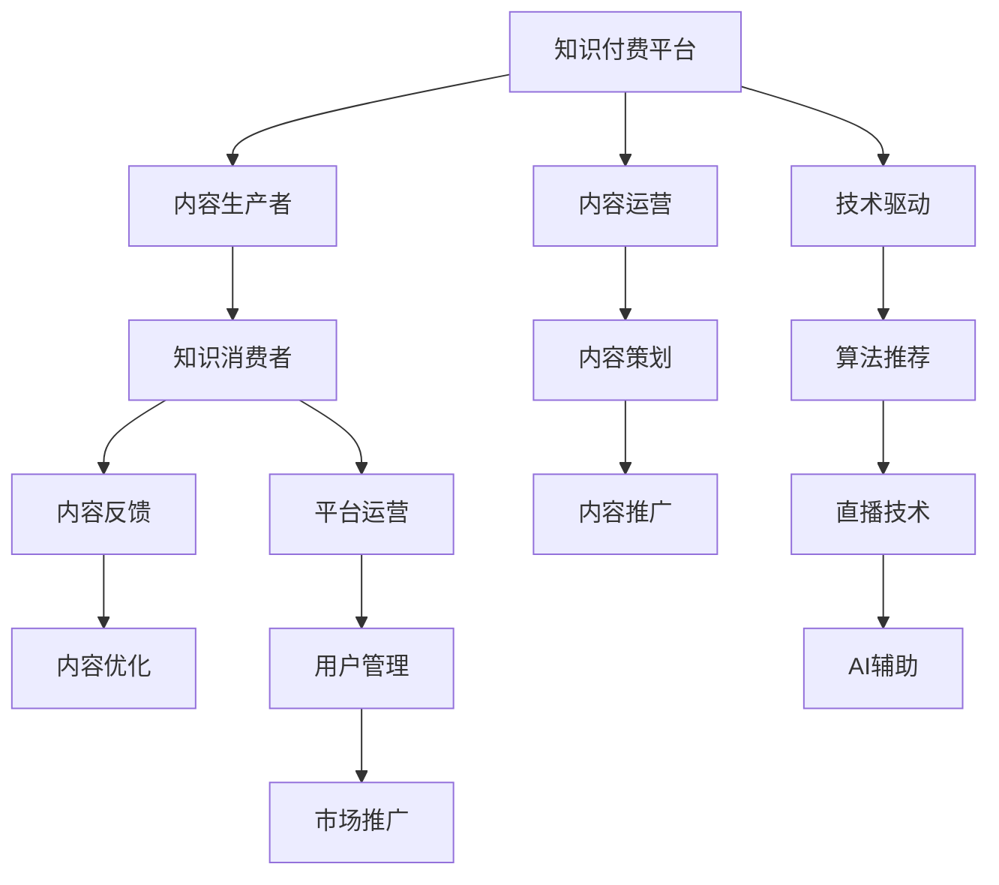

                 

# 打造个人知识付费生态系统的策略

> 关键词：知识付费,生态系统,策略,内容生产,用户运营,平台构建,技术驱动

## 1. 背景介绍

### 1.1 问题由来

随着互联网技术的飞速发展，知识付费市场呈现爆发式增长。用户对于高质量、有深度的专业内容需求日益增长，而传统教育模式难以完全满足这一需求。个人知识付费平台应运而生，以独特的内容形式、个性化的学习体验和灵活的学习方式，成为连接知识创作者和用户的新兴模式。然而，个人知识付费平台在快速崛起的同时，也面临诸多挑战，如内容同质化、用户粘性低、平台竞争激烈等。如何打造一个高效、稳定、可持续发展的个人知识付费生态系统，成为各大平台亟待解决的难题。

### 1.2 问题核心关键点

打造个人知识付费生态系统的关键在于：
- 内容质量：高质量、有深度的内容是吸引用户、形成口碑的核心。
- 用户粘性：通过互动、社区、奖励等手段，提高用户长期留存。
- 平台差异化：利用技术手段，实现个性化推荐、互动直播等差异化功能。
- 市场竞争：面对激烈的市场竞争，需要不断创新，提升用户获取价值。

本文聚焦于打造个人知识付费生态系统的策略，旨在从内容生产、用户运营、平台构建和技术驱动等角度，提供系统性、可操作性的建议和实践方案。

## 2. 核心概念与联系

### 2.1 核心概念概述

为更好地理解打造个人知识付费生态系统的策略，本节将介绍几个密切相关的核心概念：

- **知识付费平台**：提供专业内容，通过付费形式实现知识变现的平台，如得到、分答等。
- **内容生产者**：生产专业知识的个体或机构，包括专家、学者、自由撰稿人等。
- **知识消费者**：通过付费获取知识的个体，如企业员工、学生、普通用户等。
- **平台运营**：通过商业策略和技术手段，保障内容生产和消费高效进行的维护工作，包括用户管理、市场推广、技术支撑等。
- **内容运营**：通过策划、组织、推广等手段，提升内容质量和用户覆盖度的运营工作。
- **技术驱动**：通过先进的算法、架构、工具等技术手段，提升平台的整体效能，如推荐算法、视频直播、AI辅助等。

这些核心概念之间的逻辑关系可以通过以下Mermaid流程图来展示：



这个流程图展示了一些核心概念之间的相互关系：

1. 知识付费平台是连接内容生产者和知识消费者的桥梁。
2. 内容生产者通过内容运营和平台运营，保障内容质量和覆盖度。
3. 技术驱动提供技术支撑，优化内容消费体验。
4. 知识消费者通过反馈机制，参与内容优化，提升平台粘性。

这些概念共同构成了个人知识付费生态系统的基本框架，从而为其健康发展提供了坚实基础。

## 3. 核心算法原理 & 具体操作步骤
### 3.1 算法原理概述

打造个人知识付费生态系统，核心在于通过高效的算法和技术手段，实现内容推荐、用户互动、社区建设等功能。这些功能能够提升用户的学习体验，促进知识传播和消费，最终形成一个良性循环的知识消费生态。

以下是几个核心算法和技术原理：

- **推荐算法**：利用机器学习和深度学习算法，分析用户行为数据，实现个性化推荐。
- **用户画像**：通过分析用户的历史行为、兴趣、反馈等信息，建立用户画像，提供个性化服务。
- **社区互动**：利用自然语言处理技术和社交网络算法，增强用户之间的互动，构建知识社区。
- **直播技术**：利用实时音视频技术，实现直播互动，提高用户粘性。
- **AI辅助**：利用语音识别、图像识别等AI技术，提升内容生产效率和用户体验。

### 3.2 算法步骤详解

以下是打造个人知识付费生态系统的详细步骤：

**Step 1: 准备基础资源**

- 收集和整理大量高质量的行业相关内容，构建知识库。
- 搭建高性能的计算和存储基础设施，保障内容生产和消费的流畅。

**Step 2: 内容生产与传播**

- 招募和培养一批高质量的内容生产者，保障内容的多样性和深度。
- 设计内容生产和传播机制，如知识付费订阅、单次付费、免费试用等，满足不同用户的需求。

**Step 3: 用户运营与管理**

- 利用大数据分析，建立用户画像，实现个性化推荐。
- 设计用户互动和奖励机制，提高用户粘性和社区活跃度。

**Step 4: 平台构建与优化**

- 设计灵活的支付和结算机制，保障用户和内容生产者的权益。
- 利用技术手段，实现平台的高可用性、安全性、易用性。

**Step 5: 技术驱动与创新**

- 引入先进算法和技术，提升平台的数据分析和内容推荐能力。
- 通过不断的技术创新，推出差异化功能，提升用户体验。

### 3.3 算法优缺点

打造个人知识付费生态系统的算法和技术手段具有以下优点：
- 提升用户体验：通过个性化推荐、互动直播等功能，提升用户的学习和参与体验。
- 促进知识传播：高效的内容推荐和互动机制，加速知识的传播和消费。
- 增加用户粘性：丰富的社区和奖励机制，提高用户长期留存率。

同时，这些算法和技术手段也存在一些局限：
- 数据隐私问题：在数据分析和推荐过程中，用户隐私和数据安全需要得到充分保障。
- 技术复杂度：实现高精度的推荐和社区建设，需要投入大量的人力和时间。
- 成本投入：高质量内容和技术平台的建设，需要较大的前期投入。

尽管存在这些局限，但总体而言，基于先进算法和技术手段，个人知识付费生态系统能够更好地满足用户需求，提升平台的竞争力和市场影响力。

### 3.4 算法应用领域

基于推荐算法和个人知识付费生态系统的技术手段，已经在多个领域得到了广泛应用，例如：

- 教育培训：提供定制化课程和个性化学习路径，提高学习效率和效果。
- 企业培训：利用优质资源，提升员工技能和知识水平。
- 职业发展：通过在线课程和社区互动，助力个人职业成长。
- 专业资讯：提供行业最新动态和深度分析，帮助用户做出决策。
- 心理健康：提供心理咨询和支持，促进个人心理健康。

除了上述这些经典应用外，个人知识付费平台还不断探索新的应用场景，如智能家居、医疗健康等，为不同领域的知识传播和消费提供新的解决方案。

## 4. 数学模型和公式 & 详细讲解  
### 4.1 数学模型构建

本节将使用数学语言对打造个人知识付费生态系统的算法和技术手段进行更加严格的刻画。

记知识付费平台为 $P$，内容生产者为 $C$，知识消费者为 $U$，平台运营为 $O$，内容运营为 $C_{op}$，技术驱动为 $T$。定义平台的目标函数为：

$$
\mathcal{L}(P) = \mathcal{L}_{C} + \mathcal{L}_{U} + \mathcal{L}_{O} + \mathcal{L}_{T}
$$

其中，$\mathcal{L}_{C}$ 为内容生产的效用函数，$\mathcal{L}_{U}$ 为用户体验的效用函数，$\mathcal{L}_{O}$ 为平台运营的效用函数，$\mathcal{L}_{T}$ 为技术驱动的效用函数。

具体来说，各个模块的效用函数可以定义为：
- $\mathcal{L}_{C} = \sum_{i=1}^n \omega_i f_i(C_i)$，其中 $\omega_i$ 为权重，$f_i$ 为内容生产的效能函数。
- $\mathcal{L}_{U} = \sum_{j=1}^m g_j(U_j)$，其中 $g_j$ 为用户体验的效能函数。
- $\mathcal{L}_{O} = \sum_{k=1}^p h_k(O_k)$，其中 $h_k$ 为平台运营的效能函数。
- $\mathcal{L}_{T} = \sum_{l=1}^q i_l(T_l)$，其中 $i_l$ 为技术驱动的效能函数。

通过最大化目标函数 $\mathcal{L}(P)$，可以实现个人知识付费生态系统的最优效能。

### 4.2 公式推导过程

以下我们以推荐算法为例，推导推荐模型的构建和优化过程。

假设平台上有 $N$ 个内容生产者 $C_i$，每个内容生产者生产 $k$ 个内容 $c_{i,j}$。用户 $U_j$ 对内容 $c_{i,j}$ 的评分 $r_{i,j}$ 为随机变量，服从二项分布 $r_{i,j} \sim Bernoulli(\pi_{i,j})$，其中 $\pi_{i,j}$ 为用户对内容 $c_{i,j}$ 的兴趣度，可通过用户行为数据和内容特征计算得到。

定义推荐算法 $A$，其中 $A_j$ 为用户 $j$ 的推荐结果。推荐算法 $A$ 的目标是最小化预测误差 $E(A_j, r_{i,j})$，即：

$$
\mathop{\arg\min}_{A_j} E(A_j, r_{i,j}) = \mathop{\arg\min}_{A_j} \sum_{i=1}^N \pi_{i,j} \log(A_j(c_{i,j})) + (1-\pi_{i,j})\log(1-A_j(c_{i,j}))
$$

通过最大化目标函数，得到推荐算法的优化公式：

$$
\mathop{\arg\max}_{A_j} \sum_{i=1}^N \pi_{i,j} \log(A_j(c_{i,j})) + (1-\pi_{i,j})\log(1-A_j(c_{i,j}))
$$

推荐算法 $A$ 通常采用基于梯度的优化算法，如Adam、SGD等，根据损失函数的梯度更新模型参数。具体实现过程可参考现有推荐系统的经典算法，如协同过滤、矩阵分解、深度学习推荐等。

### 4.3 案例分析与讲解

**案例分析：知识付费平台的内容推荐系统**

以知识付费平台为例，推荐算法 $A$ 通常包括以下几个步骤：

1. **数据收集**：收集用户的行为数据，如访问记录、评分、评论等，以及内容的特征数据，如标题、摘要、作者等。
2. **用户画像**：利用大数据分析，建立用户画像，描述用户的兴趣、偏好、行为等特征。
3. **内容嵌入**：将内容特征转化为向量表示，实现内容的高效存储和检索。
4. **模型训练**：选择适合的推荐算法，如基于矩阵分解的ALS、基于深度学习的NeuMF等，进行模型训练。
5. **效果评估**：通过AUC、NDCG等指标评估推荐效果，并根据评估结果不断优化算法模型。

以某知识付费平台为例，通过引入协同过滤算法和深度学习模型，可以实现对用户兴趣的精确预测，并提供个性化的推荐内容。具体实现过程中，可以通过设置不同的权重和阈值，控制推荐结果的多样性和准确性，从而提升用户体验。

## 5. 项目实践：代码实例和详细解释说明
### 5.1 开发环境搭建

在进行个人知识付费平台的开发实践中，我们需要准备好开发环境。以下是使用Python进行PyTorch和TensorFlow开发的简单环境配置流程：

1. 安装Anaconda：从官网下载并安装Anaconda，用于创建独立的Python环境。
2. 创建并激活虚拟环境：
```bash
conda create -n pytorch-env python=3.8 
conda activate pytorch-env
```
3. 安装PyTorch和TensorFlow：根据CUDA版本，从官网获取对应的安装命令。例如：
```bash
conda install pytorch torchvision torchaudio cudatoolkit=11.1 -c pytorch -c conda-forge
pip install tensorflow==2.8
```
4. 安装相关库：
```bash
pip install numpy pandas scikit-learn matplotlib tqdm jupyter notebook ipython
```
完成上述步骤后，即可在`pytorch-env`环境中开始开发实践。

### 5.2 源代码详细实现

下面我们以推荐算法为例，给出使用PyTorch和TensorFlow进行推荐系统开发的代码实现。

首先，定义推荐系统的数据结构：

```python
from sklearn.model_selection import train_test_split
import pandas as pd
import numpy as np

# 读取数据
data = pd.read_csv('ratings.csv')

# 数据预处理
def preprocess_data(data):
    # 去除重复数据
    data.drop_duplicates(inplace=True)
    # 将评分转换为二元化评分
    data['rating'] = data['rating'].apply(lambda x: 1 if x > 4 else 0)
    return data

# 分割数据
train_data, test_data = train_test_split(data, test_size=0.2, random_state=42)
```

然后，定义推荐算法的模型：

```python
import tensorflow as tf
import tensorflow_datasets as tfds

# 定义深度学习模型
def build_model(input_shape):
    model = tf.keras.Sequential([
        tf.keras.layers.Dense(128, activation='relu', input_shape=input_shape),
        tf.keras.layers.Dense(1, activation='sigmoid')
    ])
    return model

# 训练模型
def train_model(model, train_data, test_data):
    model.compile(optimizer=tf.keras.optimizers.Adam(0.01), loss='binary_crossentropy', metrics=['accuracy'])
    model.fit(train_data, epochs=10, validation_data=test_data)
    return model
```

接着，实现推荐算法的推理过程：

```python
# 加载模型
model = train_model(build_model((4,)), train_data, test_data)

# 定义推荐函数
def recommend_content(user_id, model, data):
    # 获取用户历史评分
    user_history = data[data['user_id'] == user_id]
    # 计算用户兴趣度
    user_interest = np.mean(user_history['rating'].values)
    # 获取所有内容
    all_items = data.drop_duplicates(subset=['item_id'])
    # 获取评分预测
    predictions = model.predict(all_items[['rating']])
    # 按预测值排序
    sorted_items = all_items[['item_id', 'rating']].sort_values(by='rating', ascending=False)
    # 返回推荐结果
    return sorted_items.iloc[:5]
```

最后，进行推荐系统的运行和结果展示：

```python
# 测试推荐函数
user_id = 1
recommendations = recommend_content(user_id, model, data)

# 打印推荐结果
print(recommendations)
```

以上就是使用PyTorch和TensorFlow进行推荐系统开发的完整代码实现。可以看到，通过深度学习模型和TensorFlow的高效计算能力，能够快速构建和优化推荐系统，从而提升用户的学习和参与体验。

### 5.3 代码解读与分析

让我们再详细解读一下关键代码的实现细节：

**数据预处理**：
- `preprocess_data`函数：处理数据，去除重复，将评分转换为二元化评分，方便后续模型训练。

**模型构建**：
- `build_model`函数：定义深度学习模型，采用全连接神经网络，输入为评分，输出为二元预测。

**模型训练**：
- `train_model`函数：使用Adam优化器和二元交叉熵损失函数，训练模型，并返回训练后的模型。

**推荐函数**：
- `recommend_content`函数：获取用户历史评分，计算用户兴趣度，获取所有内容，计算评分预测，并按预测值排序，返回推荐结果。

**运行测试**：
- 定义测试用户ID，调用`recommend_content`函数获取推荐结果，并打印输出。

通过这些关键代码实现，可以看出，深度学习模型在推荐系统中的应用，能够高效地分析用户行为数据，实现个性化推荐，提升用户体验。

## 6. 实际应用场景
### 6.1 智能教育平台

基于推荐算法和深度学习技术，智能教育平台能够提供个性化的课程推荐和学习路径规划，帮助学生高效学习。平台通过分析学生的学习行为和成绩数据，生成知识图谱和推荐模型，为每个学生量身定制个性化学习计划。

例如，某在线教育平台通过引入协同过滤算法和深度学习模型，实现了对学生学习行为的精确预测，提供个性化的课程推荐。具体实现过程中，可以通过设置不同的权重和阈值，控制推荐结果的多样性和准确性，从而提升学生的学习效率和效果。

### 6.2 企业培训系统

在企业培训领域，推荐算法和个人知识付费生态系统可以提供高效的内容推荐和培训效果评估，提升员工的技能和知识水平。平台通过收集员工的培训反馈和行为数据，生成员工画像，实现培训内容的个性化推荐。

例如，某企业培训系统通过引入协同过滤算法和深度学习模型，实现了对员工培训行为的精确预测，提供个性化的课程推荐。具体实现过程中，可以通过设置不同的权重和阈值，控制推荐结果的多样性和准确性，从而提升员工的学习效率和培训效果。

### 6.3 在线学习社区

在线学习社区可以利用推荐算法和技术手段，构建用户互动和知识分享的平台，促进知识的传播和用户之间的交流。平台通过分析用户的行为数据和评论信息，生成用户画像，实现内容的个性化推荐和社区互动。

例如，某在线学习社区通过引入协同过滤算法和深度学习模型，实现了对用户行为和兴趣的精确预测，提供个性化的课程推荐。具体实现过程中，可以通过设置不同的权重和阈值，控制推荐结果的多样性和准确性，从而提升用户的学习体验和社区活跃度。

### 6.4 未来应用展望

随着推荐算法和深度学习技术的不断发展，个人知识付费生态系统将在更多领域得到应用，为知识传播和消费提供新的解决方案。

在智慧医疗领域，基于推荐算法和深度学习技术，医疗知识付费平台能够提供个性化的诊疗方案和学习资源，提升医生的诊疗水平和患者的健康管理能力。平台通过分析医生的诊疗数据和患者的学习需求，生成知识图谱和推荐模型，为医生和患者量身定制个性化的学习计划。

在智能家居领域，基于推荐算法和深度学习技术，智能家居知识付费平台能够提供个性化的家居方案和学习资源，提升用户的家居管理和智能生活体验。平台通过分析用户的家居数据和学习需求，生成知识图谱和推荐模型，为用户量身定制个性化的家居方案。

在公共服务领域，基于推荐算法和深度学习技术，公共服务知识付费平台能够提供个性化的政务咨询和学习资源，提升公民的公共服务意识和能力。平台通过分析公民的政务咨询数据和学习需求，生成知识图谱和推荐模型，为公民量身定制个性化的政务咨询和学习计划。

## 7. 工具和资源推荐
### 7.1 学习资源推荐

为了帮助开发者系统掌握打造个人知识付费生态系统的理论基础和实践技巧，这里推荐一些优质的学习资源：

1. **《推荐系统实战》**：由KDD Cup冠军团队编写，全面介绍了推荐系统的经典算法和技术实现。
2. **《深度学习》**：由Ian Goodfellow、Yoshua Bengio、Aaron Courville编写，系统讲解了深度学习的基本概念和经典算法。
3. **《TensorFlow实战》**：由TF社区专家编写，详细介绍了TensorFlow的深度学习模型构建和优化。
4. **《Python深度学习》**：由Francois Chollet编写，全面介绍了PyTorch的深度学习模型构建和优化。
5. **《大数据分析与数据挖掘》**：由机器学习专家编写，介绍了大数据分析和数据挖掘的基本方法和工具。

通过对这些资源的学习实践，相信你一定能够快速掌握推荐系统和深度学习技术的精髓，并用于解决实际的个性化推荐问题。

### 7.2 开发工具推荐

高效的开发离不开优秀的工具支持。以下是几款用于打造个人知识付费生态系统的常用工具：

1. **PyTorch**：基于Python的开源深度学习框架，灵活动态的计算图，适合快速迭代研究。大多数推荐系统算法都有PyTorch版本的实现。
2. **TensorFlow**：由Google主导开发的开源深度学习框架，生产部署方便，适合大规模工程应用。
3. **Scikit-learn**：Python的科学计算库，提供了丰富的数据处理和机器学习算法，适合数据分析和推荐系统开发。
4. **Jupyter Notebook**：免费的Jupyter Notebook环境，支持交互式编程和数据可视化，适合开发者进行代码调试和实验。
5. **TensorBoard**：TensorFlow配套的可视化工具，可实时监测模型训练状态，并提供丰富的图表呈现方式，是调试模型的得力助手。

合理利用这些工具，可以显著提升打造个人知识付费生态系统的开发效率，加快创新迭代的步伐。

### 7.3 相关论文推荐

打造个人知识付费生态系统的推荐算法和个人知识付费生态系统的发展源于学界的持续研究。以下是几篇奠基性的相关论文，推荐阅读：

1. **《协同过滤推荐系统》**：由Daniel Koren和Carse Friedman编写，介绍了协同过滤推荐系统的基本原理和经典算法。
2. **《矩阵分解推荐系统》**：由Pang Wei和Lijun Wei编写，介绍了矩阵分解推荐系统的基本原理和经典算法。
3. **《深度学习推荐系统》**：由Yuxin Wu和Wei Hu编写，介绍了深度学习推荐系统的基本原理和经典算法。
4. **《知识图谱推荐系统》**：由Wang Ke和Xiang Li编写，介绍了知识图谱推荐系统的基本原理和经典算法。

这些论文代表了大推荐系统的发展脉络。通过学习这些前沿成果，可以帮助研究者把握学科前进方向，激发更多的创新灵感。

## 8. 总结：未来发展趋势与挑战

### 8.1 总结

本文对打造个人知识付费生态系统的推荐算法和技术手段进行了全面系统的介绍。首先阐述了推荐算法的理论基础和核心原理，明确了推荐系统在提升用户体验和促进知识传播方面的独特价值。其次，从算法原理到实践步骤，详细讲解了推荐算法的构建和优化过程，并给出了推荐系统的完整代码实现。同时，本文还广泛探讨了推荐系统在教育培训、企业培训、在线学习社区等多个领域的应用前景，展示了推荐算法的广阔前景。

通过本文的系统梳理，可以看到，推荐系统在打造个人知识付费生态系统中起到了至关重要的作用。这些算法和技术手段不仅提升了用户的个性化体验，还促进了知识的传播和消费，为知识付费平台带来了显著的经济价值和社会效益。未来，伴随推荐算法和深度学习技术的不断发展，推荐系统必将在更多领域得到应用，为知识付费平台的持续发展注入新的动力。

### 8.2 未来发展趋势

展望未来，推荐系统的发展趋势主要体现在以下几个方面：

1. **个性化推荐算法**：推荐算法的核心在于个性化推荐，未来将更加注重用户行为数据和上下文信息的融合，提升推荐的精准度和多样性。
2. **推荐系统的泛化能力**：推荐系统不仅要考虑单个用户的个性化需求，还需具备一定的泛化能力，提升对新用户的推荐效果。
3. **推荐系统的可解释性**：推荐系统的黑盒模型，使得用户难以理解和信任。未来推荐系统将更加注重可解释性，提升用户的信任度和满意度。
4. **推荐系统的可扩展性**：推荐系统需要支持大规模数据的实时处理和推荐，未来将引入更多分布式和流处理技术，提升系统的可扩展性。
5. **推荐系统的安全性**：推荐系统在处理用户数据时，需考虑数据隐私和安全问题。未来将引入更多安全技术和算法，保障用户数据的安全性。

### 8.3 面临的挑战

尽管推荐系统已经在推荐领域取得了显著成果，但仍面临诸多挑战：

1. **数据隐私问题**：在推荐系统开发和应用过程中，需重视用户数据的隐私保护和数据安全。如何合理使用用户数据，同时保障用户隐私，是一个重要挑战。
2. **推荐系统的公平性**：推荐系统易受到数据偏见的影响，可能对某些用户群体产生不公平的推荐结果。如何避免偏见，提升推荐系统的公平性，是一个重要问题。
3. **推荐系统的可扩展性**：推荐系统需要支持大规模数据的实时处理和推荐，面临高并发、低延迟的技术挑战。如何优化算法和架构，提升系统的可扩展性，是一个重要方向。
4. **推荐系统的安全性**：推荐系统在处理用户数据时，需考虑数据隐私和安全问题。如何引入安全技术和算法，保障用户数据的安全性，是一个重要问题。

### 8.4 研究展望

未来推荐系统的发展方向主要在以下几个方面：

1. **知识图谱推荐**：通过引入知识图谱，提升推荐系统的泛化能力和解释性，提升推荐系统的可信度和用户体验。
2. **跨模态推荐**：通过引入多种模态数据，提升推荐系统的多样性和丰富性，提升推荐系统的可解释性和用户体验。
3. **实时推荐系统**：通过引入流处理和分布式计算技术，提升推荐系统的实时处理能力和可扩展性，提升推荐系统的用户体验。
4. **个性化推荐模型**：通过引入深度学习等先进算法，提升推荐系统的精准度和个性化程度，提升推荐系统的用户体验。

这些研究方向的探索，必将引领推荐系统迈向更高的台阶，为打造个人知识付费生态系统提供更多创新思路和技术支持。面向未来，推荐系统需要与其他人工智能技术进行更深入的融合，如知识表示、因果推理、强化学习等，协同发力，共同推动推荐系统的发展和应用。只有勇于创新、敢于突破，才能不断拓展推荐系统的边界，让推荐系统更好地服务于社会和经济。

## 9. 附录：常见问题与解答

**Q1：如何选择合适的推荐算法？**

A: 选择合适的推荐算法需考虑以下因素：
1. 数据类型：不同类型的数据，如文本、图片、视频等，适合不同的推荐算法。
2. 数据量：数据量较大的推荐系统，适合使用协同过滤和矩阵分解算法。数据量较小的推荐系统，适合使用基于深度学习的推荐算法。
3. 推荐目标：目标为多样性推荐，适合使用基于深度学习的推荐算法。目标为精准推荐，适合使用协同过滤和矩阵分解算法。
4. 实时性要求：需要实时推荐的系统，适合使用流处理和分布式计算技术。不需要实时推荐的系统，适合使用离线计算和批处理技术。

**Q2：推荐算法需要考虑哪些因素？**

A: 推荐算法需考虑以下因素：
1. 用户行为数据：用户的历史评分、点击、浏览、购买等行为数据。
2. 内容特征数据：内容的标题、摘要、标签、类别等特征数据。
3. 上下文信息：用户的地理位置、设备类型、时间戳等上下文信息。
4. 推荐目标：推荐算法需明确推荐目标，如精准推荐、多样性推荐、协同过滤等。
5. 推荐模型：推荐算法需选择合适的推荐模型，如协同过滤、矩阵分解、深度学习等。
6. 评估指标：推荐算法需选择合适的评估指标，如AUC、NDCG、F1等。

**Q3：推荐系统如何优化用户体验？**

A: 推荐系统可以通过以下方式优化用户体验：
1. 个性化推荐：通过分析用户行为数据和内容特征数据，实现个性化推荐，提升用户的满意度和体验。
2. 多样性推荐：通过引入多样性推荐算法，避免推荐结果过于单一，提升推荐结果的多样性和丰富性。
3. 实时推荐：通过引入流处理和分布式计算技术，实现实时推荐，提升用户的即时性和体验。
4. 交互推荐：通过引入交互推荐算法，如用户反馈、评分、评论等，实现动态调整和优化，提升用户的参与度和体验。
5. 用户界面优化：通过优化用户界面设计，提升用户的操作体验和互动效果。

通过以上策略，可以显著提升推荐系统的用户体验，促进用户的学习和参与，从而提升推荐系统的价值和竞争力。

**Q4：推荐系统在实际应用中需要注意哪些问题？**

A: 推荐系统在实际应用中需要注意以下问题：
1. 数据隐私：在推荐系统开发和应用过程中，需重视用户数据的隐私保护和数据安全。合理使用用户数据，同时保障用户隐私。
2. 推荐系统的公平性：推荐系统易受到数据偏见的影响，可能对某些用户群体产生不公平的推荐结果。需避免偏见，提升推荐系统的公平性。
3. 推荐系统的实时性：推荐系统需支持大规模数据的实时处理和推荐，面临高并发、低延迟的技术挑战。需优化算法和架构，提升系统的可扩展性。
4. 推荐系统的安全性：推荐系统在处理用户数据时，需考虑数据隐私和安全问题。引入安全技术和算法，保障用户数据的安全性。

通过合理解决这些挑战，推荐系统可以在实际应用中发挥更大的价值，提升用户的学习和参与体验，从而提升推荐系统的经济价值和社会效益。

---

作者：禅与计算机程序设计艺术 / Zen and the Art of Computer Programming

