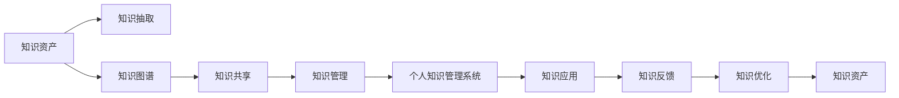

                 

# 打造个人知识管理系统:程序员的必备技能

> 关键词：个人知识管理(PKM)系统,程序员,软件开发,编程,项目管理,工具推荐,资源整理,实践指南

## 1. 背景介绍

### 1.1 问题由来
在快速发展的科技时代，信息爆炸成为程序员面临的一大挑战。不断涌现的新技术、新工具、新框架，要求程序员不仅要有扎实的基础知识，还需要高效地进行知识的获取、整理和应用。个人知识管理系统（Personal Knowledge Management, PKM）成为了程序员提高自身学习效率、快速适应技术变化、实现个人成长的关键工具。

PKM系统通过结构化地整理、分类和管理个人知识，帮助程序员系统化地掌握各类知识和技能，从而在繁忙的工作和学习中找到清晰的方向，提升工作产出和学习成果。本文将全面介绍PKM系统的构建原理、核心概念及其在程序员中的应用实践，为程序员打造自己的PKM系统提供详细的指导。

### 1.2 问题核心关键点
- **系统构建**：如何设计一个符合自身需求、高效实用的个人知识管理系统。
- **工具选择**：如何选择和应用合适的工具，辅助构建PKM系统。
- **实践方法**：在实际工作中如何将PKM系统与项目管理、编程开发等任务相结合。
- **资源整理**：如何整合各类资源，构建多维度的知识图谱。
- **持续优化**：如何根据实际使用情况，不断优化和改进PKM系统。

通过理解这些关键点，可以帮助程序员系统地构建、优化和管理自己的个人知识管理系统，从而在技术创新和个人成长的旅程中，更上一层楼。

## 2. 核心概念与联系

### 2.1 核心概念概述

为了更好地理解个人知识管理系统的构建，本节将介绍几个密切相关的核心概念：

- **个人知识管理系统(PKM)**：通过使用工具和流程，将个人知识进行结构化整理、分类存储、检索利用的系统。PKM系统可以是电子化的，也可以是纸质化的。
- **知识管理(Knowledge Management, KM)**：组织、存储和利用知识的过程，包括知识的获取、整合、共享、更新等。
- **知识资产(Knowledge Assets)**：个人或组织拥有的有价值的知识，包括经验、技能、文档、代码等。
- **知识图谱(Knowledge Graph)**：使用图形化的方式，将各类知识元素连接起来，形成一个有机的整体，便于查询和应用。
- **知识抽取(Knowledge Extraction)**：从文本、数据中识别、提取、组织出有用的知识。
- **知识共享(Knowledge Sharing)**：通过各种方式，将个人或组织拥有的知识分享给他人，促进知识流动。

这些核心概念之间存在密切的联系，共同构成了个人知识管理系统的基础框架。通过合理应用这些概念，可以构建出高效、实用的PKM系统，更好地管理和利用个人知识。

### 2.2 核心概念原理和架构的 Mermaid 流程图



这个流程图展示了个人知识管理系统与知识管理各环节的逻辑关系：

1. 知识资产通过知识抽取进入知识图谱。
2. 知识图谱通过知识共享进入知识管理。
3. 知识管理通过个人知识管理系统进入知识应用。
4. 知识应用通过知识反馈进入知识优化。
5. 优化后的知识资产重新进入知识抽取，形成循环。

这种循环不断推动知识资产的增长和优化，使得个人知识管理系统成为一个动态的、不断进化的系统。

## 3. 核心算法原理 & 具体操作步骤
### 3.1 算法原理概述

个人知识管理系统构建的算法原理主要基于以下几个方面：

1. **结构化数据存储**：使用数据库、文档管理系统等工具，将知识进行结构化存储，便于检索和利用。
2. **标签和分类系统**：通过标签和分类系统，对知识进行多维度分类，提高查询效率。
3. **搜索和检索技术**：应用搜索技术，快速定位和检索所需的知识。
4. **版本控制和历史追踪**：使用版本控制系统，记录知识的历史变化，便于追踪和恢复。
5. **协作和共享机制**：通过协作和共享机制，将知识传播给他人，促进知识流动。

这些算法原理构成了PKM系统构建的基础，确保系统具备高效的存储、检索、共享和优化能力。

### 3.2 算法步骤详解

构建个人知识管理系统的一般步骤包括：

**Step 1: 需求分析**
- 明确个人知识管理的目标，如技术学习、项目开发、项目管理等。
- 列出需要管理的知识类型，如代码、文档、技术博客、笔记等。

**Step 2: 系统设计**
- 选择合适的工具和框架，如GitHub、Evernote、Confluence等。
- 设计系统的数据模型和结构，如标签、分类、搜索等。

**Step 3: 知识整理**
- 将现有的知识资产进行分类整理，形成初步的知识图谱。
- 使用标签和分类系统，对知识进行多维度管理。

**Step 4: 系统实现**
- 根据设计方案，搭建PKM系统，包括数据存储、搜索、协作等功能。
- 实现知识共享和协作机制，便于知识传播和利用。

**Step 5: 系统优化**
- 根据实际使用情况，不断优化和改进PKM系统，如增加新功能、优化用户体验等。

### 3.3 算法优缺点

个人知识管理系统构建的优点包括：

- **高效存储和检索**：利用结构化存储和搜索技术，可以快速定位所需知识。
- **便于共享和协作**：通过协作和共享机制，促进知识流动和应用。
- **动态优化**：基于版本控制和历史追踪，系统可以不断优化和改进。

其缺点主要包括：

- **初始设置复杂**：设计和实现PKM系统需要一定的时间和精力。
- **维护成本高**：系统需要定期更新和维护，以保持其功能和性能。
- **依赖工具和技术**：选择合适的工具和实现技术对系统构建至关重要。

尽管存在这些局限性，但通过合理的设计和实践，可以最大化利用PKM系统的优点，提升个人知识管理和应用的效果。

### 3.4 算法应用领域

个人知识管理系统在程序员中的应用领域非常广泛，主要包括：

- **技术学习**：通过整理和检索技术文档、博客、教程等，加速技术学习和知识积累。
- **项目管理**：通过记录和共享项目计划、进度、文档等，提高项目管理的效率和透明度。
- **代码管理**：通过版本控制、协作和文档化，规范代码开发过程，提高代码质量和可维护性。
- **经验总结**：通过记录和分享项目经验、技术问题解决过程等，提升个人经验和知识水平。
- **问题追踪**：通过问题记录、状态跟踪、解决方案共享等，提升团队协作和问题解决能力。

这些应用领域充分展示了个人知识管理系统在程序员工作和学习中的重要价值。

## 4. 数学模型和公式 & 详细讲解 & 举例说明
### 4.1 数学模型构建

个人知识管理系统的数学模型主要涉及以下几个方面：

- **知识图谱模型**：使用图论和网络分析技术，构建知识元素之间的关系图谱。
- **分类和标签模型**：使用分类算法，对知识进行自动分类和标签分配。
- **搜索模型**：应用信息检索技术，如倒排索引、相似度计算等，进行快速搜索。

### 4.2 公式推导过程

以知识图谱的构建为例，假设知识图谱由节点和边组成，节点表示知识元素，边表示知识元素之间的关系。知识图谱的构建过程可以表示为：

$$
G = (N, E)
$$

其中 $N$ 为节点集合，$E$ 为边集合。节点 $n_i$ 和边 $e_{ij}$ 可以表示为：

$$
n_i = (id_i, name_i, tags_i)
$$

$$
e_{ij} = (n_i, n_j, relation_{ij})
$$

其中 $id_i$ 为节点编号，$tags_i$ 为节点标签，$relation_{ij}$ 为节点间关系。通过这些公式，可以系统地构建和表示知识图谱，便于进一步的查询和应用。

### 4.3 案例分析与讲解

假设有一个程序员的知识管理系统，包含技术博客、项目文档、代码库等知识资产。通过使用标签和分类系统，可以将这些知识资产进行结构化整理：

1. **博客管理**：使用Markdown格式编写技术博客，打上如"机器学习"、"数据科学"等标签，形成博客目录。
2. **项目文档**：记录项目需求、设计、代码等文档，打上如"Web开发"、"API设计"等标签，形成文档库。
3. **代码库**：使用Git版本控制系统，记录代码变更历史，打上如"Python"、"JavaScript"等标签，形成代码目录。

通过标签和分类，系统可以高效地查询和管理各类知识，如查找所有与"机器学习"相关的博客和文档，或回顾某个项目的代码变更历史。

## 5. 项目实践：代码实例和详细解释说明
### 5.1 开发环境搭建

构建个人知识管理系统通常需要一些开发环境，以下是一般的搭建步骤：

1. **安装软件**：选择适合的知识管理系统工具，如Evernote、OneNote、Confluence等。
2. **配置环境**：在本地或远程服务器上安装配置工具。
3. **建立数据存储**：选择合适的存储解决方案，如云存储、本地存储等。

### 5.2 源代码详细实现

以使用Evernote构建个人知识管理系统为例，具体代码实现如下：

```python
from evernote.api.v3 import EvernoteService
from evernote.api.v3.exceptions import EvernoteException

# 创建Evernote客户端
client = EvernoteService(
    app_key='your_app_key',
    app_secret='your_app_secret',
    consumer_key='your_consumer_key',
    consumer_secret='your_consumer_secret'
)

# 创建笔记
def create_note(note_name, note_content, tags):
    try:
        note = client.create_note(note_name, note_content, tags)
        return note.guid
    except EvernoteException as e:
        print(f"Error creating note: {e}")

# 查询笔记
def get_notes(note_guids):
    notes = []
    for note_guid in note_guids:
        try:
            notes.append(client.get_note(note_guid))
        except EvernoteException as e:
            print(f"Error retrieving note {note_guid}: {e}")
    return notes

# 查询所有与标签相关的笔记
def get_notes_by_tag(tag_name):
    notes = []
    tag_guids = client.get_tags(tag_name)
    for tag_guid in tag_guids:
        notes.extend(get_notes([tag_guid.guid]))
    return notes

# 测试代码
note_guid = create_note('我的项目文档', '这是一个项目文档', ['test'])
notes = get_notes_by_tag('测试')
print([note.title for note in notes])
```

### 5.3 代码解读与分析

上述代码实现了一个简单的Evernote客户端，用于创建、查询笔记和标签。代码中，首先创建Evernote客户端，然后定义了三个关键函数：

- `create_note`函数：用于创建笔记，接受笔记名、内容、标签列表作为参数，返回笔记的GUID。
- `get_notes`函数：用于查询指定GUID的笔记，接受GUID列表作为参数，返回所有查询到的笔记。
- `get_notes_by_tag`函数：用于查询所有与指定标签相关的笔记，接受标签名作为参数，返回所有相关笔记。

这些函数通过调用Evernote API，实现对笔记和标签的基本操作，是构建个人知识管理系统的基础。

### 5.4 运行结果展示

运行上述代码，可以实现对Evernote的基本操作，如创建笔记、查询笔记和标签等。通过这些操作，程序员可以系统地管理和利用自己的知识资产，提升工作效率和学习成果。

## 6. 实际应用场景
### 6.1 技术学习

个人知识管理系统在技术学习中的应用非常广泛。通过系统整理技术文档、博客、教程等，程序员可以快速获取所需知识，加速技术学习进程。具体应用包括：

- **技术文档管理**：使用标签和分类系统，快速定位各类技术文档，如Django文档、TensorFlow教程等。
- **博客和文章管理**：将技术博客、文章整理成知识库，便于快速查找和引用。
- **教程和视频管理**：将各类教程、视频整理成知识库，便于学习参考。

### 6.2 项目管理

个人知识管理系统在项目管理中的应用也非常重要。通过系统记录项目计划、进度、文档等，程序员可以提高项目管理效率和透明度。具体应用包括：

- **项目计划管理**：记录项目需求、目标、计划等，便于项目跟踪和执行。
- **进度管理**：记录项目各个阶段的进展和状态，便于实时监控。
- **文档管理**：记录项目相关文档，如需求文档、设计文档、代码文档等，便于团队协作和文档共享。

### 6.3 代码管理

个人知识管理系统在代码管理中的应用也非常重要。通过系统记录代码变更历史、版本控制等，程序员可以提高代码质量和可维护性。具体应用包括：

- **代码变更历史**：记录代码的变更历史，便于回溯和修复。
- **版本控制**：使用Git等版本控制系统，管理代码变更和版本发布。
- **协作和文档化**：记录代码相关的讨论、问题和解决方案，便于团队协作和文档共享。

### 6.4 未来应用展望

随着个人知识管理系统技术的不断发展，其应用前景将更加广阔。未来，PKM系统将在以下几个方面迎来新的突破：

- **智能推荐**：利用AI技术，根据用户的历史学习行为和偏好，智能推荐相关知识，提升学习效率。
- **自动化同步**：将PKM系统与云存储、项目管理工具等无缝集成，实现数据的自动同步和备份。
- **多平台支持**：支持移动端、桌面端、Web端等多种平台，提高使用的便捷性和灵活性。
- **增强现实(AR)应用**：利用AR技术，通过虚拟助手和增强现实界面，提升知识查询和利用的体验。
- **知识图谱扩展**：构建更加复杂、多维度、动态的知识图谱，提升知识的整合和应用能力。

这些应用场景和技术突破，将进一步提升个人知识管理系统的实用性和便捷性，为程序员提供更加高效的学习和工作工具。

## 7. 工具和资源推荐
### 7.1 学习资源推荐

以下是几个推荐的个人知识管理学习资源：

1. **《The Art of Mingering Knowledge》书籍**：讲解了个人知识管理的基础原理和实践技巧，适合初学者阅读。
2. **Coursera《Personal Knowledge Management》课程**：由知名专家主讲，涵盖个人知识管理的基础理论和应用案例。
3. **Evernote官方文档**：提供Evernote的详细使用指南和API接口，适合编程实践。
4. **Zettlr笔记软件**：提供专业的笔记和知识管理功能，适合学术研究和项目管理。
5. **Trello项目管理工具**：提供可视化的项目管理功能，适合团队协作和任务管理。

### 7.2 开发工具推荐

以下是几个推荐的开发工具：

1. **Git**：版本控制系统，用于管理代码变更和版本发布。
2. **Confluence**：文档管理系统，用于记录和共享项目文档。
3. **Evernote**：笔记和知识管理工具，支持标签和分类系统。
4. **JIRA**：项目管理工具，用于任务跟踪和协作管理。
5. **Trello**：任务管理工具，支持可视化任务管理和团队协作。

### 7.3 相关论文推荐

以下是几篇推荐的个人知识管理相关论文：

1. **《Personal Knowledge Management: An Overview》**：综述了个人知识管理的研究现状和未来趋势。
2. **《Knowledge Management in Software Development》**：讨论了知识管理在软件开发中的应用。
3. **《A Survey on Personal Knowledge Management》**：总结了个人知识管理的最新研究进展和实践应用。
4. **《Integrating Personal Knowledge Management into the Software Development Lifecycle》**：讨论了如何将PKM系统与软件开发流程集成。

这些资源和学习材料，可以帮助程序员全面掌握个人知识管理系统的构建和应用，提升自身的学习效率和工作产出。

## 8. 总结：未来发展趋势与挑战
### 8.1 研究成果总结

本文详细介绍了个人知识管理系统的构建原理和应用实践，为程序员打造自己的PKM系统提供了全面的指导。通过系统化地整理和利用知识，程序员可以显著提升学习效率和项目管理的效率，从而在繁忙的工作中保持清晰的方向和高效的工作状态。

### 8.2 未来发展趋势

个人知识管理系统的发展趋势主要包括以下几个方面：

- **智能化**：利用AI技术，实现智能推荐、自动化同步等功能，提升系统的便捷性和实用性。
- **多平台支持**：支持多种平台和设备，提高使用的灵活性和便捷性。
- **动态优化**：通过数据分析和机器学习，不断优化和改进PKM系统，提升系统的智能性和应用效果。
- **多模态融合**：将文本、图片、视频等多种模态信息整合，提升知识图谱的丰富性和应用能力。
- **知识社交**：通过知识共享和社交网络，促进知识流动和应用，形成知识社区和知识生态。

### 8.3 面临的挑战

尽管个人知识管理系统在实践中已经取得了一定的效果，但其发展仍面临诸多挑战：

- **数据隐私和安全**：如何保护用户数据隐私和系统安全，防止数据泄露和滥用。
- **用户习惯培养**：如何培养用户使用PKM系统的习惯，提升其应用效果。
- **系统集成和兼容**：如何将PKM系统与其他工具和平台无缝集成，提升使用便捷性。
- **用户体验优化**：如何提升PKM系统的用户体验，使其更加符合用户需求和使用习惯。
- **智能算法优化**：如何优化智能推荐算法，提升推荐效果和系统性能。

### 8.4 研究展望

面对这些挑战，未来的研究需要在以下几个方面寻求新的突破：

- **隐私保护技术**：开发隐私保护算法和技术，确保用户数据的安全和隐私。
- **个性化推荐算法**：研究更加精准的个性化推荐算法，提升推荐效果和用户体验。
- **多模态融合技术**：探索将文本、图片、视频等多种模态信息融合的技术，提升知识图谱的丰富性和应用能力。
- **跨平台集成技术**：开发跨平台集成技术，实现多个工具和平台的无缝对接和数据共享。
- **用户行为分析**：研究用户行为分析技术，提升PKM系统的智能性和用户粘性。

这些研究方向和技术突破，将进一步推动个人知识管理系统的发展，提升程序员的知识管理和应用效果，从而实现更高的工作效率和学习成果。

## 9. 附录：常见问题与解答

**Q1：如何选择合适的个人知识管理工具？**

A: 选择合适的PKM工具需要考虑多个因素，如功能、界面、数据存储等。常见的PKM工具包括Evernote、OneNote、Notion等，可以根据自身需求选择。建议试用多个工具，选择最适合的。

**Q2：如何使用标签和分类系统？**

A: 标签和分类系统是PKM系统的核心组成部分。通过合理使用标签和分类，可以将知识进行结构化整理，便于检索和利用。建议根据知识类型和应用场景，设计合适的标签和分类体系，如按项目、按技术栈、按时间等。

**Q3：如何管理代码变更历史？**

A: 使用版本控制系统如Git，可以系统地管理代码变更历史。建议建立代码变更记录，包括变更者、变更时间、变更内容等，便于回溯和修复。同时，可以记录变更的原因和讨论，便于团队协作和问题解决。

**Q4：如何实现智能推荐？**

A: 利用AI技术，可以实现智能推荐。建议收集用户的历史学习行为和偏好，利用机器学习算法，预测用户可能感兴趣的知识，推荐给用户。可以使用推荐算法如协同过滤、内容推荐、混合推荐等。

**Q5：如何优化用户体验？**

A: 优化用户体验是PKM系统成功的关键。建议关注用户界面设计、操作流程、交互方式等，确保系统简单易用，符合用户习惯。同时，提供个性化设置选项，让用户根据自身需求调整系统配置。

---

作者：禅与计算机程序设计艺术 / Zen and the Art of Computer Programming

