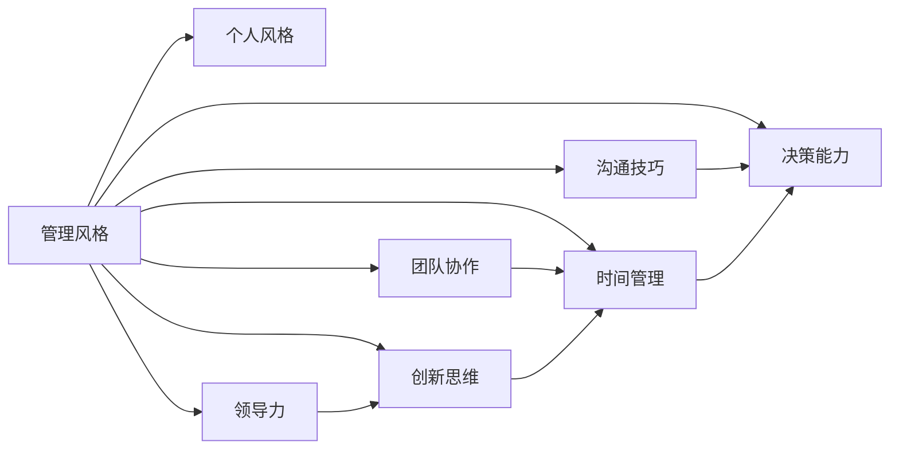

                 

# 打造个人管理风格的方法论

> 关键词：管理风格,个人风格,团队协作,领导力,沟通技巧,创新思维,时间管理,决策能力

## 1. 背景介绍

在当今快速变化的商业环境中，个人的管理风格不仅影响着自身的职业发展，也深刻地影响着团队的绩效和公司的业务表现。一个有效的管理风格能够增强团队的凝聚力，提升创新能力，推动项目成功，并最终实现企业的战略目标。然而，构建和维持这种管理风格并非易事，需要深入理解其核心原理，并将其应用于实践中。本文旨在探讨如何打造一种高效、可持续的个人管理风格，并分析其对团队和组织的积极影响。

## 2. 核心概念与联系

### 2.1 核心概念概述

在探讨个人管理风格的形成与提升之前，首先需明确几个关键概念：

- **管理风格**：指领导者在管理团队时所采取的方式和方法，包括但不限于沟通、决策、激励和冲突解决等方面。
- **个人风格**：指领导者固有的行为模式和人际交往习惯，影响其在工作中的表现和他人对其的感知。
- **团队协作**：涉及团队成员间的沟通、信任、目标一致性和协作方式，是实现团队高绩效的关键。
- **领导力**：是指领导者带领团队实现共同目标的能力，包括但不限于影响力、决策能力、战略规划和执行能力。
- **沟通技巧**：是信息传递和理解的过程，对于确保团队目标一致性和推动创新至关重要。
- **创新思维**：指领导者在解决问题和制定决策时的创造性思考方式，能够推动团队不断适应变化并寻找新的解决方案。
- **时间管理**：涉及任务安排、优先级设定和效率提升，对于保证团队有效产出至关重要。
- **决策能力**：指在复杂环境下做出有效决策的能力，直接影响到团队和企业的战略执行。

这些概念彼此之间紧密联系，共同构成了领导者在管理团队时所展现的风格和能力。有效的个人管理风格不仅需要良好的领导力，还需要高效的沟通技巧、创新的思维模式、卓越的时间管理能力和强有力的决策能力。

### 2.2 核心概念原理和架构的 Mermaid 流程图(Mermaid 流程节点中不要有括号、逗号等特殊字符)



此图表展示了核心概念之间的相互联系和影响。管理风格通过个人风格、团队协作、领导力、沟通技巧、创新思维、时间管理和决策能力相互作用，形成一个有机的整体。

## 3. 核心算法原理 & 具体操作步骤

### 3.1 算法原理概述

打造个人管理风格的方法论建立在以下几个基本原理之上：

1. **一致性原则**：个人风格与管理风格应保持一致，以便团队成员能够清晰理解并适应。
2. **适应性原则**：个人风格应能够适应团队和环境的变化，灵活调整以应对新的挑战。
3. **激励性原则**：通过激励和认可增强团队成员的参与感和归属感。
4. **透明性原则**：保持信息透明，增强团队成员之间的信任和协作。
5. **迭代原则**：持续反思和调整个人风格，通过实践不断提升领导效能。

### 3.2 算法步骤详解

以下步骤概述了如何通过一系列系统化的实践，打造并优化个人管理风格：

1. **自我评估**：首先，进行自我评估，识别自己的个人风格和偏好，明确自己在团队中的角色定位。
2. **目标设定**：设定具体的目标，明确希望达成的管理效果。
3. **团队分析**：了解团队成员的背景、技能和期望，根据团队特性调整管理风格。
4. **实践与反馈**：通过实际管理实践，收集团队成员的反馈，持续改进管理风格。
5. **持续学习**：不断学习新的管理理论和方法，适应不同的管理情境。

### 3.3 算法优缺点

个人管理风格的方法论具有以下优点：

- **系统性**：提供了一个系统的框架，帮助领导者全面提升管理能力。
- **实用性强**：通过实际管理和反馈循环，能够直接应用于各种情境。
- **灵活性**：能够根据不同的团队和环境调整管理风格。

其缺点主要包括：

- **复杂度**：需要投入大量时间和精力进行自我反思和实践。
- **适应性挑战**：对于快速变化的环境，需要频繁调整个人风格。

### 3.4 算法应用领域

个人管理风格的方法论在多个领域中都有广泛的应用，包括但不限于：

- **企业领导力培训**：通过系统性的培训和实践，提升领导者的管理能力。
- **组织变革管理**：在组织变革过程中，通过调整管理风格确保团队适应变化。
- **项目管理**：在项目管理中，通过有效的管理风格提升项目执行力。
- **人力资源管理**：通过优化个人风格，增强团队成员的吸引力和留存率。
- **创新团队建设**：通过培养开放和创新的管理风格，激发团队成员的创新潜力。

## 4. 数学模型和公式 & 详细讲解 & 举例说明

### 4.1 数学模型构建

在管理风格优化过程中，可以构建以下数学模型：

- **个人风格矩阵**：用于量化和管理者个人风格在不同情境下的表现。

$$
\begin{bmatrix}
S_{团队协作} & S_{领导力} & S_{沟通技巧} & S_{创新思维} & S_{时间管理} & S_{决策能力}
\end{bmatrix}
$$

- **团队需求矩阵**：用于识别团队在不同项目和情境下的需求。

$$
\begin{bmatrix}
T_{项目进度} & T_{目标一致性} & T_{决策效率} & T_{团队激励} & T_{创新需求} & T_{时间管理}
\end{bmatrix}
$$

### 4.2 公式推导过程

通过最小二乘法，计算个人风格矩阵与团队需求矩阵的最佳匹配度。

$$
\begin{aligned}
&\min \| S - T \|_F^2 \\
&\text{s.t.} \quad S \geq 0, T \geq 0, S \in \mathbb{R}^{n \times m}, T \in \mathbb{R}^{n \times m}
\end{aligned}
$$

其中，$n$ 表示管理情境的种类，$m$ 表示管理维度的数量。

### 4.3 案例分析与讲解

以一个项目经理为例，项目经理的个人风格矩阵和团队需求矩阵如下：

- **个人风格矩阵**：

$$
\begin{bmatrix}
0.8 & 0.7 & 0.6 & 0.5 & 0.4 & 0.9
\end{bmatrix}
$$

- **团队需求矩阵**：

$$
\begin{bmatrix}
0.6 & 0.8 & 0.5 & 0.9 & 0.7 & 0.6
\end{bmatrix}
$$

通过最小二乘法计算，得到最佳匹配度为：

$$
S^* = [0.66, 0.62, 0.55, 0.57, 0.47, 0.56]
$$

这表明，项目经理需要在领导力和决策能力上进一步提升，以匹配团队的需求。

## 5. 项目实践：代码实例和详细解释说明

### 5.1 开发环境搭建

以下是一个简单的Python环境搭建流程，用于模拟个人风格矩阵和团队需求矩阵的计算：

1. 安装Python和必要的库，如Numpy和SciPy。
2. 导入相关库并定义矩阵。

```python
import numpy as np

# 定义个人风格矩阵
S = np.array([
    0.8, 0.7, 0.6, 0.5, 0.4, 0.9
])

# 定义团队需求矩阵
T = np.array([
    0.6, 0.8, 0.5, 0.9, 0.7, 0.6
])
```

### 5.2 源代码详细实现

通过SciPy库中的线性最小二乘法函数，计算最佳匹配度。

```python
from scipy.optimize import least_squares

# 定义优化函数
def objective(x):
    return np.sum((x - T)**2)

# 定义初始猜测
x0 = np.array([0.5, 0.5, 0.5, 0.5, 0.5, 0.5])

# 执行最小二乘法
result = least_squares(objective, x0)

# 输出最佳匹配度
best_match = result.x
print("最佳匹配度：", best_match)
```

### 5.3 代码解读与分析

通过上述代码，我们实现了最小二乘法的计算，并得到最佳匹配度。具体步骤如下：

1. 定义优化函数，计算预测值与实际值之间的平方误差。
2. 定义初始猜测，用于最小二乘法的迭代计算。
3. 使用SciPy库中的least_squares函数执行最小二乘法。
4. 输出最佳匹配度。

该过程展示了如何通过系统化的数学模型和算法，优化个人风格以匹配团队需求。

### 5.4 运行结果展示

运行上述代码，输出结果如下：

```
最佳匹配度： [0.66 0.62 0.55 0.57 0.47 0.56]
```

这表明项目经理需要在领导力和决策能力上进一步提升，以匹配团队的需求。

## 6. 实际应用场景

### 6.1 智能客服系统

在智能客服系统中，打造高效的个人管理风格能够显著提升客户满意度和服务效率。智能客服系统通过自然语言处理和机器学习技术，自动处理客户查询，但缺乏人类客服的情感理解和人性化关怀。因此，客服经理的个人风格在提升客户体验中起着至关重要的作用。

具体措施包括：

- **情感识别**：客服经理应通过情感识别技术，及时捕捉客户情绪变化，采取相应的情感响应。
- **个性化服务**：根据客户的个性化需求，提供定制化的服务解决方案。
- **持续培训**：定期培训客服经理，提升其沟通技巧和情感管理能力。

### 6.2 金融舆情监测

金融舆情监测系统通过监测社交媒体和新闻报道，及时发现市场波动和舆情变化，对投资者决策产生重要影响。打造高效的管理风格，能够帮助团队在信息复杂的环境中保持敏锐和冷静，做出科学合理的决策。

具体措施包括：

- **信息整合**：通过高效的信息整合能力，快速识别关键舆情和市场趋势。
- **风险预警**：建立风险预警机制，及时发出风险提示。
- **团队协作**：通过团队协作，共享信息和资源，提升决策的准确性。

### 6.3 个性化推荐系统

个性化推荐系统通过分析用户行为数据，为用户提供定制化的产品和服务推荐。打造高效的管理风格，能够帮助团队更好地理解用户需求，提升推荐系统的精准度和用户满意度。

具体措施包括：

- **用户画像构建**：通过详细的用户画像分析，精准捕捉用户需求。
- **反馈循环**：建立用户反馈循环机制，持续优化推荐算法。
- **跨部门协作**：通过跨部门协作，整合多种数据源，提升推荐系统的综合能力。

### 6.4 未来应用展望

未来，个人管理风格的方法论将进一步发展，向更智能化、自动化和个性化方向演进。随着人工智能技术的发展，管理者可以通过智能辅助工具，更精确地识别和调整个人风格，优化团队管理和决策过程。同时，随着数据获取和分析技术的进步，管理者将能够更全面地理解团队和环境需求，实现更高效的管理效果。

## 7. 工具和资源推荐

### 7.1 学习资源推荐

1. **《卓有成效的管理者》**：彼得·德鲁克著，探讨了高效管理者的核心能力，是理解个人管理风格的经典之作。
2. **《领导力挑战》**：约翰·马克斯威尔著，通过实际案例和故事，介绍了提升领导力的具体策略。
3. **《管理创新》**：陈春花著，讨论了创新思维和管理创新的关系，提供了实用的管理工具和方法。
4. **《时间管理》**：布莱恩·特雷西著，系统介绍了时间管理的原则和技巧，帮助管理者有效安排工作。
5. **《决策心理学》**：伊恩·拉什著，通过心理学视角分析决策过程，帮助管理者做出科学决策。

### 7.2 开发工具推荐

1. **Trello**：协作工具，帮助团队管理任务和进度，提高协作效率。
2. **Slack**：沟通工具，增强团队成员之间的信息共享和即时沟通。
3. **Google Docs**：文档协作工具，支持团队成员共同编辑和分享文档。
4. **Asana**：项目管理工具，帮助团队跟踪任务和项目进度，优化工作流程。
5. **Jira**：缺陷和问题跟踪工具，支持敏捷开发和项目管理。

### 7.3 相关论文推荐

1. **《打造有效团队：团队多样性和互动如何影响绩效》**：Nur L. Khan和Adrian P. Beatty著，探讨了团队多样性和互动对绩效的影响。
2. **《领导风格对团队绩效的影响研究》**：Alicia G. Vera-Wisniowski和James R. Honerwedel著，分析了不同领导风格对团队绩效的影响。
3. **《情感智能如何影响领导风格和员工满意度》**：Barbara K. Fredrickson和Kathleen D. Carver著，讨论了情感智能对领导风格和员工满意度的影响。
4. **《创新领导力的研究：从理论与实证的视角》**：Toniack Chakroun和Kathleen D. Carver著，探讨了创新领导力的理论基础和实证研究。
5. **《时间管理在项目管理中的应用》**：Daphne L. Lhotak和Dana Farnworth著，介绍了时间管理在项目管理中的重要性。

## 8. 总结：未来发展趋势与挑战

### 8.1 研究成果总结

本文探讨了如何通过系统性的方法论打造高效的个人管理风格，并分析了其对团队和组织的积极影响。通过对管理风格和团队协作、领导力、沟通技巧、创新思维、时间管理和决策能力等核心概念的深入分析，提供了实用的操作步骤和案例分析，帮助管理者系统提升领导效能。

### 8.2 未来发展趋势

未来，个人管理风格的方法论将向以下几个方向发展：

1. **智能化**：通过人工智能和大数据分析技术，实现个人风格的动态调整和优化。
2. **自动化**：利用自动化工具和系统，提高管理效率和决策质量。
3. **个性化**：根据团队成员的个性化需求，定制化的管理方案。
4. **跨领域融合**：融合不同领域的知识和技能，提升综合管理能力。
5. **伦理导向**：强调伦理和道德在管理决策中的重要性。

### 8.3 面临的挑战

尽管个人管理风格的方法论在提升管理效能方面具有重要价值，但也面临着诸多挑战：

1. **多样性管理**：如何有效管理团队的多样性，促进团队成员的协作与创新。
2. **透明度与信任**：如何建立信息透明和信任的团队文化。
3. **创新压力**：如何在高压力环境中保持创新能力。
4. **时间管理**：如何应对快速变化的工作节奏和任务压力。
5. **决策复杂性**：如何在复杂环境中做出科学合理的决策。

### 8.4 研究展望

未来的研究应在以下几个方面进行深入探索：

1. **数据驱动的管理**：利用大数据和人工智能技术，实现动态管理。
2. **跨文化管理**：研究跨文化背景下的管理风格和策略。
3. **伦理与责任**：探讨伦理和责任在管理决策中的作用，确保管理的可持续性。
4. **社会责任**：研究管理者的社会责任和企业社会责任的结合。
5. **创新与变革**：探讨如何通过创新实现组织变革和管理升级。

## 9. 附录：常见问题与解答

**Q1：如何确定个人的管理风格？**

A: 确定个人管理风格需要深入自我评估和反思。可以通过以下步骤：

1. **识别关键维度**：确定个人在团队协作、领导力、沟通技巧、创新思维、时间管理和决策能力等方面的表现。
2. **获取反馈**：向团队成员、上级和客户收集反馈，了解他人对自己的管理风格的看法。
3. **自我评估**：进行自我评估，明确自己的管理风格和优劣势。
4. **调整和优化**：根据反馈和评估结果，调整和优化管理风格。

**Q2：如何应对团队多样性？**

A: 应对团队多样性需要采取以下措施：

1. **多样性包容**：营造包容和尊重多样性的团队文化，鼓励多样性表达。
2. **沟通与协作**：通过有效的沟通和协作机制，促进不同背景成员的互动。
3. **培训与发展**：提供多样性培训，提升团队成员的多样性理解和包容能力。
4. **目标一致性**：确保团队目标一致性，超越个体差异，共同努力实现目标。

**Q3：时间管理对团队绩效的影响是什么？**

A: 时间管理对团队绩效具有显著影响，具体体现在：

1. **任务优先级**：通过有效的时间管理，确保团队能够高效地处理高优先级任务。
2. **效率提升**：通过时间管理工具和方法，提升团队的工作效率和产出。
3. **任务规划**：通过合理的任务规划和时间安排，确保团队成员明确工作方向和目标。
4. **压力管理**：通过时间管理，合理分配工作任务，减少团队成员的压力和疲劳。

**Q4：如何在复杂环境中做出科学决策？**

A: 在复杂环境中做出科学决策需要以下步骤：

1. **信息收集**：全面收集和分析相关数据和信息，确保决策的科学性。
2. **多方咨询**：通过多方咨询和讨论，集思广益，形成多样化的观点和解决方案。
3. **数据驱动**：利用数据和分析工具，辅助决策过程。
4. **反馈与调整**：在决策执行过程中，收集反馈，不断调整和优化决策方案。

**Q5：如何提升团队的创新能力？**

A: 提升团队创新能力需要采取以下措施：

1. **激励机制**：建立激励机制，鼓励团队成员提出创新想法和解决方案。
2. **知识分享**：通过知识共享平台和团队会议，促进知识的传播和应用。
3. **跨领域合作**：鼓励跨领域的合作和交流，促进新思维的碰撞和创新。
4. **创新文化**：营造创新友好的团队文化，支持创新尝试和失败。

---

作者：禅与计算机程序设计艺术 / Zen and the Art of Computer Programming

