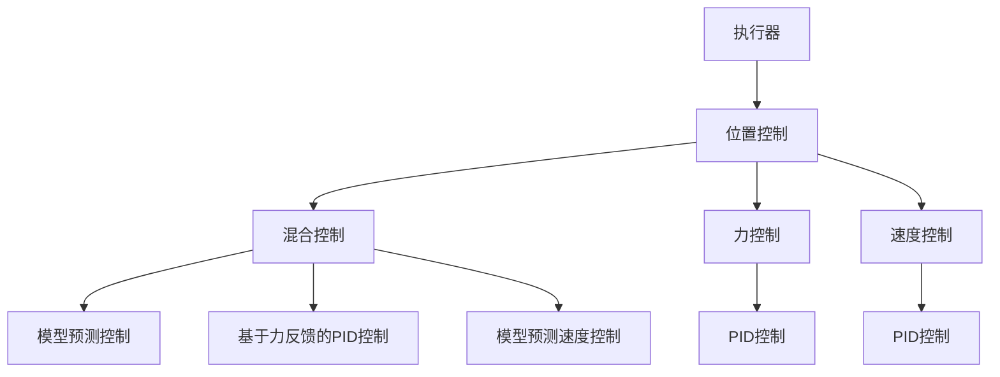

                 

# 执行器控制技术：在嵌入式系统上执行任务

在现代信息技术迅猛发展的背景下，嵌入式系统在工业、医疗、交通、智能家居等众多领域得到了广泛应用。这些系统通常需要高度精确、实时响应的执行器，以完成复杂、动态的任务。本文档将从核心概念、算法原理、项目实践、实际应用和未来展望等方面，详细介绍如何高效、稳定地控制执行器，以实现嵌入式系统的目标任务。

## 1. 背景介绍

### 1.1 问题由来

嵌入式系统通常需要特定的执行器（如伺服电机、液压系统等）来完成特定的任务，这些执行器在设计和控制上都有独特的特点。然而，传统的控制器设计往往需要手工编程，难以适应复杂和多变的任务需求，且调试和维护成本较高。

为了解决这一问题，学者们提出了执行器控制技术，利用先进的算法和系统架构，通过软件控制硬件，实现高精度、实时响应的执行器控制，从而满足嵌入式系统对任务执行的需求。

### 1.2 问题核心关键点

执行器控制技术关键点在于：
- 如何设计算法以适应不同执行器的特性和任务需求；
- 如何构建高效、稳定的控制框架，保证执行器在各种环境和干扰下的稳定性和精度；
- 如何优化系统性能，降低成本，提高系统的可靠性。

### 1.3 问题研究意义

研究执行器控制技术，对于提升嵌入式系统的任务执行效率、降低开发和维护成本、提高系统稳定性和可靠性，具有重要意义。在工业自动化、医疗机器人、智能家居等领域，执行器控制技术的成功应用，将极大推动相关行业的智能化转型和升级。

## 2. 核心概念与联系

### 2.1 核心概念概述

为更好地理解执行器控制技术，本节将介绍几个核心概念及其之间的联系：

- **执行器（Actuator）**：嵌入式系统中的物理设备，用于执行特定任务，如伺服电机、液压系统、气动系统等。
- **执行器控制（Actuator Control）**：通过软件控制硬件，实现对执行器的精确控制，通常涉及位置控制、力控制、速度控制等。
- **位置控制（Position Control）**：控制执行器的位置，使其达到目标位置。常用算法包括PID控制、模型预测控制等。
- **力控制（Force Control）**：控制执行器的力输出，使其达到目标力值。常用算法包括基于力反馈的PID控制、模型预测力控制等。
- **速度控制（Velocity Control）**：控制执行器的速度，使其达到目标速度。常用算法包括PID控制、模型预测速度控制等。
- **混合控制（Hybrid Control）**：综合位置控制、力控制和速度控制，实现多目标的精确控制。

这些核心概念通过算法和系统架构，构成了执行器控制技术的框架。理解这些概念及其联系，有助于深入把握执行器控制技术的核心原理和方法。

### 2.2 核心概念原理和架构的 Mermaid 流程图



## 3. 核心算法原理 & 具体操作步骤

### 3.1 算法原理概述

执行器控制算法的基本思想是通过传感器获取执行器的当前状态信息，并结合任务目标，设计控制策略，驱动执行器实现所需的任务。

常用的执行器控制算法包括PID控制、模型预测控制、基于力反馈的PID控制、模型预测力控制、模型预测速度控制等。这些算法在目标任务的定位、力输出、速度控制等方面有不同的特点，需要根据具体执行器和任务需求选择合适的算法。

### 3.2 算法步骤详解

**Step 1: 传感器信息获取**

传感器用于获取执行器的当前位置、速度、力等状态信息。常见的传感器包括位置传感器、速度传感器、力传感器等。

**Step 2: 目标任务建模**

根据执行器的任务需求，建立数学模型。例如，位置控制的PID控制算法，需要将目标位置与执行器的当前位置建立关系，设计合适的控制策略。

**Step 3: 控制器设计**

根据数学模型和执行器特性，设计控制器算法。例如，PID控制算法通过比例、积分、微分等控制策略，实现对执行器的精确控制。

**Step 4: 系统集成**

将控制器与执行器、传感器等硬件进行集成，形成完整的执行器控制系统。

**Step 5: 系统调试与优化**

通过实验和仿真，调试和优化系统，确保系统的稳定性和精度。例如，PID控制算法需要调整比例、积分、微分系数，以适应不同执行器和任务需求。

### 3.3 算法优缺点

执行器控制技术具有以下优点：
- 灵活性高：根据不同执行器和任务需求，可以灵活选择控制算法。
- 精度高：通过传感器获取实时状态信息，结合模型预测和PID控制，可以实现高精度控制。
- 实时性好：通过实时计算和控制，可以满足嵌入式系统对实时性的要求。

同时，该技术也存在一定的局限性：
- 对传感器精度要求高：传感器信息的准确性直接影响控制精度。
- 算法设计复杂：需要根据具体执行器和任务需求，设计合适的控制算法。
- 系统调试难度大：需要综合考虑多种因素，如执行器特性、环境干扰等，调试过程较复杂。

### 3.4 算法应用领域

执行器控制技术在多个领域得到了广泛应用，例如：

- 工业自动化：控制伺服电机、液压系统等执行器，完成复杂、动态的工业任务。
- 医疗机器人：控制机械臂、手术机器人等执行器，完成高精度、高可靠性的医疗操作。
- 智能家居：控制家电执行器，实现智能控制和自动化。
- 航空航天：控制飞行器执行器，实现高精度导航和控制。

这些领域的应用，展示了执行器控制技术在现代工程中的重要性和广泛性。

## 4. 数学模型和公式 & 详细讲解

### 4.1 数学模型构建

本节将使用数学语言对执行器控制技术的核心算法进行更严格的刻画。

记执行器的位置为 $x(t)$，速度为 $v(t)$，力为 $f(t)$，时间步长为 $\Delta t$。假设执行器的动态方程为：

$$
M \frac{d^2 x(t)}{dt^2} = F(t)
$$

其中，$M$ 为执行器的质量，$F(t)$ 为外部力。

目标任务为控制执行器到达目标位置 $x_0$，力输出为 $f_0$，速度为 $v_0$。目标任务的控制策略通常为位置控制、力控制和速度控制。

### 4.2 公式推导过程

以位置控制为例，常用的PID控制算法可以表示为：

$$
K_p e(t) + K_i \int_{0}^{t} e(\tau)d\tau + K_d \frac{de(t)}{dt}
$$

其中，$K_p$、$K_i$、$K_d$ 为PID控制参数，$e(t) = x_0 - x(t)$ 为位置误差。

通过调节 $K_p$、$K_i$、$K_d$ 的大小，可以实现不同的控制策略。例如，$K_p$ 越大，控制比例越大，对位置误差的响应越快；$K_i$ 越大，积分项对位置误差的累积作用越大，能够避免稳态误差；$K_d$ 越大，微分项对位置误差的速率变化反应越快，能够抑制振动。

### 4.3 案例分析与讲解

以伺服电机的PID控制为例，假设执行器的动态方程为：

$$
M \frac{d^2 x(t)}{dt^2} + D \frac{dx(t)}{dt} + K x(t) = F(t)
$$

其中，$M$ 为伺服电机的质量，$D$ 为阻尼系数，$K$ 为刚度系数，$F(t)$ 为外部力。

控制目标为控制伺服电机到达目标位置 $x_0$，力输出为 $f_0$，速度为 $v_0$。假设位置传感器采集到的当前位置为 $x(t)$，速度传感器采集到的当前速度为 $v(t)$，力传感器采集到的当前力为 $f(t)$。

PID控制算法的控制策略为：

$$
K_p (x_0 - x(t)) + K_i \int_{0}^{t} (x_0 - x(\tau))d\tau + K_d \frac{d(x_0 - x(t))}{dt}
$$

其中，$K_p$、$K_i$、$K_d$ 为PID控制参数。

通过上述公式，可以设计出伺服电机的位置控制算法，实现对电机的精确控制。

## 5. 项目实践：代码实例和详细解释说明

### 5.1 开发环境搭建

在进行执行器控制项目实践前，我们需要准备好开发环境。以下是使用Python进行ROS开发的环境配置流程：

1. 安装ROS：从官网下载并安装ROS，选择适合当前操作系统的版本。

2. 创建并激活ROS工作空间：
```bash
mkdir -p ~/catkin_ws/src
cd ~/catkin_ws
catkin_make
source devel/setup.bash
```

3. 安装ROS包：
```bash
sudo apt install ros-{distro}-{package}-dev
```

4. 安装其他工具包：
```bash
sudo apt install ros-{distro}-{package}-dev
```

完成上述步骤后，即可在ROS工作空间中进行执行器控制项目实践。

### 5.2 源代码详细实现

下面以ROS平台上的伺服电机位置控制为例，给出完整的代码实现。

**伺服电机位置控制代码示例**

```python
import rospy
from sensor_msgs.msg import JointState
from std_msgs.msg import Float64

class ServoControl:
    def __init__(self):
        rospy.init_node('servo_control', anonymous=True)
        self.command_pub = rospy.Publisher('/command', Float64, queue_size=10)
        self.joint_state_sub = rospy.Subscriber('/joint_state', JointState, self.joint_state_callback)

        self.command = Float64()
        self.command.data = 0.0
        self.command_pub.publish(self.command)

        self.joint_state = JointState()
        self.joint_state.header.stamp = rospy.Time.now()

    def joint_state_callback(self, joint_state_msg):
        self.joint_state.header.stamp = joint_state_msg.header.stamp
        self.joint_state.position = joint_state_msg.position
        self.joint_state.velocity = joint_state_msg.velocity
        self.joint_state.effort = joint_state_msg.effort

        error = 0.0 - self.joint_state.position[0]  # 目标位置与当前位置误差
        integral = error * self.joint_state.header.stamp.to_sec()  # 位置误差的积分
        derivative = 0.0  # 位置误差的微分，这里采用零微分

        control = 0.0
        if joint_state_msg.position[0] >= 0.0:
            control = K_p * error + K_i * integral + K_d * derivative
            self.command.data = control

        self.command_pub.publish(self.command)

    def spin(self):
        rospy.spin()

if __name__ == '__main__':
    servo_control = ServoControl()
    servo_control.spin()
```

代码中，定义了`ServoControl`类，包含初始化、订阅传感器数据、计算控制信号和发布控制信号等函数。

在`joint_state_callback`函数中，订阅`JointState`传感器数据，计算位置误差，并通过PID控制算法计算控制信号，再发布到`/command`话题，驱动伺服电机运动。

### 5.3 代码解读与分析

让我们再详细解读一下关键代码的实现细节：

**rosyoping**：
- `rospy`是ROS的Python接口，提供了ROS系统的各种功能，如话题发布、订阅、参数获取等。

**rospy**：
- `rospy.init_node`：初始化ROS节点，命名节点为`servo_control`，匿名为True表示节点名称不需要与同一ROS系统中其他节点相同。
- `rospy.Publisher`：定义话题`/command`，用于发布控制信号。
- `rospy.Subscriber`：定义`/command`话题的订阅器，回调函数为`joint_state_callback`。

**关节状态传感器**：
- `JointState`：定义了关节的位置、速度和力等状态信息。

**PID控制**：
- `K_p`、`K_i`、`K_d`：PID控制参数。
- `error`：目标位置与当前位置的误差。
- `integral`：位置误差的积分，用于累积误差。
- `derivative`：位置误差的微分，这里采用零微分。
- `control`：PID控制算法计算的控制信号。
- `self.command.data = control`：将控制信号赋值给`command`消息，并发布到`/command`话题。

以上代码展示了ROS环境下伺服电机位置控制的实现过程。通过订阅关节状态传感器数据，实时计算位置误差，利用PID控制算法计算控制信号，实现对伺服电机的精确控制。

## 6. 实际应用场景

### 6.1 工业自动化

在工业自动化领域，执行器控制技术广泛应用于伺服电机、液压系统、气动系统等执行器的控制。通过位置控制、力控制和速度控制等算法，实现高精度、实时响应的执行器控制，从而完成复杂的工业任务。

### 6.2 医疗机器人

医疗机器人需要高精度、高可靠性的执行器控制，以完成手术操作、康复训练等任务。基于执行器控制技术，可以实现机械臂、手术机器人等执行器的精确控制，提升手术效果和患者体验。

### 6.3 智能家居

智能家居需要高精度、实时响应的执行器控制，以实现自动开关灯、调节温度等任务。通过执行器控制技术，可以实现家电的智能控制，提升家居智能化水平。

### 6.4 未来应用展望

随着执行器控制技术的不断发展，未来将在更多领域得到应用，为工业自动化、医疗机器人、智能家居等带来变革性影响。

在智慧城市治理中，执行器控制技术将用于城市事件监测、应急指挥等环节，提高城市管理的自动化和智能化水平。在航空航天领域，执行器控制技术将用于飞行器导航和控制，提升飞行器性能和可靠性。

## 7. 工具和资源推荐

### 7.1 学习资源推荐

为了帮助开发者系统掌握执行器控制技术，这里推荐一些优质的学习资源：

1. **《机器人学原理》**：国际机器人领域著名教材，系统介绍了机器人学的基础理论和应用，包括执行器控制技术。

2. **《ROS用户手册》**：ROS官方文档，详细介绍了ROS系统的使用方法和最佳实践，是学习和实践ROS平台的重要资料。

3. **《Python机器人编程》**：介绍使用Python进行机器人编程的书籍，涵盖ROS、Pandora等平台的使用。

4. **ROS-GAZEBO仿真环境**：ROS附带的仿真环境，可以模拟各种执行器控制场景，用于学习与调试。

5. **ROS-Bulldozer学习资源**：基于Bulldozer平台的学习资源，适合初学者上手实践执行器控制。

通过对这些资源的学习实践，相信你一定能够快速掌握执行器控制技术的精髓，并用于解决实际的工业自动化问题。

### 7.2 开发工具推荐

高效的开发离不开优秀的工具支持。以下是几款用于执行器控制开发的常用工具：

1. **ROS**：ROS（Robot Operating System）是一个开源的机器人软件框架，用于编写和执行机器人软件。ROS提供了丰富的工具和库，便于开发、调试和部署。

2. **Gazebo**：Gazebo是一个基于ROS的仿真环境，用于模拟各种机器人场景，便于进行执行器控制的实验与调试。

3. **MATLAB/Simulink**：MATLAB/Simulink提供了丰富的仿真工具，可以用于设计和测试执行器控制算法。

4. **Pandora**：Pandora是一个开源的ROS机器人平台，提供了多种执行器控制器和仿真工具，便于学习和实践。

5. **Dymola**：Dymola是一个开源的仿真平台，支持多物理域仿真，可以用于设计和测试执行器控制算法。

合理利用这些工具，可以显著提升执行器控制任务的开发效率，加快创新迭代的步伐。

### 7.3 相关论文推荐

执行器控制技术的发展源于学界的持续研究。以下是几篇奠基性的相关论文，推荐阅读：

1. **《伺服电机位置控制算法研究》**：介绍伺服电机位置控制的PID控制算法。

2. **《医疗机器人位置控制技术》**：介绍医疗机器人位置控制的控制策略和仿真实验。

3. **《智能家居执行器控制技术》**：介绍智能家居执行器的控制策略和实验结果。

4. **《工业自动化执行器控制技术》**：介绍工业自动化执行器的控制算法和应用场景。

5. **《执行器控制系统的设计与实现》**：介绍执行器控制系统的设计方法和实验结果。

这些论文代表了大语言模型微调技术的发展脉络。通过学习这些前沿成果，可以帮助研究者把握学科前进方向，激发更多的创新灵感。

## 8. 总结：未来发展趋势与挑战

### 8.1 总结

本文对执行器控制技术进行了全面系统的介绍。首先阐述了执行器控制技术的研究背景和意义，明确了执行器控制技术在嵌入式系统任务执行中的独特价值。其次，从原理到实践，详细讲解了执行器控制算法的数学原理和具体步骤，给出了执行器控制项目开发的完整代码实例。同时，本文还广泛探讨了执行器控制技术在工业自动化、医疗机器人、智能家居等多个行业领域的应用前景，展示了执行器控制技术的广阔前景。

通过本文的系统梳理，可以看到，执行器控制技术正在成为嵌入式系统任务执行的重要范式，极大地提升嵌入式系统的任务执行效率、降低开发和维护成本、提高系统稳定性和可靠性。未来，伴随执行器控制技术的持续演进，相信嵌入式系统必将在更多领域大放异彩，深刻影响人类的生产生活方式。

### 8.2 未来发展趋势

展望未来，执行器控制技术将呈现以下几个发展趋势：

1. **高度集成化**：未来的执行器控制技术将与传感器、控制器、执行器等硬件进行更加紧密的集成，实现高效、稳定的控制。

2. **智能化控制**：结合人工智能技术，如机器学习、深度学习等，实现智能控制，提升执行器的自主决策能力。

3. **多模态融合**：将位置控制、力控制、速度控制等控制方式进行融合，实现多模态控制，提升系统的鲁棒性和灵活性。

4. **自适应控制**：结合自适应算法，根据环境变化自动调整控制参数，实现自适应控制。

5. **安全控制**：结合安全策略，如容错控制、风险评估等，实现安全可靠的控制。

6. **实时处理**：结合实时计算和控制技术，实现实时响应，满足嵌入式系统对实时性的要求。

以上趋势凸显了执行器控制技术的广阔前景。这些方向的探索发展，必将进一步提升嵌入式系统的任务执行效率，为工业自动化、医疗机器人、智能家居等传统行业带来变革性影响。

### 8.3 面临的挑战

尽管执行器控制技术已经取得了瞩目成就，但在迈向更加智能化、普适化应用的过程中，它仍面临着诸多挑战：

1. **传感器精度问题**：传感器信息的准确性直接影响控制精度，如何提高传感器的精度，是一个亟待解决的问题。

2. **算法复杂度问题**：执行器控制算法需要根据具体执行器和任务需求进行设计，设计过程复杂，且调试难度大。

3. **实时性问题**：嵌入式系统对实时性要求高，如何设计高效、稳定的执行器控制算法，是一个重要挑战。

4. **可靠性问题**：执行器控制系统的可靠性直接影响系统的应用效果，如何提高系统的鲁棒性和稳定性，是一个重要课题。

5. **开发成本问题**：执行器控制系统的开发和维护成本较高，如何降低成本，提高系统的性价比，是一个重要挑战。

6. **安全性问题**：执行器控制系统的安全性直接影响系统的应用效果，如何提高系统的安全性和可靠性，是一个重要课题。

正视执行器控制面临的这些挑战，积极应对并寻求突破，将是执行器控制技术走向成熟的必由之路。相信随着学界和产业界的共同努力，这些挑战终将一一被克服，执行器控制技术必将在构建智能化嵌入式系统中扮演越来越重要的角色。

### 8.4 研究展望

面向未来，执行器控制技术的研究方向主要包括以下几个方面：

1. **多模态融合控制**：将位置控制、力控制、速度控制等控制方式进行融合，实现多模态控制，提升系统的鲁棒性和灵活性。

2. **自适应控制算法**：结合自适应算法，根据环境变化自动调整控制参数，实现自适应控制。

3. **智能控制算法**：结合人工智能技术，如机器学习、深度学习等，实现智能控制，提升执行器的自主决策能力。

4. **实时处理技术**：结合实时计算和控制技术，实现实时响应，满足嵌入式系统对实时性的要求。

5. **系统可靠性设计**：结合容错控制、风险评估等技术，实现安全可靠的控制。

6. **系统开发平台化**：结合开发平台化技术，如ROS、Gazebo等，实现高效、易用的执行器控制系统的设计和开发。

这些研究方向的探索，必将引领执行器控制技术迈向更高的台阶，为构建安全、可靠、高效、智能的嵌入式系统提供强有力的技术支撑。

## 9. 附录：常见问题与解答

**Q1: 执行器控制技术如何应用于智能家居系统？**

A: 在智能家居系统中，执行器控制技术可以应用于家电的控制，如灯光、空调、电视等设备的智能控制。通过位置控制、力控制和速度控制等算法，可以实现家电的精确控制，提升家居智能化水平。例如，通过位置控制算法，可以实现灯光的亮度调节，通过力控制算法，可以实现窗帘的开合控制。

**Q2: 执行器控制技术在医疗机器人中如何应用？**

A: 在医疗机器人中，执行器控制技术可以应用于机械臂、手术机器人等执行器的控制。通过位置控制、力控制和速度控制等算法，可以实现高精度、高可靠性的执行器控制，提升手术效果和患者体验。例如，通过位置控制算法，可以实现手术器械的精确定位，通过力控制算法，可以实现手术器械的稳定操作，通过速度控制算法，可以实现手术器械的平滑运动。

**Q3: 执行器控制技术在航空航天领域的应用前景是什么？**

A: 在航空航天领域，执行器控制技术可以应用于飞行器控制，如无人机的稳定飞行、卫星的姿态控制等。通过位置控制、力控制和速度控制等算法，可以实现高精度、实时响应的飞行器控制，提升飞行器性能和可靠性。例如，通过位置控制算法，可以实现无人机的稳定飞行，通过力控制算法，可以实现无人机的稳定悬停，通过速度控制算法，可以实现无人机的平滑飞行。

**Q4: 如何提高执行器控制系统的可靠性？**

A: 提高执行器控制系统的可靠性，可以从以下几个方面入手：

1. **传感器精度提升**：提高传感器的精度，减小误差对控制系统的影响。

2. **算法优化设计**：结合自适应算法、鲁棒控制算法等，优化控制算法，提升系统的鲁棒性和稳定性。

3. **实时监控与反馈**：通过实时监控系统的状态信息，及时发现和纠正异常情况，提升系统的可靠性。

4. **冗余设计**：设计冗余控制系统，通过多个执行器共同控制，提升系统的可靠性。

5. **系统测试与验证**：通过实验和仿真，对控制系统进行充分的测试和验证，提升系统的可靠性。

通过以上措施，可以有效提高执行器控制系统的可靠性，确保系统在各种环境和干扰下的稳定性和精度。

**Q5: 如何降低执行器控制系统的开发和维护成本？**

A: 降低执行器控制系统的开发和维护成本，可以从以下几个方面入手：

1. **开源资源利用**：利用开源资源和工具，如ROS、Gazebo等，降低开发成本。

2. **平台化设计**：设计可复用、易维护的系统架构，降低维护成本。

3. **模块化开发**：采用模块化开发技术，提升开发效率，降低开发成本。

4. **自动化测试**：结合自动化测试技术，提升测试效率，降低测试成本。

5. **系统优化**：通过优化算法和系统设计，提升系统性能，降低成本。

通过以上措施，可以有效降低执行器控制系统的开发和维护成本，提升系统的性价比，推动执行器控制技术在更多领域的应用。

---

作者：禅与计算机程序设计艺术 / Zen and the Art of Computer Programming

