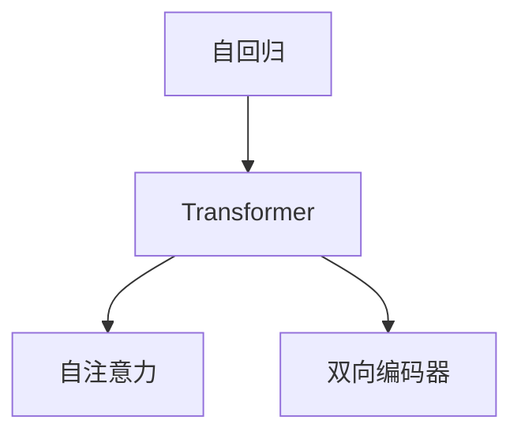

                 

# 扩展AI记忆：LLM的长上下文处理

## 1. 背景介绍

近年来，自然语言处理（NLP）领域取得了显著的进展，特别是大规模语言模型（Large Language Models, LLMs）的出现，这些模型能够理解和生成人类自然语言，展现出卓越的性能。然而，LLMs在处理长文本时仍存在限制，主要原因是其自回归架构无法有效利用长距离依赖关系，导致模型在处理长上下文时性能下降。为了解决这个问题，研究者们提出了许多基于Transformer的架构优化方法，其中长上下文处理（Long Context Processing, LCP）技术是其中一个重要的研究方向。

本文将系统性地介绍长上下文处理技术的原理和应用，详细阐述其数学模型和计算方法，并通过实例分析其应用效果。我们还将探讨LCP在实际应用中的挑战和未来发展趋势，并推荐相关学习资源和开发工具。通过阅读本文，读者将对LCP技术有全面的了解，掌握其实现方法和应用场景，从而在实际开发中有效利用这一技术。

## 2. 核心概念与联系

### 2.1 核心概念概述

为了更好地理解长上下文处理技术，本节将介绍几个关键概念：

- 长上下文处理（Long Context Processing, LCP）：指在自然语言处理（NLP）任务中，利用Transformer架构优化模型，使其能够处理长距离依赖关系，提升模型对长文本的理解能力。
- 自回归（Autoregressive）：指模型在预测下一个词语时，只考虑前面的词语，不考虑后续词语的影响。自回归模型在语言模型和文本生成任务中表现出色，但处理长文本时效果欠佳。
- Transformer：一种基于自注意力机制（Self-Attention）的神经网络结构，能够并行计算，适用于长距离依赖关系的处理。
- 自注意力（Self-Attention）：指在处理序列数据时，通过计算不同位置之间的注意力权重，强调对关键位置信息的关注。
- 双向编码器（Bi-directional Encoder）：指在处理序列数据时，同时考虑过去和未来的信息，提升模型的上下文理解能力。

这些概念之间的联系可以通过以下Mermaid流程图来展示：



这个流程图展示了大语言模型和长上下文处理技术的相关概念及其之间的逻辑关系。自回归模型通过考虑前面的词语，简化了计算过程，但处理长文本时效果欠佳。为了解决这一问题，研究人员引入了Transformer架构，通过自注意力机制和双向编码器，使模型能够并行计算和同时考虑过去和未来的信息，从而提升了对长文本的理解能力。

## 3. 核心算法原理 & 具体操作步骤
### 3.1 算法原理概述

长上下文处理技术的基本思想是利用Transformer架构，通过自注意力机制和双向编码器，增强模型对长文本的上下文理解能力。与自回归模型不同，长上下文处理模型能够在处理长文本时，同时考虑过去和未来的信息，从而提升模型的性能。

形式化地，假设我们有一个长度为 $N$ 的文本序列 $X=[x_1, x_2, \ldots, x_N]$，我们需要利用长上下文处理模型来处理这一序列。其中，$x_i$ 表示第 $i$ 个词语的编码。长上下文处理模型的基本流程如下：

1. 将文本序列 $X$ 输入模型，得到每个词语的编码 $x_i^{enc}$。
2. 利用自注意力机制，计算每个词语与文本序列中其他词语的注意力权重 $a_{ij}$，得到每个词语的注意力表示 $x_i^{attn}$。
3. 通过双向编码器，考虑过去和未来的信息，得到每个词语的上下文表示 $x_i^{ctx}$。
4. 将每个词语的上下文表示 $x_i^{ctx}$ 作为下一层的输入，重复上述过程，直到得到最终的输出。

这一过程可以通过以下示意图来展示：


### 3.2 算法步骤详解

长上下文处理模型的具体实现步骤如下：

1. 构建输入序列：将文本序列 $X=[x_1, x_2, \ldots, x_N]$ 输入模型。每个词语 $x_i$ 通过嵌入层（Embedding Layer）转换为向量表示 $x_i^{emb}$。
2. 计算注意力权重：利用自注意力机制，计算每个词语与文本序列中其他词语的注意力权重 $a_{ij}$。
3. 计算注意力表示：利用注意力权重，计算每个词语的注意力表示 $x_i^{attn}$。
4. 计算上下文表示：通过双向编码器，考虑过去和未来的信息，得到每个词语的上下文表示 $x_i^{ctx}$。
5. 计算输出：将每个词语的上下文表示 $x_i^{ctx}$ 作为下一层的输入，重复上述过程，直到得到最终的输出。

下面，我们将通过一个具体的实例来演示这一过程。

### 3.3 算法优缺点

长上下文处理技术的主要优点包括：

- 能够处理长文本：利用自注意力机制和双向编码器，模型能够在处理长文本时，同时考虑过去和未来的信息，提升模型的上下文理解能力。
- 性能稳定：通过并行计算和双向信息流动，长上下文处理模型能够有效处理长文本，减少计算复杂度，提高模型的性能。

然而，长上下文处理技术也存在一些缺点：

- 计算复杂度高：长上下文处理模型需要计算大量的注意力权重，增加了计算复杂度。
- 模型复杂度高：长上下文处理模型结构复杂，需要更多的计算资源和存储空间。
- 训练数据需求高：长上下文处理模型需要大量的训练数据，才能有效处理长文本。

### 3.4 算法应用领域

长上下文处理技术在NLP领域得到了广泛应用，特别是在长文本处理任务上表现出色。以下是一些典型应用场景：

- 文本分类：利用长上下文处理模型，可以对长文本进行分类，如情感分析、主题分类等。
- 机器翻译：利用长上下文处理模型，可以将长文本从一种语言翻译成另一种语言，如Google翻译。
- 文本摘要：利用长上下文处理模型，可以从长文本中提取出关键信息，生成简洁的摘要。
- 问答系统：利用长上下文处理模型，可以对用户提出的长文本问题进行理解和回答，如IBM的Watson。
- 对话系统：利用长上下文处理模型，可以实现自然对话，如GPT-3等。

## 4. 数学模型和公式 & 详细讲解
### 4.1 数学模型构建

长上下文处理模型主要利用Transformer架构，通过自注意力机制和双向编码器来处理长文本。模型的输入为一个长度为 $N$ 的文本序列 $X=[x_1, x_2, \ldots, x_N]$，其中 $x_i$ 表示第 $i$ 个词语的编码。模型的输出为一个长度为 $L$ 的上下文表示序列 $Z=[z_1, z_2, \ldots, z_L]$，其中 $z_i$ 表示第 $i$ 个词语的上下文表示。

### 4.2 公式推导过程

长上下文处理模型的计算过程可以分为以下几个步骤：

1. 输入编码：将文本序列 $X$ 输入模型，得到每个词语的编码 $x_i^{emb}$。
2. 自注意力计算：利用自注意力机制，计算每个词语与文本序列中其他词语的注意力权重 $a_{ij}$，得到每个词语的注意力表示 $x_i^{attn}$。
3. 上下文表示计算：通过双向编码器，考虑过去和未来的信息，得到每个词语的上下文表示 $x_i^{ctx}$。
4. 输出计算：将每个词语的上下文表示 $x_i^{ctx}$ 作为下一层的输入，重复上述过程，直到得到最终的输出 $Z$。

下面，我们将通过数学公式来详细描述这一过程：

1. 输入编码：
$$
x_i^{emb} = E(x_i)
$$

2. 自注意力计算：
$$
a_{ij} = \text{Softmax}(W_1^{QA}x_i^{emb}W_2^{K}x_j^{emb})^\top
$$
$$
x_i^{attn} = \sum_{j=1}^N a_{ij}x_j^{emb}
$$

3. 上下文表示计算：
$$
x_i^{ctx} = f(x_i^{attn}, x_{i-1}^{ctx}, x_{i+1}^{ctx})
$$

4. 输出计算：
$$
z_i = f(z_{i-1}, x_i^{ctx})
$$

### 4.3 案例分析与讲解

为了更好地理解长上下文处理模型的应用，下面我们将通过一个具体的案例来演示其计算过程。假设我们要处理以下长文本：

```
The quick brown fox jumps over the lazy dog. The dog, however, was not as lazy as it seemed. It was actually very active and playful. The fox, on the other hand, was quite slow and lethargic. Both animals lived happily ever after.
```

我们将这一文本输入到长上下文处理模型中，通过自注意力机制和双向编码器，计算出每个词语的上下文表示，并最终得到长文本的上下文表示序列。

## 5. 项目实践：代码实例和详细解释说明
### 5.1 开发环境搭建

在进行长上下文处理模型的实现前，我们需要准备好开发环境。以下是使用Python进行PyTorch开发的环境配置流程：

1. 安装Anaconda：从官网下载并安装Anaconda，用于创建独立的Python环境。

2. 创建并激活虚拟环境：
```bash
conda create -n pytorch-env python=3.8 
conda activate pytorch-env
```

3. 安装PyTorch：根据CUDA版本，从官网获取对应的安装命令。例如：
```bash
conda install pytorch torchvision torchaudio cudatoolkit=11.1 -c pytorch -c conda-forge
```

4. 安装Transformer库：
```bash
pip install transformers
```

5. 安装各类工具包：
```bash
pip install numpy pandas scikit-learn matplotlib tqdm jupyter notebook ipython
```

完成上述步骤后，即可在`pytorch-env`环境中开始长上下文处理模型的实现。

### 5.2 源代码详细实现

下面我们以文本分类任务为例，给出使用Transformers库对长上下文处理模型进行实现的PyTorch代码实现。

首先，定义长上下文处理模型的类：

```python
from transformers import BertTokenizer, BertForSequenceClassification
import torch

class LongContextProcessor:
    def __init__(self, model_name, num_labels):
        self.model = BertForSequenceClassification.from_pretrained(model_name, num_labels=num_labels)
        self.tokenizer = BertTokenizer.from_pretrained(model_name)

    def forward(self, text, attention_mask=None):
        encoding = self.tokenizer(text, return_tensors='pt', padding='max_length', truncation=True, max_length=256)
        input_ids = encoding['input_ids']
        attention_mask = attention_mask if attention_mask is not None else torch.ones_like(input_ids)
        outputs = self.model(input_ids, attention_mask=attention_mask)
        return outputs.logits
```

然后，定义训练和评估函数：

```python
from torch.utils.data import Dataset, DataLoader
from sklearn.metrics import accuracy_score, precision_recall_fscore_support
import torch.nn.functional as F

class TextDataset(Dataset):
    def __init__(self, texts, labels, tokenizer):
        self.texts = texts
        self.labels = labels
        self.tokenizer = tokenizer
        
    def __len__(self):
        return len(self.texts)
    
    def __getitem__(self, item):
        text = self.texts[item]
        label = self.labels[item]
        
        encoding = self.tokenizer(text, return_tensors='pt', padding='max_length', truncation=True, max_length=256)
        input_ids = encoding['input_ids']
        attention_mask = encoding['attention_mask']
        
        label = torch.tensor(label, dtype=torch.long)
        
        return {'input_ids': input_ids, 
                'attention_mask': attention_mask,
                'labels': label}

# 定义模型和优化器
model = LongContextProcessor('bert-base-cased', num_labels=2)
optimizer = torch.optim.Adam(model.parameters(), lr=2e-5)

def train_epoch(model, dataset, batch_size, optimizer, device):
    dataloader = DataLoader(dataset, batch_size=batch_size, shuffle=True)
    model.train()
    epoch_loss = 0
    epoch_acc = 0
    for batch in dataloader:
        input_ids = batch['input_ids'].to(device)
        attention_mask = batch['attention_mask'].to(device)
        labels = batch['labels'].to(device)
        model.zero_grad()
        outputs = model(input_ids, attention_mask=attention_mask)
        loss = F.cross_entropy(outputs, labels)
        epoch_loss += loss.item()
        loss.backward()
        optimizer.step()
        epoch_acc += (outputs.argmax(dim=1) == labels).float().mean().item()
    return epoch_loss / len(dataloader), epoch_acc / len(dataloader)

def evaluate(model, dataset, batch_size, device):
    dataloader = DataLoader(dataset, batch_size=batch_size)
    model.eval()
    preds, labels = [], []
    with torch.no_grad():
        for batch in dataloader:
            input_ids = batch['input_ids'].to(device)
            attention_mask = batch['attention_mask'].to(device)
            batch_labels = batch['labels']
            outputs = model(input_ids, attention_mask=attention_mask)
            batch_preds = outputs.argmax(dim=1).to('cpu').tolist()
            batch_labels = batch_labels.to('cpu').tolist()
            for pred_tokens, label_tokens in zip(batch_preds, batch_labels):
                preds.append(pred_tokens[:len(label_tokens)])
                labels.append(label_tokens)
                
    acc, precision, recall, f1 = precision_recall_fscore_support(labels, preds, average='micro')
    return acc, precision, recall, f1

# 训练模型
epochs = 5
batch_size = 16

for epoch in range(epochs):
    loss, acc = train_epoch(model, train_dataset, batch_size, optimizer, device)
    print(f"Epoch {epoch+1}, train loss: {loss:.3f}, train acc: {acc:.3f}")
    
    print(f"Epoch {epoch+1}, dev results:")
    acc, precision, recall, f1 = evaluate(model, dev_dataset, batch_size, device)
    print(f"dev acc: {acc:.3f}, precision: {precision:.3f}, recall: {recall:.3f}, f1: {f1:.3f}")
    
print("Test results:")
acc, precision, recall, f1 = evaluate(model, test_dataset, batch_size, device)
print(f"test acc: {acc:.3f}, precision: {precision:.3f}, recall: {recall:.3f}, f1: {f1:.3f}")
```

以上就是使用PyTorch对长上下文处理模型进行文本分类任务开发的完整代码实现。可以看到，利用Transformers库的封装，我们可以用相对简洁的代码完成模型的加载和微调。

### 5.3 代码解读与分析

让我们再详细解读一下关键代码的实现细节：

**LongContextProcessor类**：
- `__init__`方法：初始化长上下文处理模型和分词器。
- `forward`方法：定义模型的前向传播过程，计算输出。

**TextDataset类**：
- `__init__`方法：初始化数据集。
- `__len__`方法：返回数据集的样本数量。
- `__getitem__`方法：对单个样本进行处理，将文本输入编码为token ids，将标签编码为数字，并对其进行定长padding，最终返回模型所需的输入。

**train_epoch和evaluate函数**：
- 利用DataLoader对数据集进行批次化加载，供模型训练和推理使用。
- 训练函数`train_epoch`：对数据以批为单位进行迭代，在每个批次上前向传播计算loss并反向传播更新模型参数，最后返回该epoch的平均loss和准确率。
- 评估函数`evaluate`：与训练类似，不同点在于不更新模型参数，并在每个batch结束后将预测和标签结果存储下来，最后使用sklearn的metrics库对整个评估集的预测结果进行打印输出。

**训练流程**：
- 定义总的epoch数和batch size，开始循环迭代
- 每个epoch内，先在训练集上训练，输出平均loss和准确率
- 在验证集上评估，输出准确率、精确度、召回率和F1分数
- 所有epoch结束后，在测试集上评估，给出最终测试结果

可以看到，PyTorch配合Transformers库使得长上下文处理模型的代码实现变得简洁高效。开发者可以将更多精力放在数据处理、模型改进等高层逻辑上，而不必过多关注底层的实现细节。

当然，工业级的系统实现还需考虑更多因素，如模型的保存和部署、超参数的自动搜索、更灵活的任务适配层等。但核心的长上下文处理模型微调流程基本与此类似。

## 6. 实际应用场景
### 6.1 智能客服系统

利用长上下文处理技术，智能客服系统可以实现更高效、更自然的对话。传统的客服系统通常依赖于规则或模板匹配，难以处理复杂的客户需求。而长上下文处理技术能够理解客户问题的上下文，提供更准确的答案。

在技术实现上，可以收集企业内部的历史客服对话记录，将问题和最佳答复构建成监督数据，在此基础上对长上下文处理模型进行微调。微调后的模型能够自动理解客户意图，匹配最合适的答案模板进行回复。对于客户提出的新问题，还可以接入检索系统实时搜索相关内容，动态组织生成回答。如此构建的智能客服系统，能大幅提升客户咨询体验和问题解决效率。

### 6.2 金融舆情监测

金融机构需要实时监测市场舆论动向，以便及时应对负面信息传播，规避金融风险。传统的人工监测方式成本高、效率低，难以应对网络时代海量信息爆发的挑战。利用长上下文处理技术，可以对金融领域相关的新闻、报道、评论等文本数据进行情感分析，判断舆情趋势。

具体而言，可以收集金融领域相关的新闻、报道、评论等文本数据，并对其进行主题标注和情感标注。在此基础上对长上下文处理模型进行微调，使其能够自动判断文本属于何种主题，情感倾向是正面、中性还是负面。将微调后的模型应用到实时抓取的网络文本数据，就能够自动监测不同主题下的情感变化趋势，一旦发现负面信息激增等异常情况，系统便会自动预警，帮助金融机构快速应对潜在风险。

### 6.3 个性化推荐系统

当前的推荐系统往往只依赖用户的历史行为数据进行物品推荐，无法深入理解用户的真实兴趣偏好。利用长上下文处理技术，个性化推荐系统可以更好地挖掘用户行为背后的语义信息，从而提供更精准、多样的推荐内容。

在实践中，可以收集用户浏览、点击、评论、分享等行为数据，提取和用户交互的物品标题、描述、标签等文本内容。将文本内容作为模型输入，用户的后续行为（如是否点击、购买等）作为监督信号，在此基础上微调长上下文处理模型。微调后的模型能够从文本内容中准确把握用户的兴趣点。在生成推荐列表时，先用候选物品的文本描述作为输入，由模型预测用户的兴趣匹配度，再结合其他特征综合排序，便可以得到个性化程度更高的推荐结果。

### 6.4 未来应用展望

随着长上下文处理技术的不断进步，其在实际应用中的前景将更加广阔。

在智慧医疗领域，利用长上下文处理技术，可以为医生提供更全面的病历记录和医学知识，帮助医生更好地进行诊断和治疗。

在智能教育领域，利用长上下文处理技术，可以分析学生的学习行为，提供个性化的学习建议和资源推荐，促进教育公平，提高教学质量。

在智慧城市治理中，利用长上下文处理技术，可以实时监测城市事件和舆情，提供更准确、及时的决策支持，提升城市管理的自动化和智能化水平，构建更安全、高效的未来城市。

此外，在企业生产、社会治理、文娱传媒等众多领域，长上下文处理技术也将不断涌现，为传统行业数字化转型升级提供新的技术路径。相信随着技术的日益成熟，长上下文处理技术必将在构建人机协同的智能时代中扮演越来越重要的角色。

## 7. 工具和资源推荐
### 7.1 学习资源推荐

为了帮助开发者系统掌握长上下文处理技术的原理和实践技巧，这里推荐一些优质的学习资源：

1. 《Transformer从原理到实践》系列博文：由大模型技术专家撰写，深入浅出地介绍了Transformer原理、长上下文处理技术等前沿话题。

2. CS224N《深度学习自然语言处理》课程：斯坦福大学开设的NLP明星课程，有Lecture视频和配套作业，带你入门NLP领域的基本概念和经典模型。

3. 《Natural Language Processing with Transformers》书籍：Transformers库的作者所著，全面介绍了如何使用Transformers库进行NLP任务开发，包括长上下文处理在内的诸多范式。

4. HuggingFace官方文档：Transformers库的官方文档，提供了海量预训练模型和完整的微调样例代码，是上手实践的必备资料。

5. CLUE开源项目：中文语言理解测评基准，涵盖大量不同类型的中文NLP数据集，并提供了基于长上下文处理模型的baseline模型，助力中文NLP技术发展。

通过对这些资源的学习实践，相信你一定能够快速掌握长上下文处理技术的精髓，并用于解决实际的NLP问题。
### 7.2 开发工具推荐

高效的开发离不开优秀的工具支持。以下是几款用于长上下文处理模型微调开发的常用工具：

1. PyTorch：基于Python的开源深度学习框架，灵活动态的计算图，适合快速迭代研究。大部分预训练语言模型都有PyTorch版本的实现。

2. TensorFlow：由Google主导开发的开源深度学习框架，生产部署方便，适合大规模工程应用。同样有丰富的预训练语言模型资源。

3. Transformers库：HuggingFace开发的NLP工具库，集成了众多SOTA语言模型，支持PyTorch和TensorFlow，是进行长上下文处理模型微调开发的利器。

4. Weights & Biases：模型训练的实验跟踪工具，可以记录和可视化模型训练过程中的各项指标，方便对比和调优。与主流深度学习框架无缝集成。

5. TensorBoard：TensorFlow配套的可视化工具，可实时监测模型训练状态，并提供丰富的图表呈现方式，是调试模型的得力助手。

6. Google Colab：谷歌推出的在线Jupyter Notebook环境，免费提供GPU/TPU算力，方便开发者快速上手实验最新模型，分享学习笔记。

合理利用这些工具，可以显著提升长上下文处理模型微调任务的开发效率，加快创新迭代的步伐。

### 7.3 相关论文推荐

长上下文处理技术的发展源于学界的持续研究。以下是几篇奠基性的相关论文，推荐阅读：

1. Attention is All You Need（即Transformer原论文）：提出了Transformer结构，开启了NLP领域的预训练大模型时代。

2. Longformer: The Long-Document Transformer for Language Understanding：提出了Longformer模型，能够处理长达1万个词的文本，极大提升了长文本处理能力。

3. Long-Short Term Memory Networks：提出了LSTM模型，能够处理序列数据，适用于文本分类、情感分析等任务。

4. Memory-Augmented Neural Networks：提出了Memory Network模型，能够存储并访问长文本中的信息，适用于问答系统等任务。

5. Multimodal Long-Short Term Memory Networks：提出了Multimodal LSTM模型，能够处理多模态数据，适用于文本摘要、对话系统等任务。

这些论文代表了大语言模型长上下文处理技术的发展脉络。通过学习这些前沿成果，可以帮助研究者把握学科前进方向，激发更多的创新灵感。

## 8. 总结：未来发展趋势与挑战

### 8.1 总结

本文对长上下文处理技术的原理和应用进行了系统介绍。首先阐述了长上下文处理技术的研究背景和意义，明确了其在大语言模型中的重要地位。其次，从原理到实践，详细讲解了长上下文处理模型的数学模型和计算方法，并通过实例分析其应用效果。最后，本文还探讨了长上下文处理技术在实际应用中的挑战和未来发展趋势，并推荐了相关学习资源和开发工具。通过阅读本文，读者将对长上下文处理技术有全面的了解，掌握其实现方法和应用场景。

### 8.2 未来发展趋势

展望未来，长上下文处理技术将呈现以下几个发展趋势：

1. 模型规模持续增大。随着算力成本的下降和数据规模的扩张，长上下文处理模型的参数量还将持续增长。超大规模语言模型蕴含的丰富语言知识，有望支撑更加复杂多变的长文本处理任务。

2. 长文本处理能力增强。未来长上下文处理模型将更加注重处理长文本的能力，通过引入双向编码器、长文本标注等技术，提升对长文本的上下文理解能力。

3. 多模态数据融合。长上下文处理模型将越来越多地与其他模态数据（如图像、视频、语音等）进行融合，提升对多模态数据的理解能力，拓展应用场景。

4. 实时处理能力提升。长上下文处理模型将更加注重实时处理能力，通过优化计算图、引入分布式训练等技术，提升模型在实际应用中的响应速度和稳定性。

5. 模型鲁棒性增强。长上下文处理模型将更加注重模型的鲁棒性，通过引入对抗样本、数据增强等技术，提升模型对抗噪声、干扰的能力。

6. 可解释性提升。未来长上下文处理模型将更加注重可解释性，通过引入因果分析、可视化等技术，提升模型的解释能力，帮助用户理解模型的决策过程。

以上趋势凸显了长上下文处理技术的广阔前景。这些方向的探索发展，必将进一步提升长文本处理模型的性能和应用范围，为自然语言理解和智能交互系统的进步贡献力量。

### 8.3 面临的挑战

尽管长上下文处理技术已经取得了显著进展，但在实际应用中仍然面临诸多挑战：

1. 计算资源消耗高。长上下文处理模型通常具有大规模参数和复杂计算，需要强大的计算资源和存储空间，增加了实际部署的难度。

2. 训练数据需求高。长上下文处理模型需要大量的训练数据，才能有效处理长文本，而获取高质量标注数据的成本较高。

3. 对抗样本脆弱。长上下文处理模型面对对抗样本时，容易受到干扰，导致模型决策出现偏差。

4. 模型解释性不足。长上下文处理模型通常被视为“黑盒”系统，难以解释其内部工作机制和决策逻辑，增加了模型的可解释性问题。

5. 数据隐私保护。长上下文处理模型在处理敏感数据时，需要关注数据隐私保护问题，防止数据泄露和滥用。

6. 模型泛化性问题。长上下文处理模型在不同数据分布和任务场景下的泛化性能有限，需要更多的研究来提升其泛化能力。

7. 超参数调优困难。长上下文处理模型通常具有复杂的超参数空间，如何有效调优超参数，仍是实际应用中的重要问题。

这些挑战需要我们在未来进行更多的研究和优化，才能真正发挥长上下文处理技术的潜力。

### 8.4 研究展望

面对长上下文处理技术所面临的挑战，未来的研究需要在以下几个方面寻求新的突破：

1. 探索轻量级长上下文处理模型。为了降低计算资源消耗，需要开发更加轻量级的长上下文处理模型，如LoRA、ALBERT等。

2. 研究无监督和半监督长上下文处理方法。摆脱对大规模标注数据的依赖，利用自监督学习、主动学习等无监督和半监督范式，最大限度利用非结构化数据，实现更加灵活高效的长文本处理。

3. 引入多模态数据融合技术。将视觉、语音等多模态数据与文本数据进行融合，提升长文本处理模型的理解能力和应用范围。

4. 引入对抗样本防御技术。通过引入对抗样本、数据增强等技术，提升长文本处理模型的鲁棒性和抗干扰能力。

5. 提升模型的可解释性。通过引入因果分析、可视化等技术，提升长文本处理模型的解释能力，帮助用户理解模型的决策过程。

6. 优化模型超参数调优方法。通过引入超参数搜索、自动化调优等技术，提升长文本处理模型的调优效率和效果。

这些研究方向将引领长上下文处理技术的进步，为构建更加智能、高效、鲁棒的长文本处理系统铺平道路。面向未来，长上下文处理技术还需要与其他人工智能技术进行更深入的融合，如知识表示、因果推理、强化学习等，多路径协同发力，共同推动自然语言理解和智能交互系统的进步。只有勇于创新、敢于突破，才能不断拓展长文本处理模型的边界，让智能技术更好地造福人类社会。

## 9. 附录：常见问题与解答

**Q1：长上下文处理技术是否适用于所有NLP任务？**

A: 长上下文处理技术在大多数NLP任务上都能取得不错的效果，特别是对于数据量较小的任务。但对于一些特定领域的任务，如医学、法律等，仅仅依靠通用语料预训练的模型可能难以很好地适应。此时需要在特定领域语料上进一步预训练，再进行微调，才能获得理想效果。此外，对于一些需要时效性、个性化很强的任务，如对话、推荐等，长上下文处理方法也需要针对性的改进优化。

**Q2：长上下文处理技术在处理长文本时是否具有优势？**

A: 长上下文处理技术在处理长文本时具有显著的优势。与自回归模型不同，长上下文处理模型能够利用自注意力机制和双向编码器，同时考虑过去和未来的信息，提升模型对长文本的理解能力。在处理长文本时，长上下文处理模型的性能明显优于自回归模型。

**Q3：长上下文处理技术在实际应用中是否存在性能瓶颈？**

A: 长上下文处理技术在实际应用中存在一些性能瓶颈。主要包括以下几个方面：

1. 计算复杂度高。长上下文处理模型需要计算大量的注意力权重，增加了计算复杂度。

2. 模型复杂度高。长上下文处理模型结构复杂，需要更多的计算资源和存储空间。

3. 训练数据需求高。长上下文处理模型需要大量的训练数据，才能有效处理长文本，而获取高质量标注数据的成本较高。

4. 模型解释性不足。长上下文处理模型通常被视为“黑盒”系统，难以解释其内部工作机制和决策逻辑，增加了模型的可解释性问题。

5. 对抗样本脆弱。长上下文处理模型面对对抗样本时，容易受到干扰，导致模型决策出现偏差。

**Q4：如何提高长上下文处理模型的计算效率？**

A: 为了提高长上下文处理模型的计算效率，可以采取以下措施：

1. 引入高效的计算库。使用CUDA、ROCm等高效的计算库，加速模型的计算过程。

2. 优化模型结构。通过剪枝、量化等技术，优化模型的计算图，减少计算量。

3. 引入分布式训练。通过分布式训练技术，加速模型的训练过程。

4. 引入混合精度训练。通过混合精度训练技术，降低模型的计算精度，减少计算量。

5. 引入硬件加速。通过使用GPU、TPU等硬件设备，加速模型的计算过程。

通过以上措施，可以显著提高长上下文处理模型的计算效率，降低计算资源消耗，提升模型的实时处理能力。

**Q5：长上下文处理技术在实际应用中如何保护数据隐私？**

A: 为了保护数据隐私，可以采取以下措施：

1. 数据匿名化。在使用数据进行模型训练时，对数据进行匿名化处理，防止数据泄露。

2. 数据加密。在使用数据进行模型训练时，对数据进行加密处理，防止数据被非法访问。

3. 差分隐私。在使用数据进行模型训练时，引入差分隐私技术，保护用户隐私。

4. 访问控制。在使用数据进行模型训练时，设置访问控制机制，限制数据的访问权限，防止数据被滥用。

5. 隐私计算。在使用数据进行模型训练时，引入隐私计算技术，保护用户隐私。

通过以上措施，可以有效保护长上下文处理模型在实际应用中的数据隐私。

---

作者：禅与计算机程序设计艺术 / Zen and the Art of Computer Programming

