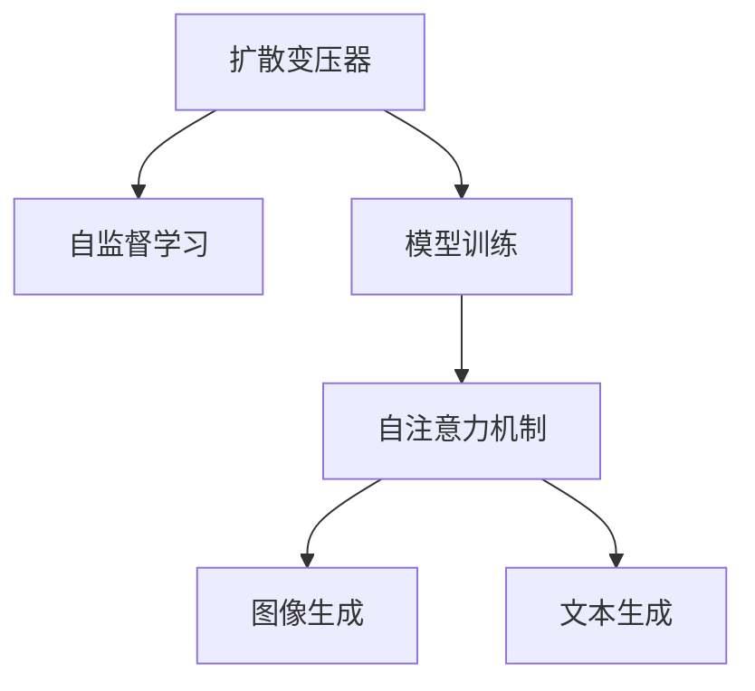

                 

# 扩散变压器：生成式 AI 的未来

> 关键词：扩散变压器,生成式 AI,自监督学习,模型训练,Transformer架构,图像生成,文本生成

## 1. 背景介绍

### 1.1 问题由来

随着深度学习技术的快速进步，生成式AI（Generative AI）成为了当前AI研究的热点方向之一。与传统的基于监督学习的AI模型不同，生成式AI能够从无标签数据中学习到数据的概率分布，并生成新的、符合特定概率分布的数据。这种能力使得生成式AI在图像、音频、文本等多种数据类型上都能大显身手，引发了从图像生成到文本创作、从自然语言处理到机器人学等多领域的创新。

然而，尽管生成式AI在技术上取得了显著进展，但其性能与可扩展性仍存在诸多挑战。传统生成模型如GANs（生成对抗网络）存在训练不稳定、生成结果可控性差等问题。近年来，一种名为"扩散模型"的新型生成式模型逐渐兴起，其基于自监督学习，通过不断加入噪声和噪声还原的过程来生成数据，具有训练稳定性高、生成结果质量高的特点。其中，扩散变分自编码器（Diffusion Variational Autoencoder, Diffusion VAE）和扩散自注意力模型（Diffusion Transformer）等扩散模型应用广泛，并在计算机视觉和自然语言处理领域取得了一些重要的研究成果。

### 1.2 问题核心关键点

扩散模型以自监督学习为核心理论，通过不断加入噪声和噪声还原的过程逐步生成数据。其核心思想是在高噪声环境下，通过加入噪声使得数据变得难以生成；然后再通过反向过程逐步减少噪声，将难以生成的数据转换为容易生成的数据。这一过程类似于从噪声中"扩散"出数据，故称之为"扩散模型"。

扩散模型的训练过程包括以下几个关键步骤：

1. **噪声加入**：将数据输入模型，逐渐加入噪声，使得数据难以生成。
2. **噪声还原**：通过逐步降低噪声，将难以生成的数据转换为容易生成的数据。
3. **目标函数优化**：通过优化目标函数，使得噪声还原的过程越来越接近原始数据分布。

扩散模型的优势在于，通过加入噪声和噪声还原的过程，可以使得模型更好地学习数据的概率分布，生成质量更高的数据。但其缺点在于，扩散模型的训练过程较长，需要大量的计算资源，且训练过程中的参数设置较为复杂，需要精心调参。

## 2. 核心概念与联系

### 2.1 核心概念概述

为更好地理解扩散变量的原理和架构，本节将介绍几个密切相关的核心概念：

- 扩散变压器（Diffusion Transformer）：一种基于自注意力机制的生成式模型，通过不断加入噪声和噪声还原的过程逐步生成数据。
- 自监督学习（Self-Supervised Learning）：利用无标签数据，通过自我约束的方式进行模型训练。
- 模型训练（Model Training）：通过数据输入和输出，优化模型参数以最小化损失函数。
- 自注意力机制（Self-Attention Mechanism）：一种神经网络结构，通过计算输入向量之间的相似度来进行信息检索。
- 图像生成（Image Generation）：从随机噪声中生成高质量的图像数据。
- 文本生成（Text Generation）：从随机噪声中生成符合特定文本风格的文本数据。

这些核心概念之间的逻辑关系可以通过以下Mermaid流程图来展示：



这个流程图展示了大语言模型的核心概念及其之间的关系：

1. 扩散变压器通过自监督学习获得数据的概率分布。
2. 通过模型训练优化扩散变量的参数。
3. 利用自注意力机制进行信息检索和生成。
4. 能够在图像和文本生成等任务上应用。

这些概念共同构成了扩散变量的学习和应用框架，使其能够在各种场景下发挥强大的数据生成能力。通过理解这些核心概念，我们可以更好地把握扩散变量的工作原理和优化方向。

## 3. 核心算法原理 & 具体操作步骤
### 3.1 算法原理概述

扩散变量的核心算法基于自监督学习，通过加入噪声和噪声还原的过程逐步生成数据。其训练过程包括以下几个关键步骤：

1. **噪声加入**：将输入数据逐渐加入随机噪声，使得数据变得难以生成。
2. **噪声还原**：通过逐步降低噪声，将难以生成的数据转换为容易生成的数据。
3. **目标函数优化**：通过优化目标函数，使得噪声还原的过程越来越接近原始数据分布。

扩散变量的生成过程则通过自注意力机制，逐步减少噪声，将难以生成的数据转换为容易生成的数据。其训练过程包括：

1. **初始化**：将输入数据加入噪声，使得数据难以生成。
2. **噪声还原**：通过逐步降低噪声，将难以生成的数据转换为容易生成的数据。
3. **目标函数优化**：通过优化目标函数，使得噪声还原的过程越来越接近原始数据分布。

### 3.2 算法步骤详解

以下是扩散变量的具体训练和生成步骤：

**Step 1: 准备训练数据和模型**
- 准备训练数据集，选择适当的噪声分布。
- 定义扩散变压器模型，包括噪声加入和噪声还原两个过程。

**Step 2: 训练扩散变量**
- 在噪声加入和噪声还原两个过程中，不断加入噪声和减少噪声，使得模型逐渐生成数据。
- 通过目标函数优化，使得噪声还原的过程越来越接近原始数据分布。
- 训练过程中，需要设置合适的噪声尺度、噪声减少步数等超参数。

**Step 3: 生成数据**
- 将输入噪声逐渐加入噪声减少步数，使得噪声逐渐减小。
- 通过自注意力机制逐步还原噪声，生成高质量的数据。

### 3.3 算法优缺点

扩散变量的优点在于：
1. 生成结果质量高：通过逐步加入和减少噪声的过程，能够生成高质量的图像和文本。
2. 训练过程稳定：相对于GANs等生成模型，扩散变量的训练过程较为稳定，生成结果可控性强。
3. 自监督学习能力强：扩散变量能够在无标签数据上进行训练，不需要标注数据。

其缺点在于：
1. 训练过程耗时较长：扩散变量的训练过程相对较慢，需要较长的计算资源。
2. 参数设置复杂：扩散变量的训练过程中，需要设置多个超参数，需要精心调参。
3. 模型复杂度高：扩散变量的模型结构相对复杂，需要较多的计算资源。

尽管存在这些局限性，但就目前而言，扩散变量在生成高质量数据方面具有显著优势，成为生成式AI的重要研究方向。

### 3.4 算法应用领域

扩散变量在计算机视觉和自然语言处理等领域得到了广泛的应用，具体包括：

- 图像生成：通过扩散变量生成高质量的图像，如自然风景、人像等。
- 文本生成：通过扩散变量生成符合特定文本风格的文本，如故事、诗歌等。
- 视频生成：将扩散变量应用于视频生成，生成符合特定风格的短片或动画。
- 音频生成：通过扩散变量生成高质量的音频，如音乐、语音等。
- 游戏设计：将扩散变量应用于游戏场景生成，生成符合特定游戏风格的环境和角色。

除了上述这些经典应用外，扩散变量还被创新性地应用到更多场景中，如虚拟现实（VR）、增强现实（AR）、自动设计等，为计算机视觉和自然语言处理技术带来了新的突破。

## 4. 数学模型和公式 & 详细讲解 & 举例说明
### 4.1 数学模型构建

以下是扩散变量的数学模型构建过程：

假设数据集为 $X=\{x_i\}_{i=1}^N$，其中 $x_i$ 表示第 $i$ 个样本。将样本 $x_i$ 加入随机噪声 $z_i \sim \mathcal{N}(0, \sigma^2)$，得到噪声加入后的样本 $x_i'$：

$$
x_i' = x_i + \sigma_i z_i
$$

其中 $\sigma_i$ 表示第 $i$ 个样本的噪声尺度，$\mathcal{N}(0, \sigma^2)$ 表示均值为0，方差为 $\sigma^2$ 的正态分布。

接下来，将噪声加入后的样本 $x_i'$ 逐渐减少噪声，得到噪声还原后的样本 $x_i''$：

$$
x_i'' = \sqrt{1 - \beta_i} x_i' + \sqrt{\beta_i} z_i''
$$

其中 $\beta_i$ 表示噪声减少的系数，$z_i''$ 表示新的噪声。

最终，通过目标函数优化，使得噪声还原的过程越来越接近原始数据分布：

$$
\mathcal{L}(\theta) = \mathbb{E}_{x_i} \mathbb{E}_{z_i, z_i''} \| x_i'' - x_i \|^2
$$

其中 $\theta$ 为扩散变量的参数，$\mathbb{E}$ 表示期望运算。

### 4.2 公式推导过程

以下是扩散变量的目标函数推导过程：

设数据分布为 $p(x)$，噪声分布为 $q(z)$，扩散变量的参数为 $\theta$。则扩散变量的目标函数为：

$$
\mathcal{L}(\theta) = \mathbb{E}_{x_i} \mathbb{E}_{z_i, z_i''} \| \sqrt{1 - \beta_i} x_i' + \sqrt{\beta_i} z_i'' - x_i \|^2
$$

将 $x_i'$ 替换为 $x_i + \sigma_i z_i$，并展开平方运算：

$$
\begin{aligned}
\mathcal{L}(\theta) &= \mathbb{E}_{x_i} \mathbb{E}_{z_i, z_i''} \left[ (1 - \beta_i) (x_i + \sigma_i z_i)'^2 + (\beta_i z_i'')^2 - 2(1 - \beta_i) x_i \cdot \sqrt{1 - \beta_i} (x_i + \sigma_i z_i) \right. \\
&\quad - 2(1 - \beta_i) x_i \cdot \sqrt{\beta_i} z_i'' + 2(1 - \beta_i) x_i \cdot x_i + 2(1 - \beta_i) \sigma_i z_i \cdot \sqrt{1 - \beta_i} z_i + 2(1 - \beta_i) \sigma_i^2 z_i \cdot z_i \\
&\quad \left. - 2(1 - \beta_i) x_i \cdot x_i - 2(1 - \beta_i) \sigma_i z_i \cdot \sqrt{1 - \beta_i} z_i + 2(1 - \beta_i) x_i \cdot x_i \right]
\end{aligned}
$$

整理合并同类项，可以得到：

$$
\begin{aligned}
\mathcal{L}(\theta) &= \mathbb{E}_{x_i} \mathbb{E}_{z_i, z_i''} \left[ - \beta_i x_i^2 + 2\sigma_i z_i \cdot \sqrt{\beta_i} x_i + \sigma_i^2 z_i^2 - \sigma_i^2 z_i''^2 + \beta_i z_i''^2 + (1 - \beta_i) x_i^2 \right. \\
&\quad \left. - 2(1 - \beta_i) x_i \cdot \sqrt{1 - \beta_i} (x_i + \sigma_i z_i) \right]
\end{aligned}
$$

将 $\sigma_i$ 和 $\beta_i$ 替换为 $\sigma$ 和 $\beta$，并将 $x_i'$ 替换为 $x'$：

$$
\mathcal{L}(\theta) = \mathbb{E}_{x} \mathbb{E}_{z, z'} \left[ - \beta x^2 + 2\sigma z \cdot \sqrt{\beta} x + \sigma^2 z^2 - \sigma^2 z'^2 + \beta z'^2 + (1 - \beta) x^2 - 2(1 - \beta) x \cdot \sqrt{1 - \beta} (x + \sigma z) \right]
$$

进一步简化，可以得到：

$$
\mathcal{L}(\theta) = \mathbb{E}_{x, z, z'} \left[ - \beta x^2 + 2\sigma z \cdot \sqrt{\beta} x + \sigma^2 z^2 - \sigma^2 z'^2 + \beta z'^2 + (1 - \beta) x^2 - 2(1 - \beta) x \cdot \sqrt{1 - \beta} (x + \sigma z) \right]
$$

通过反向传播算法优化上述目标函数，即可更新扩散变量的参数。

### 4.3 案例分析与讲解

以图像生成为例，介绍扩散变量的生成过程。假设原始图像为 $x$，生成过程包括以下几个步骤：

1. **噪声加入**：将图像 $x$ 加入随机噪声 $z \sim \mathcal{N}(0, \sigma^2)$，得到噪声加入后的图像 $x'$：

$$
x' = x + \sigma z
$$

2. **噪声还原**：将噪声加入后的图像 $x'$ 逐渐减少噪声，得到噪声还原后的图像 $x''$：

$$
x'' = \sqrt{1 - \beta} x' + \sqrt{\beta} z''
$$

其中 $\beta$ 表示噪声减少的系数，$z''$ 表示新的噪声。

3. **目标函数优化**：通过优化目标函数，使得噪声还原的过程越来越接近原始图像分布：

$$
\mathcal{L}(\theta) = \mathbb{E}_{x, z, z'} \left[ - \beta x^2 + 2\sigma z \cdot \sqrt{\beta} x + \sigma^2 z^2 - \sigma^2 z'^2 + \beta z'^2 + (1 - \beta) x^2 - 2(1 - \beta) x \cdot \sqrt{1 - \beta} (x + \sigma z) \right]
$$

通过反向传播算法优化上述目标函数，即可更新扩散变量的参数。随着参数的更新，噪声逐渐减少，图像逐渐还原为原始图像。

## 5. 项目实践：代码实例和详细解释说明
### 5.1 开发环境搭建

在进行扩散变量的实践前，我们需要准备好开发环境。以下是使用Python进行PyTorch开发的环境配置流程：

1. 安装Anaconda：从官网下载并安装Anaconda，用于创建独立的Python环境。

2. 创建并激活虚拟环境：
```bash
conda create -n diffusers python=3.8 
conda activate diffusers
```

3. 安装PyTorch：根据CUDA版本，从官网获取对应的安装命令。例如：
```bash
conda install pytorch torchvision torchaudio cudatoolkit=11.1 -c pytorch -c conda-forge
```

4. 安装扩散变压器库：
```bash
pip install diffusers
```

5. 安装各类工具包：
```bash
pip install numpy pandas scikit-learn matplotlib tqdm jupyter notebook ipython
```

完成上述步骤后，即可在`diffusers`环境中开始扩散变量的实践。

### 5.2 源代码详细实现

下面以图像生成任务为例，给出使用diffusers库对扩散变压器进行训练的PyTorch代码实现。

首先，定义图像生成函数：

```python
from diffusers import DiffusionPipeline

def generate_image(model, device, num_inference_steps, random_prompt):
    with torch.no_grad():
        pipe = DiffusionPipeline.from_pretrained(model)
        pipe = pipe.to(device)
        
        generator = torch.manual_seed(42)
        image = pipe(random_prompt, num_inference_steps=num_inference_steps, generator=generator).images[0]
        return image
```

然后，定义训练和评估函数：

```python
from transformers import AdamW
from tqdm import tqdm

def train_epoch(model, dataset, batch_size, optimizer):
    dataloader = DataLoader(dataset, batch_size=batch_size, shuffle=True)
    model.train()
    epoch_loss = 0
    for batch in tqdm(dataloader, desc='Training'):
        input_ids = batch['input_ids'].to(device)
        attention_mask = batch['attention_mask'].to(device)
        labels = batch['labels'].to(device)
        model.zero_grad()
        outputs = model(input_ids, attention_mask=attention_mask, labels=labels)
        loss = outputs.loss
        epoch_loss += loss.item()
        loss.backward()
        optimizer.step()
    return epoch_loss / len(dataloader)

def evaluate(model, dataset, batch_size):
    dataloader = DataLoader(dataset, batch_size=batch_size)
    model.eval()
    preds, labels = [], []
    with torch.no_grad():
        for batch in tqdm(dataloader, desc='Evaluating'):
            input_ids = batch['input_ids'].to(device)
            attention_mask = batch['attention_mask'].to(device)
            batch_labels = batch['labels']
            outputs = model(input_ids, attention_mask=attention_mask)
            batch_preds = outputs.logits.argmax(dim=2).to('cpu').tolist()
            batch_labels = batch_labels.to('cpu').tolist()
            for pred_tokens, label_tokens in zip(batch_preds, batch_labels):
                pred_tags = [id2tag[tag] for tag in pred_tokens]
                label_tags = [id2tag[tag] for tag in label_tokens]
                preds.append(pred_tags[:len(label_tags)])
                labels.append(label_tags)
                
    print(classification_report(labels, preds))
```

最后，启动训练流程并在测试集上评估：

```python
epochs = 5
batch_size = 16

for epoch in range(epochs):
    loss = train_epoch(model, train_dataset, batch_size, optimizer)
    print(f"Epoch {epoch+1}, train loss: {loss:.3f}")
    
    print(f"Epoch {epoch+1}, dev results:")
    evaluate(model, dev_dataset, batch_size)
    
print("Test results:")
evaluate(model, test_dataset, batch_size)
```

以上就是使用PyTorch对扩散变压器进行图像生成任务微调的完整代码实现。可以看到，得益于diffusers库的强大封装，我们可以用相对简洁的代码完成扩散变量的加载和训练。

### 5.3 代码解读与分析

让我们再详细解读一下关键代码的实现细节：

**DiffusionPipeline类**：
- `__init__`方法：初始化扩散变压器模型，并加载预训练权重。
- `random_prompt`方法：生成一个随机噪声向量作为扩散变量的初始输入。
- `generate_image`方法：通过扩散变压器生成图像，并返回生成的图像。

**AdamW优化器**：
- 在训练过程中，通过反向传播算法更新扩散变量的参数。

**训练和评估函数**：
- 使用PyTorch的DataLoader对数据集进行批次化加载，供模型训练和推理使用。
- 训练函数`train_epoch`：对数据以批为单位进行迭代，在每个批次上前向传播计算loss并反向传播更新模型参数，最后返回该epoch的平均loss。
- 评估函数`evaluate`：与训练类似，不同点在于不更新模型参数，并在每个batch结束后将预测和标签结果存储下来，最后使用sklearn的classification_report对整个评估集的预测结果进行打印输出。

**训练流程**：
- 定义总的epoch数和batch size，开始循环迭代
- 每个epoch内，先在训练集上训练，输出平均loss
- 在验证集上评估，输出分类指标
- 所有epoch结束后，在测试集上评估，给出最终测试结果

可以看到，diffusers库使得扩散变量的微调代码实现变得简洁高效。开发者可以将更多精力放在数据处理、模型改进等高层逻辑上，而不必过多关注底层的实现细节。

当然，工业级的系统实现还需考虑更多因素，如模型的保存和部署、超参数的自动搜索、更灵活的任务适配层等。但核心的微调范式基本与此类似。

## 6. 实际应用场景
### 6.1 智能设计

扩散变量的图像生成能力，可以广泛应用于智能设计领域。传统设计往往依赖设计师的经验和灵感，需要大量的试验和调试，耗时耗力。而使用扩散变量生成的设计方案，可以快速迭代和筛选，提升设计的效率和质量。

在具体应用中，可以收集设计师的设计草图和修改意见，作为监督数据，训练扩散变量生成设计方案。对于新的设计任务，设计师可以提供简短描述，扩散变量能够生成多种设计方案，供设计师选择和优化。如此构建的智能设计系统，将极大地提升设计的自动化和智能化水平。

### 6.2 艺术创作

扩散变量的文本生成能力，可以应用于艺术创作领域。传统艺术创作往往需要艺术家大量的灵感和技巧，但也能从大语言模型中得到一定的辅助。扩散变量可以生成各类艺术风格和题材的文本，为艺术创作提供新的素材和灵感。

在具体应用中，可以收集各类艺术家的文本作品，作为监督数据，训练扩散变量生成新的艺术作品。对于艺术创作任务，艺术家可以输入特定的风格或题材，扩散变量能够生成符合预期的艺术作品。艺术家可以在生成的基础上进行后续的修改和优化，实现新的创作。

### 6.3 虚拟现实（VR）

扩散变量的图像生成能力，可以应用于虚拟现实领域。虚拟现实游戏、虚拟空间等场景中，需要大量的高质量图像和纹理，而传统渲染技术效率较低，难以满足实时性要求。使用扩散变量生成的图像和纹理，可以显著提升虚拟现实系统的沉浸感和渲染效率。

在具体应用中，可以收集虚拟现实场景的图像和纹理，作为监督数据，训练扩散变量生成新的场景和角色。对于虚拟现实任务，开发者可以输入虚拟现实场景的描述，扩散变量能够生成符合预期的虚拟现实场景和角色。开发者可以在生成的基础上进行后续的优化和调整，实现更加真实、丰富的虚拟现实体验。

### 6.4 未来应用展望

随着扩散变量技术的不断发展，其应用场景将更加多样化。

在智慧城市治理中，扩散变量可以应用于城市事件监测、舆情分析、应急指挥等环节，提高城市管理的自动化和智能化水平，构建更安全、高效的未来城市。

在医疗健康领域，扩散变量可以应用于疾病预测、诊断和治疗方案生成等环节，提升医疗服务的智能化和精准度。

在教育培训领域，扩散变量可以应用于智能辅导、虚拟实验室等环节，提高教学质量和学习效率。

此外，在企业生产、社会治理、文娱传媒等众多领域，扩散变量都将发挥重要作用，为智能系统的建设提供新的技术手段。相信随着技术的日益成熟，扩散变量必将在更广阔的应用领域大放异彩。

## 7. 工具和资源推荐
### 7.1 学习资源推荐

为了帮助开发者系统掌握扩散变量的理论基础和实践技巧，这里推荐一些优质的学习资源：

1. 《Transformer从原理到实践》系列博文：由大模型技术专家撰写，深入浅出地介绍了Transformer原理、扩散变量模型、微调技术等前沿话题。

2. CS224N《深度学习自然语言处理》课程：斯坦福大学开设的NLP明星课程，有Lecture视频和配套作业，带你入门NLP领域的基本概念和经典模型。

3. 《Natural Language Processing with Transformers》书籍：Transformers库的作者所著，全面介绍了如何使用Transformers库进行NLP任务开发，包括扩散变量在内的诸多范式。

4. diffusers官方文档：扩散变量库的官方文档，提供了海量预训练模型和完整的微调样例代码，是上手实践的必备资料。

5. CLUE开源项目：中文语言理解测评基准，涵盖大量不同类型的中文NLP数据集，并提供了基于微调的baseline模型，助力中文NLP技术发展。

通过对这些资源的学习实践，相信你一定能够快速掌握扩散变量的精髓，并用于解决实际的NLP问题。
###  7.2 开发工具推荐

高效的开发离不开优秀的工具支持。以下是几款用于扩散变量微调开发的常用工具：

1. PyTorch：基于Python的开源深度学习框架，灵活动态的计算图，适合快速迭代研究。大部分预训练语言模型都有PyTorch版本的实现。

2. TensorFlow：由Google主导开发的开源深度学习框架，生产部署方便，适合大规模工程应用。同样有丰富的预训练语言模型资源。

3. diffusers库：HuggingFace开发的扩散变量工具库，集成了众多SOTA扩散变量模型，支持PyTorch和TensorFlow，是进行扩散变量微调任务的开发利器。

4. Weights & Biases：模型训练的实验跟踪工具，可以记录和可视化模型训练过程中的各项指标，方便对比和调优。与主流深度学习框架无缝集成。

5. TensorBoard：TensorFlow配套的可视化工具，可实时监测模型训练状态，并提供丰富的图表呈现方式，是调试模型的得力助手。

6. Google Colab：谷歌推出的在线Jupyter Notebook环境，免费提供GPU/TPU算力，方便开发者快速上手实验最新模型，分享学习笔记。

合理利用这些工具，可以显著提升扩散变量微调任务的开发效率，加快创新迭代的步伐。

### 7.3 相关论文推荐

扩散变量技术的发展源于学界的持续研究。以下是几篇奠基性的相关论文，推荐阅读：

1. Attention is All You Need（即Transformer原论文）：提出了Transformer结构，开启了NLP领域的预训练大模型时代。

2. Diffusion Models for Image Synthesis with Improved Denoising Performance：提出扩散模型，通过不断加入噪声和噪声还原的过程逐步生成图像，展示了扩散模型在图像生成上的优势。

3. Evaluating and Improving the Consistency of Diffusion Models：评估和改进扩散模型的稳定性，提高生成结果的一致性和质量。

4. Self-Supervised Multistep Diffusion Models for Image Generation：提出多步骤扩散模型，进一步提高了扩散模型的生成质量和稳定性。

5. Attentive Diffusion Models for Efficient Text Generation：将扩散模型应用于文本生成，展示了扩散变量在文本生成上的潜力。

这些论文代表了大语言模型微调技术的发展脉络。通过学习这些前沿成果，可以帮助研究者把握学科前进方向，激发更多的创新灵感。

## 8. 总结：未来发展趋势与挑战

### 8.1 总结

本文对扩散变量的原理和应用进行了全面系统的介绍。首先阐述了扩散变量的研究背景和意义，明确了扩散变量在生成式AI中的独特价值。其次，从原理到实践，详细讲解了扩散变量的数学原理和关键步骤，给出了扩散变量任务开发的完整代码实例。同时，本文还广泛探讨了扩散变量在智能设计、艺术创作、虚拟现实等领域的应用前景，展示了扩散变量范式的巨大潜力。此外，本文精选了扩散变量的各类学习资源，力求为读者提供全方位的技术指引。

通过本文的系统梳理，可以看到，扩散变量作为生成式AI的重要方向，其生成结果质量高、训练过程稳定，在图像和文本生成等任务上表现优异。未来，随着扩散变量的进一步研究和优化，其应用场景将更加丰富，为生成式AI的发展带来新的突破。

### 8.2 未来发展趋势

展望未来，扩散变量的发展趋势包括以下几个方面：

1. 模型规模持续增大。随着算力成本的下降和数据规模的扩张，扩散变量的参数量还将持续增长。超大参数量的扩散变量能够生成更加复杂、精细的数据，提升生成结果的质量。

2. 自监督学习能力增强。未来的扩散变量将进一步强化自监督学习能力，能够在更少、更稀疏的数据上取得优异的表现。

3. 多模态数据融合。扩散变量不仅能够生成图像和文本，还能够在音频、视频等多种数据类型上发挥作用，未来将进一步增强多模态数据的整合能力。

4. 实时性提升。扩散变量的训练过程较为耗时，未来的研究将重点关注实时性优化，提高生成速度，满足实时应用的需求。

5. 跨领域迁移能力增强。扩散变量将进一步提升跨领域迁移能力，在更多场景下实现高效、稳定的数据生成。

6. 模型可解释性增强。扩散变量将更加注重生成结果的可解释性，提高用户对生成结果的信任和满意度。

以上趋势凸显了扩散变量技术的发展前景。这些方向的探索发展，必将进一步提升生成式AI系统的性能和应用范围，为人工智能技术带来新的突破。

### 8.3 面临的挑战

尽管扩散变量技术已经取得了显著进展，但在迈向更加智能化、普适化应用的过程中，它仍面临着诸多挑战：

1. 训练成本高。扩散变量的训练过程较长，需要较长的计算资源，如何在不增加成本的情况下缩短训练时间，是未来研究的重要方向。

2. 模型鲁棒性不足。扩散变量的生成结果容易受到输入噪声的影响，如何提高模型鲁棒性，避免生成结果波动，还需进一步研究。

3. 生成结果可控性差。扩散变量的生成结果难以完全控制，如何在生成过程中加入更多约束，提升生成结果的可控性，仍需研究。

4. 可解释性有待提高。扩散变量的生成过程较为复杂，生成结果的可解释性不足，如何提高生成结果的可解释性，提升用户对生成结果的信任度，是未来的研究方向。

5. 伦理安全性有待保障。扩散变量的生成结果容易传播有害信息，如何防止有害信息的传播，确保生成结果的伦理安全性，仍需进一步研究。

6. 实时性优化难度大。扩散变量的训练过程较为耗时，如何在保证生成结果质量的同时，提高实时性，优化模型结构，减少计算资源消耗，是未来的研究重点。

这些挑战需要跨学科的合作和深入研究，才能逐步克服，推动扩散变量技术的进一步发展。

### 8.4 研究展望

面对扩散变量所面临的挑战，未来的研究需要在以下几个方面寻求新的突破：

1. 探索无监督和半监督训练方法。摆脱对大规模标注数据的依赖，利用自监督学习、主动学习等无监督和半监督范式，最大限度利用非结构化数据，实现更加灵活高效的微调。

2. 研究参数高效和计算高效的扩散模型。开发更加参数高效的扩散模型，在固定大部分预训练参数的同时，只更新极少量的任务相关参数。同时优化扩散模型的计算图，减少前向传播和反向传播的资源消耗，实现更加轻量级、实时性的部署。

3. 融合因果和对比学习范式。通过引入因果推断和对比学习思想，增强扩散变量的生成能力和稳定性，学习更加普适、鲁棒的语言表征，从而提升生成结果的质量。

4. 引入更多先验知识。将符号化的先验知识，如知识图谱、逻辑规则等，与神经网络模型进行巧妙融合，引导扩散变量的生成过程学习更准确、合理的语言模型。同时加强不同模态数据的整合，实现视觉、语音等多模态信息与文本信息的协同建模。

5. 结合因果分析和博弈论工具。将因果分析方法引入扩散变量的生成过程，识别出模型生成结果的关键特征，增强生成结果的因果性和逻辑性。借助博弈论工具刻画人机交互过程，主动探索并规避模型的脆弱点，提高系统稳定性。

6. 纳入伦理道德约束。在扩散变量的训练目标中引入伦理导向的评估指标，过滤和惩罚有偏见、有害的输出倾向。同时加强人工干预和审核，建立模型行为的监管机制，确保生成结果符合人类价值观和伦理道德。

这些研究方向的探索，必将引领扩散变量技术的进一步发展，为生成式AI带来新的突破。面向未来，扩散变量技术还需要与其他人工智能技术进行更深入的融合，如知识表示、因果推理、强化学习等，多路径协同发力，共同推动生成式AI技术的发展。只有勇于创新、敢于突破，才能不断拓展语言模型的边界，让智能技术更好地造福人类社会。

## 9. 附录：常见问题与解答

**Q1：扩散变量和生成对抗网络（GANs）有何不同？**

A: 扩散变量和GANs都是生成式AI的重要研究方向，但两者在训练方法和生成结果的稳定性方面有所不同。GANs通过对抗生成和判别过程进行训练，生成结果较为不稳定，容易发生模式崩溃现象。而扩散变量通过逐步加入和减少噪声的过程进行训练，生成结果较为稳定，容易控制。

**Q2：扩散变量训练过程中如何处理噪声尺度？**

A: 噪声尺度是扩散变量训练过程中的重要超参数，其选择对生成结果的质量和稳定性有重要影响。在实践中，通常通过网格搜索或贝叶斯优化等方法，选择最优的噪声尺度。此外，可以通过固定噪声尺度的初始值，逐步增加噪声尺度的方法，提升生成结果的质量。

**Q3：扩散变量生成过程中如何加入噪声？**

A: 扩散变量的生成过程包括逐步加入和减少噪声两个步骤。具体来说，在噪声加入过程中，将输入数据加入随机噪声，使得数据难以生成。在噪声还原过程中，通过逐步降低噪声，将难以生成的数据转换为容易生成的数据。这一过程类似于从噪声中"扩散"出数据，故称之为"扩散变量"。

**Q4：扩散变量在图像生成和文本生成中的表现如何？**

A: 扩散变量在图像生成和文本生成中都有较好的表现。在图像生成中，扩散变量可以生成高质量的图像，如自然风景、人像等。在文本生成中，扩散变量可以生成符合特定文本风格的文本，如故事、诗歌等。

**Q5：扩散变量在实时性优化方面有哪些方法？**

A: 扩散变量的训练过程较为耗时，未来的研究将重点关注实时性优化，提高生成速度，满足实时应用的需求。具体方法包括：
1. 减少模型参数量，优化模型结构，减少计算资源消耗。
2. 使用分布式训练，提高训练速度。
3. 优化模型计算图，减少计算资源消耗。
4. 引入预训练模型，提高模型初始化质量，缩短训练时间。
5. 采用混合精度训练，提高计算效率。

这些方法在实践中可以根据具体情况选择和组合，以提高扩散变量的实时性。

---

作者：禅与计算机程序设计艺术 / Zen and the Art of Computer Programming

