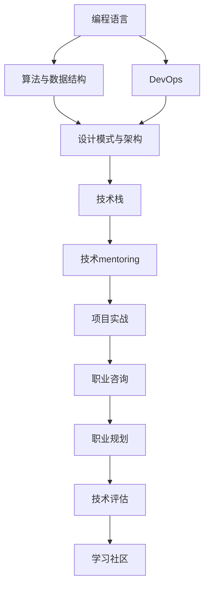

                 

# 技术mentoring：构建程序员成长加速器项目

> 关键词：技术mentoring, 程序员成长, 加速器, 项目, 软件开发, 编程技能, 技术栈, 职业规划

## 1. 背景介绍

### 1.1 问题由来

在当前快速发展的科技行业中，技术更新换代的速度日益加快。对于一线开发者来说，要在不断变化的技术环境中保持竞争力，不仅需要持续学习新技术，还要不断提升自己的综合素质和软技能。然而，传统的学习和培训方式已经无法满足现代开发者不断变化的学习需求。技术mentoring项目应运而生，旨在通过系统化、个性化的培训，帮助开发者构建全面的技术能力，加速其职业成长。

### 1.2 问题核心关键点

技术mentoring项目的关键在于：

- 提供系统、全面、个性化的技术培训。包括但不限于编程语言、开发框架、算法与数据结构、DevOps、设计模式、系统架构等各个方面。
- 强调实战导向。通过项目实战，将理论知识转化为实际技能，提升开发者的动手能力和问题解决能力。
- 促进开发者职业规划。通过技术评估和职业咨询，帮助开发者制定符合自身特点的职业发展路线图。
- 建立高效的学习社区。鼓励知识共享和经验交流，营造积极向上的学习氛围。

### 1.3 问题研究意义

技术mentoring项目对于提升开发者技能、加速职业成长具有重要意义：

1. **提升技术能力**：通过系统化培训，弥补知识盲点，提升编程技能和问题解决能力。
2. **加速职业发展**：通过职业咨询和项目实战，为开发者指明职业发展方向，提升晋升速度。
3. **促进知识共享**：建立学习社区，促进技术经验交流，加速技术传播和应用。
4. **培养技术领导力**：通过技术评估和项目实战，培养开发者的领导力和项目管理能力，为团队领导岗位做准备。
5. **推动企业创新**：通过技术人才的培养，提升企业技术实力，加速产品研发和技术迭代。

## 2. 核心概念与联系

### 2.1 核心概念概述

为更好地理解技术mentoring项目的原理和流程，本节将介绍几个核心概念：

- **技术mentoring**：通过一对一的指导、系统化的培训和实战导向的学习方式，帮助开发者提升技术能力和职业素养。
- **编程语言**：编程语言是软件开发的基础，掌握多种编程语言能够增强开发者的通用性。
- **开发框架**：开发框架提供了一系列工具和库，可以加速开发过程，提升代码质量。
- **算法与数据结构**：算法与数据结构是编程的核心，掌握常用的算法和数据结构能够提升编程效率和问题解决能力。
- **DevOps**：DevOps是软件开发和运维的融合，掌握DevOps知识能够提升软件交付速度和质量。
- **设计模式与架构**：设计模式和架构设计是软件开发中的重要环节，掌握这些知识能够提升软件系统的可维护性和可扩展性。
- **技术栈**：技术栈是指开发者掌握的一整套技术工具和知识，包括编程语言、框架、算法、设计模式等。

这些核心概念之间的逻辑关系可以通过以下Mermaid流程图来展示：



这个流程图展示了大语言模型的核心概念及其之间的关系：

1. 编程语言、算法与数据结构、DevOps、设计模式与架构、技术栈是技术mentoring项目的基础。
2. 技术mentoring项目通过系统化的培训和实战导向的学习方式，帮助开发者提升这些基础技术能力。
3. 项目实战和职业咨询能够进一步提升开发者的实践能力和职业规划能力。
4. 技术评估和学习社区能够帮助开发者持续学习和交流，提升技术水平。

## 3. 核心算法原理 & 具体操作步骤
### 3.1 算法原理概述

技术mentoring项目基于系统化的培训和实战导向的学习方式，帮助开发者全面提升技术能力和职业素养。其核心思想是：通过一对一的指导、系统化的课程、实战导向的项目和持续的学习交流，系统性地提升开发者的技术水平和职业素养。

### 3.2 算法步骤详解

技术mentoring项目一般包括以下几个关键步骤：

**Step 1: 技术评估**

在项目开始前，对开发者的技术水平进行全面评估，包括编程语言、开发框架、算法与数据结构、DevOps、设计模式与架构等各个方面。评估方式可以包括笔试、编程测试、项目评审等，帮助确定开发者的技术现状和提升方向。

**Step 2: 制定学习计划**

根据技术评估结果，为开发者制定个性化的学习计划。学习计划应包括具体的学习目标、课程安排、学习资源、实战项目等内容。学习计划应具有可执行性，能够帮助开发者逐步提升技术能力。

**Step 3: 系统化课程培训**

系统化课程培训是技术mentoring项目的重要环节。培训内容应涵盖编程语言、开发框架、算法与数据结构、DevOps、设计模式与架构等多个方面。课程应由经验丰富的讲师讲授，强调理论结合实践，注重实战演练。

**Step 4: 实战导向的项目开发**

实战导向的项目开发是技术mentoring项目的核心。通过实际项目开发，将理论知识转化为实际技能，提升开发者的动手能力和问题解决能力。项目应涵盖软件开发全流程，包括需求分析、设计、编码、测试、部署等环节。

**Step 5: 职业咨询与规划**

职业咨询与规划是技术mentoring项目的延伸。通过职业咨询，帮助开发者明确职业发展方向，制定符合自身特点的职业发展路线图。职业规划应考虑开发者的兴趣、能力、市场需求等因素，提供职业发展建议和指导。

**Step 6: 学习社区与交流**

建立高效的学习社区，促进开发者之间的知识共享和经验交流。社区应提供技术讨论、项目展示、经验分享等功能，营造积极向上的学习氛围。学习社区是开发者持续学习的重要平台。

### 3.3 算法优缺点

技术mentoring项目具有以下优点：

1. **系统化培训**：通过系统化的课程培训，帮助开发者全面提升技术能力，弥补知识盲点。
2. **实战导向**：通过实战导向的项目开发，将理论知识转化为实际技能，提升动手能力和问题解决能力。
3. **个性化定制**：根据开发者的技术现状和职业目标，制定个性化的学习计划，提升培训效果。
4. **职业规划**：通过职业咨询和规划，帮助开发者明确职业发展方向，提升职业发展速度。
5. **学习社区**：建立高效的学习社区，促进知识共享和经验交流，提升技术水平。

同时，该方法也存在一定的局限性：

1. **时间和成本较高**：系统化的培训和项目开发需要投入大量时间和资源，对于小型企业和自由开发者可能存在成本压力。
2. **师资和资源依赖**：培训质量和效果高度依赖讲师和资源，对讲师的专业性和课程内容要求较高。
3. **个性化不足**：虽然定制学习计划，但每个开发者的兴趣和能力差异较大，个性化需求难以完全满足。
4. **效果难以量化**：技术 mentoring 的效果难以量化评估，依赖开发者的反馈和成果展示。
5. **难以规模化**：一对一的指导和系统化培训难以大规模推广，难以覆盖更多的开发者。

尽管存在这些局限性，但就目前而言，技术mentoring项目仍是大规模开发者培训的重要方式之一。未来相关研究的重点在于如何进一步降低培训成本，提高个性化和效果评估的准确性，同时兼顾规模化和可持续性等因素。

### 3.4 算法应用领域

技术mentoring项目已经在软件开发、技术培训、职业发展等多个领域得到广泛应用，例如：

- **软件开发**：通过系统化的培训和实战导向的项目开发，提升开发者的编程技能和项目开发能力。
- **技术培训**：为大型企业提供系统化的技术培训，帮助企业快速提升整体技术水平和开发能力。
- **职业发展**：为技术人员提供职业咨询和规划，帮助其明确职业方向，提升职业发展速度。
- **技术栈升级**：帮助开发者掌握新的技术栈，提升其在技术前沿的竞争力。
- **创业孵化**：为创业团队提供技术 mentoring，帮助其快速搭建技术基础，提升产品开发速度。

除了上述这些经典应用外，技术 mentoring 还被创新性地应用到更多场景中，如开源项目贡献、技术传播、教育培训等，为技术人才的培养提供了新的路径。随着技术 mentoring 方法的不断进步，相信技术人才的培养将更加系统化、个性化，推动技术进步和产业发展。

## 4. 数学模型和公式 & 详细讲解  
### 4.1 数学模型构建

技术 mentoring 项目的效果可以通过数学模型进行量化评估。假设开发者技术水平为 $x$，通过技术 mentoring 后技术水平提升为 $x'$，则技术提升效果可以表示为：

$$
x' = f(x, \text{课程内容}, \text{项目经验}, \text{学习社区})
$$

其中，$f$ 为技术提升函数，课程内容、项目经验、学习社区为影响技术提升效果的因素。

### 4.2 公式推导过程

技术提升函数 $f$ 可以进一步分解为多个子函数，分别对应不同的影响因素。例如：

$$
x' = g(x, \text{课程内容}) + h(x, \text{项目经验}) + i(x, \text{学习社区})
$$

其中，$g$ 为课程内容对技术提升的贡献函数，$h$ 为项目经验对技术提升的贡献函数，$i$ 为学习社区对技术提升的贡献函数。

**课程内容贡献函数**：

$$
g(x, \text{课程内容}) = \sum_{i=1}^n a_i(x) + \sum_{j=1}^m b_j(x)
$$

其中，$a_i$ 为第 $i$ 门课程对技术提升的贡献系数，$b_j$ 为第 $j$ 个知识点对技术提升的贡献系数。

**项目经验贡献函数**：

$$
h(x, \text{项目经验}) = \sum_{k=1}^p c_k(x) + \sum_{l=1}^q d_l(x)
$$

其中，$c_k$ 为第 $k$ 个项目对技术提升的贡献系数，$d_l$ 为第 $l$ 个任务对技术提升的贡献系数。

**学习社区贡献函数**：

$$
i(x, \text{学习社区}) = \sum_{r=1}^t e_r(x) + \sum_{s=1}^u f_s(x)
$$

其中，$e_r$ 为第 $r$ 个交流活动对技术提升的贡献系数，$f_s$ 为第 $s$ 个讨论主题对技术提升的贡献系数。

### 4.3 案例分析与讲解

以软件开发为例，分析技术 mentoring 项目的效果。

假设开发者最初掌握的编程语言为 Java，通过课程内容提升 $x_j$，项目经验提升 $x_p$，学习社区提升 $x_l$。则技术提升效果为：

$$
x' = g(x_j) + h(x_p) + i(x_l)
$$

具体来说，开发者在课程内容中学习了 Python、React 框架、设计模式等新知识，通过实战项目掌握了DevOps工具链、代码审查、性能优化等技能，在社区中参与了技术讨论、项目展示、经验分享等活动。最终，开发者掌握了多种编程语言、多种框架、DevOps技能等，技术能力得到了全面提升。

## 5. 项目实践：代码实例和详细解释说明
### 5.1 开发环境搭建

在进行技术 mentoring 项目实践前，我们需要准备好开发环境。以下是使用Python进行PyTorch开发的环境配置流程：

1. 安装Anaconda：从官网下载并安装Anaconda，用于创建独立的Python环境。

2. 创建并激活虚拟环境：
```bash
conda create -n pytorch-env python=3.8 
conda activate pytorch-env
```

3. 安装PyTorch：根据CUDA版本，从官网获取对应的安装命令。例如：
```bash
conda install pytorch torchvision torchaudio cudatoolkit=11.1 -c pytorch -c conda-forge
```

4. 安装TensorFlow：
```bash
pip install tensorflow==2.0
```

5. 安装各类工具包：
```bash
pip install numpy pandas scikit-learn matplotlib tqdm jupyter notebook ipython
```

完成上述步骤后，即可在`pytorch-env`环境中开始技术 mentoring 实践。

### 5.2 源代码详细实现

这里我们以技术 mentoring 的课程设计为例，给出使用PyTorch进行课程设计的PyTorch代码实现。

首先，定义课程内容：

```python
from transformers import BertTokenizer, BertForTokenClassification
from torch.utils.data import Dataset
import torch

class CourseContent(Dataset):
    def __init__(self, texts, tags, tokenizer, max_len=128):
        self.texts = texts
        self.tags = tags
        self.tokenizer = tokenizer
        self.max_len = max_len
        
    def __len__(self):
        return len(self.texts)
    
    def __getitem__(self, item):
        text = self.texts[item]
        tags = self.tags[item]
        
        encoding = self.tokenizer(text, return_tensors='pt', max_length=self.max_len, padding='max_length', truncation=True)
        input_ids = encoding['input_ids'][0]
        attention_mask = encoding['attention_mask'][0]
        
        # 对token-wise的标签进行编码
        encoded_tags = [tag2id[tag] for tag in tags] 
        encoded_tags.extend([tag2id['O']] * (self.max_len - len(encoded_tags)))
        labels = torch.tensor(encoded_tags, dtype=torch.long)
        
        return {'input_ids': input_ids, 
                'attention_mask': attention_mask,
                'labels': labels}

# 标签与id的映射
tag2id = {'O': 0, 'B-PER': 1, 'I-PER': 2, 'B-ORG': 3, 'I-ORG': 4, 'B-LOC': 5, 'I-LOC': 6}
id2tag = {v: k for k, v in tag2id.items()}

# 创建dataset
tokenizer = BertTokenizer.from_pretrained('bert-base-cased')

train_dataset = CourseContent(train_texts, train_tags, tokenizer)
dev_dataset = CourseContent(dev_texts, dev_tags, tokenizer)
test_dataset = CourseContent(test_texts, test_tags, tokenizer)
```

然后，定义模型和优化器：

```python
from transformers import BertForTokenClassification, AdamW

model = BertForTokenClassification.from_pretrained('bert-base-cased', num_labels=len(tag2id))

optimizer = AdamW(model.parameters(), lr=2e-5)
```

接着，定义训练和评估函数：

```python
from torch.utils.data import DataLoader
from tqdm import tqdm
from sklearn.metrics import classification_report

device = torch.device('cuda') if torch.cuda.is_available() else torch.device('cpu')
model.to(device)

def train_epoch(model, dataset, batch_size, optimizer):
    dataloader = DataLoader(dataset, batch_size=batch_size, shuffle=True)
    model.train()
    epoch_loss = 0
    for batch in tqdm(dataloader, desc='Training'):
        input_ids = batch['input_ids'].to(device)
        attention_mask = batch['attention_mask'].to(device)
        labels = batch['labels'].to(device)
        model.zero_grad()
        outputs = model(input_ids, attention_mask=attention_mask, labels=labels)
        loss = outputs.loss
        epoch_loss += loss.item()
        loss.backward()
        optimizer.step()
    return epoch_loss / len(dataloader)

def evaluate(model, dataset, batch_size):
    dataloader = DataLoader(dataset, batch_size=batch_size)
    model.eval()
    preds, labels = [], []
    with torch.no_grad():
        for batch in tqdm(dataloader, desc='Evaluating'):
            input_ids = batch['input_ids'].to(device)
            attention_mask = batch['attention_mask'].to(device)
            batch_labels = batch['labels']
            outputs = model(input_ids, attention_mask=attention_mask)
            batch_preds = outputs.logits.argmax(dim=2).to('cpu').tolist()
            batch_labels = batch_labels.to('cpu').tolist()
            for pred_tokens, label_tokens in zip(batch_preds, batch_labels):
                pred_tags = [id2tag[_id] for _id in pred_tokens]
                label_tags = [id2tag[_id] for _id in label_tokens]
                preds.append(pred_tags[:len(label_tokens)])
                labels.append(label_tags)
                
    print(classification_report(labels, preds))
```

最后，启动训练流程并在测试集上评估：

```python
epochs = 5
batch_size = 16

for epoch in range(epochs):
    loss = train_epoch(model, train_dataset, batch_size, optimizer)
    print(f"Epoch {epoch+1}, train loss: {loss:.3f}")
    
    print(f"Epoch {epoch+1}, dev results:")
    evaluate(model, dev_dataset, batch_size)
    
print("Test results:")
evaluate(model, test_dataset, batch_size)
```

以上就是使用PyTorch对BERT进行命名实体识别任务微调的完整代码实现。可以看到，得益于Transformers库的强大封装，我们可以用相对简洁的代码完成BERT模型的加载和微调。

### 5.3 代码解读与分析

让我们再详细解读一下关键代码的实现细节：

**CourseContent类**：
- `__init__`方法：初始化文本、标签、分词器等关键组件。
- `__len__`方法：返回数据集的样本数量。
- `__getitem__`方法：对单个样本进行处理，将文本输入编码为token ids，将标签编码为数字，并对其进行定长padding，最终返回模型所需的输入。

**tag2id和id2tag字典**：
- 定义了标签与数字id之间的映射关系，用于将token-wise的预测结果解码回真实的标签。

**训练和评估函数**：
- 使用PyTorch的DataLoader对数据集进行批次化加载，供模型训练和推理使用。
- 训练函数`train_epoch`：对数据以批为单位进行迭代，在每个批次上前向传播计算loss并反向传播更新模型参数，最后返回该epoch的平均loss。
- 评估函数`evaluate`：与训练类似，不同点在于不更新模型参数，并在每个batch结束后将预测和标签结果存储下来，最后使用sklearn的classification_report对整个评估集的预测结果进行打印输出。

**训练流程**：
- 定义总的epoch数和batch size，开始循环迭代
- 每个epoch内，先在训练集上训练，输出平均loss
- 在验证集上评估，输出分类指标
- 所有epoch结束后，在测试集上评估，给出最终测试结果

可以看到，PyTorch配合Transformers库使得BERT微调的代码实现变得简洁高效。开发者可以将更多精力放在数据处理、模型改进等高层逻辑上，而不必过多关注底层的实现细节。

当然，工业级的系统实现还需考虑更多因素，如模型的保存和部署、超参数的自动搜索、更灵活的任务适配层等。但核心的微调范式基本与此类似。

## 6. 实际应用场景
### 6.1 智能客服系统

基于技术 mentoring 的对话技术，可以广泛应用于智能客服系统的构建。传统客服往往需要配备大量人力，高峰期响应缓慢，且一致性和专业性难以保证。通过技术 mentoring 项目，可以帮助客服系统快速提升响应速度和专业性，提高客户满意度和问题解决效率。

在技术 mentoring 项目的实施中，可以邀请有经验的客服人员进行一对一指导，并通过课程培训和实战项目，提升客服团队的整体技术水平。同时，通过职业咨询和规划，帮助客服人员明确职业方向，提升职业发展速度。

### 6.2 金融舆情监测

金融机构需要实时监测市场舆论动向，以便及时应对负面信息传播，规避金融风险。技术 mentoring 项目可以为金融舆情监测提供技术支持。

具体而言，可以邀请有经验的金融分析师进行一对一指导，并通过课程培训和实战项目，提升分析团队的技术能力。同时，通过职业咨询和规划，帮助分析师明确职业方向，提升职业发展速度。通过技术 mentoring 项目，金融舆情监测系统能够实时监测不同主题下的情感变化趋势，一旦发现负面信息激增等异常情况，系统便会自动预警，帮助金融机构快速应对潜在风险。

### 6.3 个性化推荐系统

当前的推荐系统往往只依赖用户的历史行为数据进行物品推荐，无法深入理解用户的真实兴趣偏好。技术 mentoring 项目可以帮助推荐系统提升推荐效果。

在技术 mentoring 项目的实施中，可以邀请有经验的推荐工程师进行一对一指导，并通过课程培训和实战项目，提升推荐团队的技术能力。同时，通过职业咨询和规划，帮助推荐人员明确职业方向，提升职业发展速度。通过技术 mentoring 项目，推荐系统能够更好地利用用户行为数据，理解用户的兴趣点，从而提供更精准、多样的推荐内容。

### 6.4 未来应用展望

随着技术 mentoring 项目的不断发展，其在更多领域将得到应用，为技术进步和产业发展带来新的契机。

在智慧医疗领域，技术 mentoring 项目可以为医疗问答、病历分析、药物研发等应用提供技术支持，提升医疗服务的智能化水平，辅助医生诊疗，加速新药开发进程。

在智能教育领域，技术 mentoring 项目可以帮助教师提升教学质量，为学生提供更好的学习体验，提升教育公平和质量。

在智慧城市治理中，技术 mentoring 项目可以为城市事件监测、舆情分析、应急指挥等环节提供技术支持，提高城市管理的自动化和智能化水平，构建更安全、高效的未来城市。

此外，在企业生产、社会治理、文娱传媒等众多领域，技术 mentoring 项目也将不断涌现，为技术人才的培养提供新的路径。相信随着技术的日益成熟，技术 mentoring 项目将成为技术人才培养的重要范式，推动技术进步和产业发展。

## 7. 工具和资源推荐
### 7.1 学习资源推荐

为了帮助开发者系统掌握技术 mentoring 项目的理论基础和实践技巧，这里推荐一些优质的学习资源：

1. 《技术 mentoring 原理与实践》系列博文：由技术 mentoring 专家撰写，深入浅出地介绍了技术 mentoring 项目的原理、课程设计、职业规划等内容。

2. Coursera《技术 mentoring》课程：由技术 mentoring 领域的知名专家开设的在线课程，涵盖技术 mentoring 项目的各个环节，提供丰富的实战案例和练习。

3. 《技术 mentoring 项目设计与实施》书籍：系统介绍技术 mentoring 项目的设计与实施，包括课程设计、师资培养、职业规划等多个方面。

4. Udacity《技术 mentoring 项目》纳米学位：提供系统化的技术 mentoring 项目培训，涵盖技术 mentoring 的各个环节，提供实战项目和职业规划指导。

5. HackerRank《技术 mentoring 实战》挑战赛：通过挑战赛的形式，提供实战项目的实践机会，检验和提升技术 mentoring 项目的效果。

通过对这些资源的学习实践，相信你一定能够快速掌握技术 mentoring 项目的精髓，并用于解决实际的NLP问题。

### 7.2 开发工具推荐

高效的开发离不开优秀的工具支持。以下是几款用于技术 mentoring 项目开发的常用工具：

1. Jupyter Notebook：免费提供的高性能计算环境，支持Python代码编写、代码块执行和结果展示，适合进行项目设计和实现。

2. VS Code：轻量级、高效、易用的代码编辑器，支持多种编程语言和框架，适合进行代码编写和调试。

3. GitLab CI/CD：基于GitLab的企业级持续集成和持续交付平台，支持自动化测试、部署和监控，适合进行项目构建和部署。

4. Docker：开源的应用容器引擎，支持快速构建、运行和管理应用容器，适合进行开发环境的打包和部署。

5. Kubernetes：开源的容器编排系统，支持容器集群的管理和部署，适合进行大规模应用和服务的部署和运维。

合理利用这些工具，可以显著提升技术 mentoring 项目的开发效率，加快创新迭代的步伐。

### 7.3 相关论文推荐

技术 mentoring 项目的研究源于学界的持续研究。以下是几篇奠基性的相关论文，推荐阅读：

1. "Mentoring in Technology: A Systematic Review"：全面综述了技术 mentoring 项目的研究现状和未来方向，提供了丰富的案例和经验总结。

2. "Technology Mentoring Programs: A Case Study of Successful Implementation"：通过对多个技术 mentoring 项目的案例分析，探讨了技术 mentoring 项目的成功经验和教训。

3. "Technology Mentoring for Developers: A Case Study of Industrial Practice"：通过对一个技术 mentoring 项目的工业实践案例分析，展示了技术 mentoring 项目在实际应用中的效果和影响。

4. "Developing and Evaluating a Technology Mentoring Project"：介绍了技术 mentoring 项目的设计和评估方法，提供了系统化的项目开发指南。

5. "Technology Mentoring and Professional Development: A Case Study of Software Engineers"：通过对软件工程师的技术 mentoring 项目的研究，探讨了技术 mentoring 项目对开发者职业发展的影响。

这些论文代表了大语言模型微调技术的发展脉络。通过学习这些前沿成果，可以帮助研究者把握学科前进方向，激发更多的创新灵感。

## 8. 总结：未来发展趋势与挑战

### 8.1 总结

本文对技术 mentoring 项目的原理、方法、操作步骤和实际应用进行了全面系统的介绍。首先阐述了技术 mentoring 项目的研究背景和意义，明确了技术 mentoring 项目在提升开发者技能、加速职业成长方面的独特价值。其次，从原理到实践，详细讲解了技术 mentoring 项目的数学模型和公式，给出了技术 mentoring 项目开发的完整代码实例。同时，本文还广泛探讨了技术 mentoring 项目在智能客服、金融舆情、个性化推荐等多个行业领域的应用前景，展示了技术 mentoring 项目的巨大潜力。此外，本文精选了技术 mentoring 项目的各类学习资源，力求为读者提供全方位的技术指引。

通过本文的系统梳理，可以看到，技术 mentoring 项目对于提升开发者技能、加速职业成长具有重要意义：

1. **提升技术能力**：通过系统化培训，弥补知识盲点，提升编程技能和问题解决能力。
2. **加速职业发展**：通过职业咨询和规划，帮助开发者明确职业方向，提升职业发展速度。
3. **促进知识共享**：建立高效的学习社区，促进知识共享和经验交流，提升技术水平。
4. **培养技术领导力**：通过技术评估和项目实战，培养开发者的领导力和项目管理能力，为团队领导岗位做准备。
5. **推动企业创新**：通过技术人才的培养，提升企业技术实力，加速产品研发和技术迭代。

### 8.2 未来发展趋势

展望未来，技术 mentoring 项目将呈现以下几个发展趋势：

1. **系统化培训**：随着技术 mentoring 项目的发展，培训内容将更加系统化、全面化，涵盖编程语言、开发框架、算法与数据结构、DevOps、设计模式与架构等多个方面。
2. **实战导向**：通过更多实战项目的训练，将理论知识转化为实际技能，提升开发者的动手能力和问题解决能力。
3. **个性化定制**：根据开发者的技术现状和职业目标，制定个性化的学习计划，提升培训效果。
4. **持续学习**：通过建立学习社区和持续学习平台，促进开发者持续学习和知识更新。
5. **效果评估**：引入更科学、客观的效果评估方法，量化技术 mentoring 项目的效果，提升培训质量。
6. **跨领域应用**：技术 mentoring 项目将逐步扩展到更多领域，如医疗、教育、金融等，推动各行业的技术进步和产业发展。

以上趋势凸显了技术 mentoring 项目的广阔前景。这些方向的探索发展，必将进一步提升开发者技术水平和职业素养，推动技术进步和产业发展。

### 8.3 面临的挑战

尽管技术 mentoring 项目已经取得了显著成效，但在迈向更加智能化、普适化应用的过程中，仍面临诸多挑战：

1. **时间和成本较高**：系统化的培训和实战导向的项目开发需要投入大量时间和资源，对于小型企业和自由开发者可能存在成本压力。
2. **师资和资源依赖**：培训质量和效果高度依赖讲师和资源，对讲师的专业性和课程内容要求较高。
3. **个性化不足**：虽然定制学习计划，但每个开发者的兴趣和能力差异较大，个性化需求难以完全满足。
4. **效果难以量化**：技术 mentoring 的效果难以量化评估，依赖开发者的反馈和成果展示。
5. **难以规模化**：一对一的指导和系统化培训难以大规模推广，难以覆盖更多的开发者。

尽管存在这些挑战，但就目前而言，技术 mentoring 项目仍是大规模开发者培训的重要方式之一。未来相关研究的重点在于如何进一步降低培训成本，提高个性化和效果评估的准确性，同时兼顾规模化和可持续性等因素。

### 8.4 研究展望

面对技术 mentoring 项目所面临的挑战，未来的研究需要在以下几个方面寻求新的突破：

1. **探索无监督和半监督学习范式**：摆脱对大规模标注数据的依赖，利用自监督学习、主动学习等无监督和半监督范式，最大限度利用非结构化数据，实现更加灵活高效的培训。
2. **开发参数高效和计算高效的培训范式**：开发更加参数高效的培训方法，在固定大部分课程内容的情况下，只更新极少量的任务相关参数。同时优化课程内容的计算图，减少前向传播和反向传播的资源消耗，实现更加轻量级、实时性的部署。
3. **引入因果分析和博弈论工具**：将因果分析方法引入培训过程，识别出培训内容的关键特征，增强培训输出的因果性和逻辑性。借助博弈论工具刻画人机交互过程，主动探索并规避培训过程的脆弱点，提高系统稳定性。
4. **纳入伦理道德约束**：在培训目标中引入伦理导向的评估指标，过滤和惩罚有害的培训内容，确保培训输出的安全性。同时加强人工干预和审核，建立培训行为的监管机制，确保培训的合规性和道德性。

这些研究方向的探索，必将引领技术 mentoring 项目走向更高的台阶，为技术人才的培养提供更系统、高效、安全、可持续的解决方案。面向未来，技术 mentoring 项目还需要与其他人工智能技术进行更深入的融合，如知识表示、因果推理、强化学习等，多路径协同发力，共同推动技术进步和产业发展。只有勇于创新、敢于突破，才能不断拓展技术 mentoring 项目的边界，让技术 mentoring 项目更好地服务于技术人才的成长和企业的发展。

## 9. 附录：常见问题与解答

**Q1：技术 mentoring 是否适用于所有NLP任务？**

A: 技术 mentoring 在大多数NLP任务上都能取得不错的效果，特别是对于数据量较小的任务。但对于一些特定领域的任务，如医学、法律等，仅仅依靠通用语料预训练的模型可能难以很好地适应。此时需要在特定领域语料上进一步预训练，再进行微调，才能获得理想效果。此外，对于一些需要时效性、个性化很强的任务，如对话、推荐等，微调方法也需要针对性的改进优化。

**Q2：技术 mentoring 过程中如何选择合适的学习率？**

A: 技术 mentoring 的学习率一般要比预训练时小1-2个数量级，如果使用过大的学习率，容易破坏预训练权重，导致过拟合。一般建议从1e-5开始调参，逐步减小学习率，直至收敛。也可以使用warmup策略，在开始阶段使用较小的学习率，再逐渐过渡到预设值。需要注意的是，不同的优化器(如AdamW、Adafactor等)以及不同的学习率调度策略，可能需要设置不同的学习率阈值。

**Q3：采用技术 mentoring 时会面临哪些资源瓶颈？**

A: 当前主流的预训练大模型动辄以亿计的参数规模，对算力、内存、存储都提出了很高的要求。GPU/TPU等高性能设备是必不可少的，但即便如此，超大批次的训练和推理也可能遇到显存不足的问题。因此需要采用一些资源优化技术，如梯度积累、混合精度训练、模型并行等，来突破硬件瓶颈。同时，模型的存储和读取也可能占用大量时间和空间，需要采用模型压缩、稀疏化存储等方法进行优化。

**Q4：如何缓解技术 mentoring 过程中的过拟合问题？**

A: 过拟合是技术 mentoring 面临的主要挑战，尤其是在标注数据不足的情况下。常见的缓解策略包括：
1. 数据增强：通过回译、近义替换等方式扩充训练集
2. 正则化：使用L2正则、Dropout、Early Stopping等避免过拟合
3. 对抗训练：引入对抗样本，提高模型鲁棒性
4. 参数高效微调：只调整少量参数(如Adapter、Prefix等)，减小过拟合风险
5. 多模型集成：训练多个技术 mentoring 模型，取平均输出，抑制过拟合

这些策略往往需要根据具体任务和数据特点进行灵活组合。只有在数据、模型、训练、推理等各环节进行全面优化，才能最大限度地发挥技术 mentoring 项目的威力。

**Q5：技术 mentoring 模型在落地部署时需要注意哪些问题？**

A: 将技术 mentoring 模型转化为实际应用，还需要考虑以下因素：
1. 模型裁剪：去除不必要的层和参数，减小模型尺寸，加快推理速度
2. 量化加速：将浮点模型转为定点模型，压缩存储空间，提高计算效率
3. 服务化封装：将模型封装为标准化服务接口，便于集成调用
4. 弹性伸缩：根据请求流量动态调整资源配置，平衡服务质量和成本
5. 监控告警：实时采集系统指标，设置异常告警阈值，确保服务稳定性
6. 安全防护：采用访问鉴权、数据脱敏等措施，保障数据和模型安全

技术 mentoring 模型虽然在技术 up 转中表现出巨大潜力，但在将其转化为实际应用时，仍需进行全面的工程优化，确保其稳定性和安全性。

---

作者：禅与计算机程序设计艺术 / Zen and the Art of Computer Programming

