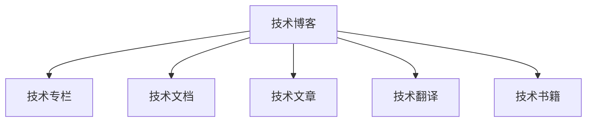

                 

# 技术写作：从博客到专栏作家之路

在信息技术迅猛发展的今天，掌握出色的技术写作能力成为了科技工作者不可或缺的技能之一。从博客到专栏作家，是一条充满挑战但充满机遇的道路。本文将系统阐述技术写作的核心概念、关键原理和实操步骤，并分享实用的学习资源、开发工具和论文推荐，为有志于成为专栏作家的读者提供全方位的指导。

## 1. 背景介绍

### 1.1 问题由来

随着互联网和信息技术的普及，技术博客和技术专栏成为人们获取最新技术动态和深度技术见解的重要渠道。许多开发者和研究者选择通过博客分享自己的研究成果和技术心得，不仅提升了个人影响力，也推动了技术知识的普及。而专栏作家作为更具权威性和系统性的技术传播者，其影响力和辐射面更大，能够更深入地影响技术发展趋势和方向。

### 1.2 问题核心关键点

技术写作的核心在于清晰、准确地传达技术理念和解决方案。优秀的技术写作能够让复杂的技术概念变得易于理解，激发读者的兴趣，并引导其在实际项目中加以应用。从博客到专栏作家，不仅是文字表达能力的提升，更是一种深度思考和技术能力的综合展现。

### 1.3 问题研究意义

掌握技术写作能力，对于提升个人品牌影响力、促进技术传播、推动技术创新和产业化具有重要意义。特别是对于希望在技术行业进一步发展、实现职业转型的读者，系统学习技术写作的原理和方法，将为未来的职业道路打下坚实的基础。

## 2. 核心概念与联系

### 2.1 核心概念概述

为更好地理解技术写作，本节将介绍几个密切相关的核心概念：

- 技术博客：以技术内容为主的个人或机构博客，通常侧重于某一技术领域的深入探讨或实践分享。
- 技术专栏：由具有较高专业水平的作者，定期在媒体平台上撰写关于特定技术领域的专业文章。
- 技术文档：企业或开源项目发布的技术使用、配置、开发文档，是技术传播的重要形式之一。
- 技术文章：发布在技术媒体或学术期刊上的技术研究、案例分析、教程文章。
- 技术翻译：将技术文章、论文等从外文翻译为中文，促进国际技术交流。
- 技术书籍：系统介绍某项技术原理、应用和开发的书籍，是技术学习的权威来源。

这些核心概念之间的逻辑关系可以通过以下Mermaid流程图来展示：



这个流程图展示了大规模语言模型微调的各个概念及其之间的关系：

1. 技术博客通过积累专业知识和实际经验，逐步成为更有影响力的技术专栏作家。
2. 技术博客和专栏文章通常是技术文档和书籍的来源之一。
3. 技术翻译和翻译质量直接影响国际技术交流。

这些概念共同构成了技术写作的学习框架，使读者能够全面掌握技术写作的各个环节。

## 3. 核心算法原理 & 具体操作步骤

### 3.1 算法原理概述

技术写作的本质是将复杂的技术知识和解决问题的思路，以易于理解的方式传达给读者。这涉及到技术内容的选择、呈现方式的设计以及读者反馈的优化等多个环节。

核心算法原理主要包括：

- 内容选择：根据目标读者的技术水平和兴趣，选择适宜的技术内容。
- 结构设计：采用清晰、逻辑严谨的篇章结构，确保技术信息的传达流畅、易于理解。
- 表达技巧：通过类比、实例、图表等多种方式，帮助读者更好地理解复杂概念。
- 读者互动：收集读者反馈，不断调整和优化文章内容，提升文章的影响力和实用性。

### 3.2 算法步骤详解

技术写作的算法步骤大致可以分为以下几个阶段：

**Step 1: 选题与内容准备**

- 根据读者的需求和兴趣，确定写作主题。
- 搜集相关文献、技术文档、实例数据等，准备写作素材。
- 设计文章的结构框架，确保内容的连贯性和逻辑性。

**Step 2: 内容编写与呈现**

- 按照既定的框架，逐步填充和完善文章内容。
- 使用图表、代码示例、实验结果等多样化手段，增强文章的直观性和可读性。
- 反复推敲和修改，确保文章表达清晰、准确无误。

**Step 3: 读者互动与优化**

- 发布文章，收集读者的反馈和评论。
- 根据反馈调整文章的表达方式和内容，进行持续优化。
- 不断更新和完善文章，保持内容的时效性和准确性。

### 3.3 算法优缺点

技术写作具有以下优点：

- 有助于知识的普及和传播。通过系统、详实的技术文章，能够使更多的开发者和用户了解和掌握新知识。
- 促进技术创新。深入的技术分析和技术推广，能够激发创新灵感，推动技术进步。
- 提升个人品牌影响力。优秀的技术写作能够提升作者的专业形象，吸引更多的读者和合作伙伴。

但同时，技术写作也存在一些局限：

- 对作者的专业能力要求较高。需要作者具备深厚的技术背景和清晰的表达能力。
- 内容创作耗时较长。撰写一篇高质量的技术文章，往往需要投入大量时间和精力。
- 读者反馈获取困难。技术写作的受众通常较为专业，反馈渠道有限。

尽管存在这些局限，但技术写作仍是推动技术交流和创新的重要手段。未来，技术写作将结合更多新兴技术，如自然语言处理、数据可视化等，提升写作的效率和质量。

### 3.4 算法应用领域

技术写作的应用领域非常广泛，涵盖以下几个主要方面：

- 技术研发与项目管理：记录和分享技术实验、项目进展、问题解决经验。
- 技术教育与培训：撰写教程、手册、培训材料，帮助学习者掌握新技能。
- 技术交流与合作：通过技术博客和专栏，促进技术与业务、技术与技术之间的交流与合作。
- 技术咨询与分析：提供技术问题的分析、解决方案的建议，帮助企业解决实际问题。
- 技术趋势与预测：分析技术发展趋势，预测未来的技术方向，指导技术决策。

此外，技术写作在开源社区、教育培训、科技媒体等多个领域中发挥着重要作用。

## 4. 数学模型和公式 & 详细讲解 & 举例说明

### 4.1 数学模型构建

技术写作的数学模型构建主要涉及读者理解和接受的阈值、内容的重要性权重、内容的可读性评分等。数学模型可以通过以下公式来表达：

$$
\text{文章评分} = \text{内容价值} \times \text{可读性评分} \times \text{读者反馈}
$$

其中，内容价值基于内容对读者的实际帮助和创新性；可读性评分基于内容的组织结构、语言表达的清晰度和信息的完整性；读者反馈基于读者的评论和互动情况。

### 4.2 公式推导过程

根据上述公式，可以进一步推导出以下结论：

1. 内容价值：高技术含量、创新性强的内容，能够吸引更多读者关注，提升文章评分。
2. 可读性评分：结构清晰、表达流畅、信息完整的内容，能够提高读者的阅读体验，从而提升文章评分。
3. 读者反馈：积极的反馈和互动能够增强文章的传播效果，进一步提升文章评分。

### 4.3 案例分析与讲解

以一篇介绍深度学习模型的技术文章为例，分析其内容价值、可读性评分和读者反馈的计算过程：

假设读者对深度学习模型的知识掌握程度为中等，那么内容价值可以通过以下方式计算：

$$
\text{内容价值} = f(\text{专业性}, \text{创新性})
$$

其中，$f$函数基于内容的专业性和创新性进行量化。对于中等掌握程度，假设内容专业性为$P=0.5$，创新性为$I=0.7$，则：

$$
\text{内容价值} = f(0.5, 0.7) = 0.8
$$

假设文章结构清晰，语言表达流畅，信息完整，那么可读性评分可以表示为：

$$
\text{可读性评分} = \frac{\text{结构清晰度} + \text{语言流畅性} + \text{信息完整性}}{3}
$$

假设结构清晰度为$C=0.9$，语言流畅性为$L=0.85$，信息完整性为$I=0.95$，则：

$$
\text{可读性评分} = \frac{0.9 + 0.85 + 0.95}{3} = 0.9
$$

假设文章发布后，读者反馈良好，平均评分$R=0.9$，那么文章评分可以表示为：

$$
\text{文章评分} = 0.8 \times 0.9 \times 0.9 = 0.648
$$

根据此模型，可以评估文章的整体价值，并根据反馈调整优化策略。

## 5. 项目实践：代码实例和详细解释说明

### 5.1 开发环境搭建

在进行技术写作实践前，我们需要准备好开发环境。以下是使用Python进行Markdown编写技术文章的环境配置流程：

1. 安装Python：从官网下载并安装Python，建议选择稳定版。
2. 安装Markdown编辑器：如Typora、vscode等，支持Markdown语法。
3. 安装Git版本控制工具：如GitHub Desktop、Git Bash等，方便版本管理和协作。
4. 安装GitHub账号：注册GitHub账号，创建仓库，上传文章。

完成上述步骤后，即可在Markdown编辑器中开始技术文章的编写。

### 5.2 源代码详细实现

下面以一篇介绍机器学习模型调优的技术文章为例，给出Markdown代码实现。

```markdown
# 机器学习模型调优的实用技巧

## 引言

机器学习模型调优是模型训练的重要环节，直接影响到模型的性能和泛化能力。本文将详细介绍模型调优的常用方法，并通过实例代码演示调优过程。

## 一、模型选择

选择适合的模型是调优的前提。常用的机器学习模型包括线性回归、逻辑回归、支持向量机、决策树、随机森林、神经网络等。

### 1. 线性回归

线性回归模型适用于预测连续变量。例如，可以使用scikit-learn库中的LinearRegression进行调优。

```python
from sklearn.linear_model import LinearRegression
from sklearn.metrics import mean_squared_error

# 加载数据
X_train, y_train = load_data()
X_test, y_test = load_data()

# 创建模型
model = LinearRegression()

# 模型调优
# 设置正则化参数
alpha = 0.01
model.fit(X_train, y_train)

# 评估模型
mse = mean_squared_error(y_test, model.predict(X_test))
print(f"MSE: {mse}")
```

### 2. 逻辑回归

逻辑回归模型适用于二分类问题。例如，可以使用scikit-learn库中的LogisticRegression进行调优。

```python
from sklearn.linear_model import LogisticRegression
from sklearn.metrics import accuracy_score

# 加载数据
X_train, y_train = load_data()
X_test, y_test = load_data()

# 创建模型
model = LogisticRegression()

# 模型调优
# 设置正则化参数
C = 1.0
model.fit(X_train, y_train)

# 评估模型
acc = accuracy_score(y_test, model.predict(X_test))
print(f"Accuracy: {acc}")
```

### 3. 支持向量机

支持向量机（SVM）适用于分类和回归问题。例如，可以使用scikit-learn库中的SVC进行调优。

```python
from sklearn.svm import SVC
from sklearn.metrics import accuracy_score

# 加载数据
X_train, y_train = load_data()
X_test, y_test = load_data()

# 创建模型
model = SVC()

# 模型调优
# 设置正则化参数
C = 1.0
model.fit(X_train, y_train)

# 评估模型
acc = accuracy_score(y_test, model.predict(X_test))
print(f"Accuracy: {acc}")
```

## 二、超参数调优

超参数调优是模型调优的关键步骤。常用的调优方法包括网格搜索（Grid Search）和随机搜索（Random Search）。

### 1. 网格搜索

网格搜索方法尝试所有可能的超参数组合，选择最优的组合。例如，可以使用scikit-learn库中的GridSearchCV进行调优。

```python
from sklearn.model_selection import GridSearchCV

# 设置超参数
param_grid = {'alpha': [0.001, 0.01, 0.1, 1.0], 'C': [0.1, 1.0, 10.0, 100.0]}

# 创建模型
model = LinearRegression()

# 模型调优
grid_search = GridSearchCV(model, param_grid, cv=5)
grid_search.fit(X_train, y_train)

# 获取最佳参数
best_alpha, best_C = grid_search.best_params_['alpha'], grid_search.best_params_['C']

# 评估模型
mse = mean_squared_error(y_test, grid_search.best_estimator_.predict(X_test))
print(f"MSE: {mse}")
```

### 2. 随机搜索

随机搜索方法从超参数空间中随机选择组合，选择最优的组合。例如，可以使用scikit-learn库中的RandomizedSearchCV进行调优。

```python
from sklearn.model_selection import RandomizedSearchCV

# 设置超参数
param_dist = {'alpha': uniform(0.001, 1.0), 'C': uniform(0.1, 100.0)}

# 创建模型
model = LinearRegression()

# 模型调优
random_search = RandomizedSearchCV(model, param_dist, n_iter=100, cv=5)
random_search.fit(X_train, y_train)

# 获取最佳参数
best_alpha, best_C = random_search.best_params_['alpha'], random_search.best_params_['C']

# 评估模型
mse = mean_squared_error(y_test, random_search.best_estimator_.predict(X_test))
print(f"MSE: {mse}")
```

## 三、特征工程

特征工程是模型调优的重要环节。常用的特征工程方法包括特征选择、特征缩放、特征构造等。

### 1. 特征选择

特征选择方法通过选择最优特征，提高模型性能。例如，可以使用scikit-learn库中的SelectKBest进行调优。

```python
from sklearn.feature_selection import SelectKBest, f_regression

# 加载数据
X_train, y_train = load_data()
X_test, y_test = load_data()

# 创建模型
model = LinearRegression()

# 模型调优
# 选择前10个特征
selector = SelectKBest(f_regression, k=10)
X_train_selected = selector.fit_transform(X_train, y_train)
X_test_selected = selector.transform(X_test)

# 评估模型
mse = mean_squared_error(y_test, model.predict(X_test_selected))
print(f"MSE: {mse}")
```

### 2. 特征缩放

特征缩放方法通过将特征缩放到指定范围，提高模型收敛速度。例如，可以使用scikit-learn库中的StandardScaler进行调优。

```python
from sklearn.preprocessing import StandardScaler

# 加载数据
X_train, y_train = load_data()
X_test, y_test = load_data()

# 创建模型
model = LinearRegression()

# 模型调优
# 特征缩放
scaler = StandardScaler()
X_train_scaled = scaler.fit_transform(X_train)
X_test_scaled = scaler.transform(X_test)

# 评估模型
mse = mean_squared_error(y_test, model.predict(X_test_scaled))
print(f"MSE: {mse}")
```

### 3. 特征构造

特征构造方法通过构造新的特征，提高模型表达能力。例如，可以使用scikit-learn库中的PolynomialFeatures进行调优。

```python
from sklearn.preprocessing import PolynomialFeatures

# 加载数据
X_train, y_train = load_data()
X_test, y_test = load_data()

# 创建模型
model = LinearRegression()

# 模型调优
# 特征构造
poly = PolynomialFeatures(degree=2)
X_train_poly = poly.fit_transform(X_train)
X_test_poly = poly.transform(X_test)

# 评估模型
mse = mean_squared_error(y_test, model.predict(X_test_poly))
print(f"MSE: {mse}")
```

## 四、模型评估与验证

模型评估与验证是模型调优的重要环节。常用的评估方法包括交叉验证、学习曲线等。

### 1. 交叉验证

交叉验证方法通过将数据集划分为训练集和验证集，评估模型性能。例如，可以使用scikit-learn库中的cross_val_score进行调优。

```python
from sklearn.model_selection import cross_val_score

# 加载数据
X_train, y_train = load_data()
X_test, y_test = load_data()

# 创建模型
model = LinearRegression()

# 模型调优
# 交叉验证
scores = cross_val_score(model, X_train, y_train, cv=5)
mean_score = scores.mean()

# 评估模型
print(f"Mean score: {mean_score}")
```

### 2. 学习曲线

学习曲线方法通过绘制训练误差和测试误差随训练集大小变化的曲线，评估模型性能。例如，可以使用scikit-learn库中的learning_curve进行调优。

```python
from sklearn.model_selection import learning_curve

# 加载数据
X_train, y_train = load_data()
X_test, y_test = load_data()

# 创建模型
model = LinearRegression()

# 模型调优
# 学习曲线
train_sizes, train_scores, test_scores = learning_curve(model, X_train, y_train, cv=5)
train_mean = np.mean(train_scores, axis=1)
test_mean = np.mean(test_scores, axis=1)

# 评估模型
plt.plot(train_sizes, train_mean, label='Training error')
plt.plot(train_sizes, test_mean, label='Validation error')
plt.legend()
plt.show()
```

## 五、代码解读与分析

技术文章的核心在于清晰的表达和实用的代码示例。通过真实的代码示例，读者可以更好地理解和应用模型调优技术。

**Markdown语法：**
- 标题：使用#号表示，支持多级标题。
- 代码块：使用``````包裹代码，支持Python代码、代码片段和代码块。
- 链接：使用[]号包含链接地址，使用()号包含链接文字。
- 列表：使用*号表示无序列表，使用-号表示有序列表。

通过合理使用Markdown语法，可以确保技术文章的格式清晰、易读，便于读者理解和学习。

## 6. 实际应用场景

### 6.1 机器学习模型优化

在机器学习项目中，模型调优是提高模型性能的关键环节。通过科学合理的调优方法，可以显著提升模型的预测准确率和泛化能力。

### 6.2 数据科学竞赛

数据科学竞赛中，模型调优和特征工程是获胜的关键。优秀的技术写作和清晰的代码示例，能够帮助参赛选手更好地展示其技术思路和算法实现。

### 6.3 开源项目贡献

开源项目贡献中，良好的技术文档和代码示例能够帮助其他开发者更好地理解和使用项目。优秀的技术写作能够提升项目的质量和受欢迎程度。

### 6.4 未来应用展望

随着机器学习技术的发展，模型调优的重要性将进一步凸显。技术写作作为传播和应用技术的重要手段，其地位也将不断提升。未来的技术写作将更多地结合新兴技术，如自然语言处理、数据可视化等，提升写作效率和质量。

## 7. 工具和资源推荐

### 7.1 学习资源推荐

为了帮助开发者系统掌握技术写作的原理和实践技巧，这里推荐一些优质的学习资源：

1. GitHub Learning Lab：提供系统化的编程和开发学习路径，涵盖Markdown语法和Git操作。
2. Coursera《写作技能提升》课程：系统讲解如何写出清晰、有力的技术文章。
3. Udacity《数据科学与机器学习》课程：提供数据科学和机器学习的理论和实践指导，包含模型调优和特征工程等技能。
4. Kaggle竞赛平台：提供丰富的数据集和比赛项目，练习和应用技术写作技能。
5. Stack Overflow：学习编程和技术问题的解决思路，提高代码表达和问题分析能力。

通过对这些资源的学习实践，相信你一定能够快速掌握技术写作的精髓，并用于解决实际的NLP问题。

### 7.2 开发工具推荐

高效的开发离不开优秀的工具支持。以下是几款用于技术写作开发的常用工具：

1. Markdown编辑器：如Typora、vscode等，支持Markdown语法，方便编写和预览技术文章。
2. Git版本控制工具：如GitHub Desktop、Git Bash等，方便版本管理和协作。
3. LaTeX排版工具：如Overleaf、TeXstudio等，支持复杂的数学公式和排版需求。
4. Jupyter Notebook：支持Python等语言的交互式编程，便于展示代码示例。
5. GitHub Pages：支持静态网页的托管和展示，方便发布技术文章和文档。

合理利用这些工具，可以显著提升技术写作的效率和质量，加快创新迭代的步伐。

### 7.3 相关论文推荐

技术写作的研究源于学界的持续研究。以下是几篇奠基性的相关论文，推荐阅读：

1. "Effective Communication of Computer Science Concepts"（有效传达计算机科学概念）：探讨了计算机科学概念的有效传达方法。
2. "A Style Guide for Technical Writing"（技术写作风格指南）：详细介绍了技术写作的基本规范和技巧。
3. "Writing in the Scientific Journal"（科学期刊写作）：系统讲解了科学期刊文章写作的规范和要求。
4. "Communicating Machine Learning Results"（机器学习结果的交流）：探讨了机器学习结果的交流方式和技巧。
5. "Writing Efficient Code for Technical Readers"（为技术读者编写高效代码）：介绍了为技术读者编写高效代码的方法和技巧。

这些论文代表了大语言模型微调技术的发展脉络。通过学习这些前沿成果，可以帮助研究者把握学科前进方向，激发更多的创新灵感。

## 8. 总结：未来发展趋势与挑战

### 8.1 总结

本文对技术写作的核心概念、关键原理和实操步骤进行了全面系统的介绍。首先阐述了技术写作在信息传播和技术交流中的重要意义，明确了技术写作的学习目标和实践要求。其次，从算法原理到操作步骤，详细讲解了技术写作的数学模型和实际应用，给出了实用的Markdown代码示例。同时，本文还广泛探讨了技术写作在机器学习、数据科学、开源项目等多个领域的应用前景，展示了技术写作的广泛价值。此外，本文精选了技术写作的学习资源、开发工具和论文推荐，为读者提供全方位的学习指导。

通过本文的系统梳理，可以看到，技术写作不仅是编程技能的提升，更是一种深度思考和技术能力的综合展现。掌握技术写作能力，对于提升个人品牌影响力、促进技术传播、推动技术创新和产业化具有重要意义。未来，技术写作将结合更多新兴技术，如自然语言处理、数据可视化等，提升写作的效率和质量。

### 8.2 未来发展趋势

展望未来，技术写作将呈现以下几个发展趋势：

1. 语言模型的应用将更加广泛。自然语言处理技术的发展，将提升技术写作的效率和质量，使得更多开发者和研究者能够利用自然语言技术进行写作。
2. 技术写作将与内容管理系统结合，进一步提升内容的可读性和可分享性。
3. 技术写作将更加注重可读性和用户体验，提升技术文章的传播效果。
4. 技术写作将更多地结合视频、音频等多媒体形式，增强内容的吸引力。
5. 技术写作将更加注重互动性和用户反馈，不断优化内容质量。

以上趋势凸显了技术写作的未来前景。这些方向的探索发展，将进一步提升技术写作的效率和质量，促进技术知识的普及和传播。

### 8.3 面临的挑战

尽管技术写作在信息传播和技术交流中具有重要意义，但面临的挑战也不容忽视：

1. 技术文章的写作门槛较高。需要作者具备深厚的技术背景和清晰的表达能力。
2. 技术文章的读者群体较为专业，传播渠道有限。
3. 技术文章的更新频率要求较高，更新内容需要投入大量时间和精力。
4. 技术文章的内容质量要求较高，需要不断地学习和实践，以保持内容的时效性和准确性。

尽管存在这些挑战，但技术写作仍是推动技术交流和创新的重要手段。未来，技术写作需要更多的技术工具和平台支持，以降低写作门槛，提升写作效率和质量。同时，技术写作也需要更多的用户互动和反馈，以不断优化内容质量。

### 8.4 研究展望

未来的技术写作研究需要在以下几个方面寻求新的突破：

1. 结合自然语言处理技术，提升技术文章的写作效率和质量。
2. 开发更多的技术写作工具和平台，降低写作门槛，提升写作效率。
3. 引入更多互动和用户反馈机制，提升技术文章的传播效果和用户参与度。
4. 结合新兴技术，如数据可视化、机器学习等，提升技术文章的可读性和互动性。

这些研究方向的探索，将引领技术写作技术迈向更高的台阶，为构建人机协同的智能系统铺平道路。面向未来，技术写作需要与其他人工智能技术进行更深入的融合，多路径协同发力，共同推动自然语言理解和智能交互系统的进步。只有勇于创新、敢于突破，才能不断拓展技术写作的边界，让智能技术更好地造福人类社会。

## 9. 附录：常见问题与解答

**Q1：如何写出优秀的技术文章？**

A: 写出优秀的技术文章需要以下几个步骤：
1. 明确文章主题和目标读者。
2. 搜集和整理相关资料。
3. 设计文章结构和逻辑框架。
4. 编写清晰、简洁、易于理解的技术内容。
5. 使用图表、代码示例等多样化手段，增强文章的直观性和可读性。
6. 收集读者反馈，不断调整和优化文章内容。

**Q2：如何提升技术写作能力？**

A: 提升技术写作能力需要以下几个方面：
1. 学习系统化的技术写作方法和技巧。
2. 多读多写，积累技术写作经验。
3. 学习相关的编程和数据处理技能。
4. 学习自然语言处理、数据可视化等新兴技术。
5. 参加技术写作和数据科学竞赛，练习技术写作技能。
6. 学习其他领域优秀写作者的风格和技巧。

**Q3：如何选择合适的技术写作工具？**

A: 选择合适的技术写作工具需要以下几个方面：
1. 选择易于使用的Markdown编辑器，支持语法和格式化。
2. 选择版本控制工具，方便协作和项目管理。
3. 选择支持代码高亮和代码块显示的工具。
4. 选择支持PDF输出和网页托管的工具。
5. 选择支持自动排版和语法检查的工具。

通过合理选择和使用这些工具，可以显著提升技术写作的效率和质量。

**Q4：如何提升技术文章的传播效果？**

A: 提升技术文章的传播效果需要以下几个方面：
1. 选择合适的发布平台，如GitHub、Medium等。
2. 优化文章标题和摘要，提高文章的可见性。
3. 使用标签和分类，方便读者发现文章。
4. 增加互动和用户反馈机制，如评论、点赞、分享等。
5. 定期更新和维护文章，保持内容的时效性和准确性。

通过合理使用这些策略，可以显著提升技术文章的传播效果，吸引更多的读者和关注。

---

作者：禅与计算机程序设计艺术 / Zen and the Art of Computer Programming

