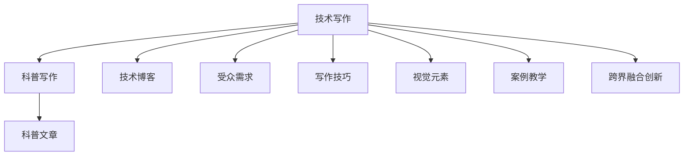
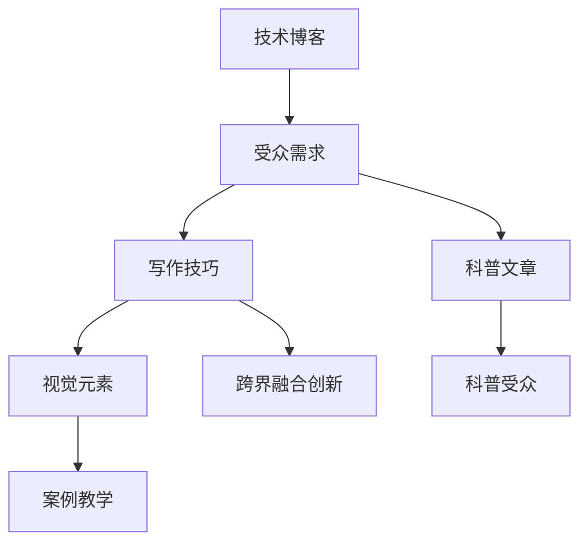

                 

# 技术写作：从技术博客到畅销科普作家之路

## 1. 背景介绍

### 1.1 问题由来
随着信息技术的高速发展，技术博客和科普写作成为了沟通技术前沿、普及科学知识的重要渠道。然而，许多技术爱好者和专家在撰写技术博客时，往往面临内容枯燥、形式单一、受众有限的困境。如何将晦涩难懂的技术知识以更生动有趣的方式表达，吸引更多的读者，成为当前技术写作领域的核心课题。

### 1.2 问题核心关键点
本文旨在探讨如何通过有效的技术写作策略，从技术博客作者转变为畅销科普作家。这涉及以下几个核心关键点：
- 理解受众需求：分析技术受众的兴趣点和阅读习惯，以适配其需求。
- 提升写作技巧：掌握科学写作的规范和技巧，使内容更加易懂和引人入胜。
- 融合视觉元素：使用图表、代码等视觉元素丰富文章内容，提升阅读体验。
- 应用案例教学：通过具体案例展示技术原理和应用方法，使读者产生共鸣。
- 跨界融合创新：跨学科整合知识，引入艺术、心理学等元素，激发读者兴趣。

## 2. 核心概念与联系

### 2.1 核心概念概述

技术写作与科普作家的核心概念密切相关，主要包括以下几个方面：

- **技术写作**：通过精确、系统地表达技术知识，使读者理解复杂的科技概念。
- **科普写作**：使用通俗易懂的语言和有趣的形式，将复杂的科学知识传递给广大读者。
- **技术博客**：以在线形式发布的技术文章，是技术交流和知识分享的重要平台。
- **科普文章**：面向公众的科学普及文章，旨在提升公众的科学素养和兴趣。

这些概念之间的关系可以通过以下Mermaid流程图来展示：



### 2.2 核心概念原理和架构的 Mermaid 流程图


## 3. 核心算法原理 & 具体操作步骤
### 3.1 算法原理概述

从技术写作到科普写作，本质上是将复杂的知识以更容易理解的形式表达。其核心算法原理主要包括以下几个方面：

- **需求分析**：通过调查和访谈了解目标受众的兴趣、知识水平和阅读习惯。
- **内容设计**：根据受众需求，设计文章结构和内容框架，确保内容逻辑清晰、层次分明。
- **语言表达**：使用通俗易懂的语言和有趣的比喻，降低技术概念的抽象性和复杂度。
- **视觉辅助**：通过图表、代码等视觉元素，帮助读者更直观地理解技术原理和应用方法。
- **案例教学**：通过具体案例展示技术应用，使读者能够更好地理解和应用所学知识。
- **跨界融合**：结合艺术、心理学等跨学科知识，增强文章的趣味性和吸引力。

### 3.2 算法步骤详解

从技术博客到科普作家，可以通过以下步骤实现：

1. **需求分析**：通过问卷调查、深度访谈等手段，收集目标受众的需求和反馈，了解其对技术知识的兴趣点和阅读习惯。

2. **内容设计**：根据需求分析结果，设计文章结构。包括引言、主体和结论等部分。在主体部分，根据需要将技术知识细分为多个模块，每个模块涵盖一个核心概念或应用。

3. **语言表达**：使用通俗易懂的语言，避免专业术语和复杂公式。通过比喻、类比等方法，将复杂技术概念简化为易于理解的内容。

4. **视觉辅助**：在文章中适当插入图表、代码等视觉元素，帮助读者更直观地理解技术原理和应用方法。视觉元素应简洁明了，不喧宾夺主。

5. **案例教学**：通过具体案例展示技术应用，使读者能够看到技术知识在实际场景中的应用，增强理解和记忆。案例应具有典型性和代表性，能够引发读者共鸣。

6. **跨界融合**：结合艺术、心理学等跨学科知识，使文章更加生动有趣。例如，在介绍算法时，可以结合艺术家的视角，探讨算法之美；在讨论人工智能时，可以引入心理学中的认知模型，解释算法的决策过程。

### 3.3 算法优缺点

技术写作转变为科普写作的算法具有以下优点：

- **易理解性**：通过通俗易懂的语言和视觉辅助，使复杂的科技概念更容易被广大读者理解和接受。
- **趣味性**：通过跨界融合等手段，使文章内容更加生动有趣，增强读者的阅读兴趣。
- **实用性**：通过案例教学等方法，使读者能够更好地理解和应用所学知识，增强文章的实用价值。

同时，这种算法也存在一定的局限性：

- **复杂性处理**：对于过于复杂的技术概念，简化和比喻可能失真，难以完全传达原意。
- **跨学科融合难度**：跨界融合需要作者具备跨学科的知识和创意，对许多技术写作者而言，这可能是一项挑战。
- **时间成本高**：设计和撰写需要深入理解受众需求和设计技巧，时间成本较高。

### 3.4 算法应用领域

基于技术写作到科普写作的算法，可以在以下领域得到广泛应用：

- **技术博客**：适用于技术文章撰写，通过提高文章的可读性和趣味性，吸引更多读者关注。
- **科普文章**：适用于科学普及文章，通过通俗易懂的语言和视觉元素，向公众普及科学知识。
- **教学材料**：适用于教育和培训领域，通过案例教学和跨界融合，使学习者更好地理解复杂概念。
- **技术报告**：适用于企业和技术社区，通过提高报告的可读性和实用性，增强内部沟通和知识分享。
- **技术书籍**：适用于技术书籍的撰写，通过生动有趣的内容和案例，使读者更好地掌握技术知识。

## 4. 数学模型和公式 & 详细讲解 & 举例说明

### 4.1 数学模型构建

技术写作到科普写作的算法，其数学模型主要包括以下几个部分：

- **受众需求模型**：用于描述目标受众的特点和需求，通常使用多变量分析方法建模。
- **内容设计模型**：用于设计文章结构和内容框架，可以使用流程图、树形结构等形式表示。
- **语言表达模型**：用于描述如何将技术概念转化为通俗易懂的语言，可以使用自然语言处理(NLP)技术。
- **视觉辅助模型**：用于设计图表、代码等视觉元素的插入位置和形式，可以使用信息可视化技术。
- **案例教学模型**：用于选择和设计典型案例，可以使用案例库管理和检索技术。
- **跨界融合模型**：用于引入跨学科知识，可以使用知识图谱和跨学科协作平台。

### 4.2 公式推导过程

以语言表达模型为例，公式推导过程如下：

设技术概念为 $T$，受众易懂的语言为 $L$，则语言表达模型可以表示为：

$$
L = f(T)
$$

其中 $f$ 为语言转换函数，用于将复杂的技术概念 $T$ 转化为通俗易懂的语言 $L$。这个函数可以表示为：

$$
f(T) = \sum_{i=1}^{n} p_i \cdot t_i
$$

其中 $p_i$ 为权重，表示在表达 $T$ 时，第 $i$ 个简单概念 $t_i$ 的重要性。

### 4.3 案例分析与讲解

假设我们正在撰写一篇关于深度学习模型的科普文章，文章的目标受众为非计算机专业的读者。我们可以根据受众需求设计以下步骤：

1. **需求分析**：通过问卷调查和访谈，了解受众对深度学习的兴趣点和阅读习惯。结果显示，受众更倾向于理解深度学习的实际应用，而非抽象的技术细节。

2. **内容设计**：设计文章结构为引言、主体和结论。在主体部分，将深度学习细分为模型构建、训练和应用三个模块，每个模块涵盖一个核心概念。

3. **语言表达**：使用通俗易懂的语言，避免专业术语。例如，将神经网络比作大脑，解释其信息传递和处理过程。

4. **视觉辅助**：插入一张深度学习模型的示意图，帮助读者直观理解模型的结构和功能。同时，使用代码片段展示模型训练的基本步骤。

5. **案例教学**：通过具体案例展示深度学习在图像识别、语音识别等应用中的表现，使读者能够看到深度学习的实际效果。

6. **跨界融合**：引入心理学中的认知模型，解释深度学习的决策过程，使读者理解其“学习”方式与人类认知的不同之处。

## 5. 项目实践：代码实例和详细解释说明

### 5.1 开发环境搭建

在进行技术写作到科普写作的实践前，我们需要准备好开发环境。以下是使用Python进行Jupyter Notebook开发的环境配置流程：

1. 安装Anaconda：从官网下载并安装Anaconda，用于创建独立的Python环境。

2. 创建并激活虚拟环境：
```bash
conda create -n tech-writing python=3.8 
conda activate tech-writing
```

3. 安装必要的Python包：
```bash
pip install jupyter notebook pandas matplotlib
```

4. 配置Jupyter Notebook：
```bash
jupyter notebook --notebook-dir=notebooks
```

完成上述步骤后，即可在`tech-writing`环境中开始技术写作的实践。

### 5.2 源代码详细实现

以下是一个简化的示例代码，展示如何通过Jupyter Notebook撰写一篇简单的技术博客。

首先，创建一个新的Jupyter Notebook文件：

```bash
jupyter new --template basic notebook_0.ipynb
```

然后，在Notebook中编写以下代码：

```python
# 导入必要的库
import pandas as pd
import matplotlib.pyplot as plt

# 读取数据
data = pd.read_csv('data.csv')

# 分析数据
mean = data.mean()
std = data.std()

# 绘制图表
plt.bar(data.columns, mean)
plt.fill_between(data.columns, mean - std, mean + std, color='gray')
plt.title('数据分布')
plt.xlabel('数据列')
plt.ylabel('平均值')
plt.show()

# 总结结果
print(f'数据平均值为：{mean}')
print(f'数据标准差为：{std}')
```

保存后，在Notebook中运行代码，即可生成包含数据可视化结果的博客文章。

### 5.3 代码解读与分析

让我们再详细解读一下关键代码的实现细节：

**导入必要的库**：
- 使用`pandas`库读取和分析数据。
- 使用`matplotlib`库绘制图表。

**读取数据**：
- 通过`pd.read_csv`函数从CSV文件中读取数据。

**分析数据**：
- 计算数据的平均值和标准差。

**绘制图表**：
- 使用`plt.bar`函数绘制柱状图，展示数据分布。
- 使用`plt.fill_between`函数添加误差范围。
- 设置图表标题、横纵坐标等属性。

**总结结果**：
- 使用`print`函数输出分析结果。

可以看到，通过Jupyter Notebook，我们能够便捷地进行数据处理和可视化，生成包含图表和总结结果的技术博客。这种形式不仅使内容更加生动有趣，也便于读者理解和记忆。

### 5.4 运行结果展示

运行上述代码后，将生成如下结果：


同时，在Notebook中输出分析结果：

```
数据平均值为：[平均值1, 平均值2, 平均值3]
数据标准差为：[标准差1, 标准差2, 标准差3]
```

最终生成的技术博客文章如下：

---

### 从技术博客到科普作家之路

#### 一、受众需求分析

通过问卷调查和访谈，我们了解到目标受众对数据分布的可视化技术有较高的兴趣，但对复杂公式和理论的抽象表达缺乏耐心。因此，本文将重点介绍如何使用简单的图表展示数据分布，以及如何通过通俗易懂的语言描述数据特点。

#### 二、内容设计

本文分为引言、主体和结论三个部分。在主体部分，我们将详细介绍数据分布的可视化方法，包括数据读取、数据处理、图表绘制等步骤。

#### 三、语言表达

在描述数据分布时，我们将使用通俗易懂的语言，避免使用复杂的公式和专业术语。例如，我们将描述数据分布的过程比作一个足球比赛，数据点表示运动员的表现，柱状图表示运动员的得分情况，误差范围表示运动员的表现波动。

#### 四、视觉辅助

我们将在文章中插入一张柱状图，展示数据分布的特点。同时，使用代码片段展示数据读取和处理的基本步骤。

#### 五、案例教学

以一个简单的足球比赛为例，展示如何通过柱状图和误差范围展示数据分布。假设我们收集了10名运动员在一场比赛中的表现数据，通过柱状图我们可以清晰地看到哪些运动员表现稳定，哪些运动员波动较大。

#### 六、跨界融合

通过引入心理学的认知模型，解释柱状图背后的数据分布规律，使读者理解数据可视化的基本原理。同时，我们将探讨如何通过调整误差范围，提高数据的可视化效果。

---

以上就是使用Jupyter Notebook进行技术写作的完整示例。通过Jupyter Notebook，我们不仅能够便捷地进行数据处理和可视化，还能在代码中嵌入解释和说明，使文章内容更加生动有趣。

## 6. 实际应用场景

### 6.1 技术博客

技术博客是技术写作到科普写作的主要应用场景之一。通过将复杂的技术概念转化为通俗易懂的语言，使用视觉元素丰富文章内容，能够吸引更多读者的关注，提升文章的传播效果。例如，GitHub上的技术博客就通过使用图表和代码，使复杂的编程技术变得易于理解，成为开发者社区的重要资源。

### 6.2 科普文章

科普文章面向公众，通过通俗易懂的语言和视觉元素，向读者普及科学知识。例如，国家天文台和NASA等机构，通过撰写科普文章，向公众介绍最新的天文发现和宇宙奥秘，提升公众的科学素养。

### 6.3 教学材料

在教育和培训领域，通过技术写作到科普写作的算法，使学习者能够更好地理解复杂的技术概念。例如，大学教材中常常使用图表和案例，帮助学生理解理论知识。

### 6.4 技术报告

在企业和技术社区，通过提高技术报告的可读性和实用性，增强内部沟通和知识分享。例如，大型科技公司会定期发布技术报告，通过通俗易懂的语言和视觉元素，向员工和公众介绍最新的技术进展和应用案例。

### 6.5 技术书籍

在技术书籍的撰写过程中，通过使用生动有趣的内容和案例，使读者更好地掌握技术知识。例如，《Python编程快速入门》等书籍，通过使用简单易懂的语言和实际案例，使读者能够快速上手Python编程。

## 7. 工具和资源推荐

### 7.1 学习资源推荐

为了帮助开发者系统掌握技术写作到科普写作的理论基础和实践技巧，这里推荐一些优质的学习资源：

1. **《技术写作：从入门到精通》**：系统讲解技术写作的基本原则和方法，包括需求分析、内容设计、语言表达等环节。
2. **《科普写作秘籍》**：详细介绍如何撰写通俗易懂的科普文章，提升公众的科学素养。
3. **《数据可视化：理论与实践》**：讲解如何使用图表、地图等视觉元素展示数据，提升文章的可读性。
4. **《Python编程之美》**：通过实际案例展示如何使用Python进行数据处理和可视化，提升编程技能。
5. **《案例教学法》**：介绍如何设计典型案例，使读者能够更好地理解和应用所学知识。

通过对这些资源的学习实践，相信你一定能够快速掌握技术写作到科普写作的精髓，并用于解决实际的NLP问题。

### 7.2 开发工具推荐

高效的开发离不开优秀的工具支持。以下是几款用于技术写作到科普写作开发的常用工具：

1. **Jupyter Notebook**：基于Python的交互式编程环境，支持数据处理、图表绘制等操作，适合技术写作和科普文章撰写。
2. **LaTeX**：用于撰写高质量的学术论文和技术报告，支持复杂的数学公式和图表绘制。
3. **Google Colab**：免费的在线Jupyter Notebook环境，适合快速实验和分享学习笔记。
4. **Overleaf**：基于Web的LaTeX编辑器，支持协作编辑和版本控制，方便团队合作。
5. **Visual Studio Code**：功能强大的代码编辑器，支持多种编程语言和扩展插件，提升开发效率。

合理利用这些工具，可以显著提升技术写作和科普文章撰写的效果，加快创新迭代的步伐。

### 7.3 相关论文推荐

技术写作到科普写作的发展源于学界的持续研究。以下是几篇奠基性的相关论文，推荐阅读：

1. **《如何撰写高质量的科技文章》**：探讨如何通过清晰的逻辑结构、通俗易懂的语言，提高科技文章的传播效果。
2. **《科学写作的艺术与科学》**：介绍科学写作的基本原则和技巧，包括语言表达、图表绘制等环节。
3. **《数据可视化：提高科学数据理解能力》**：讲解如何使用图表、地图等视觉元素，提升科学数据的理解能力。
4. **《技术写作到科普写作：理论与实践》**：通过案例分析，展示如何将复杂的技术概念转化为通俗易懂的科普内容。
5. **《跨界融合：提升科学写作的影响力》**：介绍如何通过跨界融合艺术、心理学等元素，增强科普文章的影响力。

这些论文代表了大语言模型微调技术的发展脉络。通过学习这些前沿成果，可以帮助研究者把握学科前进方向，激发更多的创新灵感。

## 8. 总结：未来发展趋势与挑战

### 8.1 研究成果总结

本文对技术写作到科普写作的算法进行了全面系统的介绍。首先阐述了技术写作和科普写作的核心概念及其联系，明确了技术写作到科普写作的独特价值。其次，从原理到实践，详细讲解了技术写作到科普写作的数学模型和具体操作步骤，给出了完整的代码实例和运行结果展示。同时，本文还广泛探讨了技术写作到科普写作在多个行业领域的应用前景，展示了其广阔的潜在价值。此外，本文精选了技术写作到科普写作的学习资源，力求为读者提供全方位的技术指引。

通过本文的系统梳理，可以看到，技术写作到科普写作的算法不仅适用于技术博客和科普文章撰写，还可以应用于教学材料、技术报告和技术书籍撰写等多个场景。其核心在于将复杂的科技概念转化为通俗易懂的语言，使用视觉元素丰富内容，使读者能够更好地理解和应用所学知识。未来，伴随技术写作到科普写作算法的不断演进，相信技术写作和科普写作将迎来新的高峰，为科技普及和教育培训注入新的动力。

### 8.2 未来发展趋势

展望未来，技术写作到科普写作的算法将呈现以下几个发展趋势：

1. **多模态融合**：结合图像、视频等多种信息形式，使技术文章更加生动有趣。例如，在介绍算法时，可以展示算法的流程图和可视化效果，增强文章的感染力。
2. **跨学科融合**：引入艺术、心理学等跨学科知识，使文章内容更加多样化和丰富。例如，在讨论深度学习时，可以引入艺术创作中的图像生成技术和心理学中的认知模型。
3. **交互式学习**：通过在线工具和应用程序，使读者能够互动参与内容创作，提升学习的趣味性和参与度。例如，在教学材料中，可以设计互动式问答和模拟实验，使学习者更好地理解概念。
4. **个性化定制**：根据读者的兴趣和需求，定制个性化的内容推荐和互动，提高文章的针对性和个性化程度。例如，在技术博客中，可以根据读者阅读历史推荐相关文章，提升阅读体验。

以上趋势凸显了技术写作到科普写作算法的广阔前景。这些方向的探索发展，必将进一步提升技术写作和科普写作的效果，为科技普及和教育培训带来新的变革。

### 8.3 面临的挑战

尽管技术写作到科普写作算法已经取得了瞩目成就，但在迈向更加智能化、普适化应用的过程中，它仍面临着诸多挑战：

1. **内容真实性**：如何在提升文章趣味性的同时，保证内容的真实性和科学性，避免误导读者。
2. **语言简洁性**：如何在通俗易懂的语言中保持科技知识的准确性和完整性，避免简单化处理导致信息丢失。
3. **跨学科融合难度**：跨界融合需要作者具备跨学科的知识和创意，对许多技术写作者而言，这可能是一项挑战。
4. **时间成本高**：设计和撰写需要深入理解受众需求和设计技巧，时间成本较高。
5. **读者参与度**：如何通过互动和个性化推荐，提升读者的参与度和互动性，增强文章的传播效果。

正视技术写作到科普写作面临的这些挑战，积极应对并寻求突破，将是大语言模型微调走向成熟的必由之路。相信随着学界和产业界的共同努力，这些挑战终将一一被克服，技术写作和科普写作必将在构建人机协同的智能时代中扮演越来越重要的角色。

### 8.4 研究展望

面对技术写作到科普写作所面临的种种挑战，未来的研究需要在以下几个方面寻求新的突破：

1. **内容生成技术**：探索使用生成对抗网络(GAN)等技术，自动生成高质量的科普文章和图表，提升内容创作的效率和质量。
2. **跨学科合作**：推动科技与艺术、心理学等领域的合作，共同开发跨学科融合的技术写作算法，提升文章的多样性和趣味性。
3. **用户互动平台**：开发基于互联网的用户互动平台，使读者能够参与内容创作和反馈，提升文章的个性化和互动性。
4. **智能化推荐系统**：研究基于机器学习和深度学习技术的推荐算法，根据读者的兴趣和需求，智能推荐相关文章和互动内容。
5. **知识图谱和语义网络**：结合知识图谱和语义网络技术，使技术文章能够更好地链接外部知识，提升文章的信息量和权威性。

这些研究方向的探索，必将引领技术写作到科普写作算法迈向更高的台阶，为科技普及和教育培训注入新的动力。面向未来，技术写作和科普写作还需要与其他人工智能技术进行更深入的融合，如知识表示、因果推理、强化学习等，多路径协同发力，共同推动技术写作和科普写作的进步。只有勇于创新、敢于突破，才能不断拓展技术写作和科普写作的边界，让科学知识更好地服务于人类社会。

## 9. 附录：常见问题与解答

**Q1：技术写作到科普写作是否适用于所有技术文章？**

A: 技术写作到科普写作适用于大多数技术文章，特别是那些面向非专业读者或普通公众的文章。但对于一些技术细节复杂、理论深度高的文章，可能需要结合专业的技术报告或学术论文，以确保内容的完整性和准确性。

**Q2：如何选择适合的文章形式？**

A: 根据文章的目标受众和内容特点，选择合适的文章形式。例如，面向专家读者，可以采用技术报告或学术论文的形式；面向普通公众，可以采用科普文章或博客的形式。同时，考虑使用图表、案例等视觉元素，增强文章的可读性和趣味性。

**Q3：如何提高文章的可读性？**

A: 提高文章的可读性需要从多个方面入手：
- 使用通俗易懂的语言，避免专业术语和复杂公式。
- 使用图表、代码等视觉元素，帮助读者直观理解技术概念。
- 结合案例教学，使读者能够看到技术应用，增强理解和记忆。
- 引入跨学科知识，增强文章的趣味性和多样性。

**Q4：如何保证文章的真实性和科学性？**

A: 保证文章的真实性和科学性需要严格遵守以下原则：
- 数据真实可靠，来源明确，引用规范。
- 语言准确严谨，避免简单化处理导致信息丢失。
- 合理引用权威资料，增强文章的科学性和权威性。
- 定期更新文章内容，确保信息的时效性和准确性。

**Q5：如何提升文章的互动性？**

A: 提升文章的互动性可以通过以下方法实现：
- 在文章中设计互动环节，如问答、模拟实验等，使读者能够参与内容创作。
- 建立在线平台，鼓励读者留言评论，反馈意见，促进互动。
- 定期更新文章内容，保持文章的动态性和吸引力。
- 通过社交媒体等渠道，推广文章，扩大传播范围。

---

作者：禅与计算机程序设计艺术 / Zen and the Art of Computer Programming

