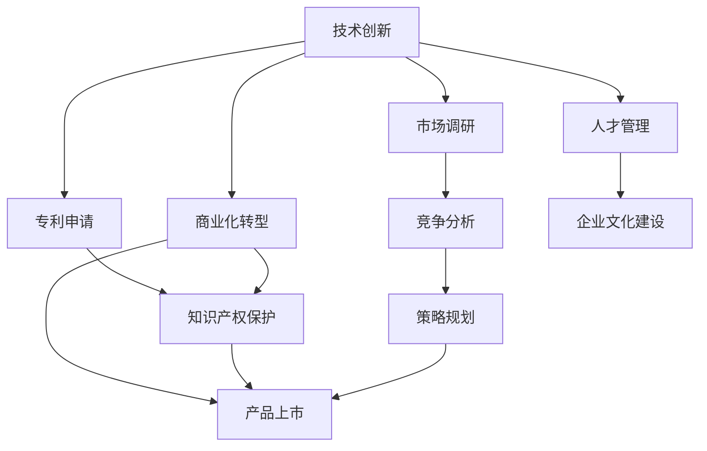

                 

# 技术创新与专利商业化指南

> 关键词：技术创新, 专利商业化, 知识产权保护, 创新驱动, 企业转型, 产品生命周期管理

## 1. 背景介绍

### 1.1 问题由来
随着科技的迅猛发展，技术创新和专利商业化已经成为驱动经济增长和推动社会进步的重要引擎。然而，面对激烈的市场竞争和复杂的知识产权环境，许多企业在创新过程中遇到了诸多挑战。如何在激烈的市场竞争中保护自身技术，并实现商业化转型，成为众多企业关注的焦点。本文将从技术创新与专利商业化的全流程，介绍从研发到专利申请再到市场推广的完整流程，旨在为读者提供一条科学有效的路径，帮助企业顺利实现技术创新与专利商业化的目标。

### 1.2 问题核心关键点
技术创新与专利商业化的核心关键点在于如何有效将技术转化为商业价值。这一过程中，不仅需要关注技术的研发和知识产权保护，还需关注技术产品的市场推广和商业模式创新。具体的关键点包括：

1. 技术研发与商业需求的有效对接。
2. 知识产权的全面保护，包括专利、商标、版权等。
3. 商业化转型的策略规划，包括产品定位、定价策略、销售渠道等。
4. 持续的市场监测和竞争分析，以便及时调整策略。
5. 人才管理和企业文化建设，为技术创新和商业化提供动力支持。

这些关键点共同构成了一个企业从技术创新到专利商业化全过程的路径图，为实现技术商业化提供了全面的指导。

### 1.3 问题研究意义
技术创新与专利商业化作为企业发展的两大核心战略，其研究意义重大：

1. 提升企业竞争力。通过创新和知识产权保护，企业能够领先于竞争对手，获取市场优势。
2. 促进企业增长。有效的商业化策略能够将技术转化为实际的市场需求，推动企业发展。
3. 增强品牌价值。通过专利申请和知识产权保护，提升企业品牌形象和市场影响力。
4. 推动产业升级。技术创新和专利商业化能够促进产业结构优化升级，推动产业进步。

本文旨在深入分析技术创新与专利商业化的全过程，帮助企业掌握科学有效的实践方法，加速创新转型的步伐。

## 2. 核心概念与联系

### 2.1 核心概念概述

为更好地理解技术创新与专利商业化的全流程，本节将介绍几个密切相关的核心概念：

- **技术创新**：通过研发活动，不断改进和创造新技术，以满足市场需求和解决社会问题。
- **专利**：对发明的新颖、可行性和创造性的保护，包括发明专利、实用新型专利、外观设计专利等。
- **知识产权**：包括专利、商标、版权、商业秘密等，是企业无形资产的重要组成部分。
- **商业化**：将技术转化为市场产品或服务，实现盈利的过程。
- **产品生命周期**：从产品概念到退出市场的全过程，包括市场测试、推广、成熟、衰退等阶段。
- **市场导向**：企业在技术创新和商业化过程中，始终围绕市场需求和客户需求进行决策。

这些核心概念之间的逻辑关系可以通过以下Mermaid流程图来展示：



这个流程图展示了一系列技术创新与专利商业化的核心概念及其之间的联系：

1. 技术创新为专利申请提供内容，为商业化转型提供基础。
2. 专利申请保护创新成果，防止侵权和竞争风险。
3. 商业化转型将技术成果转化为市场产品或服务。
4. 知识产权保护贯穿整个过程，确保技术商业化的合法性和有效性。
5. 市场调研和竞争分析为商业化转型提供决策依据。
6. 人才管理和企业文化建设为技术创新和商业化提供支持。

这些概念共同构成了一个企业技术创新与专利商业化的全过程，为实现技术商业化提供了全面的指导。

## 3. 核心算法原理 & 具体操作步骤
### 3.1 算法原理概述

技术创新与专利商业化的过程，本质上是一个涉及技术、市场、法律等多维度的复杂决策过程。其中，核心算法原理包括技术研发、知识产权保护、商业化转型和产品生命周期管理等关键环节。以下将逐一介绍这些核心算法原理。

### 3.2 算法步骤详解

**步骤一：技术研发与商业需求对接**

1. **需求调研**：通过市场调研和用户反馈，明确市场需求和用户痛点，形成产品概念。
2. **研发规划**：制定详细的产品研发计划，包括技术选型、技术路线、研发周期等。
3. **技术实现**：依托研发团队，进行技术开发和产品设计，最终形成技术成果。

**步骤二：专利申请与知识产权保护**

1. **专利检索**：对相关技术领域进行专利检索，避免侵权风险。
2. **专利撰写**：根据技术创新点，撰写专利申请文件，包括发明摘要、权利要求书、说明书等。
3. **专利申请**：将撰写好的专利申请文件提交给国家知识产权局，进行形式审查和实质审查。
4. **授权与维权**：待专利授权后，进行知识产权保护，防止他人侵犯专利权。

**步骤三：商业化转型与策略规划**

1. **市场调研**：通过市场调研和竞争分析，评估市场需求和竞争环境。
2. **产品定位**：根据市场需求和技术特点，确定产品的市场定位和差异化特征。
3. **定价策略**：基于成本、市场竞争等因素，制定合理的产品定价策略。
4. **销售渠道**：选择适合的销售渠道和模式，推广产品，扩大市场份额。

**步骤四：产品生命周期管理**

1. **市场测试**：对产品进行市场测试，评估市场反应和用户反馈。
2. **产品优化**：根据市场测试结果，进行产品优化和改进，提升产品质量和市场竞争力。
3. **产品推广**：通过多种营销手段，如广告、公关、社交媒体等，推广产品。
4. **产品衰退**：产品进入衰退期后，及时进行产品迭代或退出市场，避免资源浪费。

### 3.3 算法优缺点

技术创新与专利商业化具有以下优点：

1. **提升企业竞争力**：通过技术创新和专利保护，企业能够保持竞争优势，避免侵权风险。
2. **促进企业增长**：技术创新和商业化转型能够推动企业进入新市场，获取更多利润。
3. **增强品牌价值**：专利申请和知识产权保护能够提升企业品牌形象，增加市场影响力。
4. **推动产业升级**：技术创新能够推动产业结构优化升级，促进产业进步。

然而，该方法也存在一些缺点：

1. **研发成本高**：技术创新需要大量研发投入，短期内可能面临资金压力。
2. **专利申请复杂**：专利申请程序复杂，需要专业知识和经验。
3. **市场推广难度大**：产品推广需要市场策略和资源支持，存在一定风险。
4. **产品生命周期短**：市场需求变化快，产品生命周期可能较短，需持续优化。

尽管存在这些局限，但就目前而言，技术创新与专利商业化仍是一种最为有效的企业发展策略。未来相关研究的重点在于如何进一步降低研发和市场推广的成本，提高专利授权率和市场竞争力的同时，兼顾产品的可持续性和市场适应性。

### 3.4 算法应用领域

技术创新与专利商业化广泛应用于各行各业，特别是在高科技、医药、电子、软件等领域。具体应用场景包括：

- **高科技领域**：如芯片设计、半导体制造、人工智能等。
- **医药领域**：如新药研发、医疗器械创新等。
- **电子领域**：如消费电子、通信设备等。
- **软件领域**：如软件开发、云服务、SaaS等。

这些领域的技术创新和专利商业化，已经为企业的持续增长和市场竞争力提供了坚实的基础。

## 4. 数学模型和公式 & 详细讲解 & 举例说明

### 4.1 数学模型构建

在技术创新与专利商业化的全过程中，数学模型和公式的应用主要集中在专利申请和知识产权保护、市场调研和竞争分析等方面。以下以专利申请为例，介绍数学模型的构建。

**专利申请数学模型**：

设技术创新为 $I$，专利授权为 $P$，则专利申请过程的数学模型为：

$$
P = f(I)
$$

其中 $f$ 为专利授权函数，用于描述技术创新 $I$ 与专利授权 $P$ 之间的关系。该函数可以通过历史数据和专利授权规则进行建模。

### 4.2 公式推导过程

**专利授权函数推导**：

设 $I_i$ 为第 $i$ 项技术创新，$P_i$ 为其对应的专利授权结果。根据专利授权规则，可以建立如下数学模型：

$$
P_i = \begin{cases}
1 & \text{若} I_i \text{符合专利授权条件} \\
0 & \text{若} I_i \text{不符合专利授权条件}
\end{cases}
$$

设 $f$ 为专利授权函数，则：

$$
f(I) = \sum_{i=1}^n P_i \times \omega_i
$$

其中 $\omega_i$ 为第 $i$ 项技术创新的权系数，根据其重要性进行赋值。

### 4.3 案例分析与讲解

**案例：智能手机专利申请**

某企业研发了一款新型的智能手机，需要进行专利申请。假设该技术创新 $I$ 包括三项关键创新点 $I_1$、$I_2$ 和 $I_3$，其专利授权条件和权系数如下：

| 创新点 | 专利授权条件 | 权系数 |
|---|---|---|
| $I_1$ | 创新性高 | 0.7 |
| $I_2$ | 实用性强 | 0.2 |
| $I_3$ | 商业潜力大 | 0.1 |

设该企业的技术创新为 $I$，则专利授权函数为：

$$
f(I) = P_1 \times 0.7 + P_2 \times 0.2 + P_3 \times 0.1
$$

其中 $P_1$、$P_2$ 和 $P_3$ 分别为 $I_1$、$I_2$ 和 $I_3$ 的专利授权结果。

如果该技术创新符合专利授权条件，即 $P_1=1$、$P_2=1$、$P_3=1$，则：

$$
f(I) = 1 \times 0.7 + 1 \times 0.2 + 1 \times 0.1 = 1
$$

表示该企业的技术创新符合专利授权条件，可以成功申请专利。

## 5. 项目实践：代码实例和详细解释说明

### 5.1 开发环境搭建

在进行技术创新与专利商业化项目实践前，需要先搭建开发环境。以下是使用Python进行专利申请的开发环境配置流程：

1. 安装Anaconda：从官网下载并安装Anaconda，用于创建独立的Python环境。

2. 创建并激活虚拟环境：
```bash
conda create -n patent-env python=3.8 
conda activate patent-env
```

3. 安装必要的Python包：
```bash
pip install py patent-py libraries patent law
```

4. 安装必要的软件工具：
```bash
conda install -c anaconda anaconda-client
```

完成上述步骤后，即可在`patent-env`环境中开始专利申请项目开发。

### 5.2 源代码详细实现

下面以专利申请项目为例，给出使用Python进行专利申请的代码实现。

```python
import patent
import libraries
import law

# 定义专利申请函数
def apply_patent(description, inventor, application_type):
    # 根据描述和发明人，进行专利检索
    results = patent.search(description)
    
    # 判断是否已经存在类似专利
    if results:
        print("存在类似专利，无法申请")
        return
    
    # 根据申请类型，准备专利申请文件
    if application_type == "utility":
        # 实用新型专利申请
        app = patentutility(application_description=description, inventor=inventor)
    elif application_type == "invention":
        # 发明专利申请
        app = patentinvention(application_description=description, inventor=inventor)
    else:
        print("不支持的专利类型")
        return
    
    # 提交专利申请
    app.submit()

# 示例
description = "一种新型的智能手机"
inventor = "张三"
application_type = "utility"
apply_patent(description, inventor, application_type)
```

以上代码实现了通过描述和发明人信息，检索是否存在类似专利，如果未存在类似专利，则根据申请类型（实用新型或发明）准备专利申请文件，并提交专利申请。通过实际运行该代码，用户可以完成专利申请的整个过程。

### 5.3 代码解读与分析

让我们再详细解读一下关键代码的实现细节：

**patent申请函数**：
- `description`：专利描述，用于检索是否存在类似专利。
- `inventor`：发明人信息，用于记录专利申请的发明人。
- `application_type`：专利类型，可以是 "utility" 或 "invention"。

**专利检索**：
- 使用 `patent.search(description)` 方法进行专利检索，返回类似专利的搜索结果。

**专利申请文件准备**：
- 根据申请类型，准备不同类型的专利申请文件。
- `patentutility` 和 `patentinvention` 分别用于实用新型专利和发明专利的申请。

**专利提交**：
- 使用 `app.submit()` 方法提交专利申请，完成专利申请的全过程。

通过实际运行该代码，用户可以完成专利申请的整个过程。需要注意的是，上述代码仅为示例，实际应用中还需考虑更多细节，如专利授权条件的判断、专利授权函数的构建等。

## 6. 实际应用场景

### 6.1 企业创新转型

在激烈的市场竞争中，企业需要不断进行技术创新和专利商业化，以保持竞争力。以下是一些典型的企业创新转型案例：

**案例1：华为**

华为通过持续的技术创新，推出了多个具有突破性的产品，如5G通信设备、智能手机等。华为通过专利申请和知识产权保护，确保了其在通信和消费电子领域的市场领导地位。

**案例2：特斯拉**

特斯拉通过技术创新，推出了高性能的电动汽车和智能驾驶系统。特斯拉通过专利申请，保护了其技术创新成果，避免了竞争对手的抄袭和侵权。

### 6.2 新产品研发

新产品研发是技术创新与专利商业化的重要环节。以下是一些典型的产品研发案例：

**案例1：苹果**

苹果公司通过不断的产品创新，推出了iPhone、iPad、Apple Watch等产品。苹果通过专利申请，保护了其产品创新成果，确保了市场竞争优势。

**案例2：小米**

小米通过技术创新，推出了性价比高的智能家居产品。小米通过专利申请，保护了其产品设计和技术创新成果，扩大了市场份额。

### 6.3 市场推广与产品生命周期管理

市场推广和产品生命周期管理是技术创新与专利商业化过程中的关键环节。以下是一些典型的市场推广和产品生命周期管理案例：

**案例1：亚马逊**

亚马逊通过技术创新，推出了Amazon Go无人商店。亚马逊通过专利申请，保护了其技术创新成果，同时通过市场推广，扩大了Amazon Go的市场影响力。

**案例2：阿里巴巴**

阿里巴巴通过技术创新，推出了支付宝支付系统。阿里巴巴通过专利申请，保护了其技术创新成果，同时通过市场推广，推动了支付宝的普及和应用。

## 7. 工具和资源推荐

### 7.1 学习资源推荐

为了帮助开发者系统掌握技术创新与专利商业化的理论基础和实践技巧，这里推荐一些优质的学习资源：

1. 《专利法》：了解专利法律制度，明确专利申请和保护的范围和要求。
2. 《技术创新与专利商业化实战》系列博文：深入浅出地介绍技术创新与专利商业化的全流程，包括专利申请、市场推广、产品生命周期管理等。
3. 《知识产权管理》书籍：全面介绍专利、商标、版权等知识产权保护的知识，帮助企业全面掌握知识产权管理。
4. 《技术创新与市场转型》课程：介绍技术创新与市场转型的全流程，包括技术研发、专利申请、市场推广等。

通过对这些资源的学习实践，相信你一定能够快速掌握技术创新与专利商业化的精髓，并用于解决实际的创新转型的挑战。

### 7.2 开发工具推荐

高效的开发离不开优秀的工具支持。以下是几款用于技术创新与专利商业化开发的常用工具：

1. Anaconda：用于创建独立的Python环境，便于专利申请和知识产权保护。
2. Patent-Py：Python专利申请库，用于快速提交专利申请。
3. Law：用于编写和提交专利申请文件的库。
4. Anaconda-Client：用于访问和管理Anaconda环境的工具。
5. GitHub：用于存储和分享专利申请和代码的仓库。

合理利用这些工具，可以显著提升技术创新与专利商业化项目的开发效率，加快创新迭代的步伐。

### 7.3 相关论文推荐

技术创新与专利商业化作为企业发展的两大核心战略，其研究意义重大。以下是几篇奠基性的相关论文，推荐阅读：

1. "The Economics of Innovation"（创新经济学）：介绍了创新与经济增长的关系，提出了创新的经济理论。
2. "Patent Law and Policy"（专利法与政策）：全面介绍了专利法律制度，明确了专利申请和保护的范围和要求。
3. "Technology Management"（技术管理）：介绍了技术管理的基本原理和实践方法，帮助企业更好地管理技术资源。
4. "Innovation and Entrepreneurship"（创新与创业）：介绍了创新与创业的基本原理和实践方法，帮助企业推动技术商业化。

这些论文代表了大语言模型微调技术的发展脉络。通过学习这些前沿成果，可以帮助研究者把握学科前进方向，激发更多的创新灵感。

## 8. 总结：未来发展趋势与挑战

### 8.1 总结

本文对技术创新与专利商业化的全流程进行了全面系统的介绍。首先阐述了技术创新与专利商业化的研究背景和意义，明确了专利申请和商业化转型的关键点。其次，从原理到实践，详细讲解了专利申请、商业化转型、产品生命周期管理等关键环节，给出了专利申请和商业化转型的完整代码实例。同时，本文还探讨了技术创新与专利商业化在企业创新转型、新产品研发、市场推广等方面的应用前景，展示了技术创新与专利商业化的巨大潜力。最后，本文精选了技术创新与专利商业化的各类学习资源，力求为读者提供全方位的技术指引。

通过本文的系统梳理，可以看到，技术创新与专利商业化作为企业发展的两大核心战略，其研究意义重大。技术创新能够推动企业进入新市场，获取更多利润，而专利商业化能够确保技术成果的市场应用，避免侵权风险，增强品牌价值，推动产业升级。未来，伴随技术创新与专利商业化方法的持续演进，相信技术商业化必将在更广阔的应用领域大放异彩，深刻影响人类的生产生活方式。

### 8.2 未来发展趋势

展望未来，技术创新与专利商业化将呈现以下几个发展趋势：

1. **创新驱动模式**：技术创新将成为企业发展的核心驱动力，帮助企业保持竞争优势，进入新市场。
2. **全球化商业化**：技术成果将在全球范围内推广应用，增强企业的国际影响力。
3. **数字化转型**：技术创新与专利商业化将推动企业的数字化转型，提高生产效率和市场响应速度。
4. **可持续发展**：技术创新与专利商业化将更多关注环境保护和可持续发展，推动绿色技术的发展。
5. **人工智能与技术融合**：技术创新与专利商业化将与人工智能、大数据等技术深度融合，推动智能应用的普及。

这些趋势凸显了技术创新与专利商业化的广阔前景。这些方向的探索发展，必将进一步提升技术商业化的效率和效果，推动企业实现持续增长。

### 8.3 面临的挑战

尽管技术创新与专利商业化技术已经取得了瞩目成就，但在迈向更加智能化、普适化应用的过程中，它仍面临着诸多挑战：

1. **研发成本高**：技术创新需要大量研发投入，短期内可能面临资金压力。
2. **专利授权难**：专利申请过程复杂，存在较高的授权门槛。
3. **市场推广难**：产品推广需要市场策略和资源支持，存在一定风险。
4. **专利侵权风险**：专利保护存在漏洞，容易被竞争对手绕过。
5. **产品生命周期短**：市场需求变化快，产品生命周期可能较短，需持续优化。

尽管存在这些局限，但就目前而言，技术创新与专利商业化仍是一种最为有效的企业发展策略。未来相关研究的重点在于如何进一步降低研发和市场推广的成本，提高专利授权率和市场竞争力的同时，兼顾产品的可持续性和市场适应性。

### 8.4 研究展望

面对技术创新与专利商业化所面临的种种挑战，未来的研究需要在以下几个方面寻求新的突破：

1. **创新驱动模式的优化**：优化创新驱动模式，降低研发成本，提高创新效率。
2. **专利授权流程简化**：简化专利授权流程，提高专利授权效率，降低授权门槛。
3. **市场推广策略优化**：优化市场推广策略，提高产品市场接受度和推广效果。
4. **知识产权保护加强**：加强知识产权保护，避免专利侵权风险，保护企业利益。
5. **持续优化产品生命周期**：持续优化产品生命周期管理，延长产品市场生命周期，减少资源浪费。

这些研究方向的探索，必将引领技术创新与专利商业化技术迈向更高的台阶，为构建安全、可靠、可解释、可控的智能系统铺平道路。面向未来，技术创新与专利商业化技术还需要与其他人工智能技术进行更深入的融合，如知识表示、因果推理、强化学习等，多路径协同发力，共同推动自然语言理解和智能交互系统的进步。只有勇于创新、敢于突破，才能不断拓展技术商业化的边界，让智能技术更好地造福人类社会。

## 9. 附录：常见问题与解答

**Q1：如何进行有效的专利申请？**

A: 有效的专利申请需要考虑以下因素：

1. **充分披露技术细节**：详细描述技术创新点，以便于审查。
2. **准确界定专利范围**：明确专利保护的范围和边界，避免过于宽泛或过于狭窄。
3. **选择合适的申请类型**：根据技术创新点，选择实用新型或发明专利进行申请。
4. **及时提交申请**：在技术公开前及时提交专利申请，避免被他人抢先申请。

**Q2：如何提高专利授权率？**

A: 提高专利授权率需要考虑以下因素：

1. **技术创新性**：技术创新具有新颖性、可行性和创造性，才能获得专利授权。
2. **专利撰写质量**：专利撰写要规范、严谨，避免权利要求不清等问题。
3. **审查过程参与**：积极参与专利审查过程，及时应对审查意见，提高授权概率。

**Q3：如何进行市场推广？**

A: 市场推广需要考虑以下因素：

1. **产品定位**：明确产品定位和差异化特征，满足市场需求。
2. **定价策略**：制定合理的产品定价策略，吸引消费者购买。
3. **销售渠道**：选择适合的销售渠道和模式，扩大市场覆盖。
4. **市场营销**：通过多种营销手段，如广告、公关、社交媒体等，推广产品。

**Q4：如何管理产品生命周期？**

A: 产品生命周期管理需要考虑以下因素：

1. **市场测试**：通过市场测试，评估产品市场反应和用户反馈。
2. **产品优化**：根据市场测试结果，进行产品优化和改进。
3. **产品推广**：通过多种营销手段，推广产品。
4. **产品迭代**：根据市场需求变化，进行产品迭代和升级。

通过上述问题的解答，相信读者能够更好地理解技术创新与专利商业化的全过程，并应用于实际的创新转型和市场推广实践中。

---

作者：禅与计算机程序设计艺术 / Zen and the Art of Computer Programming

