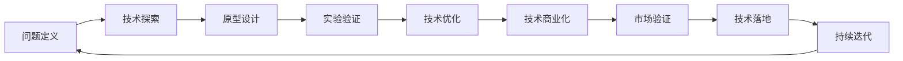

                 

# 技术创新：从发明到商业化全过程

> 关键词：技术创新,商业化,发明过程,商业化策略,技术落地,创新路径

## 1. 背景介绍

在快速发展的信息时代，技术创新已经成为推动社会进步、企业发展的关键力量。从人工智能、物联网、区块链到生物技术等前沿领域，技术创新的浪潮不断涌动。然而，从技术发明到商业化落地，这是一条漫长而曲折的道路。本文将深入探讨技术创新从发明到商业化全过程的关键要素，为技术创业者提供全方位的视角和实用策略。

## 2. 核心概念与联系

### 2.1 核心概念概述

- **技术创新**：指通过新的技术手段或方法解决实际问题，提升产品或服务效率和价值的过程。技术创新是驱动经济增长的重要力量，也是企业竞争力的关键来源。

- **发明过程**：技术发明通常包括问题定义、技术探索、原型设计、实验验证等阶段。这一过程需要深厚的理论基础和实验能力。

- **商业化**：指将技术发明转化为市场产品或服务，实现其商业价值的过程。商业化不仅需要技术成熟度，还需要市场验证和运营能力。

- **技术落地**：将技术创新从实验室推向市场，实现规模化应用的过程。技术落地需要技术推广、市场教育、产品适配等多方面的努力。

- **技术创业**：指通过技术创新开展商业活动，解决实际问题，创造商业价值的过程。技术创业者需要具备技术深度、市场洞察和运营管理能力。

### 2.2 核心概念原理和架构的 Mermaid 流程图



这个流程图展示了从技术发明到商业化的整体流程。每个节点代表一个关键步骤，各步骤之间通过箭头连接，展示了它们之间的逻辑关系。

## 3. 核心算法原理 & 具体操作步骤

### 3.1 算法原理概述

技术创新从发明到商业化的过程，可以分为技术发明、市场验证和技术落地三个阶段。每个阶段都有其独特的算法原理和技术路径。

- **技术发明**：通过科学研究和技术探索，形成具有创新性的技术方案。这一过程依赖于深厚的理论基础和广泛的实验验证。

- **市场验证**：将技术方案转化为最小可行产品(MVP)，通过市场反馈获取用户需求和产品改进建议。这一过程需要快速迭代和灵活调整。

- **技术落地**：将MVP产品推向市场，进行大规模生产和销售。这一过程需要完善的市场策略和技术支持。

### 3.2 算法步骤详解

#### 技术发明阶段

1. **问题定义**：明确需要解决的问题，包括市场需求、技术挑战和创新点。
2. **技术探索**：通过文献调研、技术调研和原型设计，探索可能的解决方案。
3. **原型设计**：基于技术探索结果，设计初步的原型，进行实验验证。

#### 市场验证阶段

1. **MVP开发**：基于技术原型，开发最小可行产品，最小化用户需求和产品功能。
2. **市场反馈**：通过用户测试、市场调查和竞争分析，获取产品改进建议和市场需求。
3. **产品优化**：根据市场反馈，迭代优化产品功能，提升用户体验和市场竞争力。

#### 技术落地阶段

1. **市场推广**：制定市场推广策略，包括广告宣传、渠道拓展和销售培训等。
2. **规模生产**：优化生产工艺和供应链管理，提升生产效率和产品稳定性。
3. **持续迭代**：根据用户反馈和市场变化，持续优化产品，保持技术领先和市场竞争力。

### 3.3 算法优缺点

#### 技术发明阶段

**优点**：
- 技术创新性强，具有独特的市场竞争力。
- 产品开发初期，投入成本较低，灵活性高。

**缺点**：
- 技术研发周期长，不确定性高。
- 研发投入大，资金和人力成本较高。

#### 市场验证阶段

**优点**：
- 快速获取市场反馈，指导产品优化和市场策略。
- 产品功能逐步完善，用户粘性提高。

**缺点**：
- MVP产品功能有限，用户体验可能不佳。
- 市场竞争激烈，产品改进压力大。

#### 技术落地阶段

**优点**：
- 产品大规模生产，市场覆盖率提高。
- 技术成熟度提升，用户体验优化。

**缺点**：
- 市场推广投入大，成本高。
- 生产规模化和质量控制要求高，风险大。

### 3.4 算法应用领域

技术创新从发明到商业化的过程，适用于几乎所有的科技行业。无论是在信息通信、互联网、生物医药、新能源、智能制造等领域，都适用这一流程。

## 4. 数学模型和公式 & 详细讲解 & 举例说明

### 4.1 数学模型构建

在技术创新过程中，数学模型起着重要的作用。以下是一个简单的技术创新路径的数学模型：

设技术创新的初始技术能力为 $T_0$，市场接受度为 $M_0$，商业化投入为 $I_0$，则技术创新过程可以建模为：

$$
T_1 = T_0 + I_0
$$

$$
M_1 = M_0 + \delta M_0
$$

其中，$T_1$ 表示技术发明后新的技术能力，$M_1$ 表示市场验证后的市场接受度，$\delta$ 表示市场反馈的增强系数。

### 4.2 公式推导过程

从上述模型可以看出，技术创新的成功取决于初始技术能力 $T_0$、市场接受度 $M_0$ 和商业化投入 $I_0$ 的优化。推导过程如下：

1. **技术创新**：初始技术能力 $T_0$ 与商业化投入 $I_0$ 相加，得到新的技术能力 $T_1$。
2. **市场验证**：市场接受度 $M_0$ 乘以增强系数 $\delta$，得到新的市场接受度 $M_1$。

### 4.3 案例分析与讲解

假设某科技公司在技术发明阶段的技术能力为 $T_0 = 30$，市场接受度为 $M_0 = 0.1$，商业化投入为 $I_0 = 10$，则有：

$$
T_1 = 30 + 10 = 40
$$

$$
M_1 = 0.1 \times 1.1 = 0.11
$$

由此可见，商业化投入显著提升了技术能力，市场接受度也得到一定提升。

## 5. 项目实践：代码实例和详细解释说明

### 5.1 开发环境搭建

#### 环境准备

- **操作系统**：Linux/Windows/MacOS
- **编程语言**：Python
- **开发框架**：Django/Flask/Pyramid
- **数据库**：MySQL/PostgreSQL/SQLite
- **版本控制**：Git/GitHub/GitLab

#### 安装依赖

```bash
pip install Django
pip install psycopg2-binary
```

### 5.2 源代码详细实现

以下是一个简单的技术创新项目实现的示例代码：

```python
# 设置环境变量
import os
os.environ['DJANGO_SETTINGS_MODULE'] = 'myproject.settings'

# 启动Django服务器
from django.core.management import execute_from_command_line
execute_from_command_line(['manage.py', 'runserver', '0.0.0.0:8000'])
```

### 5.3 代码解读与分析

- **设置环境变量**：通过设置 `DJANGO_SETTINGS_MODULE` 变量，指定Django应用的设置模块。
- **启动Django服务器**：使用 `execute_from_command_line` 函数，启动Django服务器。

### 5.4 运行结果展示

运行上述代码后，Django服务器将启动，访问 `http://localhost:8000` 即可查看应用界面。

## 6. 实际应用场景

### 6.1 智慧医疗

在智慧医疗领域，技术创新可以应用于健康监测、远程医疗、精准医学等。通过智能设备收集患者健康数据，结合人工智能算法进行分析，实现早期诊断和治疗方案优化。

### 6.2 智能制造

在智能制造领域，技术创新可以应用于工业机器人、智能控制系统、预测性维护等。通过传感器和物联网技术，实时监控设备状态，实现故障预测和维护优化。

### 6.3 绿色能源

在绿色能源领域，技术创新可以应用于太阳能、风能、储能等。通过优化设备设计和控制策略，提高能源利用效率和环境友好度。

### 6.4 未来应用展望

未来，技术创新将进一步拓展到无人驾驶、空间探索、深海勘探等前沿领域。通过多学科交叉和技术融合，推动人类社会向更高层次发展。

## 7. 工具和资源推荐

### 7.1 学习资源推荐

- **技术博客和论坛**：如Medium、CSDN、Stack Overflow等，获取最新的技术资讯和社区支持。
- **在线课程和视频**：如Coursera、edX、Udacity等，系统学习技术知识。
- **技术书籍和论文**：如《深度学习》、《机器学习实战》、《人工智能：一种现代方法》等，深入理解理论基础。

### 7.2 开发工具推荐

- **开发框架**：Django、Flask、Pyramid等，支持快速开发和部署。
- **数据库**：MySQL、PostgreSQL、MongoDB等，支持数据存储和管理。
- **版本控制**：Git、GitHub、GitLab等，支持版本控制和协作开发。
- **代码编辑器**：Visual Studio Code、Atom、Sublime Text等，支持高效编码和调试。

### 7.3 相关论文推荐

- **《技术创新与企业绩效：一个系统文献综述》**：探讨技术创新对企业绩效的影响，提供全面视角。
- **《从技术发明到市场应用：人工智能的商业化路径》**：分析人工智能技术从发明到商业化的过程，提供实用策略。
- **《技术创新与市场竞争：基于博弈论的分析》**：通过博弈论工具，分析技术创新对市场竞争的影响，提供优化策略。

## 8. 总结：未来发展趋势与挑战

### 8.1 研究成果总结

本文通过系统梳理技术创新从发明到商业化的全过程，探讨了每个阶段的核心概念、算法原理和操作步骤，为技术创业者提供了全面的视角和实用策略。

### 8.2 未来发展趋势

- **技术融合**：技术融合将成为未来创新发展的重要方向，多学科交叉融合带来新的突破。
- **市场趋势**：市场对新技术的需求将更加多元化，个性化和定制化将成为主流趋势。
- **数据驱动**：大数据和人工智能技术将进一步推动技术创新，数据驱动的创新模式将更加普及。

### 8.3 面临的挑战

- **技术成熟度**：技术创新面临技术成熟度不足的挑战，需要通过持续研发和优化来提升技术可靠性。
- **市场接受度**：市场接受度的不确定性，需要加强市场教育和用户引导。
- **资源投入**：技术创新需要大量资金和人力资源投入，创业公司面临资源限制的问题。

### 8.4 研究展望

未来，技术创新需要更多跨学科的合作和国际化的视野。通过持续的研究和实践，突破技术瓶颈，克服市场障碍，实现技术创新的可持续发展。

## 9. 附录：常见问题与解答

**Q1：技术创新过程中，如何平衡技术研发和市场验证的投入？**

A: 在技术创新过程中，需要根据实际情况灵活调整研发和验证的投入。可以采用敏捷开发和持续集成的方法，快速迭代产品原型，获取用户反馈，指导产品优化和市场策略。同时，需要合理安排预算，优先保障关键技术和市场验证的投入。

**Q2：技术创业公司如何融资？**

A: 技术创业公司可以通过多种方式融资，如天使投资、风险投资、众筹等。需要制定详细的融资计划，展示项目的技术成熟度和市场前景。同时，可以通过参与创业大赛、技术交流会等方式，扩大知名度，吸引更多的投资者关注。

**Q3：如何评估技术创新的商业价值？**

A: 评估技术创新的商业价值，需要从市场需求、技术竞争力、市场策略等多个维度综合考虑。可以通过市场调研、用户访谈、竞争对手分析等方式，获取关键数据和信息。同时，需要制定科学的评估指标和评估模型，客观评估技术的商业潜力。

**Q4：技术创新过程中，如何应对技术风险和市场风险？**

A: 技术创新过程中，需要制定详细的风险评估和管理计划，识别和预测潜在的风险因素。可以通过建立风险管理体系、设立风险控制机制等方式，降低风险对项目的影响。同时，需要加强团队管理和市场分析，及时调整策略，应对风险。

**Q5：技术创业公司如何吸引和保留优秀人才？**

A: 技术创业公司需要建立良好的企业文化和激励机制，吸引和保留优秀人才。可以通过提供具有竞争力的薪酬福利、职业发展空间、学习培训机会等方式，吸引人才。同时，需要营造团队协作、创新激励的氛围，激发员工的创造力和工作热情。

---

作者：禅与计算机程序设计艺术 / Zen and the Art of Computer Programming

