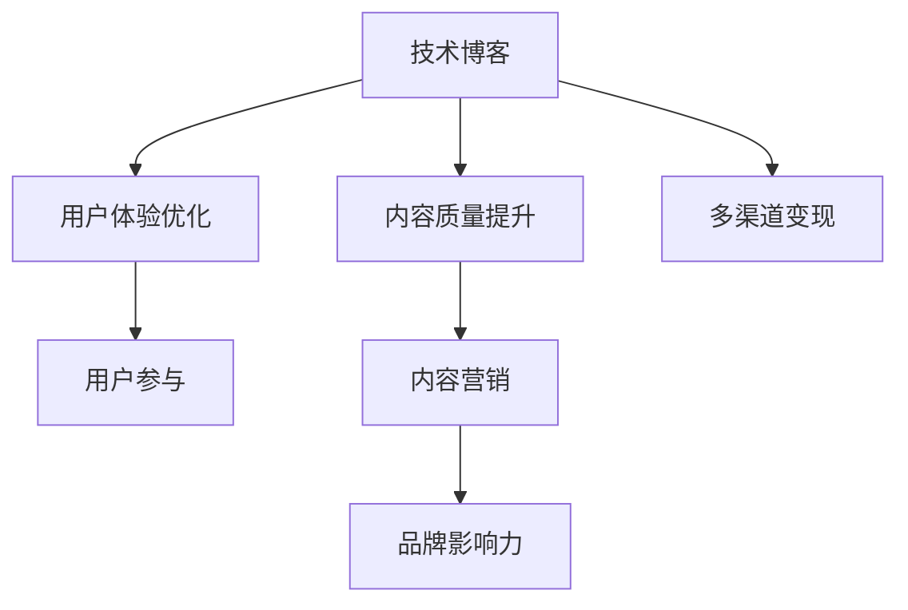

                 

# 技术博客变现：策略与方法

## 1. 背景介绍

### 1.1 问题由来

随着互联网的普及，越来越多的人开始利用网络平台进行知识分享和传播，技术博客作为其中的一环，日益成为技术开发者、研究人员以及行业专家展示思想、交流经验的重要渠道。然而，仅仅依靠写作和传播并不能带来直接的经济收益，如何在技术博客中获得变现，成为众多内容创作者面临的重要问题。

本文将探讨技术博客变现的策略与方法，帮助博客作者实现内容与货币的双重收益。通过深入分析市场需求、用户行为以及内容产出策略，为技术博客变现提供系统的解决方案。

### 1.2 问题核心关键点

技术博客变现的核心在于提升内容质量和吸引力，同时利用各类变现模式实现收入。其关键点包括：
- 提升内容质量：增加文章深度、实用性与创意性。
- 优化用户体验：提高文章可读性、交互性与传播性。
- 多渠道变现：通过广告、赞助、会员订阅、付费文章等多种模式获得收入。

## 2. 核心概念与联系

### 2.1 核心概念概述

为更好地理解技术博客变现策略，本文将介绍几个密切相关的核心概念：

- 技术博客（Technical Blogging）：以技术为主题的博客，涉及软件开发、人工智能、机器学习、云计算等领域的知识分享。
- 变现（Monetization）：通过各种方式将博客内容转换为货币收入的过程，包括广告、赞助、会员订阅等。
- 多渠道变现（Multi-Channel Monetization）：利用多种渠道和模式，实现博客内容的商业化运作。
- 用户参与（User Engagement）：通过互动、评论、分享等方式，提升用户对博客的参与度和忠诚度。
- 内容营销（Content Marketing）：利用博客内容进行品牌宣传和用户吸引，建立品牌影响力。

这些概念之间的逻辑关系可以通过以下Mermaid流程图来展示：



这个流程图展示出技术博客变现的逻辑关系：通过提升内容质量、优化用户体验、实现多渠道变现，增强用户参与度，并最终通过内容营销建立品牌影响力。

## 3. 核心算法原理 & 具体操作步骤

### 3.1 算法原理概述

技术博客变现的核心在于如何利用博客内容吸引和转化用户，从而实现商业化。本文将从内容质量提升、用户体验优化、多渠道变现三个方面，介绍其算法原理与具体操作步骤。

### 3.2 算法步骤详解

#### 3.2.1 内容质量提升

- **选题与规划**：选择受众感兴趣的热门话题，进行深入研究与规划，确保文章内容具备高度的相关性和实用性。
- **深度分析与撰写**：通过查阅文献、调研市场、访谈专家等方式，获取丰富的数据与信息，进行深度分析和撰写。
- **定期更新与迭代**：持续关注行业动态，定期更新博客内容，保持内容的时效性和前瞻性。

#### 3.2.2 用户体验优化

- **文章排版与设计**：优化文章标题、副标题、图片、代码块等排版元素，提升文章的易读性。
- **交互式元素**：增加互动评论、问答、小游戏等功能，提升用户参与度和粘性。
- **SEO优化**：利用关键词优化、内部链接、外部链接等手段，提升博客的搜索引擎排名，增加流量。

#### 3.2.3 多渠道变现

- **广告与联盟营销**：通过博客内嵌广告、加入联盟计划，获得点击与展示收入。
- **赞助与合作**：与企业或品牌合作，获得赞助费用或产品置换。
- **会员订阅与付费文章**：建立会员系统，提供付费文章、电子书等增值服务。
- **知识付费平台**：在知识付费平台（如知识星球、知乎live等）开设专栏或直播，获取收入。

### 3.3 算法优缺点

技术博客变现策略的主要优点包括：
- **灵活性高**：多种变现模式可以结合使用，适应不同的运营需求和市场环境。
- **高收益潜力**：通过精准的内容定位和有效的营销手段，可以实现较高的商业回报。
- **提升品牌影响力**：通过高质量内容与互动，建立品牌声誉，吸引更多潜在用户。

然而，这些策略也存在一些缺点：
- **需要持续投入**：内容创作、用户体验优化、广告投放等都需要持续的精力与资金投入。
- **市场竞争激烈**：技术博客市场竞争激烈，需要不断创新和优化才能保持竞争力。
- **依赖用户参与**：高度依赖用户的积极反馈与参与，如果用户流失，博客变现效果将大打折扣。

### 3.4 算法应用领域

技术博客变现策略在多个领域都有广泛的应用，例如：
- 技术开发与研究：博客作者通过分享技术栈、研究心得，提升影响力，吸引赞助与合作。
- 产品推广与市场分析：企业通过技术博客进行产品宣传和市场调研，建立用户口碑。
- 教育与培训：教育机构通过博客分享课程内容，吸引学员报名，实现变现。
- 开源与社区建设：开源项目维护者通过博客分享项目进展与代码示例，增加社区活跃度，吸引捐赠与赞助。

## 4. 数学模型和公式 & 详细讲解 & 举例说明

### 4.1 数学模型构建

在技术博客变现中，虽然不涉及复杂的数学模型，但可以通过一些简单的量化指标来衡量变现效果。例如，点击率（CTR）、转化率（CVR）、订阅用户增长率等。

### 4.2 公式推导过程

假设博客每篇文章的点击次数为 $C$，平均停留时间为 $T$，点击转化率为 $CR$，订阅用户增长率为 $G$。则总点击收益为 $R_C = C \times CR \times \text{广告费用}$，总订阅收益为 $R_S = U \times G \times \text{订阅价格}$，其中 $U$ 为初始订阅用户数。

### 4.3 案例分析与讲解

以一个技术博客为例，该博客每月发布5篇文章，每篇文章平均点击次数为1000，平均停留时间为10分钟，点击转化率为5%，订阅价格为9.9元/月。博客每月新增订阅用户数量为1000人，初始订阅用户数为1000人。则每月总点击收益为 $R_C = 5 \times 1000 \times 5\% \times 10 = 2500$ 元，总订阅收益为 $R_S = 1000 \times 1000 \times 5\% \times 9.9 = 4950$ 元。

## 5. 项目实践：代码实例和详细解释说明

### 5.1 开发环境搭建

技术博客变现的实现依赖于多个工具和平台，以下是主要的开发环境搭建流程：

1. **选择博客平台**：选择适合自己风格和需求的博客平台，如WordPress、GitHub Pages等。
2. **安装开发工具**：安装文本编辑器、版本控制工具、Markdown编辑器等。
3. **搭建服务器环境**：根据博客平台需求，配置服务器环境，确保网站运行稳定。
4. **安装插件与工具**：安装SEO优化、广告管理等插件，提升博客功能。

### 5.2 源代码详细实现

以下是一个简单的博客广告代码示例：

```html
<div id="ad-container"></div>

<script>
    // 加载广告代码
    var adCode = document.getElementById('ad-container');
    adCode.innerHTML = '<script async src="https://your-ad-server.com/ad.js"></script>';
</script>
```

### 5.3 代码解读与分析

在代码示例中，我们通过在文章末尾嵌入广告代码，实现对广告的展示与点击。广告服务器会根据文章的访问次数、停留时间等指标，计算广告费用，并根据点击率支付收益。

### 5.4 运行结果展示

广告代码嵌入后，读者在浏览文章时，会自动加载广告，并根据广告点击情况获得收益。

## 6. 实际应用场景

### 6.1 技术公司内训

技术博客可以成为公司内部培训的重要渠道，通过分享内部技术栈、最佳实践、项目案例等内容，提升员工技能，增强团队凝聚力。

### 6.2 开源社区宣传

开源项目维护者可以通过技术博客分享项目进展、代码示例、社区活动等内容，吸引更多开发者参与，推动项目发展。

### 6.3 创业公司品牌建设

创业公司可以通过技术博客展示技术实力、市场定位、创始团队等内容，提升品牌知名度和影响力，吸引潜在投资和用户。

### 6.4 未来应用展望

未来，技术博客变现将更加注重内容的多样化和个性化，通过视频、直播、互动问答等形式，提升用户体验和参与度，实现更广泛的变现渠道。

## 7. 工具和资源推荐

### 7.1 学习资源推荐

- **Google Analytics**：用于博客流量分析，优化内容策略。
- **Medium**：学习优秀的博客排版和内容风格，提升博客吸引力。
- **Content Marketing Institute**：提供最新的内容营销趋势和策略。
- **Coursera**：学习SEO、广告投放等技能，提升博客变现能力。

### 7.2 开发工具推荐

- **WordPress**：流行的博客平台，支持丰富的插件和主题。
- **GitHub Pages**：免费的博客托管服务，支持静态网站生成。
- **Google AdSense**：提供广告管理工具，实现流量变现。
- **Mailchimp**：提供邮件订阅和营销工具，提升会员订阅效果。

### 7.3 相关论文推荐

- **"内容营销的未来：如何利用社交媒体和内容营销策略提升品牌影响力"**：探讨内容营销的未来趋势和策略。
- **"技术博客的流量变现：一种数据分析与策略优化方法"**：利用数据分析提升博客变现效果。
- **"开源项目的社区驱动：如何通过技术博客吸引开发者"**：分享开源项目的技术博客建设经验。

## 8. 总结：未来发展趋势与挑战

### 8.1 研究成果总结

本文系统介绍了技术博客变现的策略与方法，从内容质量提升、用户体验优化、多渠道变现三个方面，详细讲解了变现的技术实现与操作流程。通过案例分析和实际代码示例，帮助读者掌握博客变现的关键技术点。

### 8.2 未来发展趋势

未来技术博客变现将向以下几个方向发展：
- **内容多样化**：除了文本内容，视频、直播、互动问答等形式将得到更广泛的应用。
- **数据驱动**：利用大数据分析优化博客内容策略，提升变现效果。
- **个性化推荐**：通过推荐算法，提升用户粘性和参与度，实现精准变现。

### 8.3 面临的挑战

尽管技术博客变现具有广阔的前景，但也面临以下挑战：
- **内容质量**：如何保持高质量内容的持续输出，吸引更多读者。
- **用户参与**：如何提升用户互动和粘性，防止用户流失。
- **技术壁垒**：如何利用多种技术手段，提升变现效果。

### 8.4 研究展望

未来技术博客变现的研究方向包括：
- **内容自动化生成**：利用AI技术自动化生成博客内容，提高内容创作效率。
- **多渠道融合**：探索更多交叉变现渠道，提升博客综合收益。
- **用户行为分析**：深入研究用户行为模式，优化内容策略和变现方式。

## 9. 附录：常见问题与解答

**Q1：如何提高博客文章的质量与吸引力？**

A: 提高博客文章的质量与吸引力，可以从以下几个方面入手：
- **选题策划**：选择受众感兴趣的热门话题，进行深入研究和规划。
- **内容深度**：增加文章的深度和实用性，提供丰富的数据和案例支持。
- **视觉设计**：优化排版和设计，提升文章的易读性和美观度。

**Q2：如何选择和维护订阅用户？**

A: 选择和维护订阅用户，可以采用以下策略：
- **内容定制化**：根据订阅用户的兴趣和需求，提供定制化内容。
- **定期互动**：通过评论、问答、社区等形式，与订阅用户保持互动。
- **优惠活动**：定期推出优惠活动，吸引更多用户订阅。

**Q3：如何进行广告投放与收益优化？**

A: 进行广告投放与收益优化，可以采用以下方法：
- **选择合适的广告平台**：根据博客内容和目标受众，选择适合的广告平台。
- **精准定位**：利用广告平台的精准定位功能，提升广告效果。
- **数据分析**：通过数据分析，优化广告投放策略，提升ROI。

**Q4：如何利用内容营销提升品牌影响力？**

A: 利用内容营销提升品牌影响力，可以采用以下策略：
- **品牌故事**：通过分享品牌故事和价值观，建立品牌认同。
- **KOL合作**：与知名KOL合作，扩大品牌影响力。
- **社交媒体推广**：通过社交媒体平台，扩大内容传播范围。

**Q5：如何处理博客用户流失问题？**

A: 处理博客用户流失问题，可以采用以下方法：
- **定期互动**：通过评论、问答、社区等形式，提升用户粘性。
- **内容更新**：持续更新和优化内容，保持内容的时效性和前瞻性。
- **用户反馈**：收集用户反馈，不断改进博客内容和用户体验。

---

作者：禅与计算机程序设计艺术 / Zen and the Art of Computer Programming

