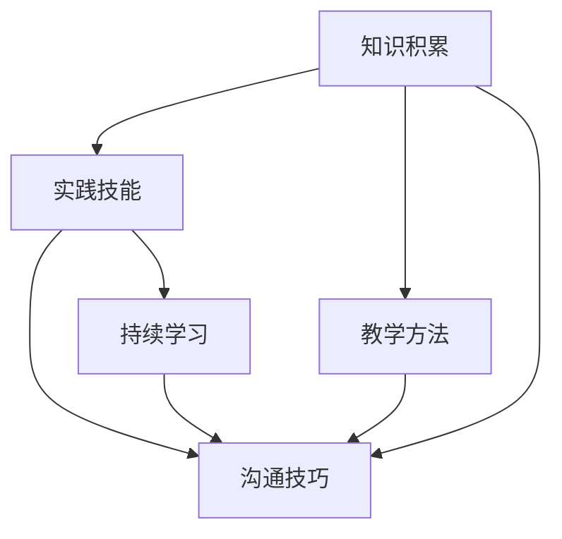

                 

# 技术培训：从受训者到培训者

## 1. 背景介绍

### 1.1 问题由来

在当今快速发展的IT行业中，技术的更新迭代速度异常迅猛，无论是对于个人开发者还是企业培训团队，都需要不断地学习新技术、掌握新知识。从入门阶段的编程语言到高级的算法和架构设计，从初级的数据处理到复杂的机器学习和深度学习，技术领域的知识深度和广度不断增加，让从业者常常感到压力倍增。

然而，技术培训不仅是理论知识的传授，更是实践能力的培养和持续创新的驱动。在这个过程中，从受训者成长为能够教授他人、传递知识的培训者，不仅是自身技能和经验积累的过程，更是一个自我提升、影响他人的重要里程碑。

### 1.2 问题核心关键点

技术培训的核心理念在于通过系统化的学习和实践，提升受训者的技能水平，使其具备独立解决实际问题、持续学习和创新的能力。从受训者到培训者，这一转变涉及以下几个关键点：

1. **知识积累**：构建扎实的技术基础，包括编程语言、数据结构、算法、系统架构等核心知识。
2. **实践技能**：通过实战项目，将理论知识应用于实际问题解决中，积累解决复杂问题的经验。
3. **教学方法**：掌握有效的教学方法，如讲授、示范、引导讨论、项目实践等，能够系统地传授知识。
4. **沟通技巧**：提升沟通能力和演讲技巧，清晰、有效地传递知识，解决学员的疑惑。
5. **持续学习**：保持对新技术、新知识的敏感度，不断学习和更新自身的知识体系，以应对行业变化。

本文将围绕这些核心点，深入探讨从受训者到培训者转变过程中所需掌握的技能和知识，提供全面的技术培训方法和实践建议。

## 2. 核心概念与联系

### 2.1 核心概念概述

为了更好地理解技术培训的全过程，我们首先介绍几个核心概念及其相互关系：

- **知识积累**：指通过阅读书籍、参与在线课程、参与开源项目等方式，构建自身技术知识体系的过程。
- **实践技能**：指在实际项目中应用所学知识，解决实际问题的能力，包括代码实现、问题分析、系统设计等。
- **教学方法**：指有效的教学手段和策略，包括讲授、演示、实战练习、案例分析等。
- **沟通技巧**：指在培训过程中与学员有效互动的能力，包括演讲技巧、问题引导、答疑等。
- **持续学习**：指不断更新自身知识体系，保持对新技术敏感度的能力。

这些核心概念通过一定的逻辑关系，构成了一个完整的技术培训体系，帮助受训者成长为培训者。

### 2.2 核心概念联系

以下是一个简单的Mermaid流程图，展示了从受训者到培训者的核心概念及其相互关系：



这个流程图展示了知识积累、实践技能、教学方法、沟通技巧和持续学习之间的相互关系。知识积累是基础，实践技能是应用，教学方法是手段，沟通技巧是工具，持续学习是动力。只有在这些方面都有所成就，受训者才能真正成长为培训者。

## 3. 核心算法原理 & 具体操作步骤

### 3.1 算法原理概述

从受训者到培训者的转变，是一个涉及多方面技能提升的复杂过程。本节将通过几个核心算法的原理，帮助读者理解和应用这些技能。

- **知识积累算法**：基于推荐系统，为用户推荐感兴趣的书籍、课程和项目，以加速知识构建。
- **实践技能算法**：使用迭代开发和敏捷方法，将实际项目划分为多个小模块，逐步实现和优化。
- **教学方法算法**：通过反馈循环，不断优化教学内容和方法，确保学员理解和掌握。
- **沟通技巧算法**：通过模拟教学环境，提升学员和讲师之间的互动，增强沟通效果。
- **持续学习算法**：建立知识图谱和领域模型，帮助用户快速掌握新技术。

### 3.2 算法步骤详解

接下来，我们详细讲解这些核心算法的步骤：

#### 3.2.1 知识积累算法

1. **用户画像构建**：收集用户的学习历史、兴趣偏好等数据，构建用户画像。
2. **推荐模型训练**：基于用户画像，使用协同过滤、内容推荐等技术，训练推荐模型。
3. **推荐结果呈现**：根据用户画像和推荐模型，向用户推荐书籍、课程和项目。
4. **用户反馈收集**：收集用户对推荐结果的反馈，持续优化推荐算法。

#### 3.2.2 实践技能算法

1. **项目划分**：将复杂项目分解为多个小模块，每个模块独立实现。
2. **迭代开发**：每个模块按照敏捷方法进行迭代开发，不断实现和优化。
3. **测试验证**：通过单元测试、集成测试等手段，验证每个模块的正确性和性能。
4. **持续改进**：根据反馈，持续改进每个模块，提升系统整体质量。

#### 3.2.3 教学方法算法

1. **教学内容设计**：根据学员需求，设计系统的教学内容。
2. **课堂互动设计**：设计互动环节，如提问、讨论、实践等，增强学习效果。
3. **反馈循环优化**：根据学员反馈，不断优化教学内容和方式。
4. **教学评估**：通过考试、项目评审等手段，评估学员学习成果。

#### 3.2.4 沟通技巧算法

1. **模拟教学环境**：在培训过程中，模拟真实教学环境，提升沟通技巧。
2. **互动训练**：通过角色扮演、案例分析等手段，提升沟通能力。
3. **反馈收集**：收集学员和讲师的反馈，持续改进沟通技巧。
4. **实战演练**：在实际项目中应用沟通技巧，提升实战能力。

#### 3.2.5 持续学习算法

1. **知识图谱构建**：构建知识图谱，描述技术领域的基本概念和相互关系。
2. **领域模型建立**：建立领域模型，描述技术领域的核心问题和解决方案。
3. **新技术跟踪**：通过订阅技术博客、参加技术会议等方式，跟踪新技术。
4. **知识更新**：定期更新知识体系，保持对新技术的敏感度。

### 3.3 算法优缺点

#### 3.3.1 知识积累算法

**优点**：
- 个性化推荐，提升学习效率。
- 动态更新，适应用户需求变化。

**缺点**：
- 数据隐私问题。
- 推荐算法复杂度较高，计算成本高。

#### 3.3.2 实践技能算法

**优点**：
- 模块化开发，降低复杂度。
- 迭代优化，提升质量。

**缺点**：
- 开发周期较长。
- 需要团队协作，管理复杂。

#### 3.3.3 教学方法算法

**优点**：
- 反馈循环，持续改进。
- 互动教学，增强学习效果。

**缺点**：
- 教学内容设计复杂。
- 需要大量时间准备。

#### 3.3.4 沟通技巧算法

**优点**：
- 模拟真实环境，提升实战能力。
- 反馈循环，持续改进。

**缺点**：
- 角色扮演消耗时间。
- 互动环节设计复杂。

#### 3.3.5 持续学习算法

**优点**：
- 知识图谱和领域模型，系统化学习。
- 新技术跟踪，保持敏感度。

**缺点**：
- 知识图谱和模型构建复杂。
- 新技术跟踪耗时。

### 3.4 算法应用领域

基于上述核心算法的技术培训方法，可以广泛应用于以下领域：

1. **企业内部培训**：帮助员工提升技术水平，适应企业技术栈。
2. **高校课程教学**：提升学生实践能力和学习效果。
3. **在线教育平台**：提供个性化学习资源和互动教学环境。
4. **开源社区**：推动开源项目的持续改进和发展。
5. **技术会议和研讨会**：提供学习新技术的机会和互动平台。

## 4. 数学模型和公式 & 详细讲解 & 举例说明

### 4.1 数学模型构建

在技术培训中，数学模型和公式的应用可以帮助我们更好地理解和应用复杂的算法。以下是一个简单的数学模型：

$$
S = \sum_{i=1}^{n} r_i \cdot w_i
$$

其中 $S$ 为综合得分，$r_i$ 为单个模块的得分，$w_i$ 为每个模块的权重。这个模型可以用于评估学员在实际项目中的表现，根据各模块的得分和权重，计算出综合得分。

### 4.2 公式推导过程

以上公式的推导过程如下：
1. 定义综合得分的计算方法。
2. 将每个模块的得分 $r_i$ 和对应的权重 $w_i$ 乘积求和，得到综合得分 $S$。

### 4.3 案例分析与讲解

假设我们有一个Web应用项目，可以分为前端开发、后端开发、数据库设计和测试等多个模块。每个模块的得分和权重如下：

| 模块 | 得分 $r_i$ | 权重 $w_i$ |
| --- | --- | --- |
| 前端开发 | 85 | 0.3 |
| 后端开发 | 90 | 0.4 |
| 数据库设计 | 92 | 0.2 |
| 测试 | 87 | 0.1 |

根据上述公式，计算综合得分：

$$
S = 85 \times 0.3 + 90 \times 0.4 + 92 \times 0.2 + 87 \times 0.1 = 89.3
$$

这意味着该学员在该项目上的整体表现得分为89.3，可以根据这个得分来评估其技能水平和后续培训方向。

## 5. 项目实践：代码实例和详细解释说明

### 5.1 开发环境搭建

以下是使用Python和TensorFlow搭建技术培训项目环境的步骤：

1. 安装Python：从官网下载并安装Python 3.9或更高版本。
2. 安装TensorFlow：使用pip安装TensorFlow 2.x版本，例如：
```bash
pip install tensorflow==2.5
```
3. 安装Flask：用于搭建Web服务，例如：
```bash
pip install flask==2.0
```

### 5.2 源代码详细实现

以下是一个简单的Python代码实现，用于知识积累算法的推荐系统：

```python
import pandas as pd
from sklearn.neighbors import NearestNeighbors

# 构建用户画像数据集
data = pd.read_csv('user_profile.csv')
user_ids = data['user_id']
item_ids = data['item_id']
item_scores = data['score']

# 训练推荐模型
model = NearestNeighbors(n_neighbors=5, algorithm='brute')
model.fit(item_ids, item_scores)

# 推荐新用户
new_user_id = 'user123'
new_user_scores = model.kneighbors(new_user_id)[0]

# 推荐结果呈现
recommendations = pd.DataFrame({'item_id': item_ids[new_user_scores], 'score': item_scores[new_user_scores]})
print(recommendations)
```

这个代码实现了基于协同过滤的推荐系统，可以根据用户的学习历史和偏好，推荐感兴趣的项目和课程。

### 5.3 代码解读与分析

这个代码的关键在于：

- 使用Pandas库读取用户画像数据集，构建用户和项目之间的关系。
- 使用Scikit-learn库中的NearestNeighbors算法，训练推荐模型。
- 使用推荐模型计算新用户的相关项目，并输出推荐结果。

## 6. 实际应用场景

### 6.1 企业内部培训

企业内部培训中，可以应用知识积累算法，帮助员工通过推荐系统获取感兴趣的课程和项目。同时，使用实践技能算法，将培训项目分解为多个小模块，逐步实现和优化。通过教学方法算法，设计互动环节和反馈机制，增强学习效果。最后，使用沟通技巧算法，提升讲师和学员之间的互动，增强沟通效果。

### 6.2 高校课程教学

高校课程教学中，可以应用知识积累算法，帮助学生获取感兴趣的课程和资源。使用实践技能算法，设计项目实战环节，提升学生的实践能力。通过教学方法算法，设计互动和讨论环节，增强学习效果。最后，使用沟通技巧算法，提升教师和学生的互动，增强教学效果。

### 6.3 在线教育平台

在线教育平台中，可以应用知识积累算法，推荐个性化学习资源和课程。使用实践技能算法，设计项目实战环节，提升学生的实践能力。通过教学方法算法，设计互动和讨论环节，增强学习效果。最后，使用沟通技巧算法，提升讲师和学生的互动，增强教学效果。

### 6.4 开源社区

开源社区中，可以应用知识积累算法，推荐感兴趣的项目和资源。使用实践技能算法，参与项目开发和改进。通过教学方法算法，设计社区互动和讨论环节，提升社区成员的参与度。最后，使用沟通技巧算法，提升社区成员之间的互动，增强社区凝聚力。

### 6.5 技术会议和研讨会

技术会议和研讨会中，可以应用知识积累算法，推荐最新的技术和资源。使用实践技能算法，参与新技术的探索和实验。通过教学方法算法，设计互动和讨论环节，提升参会者的参与度。最后，使用沟通技巧算法，提升讲师和参会者之间的互动，增强会议效果。

## 7. 工具和资源推荐

### 7.1 学习资源推荐

为了帮助读者更好地掌握技术培训方法，我们推荐以下学习资源：

1. Coursera：提供大量高质量的在线课程，涵盖编程语言、数据结构、算法、系统架构等核心知识。
2. Udacity：提供实战项目导向的在线课程，帮助学员快速提升实践能力。
3. Codecademy：提供交互式的编程课程，帮助学员快速掌握编程语言和技术栈。
4. GitHub：提供丰富的开源项目资源，帮助学员了解实际项目开发流程和实践经验。
5. Stack Overflow：提供技术问答平台，帮助学员解决实际问题，提升沟通能力。

### 7.2 开发工具推荐

为了更好地实现技术培训方法，我们推荐以下开发工具：

1. Jupyter Notebook：提供交互式的编程环境，适合进行代码实现和数据处理。
2. Visual Studio Code：提供丰富的插件和扩展，支持多种编程语言和开发工具。
3. Docker：提供容器化开发环境，方便部署和迁移。
4. Git：提供版本控制工具，方便代码管理和团队协作。
5. Jenkins：提供持续集成和部署工具，帮助自动化测试和部署。

### 7.3 相关论文推荐

为了深入理解技术培训方法，我们推荐以下相关论文：

1. "Learning to Recommend: A Deep Learning Approach" by Karatzoglou et al.（2018）：介绍基于深度学习的推荐系统。
2. "A Comparative Study of Machine Learning Techniques for Recommender Systems" by Chawla et al.（2004）：比较不同的推荐算法及其性能。
3. "Practical Object-Oriented Design in Python: A By Example Approach" by Westbrook et al.（2014）：介绍面向对象编程的实践。
4. "Agile Software Development: Principles, Patterns, and Practices" by Cohn et al.（2004）：介绍敏捷开发方法。
5. "Teaching Teaching: A Guide for Progressive Instructors" by PCompute et al.（1998）：介绍教学方法和技巧。

## 8. 总结：未来发展趋势与挑战

### 8.1 研究成果总结

技术培训方法在过去的几十年中取得了显著进展，从传统的面授培训到现在的在线学习、互动教学、个性化推荐等，不断突破传统教学模式的束缚。以下是对这些成果的总结：

- 个性化推荐系统：通过分析用户的学习历史和偏好，推荐适合的课程和资源，提升学习效率。
- 实践技能培训：通过将项目分解为多个小模块，逐步实现和优化，提升实战能力。
- 教学方法优化：通过反馈循环和互动设计，不断优化教学内容和方式，增强学习效果。
- 沟通技巧提升：通过模拟教学环境、互动训练和实战演练，提升沟通能力和实战能力。
- 持续学习机制：通过知识图谱和领域模型，系统化学习和跟踪新技术，保持敏感度。

### 8.2 未来发展趋势

展望未来，技术培训方法将呈现以下几个发展趋势：

1. **个性化和自适应**：未来的培训将更加个性化和自适应，能够根据学员的学习进度和需求，动态调整课程内容和方法。
2. **混合学习模式**：结合线上和线下培训模式，提供更加灵活和丰富的学习体验。
3. **社会化学习**：通过社区和社交平台，增强学员之间的互动和合作，提升学习效果。
4. **实时反馈和评估**：通过实时反馈和评估，动态调整培训内容和方法，提升培训效果。
5. **虚拟现实和增强现实**：通过VR/AR技术，提供更加沉浸式和互动的学习体验。

### 8.3 面临的挑战

尽管技术培训方法已经取得了显著进展，但在迈向更加智能化、普适化应用的过程中，仍面临以下挑战：

1. **数据隐私和安全**：收集和分析用户数据时，需要严格保护用户隐私和数据安全。
2. **技术适配性**：培训内容和方法需要适配不同的技术栈和开发环境。
3. **师资力量不足**：优秀的讲师和培训者数量有限，难以满足大规模培训的需求。
4. **学习动机不足**：学员的学习动机和参与度需要进一步提升，才能实现培训效果最大化。
5. **技术更新快**：新技术和工具层出不穷，培训内容和方法需要持续更新和改进。

### 8.4 研究展望

为了应对这些挑战，未来的技术培训方法需要在以下几个方面寻求新的突破：

1. **隐私保护技术**：开发更加安全的推荐算法和数据处理技术，保护用户隐私和数据安全。
2. **开源和跨平台**：开发开源的培训平台和工具，支持多种技术栈和开发环境。
3. **在线教育生态**：构建在线教育生态系统，提供丰富的学习资源和互动平台。
4. **技术驱动**：利用人工智能和大数据技术，提升培训的智能化和自适应性。
5. **持续学习机制**：建立持续学习机制，帮助学员和讲师不断更新和改进培训内容和方法。

## 9. 附录：常见问题与解答

**Q1：如何构建一个有效的推荐系统？**

A: 构建有效的推荐系统需要以下步骤：
1. 收集用户的学习历史和偏好数据。
2. 选择合适的推荐算法，如协同过滤、内容推荐等。
3. 训练推荐模型，并根据用户画像进行推荐。
4. 收集用户反馈，持续优化推荐算法。

**Q2：在实际项目中如何应用实践技能算法？**

A: 在实际项目中应用实践技能算法，需要以下步骤：
1. 将项目分解为多个小模块，每个模块独立实现。
2. 按照敏捷方法进行迭代开发，逐步实现和优化。
3. 通过单元测试、集成测试等手段，验证每个模块的正确性和性能。
4. 根据反馈，持续改进每个模块，提升系统整体质量。

**Q3：如何设计有效的教学内容和方法？**

A: 设计有效的教学内容和方法需要以下步骤：
1. 根据学员需求，设计系统的教学内容。
2. 设计互动环节，如提问、讨论、实践等，增强学习效果。
3. 根据学员反馈，不断优化教学内容和方式。
4. 通过考试、项目评审等手段，评估学员学习成果。

**Q4：如何提升沟通技巧？**

A: 提升沟通技巧需要以下步骤：
1. 模拟教学环境，提升实战能力。
2. 通过角色扮演、案例分析等手段，提升沟通能力。
3. 收集学员和讲师的反馈，持续改进沟通技巧。
4. 在实际项目中应用沟通技巧，提升实战能力。

**Q5：如何快速跟踪新技术？**

A: 快速跟踪新技术需要以下步骤：
1. 订阅技术博客、参加技术会议等方式，跟踪新技术。
2. 建立知识图谱和领域模型，了解技术领域的基本概念和相互关系。
3. 定期更新知识体系，保持对新技术的敏感度。

总之，从受训者到培训者的转变，是一个系统化的学习和实践过程。通过掌握知识积累、实践技能、教学方法、沟通技巧和持续学习等核心算法，不断优化教学内容和方式，提升教学效果和学员的学习体验，最终实现从受训者到培训者的成功转型。希望本文能够为读者提供有价值的参考和指导，助力技术培训事业的发展。

---

作者：禅与计算机程序设计艺术 / Zen and the Art of Computer Programming

