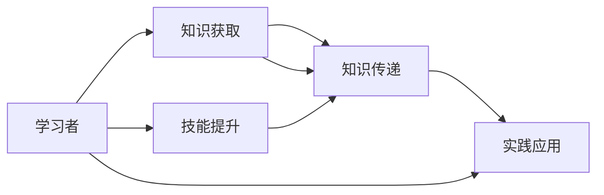

                 

# 技术培训：从学习者到培训者转变

> 关键词：技术培训, 教师成长, 知识传递, 学习者, 培训者, 教学方法, 技能提升

## 1. 背景介绍

随着技术在各行各业的深入应用，技术培训已成为组织提升员工技能、增强竞争力不可或缺的一部分。从技术学习者到技术培训者，不仅是角色的转变，更是知识和经验的沉淀和传递。然而，对于许多人来说，如何从技术学习者转变成为一名优秀的培训者，仍然是一个不小的挑战。本文将从多个角度探讨技术培训的核心理念、方法、以及如何成为技术培训专家。

## 2. 核心概念与联系

### 2.1 核心概念概述

1. **技术培训**：通过系统的知识传授、技能训练和实战演练，使受训者掌握某一领域的技术知识，提升其技术能力和应用水平。
2. **学习者**：积极主动地通过学习获取新知识、新技能，并将其应用于实践中的个体。
3. **培训者**：具备丰富的专业知识，能够有效地设计和实施培训活动，指导和支持学习者的个体。
4. **知识传递**：从知识源向知识受体（学习者）转移和共享知识的过程。
5. **技能提升**：通过培训活动，学习者获取并巩固特定技术领域的核心技能。

这些概念之间存在着紧密的联系：技术培训是知识传递和技能提升的重要途径，学习者是知识传递的接收者，而培训者则是知识传递的实施者和推动者。有效的技术培训需要培训者具备高超的教学技巧和丰富的实战经验，而学习者则需要积极主动地参与和学习。

### 2.2 核心概念原理和架构的 Mermaid 流程图



## 3. 核心算法原理 & 具体操作步骤

### 3.1 算法原理概述

技术培训的算法原理可以抽象为知识获取、知识传递、技能提升和实践应用四个主要环节。这四个环节共同构成了一个完整的技术培训过程。

1. **知识获取**：通过阅读、听课、观看视频等多种形式，学习者从各种渠道获取相关技术知识。
2. **知识传递**：培训者将知识以易于理解的方式传递给学习者，如通过讲解、示范、练习等方法。
3. **技能提升**：学习者通过实际操作的练习，将所学知识应用于实践中，巩固和提升技能。
4. **实践应用**：学习者在真实或模拟的环境中进行应用，检验并验证其技术能力。

### 3.2 算法步骤详解

#### 步骤1：需求分析与目标设定

1. **需求分析**：明确培训的目的、对象、内容和方法。了解学习者的背景、知识水平和预期目标。
2. **目标设定**：根据需求分析，设定清晰的培训目标，包括知识和技能的具体要求。

#### 步骤2：内容设计与规划

1. **内容设计**：根据培训目标，设计培训内容，包括理论讲解、案例分析、实际操作等。
2. **教学规划**：规划培训的流程和时间安排，确保内容逻辑清晰、结构合理。

#### 步骤3：实施与反馈

1. **实施培训**：按照教学规划，实施培训活动。可以通过面授、在线课程、实战演练等多种形式进行。
2. **实时反馈**：在培训过程中，及时收集学习者的反馈，调整教学策略和内容，确保培训效果。

#### 步骤4：评估与改进

1. **评估培训效果**：通过考试、项目实战、问卷调查等方式，评估培训的成果和效果。
2. **持续改进**：根据评估结果，持续改进培训内容和教学方法，提高培训质量。

### 3.3 算法优缺点

#### 优点：

1. **系统化学习**：通过系统的培训内容设计，学习者可以系统地掌握某一领域的技术知识。
2. **实践导向**：通过实际操作和实战演练，学习者能够更好地理解和应用所学知识。
3. **知识传递高效**：经验丰富的培训者能够高效地传递知识，提升学习者的理解和掌握度。

#### 缺点：

1. **时间成本高**：完整的技术培训需要投入大量时间和资源，对企业来说可能是一个负担。
2. **培训效果难以量化**：培训效果的评估较为复杂，难以通过单一指标进行量化。
3. **培训者要求高**：需要培训者具备丰富的知识和教学经验，这对许多企业来说是一个挑战。

### 3.4 算法应用领域

技术培训的应用领域非常广泛，包括但不限于：

1. **软件开发**：如编程语言、框架、工具等。
2. **数据科学**：如数据分析、机器学习、数据处理等。
3. **网络安全**：如安全威胁分析、漏洞扫描、防御策略等。
4. **项目管理**：如敏捷开发、项目管理工具等。
5. **人工智能**：如深度学习、自然语言处理、计算机视觉等。

## 4. 数学模型和公式 & 详细讲解 & 举例说明

### 4.1 数学模型构建

技术培训的数学模型可以抽象为：

1. **学习者模型**：表示学习者的知识水平和学习效率。
2. **知识传递模型**：表示知识从培训者传递到学习者的过程。
3. **技能提升模型**：表示学习者在实践中的应用和反馈过程。

### 4.2 公式推导过程

1. **学习者模型**：假设学习者初始知识水平为 $K_0$，通过培训后，知识水平提升到 $K_T$。

   $$
   K_T = K_0 + \eta \times \text{TraningHours}
   $$

   其中 $\eta$ 为学习效率，$\text{TraningHours}$ 为培训时间。

2. **知识传递模型**：假设知识传递的效率为 $E$，知识传递的完整度为 $C$。

   $$
   C = E \times \text{TraningHours}
   $$

3. **技能提升模型**：假设技能的提升与知识的掌握成正比，即学习者技能提升 $S$ 与知识水平 $K_T$ 成正比。

   $$
   S = \alpha \times K_T
   $$

   其中 $\alpha$ 为技能提升系数。

### 4.3 案例分析与讲解

假设一个开发人员在参加为期2周的培训课程，每周学习时间为20小时。他的初始知识水平为 $K_0=1$，学习效率为 $\eta=0.5$，技能提升系数为 $\alpha=0.2$。

根据公式，他培训后的知识水平 $K_T$ 为：

$$
K_T = 1 + 0.5 \times 40 = 3
$$

技能提升 $S$ 为：

$$
S = 0.2 \times 3 = 0.6
$$

这表示在培训结束后，该开发人员的知识水平显著提升，技能也得到了一定的提升。

## 5. 项目实践：代码实例和详细解释说明

### 5.1 开发环境搭建

1. **安装Python**：
```
conda create -n training-env python=3.8
conda activate training-env
```

2. **安装相关库**：
```
pip install numpy pandas matplotlib scikit-learn jupyter notebook
```

### 5.2 源代码详细实现

以下是一个简单的Python代码示例，用于模拟技术培训过程：

```python
import numpy as np

# 设定学习者初始知识水平、学习效率、培训时间、技能提升系数
K0 = 1
eta = 0.5
train_hours = 40
alpha = 0.2

# 计算培训后的知识水平和技能提升
KT = K0 + eta * train_hours
S = alpha * KT

print(f"初始知识水平: {K0}")
print(f"培训后知识水平: {KT}")
print(f"技能提升: {S}")
```

### 5.3 代码解读与分析

此代码示例展示了如何使用Python计算培训后学习者的知识水平和技能提升。

1. **初始化变量**：设定学习者初始知识水平 $K0$，学习效率 $\eta$，培训时间 $\text{train_hours}$，技能提升系数 $\alpha$。
2. **计算培训后的知识水平 $KT$**：使用公式 $K_T = K_0 + \eta \times \text{train_hours}$ 计算。
3. **计算技能提升 $S$**：使用公式 $S = \alpha \times K_T$ 计算。
4. **输出结果**：打印学习者的初始知识水平、培训后知识水平和技能提升。

### 5.4 运行结果展示

```
初始知识水平: 1
培训后知识水平: 3
技能提升: 0.6
```

这表明，经过2周的培训，学习者的知识水平从1提升到了3，技能提升了0.6，展示了培训过程对知识水平和技能提升的具体影响。

## 6. 实际应用场景

### 6.1 软件开发培训

软件开发培训是技术培训的重要组成部分。通过培训，开发人员可以掌握最新的编程语言、框架和工具，提升编程能力和团队协作效率。

1. **需求分析**：明确培训对象（如初级、中级、高级开发者），设定培训目标（如掌握某编程语言）。
2. **内容设计**：设计包括语法基础、常用库、实战案例等内容的培训课程。
3. **实施培训**：通过面授、在线课程、实战演练等多种形式进行培训。
4. **评估与改进**：通过编程测试、项目实战等方式评估培训效果，根据反馈持续改进培训内容。

### 6.2 数据科学培训

数据科学培训旨在提升数据处理、分析和建模的能力，培养具备数据科学思维的专业人才。

1. **需求分析**：明确培训对象，设定培训目标（如掌握数据分析、机器学习技术）。
2. **内容设计**：设计包括数据清洗、数据探索、模型构建等内容的培训课程。
3. **实施培训**：通过面授、在线课程、实战项目等多种形式进行培训。
4. **评估与改进**：通过数据分析项目、模型竞赛等方式评估培训效果，根据反馈持续改进培训内容。

### 6.3 网络安全培训

网络安全培训重点提升网络安全防护能力，防范网络攻击和数据泄露风险。

1. **需求分析**：明确培训对象，设定培训目标（如掌握网络安全威胁分析、防护策略）。
2. **内容设计**：设计包括网络安全基础、漏洞扫描、安全策略等内容的培训课程。
3. **实施培训**：通过面授、在线课程、实战演练等多种形式进行培训。
4. **评估与改进**：通过模拟攻击、安全测试等方式评估培训效果，根据反馈持续改进培训内容。

## 7. 工具和资源推荐

### 7.1 学习资源推荐

1. **《深入浅出Python》**：适合Python初学者的入门书籍，详细介绍了Python语言的基础知识和常用库。
2. **Coursera数据科学专项课程**：由多所名校提供的数据科学专项课程，涵盖数据清洗、数据分析、机器学习等内容。
3. **Kaggle数据科学竞赛**：通过参与实际的数据科学竞赛，提升实战能力和问题解决能力。
4. **Udacity网络安全专业课程**：涵盖网络安全基础、渗透测试、安全管理等内容的综合性课程。

### 7.2 开发工具推荐

1. **Jupyter Notebook**：一个交互式的开发环境，适合进行数据科学、机器学习等领域的实践和研究。
2. **GitHub**：代码托管平台，适合版本控制和协作开发。
3. **Anaconda**：一个用于数据科学和机器学习的开源平台，包含大量常用的库和工具。
4. **Visual Studio Code**：一个轻量级、功能强大的代码编辑器，支持多种编程语言。

### 7.3 相关论文推荐

1. **《软件工程师技能培训的最佳实践》**：详细探讨了软件开发培训的策略和方法，提出了有效的培训模型。
2. **《数据科学技能培养的挑战与对策》**：分析了数据科学技能培养中的难点，提出了针对性的解决方案。
3. **《网络安全培训的有效性评估》**：研究了网络安全培训的有效性评估方法，提出了改进建议。

## 8. 总结：未来发展趋势与挑战

### 8.1 总结

本文系统地介绍了技术培训的理念、方法、实施过程及评估改进，详细分析了技术学习者如何转变为培训者，以及如何设计有效的培训方案。通过深入分析，我们了解到技术培训对提升员工技能、增强组织竞争力具有重要作用。然而，技术培训也面临着时间成本高、培训效果难以量化等挑战，需要不断改进和优化。

### 8.2 未来发展趋势

1. **个性化培训**：随着人工智能和大数据技术的发展，未来的培训将更加个性化，能够根据学习者的特点和需求进行定制化设计。
2. **混合式培训**：结合线上线下、虚拟现实等技术，提供更加灵活、互动性强的培训体验。
3. **持续学习**：通过在线课程、学习社区等平台，实现持续学习，保持知识的时效性和相关性。
4. **全球化培训**：结合远程协作技术，实现全球范围内的培训，提高培训的可及性和覆盖面。
5. **技能认证**：通过建立标准化的技能认证体系，提高培训的权威性和认可度。

### 8.3 面临的挑战

1. **培训资源不足**：许多企业缺乏专业的培训师资和培训资源，难以开展高质量的培训活动。
2. **培训效果难以量化**：培训效果的评估较为复杂，难以通过单一指标进行量化，缺乏科学的方法论。
3. **知识更新快**：技术更新迭代速度快，培训内容需要及时更新，以保证培训的实效性。
4. **员工参与度低**：部分员工对培训的积极性不高，影响培训效果。
5. **培训效果难以应用**：部分培训内容与实际工作脱节，难以将培训成果转化为实际应用。

### 8.4 研究展望

未来的技术培训研究需要在以下几个方面进行深入探索：

1. **数据驱动的培训设计**：利用大数据和人工智能技术，分析学习者的学习行为和效果，指导培训设计。
2. **多模态培训模式**：结合文字、视频、语音等多种形式，提供更加丰富、多样化的培训内容。
3. **互动式学习**：通过游戏化、模拟演练等互动式学习方法，提升学习者的参与度和兴趣。
4. **社会化学习**：利用学习社区、知识共享平台等社会化工具，促进知识的交流和共享。
5. **培训效果量化**：研究科学、客观的培训效果评估方法，提高培训效果的量化和可比性。

## 9. 附录：常见问题与解答

**Q1: 如何成为一名优秀的数据科学家？**

A: 成为一名优秀的数据科学家需要具备以下几方面的能力：
1. 扎实的数学和统计学基础。
2. 熟练掌握至少一种编程语言（如Python、R）。
3. 熟悉数据处理和清洗技术。
4. 了解常用的机器学习算法和模型。
5. 能够处理和分析大规模数据集。
6. 具备良好的问题分析和解决能力。

**Q2: 如何设计有效的培训课程？**

A: 设计有效的培训课程需要考虑以下几个因素：
1. 明确培训目标和对象。
2. 设计合理的课程内容，包括理论讲解、案例分析、实际操作等。
3. 确定培训时间和节奏，合理安排学习内容。
4. 使用多种教学方法，如面授、在线课程、实战演练等。
5. 及时收集反馈，调整培训内容和方法，确保培训效果。

**Q3: 如何在培训过程中提高学习者的参与度？**

A: 提高学习者参与度的方法包括：
1. 采用互动式学习方法，如案例分析、小组讨论等。
2. 引入游戏化元素，设计挑战性任务，激励学习者。
3. 提供及时反馈和奖励，增强学习者的成就感和积极性。
4. 使用多种教学手段，如视频、模拟演练等，吸引学习者的注意力。
5. 建立学习社区，鼓励知识共享和交流。

---

作者：禅与计算机程序设计艺术 / Zen and the Art of Computer Programming

