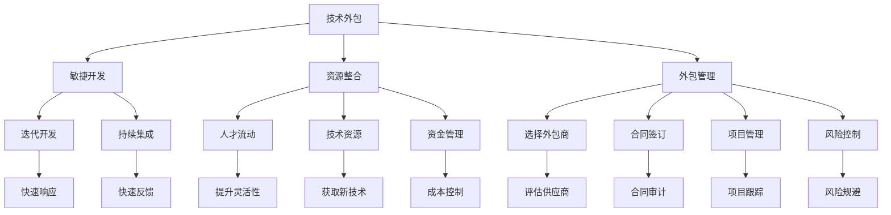

                 

# 技术外包：创业的低风险方式

> 关键词：技术外包, 创业, 低风险, 敏捷开发, 资源整合, 外包管理

## 1. 背景介绍

随着信息时代的到来，技术创新和数字转型成为企业发展的核心动力。然而，对于初创企业和中小型企业来说，直接构建技术团队不仅需要巨额资金投入，还需要承担高昂的运营风险。技术外包作为一种低成本、高效益的解决方案，逐渐受到越来越多创业者和企业的青睐。

技术外包指企业将部分或全部软件开发、维护、测试等技术工作外包给专业的第三方服务提供商。这种模式可以有效缓解企业技术资源短缺、人才流动性高、技术迭代快等问题，降低创业初期的成本和风险，为企业的快速成长提供坚实保障。

## 2. 核心概念与联系

### 2.1 核心概念概述

为了更好地理解技术外包模式，本节将介绍几个核心概念：

- **技术外包(IT Outsourcing)**：指企业将部分或全部技术工作委托给第三方服务提供商来完成，以降低运营成本，提高企业核心竞争力。
- **敏捷开发(Agile Development)**：一种迭代、增量式的软件开发方法，强调团队协作、快速反馈和持续改进，快速响应市场变化。
- **资源整合(Resource Integration)**：将不同来源的资源（如人才、技术、资金等）有效整合，形成协同效应，提升整体效率和效益。
- **外包管理(Outsourcing Management)**：包括选择外包商、合同签订、项目管理、风险控制等环节，确保外包服务的质量和时效性。

这些核心概念之间存在紧密的联系，共同构成了技术外包的基础框架。技术外包通过引入外部资源，利用敏捷开发方法，实现快速响应和迭代优化，同时通过有效的资源整合和外包管理，确保项目顺利进行。

### 2.2 核心概念原理和架构的 Mermaid 流程图



这个流程图展示了技术外包的主要流程和关键节点：

1. 技术外包作为起点，引入敏捷开发、资源整合和外包管理等核心概念，实现企业技术能力的提升。
2. 敏捷开发通过迭代、增量式开发，提升快速响应能力。
3. 资源整合通过优化人才流动、获取技术资源、控制成本等环节，提升整体效率。
4. 外包管理通过选择外包商、合同签订、项目管理、风险控制等环节，保障服务质量和时效性。
5. 迭代开发和持续集成确保了快速响应和快速反馈，提升项目成功率。
6. 人才流动、技术资源、资金管理等环节共同支持敏捷开发，提升企业灵活性。
7. 选择外包商、合同审计、项目跟踪、风险规避等外包管理环节，确保项目顺利进行。

这些概念和流程相互交织，构成了技术外包的完整体系，帮助企业实现快速、高效、低成本的技术创新和发展。

## 3. 核心算法原理 & 具体操作步骤

### 3.1 算法原理概述

技术外包的核心理论基础是资源的最优配置和利用。通过选择合适的外包商、采用敏捷开发方法、实施资源整合策略，企业可以在有限的资源条件下，最大化地提升技术能力和市场竞争力。

### 3.2 算法步骤详解

技术外包的实施步骤一般包括以下几个关键环节：

**Step 1: 需求分析和规划**

- 明确企业技术需求，制定详细的项目规划。
- 进行市场需求调研，评估技术外包的必要性和可行性。
- 确定技术外包的范围和目标，明确项目里程碑和时间节点。

**Step 2: 选择外包商**

- 根据企业需求，筛选合适的外包商，进行初步评估。
- 参考行业标准和案例，综合考虑外包商的技术实力、服务质量、成本报价等因素。
- 签订合同，明确服务内容、交付标准、质量要求、保密协议等条款。

**Step 3: 项目启动和实施**

- 项目团队组建，包括需求分析、设计、开发、测试等岗位。
- 采用敏捷开发方法，进行迭代式开发，快速响应市场变化。
- 实施资源整合策略，优化人才流动、技术资源和资金管理。

**Step 4: 项目管理与监控**

- 制定详细的项目计划，进行项目跟踪和监控。
- 定期召开项目评审会议，评估项目进展和风险。
- 根据项目需求和变化，进行灵活调整和优化。

**Step 5: 验收和评估**

- 根据合同条款，进行项目验收和质量评估。
- 收集反馈意见，进行项目总结和经验分享。
- 总结经验教训，为后续项目提供参考和借鉴。

### 3.3 算法优缺点

技术外包模式具有以下优点：

1. **降低成本**：通过外包方式，企业可以节省人力成本和运营成本，优化资源配置。
2. **快速响应**：敏捷开发方法可以快速迭代和反馈，提升项目交付速度和灵活性。
3. **提升质量**：专业的外包服务提供商具有丰富的技术积累和项目管理经验，可以保证项目质量。
4. **降低风险**：外包商承担项目风险，企业只需关注关键技术节点和关键问题。

同时，技术外包也存在以下缺点：

1. **信息泄露**：外包过程中涉及敏感数据和商业机密，存在信息泄露风险。
2. **项目管理复杂**：跨地域、跨文化的外包合作需要复杂的沟通和协调。
3. **质量控制难度**：外包商的质量控制依赖于企业的外包管理能力。
4. **依赖性**：过度依赖外部资源，可能影响企业的技术自主性和长期发展。

### 3.4 算法应用领域

技术外包模式在多个行业领域得到了广泛应用，包括但不限于：

- **软件开发**：软件开发是技术外包的主要应用领域之一，企业可以通过外包实现快速迭代和灵活开发。
- **IT维护**：企业可以外包系统维护、技术支持等工作，减少内部运维成本。
- **数据分析**：数据处理和分析需要专业的技术团队，外包可以提供高效、专业的数据分析服务。
- **云计算**：云服务和数据中心管理，可以通过外包实现成本优化和高效管理。
- **数字营销**：数字营销技术复杂，外包可以提供专业的市场分析和广告投放服务。

随着技术外包模式的不断发展，其在更多领域的应用也将不断扩展，为企业提供更加全面、高效的技术支持。

## 4. 数学模型和公式 & 详细讲解 & 举例说明

### 4.1 数学模型构建

在技术外包的实施过程中，数学模型和公式可以提供定量分析和预测，帮助企业更好地管理外包项目。以下是几个关键数学模型的构建：

- **成本模型**：用于评估外包项目的总成本，包括固定成本和变动成本。
  $$
  \text{总成本} = \text{固定成本} + \text{变动成本}
  $$

- **时间模型**：用于评估项目的交付时间和迭代周期。
  $$
  \text{交付时间} = \text{迭代周期} \times \text{迭代次数}
  $$

- **风险模型**：用于评估项目风险，包括技术风险、供应商风险、市场风险等。
  $$
  \text{风险值} = \text{技术风险} + \text{供应商风险} + \text{市场风险}
  $$

### 4.2 公式推导过程

以成本模型为例，进行详细推导：

假设外包项目总成本为 $C$，固定成本为 $F$，变动成本为 $V$，则有：
$$
C = F + V
$$

其中，固定成本 $F$ 包括外包商的初始服务费、项目管理费用等；变动成本 $V$ 包括人工成本、设备租赁费、数据传输费等。

为了优化成本结构，企业可以采用以下策略：

- **固定成本优化**：通过选择合适的外包商，降低初始服务费和项目管理费用。
- **变动成本控制**：通过精益开发和资源整合，控制人工成本和数据传输费用。
- **合同条款协商**：通过谈判合同条款，降低变动成本中的不确定性。

### 4.3 案例分析与讲解

以软件开发外包项目为例，分析成本模型的实际应用：

某企业计划开发一款新的移动应用，预计总开发周期为6个月。根据成本模型，固定成本包括外包商的服务费50万元，项目管理费用10万元；变动成本包括开发人员工资80万元/月，设备租赁费2万元/月，数据传输费5万元/月。根据公式计算总成本：
$$
C = F + V = 60 + (80 \times 6 + 2 \times 6 + 5 \times 6) = 60 + (480 + 12 + 30) = 642 \text{万元}
$$

企业可以通过以下策略优化成本：

- **选择外包商**：根据市场调研，选择价格合理、技术实力强的外包商。
- **优化项目计划**：采用敏捷开发方法，快速迭代和反馈，缩短开发周期。
- **控制变动成本**：通过资源整合和精益管理，控制开发人员工资和设备租赁费用。
- **合同谈判**：与外包商谈判合同条款，降低数据传输费用等不确定性。

通过这些策略，企业可以在控制成本的同时，快速完成项目开发，提升市场竞争力。

## 5. 项目实践：代码实例和详细解释说明

### 5.1 开发环境搭建

在进行技术外包的代码实践前，我们需要准备好开发环境。以下是使用Python进行Django开发的环境配置流程：

1. 安装Anaconda：从官网下载并安装Anaconda，用于创建独立的Python环境。

2. 创建并激活虚拟环境：
```bash
conda create -n django-env python=3.8 
conda activate django-env
```

3. 安装Django：根据CUDA版本，从官网获取对应的安装命令。例如：
```bash
conda install django
```

4. 安装各类工具包：
```bash
pip install numpy pandas scikit-learn matplotlib tqdm jupyter notebook ipython
```

完成上述步骤后，即可在`django-env`环境中开始技术外包的实践。

### 5.2 源代码详细实现

这里我们以敏捷开发项目管理工具为例，给出使用Django进行技术外包项目管理的PyTorch代码实现。

首先，定义项目管理类：

```python
from django.db import models
from django.contrib.auth.models import User

class Project(models.Model):
    name = models.CharField(max_length=255)
    description = models.TextField()
    start_date = models.DateField()
    end_date = models.DateField()
    assigned_to = models.ForeignKey(User, on_delete=models.CASCADE)
```

然后，定义任务和里程碑类：

```python
class Task(models.Model):
    name = models.CharField(max_length=255)
    description = models.TextField()
    start_date = models.DateField()
    end_date = models.DateField()
    project = models.ForeignKey(Project, on_delete=models.CASCADE)
    status = models.CharField(max_length=50, default='Pending')

class Milestone(models.Model):
    name = models.CharField(max_length=255)
    date = models.DateField()
    project = models.ForeignKey(Project, on_delete=models.CASCADE)
```

接着，定义用户权限和项目视图：

```python
from django.contrib.auth.decorators import login_required, user_passes_test

@login_required
def project_detail(request, project_id):
    project = get_object_or_404(Project, pk=project_id)
    tasks = Task.objects.filter(project=project)
    milestones = Milestone.objects.filter(project=project)
    return render(request, 'project_detail.html', {'project': project, 'tasks': tasks, 'milestones': milestones})
```

最后，启动Django应用并测试：

```python
from django.core.management import execute_from_command_line

execute_from_command_line(['manage.py', 'runserver'])
```

以上代码实现了一个简单的技术外包项目管理界面，包括项目、任务、里程碑等模块。通过Django的强大框架，开发者可以方便地进行项目管理和协作。

### 5.3 代码解读与分析

让我们再详细解读一下关键代码的实现细节：

**Project类**：
- `name`：项目名称
- `description`：项目描述
- `start_date`：项目开始日期
- `end_date`：项目结束日期
- `assigned_to`：项目负责人，通过外键关联到用户表

**Task类**：
- `name`：任务名称
- `description`：任务描述
- `start_date`：任务开始日期
- `end_date`：任务结束日期
- `project`：任务所属项目，通过外键关联到项目表
- `status`：任务状态，如Pending、In Progress、Completed等

**Milestone类**：
- `name`：里程碑名称
- `date`：里程碑日期
- `project`：里程碑所属项目，通过外键关联到项目表

**用户权限和项目视图**：
- `@login_required`：确保只有已登录用户才能访问项目详情页。
- `user_passes_test`：通过自定义权限验证，确保项目负责人才能查看项目详情。
- `get_object_or_404`：用于获取指定项目，如果不存在则抛出404错误。
- `render`：将项目、任务、里程碑等信息渲染到HTML模板中，并返回响应。

这些代码实现了基本的项目管理功能，帮助企业有效跟踪项目进度和资源分配。在实际应用中，还需要进一步扩展功能，如任务分配、进度更新、风险管理等，以满足企业复杂的管理需求。

## 6. 实际应用场景

### 6.1 软件开发外包

软件开发是技术外包的主要应用领域之一。传统企业通常缺乏专业的软件开发团队，因此通过外包可以迅速构建高效、专业的开发团队。

在实践中，企业可以采用以下步骤：

- **需求分析**：与外包商共同分析项目需求，制定详细项目规划。
- **任务分配**：根据任务复杂度和时间节点，分配给合适的开发团队。
- **敏捷开发**：采用迭代、增量式开发方法，快速响应需求变化。
- **测试和验证**：通过单元测试、集成测试等手段，确保开发质量。
- **项目管理和监控**：实时跟踪项目进度，及时解决问题。
- **交付和评估**：项目完成后，进行验收和质量评估。

通过以上步骤，企业可以在控制成本的同时，快速实现软件开发，提升市场竞争力。

### 6.2 IT基础设施管理

IT基础设施管理是技术外包的另一个重要应用领域。企业通常需要投入大量资源维护IT基础设施，如服务器、网络、安全等。通过外包，企业可以将这些工作交由专业的服务商完成，降低运维成本和风险。

在实践中，企业可以采用以下步骤：

- **需求分析**：与外包商共同分析IT基础设施需求，制定详细项目规划。
- **资源分配**：根据资源需求，分配服务器、网络设备等资源。
- **监控和维护**：实时监控IT基础设施状态，进行维护和升级。
- **故障处理**：及时处理IT故障，保障系统稳定运行。
- **安全管理**：进行网络安全防护和数据加密，确保数据安全。
- **项目管理和监控**：实时跟踪项目进度，及时解决问题。

通过以上步骤，企业可以在控制成本的同时，保障IT基础设施的稳定运行，提升业务效率。

### 6.3 数据分析和业务智能

数据分析和业务智能是技术外包的另一个重要应用领域。企业需要处理和分析大量的数据，以支持决策和业务优化。通过外包，企业可以获取专业的数据分析和业务智能服务，提升数据利用率和决策效率。

在实践中，企业可以采用以下步骤：

- **需求分析**：与外包商共同分析数据分析需求，制定详细项目规划。
- **数据采集和清洗**：采集和清洗数据，确保数据质量。
- **数据分析和建模**：进行数据分析和建模，生成业务智能报告。
- **数据可视化**：将业务智能报告可视化，方便决策者理解和应用。
- **项目管理和监控**：实时跟踪项目进度，及时解决问题。

通过以上步骤，企业可以在控制成本的同时，获取高质量的数据分析服务，提升决策效率和业务优化效果。

### 6.4 未来应用展望

随着技术外包模式的不断发展，其在更多领域的应用也将不断扩展，为企业提供更加全面、高效的技术支持。

在智慧医疗领域，通过外包可以构建高效的医疗数据分析和智能决策系统，提升医疗服务质量和效率。

在智能制造领域，通过外包可以构建智能生产监控和优化系统，提升生产效率和产品质量。

在金融科技领域，通过外包可以构建智能风控和客户服务系统，提升金融安全和客户体验。

在智慧城市领域，通过外包可以构建智能交通管理和公共服务系统，提升城市治理和市民服务水平。

此外，在电子商务、教育、娱乐等更多领域，技术外包也将发挥重要作用，为企业提供更加全面、高效的技术支持。

## 7. 工具和资源推荐

### 7.1 学习资源推荐

为了帮助开发者系统掌握技术外包的理论基础和实践技巧，这里推荐一些优质的学习资源：

1. **《敏捷软件开发：原则、模式与实践》**：介绍敏捷开发的核心理念和实践方法，适合技术外包项目的开发人员和项目经理阅读。

2. **《项目管理之美》**：讲解项目管理的基本原则和工具，适合技术外包项目的管理人员和团队成员阅读。

3. **《IT外包与运维管理》**：涵盖IT外包和运维管理的全面内容，适合企业IT管理人员和技术人员阅读。

4. **《Outsourcing Management: The Complete Guide to Business Process Outsourcing, IT Outsourcing, HR Outsourcing and More》**：全面介绍外包管理的理论和方法，适合企业高层管理人员和技术负责人阅读。

5. **《Python Web Development with Django》**：介绍Django的开发环境和应用实践，适合技术外包项目的前端开发人员阅读。

通过对这些资源的学习实践，相信你一定能够快速掌握技术外包的精髓，并用于解决实际的NLP问题。

### 7.2 开发工具推荐

高效的开发离不开优秀的工具支持。以下是几款用于技术外包开发的常用工具：

1. **Django**：Python的Web框架，适合开发敏捷项目管理系统和数据分析平台。

2. **JIRA**：项目管理工具，适合跟踪任务进度、分配资源和监控项目。

3. **Confluence**：文档管理工具，适合记录项目需求、设计文档和团队协作。

4. **Slack**：团队沟通工具，适合团队成员之间的实时交流和协作。

5. **Zoom**：视频会议工具，适合远程项目管理和团队沟通。

6. **GitLab**：代码托管和项目管理平台，适合版本控制和代码协作。

合理利用这些工具，可以显著提升技术外包任务的开发效率，加快创新迭代的步伐。

### 7.3 相关论文推荐

技术外包领域的研究不断深入，以下是几篇奠基性的相关论文，推荐阅读：

1. **《Outsourcing in IT》**：介绍IT外包的基本概念和实践方法，适合企业高层管理人员和技术负责人阅读。

2. **《Agile Development: A Beginner's Guide》**：介绍敏捷开发的基本原则和方法，适合技术外包项目的开发人员和项目经理阅读。

3. **《Outsourcing Management: A Review of Key Issues》**：全面回顾外包管理的研究现状和未来方向，适合企业高层管理人员和技术负责人阅读。

4. **《Agile Project Management with Scrum》**：介绍敏捷项目管理的基本原则和方法，适合技术外包项目的管理人员和团队成员阅读。

5. **《IT Outsourcing: Challenges and Opportunities》**：全面分析IT外包的挑战和机遇，适合企业高层管理人员和技术负责人阅读。

这些论文代表了大规模语言模型微调技术的发展脉络。通过学习这些前沿成果，可以帮助研究者把握学科前进方向，激发更多的创新灵感。

## 8. 总结：未来发展趋势与挑战

### 8.1 总结

本文对技术外包模式进行了全面系统的介绍。首先阐述了技术外包在创业中的低风险特点，明确了敏捷开发、资源整合和外包管理等核心概念，展示了技术外包在软件开发、IT基础设施管理、数据分析等多个领域的应用前景。通过数学模型和公式的详细讲解，帮助企业更好地管理和控制外包项目的成本和风险。通过代码实例和详细解读，展示了Django等工具在技术外包项目中的应用。

通过本文的系统梳理，可以看到，技术外包模式在创业和企业中具有重要的战略价值，能够有效降低创业初期的成本和风险，提升企业核心竞争力。技术外包模式的成功实施，需要综合考虑成本、质量、风险等因素，通过科学的管理和高效的执行，确保项目的顺利进行和成功交付。

### 8.2 未来发展趋势

展望未来，技术外包模式将呈现以下几个发展趋势：

1. **智能化外包**：随着AI技术的发展，外包服务将更加智能化和自动化，提升服务效率和质量。
2. **跨领域整合**：技术外包将更多地整合其他领域的服务，如人力资源外包、财务管理外包等，形成综合性的解决方案。
3. **全球化外包**：外包服务将更多地跨越地域限制，利用全球资源和市场，提升服务质量和竞争力。
4. **平台化外包**：通过平台化的方式，实现外包服务的在线化和市场化，提升资源匹配和交易效率。
5. **绿色外包**：注重可持续发展，引入环保和节能技术，降低外包项目的碳足迹和环境影响。

以上趋势凸显了技术外包模式的广阔前景。这些方向的探索发展，必将进一步提升外包服务的质量和技术水平，为企业提供更加全面、高效的技术支持。

### 8.3 面临的挑战

尽管技术外包模式已经取得了瞩目成就，但在迈向更加智能化、平台化应用的过程中，它仍面临诸多挑战：

1. **信息安全**：外包过程中涉及敏感数据和商业机密，存在信息泄露风险。
2. **项目管理复杂**：跨地域、跨文化的外包合作需要复杂的沟通和协调。
3. **质量控制难度**：外包商的质量控制依赖于企业的外包管理能力。
4. **依赖性**：过度依赖外部资源，可能影响企业的技术自主性和长期发展。
5. **成本控制**：外包成本与企业内部管理成本的对比，需要精细化的管理和控制。

### 8.4 研究展望

面对技术外包面临的种种挑战，未来的研究需要在以下几个方面寻求新的突破：

1. **提高信息安全**：通过数据加密、权限控制等措施，保障外包项目的安全性。
2. **简化项目管理**：引入自动化工具和平台，简化跨地域、跨文化的外包合作。
3. **提升质量控制**：引入AI和机器学习技术，提升外包服务质量。
4. **增强自主性**：通过技术培训和内部团队建设，增强企业的技术自主性和长期发展能力。
5. **精细化成本控制**：通过精细化的管理和控制，降低外包成本，提升经济效益。

这些研究方向的探索，必将引领技术外包模式迈向更高的台阶，为构建智能、高效、低成本的业务系统提供坚实保障。面向未来，技术外包模式需要在成本、质量和风险之间寻求平衡，通过不断的创新和优化，实现更好的服务效果和商业价值。

## 9. 附录：常见问题与解答

**Q1：技术外包是否适用于所有企业？**

A: 技术外包适用于大多数企业，特别是中小型企业和初创企业。对于一些高度依赖特定技术的企业，如金融机构、医疗行业等，需要在评估风险后谨慎考虑。

**Q2：如何选择合适的外包商？**

A: 选择合适的外包商是外包成功的关键。企业应考虑外包商的技术实力、服务质量、成本报价等因素，参考行业标准和案例，综合评估选择。

**Q3：如何控制外包项目的成本？**

A: 控制外包项目的成本需要综合考虑固定成本和变动成本。企业可以通过谈判合同条款、优化项目计划、控制变动成本等策略，降低外包项目的总成本。

**Q4：如何保障外包项目的安全性？**

A: 保障外包项目的安全性需要综合考虑数据加密、权限控制、安全审计等措施。企业应制定严格的安全管理制度，确保数据和项目的机密性。

**Q5：如何提高外包项目的质量？**

A: 提高外包项目的质量需要企业加强外包管理，引入AI和机器学习技术，提升质量控制能力。同时，通过与外包商的紧密合作和沟通，确保项目顺利进行。

通过这些问答，相信读者可以更好地理解和应用技术外包模式，为其创业和企业的技术创新提供重要参考。技术外包模式作为一种低成本、高效益的解决方案，将为企业的发展提供强有力的支持，帮助企业在竞争激烈的市场中脱颖而出。

---

作者：禅与计算机程序设计艺术 / Zen and the Art of Computer Programming

