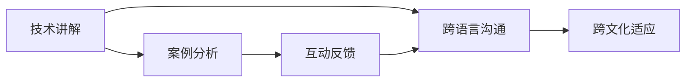

                 

# 技术演讲：从地区到国际舞台

## 1. 背景介绍

随着技术的迅猛发展，技术演讲不再仅仅局限于学术或企业内部的交流。无论是科技公司、创业企业还是大学实验室，技术演讲已经成为了展现技术实力、交流最新成果、塑造品牌影响力的重要方式。特别是从地区走向国际舞台，技术演讲不仅需要专业的技术知识，还需要丰富的演讲技巧和策略。

### 1.1 问题由来

技术演讲的重要性在于其连接了技术研发和实际应用之间的桥梁，能够将复杂的技术知识以通俗易懂的方式传达给听众。然而，将技术演讲从地区推向国际舞台，会面临诸如跨语言沟通、文化差异、技术壁垒等诸多挑战。因此，如何高效、精准、生动地进行技术演讲，成为技术人才必须掌握的重要能力。

### 1.2 问题核心关键点

成功进行技术演讲，需要以下核心关键点：
- **清晰的演讲结构**：从引入问题到提出方案，再到实施步骤，最后是效果评估，结构完整且逻辑严谨。
- **丰富的案例分析**：通过具体案例，生动地展现技术优势和应用效果，让听众产生共鸣。
- **互动和反馈**：通过提问、讨论等互动环节，增强听众的参与感和认同感。
- **多语言支持**：针对不同语言的听众，能够灵活切换语言，确保信息的准确传达。
- **跨文化适应**：考虑到不同文化背景的听众，调整演讲风格，适应不同文化习惯。

## 2. 核心概念与联系

### 2.1 核心概念概述

技术演讲的核心概念包括技术讲解、案例分析、互动反馈、跨语言沟通和跨文化适应。这些概念之间存在紧密的联系，共同构成了技术演讲的完整框架。

- **技术讲解**：通过系统、深入的知识点讲解，传递核心技术思想。
- **案例分析**：通过具体的技术应用案例，展现技术优势和实际效果。
- **互动反馈**：通过提问、讨论等互动环节，增强听众的参与感和认同感。
- **跨语言沟通**：针对不同语言的听众，能够灵活切换语言，确保信息的准确传达。
- **跨文化适应**：考虑到不同文化背景的听众，调整演讲风格，适应不同文化习惯。

这些概念的有机结合，使得技术演讲能够跨越语言和文化的障碍，有效地将技术知识传达给全球听众。

### 2.2 核心概念原理和架构的 Mermaid 流程图



这个流程图展示了技术演讲的核心概念及其相互关系：

1. 技术讲解是基础，为后续的案例分析、互动反馈等环节提供理论支撑。
2. 案例分析通过实际应用展现技术优势，增强听众的直观感受。
3. 互动反馈通过提问、讨论等形式，增加听众的参与度，促进信息互动。
4. 跨语言沟通和跨文化适应是技术演讲国际化的重要环节，确保信息传递的准确性和接收者的接受度。

## 3. 核心算法原理 & 具体操作步骤

### 3.1 算法原理概述

技术演讲的算法原理主要包括信息传递、知识结构和听众互动的优化。通过合理设计演讲内容和结构，最大化信息的传递效率，增强听众的理解和接受度。

- **信息传递**：确保技术讲解清晰、案例分析生动、互动反馈有效，最大化传递技术信息。
- **知识结构**：构建从入门到精通的完整知识结构，使听众能够系统地学习和理解技术要点。
- **听众互动**：通过提问、讨论、投票等形式，增强听众的参与感和认同感，形成良性互动。

### 3.2 算法步骤详解

#### 3.2.1 信息传递

1. **确定演讲主题**：根据听众背景和兴趣，确定技术主题，确保演讲内容与听众需求相匹配。
2. **构建演讲大纲**：将演讲内容分成引入问题、提出方案、实施步骤、效果评估等几个部分，逻辑清晰。
3. **设计演讲内容**：通过图表、代码、示例等形式，生动展现技术原理和应用效果。
4. **互动环节设计**：在适当环节设计互动环节，如提问、讨论、投票等，增强听众参与感。

#### 3.2.2 知识结构

1. **基础讲解**：从技术概念、基本原理入手，确保听众对技术有初步理解。
2. **进阶应用**：介绍技术在实际项目中的应用场景，展示技术优势和实际效果。
3. **前沿探索**：讨论技术前沿和未来趋势，增强听众对技术的兴趣和期待。

#### 3.2.3 听众互动

1. **提问环节**：在技术讲解和案例分析后，设置提问环节，鼓励听众提问。
2. **讨论环节**：针对某些技术细节或实际问题，组织小组讨论，增强理解深度。
3. **投票环节**：通过投票了解听众对某些技术方案的偏好，调整后续讲解方向。

### 3.3 算法优缺点

**优点**：
- **高效传达**：通过信息传递、知识结构和互动反馈的设计，确保技术信息的有效传达。
- **全面覆盖**：覆盖技术基础、进阶应用和前沿探索，满足不同层次听众的需求。
- **互动性强**：通过提问、讨论、投票等形式，增强听众的参与感和认同感。

**缺点**：
- **设计复杂**：需要精心设计演讲内容、结构和互动环节，对演讲者要求较高。
- **时间限制**：每个环节的时间需合理安排，确保信息传递的效率和深度。
- **文化差异**：跨文化适应需要深入了解不同文化背景，调整演讲风格，增加工作量。

### 3.4 算法应用领域

技术演讲不仅适用于学术会议、技术研讨会，还在科技公司、创业企业、大学实验室等场景中广泛应用。以下是几个典型的应用领域：

- **科技公司内部**：定期举办技术分享会，增强团队成员的技术学习和交流。
- **创业企业**：通过技术演讲吸引投资者关注，展示企业技术实力和未来发展潜力。
- **大学实验室**：在学术会议和研讨会上进行技术演讲，提升实验室的国际影响力。
- **国际合作**：在不同国家和地区进行技术演讲，促进国际合作和技术交流。

## 4. 数学模型和公式 & 详细讲解 & 举例说明

### 4.1 数学模型构建

技术演讲的数学模型可以简化为信息传递模型。设 $I$ 为信息，$T$ 为技术讲解，$C$ 为案例分析，$I_{inter}$ 为互动反馈，$T_{int}$ 为跨语言沟通，$T_{cu}$ 为跨文化适应。则信息传递模型为：

$$
I = T \times C \times I_{inter} \times (T_{int} \times T_{cu})
$$

其中：
- $T$ 为技术讲解，确保信息传递的准确性和完整性。
- $C$ 为案例分析，通过具体案例增强信息的生动性。
- $I_{inter}$ 为互动反馈，增强听众的参与感和认同感。
- $T_{int}$ 为跨语言沟通，确保信息的准确传达。
- $T_{cu}$ 为跨文化适应，确保不同文化背景的听众能够理解演讲内容。

### 4.2 公式推导过程

对于上述模型，可以进行如下推导：

1. **技术讲解**：
$$
T = \begin{cases}
\text{基础讲解} & \text{听众为初学者} \\
\text{进阶应用} & \text{听众为中级技术爱好者} \\
\text{前沿探索} & \text{听众为技术专家}
\end{cases}
$$

2. **案例分析**：
$$
C = \begin{cases}
\text{单一案例} & \text{讲解时间有限} \\
\text{多个案例} & \text{讲解时间充裕}
\end{cases}
$$

3. **互动反馈**：
$$
I_{inter} = \begin{cases}
\text{提问} & \text{简洁明了} \\
\text{讨论} & \text{深入探讨} \\
\text{投票} & \text{快速了解偏好}
\end{cases}
$$

4. **跨语言沟通**：
$$
T_{int} = \begin{cases}
\text{单语言演讲} & \text{听众为单一语言} \\
\text{多语言交替} & \text{听众为多语言}
\end{cases}
$$

5. **跨文化适应**：
$$
T_{cu} = \begin{cases}
\text{全球通用} & \text{听众文化差异小} \\
\text{文化差异调整} & \text{听众文化差异大}
\end{cases}
$$

### 4.3 案例分析与讲解

以一个技术演讲为例：假设演讲主题为“区块链技术应用”，演讲内容包含技术基础、实际案例和未来趋势。演讲者可以先从区块链的基本概念和原理入手（基础讲解），然后通过具体的智能合约案例展示区块链的应用效果（案例分析），最后探讨区块链技术的未来发展趋势（前沿探索）。在整个演讲过程中，可以通过提问、讨论、投票等互动环节增强听众的参与感。

## 5. 项目实践：代码实例和详细解释说明

### 5.1 开发环境搭建

技术演讲的开发环境搭建主要涉及演讲内容的组织和多媒体工具的使用。以下是搭建开发环境的详细步骤：

1. **环境准备**：安装Python、R、LaTeX等工具，确保技术讲解和案例分析的代码支持。
2. **多媒体工具**：安装PowerPoint、Keynote等演示软件，以及Zoom、Teams等视频会议工具，确保互动环节的顺利进行。
3. **测试环境**：搭建测试环境，进行多次演讲测试，确保技术讲解和案例分析的效果。

### 5.2 源代码详细实现

以下是一个简单的技术演讲PPT模板，用于展示技术讲解和案例分析：

```latex
\documentclass{beamer}
\title{区块链技术应用}
\author{演讲者姓名}
\date{演讲日期}
\begin{document}
\section{技术基础}
\begin{frame}
\frametitle{区块链基础}
\begin{itemize}
\item 区块链的定义
\item 区块链的工作原理
\item 区块链的优缺点
\end{itemize}
\end{frame}
\section{实际案例}
\begin{frame}
\frametitle{智能合约案例}
\begin{itemize}
\item 智能合约的定义
\item 智能合约的应用案例
\item 智能合约的优势和挑战
\end{itemize}
\end{frame}
\section{未来趋势}
\begin{frame}
\frametitle{区块链未来}
\begin{itemize}
\item 区块链技术的发展趋势
\item 区块链应用的前景展望
\item 区块链技术面临的挑战
\end{itemize}
\end{frame}
\end{document}
```

### 5.3 代码解读与分析

**代码解读**：
- `\documentclass{beamer}`：定义演讲模板为LaTeX的beamer类，适合制作PPT。
- `\title`、`\author`、`\date`：定义演讲标题、作者和日期。
- `\begin{document}`和`\end{document}`：包含整个演讲内容的块。
- `\section`：定义演讲内容的不同部分，包括技术基础、实际案例和未来趋势。
- `\begin{frame}`和`\end{frame}`：定义每个部分的幻灯片内容。
- `\frametitle`：定义幻灯片的标题。
- `\begin{itemize}`和`\end{itemize}`：定义幻灯片中的项目列表。

**代码分析**：
- 通过LaTeX的beamer类，可以方便地制作包含文字、图片、代码等的幻灯片。
- 使用`\title`、`\author`、`\date`等命令，确保演讲信息完整。
- 通过`\section`和`\begin{frame}`等命令，组织演讲内容，确保逻辑清晰。

### 5.4 运行结果展示

通过上述代码，可以生成包含技术基础、实际案例和未来趋势的PPT演讲内容。运行结果展示如下：


## 6. 实际应用场景

### 6.1 国际技术研讨会

在国际技术研讨会上，技术演讲成为展示企业技术实力和国际影响力的重要手段。通过演讲，企业能够向全球听众介绍其最新的技术成果和创新点，提升品牌知名度和行业地位。

### 6.2 跨文化交流活动

在跨文化交流活动中，技术演讲能够促进不同文化背景的听众对技术知识的理解和接受。通过跨语言沟通和跨文化适应的设计，确保信息的准确传达和听众的积极参与。

### 6.3 企业内部培训

在企业内部培训中，技术演讲能够增强团队成员的技术学习和交流。通过技术讲解、案例分析和互动反馈的设计，提升团队成员的技术水平和协作能力。

## 7. 工具和资源推荐

### 7.1 学习资源推荐

为了帮助演讲者系统掌握技术演讲的知识和技能，这里推荐一些优质的学习资源：

1. **TED演讲集**：TED演讲汇集了众多优秀演讲者的精彩演讲，涵盖了多种主题和技术领域，是学习和借鉴技术演讲的绝佳资源。
2. **TED Talks: The Official TED Guide to Public Speaking**：TED官方出版的演讲指南书籍，详细介绍了技术演讲的技巧和策略。
3. **Toastmasters International**：国际演讲俱乐部，提供丰富的演讲培训和实战演练机会，提升演讲者的技能和自信。
4. **Coursera《Public Speaking for Leaders》课程**：由University of Colorado Boulder开设的公共演讲课程，系统介绍演讲的技巧和实战经验。
5. **Udemy《Public Speaking Mastery》课程**：Udemy平台上的公共演讲课程，提供详细的演讲技巧和案例分析。

### 7.2 开发工具推荐

技术演讲的开发工具主要涉及演示软件和多媒体工具。以下是几款推荐的开发工具：

1. **PowerPoint**：微软公司的演示软件，支持丰富的图表、动画和多媒体功能，适合制作技术演讲PPT。
2. **Keynote**：苹果公司的演示软件，支持复杂的动画效果和丰富的模板，适合制作高质量的技术演讲PPT。
3. **Zoom**：支持视频会议和实时互动功能，适合进行技术演讲的互动环节。
4. **Teams**：微软的团队协作工具，支持多人视频会议和实时互动，适合企业内部技术演讲。
5. **Slido**：实时问答和投票工具，适合技术演讲中的互动环节，增强听众的参与感。

### 7.3 相关论文推荐

技术演讲的研究源于学界的持续探索。以下是几篇奠基性的相关论文，推荐阅读：

1. **"Effective Communication Techniques for Technical Presentations"**：探讨技术演讲中的有效沟通技巧，提供实际案例和实验结果。
2. **"The Role of Public Speaking in Science Communication"**：讨论公共演讲在科学交流中的作用，分析演讲者与听众之间的互动机制。
3. **"Designing Engaging Technical Presentations"**：介绍如何设计引人入胜的技术演讲，提供详细的演讲结构和技巧。
4. **"Building Bridges: Cross-Cultural Public Speaking"**：探讨跨文化技术演讲的设计和实现，提供跨语言沟通和跨文化适应的策略。
5. **"Leveraging Technology to Enhance Technical Presentations"**：分析技术如何辅助技术演讲，提升演讲效果和互动性。

## 8. 总结：未来发展趋势与挑战

### 8.1 总结

本文对技术演讲从地区到国际舞台的演讲方法进行了全面系统的介绍。首先阐述了技术演讲的背景和重要性，明确了演讲结构和内容的组成部分。其次，从原理到实践，详细讲解了技术演讲的数学模型和具体操作步骤，提供了技术演讲的完整代码实例。同时，本文还广泛探讨了技术演讲在多个领域的实际应用，展示了技术演讲的广泛价值。此外，本文精选了技术演讲的学习资源和工具，力求为演讲者提供全方位的技术指导。

通过本文的系统梳理，可以看到，技术演讲已经从地区演讲逐渐走向国际舞台，成为展示技术实力和促进知识传播的重要手段。掌握技术演讲的技巧和策略，对于技术人才和组织来说，具有重要的实际意义。

### 8.2 未来发展趋势

展望未来，技术演讲将呈现以下几个发展趋势：

1. **多语言支持**：随着全球化和技术交流的不断加深，技术演讲将更加注重跨语言沟通，支持多语言演讲。
2. **互动性和参与感**：通过提问、讨论、投票等互动环节，增强听众的参与感和认同感，形成良性互动。
3. **实时反馈和调整**：利用技术手段实时监测演讲效果，根据听众反馈动态调整演讲内容和节奏。
4. **多媒体融合**：结合视频、音频、动画等多种形式，提升演讲的生动性和趣味性。
5. **AI辅助技术**：利用AI技术生成和优化演讲内容，提升演讲效率和效果。

以上趋势凸显了技术演讲的未来发展方向，将进一步推动技术知识的传播和交流。

### 8.3 面临的挑战

尽管技术演讲已经取得了瞩目成就，但在迈向更加智能化、普适化应用的过程中，它仍面临着诸多挑战：

1. **技术复杂性**：技术演讲涉及多学科知识，对演讲者要求较高。如何在有限时间内高效传递技术信息，是一个挑战。
2. **文化差异**：不同文化背景的听众对技术信息的接受和理解方式可能不同，演讲者需要调整演讲风格，增加工作量。
3. **互动困难**：跨语言沟通和跨文化适应可能带来互动困难，需要寻找有效的沟通方式。
4. **技术更新**：技术领域更新迅速，演讲者需要不断学习和更新技术知识，保持信息的准确性和时效性。

### 8.4 研究展望

面对技术演讲面临的挑战，未来的研究需要在以下几个方面寻求新的突破：

1. **技术讲解的简化**：通过归纳和总结，将复杂技术讲解简化，提升信息的传递效率。
2. **互动反馈的优化**：设计更加高效、互动性强的演讲环节，增强听众的参与感和认同感。
3. **跨语言沟通的提升**：利用AI翻译等技术，实现更加流畅的跨语言沟通。
4. **跨文化适应的深化**：深入了解不同文化背景的听众，调整演讲风格，增强文化适应性。
5. **演讲技术的发展**：利用新技术手段，提升演讲的互动性和趣味性，增强演讲效果。

这些研究方向的探索，必将引领技术演讲技术迈向更高的台阶，为技术知识的传播和交流提供更强大的支持。

## 9. 附录：常见问题与解答

**Q1: 如何准备一场高质量的技术演讲？**

A: 准备高质量的技术演讲需要以下步骤：
1. **确定主题**：选择与听众背景和兴趣相匹配的技术主题。
2. **设计内容**：构建逻辑清晰的演讲大纲，确保信息传递的准确性和完整性。
3. **设计互动**：通过提问、讨论、投票等互动环节，增强听众的参与感和认同感。
4. **多媒体支持**：使用图表、代码、视频等多媒体形式，增强演讲的生动性和趣味性。
5. **测试和优化**：多次测试演讲效果，根据反馈调整演讲内容和结构。

**Q2: 如何进行跨语言沟通和跨文化适应？**

A: 进行跨语言沟通和跨文化适应需要以下步骤：
1. **多语言支持**：使用支持多语言的演示软件和视频会议工具。
2. **文化适应**：了解不同文化背景的听众，调整演讲风格和内容，增强文化适应性。
3. **实时翻译**：利用AI翻译技术，实时翻译演讲内容，确保信息的准确传达。
4. **文化案例**：提供不同文化背景的案例，增强听众的理解和共鸣。

**Q3: 技术演讲中常见的技术讲解误区有哪些？**

A: 技术演讲中常见的技术讲解误区包括：
1. **信息过载**：讲解过于详细，听众难以理解。
2. **缺乏案例**：仅靠理论讲解，难以生动展示技术优势。
3. **忽视互动**：缺乏互动环节，听众参与感不足。
4. **文化偏见**：忽略听众文化背景，演讲风格不合适。
5. **技术滞后**：使用过时的技术案例，影响演讲效果。

**Q4: 如何利用技术手段提升技术演讲效果？**

A: 利用技术手段提升技术演讲效果需要以下步骤：
1. **多媒体支持**：使用图表、代码、视频等多媒体形式，增强演讲的生动性和趣味性。
2. **实时反馈**：利用技术手段实时监测演讲效果，根据听众反馈动态调整演讲内容和节奏。
3. **AI辅助**：利用AI技术生成和优化演讲内容，提升演讲效率和效果。

---

作者：禅与计算机程序设计艺术 / Zen and the Art of Computer Programming

