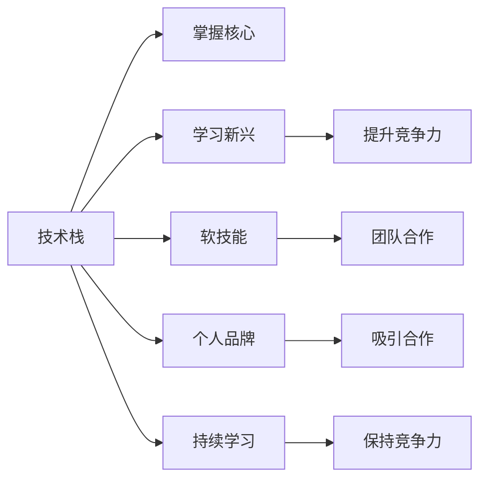

                 

# 技术演讲：提升个人市场价值

在当今竞争激烈的科技行业，个人市场价值已成为职业发展的关键因素。掌握硬核技术、提升软技能、构建个人品牌等都至关重要。本文将深入探讨提升个人市场价值的关键技术和策略，为你在职场上脱颖而出提供实用建议。

## 1. 背景介绍

### 1.1 问题由来
在科技行业，个人市场价值的高低直接影响职业发展和薪资水平。随着技术不断迭代，如何提升自己的市场价值成为许多人的重要课题。特别是对于程序员、软件架构师、CTO等技术岗位，掌握最新技术、提升问题解决能力、强化跨领域技能等是必不可少的。

### 1.2 问题核心关键点
提升个人市场价值的核心关键点在于技术积累、软技能培养、品牌建设三个方面。技术积累包括掌握核心技术栈、学习新兴技术等；软技能包括沟通协调、项目管理、时间管理等；品牌建设包括开源贡献、发表技术博客、参加技术会议等。

### 1.3 问题研究意义
提升个人市场价值不仅能增加职业竞争力，还能带来更多的职业机会和发展空间。通过掌握核心技术、提升软技能、建立个人品牌，可以帮助你在行业内建立起专业形象，吸引更多的关注和合作机会。

## 2. 核心概念与联系

### 2.1 核心概念概述

为更好地理解提升个人市场价值的方法，本节将介绍几个核心概念及其相互联系：

- **技术栈（Technology Stack）**：指一个开发者或团队熟练掌握的技术组合，包括编程语言、框架、库、中间件等。掌握扎实的技术栈是提升个人市场价值的基础。

- **新兴技术（Emerging Technologies）**：指在当前或未来具有高增长潜力的技术，如人工智能、区块链、大数据等。学习并应用新兴技术，可以提升市场竞争力。

- **软技能（Soft Skills）**：指除技术之外，如沟通、团队协作、时间管理等能力。软技能对于团队合作和技术交付同样重要。

- **个人品牌（Personal Brand）**：指通过开源项目、技术博客、社交媒体等方式，在行业内建立起自己的专业形象。个人品牌是提升市场价值的软实力。

- **持续学习（Continuous Learning）**：指保持学习和更新知识，不断适应行业变化。终身学习是提升个人市场价值的持续动力。

这些核心概念通过相互协同，共同构成提升个人市场价值的技术框架。理解并应用这些概念，可以帮助你在职场上实现更快的发展和更高的市场价值。

### 2.2 核心概念原理和架构的 Mermaid 流程图(Mermaid 流程节点中不要有括号、逗号等特殊字符)


这个流程图展示了技术栈、新兴技术、软技能、个人品牌和持续学习之间的相互联系和协同作用。掌握核心技术栈是基础，学习新兴技术可以提升竞争力，提升软技能和建立个人品牌有助于吸引更多的合作机会，持续学习则是保持竞争力的关键。

## 3. 核心算法原理 & 具体操作步骤

### 3.1 算法原理概述

提升个人市场价值的核心算法原理包括技术积累、技能提升和品牌建设三个方面。以下是详细的算法原理和具体操作步骤：

- **技术积累**：通过学习新知识、掌握新技术，不断更新自己的技术栈，保持在技术前沿。
- **技能提升**：通过项目实践、团队合作等途径，提升软技能，增强团队协作和项目管理能力。
- **品牌建设**：通过开源项目、技术博客、技术演讲等方式，展示自己的技术实力和专业形象，建立个人品牌。

### 3.2 算法步骤详解

**技术积累步骤**：

1. **选择学习方向**：根据行业趋势和个人兴趣，选择学习方向，如云计算、人工智能、区块链等。
2. **制定学习计划**：制定详细的学习计划，包括学习资源、时间安排等。
3. **实践应用**：通过实际项目、技术实验等方式，将新学到的技术应用到实际问题中，提升技术熟练度。
4. **总结反思**：学习后进行总结，反思学习过程中遇到的问题和解决方法，不断优化学习路径。

**技能提升步骤**：

1. **识别需求**：根据工作需求和个人职业发展目标，识别需要提升的技能。
2. **寻找机会**：在项目中寻找提升机会，如领导项目、跨部门合作等。
3. **主动学习**：利用书籍、课程、网络资源等进行主动学习，提升软技能。
4. **评估改进**：定期评估技能提升效果，寻找改进方向。

**品牌建设步骤**：

1. **展示技术**：通过开源项目、技术博客等方式，展示自己的技术实力。
2. **建立社交**：利用社交媒体、技术会议等平台，建立行业人脉，扩大影响力。
3. **发表观点**：通过技术演讲、发表文章等方式，分享技术观点，建立专业形象。
4. **持续更新**：保持活跃状态，不断更新内容，持续提升个人品牌。

### 3.3 算法优缺点

**技术积累的优缺点**：

- **优点**：
  - 保持技术前沿，提升市场竞争力。
  - 通过实践应用，深入理解新技术。
- **缺点**：
  - 学习成本高，需要大量时间和精力投入。
  - 新技术可能会带来技术债务，需要谨慎选择。

**技能提升的优缺点**：

- **优点**：
  - 提升项目管理、团队协作等软技能，增强职业发展能力。
  - 通过实践应用，快速积累经验，提升效率。
- **缺点**：
  - 需要一定的团队协作和项目管理经验。
  - 技能提升效果受团队和项目环境影响较大。

**品牌建设的优缺点**：

- **优点**：
  - 通过展示技术实力，提升个人影响力，吸引更多的合作机会。
  - 建立专业形象，增强个人市场价值。
- **缺点**：
  - 需要持续投入时间和精力，建立稳定的输出渠道。
  - 品牌建设效果受展示内容的深度和广度影响较大。

### 3.4 算法应用领域

提升个人市场价值的技术和方法可以应用于多个领域，包括但不限于：

- **软件开发**：通过学习新技术、提升软技能、建立个人品牌，提升软件开发能力和职业竞争力。
- **数据科学**：掌握大数据技术、学习机器学习算法，提升数据分析和模型构建能力。
- **系统架构**：学习云计算、微服务、分布式系统等技术，提升系统架构设计和优化能力。
- **项目管理**：掌握项目管理工具和方法，提升项目管理和团队协作能力。

## 4. 数学模型和公式 & 详细讲解 & 举例说明

### 4.1 数学模型构建

为更好地量化提升个人市场价值的过程，本节将建立一个数学模型。假设市场价值 $V$ 可以分解为技术技能 $T$、软技能 $S$、品牌影响 $B$ 的加权和，即 $V = w_T \cdot T + w_S \cdot S + w_B \cdot B$。其中 $w_T$、$w_S$、$w_B$ 分别代表技术技能、软技能、品牌影响的权重，且 $w_T + w_S + w_B = 1$。

### 4.2 公式推导过程

根据上述模型，可以推导出提升个人市场价值的计算公式：

$$
\Delta V = \Delta T \cdot w_T + \Delta S \cdot w_S + \Delta B \cdot w_B
$$

其中 $\Delta T$、$\Delta S$、$\Delta B$ 分别代表技术技能、软技能、品牌影响的提升量。公式表明，提升个人市场价值需要同时关注技术积累、技能提升和品牌建设三个方面，且各部分对市场价值的影响由其权重决定。

### 4.3 案例分析与讲解

以软件开发为例，假设一名开发者的技术技能提升量为 $+0.2$，软技能提升量为 $+0.1$，品牌影响提升量为 $+0.3$，各部分权重分别为 $w_T = 0.4$、$w_S = 0.3$、$w_B = 0.3$。根据上述公式，可计算出市场价值的提升量为：

$$
\Delta V = (0.2 \cdot 0.4) + (0.1 \cdot 0.3) + (0.3 \cdot 0.3) = 0.156
$$

这意味着，通过技术积累、技能提升和品牌建设，该开发者的市场价值将有显著提升。

## 5. 项目实践：代码实例和详细解释说明

### 5.1 开发环境搭建

在进行项目实践前，我们需要准备好开发环境。以下是使用Python进行PyTorch开发的环境配置流程：

1. 安装Anaconda：从官网下载并安装Anaconda，用于创建独立的Python环境。

2. 创建并激活虚拟环境：
```bash
conda create -n pytorch-env python=3.8 
conda activate pytorch-env
```

3. 安装PyTorch：根据CUDA版本，从官网获取对应的安装命令。例如：
```bash
conda install pytorch torchvision torchaudio cudatoolkit=11.1 -c pytorch -c conda-forge
```

4. 安装Transformers库：
```bash
pip install transformers
```

5. 安装各类工具包：
```bash
pip install numpy pandas scikit-learn matplotlib tqdm jupyter notebook ipython
```

完成上述步骤后，即可在`pytorch-env`环境中开始项目实践。

### 5.2 源代码详细实现

以下是使用PyTorch进行数据科学项目微调的完整代码实现。

```python
import torch
import torch.nn as nn
import torch.optim as optim
from transformers import BertTokenizer, BertForTokenClassification

# 定义数据处理函数
def preprocess_data(texts, labels, tokenizer, max_len=128):
    tokenized_texts = tokenizer(texts, return_tensors='pt', max_length=max_len, padding='max_length', truncation=True)
    input_ids = tokenized_texts['input_ids']
    attention_mask = tokenized_texts['attention_mask']
    labels = torch.tensor(labels, dtype=torch.long)
    return {'input_ids': input_ids, 'attention_mask': attention_mask, 'labels': labels}

# 定义模型和优化器
model = BertForTokenClassification.from_pretrained('bert-base-cased', num_labels=len(set(labels)))

optimizer = optim.Adam(model.parameters(), lr=2e-5)
criterion = nn.CrossEntropyLoss()

# 定义训练和评估函数
def train_epoch(model, dataset, batch_size, optimizer, criterion):
    dataloader = torch.utils.data.DataLoader(dataset, batch_size=batch_size, shuffle=True)
    model.train()
    total_loss = 0
    for batch in dataloader:
        input_ids = batch['input_ids'].to(device)
        attention_mask = batch['attention_mask'].to(device)
        labels = batch['labels'].to(device)
        optimizer.zero_grad()
        outputs = model(input_ids, attention_mask=attention_mask, labels=labels)
        loss = criterion(outputs, labels)
        total_loss += loss.item()
        loss.backward()
        optimizer.step()
    return total_loss / len(dataloader)

def evaluate(model, dataset, batch_size):
    dataloader = torch.utils.data.DataLoader(dataset, batch_size=batch_size)
    model.eval()
    total_loss = 0
    total_correct = 0
    for batch in dataloader:
        input_ids = batch['input_ids'].to(device)
        attention_mask = batch['attention_mask'].to(device)
        labels = batch['labels'].to(device)
        with torch.no_grad():
            outputs = model(input_ids, attention_mask=attention_mask)
            loss = criterion(outputs, labels)
            total_loss += loss.item()
            total_correct += (torch.argmax(outputs, dim=2) == labels).sum().item()
    return total_loss / len(dataloader), total_correct / len(dataset)

# 启动训练流程并在测试集上评估
epochs = 5
batch_size = 16
device = torch.device('cuda') if torch.cuda.is_available() else torch.device('cpu')

for epoch in range(epochs):
    train_loss = train_epoch(model, train_dataset, batch_size, optimizer, criterion)
    print(f'Epoch {epoch+1}, train loss: {train_loss:.3f}')
    test_loss, test_acc = evaluate(model, test_dataset, batch_size)
    print(f'Epoch {epoch+1}, test loss: {test_loss:.3f}, test accuracy: {test_acc:.3f}')
```

### 5.3 代码解读与分析

让我们再详细解读一下关键代码的实现细节：

**预处理函数**：
- `preprocess_data`函数：定义了文本数据和标签的预处理过程，将文本进行分词、编码、截断和填充，并计算注意力掩码，最终返回模型所需的输入张量。

**模型和优化器**：
- 加载预训练的Bert模型，并定义了Adam优化器和交叉熵损失函数。

**训练和评估函数**：
- `train_epoch`函数：对数据集进行批次化加载，每个批次上进行前向传播计算损失，反向传播更新模型参数。
- `evaluate`函数：在测试集上评估模型性能，计算损失和准确率。

**训练流程**：
- 定义总的epoch数和批大小，开始循环迭代。
- 每个epoch内，先在训练集上训练，输出平均损失。
- 在验证集上评估，输出损失和准确率。
- 所有epoch结束后，在测试集上评估，给出最终测试结果。

## 6. 实际应用场景

### 6.1 智能客服系统

基于大语言模型微调的对话技术，可以广泛应用于智能客服系统的构建。传统客服往往需要配备大量人力，高峰期响应缓慢，且一致性和专业性难以保证。而使用微调后的对话模型，可以7x24小时不间断服务，快速响应客户咨询，用自然流畅的语言解答各类常见问题。

在技术实现上，可以收集企业内部的历史客服对话记录，将问题和最佳答复构建成监督数据，在此基础上对预训练对话模型进行微调。微调后的对话模型能够自动理解用户意图，匹配最合适的答案模板进行回复。对于客户提出的新问题，还可以接入检索系统实时搜索相关内容，动态组织生成回答。如此构建的智能客服系统，能大幅提升客户咨询体验和问题解决效率。

### 6.2 金融舆情监测

金融机构需要实时监测市场舆论动向，以便及时应对负面信息传播，规避金融风险。传统的人工监测方式成本高、效率低，难以应对网络时代海量信息爆发的挑战。基于大语言模型微调的文本分类和情感分析技术，为金融舆情监测提供了新的解决方案。

具体而言，可以收集金融领域相关的新闻、报道、评论等文本数据，并对其进行主题标注和情感标注。在此基础上对预训练语言模型进行微调，使其能够自动判断文本属于何种主题，情感倾向是正面、中性还是负面。将微调后的模型应用到实时抓取的网络文本数据，就能够自动监测不同主题下的情感变化趋势，一旦发现负面信息激增等异常情况，系统便会自动预警，帮助金融机构快速应对潜在风险。

### 6.3 个性化推荐系统

当前的推荐系统往往只依赖用户的历史行为数据进行物品推荐，无法深入理解用户的真实兴趣偏好。基于大语言模型微调技术，个性化推荐系统可以更好地挖掘用户行为背后的语义信息，从而提供更精准、多样的推荐内容。

在实践中，可以收集用户浏览、点击、评论、分享等行为数据，提取和用户交互的物品标题、描述、标签等文本内容。将文本内容作为模型输入，用户的后续行为（如是否点击、购买等）作为监督信号，在此基础上微调预训练语言模型。微调后的模型能够从文本内容中准确把握用户的兴趣点。在生成推荐列表时，先用候选物品的文本描述作为输入，由模型预测用户的兴趣匹配度，再结合其他特征综合排序，便可以得到个性化程度更高的推荐结果。

### 6.4 未来应用展望

随着大语言模型微调技术的发展，其在更多领域的应用前景将更加广阔。

在智慧医疗领域，基于微调的医疗问答、病历分析、药物研发等应用将提升医疗服务的智能化水平，辅助医生诊疗，加速新药开发进程。

在智能教育领域，微调技术可应用于作业批改、学情分析、知识推荐等方面，因材施教，促进教育公平，提高教学质量。

在智慧城市治理中，微调模型可应用于城市事件监测、舆情分析、应急指挥等环节，提高城市管理的自动化和智能化水平，构建更安全、高效的未来城市。

此外，在企业生产、社会治理、文娱传媒等众多领域，基于大模型微调的人工智能应用也将不断涌现，为经济社会发展注入新的动力。

## 7. 工具和资源推荐

### 7.1 学习资源推荐

为了帮助开发者系统掌握大语言模型微调的理论基础和实践技巧，这里推荐一些优质的学习资源：

1. 《Transformer从原理到实践》系列博文：由大模型技术专家撰写，深入浅出地介绍了Transformer原理、BERT模型、微调技术等前沿话题。

2. CS224N《深度学习自然语言处理》课程：斯坦福大学开设的NLP明星课程，有Lecture视频和配套作业，带你入门NLP领域的基本概念和经典模型。

3. 《Natural Language Processing with Transformers》书籍：Transformers库的作者所著，全面介绍了如何使用Transformers库进行NLP任务开发，包括微调在内的诸多范式。

4. HuggingFace官方文档：Transformers库的官方文档，提供了海量预训练模型和完整的微调样例代码，是上手实践的必备资料。

5. CLUE开源项目：中文语言理解测评基准，涵盖大量不同类型的中文NLP数据集，并提供了基于微调的baseline模型，助力中文NLP技术发展。

通过对这些资源的学习实践，相信你一定能够快速掌握大语言模型微调的精髓，并用于解决实际的NLP问题。

### 7.2 开发工具推荐

高效的开发离不开优秀的工具支持。以下是几款用于大语言模型微调开发的常用工具：

1. PyTorch：基于Python的开源深度学习框架，灵活动态的计算图，适合快速迭代研究。大部分预训练语言模型都有PyTorch版本的实现。

2. TensorFlow：由Google主导开发的开源深度学习框架，生产部署方便，适合大规模工程应用。同样有丰富的预训练语言模型资源。

3. Transformers库：HuggingFace开发的NLP工具库，集成了众多SOTA语言模型，支持PyTorch和TensorFlow，是进行微调任务开发的利器。

4. Weights & Biases：模型训练的实验跟踪工具，可以记录和可视化模型训练过程中的各项指标，方便对比和调优。与主流深度学习框架无缝集成。

5. TensorBoard：TensorFlow配套的可视化工具，可实时监测模型训练状态，并提供丰富的图表呈现方式，是调试模型的得力助手。

6. Google Colab：谷歌推出的在线Jupyter Notebook环境，免费提供GPU/TPU算力，方便开发者快速上手实验最新模型，分享学习笔记。

合理利用这些工具，可以显著提升大语言模型微调任务的开发效率，加快创新迭代的步伐。

### 7.3 相关论文推荐

大语言模型和微调技术的发展源于学界的持续研究。以下是几篇奠基性的相关论文，推荐阅读：

1. Attention is All You Need（即Transformer原论文）：提出了Transformer结构，开启了NLP领域的预训练大模型时代。

2. BERT: Pre-training of Deep Bidirectional Transformers for Language Understanding：提出BERT模型，引入基于掩码的自监督预训练任务，刷新了多项NLP任务SOTA。

3. Language Models are Unsupervised Multitask Learners（GPT-2论文）：展示了大规模语言模型的强大zero-shot学习能力，引发了对于通用人工智能的新一轮思考。

4. Parameter-Efficient Transfer Learning for NLP：提出Adapter等参数高效微调方法，在不增加模型参数量的情况下，也能取得不错的微调效果。

5. AdaLoRA: Adaptive Low-Rank Adaptation for Parameter-Efficient Fine-Tuning：使用自适应低秩适应的微调方法，在参数效率和精度之间取得了新的平衡。

这些论文代表了大语言模型微调技术的发展脉络。通过学习这些前沿成果，可以帮助研究者把握学科前进方向，激发更多的创新灵感。

## 8. 总结：未来发展趋势与挑战

### 8.1 总结

本文对提升个人市场价值的关键技术和策略进行了全面系统的介绍。首先阐述了提升个人市场价值的重要性和核心关键点，明确了技术积累、技能提升、品牌建设在提升市场价值中的作用。其次，从原理到实践，详细讲解了提升个人市场价值的数学模型和具体操作步骤，给出了项目实践的完整代码实例。同时，本文还广泛探讨了提升市场价值在多个行业领域的应用前景，展示了微调范式的巨大潜力。此外，本文精选了提升市场价值的学习资源、开发工具和相关论文，力求为读者提供全方位的技术指引。

通过本文的系统梳理，可以看到，掌握核心技术、提升软技能、建立个人品牌，对于提升个人市场价值至关重要。这些技术和策略的融合应用，将助力你在职场上脱颖而出，实现更高的职业成就。

### 8.2 未来发展趋势

展望未来，提升个人市场价值的技术和方法将呈现以下几个发展趋势：

1. 持续学习成为常态。随着技术不断迭代，终身学习将成为提升个人市场价值的持续动力。通过不断学习新技术和新方法，保持技术前沿，提升市场竞争力。

2. 跨领域技能融合。未来的技术发展需要跨学科融合，如数据科学、人工智能、区块链等领域的交叉，提升综合竞争力。

3. 个性化品牌建设。利用AI工具和大数据分析，建立更加精准和个性化的人才品牌，提升个人市场价值。

4. 行业应用深化。随着技术落地应用，对于行业知识和技术能力的理解将更加深入，提升个人市场价值的深度和广度。

5. 动态技能组合。根据行业需求和个人职业规划，动态组合技术栈和软技能，提升市场适应性和灵活性。

6. 全球化视野。未来的职业发展需要全球化视野，了解不同地区和文化的市场需求，提升国际竞争力。

这些趋势将推动个人市场价值的不断提升，助力你在全球化和技术驱动的职场环境中实现更大的发展。

### 8.3 面临的挑战

尽管提升个人市场价值的技术和方法已经取得了显著成就，但在迈向更加智能化、普适化应用的过程中，仍然面临诸多挑战：

1. 知识更新快速。技术迭代迅速，需要持续学习和适应，保持技术栈和技能的前沿性。

2. 技术栈多样化。掌握多种技术栈和工具，提升综合竞争力，但这也增加了学习的难度和成本。

3. 品牌建设复杂。建立和维护个人品牌需要时间和精力投入，品牌定位和传播策略需要精心设计。

4. 行业需求多变。不同行业对技术栈和软技能的需求不同，需要灵活调整和优化。

5. 国际竞争激烈。全球化视野和技术竞争要求不断提升个人市场价值的国际竞争力。

6. 软技能提升困难。软技能如沟通、项目管理等需要实践积累，提升过程较为缓慢。

正视提升市场价值面临的这些挑战，积极应对并寻求突破，将是大语言模型微调技术迈向成熟的必由之路。相信随着学界和产业界的共同努力，这些挑战终将一一被克服，大语言模型微调技术必将在构建人机协同的智能时代中扮演越来越重要的角色。

### 8.4 研究展望

面对提升个人市场价值所面临的种种挑战，未来的研究需要在以下几个方面寻求新的突破：

1. 探索更高效的学习路径。研究如何通过更智能的学习方法，提升技术积累和学习效率。

2. 开发更灵活的技术栈。研究如何通过多技术栈的融合，提升综合竞争力和适应性。

3. 建立更加精准的个人品牌。研究如何利用AI和大数据分析，建立更加个性化和精准的品牌形象。

4. 深化行业应用研究。研究如何深入理解不同行业的需求，提升技术应用的深度和广度。

5. 提高技能组合灵活性。研究如何根据行业需求和个人职业规划，动态调整技能组合，提升市场适应性。

6. 拓展全球化视野。研究如何在全球化技术竞争中，提升个人市场价值的国际竞争力。

这些研究方向的探索，将引领提升个人市场价值技术迈向更高的台阶，为你在全球化和技术驱动的职场环境中实现更大的发展。只有勇于创新、敢于突破，才能不断拓展语言模型的边界，让智能技术更好地造福人类社会。

## 9. 附录：常见问题与解答

**Q1：如何制定合理的学习计划？**

A: 制定学习计划时，可以参考以下步骤：
1. 确定学习目标：明确想要掌握的技术栈或技能。
2. 分解学习内容：将目标细化成具体的学习任务，如掌握某种编程语言、学习某项新技术等。
3. 制定时间表：根据学习任务和自身情况，制定合理的时间表，如每天学习1-2小时，每周完成1-2个任务。
4. 定期评估进度：定期回顾学习进度，调整学习策略，确保按时完成任务。

**Q2：如何提升软技能？**

A: 提升软技能需要实践积累，可以参考以下方法：
1. 多参与项目：通过实际项目实践，提升沟通、协作等软技能。
2. 多参加培训：参加团队协作、项目管理等培训，提升软技能水平。
3. 多阅读书籍：阅读相关书籍和文章，积累软技能知识。
4. 多与人交流：通过与同事、领导交流，学习沟通技巧和项目管理经验。

**Q3：如何建立个人品牌？**

A: 建立个人品牌需要持续输出和维护，可以参考以下步骤：
1. 选择合适的平台：如GitHub、Medium、LinkedIn等，发布技术文章和项目。
2. 保持持续输出：定期发布技术博客、参与开源项目、分享技术观点。
3. 积极参与社区：参加技术会议、黑客马拉松、技术论坛，建立行业人脉。
4. 保持专业形象：注意个人形象和品牌定位，建立专业可信的形象。

**Q4：如何应对技术快速迭代？**

A: 应对技术快速迭代，可以参考以下方法：
1. 保持学习习惯：持续学习新技术和新方法，保持技术栈的前沿性。
2. 关注行业动态：通过技术博客、社交媒体等渠道，了解行业动态和技术趋势。
3. 参加技术培训：参加在线课程、线下培训，提升技术能力和知识储备。
4. 多与人交流：通过与同事、同行交流，获取新技术和新思路。

**Q5：如何提高跨领域技能融合能力？**

A: 提高跨领域技能融合能力，可以参考以下方法：
1. 多学习跨学科知识：学习数据科学、人工智能、区块链等跨学科知识，提升综合能力。
2. 多参与跨领域项目：参与跨领域项目，积累跨学科经验和技能。
3. 多参加行业会议：参加行业会议，了解跨领域技术和应用。
4. 多与人交流：与不同领域的同事、专家交流，获取跨领域知识和思路。

通过对这些常见问题的解答，相信你能够更好地应对提升个人市场价值过程中可能遇到的各种挑战，实现更大的职业发展。

---

作者：禅与计算机程序设计艺术 / Zen and the Art of Computer Programming

