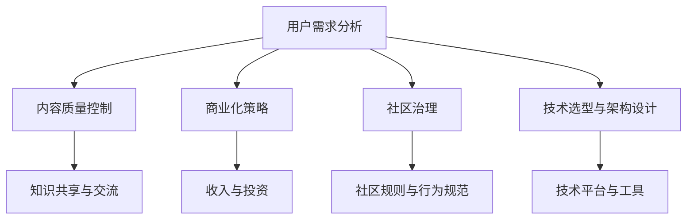

                 

# 技术社区运营：从爱好到事业

## 1. 背景介绍

### 1.1 问题由来
随着互联网的普及和技术的快速发展，技术社区作为一个知识共享和交流的平台，越来越受到技术人员的关注。然而，许多社区运营者面临的问题是，如何从兴趣爱好转型为职业运营，既满足技术爱好者的需求，又能产生商业价值，实现可持续发展的目标。本文将从技术社区的运营角度出发，探讨从爱好到事业的运营策略和路径。

### 1.2 问题核心关键点
技术社区运营的核心在于如何平衡技术爱好与商业化的需求，具体包括以下几个关键点：
- **用户需求分析**：了解社区用户的真实需求，提供有价值的知识分享和交流。
- **内容质量控制**：保证社区内容的质量和相关性，提升用户体验。
- **商业化策略**：通过广告、赞助、付费会员等手段，实现社区的商业化，同时不偏离社区的核心价值。
- **社区治理**：制定合理的社区规则，避免垃圾信息、低质量内容，维护良好的社区氛围。
- **技术选型与架构设计**：选择合适的技术栈和架构，支持社区的快速扩展和稳定运行。

### 1.3 问题研究意义
技术社区的运营不仅能够满足技术爱好者的学习和交流需求，还能通过商业化手段，实现社区的可持续发展，推动技术的普及和应用。这有助于培养更多技术人才，促进技术创新和产业升级，为社会带来积极的效益。

## 2. 核心概念与联系

### 2.1 核心概念概述

技术社区运营涉及多个核心概念，包括用户需求、内容管理、商业化、社区治理和技术架构设计等。这些概念之间相互关联，共同构成了一个完整的技术社区运营体系。

- **用户需求分析**：通过调研、问卷、数据分析等方式，了解社区用户的真实需求，提供有针对性的服务。
- **内容质量控制**：制定严格的内容审核机制，确保内容的质量和相关性，为用户提供高质量的知识分享。
- **商业化策略**：通过广告、赞助、付费会员等手段，实现社区的商业化，支持社区的持续运营。
- **社区治理**：制定合理的社区规则，包括内容审核、用户行为规范等，确保社区的健康有序发展。
- **技术选型与架构设计**：选择合适的技术栈和架构，如开源社区常用的GitHub、GitLab，或企业级的社区管理平台，支持社区的快速扩展和稳定运行。

这些概念之间的逻辑关系可以通过以下Mermaid流程图来展示：



这个流程图展示了下技术社区运营的核心概念及其之间的关系：

1. 用户需求分析是基础，了解用户的需求才能提供有针对性的服务。
2. 内容质量控制是核心，高质量的内容是社区吸引用户的关键。
3. 商业化策略是保障，合理的商业化手段能够支持社区的可持续发展。
4. 社区治理是保证，良好的社区规则和行为规范能够维护社区的健康有序。
5. 技术选型与架构设计是基础，合理的技术选择和架构设计能够支撑社区的快速扩展和稳定运行。

这些概念共同构成了技术社区运营的基本框架，为社区的持续发展提供了坚实的基础。

## 3. 核心算法原理 & 具体操作步骤

### 3.1 算法原理概述

技术社区运营的核心算法原理主要围绕着用户需求分析、内容质量控制、商业化策略和社区治理展开。以下是对这些核心算法原理的详细解释：

- **用户需求分析**：通过数据分析、用户调研等方式，获取社区用户的基本特征、需求偏好等信息。算法原理包括数据收集、数据清洗、特征提取、模式识别等。
- **内容质量控制**：对社区内容进行审核和分类，保证内容的质量和相关性。算法原理包括文本分析、关键词提取、相似度计算、垃圾信息过滤等。
- **商业化策略**：通过广告投放、赞助合作、付费会员等方式，实现社区的商业化。算法原理包括用户行为分析、广告投放优化、定价策略等。
- **社区治理**：制定合理的社区规则，包括内容审核、用户行为规范等。算法原理包括行为建模、异常检测、规则引擎等。

### 3.2 算法步骤详解

以下是对每个核心算法步骤的详细解释：

**Step 1: 用户需求分析**
1. 数据收集：通过问卷、调研、在线互动等方式，收集用户的基本特征、需求偏好等信息。
2. 数据清洗：对收集到的数据进行去重、去噪、补全等预处理。
3. 特征提取：对清洗后的数据进行特征提取，如用户活跃度、兴趣标签等。
4. 模式识别：使用机器学习算法（如聚类、分类、关联规则等），识别用户需求的模式和趋势。

**Step 2: 内容质量控制**
1. 文本分析：对社区内容进行文本分析，提取关键词、主题、情感等信息。
2. 关键词提取：使用TF-IDF、Word2Vec等算法，提取内容的主要关键词。
3. 相似度计算：使用余弦相似度、Jaccard相似度等算法，计算内容之间的相似度。
4. 垃圾信息过滤：使用机器学习算法（如分类器、神经网络等），识别和过滤垃圾信息。

**Step 3: 商业化策略**
1. 用户行为分析：通过数据分析工具（如Google Analytics、Mixpanel等），分析用户行为数据，如浏览、互动、购买等。
2. 广告投放优化：使用A/B测试、多臂老虎机等算法，优化广告投放策略，提升广告效果。
3. 定价策略：使用动态定价算法（如动态定价、拍卖算法等），制定合理的付费会员策略。

**Step 4: 社区治理**
1. 行为建模：使用行为分析算法（如KNN、协同过滤等），建立用户行为模型。
2. 异常检测：使用异常检测算法（如孤立森林、SVM等），检测和过滤异常行为。
3. 规则引擎：构建规则引擎，根据社区规则和用户行为模型，自动执行相应的社区治理措施。

### 3.3 算法优缺点

技术社区运营的核心算法具有以下优点：
1. 高效性：通过自动化算法，能够快速处理大量数据，提高运营效率。
2. 精准性：算法能够精确识别用户需求、内容质量、广告效果等关键指标，实现精准运营。
3. 可扩展性：算法可以适应不同规模的社区运营需求，具有良好的可扩展性。

同时，这些算法也存在一些缺点：
1. 数据依赖性：算法的精准性依赖于高质量的数据输入，数据偏差可能导致算法失效。
2. 模型复杂性：一些高级算法（如深度学习、异常检测等）可能较为复杂，需要较高的技术水平。
3. 用户隐私问题：算法可能涉及用户隐私数据，需要严格遵守相关法律法规。

尽管存在这些局限性，但这些核心算法仍是技术社区运营中不可或缺的重要工具。未来相关研究的重点在于如何进一步提高算法的精度和可解释性，减少对数据的依赖，解决用户隐私问题，从而提升社区运营的智能化水平。

### 3.4 算法应用领域

技术社区运营的核心算法主要应用于以下领域：

- **用户需求分析**：广泛应用于社区运营的各个环节，如用户画像构建、需求调研、内容推荐等。
- **内容质量控制**：适用于社区内容的审核、分类、推荐等场景，如GitHub的代码审核、Stack Overflow的回答推荐等。
- **商业化策略**：适用于广告投放、付费会员、赞助合作等商业化手段，如Slack的广告投放策略、FossHub的付费会员计划等。
- **社区治理**：适用于社区规则制定、异常行为检测、内容审核等场景，如Discourse的内容审核机制、GitHub的代码审核规则等。

这些领域的应用不仅展示了算法的广泛适用性，也凸显了其在技术社区运营中的重要地位。

## 4. 数学模型和公式 & 详细讲解 & 举例说明

### 4.1 数学模型构建

在技术社区运营中，很多问题可以通过数学模型进行建模和求解。以下是对几个核心数学模型的构建和解释：

- **用户需求分析模型**：通过用户行为数据构建用户需求模型，常见的方法包括聚类算法（K-means、层次聚类等）、关联规则算法（Apriori、FP-Growth等）。
- **内容质量控制模型**：通过文本分析构建内容质量模型，常见的方法包括TF-IDF、TextRank、LDA等。
- **商业化策略模型**：通过用户行为数据构建商业化策略模型，常见的方法包括回归分析、决策树、随机森林等。
- **社区治理模型**：通过用户行为数据构建社区治理模型，常见的方法包括KNN、协同过滤、异常检测等。

### 4.2 公式推导过程

以内容质量控制模型为例，展示数学模型的推导过程。

假设社区内容为文本形式，我们可以使用文本相似度算法来计算不同内容之间的相似度。常见的方法包括余弦相似度、Jaccard相似度等。以下是对余弦相似度的推导过程：

设文本A和文本B的向量表示分别为 $A=(a_1,a_2,\cdots,a_n)$ 和 $B=(b_1,b_2,\cdots,b_n)$，则余弦相似度的计算公式为：

$$
\cos\theta(A,B)=\frac{\sum_{i=1}^na_i\cdot b_i}{\sqrt{\sum_{i=1}^n a_i^2}\cdot\sqrt{\sum_{i=1}^n b_i^2}}
$$

其中 $\theta$ 表示向量A和向量B之间的夹角。余弦相似度越大，表示两个向量越相似。

在实际应用中，我们可以将余弦相似度应用于内容相似度计算，从而实现内容推荐、垃圾信息过滤等功能。

### 4.3 案例分析与讲解

以下是一个基于内容质量控制模型的案例分析：

假设我们要构建一个技术社区的内容推荐系统，以提升用户的活跃度和满意度。可以使用余弦相似度算法，计算用户关注的主题与社区内容的相似度。具体步骤如下：

1. 收集社区用户关注的主题和社区内容的关键词。
2. 对关键词进行预处理，去除停用词、进行词干提取等。
3. 构建用户关注主题和社区内容的向量表示。
4. 计算用户关注主题与社区内容的余弦相似度。
5. 根据相似度大小，对社区内容进行排序，推荐给用户。

通过上述过程，我们可以实现精准的内容推荐，提升用户的满意度和社区的活跃度。

## 5. 项目实践：代码实例和详细解释说明

### 5.1 开发环境搭建

在进行技术社区运营的实践前，我们需要准备好开发环境。以下是使用Python进行Flask框架开发的环境配置流程：

1. 安装Anaconda：从官网下载并安装Anaconda，用于创建独立的Python环境。

2. 创建并激活虚拟环境：
```bash
conda create -n flask-env python=3.8 
conda activate flask-env
```

3. 安装Flask：从官网获取Flask框架及其依赖库。例如：
```bash
conda install flask Flask-SocketIO
```

4. 安装各类工具包：
```bash
pip install numpy pandas scikit-learn matplotlib tqdm jupyter notebook ipython
```

完成上述步骤后，即可在`flask-env`环境中开始开发实践。

### 5.2 源代码详细实现

下面我以一个简单的技术社区运营平台为例，展示如何使用Flask框架实现用户需求分析和内容质量控制。

首先，定义用户需求分析的模型：

```python
from sklearn.cluster import KMeans
from sklearn.feature_extraction.text import TfidfVectorizer

# 用户需求数据
user_data = ['机器学习', '深度学习', '人工智能', '自然语言处理', '数据科学', 'Python编程']

# 特征提取
vectorizer = TfidfVectorizer()
X = vectorizer.fit_transform(user_data)

# 聚类分析
kmeans = KMeans(n_clusters=3)
kmeans.fit(X.toarray())
labels = kmeans.labels_

# 输出聚类结果
print(labels)
```

然后，定义内容质量控制的模型：

```python
from sklearn.metrics.pairwise import cosine_similarity

# 社区内容数据
content_data = ['Python编程入门', '机器学习算法详解', '深度学习模型介绍', '数据科学应用案例', '人工智能应用实例']

# 构建内容向量
X_content = vectorizer.transform(content_data)

# 计算内容相似度
similarity = cosine_similarity(X_content)

# 输出相似度矩阵
print(similarity)
```

最后，启动Flask应用并展示用户需求分析和内容质量控制的结果：

```python
from flask import Flask, render_template

app = Flask(__name__)

@app.route('/')
def index():
    return render_template('index.html', labels=labels, similarity=similarity)

if __name__ == '__main__':
    app.run(debug=True)
```

以上代码实现了一个简单的Flask应用，展示如何通过用户需求分析和内容质量控制，为用户推荐相关内容。

### 5.3 代码解读与分析

让我们再详细解读一下关键代码的实现细节：

**用户需求分析部分**：
- `TfidfVectorizer`：用于将文本数据转化为向量表示，方便进行聚类分析。
- `KMeans`：用于对用户需求进行聚类分析，将用户需求分为不同的类别。
- `labels`：表示用户需求的聚类标签，可以用于进一步分析用户需求的变化趋势。

**内容质量控制部分**：
- `cosine_similarity`：用于计算不同内容之间的相似度，使用余弦相似度算法。
- `X_content`：表示社区内容的向量表示，用于计算相似度。
- `similarity`：表示内容之间的相似度矩阵，可以用于内容推荐和垃圾信息过滤。

**Flask应用部分**：
- `render_template`：用于渲染HTML模板，展示用户需求分析和内容质量控制的结果。
- `app.run(debug=True)`：启动Flask应用，设置debug模式，便于调试和测试。

通过这些代码，我们可以看到Flask框架在技术社区运营中的应用，实现了用户需求分析和内容质量控制的初步功能。

当然，实际的社区运营系统会更加复杂，需要考虑更多的功能模块，如用户管理、内容发布、广告投放等。但核心的思路和算法原理与此类似，可以进一步扩展和优化。

## 6. 实际应用场景

### 6.1 智能问答系统

技术社区中常常会出现用户提出的技术问题，如何快速回答这些问题成为运营者的重要任务。智能问答系统可以自动回答用户提出的问题，提升社区的用户体验。

实现智能问答系统时，可以收集社区用户提问和答案的数据，构建问答对。然后使用自然语言处理技术，对问题进行语义分析和理解，从知识库中匹配最合适的答案进行回复。通过微调语言模型，提升问答系统的准确性和泛化能力，可以极大地提升用户满意度。

### 6.2 在线编程辅导

在线编程辅导系统可以帮助用户解决编程中的问题，提升编程技能。通过收集用户提交的代码和问题，构建代码和问题对。然后使用机器学习技术，对代码进行分类和分析，从知识库中匹配最合适的代码片段进行回复。通过微调语言模型，提升代码分析的准确性和相关性，可以极大地提升用户编程效率。

### 6.3 在线教育平台

在线教育平台可以为技术爱好者提供高质量的课程和资源，提升技术技能。通过收集用户的学习行为数据，分析用户的学习偏好和进度，构建用户画像。然后使用机器学习技术，推荐用户感兴趣的学习资源，提升学习效果。通过微调推荐系统，提升资源推荐的精准性和个性化，可以极大地提升用户的学习体验。

### 6.4 未来应用展望

随着技术社区运营的不断发展，未来将在更多领域得到应用，为技术爱好者的学习和交流提供更全面的支持。

在智慧医疗领域，技术社区可以提供医疗知识和案例，帮助医生和患者更好地理解和治疗疾病。

在智慧教育领域，技术社区可以提供教育资源和案例，帮助学生和教师提升教学效果。

在智慧城市治理中，技术社区可以提供城市管理和治理的知识和案例，帮助城市管理者提升治理水平。

此外，在企业生产、社会治理、文娱传媒等众多领域，技术社区都可以发挥重要的作用，为技术爱好者的学习和交流提供更广阔的平台。相信随着技术的不断进步，技术社区的运营将更加智能化、普及化，成为技术爱好者的重要交流和学习场所。

## 7. 工具和资源推荐

### 7.1 学习资源推荐

为了帮助开发者系统掌握技术社区运营的理论基础和实践技巧，这里推荐一些优质的学习资源：

1. 《社区运营指南》系列博文：由技术社区运营专家撰写，深入浅出地介绍了社区运营的各个环节和实践技巧。

2. 《社区管理与运营》课程：由知名大学开设的社区管理课程，涵盖了社区运营的各个方面，包括用户需求分析、内容质量控制、商业化策略等。

3. 《社区运营案例分析》书籍：收集了多个技术社区的成功运营案例，展示了不同场景下的运营策略和路径。

4. FlairNLP开源项目：提供了丰富的社区运营工具和样例代码，支持社区的快速开发和部署。

5. Discourse开源项目：社区管理和运营的领先平台，提供了丰富的功能和工具，支持社区的持续运营。

通过对这些资源的学习实践，相信你一定能够快速掌握技术社区运营的精髓，并用于解决实际的社区运营问题。

### 7.2 开发工具推荐

高效的开发离不开优秀的工具支持。以下是几款用于技术社区运营开发的常用工具：

1. Flask：基于Python的开源Web框架，灵活动态的URL路由，适合快速迭代研究。

2. Django：基于Python的全栈Web框架，提供了强大的数据库操作和用户管理功能，适合企业级的社区运营。

3. Jupyter Notebook：交互式的数据分析和可视化工具，支持多种编程语言和数据格式，适合社区运营的数据分析和模型训练。

4. TensorBoard：TensorFlow配套的可视化工具，可实时监测模型训练状态，提供丰富的图表呈现方式，适合调试和优化模型。

5. Weights & Biases：模型训练的实验跟踪工具，可以记录和可视化模型训练过程中的各项指标，适合跟踪和评估模型效果。

6. Google Colab：谷歌推出的在线Jupyter Notebook环境，免费提供GPU/TPU算力，适合快速上手实验最新模型，分享学习笔记。

合理利用这些工具，可以显著提升技术社区运营的开发效率，加快创新迭代的步伐。

### 7.3 相关论文推荐

技术社区运营的研究源于学界的持续研究。以下是几篇奠基性的相关论文，推荐阅读：

1. "The Influence of Community Management on User Engagement"：研究社区管理对用户参与度的影响，展示了如何通过有效的社区管理提升用户活跃度。

2. "A Survey on Online Community Management"：综述了在线社区管理的各个方面，包括用户需求分析、内容质量控制、商业化策略等。

3. "User Behavior Modeling in Online Communities"：研究用户行为建模的方法和应用，展示了如何通过用户行为分析提升社区运营效果。

4. "Community Question Answering Systems"：研究智能问答系统的构建，展示了如何通过自然语言处理技术提升问答系统的准确性和泛化能力。

5. "Community Recommendation Systems"：研究社区推荐系统的构建，展示了如何通过机器学习技术提升资源推荐的精准性和个性化。

这些论文代表了大语言模型微调技术的发展脉络。通过学习这些前沿成果，可以帮助研究者把握学科前进方向，激发更多的创新灵感。

## 8. 总结：未来发展趋势与挑战

### 8.1 总结

本文对技术社区运营的理论基础和实践技巧进行了全面系统的介绍。首先阐述了技术社区运营的背景和意义，明确了用户需求分析、内容质量控制、商业化策略和社区治理等核心概念。其次，从算法原理到具体实现，详细讲解了社区运营的各个环节，给出了社区运营的完整代码实例。同时，本文还广泛探讨了社区运营在智能问答、在线编程辅导、在线教育等多个领域的应用前景，展示了社区运营的广泛适用性。

通过本文的系统梳理，可以看到，技术社区运营不仅能够满足技术爱好者的学习和交流需求，还能通过商业化手段，实现社区的可持续发展，推动技术的普及和应用。未来，伴随社区运营的不断演进，相信技术社区必将在更多领域得到应用，为技术爱好者的学习和交流提供更全面的支持。

### 8.2 未来发展趋势

展望未来，技术社区运营将呈现以下几个发展趋势：

1. 智能化水平提升：通过引入自然语言处理、机器学习等技术，提升社区运营的智能化水平，实现自动化的用户需求分析和内容推荐。

2. 用户个性化提升：通过用户画像构建和行为分析，实现更加个性化的社区服务，提升用户体验。

3. 商业化手段丰富：通过多种商业化手段（如广告、赞助、付费会员等），实现社区的可持续发展，同时保持社区的核心价值。

4. 社区治理规范：通过合理的社区规则和行为规范，维护社区的健康有序发展，提升社区的用户黏性和活跃度。

5. 技术选型多样化：选择适合不同规模和特点的技术栈和架构，支持社区的快速扩展和稳定运行。

以上趋势凸显了技术社区运营的广阔前景。这些方向的探索发展，必将进一步提升社区运营的智能化水平，推动技术的普及和应用。

### 8.3 面临的挑战

尽管技术社区运营已经取得了瞩目成就，但在迈向更加智能化、普适化应用的过程中，它仍面临着诸多挑战：

1. 数据依赖性：社区运营依赖于高质量的数据输入，数据偏差可能导致算法失效。如何获取高质量的数据，提升数据的代表性，是未来需要解决的重要问题。

2. 算法复杂性：一些高级算法（如深度学习、异常检测等）可能较为复杂，需要较高的技术水平。如何降低算法复杂度，提高算法的可解释性和可操作性，是未来需要优化的方向。

3. 用户隐私问题：社区运营涉及用户隐私数据，需要严格遵守相关法律法规。如何保护用户隐私，确保数据安全，是未来需要解决的重要问题。

4. 用户交互问题：社区运营需要不断提升用户交互的便捷性和流畅性，如何实现自然流畅的用户交互，是未来需要解决的重要问题。

5. 社区治理问题：社区规则和行为规范需要不断优化和更新，如何建立灵活高效的社区治理机制，是未来需要解决的重要问题。

6. 技术选型问题：社区运营需要选择合适的技术栈和架构，如何兼顾社区的扩展性和稳定性，是未来需要解决的重要问题。

正视社区运营面临的这些挑战，积极应对并寻求突破，将使技术社区运营走向成熟的必由之路。相信随着学界和产业界的共同努力，这些挑战终将一一被克服，技术社区运营必将在构建人机协同的智能时代中扮演越来越重要的角色。

### 8.4 研究展望

面对技术社区运营所面临的种种挑战，未来的研究需要在以下几个方面寻求新的突破：

1. 探索无监督和半监督社区运营方法：摆脱对大规模标注数据的依赖，利用自监督学习、主动学习等无监督和半监督范式，最大限度利用非结构化数据，实现更加灵活高效的社区运营。

2. 研究社区运营的因果分析和博弈论方法：通过引入因果推断和博弈论思想，增强社区运营建立稳定因果关系的能力，学习更加普适、鲁棒的用户需求模型。

3. 融合多种技术手段：将符号化的先验知识，如知识图谱、逻辑规则等，与社区运营模型进行巧妙融合，提升社区运营的智能化水平。

4. 纳入伦理道德约束：在社区运营目标中引入伦理导向的评估指标，过滤和惩罚有偏见、有害的输出倾向，确保社区运营的公平性和安全性。

这些研究方向的探索，必将引领社区运营技术迈向更高的台阶，为构建安全、可靠、可解释、可控的智能系统铺平道路。面向未来，社区运营技术还需要与其他人工智能技术进行更深入的融合，如知识表示、因果推理、强化学习等，多路径协同发力，共同推动社区运营系统的进步。只有勇于创新、敢于突破，才能不断拓展社区运营的边界，让智能技术更好地造福社会。

## 9. 附录：常见问题与解答

**Q1：如何提升社区的用户活跃度？**

A: 提升社区的用户活跃度是社区运营的重要目标，可以从以下几个方面入手：
1. 提供高质量的内容：发布高质量的博文、讨论、项目等，吸引用户参与和互动。
2. 加强社区互动：鼓励用户进行评论、点赞、分享等互动行为，增加用户参与度。
3. 举办社区活动：定期举办技术沙龙、线上会议、编程挑战等活动，提升用户参与度和社区氛围。

**Q2：社区运营需要哪些技术栈和工具？**

A: 社区运营需要多种技术栈和工具的支持，包括但不限于以下几种：
1. Web框架：如Flask、Django等，用于构建社区平台和后台管理。
2. 数据库：如MySQL、PostgreSQL等，用于存储和管理社区数据。
3. 数据分析工具：如NumPy、Pandas等，用于数据处理和分析。
4. 机器学习工具：如Scikit-learn、TensorFlow等，用于构建和优化社区推荐系统、智能问答系统等。
5. 文本分析工具：如NLTK、spaCy等，用于文本预处理、关键词提取、情感分析等。

**Q3：社区运营如何实现商业化？**

A: 社区运营可以通过多种方式实现商业化，包括但不限于以下几种：
1. 广告投放：在社区内展示广告，通过点击率等方式获取收入。
2. 付费会员：提供高级会员服务，如专属内容、优先互动等，吸引用户付费。
3. 技术支持：提供技术咨询、开发支持等服务，获取收益。
4. 知识付费：发布付费课程、教程等，获取知识付费收入。

**Q4：社区运营如何确保数据安全？**

A: 社区运营涉及大量用户数据，确保数据安全是至关重要的。可以从以下几个方面入手：
1. 数据加密：对敏感数据进行加密存储和传输，保护用户隐私。
2. 访问控制：设置合理的权限控制，确保只有授权人员可以访问和操作数据。
3. 数据备份：定期备份社区数据，防止数据丢失或损坏。

**Q5：社区运营如何提升用户满意度？**

A: 提升用户满意度是社区运营的重要目标，可以从以下几个方面入手：
1. 提供高质量的内容：发布高质量的博文、讨论、项目等，吸引用户参与和互动。
2. 加强社区互动：鼓励用户进行评论、点赞、分享等互动行为，增加用户参与度。
3. 举办社区活动：定期举办技术沙龙、线上会议、编程挑战等活动，提升用户参与度和社区氛围。
4. 及时反馈和改进：及时收集用户反馈，不断改进社区服务，提升用户满意度。

通过上述问题与解答，我们可以看到技术社区运营的复杂性和多样性，需要从多个维度综合考虑和优化，才能实现社区的持续发展。总之，社区运营需要开发者根据具体任务，不断迭代和优化模型、数据和算法，方能得到理想的效果。

---

作者：禅与计算机程序设计艺术 / Zen and the Art of Computer Programming

