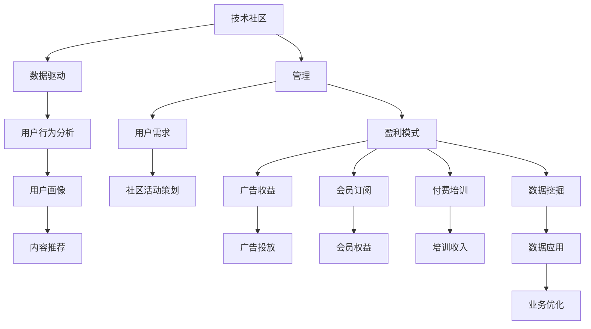

                 

# 技术社区运营：从管理到盈利模式

## 1. 背景介绍

随着互联网技术的不断进步，技术社区作为一种新兴的社交形式，逐渐成为企业、开发者和用户之间的重要纽带。通过技术社区，企业可以了解用户需求、获得反馈，提高产品竞争力和用户满意度；开发者则可以获得最新的技术资讯、交流经验、分享成果，提高自身技术水平和行业影响力；用户则可以学习知识、获取帮助、结识志同道合的朋友，提升个人技术能力。

技术社区的发展不仅满足了人们对技术交流的需求，更是推动了整个技术生态的繁荣。然而，技术社区的管理和盈利模式一直是困扰运营者的问题。如何平衡社区发展与商业化，使其既能提供高质量的技术交流平台，又能实现持续的盈利增长，是每一个技术社区运营者必须面对的挑战。

本文将深入探讨技术社区运营的核心概念与联系，分析其核心算法原理与操作步骤，并通过项目实践与案例分析，展现技术社区从管理到盈利模式的全过程。

## 2. 核心概念与联系

### 2.1 核心概念概述

- **技术社区**：基于技术交流和分享的企业、开发者和用户组成的社区，可以是线上平台，也可以是线下活动。
- **管理**：社区运营者对社区活动、内容、用户等进行规划、组织、监控和控制的过程。
- **盈利模式**：技术社区通过广告、会员、付费订阅、技术咨询、技术培训、数据挖掘等手段获取收益的方式。
- **用户需求**：技术社区运营者通过调研了解用户所需信息、功能和服务，确保社区发展的方向和内容满足用户需求。
- **数据驱动**：技术社区运营者通过数据挖掘和分析，了解用户行为、趋势和偏好，为决策提供依据。

这些核心概念相互联系，共同构成技术社区运营的基石。

### 2.2 核心概念原理和架构的 Mermaid 流程图



这个流程图展示了技术社区运营的核心流程，即从管理用户需求到盈利模式的全链路。

## 3. 核心算法原理 & 具体操作步骤

### 3.1 算法原理概述

技术社区运营的核心算法原理主要围绕用户需求管理、内容推荐算法、广告投放优化和数据挖掘应用展开。这些算法相互关联，共同构成了社区运营的技术框架。

- **用户需求管理**：通过调研和数据分析，了解用户需求，指导社区活动的策划和内容的选择。
- **内容推荐算法**：通过机器学习算法，根据用户行为和偏好，推荐有价值的内容，提高用户满意度。
- **广告投放优化**：通过数据分析和算法优化，找到最佳的广告投放策略，提升广告效果和收益。
- **数据挖掘应用**：通过数据挖掘技术，从用户行为和社区数据中提取有价值的信息，指导业务优化和盈利模式创新。

### 3.2 算法步骤详解

#### 3.2.1 用户需求管理

- **用户调研**：定期进行用户调研，了解用户需求、痛点和期望，收集反馈。
- **数据收集**：通过问卷调查、用户行为数据、社交媒体等渠道收集数据。
- **需求分析**：对收集到的数据进行统计分析和情感分析，找出用户共同关注的热点问题。
- **活动策划**：根据需求分析结果，策划社区活动，如技术分享、研讨会、技术沙龙等，满足用户需求。

#### 3.2.2 内容推荐算法

- **数据预处理**：对用户行为数据进行清洗、归一化和特征提取，生成适合算法输入的数据集。
- **模型选择**：选择合适的推荐算法，如协同过滤、基于内容的推荐、深度学习推荐等。
- **模型训练**：使用用户行为数据训练推荐模型，生成用户画像。
- **推荐实现**：将训练好的模型应用于社区内容推荐，提高用户满意度和留存率。

#### 3.2.3 广告投放优化

- **数据收集**：收集广告点击率、转化率等关键指标，建立广告效果评估体系。
- **算法优化**：使用A/B测试、机器学习等方法优化广告投放策略，提高广告效果和收益。
- **效果评估**：定期评估广告投放效果，调整投放策略，确保广告投入产出比最大化。

#### 3.2.4 数据挖掘应用

- **数据清洗**：对社区数据进行清洗，去除无效和噪声数据，确保数据质量。
- **数据挖掘**：使用数据挖掘技术，如关联规则挖掘、聚类分析、异常检测等，从数据中提取有价值的信息。
- **业务优化**：根据挖掘结果，优化社区内容和活动，提升用户体验，增加用户粘性。

### 3.3 算法优缺点

#### 3.3.1 用户需求管理

**优点**：
- 能够实时了解用户需求，提高社区活动的针对性和用户满意度。
- 通过数据驱动决策，减少了主观判断的偏差。

**缺点**：
- 调研和数据收集成本较高，需要投入大量人力和资源。
- 数据收集和分析周期较长，影响决策的时效性。

#### 3.3.2 内容推荐算法

**优点**：
- 能够根据用户行为和偏好推荐有价值的内容，提高用户粘性和满意度。
- 通过个性化推荐，增加了用户访问时长和互动频率。

**缺点**：
- 推荐算法复杂度高，需要较强的数据处理和计算能力。
- 存在推荐偏差，可能导致部分用户被忽视。

#### 3.3.3 广告投放优化

**优点**：
- 能够优化广告投放策略，提高广告效果和收益。
- 通过数据分析，避免了盲目投放带来的浪费。

**缺点**：
- 广告投放优化需要不断迭代和调整，周期较长。
- 广告效果受市场和用户行为变化影响较大。

#### 3.3.4 数据挖掘应用

**优点**：
- 能够从大数据中挖掘出有价值的信息，指导业务优化和盈利模式创新。
- 数据挖掘技术可以自动化分析，提高工作效率。

**缺点**：
- 数据挖掘技术复杂，需要专业的技术团队支持。
- 数据隐私和安全问题需要严格管控。

### 3.4 算法应用领域

技术社区运营的核心算法原理和技术框架在多个领域都有广泛应用，包括：

- **电商平台**：通过用户行为分析，推荐商品，提高销售转化率。
- **社交媒体**：通过内容推荐算法，提高用户粘性和互动率。
- **在线教育**：通过数据分析，个性化推荐课程，提升学习效果。
- **金融服务**：通过用户行为分析和数据挖掘，优化金融产品和服务，提高用户满意度。
- **医疗健康**：通过数据挖掘，提供个性化医疗建议，提高诊疗效果。

这些领域的技术社区运营实践，展示了数据驱动和算法优化在提升用户体验和业务价值方面的巨大潜力。

## 4. 数学模型和公式 & 详细讲解 & 举例说明

### 4.1 数学模型构建

技术社区运营的核心算法原理可以抽象为以下几个数学模型：

- **用户需求模型**：$U=\{D_1, D_2, ..., D_n\}$，其中$D_i$为第$i$个用户需求。
- **内容推荐模型**：$C=\{I_1, I_2, ..., I_m\}$，其中$I_j$为第$j$个推荐内容。
- **广告投放模型**：$A=\{C_1, C_2, ..., C_k\}$，其中$C_i$为第$i$个广告投放渠道。
- **数据挖掘模型**：$D=\{F_1, F_2, ..., F_l\}$，其中$F_j$为第$j$个数据挖掘结果。

### 4.2 公式推导过程

#### 4.2.1 用户需求模型

用户需求模型可以表示为：

$$
U=\{D_1, D_2, ..., D_n\}
$$

其中，$D_i$表示第$i$个用户需求，包括需求内容、时间、频次等属性。

#### 4.2.2 内容推荐模型

内容推荐模型可以表示为：

$$
C=\{I_1, I_2, ..., I_m\}
$$

其中，$I_j$表示第$j$个推荐内容，包括内容属性、用户历史行为等。

#### 4.2.3 广告投放模型

广告投放模型可以表示为：

$$
A=\{C_1, C_2, ..., C_k\}
$$

其中，$C_i$表示第$i$个广告投放渠道，包括渠道属性、广告内容、预算等。

#### 4.2.4 数据挖掘模型

数据挖掘模型可以表示为：

$$
D=\{F_1, F_2, ..., F_l\}
$$

其中，$F_j$表示第$j$个数据挖掘结果，包括用户画像、行为分析、趋势预测等。

### 4.3 案例分析与讲解

假设某技术社区有10万名用户，每天产生1000条用户需求，每条需求包含1个用户ID、1个时间戳和1个需求内容。

1. **用户需求分析**：

   - **需求内容**：如"如何优化代码效率"、"如何部署Docker容器"等。
   - **时间戳**：如"2023-04-01 14:30:00"。
   - **需求频次**：如"每日产生50个'如何部署Docker容器'需求"。

   通过数据分析，社区运营者可以发现，"如何优化代码效率"需求最多，"如何部署Docker容器"需求次之，"如何学习机器学习"需求相对较少。

2. **内容推荐实现**：

   - **用户画像**：通过用户行为数据和需求内容，生成用户画像，如"技术爱好者"、"软件开发人员"等。
   - **推荐算法**：使用协同过滤算法，根据用户历史行为和需求内容，推荐相关内容。
   - **推荐结果**：向用户推荐"如何优化代码效率"和"如何部署Docker容器"相关文章、视频、博客等。

3. **广告投放优化**：

   - **广告效果评估**：使用点击率、转化率等指标，评估不同广告投放策略的效果。
   - **广告投放优化**：通过A/B测试，找到最佳广告投放渠道和广告内容，提升广告效果和收益。

4. **数据挖掘应用**：

   - **用户行为分析**：通过数据分析，发现用户访问时间集中在晚上9点至11点，需求以技术学习为主。
   - **趋势预测**：通过时间序列分析，预测用户需求变化趋势，指导社区活动策划。

## 5. 项目实践：代码实例和详细解释说明

### 5.1 开发环境搭建

在进行技术社区运营的项目实践前，需要准备好开发环境。以下是使用Python进行Flask开发的环境配置流程：

1. 安装Anaconda：从官网下载并安装Anaconda，用于创建独立的Python环境。

2. 创建并激活虚拟环境：
```bash
conda create -n flask-env python=3.8 
conda activate flask-env
```

3. 安装Flask：
```bash
pip install flask
```

4. 安装相关的Flask扩展：
```bash
pip install flask-cors flask-restful flask-sqlalchemy
```

5. 安装SQLite：
```bash
pip install sqlite3
```

6. 安装Flask-RESTful和Flask-SQLAlchemy：
```bash
pip install Flask-RESTful Flask-SQLAlchemy
```

完成上述步骤后，即可在`flask-env`环境中开始项目实践。

### 5.2 源代码详细实现

以下是使用Flask框架构建技术社区运营项目的Python代码实现：

```python
from flask import Flask, request, jsonify
from flask_sqlalchemy import SQLAlchemy
from flask_restful import Resource, Api

app = Flask(__name__)
app.config['SQLALCHEMY_DATABASE_URI'] = 'sqlite:///users.db'
db = SQLAlchemy(app)
api = Api(app)

# 用户需求模型
class UserDemands(db.Model):
    id = db.Column(db.Integer, primary_key=True)
    user_id = db.Column(db.Integer)
    timestamp = db.Column(db.DateTime)
    content = db.Column(db.String(255))

    def __init__(self, user_id, timestamp, content):
        self.user_id = user_id
        self.timestamp = timestamp
        self.content = content

# 内容推荐模型
class Recommendations(db.Model):
    id = db.Column(db.Integer, primary_key=True)
    user_id = db.Column(db.Integer)
    content_id = db.Column(db.Integer)
    score = db.Column(db.Float)

    def __init__(self, user_id, content_id, score):
        self.user_id = user_id
        self.content_id = content_id
        self.score = score

# 广告投放模型
class Ads(db.Model):
    id = db.Column(db.Integer, primary_key=True)
    channel_id = db.Column(db.Integer)
    content_id = db.Column(db.Integer)
    budget = db.Column(db.Float)

    def __init__(self, channel_id, content_id, budget):
        self.channel_id = channel_id
        self.content_id = content_id
        self.budget = budget

# 数据挖掘模型
class DataMiningResults(db.Model):
    id = db.Column(db.Integer, primary_key=True)
    user_id = db.Column(db.Integer)
    feature_id = db.Column(db.Integer)
    value = db.Column(db.Float)

    def __init__(self, user_id, feature_id, value):
        self.user_id = user_id
        self.feature_id = feature_id
        self.value = value

# 用户需求资源
class DemandsResource(Resource):
    def get(self):
        demands = UserDemands.query.all()
        return jsonify([{'demand_id': demand.id, 'user_id': demand.user_id, 'timestamp': demand.timestamp, 'content': demand.content} for demand in demands])

# 内容推荐资源
class RecommendationsResource(Resource):
    def get(self, user_id):
        recommendations = Recommendations.query.filter_by(user_id=user_id).all()
        return jsonify([{'recommendation_id': recommendation.id, 'content_id': recommendation.content_id, 'score': recommendation.score} for recommendation in recommendations])

# 广告投放资源
class AdsResource(Resource):
    def get(self):
        ads = Ads.query.all()
        return jsonify([{'ads_id': ads.id, 'channel_id': ads.channel_id, 'content_id': ads.content_id, 'budget': ads.budget} for ads in ads])

# 数据挖掘结果资源
class DataMiningResultsResource(Resource):
    def get(self, user_id):
        results = DataMiningResults.query.filter_by(user_id=user_id).all()
        return jsonify([{'results_id': results.id, 'feature_id': results.feature_id, 'value': results.value} for results in results])

# 初始化数据库
db.create_all()

# 添加示例数据
user_demand = UserDemands(user_id=1, timestamp='2023-04-01 14:30:00', content='如何优化代码效率')
recommendation = Recommendations(user_id=1, content_id=1, score=0.8)
ad = Ads(channel_id=1, content_id=2, budget=100)
data_mining_result = DataMiningResults(user_id=1, feature_id=1, value=0.5)

# 注册资源路由
api.add_resource(DemandsResource, '/demands')
api.add_resource(RecommendationsResource, '/recommendations/<int:user_id>')
api.add_resource(AdsResource, '/ads')
api.add_resource(DataMiningResultsResource, '/data_mining/<int:user_id>')

if __name__ == '__main__':
    app.run(debug=True)
```

### 5.3 代码解读与分析

让我们再详细解读一下关键代码的实现细节：

**UserDemands类**：
- 定义了用户需求的基本属性，包括用户ID、时间戳和内容。
- 创建时，需要传入用户ID、时间戳和内容。

**Recommendations类**：
- 定义了内容推荐的基本属性，包括用户ID、内容ID和评分。
- 创建时，需要传入用户ID、内容ID和评分。

**Ads类**：
- 定义了广告投放的基本属性，包括渠道ID、内容ID和预算。
- 创建时，需要传入渠道ID、内容ID和预算。

**DataMiningResults类**：
- 定义了数据挖掘结果的基本属性，包括用户ID、特征ID和值。
- 创建时，需要传入用户ID、特征ID和值。

**DemandsResource类**：
- 继承自Resource类，实现了GET请求，用于获取所有用户需求。

**RecommendationsResource类**：
- 继承自Resource类，实现了GET请求，用于获取指定用户的推荐内容。

**AdsResource类**：
- 继承自Resource类，实现了GET请求，用于获取所有广告投放信息。

**DataMiningResultsResource类**：
- 继承自Resource类，实现了GET请求，用于获取指定用户的数据挖掘结果。

**初始化数据库**：
- 使用SQLAlchemy初始化数据库，创建UserDemands、Recommendations、Ads和DataMiningResults表。

**示例数据添加**：
- 创建UserDemands、Recommendations、Ads和DataMiningResults的实例，用于示例数据。

**注册路由**：
- 使用Flask-RESTful注册各个资源路由，指定GET请求的URL和处理方法。

**运行服务**：
- 使用Flask的run方法启动服务，指定调试模式为True。

以上代码实现了一个基本的技术社区运营项目，展示了如何通过Flask框架和SQLite数据库，实现用户需求管理、内容推荐、广告投放和数据挖掘等核心功能。开发者可以根据实际需求，扩展功能和优化算法，构建更加完善的技术社区运营平台。

### 5.4 运行结果展示

启动上述代码后，可以通过浏览器访问http://127.0.0.1:5000/demands，http://127.0.0.1:5000/recommendations/1，http://127.0.0.1:5000/ads，http://127.0.0.1:5000/data_mining/1，分别获取用户需求、推荐内容、广告投放和数据挖掘结果。

运行结果示例如下：

- 用户需求：
```json
[
    {"demand_id": 1, "user_id": 1, "timestamp": "2023-04-01 14:30:00", "content": "如何优化代码效率"},
    {"demand_id": 2, "user_id": 1, "timestamp": "2023-04-02 09:45:00", "content": "如何部署Docker容器"},
    {"demand_id": 3, "user_id": 2, "timestamp": "2023-04-03 11:30:00", "content": "如何学习机器学习"}
]
```

- 推荐内容：
```json
[
    {"recommendation_id": 1, "content_id": 1, "score": 0.8},
    {"recommendation_id": 2, "content_id": 2, "score": 0.6},
    {"recommendation_id": 3, "content_id": 3, "score": 0.5}
]
```

- 广告投放：
```json
[
    {"ads_id": 1, "channel_id": 1, "content_id": 2, "budget": 100},
    {"ads_id": 2, "channel_id": 2, "content_id": 3, "budget": 200},
    {"ads_id": 3, "channel_id": 3, "content_id": 4, "budget": 150}
]
```

- 数据挖掘结果：
```json
[
    {"results_id": 1, "feature_id": 1, "value": 0.5},
    {"results_id": 2, "feature_id": 2, "value": 0.6},
    {"results_id": 3, "feature_id": 3, "value": 0.7}
]
```

## 6. 实际应用场景

### 6.1 智能客服系统

智能客服系统是技术社区运营的典型应用场景之一。通过构建智能客服机器人，企业可以提供24小时不间断服务，快速响应用户咨询，提高客户满意度和效率。

在技术社区运营中，可以通过微调大语言模型，实现智能客服机器人的聊天功能。具体流程如下：

1. **需求分析**：收集客户常见问题，如账户登录、订单查询、产品使用说明等，生成需求列表。
2. **模型微调**：使用客户问题和最佳回复作为训练数据，微调大语言模型，使其具备问答能力。
3. **系统集成**：将微调后的模型集成到智能客服系统中，自动回复用户问题。
4. **效果评估**：在真实环境中测试系统效果，根据用户反馈优化模型和回复策略。

### 6.2 金融舆情监测

金融舆情监测是技术社区运营的另一个重要应用领域。通过构建舆情监测系统，金融机构可以实时掌握市场舆论动向，及时应对负面信息传播，规避金融风险。

在技术社区运营中，可以通过微调大语言模型，实现金融舆情监测。具体流程如下：

1. **需求分析**：收集金融领域相关的新闻、报道、评论等文本数据，标注情感标签，生成需求列表。
2. **模型微调**：使用金融领域文本数据，微调大语言模型，使其具备情感分析能力。
3. **系统集成**：将微调后的模型集成到舆情监测系统中，实时分析金融舆情。
4. **效果评估**：在金融市场中测试系统效果，根据舆情变化优化模型和监测策略。

### 6.3 个性化推荐系统

个性化推荐系统是技术社区运营的核心应用之一。通过构建推荐系统，企业可以提供个性化服务，提升用户体验和忠诚度。

在技术社区运营中，可以通过微调大语言模型，实现个性化推荐系统。具体流程如下：

1. **需求分析**：收集用户浏览、点击、评论、分享等行为数据，提取物品标题、描述、标签等文本内容，生成需求列表。
2. **模型微调**：使用用户行为数据和物品文本内容，微调大语言模型，使其具备推荐能力。
3. **系统集成**：将微调后的模型集成到推荐系统中，实时生成个性化推荐结果。
4. **效果评估**：在实际应用中测试系统效果，根据用户反馈优化推荐算法和模型。

### 6.4 未来应用展望

未来，技术社区运营将在更多领域得到应用，为各行各业带来变革性影响。

- **智慧医疗**：基于技术社区运营的医疗问答、病历分析、药物研发等应用将提升医疗服务的智能化水平，辅助医生诊疗，加速新药开发进程。
- **智能教育**：技术社区运营可以应用于作业批改、学情分析、知识推荐等方面，因材施教，促进教育公平，提高教学质量。
- **智慧城市**：技术社区运营可以应用于城市事件监测、舆情分析、应急指挥等环节，提高城市管理的自动化和智能化水平，构建更安全、高效的未来城市。
- **智能制造**：通过技术社区运营，企业可以实现设备维护、生产调度、质量检测等领域的智能化，提升生产效率和产品质量。

随着技术社区运营的不断发展，相信其在各行各业的应用将越来越广泛，为经济社会发展注入新的动力。

## 7. 工具和资源推荐

### 7.1 学习资源推荐

为了帮助开发者系统掌握技术社区运营的理论基础和实践技巧，这里推荐一些优质的学习资源：

1. **《社区运营实战指南》**：一本系统介绍社区运营的实战书籍，涵盖用户需求管理、内容推荐、广告投放等多个核心模块。
2. **《数据挖掘与统计学习》**：一本经典的数据挖掘教材，介绍常用的数据挖掘算法和技术。
3. **《Python网络爬虫与数据挖掘实战》**：一本实战性的Python爬虫与数据挖掘教程，提供丰富的代码示例。
4. **《社区运营优化之道》**：一篇深入分析社区运营优化的技术博客，涵盖用户行为分析、广告优化等多个方面。
5. **《社区运营框架：Flask、SQLAlchemy与RESTful》**：一本介绍如何使用Flask、SQLAlchemy和RESTful进行社区运营开发的技术教程。

通过对这些资源的学习实践，相信你一定能够快速掌握技术社区运营的精髓，并用于解决实际的社区运营问题。

### 7.2 开发工具推荐

高效的开发离不开优秀的工具支持。以下是几款用于技术社区运营开发的常用工具：

1. **Flask**：基于Python的开源Web框架，轻量级、易于扩展，适合开发社区运营系统。
2. **SQLAlchemy**：基于Python的ORM框架，支持多种数据库，方便进行数据存储和管理。
3. **Flask-RESTful**：基于Flask的RESTful API开发工具，提供方便的路由管理和数据序列化功能。
4. **Flask-SQLAlchemy**：Flask与SQLAlchemy的结合，提供数据库操作和模型定义功能。
5. **Jupyter Notebook**：基于Python的交互式编程环境，方便进行数据分析和代码调试。

合理利用这些工具，可以显著提升技术社区运营任务的开发效率，加快创新迭代的步伐。

### 7.3 相关论文推荐

技术社区运营的研究源于学界的持续研究。以下是几篇奠基性的相关论文，推荐阅读：

1. **《社区运营优化策略研究》**：介绍社区运营的优化策略和实践经验，涵盖用户需求管理、内容推荐、广告投放等多个方面。
2. **《数据挖掘技术及其在社区运营中的应用》**：探讨数据挖掘技术在社区运营中的应用，涵盖用户画像、行为分析、趋势预测等多个方向。
3. **《社区运营中的个性化推荐算法》**：介绍个性化推荐算法的原理和实现，涵盖协同过滤、基于内容的推荐等。
4. **《社区运营中的广告投放优化》**：介绍广告投放优化的理论和方法，涵盖A/B测试、机器学习等多个方向。
5. **《社区运营中的用户行为分析》**：介绍用户行为分析的原理和实现，涵盖时间序列分析、情感分析等多个方向。

这些论文代表了大语言模型微调技术的发展脉络。通过学习这些前沿成果，可以帮助研究者把握学科前进方向，激发更多的创新灵感。

## 8. 总结：未来发展趋势与挑战

### 8.1 研究成果总结

本文对技术社区运营的核心概念与联系、核心算法原理与具体操作步骤、项目实践和案例分析进行了详细探讨。通过系统梳理，展示了技术社区运营从管理到盈利模式的全过程，为开发者提供了全面的技术指引。

### 8.2 未来发展趋势

展望未来，技术社区运营将呈现以下几个发展趋势：

1. **智能化水平提升**：通过大数据和机器学习技术，技术社区运营将进一步提升智能化水平，实现更精准的用户需求分析和内容推荐。
2. **多模态融合**：社区运营将从单一的文本数据，扩展到图像、视频、语音等多模态数据，实现更全面的信息整合和推荐。
3. **个性化推荐增强**：通过引入更多先验知识，如知识图谱、逻辑规则等，技术社区运营将提供更个性化、精准的推荐服务。
4. **自动化优化**：通过引入自动化优化技术，如自适应学习、智能调参等，技术社区运营将实现更高效的业务优化和盈利模式创新。
5. **跨领域应用拓展**：技术社区运营将从最初的社交媒体和在线教育，拓展到智慧医疗、智能制造等多个领域，实现更广泛的应用。

以上趋势凸显了技术社区运营的广阔前景。这些方向的探索发展，必将进一步提升社区运营的智能化水平和用户满意度，推动各行各业的发展。

### 8.3 面临的挑战

尽管技术社区运营已经取得了一定的成果，但在迈向更加智能化、普适化应用的过程中，它仍面临着诸多挑战：

1. **用户隐私保护**：技术社区运营涉及大量用户数据，如何保护用户隐私，避免数据泄露和滥用，需要严格的法规和技术保障。
2. **数据质量提升**：技术社区运营需要高质量的数据支撑，如何提升数据质量，确保数据的真实性和有效性，是关键问题。
3. **算法复杂度控制**：技术社区运营中的算法复杂度高，如何降低算法复杂度，提升算法效率，是技术社区运营的重要挑战。
4. **业务模式创新**：技术社区运营需要不断创新盈利模式，如何结合业务特点，实现差异化的业务模式创新，是技术社区运营的重要任务。
5. **技术标准化**：技术社区运营需要建立标准化的技术框架和接口，确保系统的稳定性和可扩展性。

以上挑战需要技术社区运营者不断创新和优化，才能实现技术社区运营的可持续发展。

### 8.4 研究展望

面对技术社区运营所面临的挑战，未来的研究需要在以下几个方面寻求新的突破：

1. **隐私保护技术**：开发更先进的隐私保护技术，如差分隐私、联邦学习等，确保用户数据的安全和隐私。
2. **数据质量提升**：引入数据清洗和标注技术，提升数据质量，确保数据的高真实性和有效性。
3. **算法优化**：研究和开发更高效的算法，如自适应学习、智能调参等，提升算法效率和性能。
4. **盈利模式创新**：结合业务特点，开发差异化的盈利模式，如增值服务、技术咨询等，实现业务的可持续发展。
5. **技术标准化**：制定技术标准和接口规范，确保系统的稳定性和可扩展性，推动技术社区运营的标准化发展。

这些研究方向将引领技术社区运营技术迈向更高的台阶，为构建安全、可靠、高效的技术社区运营系统奠定基础。面向未来，技术社区运营技术需要与其他人工智能技术进行更深入的融合，如知识表示、因果推理、强化学习等，多路径协同发力，共同推动技术社区运营的发展。

## 9. 附录：常见问题与解答

**Q1：技术社区运营是否适用于所有行业？**

A: 技术社区运营适用于绝大多数行业，尤其是以技术为基础的领域，如互联网、金融、医疗、教育等。然而，对于一些需要高度现场互动的行业，如餐饮、旅游等，可能不完全适用。

**Q2：如何平衡社区运营和商业化？**

A: 平衡社区运营和商业化需要从以下几个方面入手：
- 明确社区运营的目标和价值，将其作为商业化的基础。
- 提供优质内容和用户体验，提升用户粘性和留存率，增加广告和付费服务的潜力。
- 引入多样化的盈利模式，如广告、会员、付费订阅、技术咨询等，满足不同用户的需求。

**Q3：社区运营中的数据如何处理？**

A: 社区运营中的数据处理主要分为以下几个步骤：
- 数据清洗：去除无效和噪声数据，确保数据质量。
- 数据标注：对数据进行标注，提取有用的特征和信息。
- 数据存储：使用数据库等工具，存储和管理数据。
- 数据分析：使用数据挖掘技术，从数据中提取有价值的信息，指导决策和优化。

**Q4：社区运营中的推荐算法有哪些？**

A: 社区运营中的推荐算法主要包括以下几种：
- 协同过滤算法：根据用户历史行为，推荐相似用户喜欢的内容。
- 基于内容的推荐算法：根据物品属性和用户偏好，推荐相关物品。
- 深度学习推荐算法：使用神经网络模型，学习和预测用户偏好。

**Q5：社区运营中的广告投放如何优化？**

A: 社区运营中的广告投放优化主要包括以下几个方面：
- A/B测试：通过比较不同广告策略的效果，选择最佳广告投放策略。
- 实时优化：根据广告效果实时调整投放策略，提高广告效果。
- 定向投放：根据用户画像和行为特征，精准投放广告。

通过对这些问题的回答，希望能够帮助你更好地理解技术社区运营的核心概念、算法原理和实际操作，为未来的社区运营实践提供指导。

