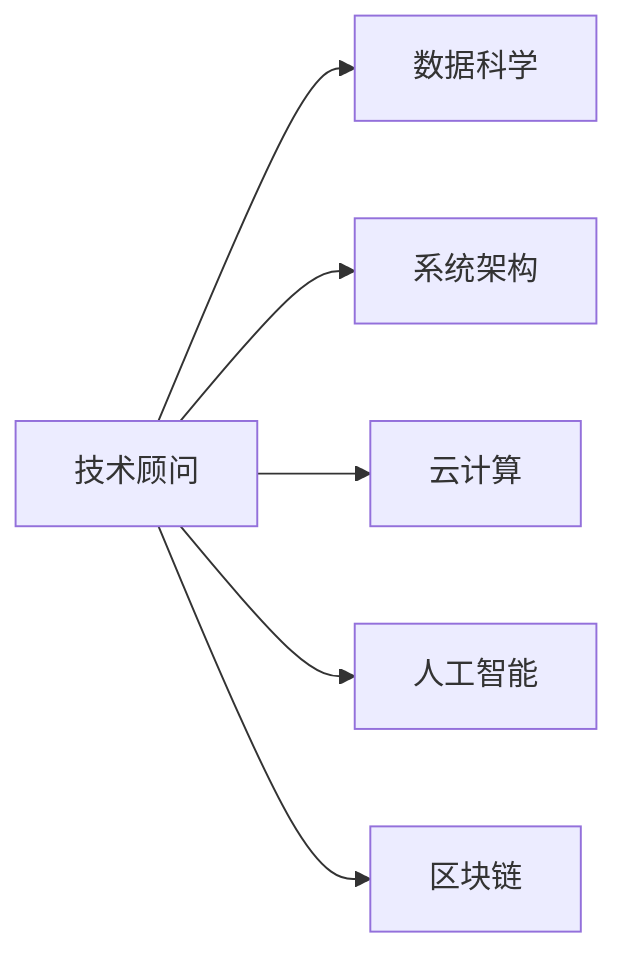

                 

# 技术顾问：打造每小时四位数的咨询费

## 1. 背景介绍

在数字化转型的浪潮中，越来越多的企业寻求技术顾问的帮助，以提升自身的竞争力。然而，如何成为一名每小时能获得四位数咨询费的技术顾问，却是一个既古老又新鲜的话题。本文将深入探讨这一话题，从技术顾问的角色定位、必备技能、学习路径和未来趋势等多个维度，提供全面的指导。

## 2. 核心概念与联系

### 2.1 核心概念概述

为了更好地理解技术顾问的职能和技能，本节将介绍几个关键概念：

- **技术顾问**：通常指具备跨学科知识和技术背景的专业人员，能解决企业的技术难题，优化系统性能，推动业务发展。

- **数据科学**：利用统计学、机器学习和数据挖掘等方法，从大量数据中提取有用信息和知识，辅助决策。

- **系统架构**：设计和管理复杂系统的框架，包括数据库、服务器、网络、安全等方面，确保系统高效、稳定运行。

- **云计算**：通过互联网提供计算资源和数据存储服务，实现弹性计算、按需扩展等功能，支持现代企业的业务需求。

- **人工智能**：利用机器学习、深度学习等技术，使计算机系统具备智能交互、自动决策等能力，提升用户体验和业务效率。

- **区块链**：分布式账本技术，用于保障数据安全、透明和不可篡改，应用于金融、供应链、物联网等领域。

这些核心概念之间的逻辑关系可以通过以下Mermaid流程图来展示：



这个流程图展示了这个领域的核心概念及其之间的关系：

1. 技术顾问需要理解多个领域的技术和知识，才能全面解决企业问题。
2. 数据科学、系统架构、云计算、人工智能、区块链等技术，都是技术顾问需要掌握的关键技能。

## 3. 核心算法原理 & 具体操作步骤

### 3.1 算法原理概述

成为一名每小时能获得四位数咨询费的技术顾问，首先需要深刻理解各种技术原理。以下以数据科学和人工智能为例，简要介绍其核心算法原理：

- **数据科学**：主要算法包括线性回归、决策树、随机森林、支持向量机、聚类分析、时间序列分析等，用于数据建模、预测和分析。
- **人工智能**：主要算法包括深度学习、卷积神经网络、循环神经网络、生成对抗网络等，用于图像识别、语音识别、自然语言处理等任务。

### 3.2 算法步骤详解

**数据科学的步骤**：

1. **数据预处理**：清洗、标准化、特征工程等，确保数据质量。
2. **模型选择与训练**：选择适当的模型，使用训练数据进行参数优化。
3. **模型评估与调优**：在验证数据上评估模型性能，调整参数和优化算法。
4. **模型部署与应用**：将模型部署到实际应用中，进行业务场景测试和优化。

**人工智能的步骤**：

1. **数据预处理**：同数据科学。
2. **模型选择与训练**：选择适当的深度学习模型，使用训练数据进行参数优化。
3. **模型评估与调优**：同数据科学。
4. **模型部署与应用**：同数据科学。

### 3.3 算法优缺点

**数据科学的优缺点**：

- **优点**：可以处理大规模数据，具有广泛的统计学基础，应用场景丰富。
- **缺点**：模型解释性不足，难以处理复杂非线性关系，过度依赖数据质量。

**人工智能的优缺点**：

- **优点**：具备强大的泛化能力，处理非结构化数据，能够自动学习和改进。
- **缺点**：需要大量标注数据，模型复杂度较高，存在“过拟合”风险。

### 3.4 算法应用领域

**数据科学的应用领域**：

- 金融风险管理：利用历史数据进行风险预测和控制。
- 供应链优化：通过数据分析优化库存管理、物流调度。
- 客户行为分析：分析用户行为数据，提升营销效果。

**人工智能的应用领域**：

- 自然语言处理：智能客服、机器翻译、情感分析等。
- 计算机视觉：图像识别、视频分析、人脸识别等。
- 智能推荐：推荐系统、个性化广告等。

## 4. 数学模型和公式 & 详细讲解 & 举例说明

### 4.1 数学模型构建

**线性回归模型**：

$$ y = \beta_0 + \beta_1 x_1 + \beta_2 x_2 + \cdots + \beta_n x_n + \epsilon $$

其中，$\beta$ 为回归系数，$x$ 为自变量，$y$ 为因变量，$\epsilon$ 为随机误差。

**卷积神经网络**：

$$ f(x) = \sigma\left(\sum_{i=1}^n w_i x_i + b\right) $$

其中，$w$ 为卷积核权重，$x$ 为输入数据，$b$ 为偏置项，$\sigma$ 为激活函数。

### 4.2 公式推导过程

**线性回归的推导**：

$$ y = \beta_0 + \beta_1 x_1 + \beta_2 x_2 + \cdots + \beta_n x_n + \epsilon $$
$$ y - \beta_0 = \beta_1 x_1 + \beta_2 x_2 + \cdots + \beta_n x_n + \epsilon $$
$$ (y - \beta_0) - \beta_1 x_1 - \beta_2 x_2 - \cdots - \beta_n x_n = \epsilon $$
$$ \epsilon = y - \beta_0 - \beta_1 x_1 - \beta_2 x_2 - \cdots - \beta_n x_n $$

**卷积神经网络的推导**：

$$ f(x) = \sigma\left(\sum_{i=1}^n w_i x_i + b\right) $$
$$ f(x) = \sigma\left(\sum_{i=1}^n w_i (x * k_i) + b\right) $$
$$ k_i = w_i * k_{i-1} $$
$$ k_0 = 1 $$

其中，$k_i$ 为卷积核，$w_i$ 为权重，$x$ 为输入数据，$b$ 为偏置项，$\sigma$ 为激活函数。

### 4.3 案例分析与讲解

**案例1：数据科学在金融风险管理中的应用**：

利用历史交易数据，建立线性回归模型预测贷款违约概率。通过验证集评估模型性能，调整系数和截距，最终部署到风控系统，实时评估贷款风险。

**案例2：人工智能在智能推荐系统中的应用**：

使用用户行为数据和商品属性数据，构建深度神经网络模型进行用户兴趣预测。通过多轮反馈优化模型参数，实现个性化推荐，提升用户体验和转化率。

## 5. 项目实践：代码实例和详细解释说明

### 5.1 开发环境搭建

**开发环境配置**：

1. **安装Python**：安装Python 3.x版本。
2. **安装依赖库**：安装numpy、pandas、scikit-learn、tensorflow等库。
3. **安装Jupyter Notebook**：用于数据科学和机器学习实验。
4. **安装Git**：版本控制工具，用于代码管理。

**环境变量配置**：

```bash
# 设置Python环境
export PATH=$PATH:/path/to/python

# 配置Jupyter Notebook
jupyter notebook --allow-root
```

### 5.2 源代码详细实现

**线性回归示例**：

```python
import numpy as np
from sklearn.linear_model import LinearRegression

# 数据集
x = np.array([[1, 2], [3, 4], [5, 6]])
y = np.array([2, 4, 6])

# 模型训练
model = LinearRegression().fit(x, y)

# 模型预测
y_pred = model.predict([[7, 8]])

print(y_pred)
```

**卷积神经网络示例**：

```python
import tensorflow as tf

# 定义模型
model = tf.keras.Sequential([
    tf.keras.layers.Conv2D(32, (3, 3), activation='relu', input_shape=(28, 28, 1)),
    tf.keras.layers.MaxPooling2D((2, 2)),
    tf.keras.layers.Flatten(),
    tf.keras.layers.Dense(10, activation='softmax')
])

# 编译模型
model.compile(optimizer='adam', loss='sparse_categorical_crossentropy', metrics=['accuracy'])

# 训练模型
model.fit(x_train, y_train, epochs=5, validation_data=(x_val, y_val))

# 模型评估
test_loss, test_acc = model.evaluate(x_test, y_test)
print('Test accuracy:', test_acc)
```

### 5.3 代码解读与分析

**线性回归代码解读**：

- **数据集**：定义自变量和因变量。
- **模型训练**：使用scikit-learn的线性回归模型进行训练。
- **模型预测**：使用训练好的模型进行预测，输入新数据`[[7, 8]]`。

**卷积神经网络代码解读**：

- **模型定义**：使用Keras定义卷积神经网络模型。
- **模型编译**：指定优化器、损失函数和评价指标。
- **模型训练**：使用训练数据`x_train`和标签`y_train`进行训练。
- **模型评估**：使用测试数据`x_test`和标签`y_test`进行评估。

## 6. 实际应用场景

### 6.1 金融风险管理

利用历史贷款数据，构建线性回归模型预测贷款违约概率。通过模型实时评估新贷款申请风险，优化风控策略，减少坏账率。

### 6.2 供应链优化

分析历史订单数据，使用聚类分析识别供应链瓶颈，优化库存管理和物流调度，提升供应链效率。

### 6.3 智能推荐

利用用户行为数据和商品属性数据，构建深度神经网络模型进行用户兴趣预测，实现个性化推荐，提升用户体验和转化率。

### 6.4 未来应用展望

未来，随着数据量的增加和技术的进步，技术顾问的角色将更加多元化和智能化。智能推荐、自动驾驶、智能制造等领域的知识将更加重要。同时，云计算、大数据、人工智能等技术的结合，将带来更多新的应用场景。

## 7. 工具和资源推荐

### 7.1 学习资源推荐

**在线课程**：

- Coursera：提供数据科学、机器学习、云计算等课程，覆盖从基础到高级内容。
- Udacity：提供AI、数据科学、网络安全等课程，实用性强。
- edX：提供MIT、Harvard等名校课程，质量高。

**书籍**：

- 《Python数据科学手册》：全面介绍Python在数据科学中的应用。
- 《深度学习》：Ian Goodfellow等著，深入浅出地介绍深度学习原理和应用。
- 《机器学习实战》：Peter Harrington著，实战性强。

**社区与论坛**：

- Stack Overflow：程序员问答社区，解决代码编写中的各种问题。
- GitHub：代码托管平台，提供开源项目和协作工具。
- Kaggle：数据科学竞赛平台，提供大量数据集和模型。

### 7.2 开发工具推荐

**IDE与环境**：

- Jupyter Notebook：数据科学和机器学习实验的常用工具。
- PyCharm：Python开发工具，支持代码调试和项目管理。
- Visual Studio Code：跨平台开发工具，支持多种编程语言。

**数据处理工具**：

- Pandas：Python数据分析库，支持数据清洗、处理和分析。
- NumPy：Python数学库，支持高效计算和数组操作。
- Scikit-learn：Python机器学习库，支持数据挖掘、分类、回归等算法。

**模型训练工具**：

- TensorFlow：开源深度学习框架，支持分布式计算和GPU加速。
- Keras：基于TensorFlow的高级API，易用性高。
- PyTorch：灵活的深度学习框架，支持动态计算图和模型部署。

### 7.3 相关论文推荐

**数据科学论文**：

- On the Shoulders of Giants: The Large-Scale Learning of Optimally Factored Structured Representation (Hinton, Salakhutdinov, 2006)
- A Unified View of Discrete Latent Variable Models (Bishop, 2006)
- An Introduction to Statistical Learning with Applications in R (Friedman, Hastie, Tibshirani, 2014)

**人工智能论文**：

- Deep Learning (Goodfellow, Bengio, Courville, 2016)
- Convolutional Neural Networks for Visual Recognition (LeCun, 2015)
- Generative Adversarial Nets (Goodfellow, Pouget-Abadie, Mirza, Xu, et al., 2014)

## 8. 总结：未来发展趋势与挑战

### 8.1 研究成果总结

本文对技术顾问的角色和必备技能进行了详细探讨，涵盖了数据科学和人工智能的核心算法原理与具体操作步骤。通过多个案例分析，展示了技术顾问在不同领域的应用场景。同时，推荐了丰富的学习资源和开发工具，为读者提供了全面的指导。

### 8.2 未来发展趋势

未来，技术顾问将面临更加复杂和多样化的业务需求，需要掌握更多跨领域知识。随着技术的进步，云计算、大数据、人工智能等技术的结合，将带来更多新的应用场景。同时，智能推荐、自动驾驶、智能制造等领域的知识将更加重要。

### 8.3 面临的挑战

技术顾问在未来发展中，仍面临许多挑战：

1. **数据隐私和安全**：在处理大量数据时，如何保护用户隐私和数据安全，是一大难题。
2. **模型可解释性**：深度学习模型往往具有黑盒特性，如何解释模型决策过程，提升模型透明度，是重要研究方向。
3. **模型鲁棒性**：模型在面对异常数据和噪声时，如何保持稳定性和鲁棒性，是一大挑战。
4. **技术更新换代快**：新技术和新算法层出不穷，技术顾问需要不断学习和适应，跟上技术发展步伐。
5. **人才稀缺**：具备多学科背景和丰富经验的技术顾问稀缺，如何培养和吸引人才，是一大挑战。

### 8.4 研究展望

未来，技术顾问需要注重以下研究方向：

1. **数据隐私保护**：引入差分隐私等技术，保护用户数据隐私。
2. **模型可解释性**：引入可解释性技术，如LIME、SHAP等，提升模型透明度。
3. **鲁棒性提升**：引入对抗训练、迁移学习等技术，提升模型鲁棒性。
4. **终身学习**：引入 lifelong learning 技术，实现模型自我更新和优化。
5. **跨领域知识整合**：将符号化的先验知识与神经网络模型结合，提升模型理解能力。

## 9. 附录：常见问题与解答

**Q1：如何成为一名技术顾问？**

A: 成为一名技术顾问需要具备多学科背景，包括计算机科学、数据科学、人工智能等。可以通过以下步骤：

1. **学习基础知识**：掌握编程语言（如Python、Java等）和数据结构、算法等基础知识。
2. **学习高级技术**：深入学习数据科学、机器学习、人工智能等高级技术，参加相关课程和项目实践。
3. **积累实战经验**：参与实际项目，积累项目经验和问题解决能力。
4. **拓展人际网络**：积极参加技术会议、行业交流，拓展人脉资源。

**Q2：如何高效学习技术知识？**

A: 高效学习技术知识需要具备以下方法：

1. **制定学习计划**：制定详细的学习计划，明确学习目标和时间安排。
2. **选择合适的学习资源**：选择优质的学习资源，包括书籍、在线课程、论文等。
3. **实践为主**：通过项目实践，巩固所学知识，提升实战能力。
4. **持续学习**：保持对新技术的关注，不断更新和补充知识。

**Q3：如何提升技术顾问的薪资？**

A: 提升技术顾问的薪资需要具备以下能力：

1. **具备深厚专业知识**：在某一领域具备深厚专业知识，成为该领域的专家。
2. **具备项目经验**：具备丰富的项目经验，能够解决复杂技术问题。
3. **具备软技能**：具备良好的沟通能力、团队协作能力，能够与客户和团队有效沟通。
4. **具备创新能力**：具备创新思维，能够提出新颖的解决方案，提升业务价值。

---

作者：禅与计算机程序设计艺术 / Zen and the Art of Computer Programming

