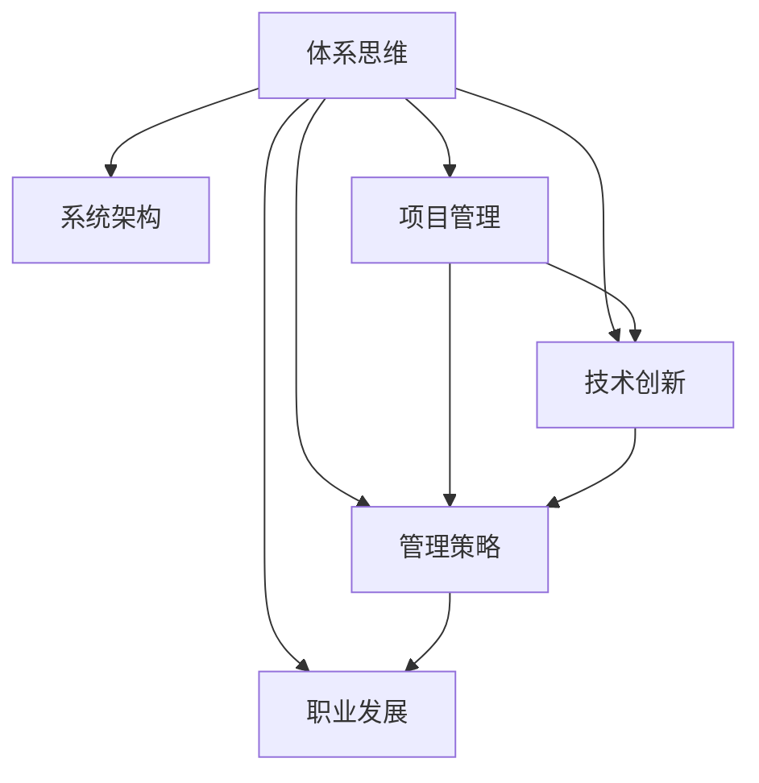

                 

# 拥有体系思维是管理者的必备能力

> 关键词：体系思维, 系统架构, 项目管理, 技术创新, 管理策略, 职业发展

## 1. 背景介绍

### 1.1 问题由来

在科技飞速发展的今天，管理者面临的环境日益复杂。如何在变化多端的市场环境中保持企业的竞争力，如何平衡项目进度和成本，如何发掘并实施技术创新，如何提升团队协作效率，如何培养员工职业发展，这些都是管理者需要应对的重要问题。而一个成熟的管理者，能够运用体系思维，将这些看似孤立的环节有机地整合起来，形成一套系统的解决方案。

### 1.2 问题核心关键点

体系思维，是指从整体出发，着眼于系统性和结构性的管理方式。不同于传统分散、孤立的“头痛医头、脚痛医脚”的管理方式，体系思维强调“综合治理、预防为主”的思路，通过建立完善的体系框架，进行全面的系统优化，从而实现长期的可持续发展。

## 2. 核心概念与联系

### 2.1 核心概念概述

为更好地理解体系思维，本节将介绍几个密切相关的核心概念：

- 体系思维：从整体和长远角度，全面、系统地分析问题、制定计划、执行项目和评估结果的管理方式。
- 系统架构：对业务流程、技术框架、数据流、用户界面等各方面进行整合，形成可扩展、可维护的系统结构。
- 项目管理：运用专业的项目管理理论、方法和工具，对项目进度、质量、成本、风险进行管理和控制。
- 技术创新：通过技术研发、产品改进、流程优化等手段，不断提升产品和服务竞争力，实现技术领先和商业突破。
- 管理策略：包含战略规划、资源配置、绩效考核、风险控制等方面，旨在实现组织目标与个人目标的统一。
- 职业发展：通过职业规划、技能培训、晋升激励等措施，激励员工成长，提升团队整体实力。

这些核心概念之间的逻辑关系可以通过以下Mermaid流程图来展示：



这个流程图展示出体系思维与其他关键管理概念的紧密联系，以及它们在实际应用中的相互作用。

## 3. 核心算法原理 & 具体操作步骤
### 3.1 算法原理概述

体系思维在管理中的应用，可以抽象为“输入-处理-输出”的三个主要环节：

1. **输入**：识别和理解问题的本质和背景，评估环境、资源和需求。
2. **处理**：制定系统的策略、计划和流程，协调各方资源，执行具体的任务和活动。
3. **输出**：评估项目结果和效果，进行反馈和调整，形成持续改进的闭环。

体系思维的管理过程，注重在复杂多变的环境下，建立系统化的流程和框架，确保各项工作协同推进，实现最优化的管理效果。

### 3.2 算法步骤详解

基于体系思维的管理，通常包括以下几个关键步骤：

**Step 1: 环境分析**
- 识别组织的内部和外部环境，评估资源和能力，理解需求和挑战。
- 运用PESTEL（政治、经济、社会、技术、环境、法律）等模型进行分析，形成全面的背景理解。

**Step 2: 战略规划**
- 制定长期发展战略，明确组织的目标、愿景和使命。
- 运用SWOT（优势、劣势、机会、威胁）分析法，形成系统的战略方案。

**Step 3: 资源配置**
- 合理分配人力、物力和财力，优化资源利用效率。
- 运用平衡记分卡、投资回报率等工具，进行资源配置决策。

**Step 4: 项目计划**
- 制定详细的项目计划，包括时间表、任务分配、风险评估等。
- 运用敏捷开发、瀑布模型等方法，进行项目管理。

**Step 5: 执行与监控**
- 按照项目计划，分配任务，执行具体的活动和任务。
- 定期监控项目进展，评估项目效果，及时调整和改进。

**Step 6: 评估与反馈**
- 评估项目结果和效果，进行经验总结和反思。
- 运用绩效考核、KPI指标等方法，进行结果评估。
- 形成闭环反馈机制，进行持续改进和优化。

**Step 7: 持续改进**
- 基于反馈结果，进行持续的改进和优化。
- 运用PDCA（计划、执行、检查、行动）循环，实现持续提升。

以上步骤，将管理过程从混沌无序的状态，转变为有系统的、可控的、持续优化的循环过程，从而实现高效、稳定、可持续的发展。

### 3.3 算法优缺点

体系思维在管理中的优势：
1. 系统化、全面性：从整体和长远角度，系统地分析问题，避免片面性和短视行为。
2. 协同性：促进各部门和团队间的协作，避免信息孤岛和资源浪费。
3. 可控性：通过系统化的流程和工具，对项目进度、成本、质量进行精确控制。
4. 可持续性：建立持续改进的机制，实现长期发展和优化。

然而，体系思维也存在一些局限：
1. 复杂度：构建完善的体系框架，需要投入大量时间和精力，对管理者的能力要求较高。
2. 灵活性：过于固定的流程可能影响应对突发情况的灵活性。
3. 执行成本：全面、细致的体系管理，需要投入较多的资源，增加管理成本。
4. 适应性：体系框架需要根据环境变化进行动态调整，否则可能变成僵化的教条。

尽管存在这些局限，但总体而言，体系思维在复杂多变的环境下，提供了更科学、更系统、更高效的管理方式。

### 3.4 算法应用领域

体系思维广泛应用于企业战略管理、项目管理、技术创新、人力资源管理等众多领域，具体包括：

1. 企业战略规划：通过环境分析、战略规划、资源配置等步骤，形成系统的战略决策。
2. 项目管理：运用系统架构、项目管理方法，确保项目按时按质完成。
3. 技术创新：通过系统化的创新流程和项目管理，推动技术研发和产品改进。
4. 人力资源管理：运用职业发展规划、绩效考核等工具，激励员工成长和提升。

## 4. 数学模型和公式 & 详细讲解 & 举例说明
### 4.1 数学模型构建

体系思维的数学模型，可以从系统论的角度进行建模。

假设一个组织可以看作一个复杂的系统，由多个子系统（部门、团队等）组成。系统的输入为环境因素（E），包括政治、经济、社会、技术等外部环境，以及组织内部的人力、物力、财力、文化和组织结构。

系统的输出为组织绩效（P），包括财务指标、市场份额、客户满意度等。

系统中的关系由策略、流程、资源配置和执行活动构成。策略（S）、流程（P）、资源配置（R）和执行活动（A）构成了系统的核心要素。

数学模型可以表示为：

$$
P = f(S, P, R, A, E)
$$

其中 $f$ 表示系统的映射关系，$S$、$P$、$R$、$A$、$E$ 为输入和输出变量。

### 4.2 公式推导过程

以一个典型的项目管理为例，进行体系思维的数学模型推导：

- **环境分析**：识别和理解项目的背景和需求，评估资源和能力。

  $$
  E = f_{\text{环境}}(D, R, C)
  $$

  其中 $D$ 为项目需求，$R$ 为可用资源，$C$ 为项目能力。

- **战略规划**：制定项目的长期目标和具体任务，明确时间表和里程碑。

  $$
  S = f_{\text{战略}}(T, O, P)
  $$

  其中 $T$ 为项目时间表，$O$ 为项目目标，$P$ 为项目里程碑。

- **资源配置**：合理分配人力、物力和财力，优化资源利用效率。

  $$
  R = f_{\text{配置}}(P, O, E)
  $$

  其中 $P$ 为项目计划，$O$ 为资源需求，$E$ 为环境因素。

- **项目计划**：制定详细的项目计划，包括时间表、任务分配、风险评估等。

  $$
  P = f_{\text{计划}}(S, R, A)
  $$

  其中 $S$ 为项目策略，$R$ 为资源配置，$A$ 为项目活动。

- **执行与监控**：按照项目计划，分配任务，执行具体的活动和任务，定期监控项目进展。

  $$
  A = f_{\text{执行}}(P, S, R, T)
  $$

  其中 $P$ 为项目计划，$S$ 为项目策略，$R$ 为资源配置，$T$ 为任务分配。

- **评估与反馈**：评估项目结果和效果，进行经验总结和反思，形成持续改进的闭环。

  $$
  F = f_{\text{评估}}(P, S, R, A)
  $$

  其中 $P$ 为项目计划，$S$ 为项目策略，$R$ 为资源配置，$A$ 为项目活动，$F$ 为反馈结果。

- **持续改进**：基于反馈结果，进行持续的改进和优化，实现系统的动态调整和优化。

  $$
  \Delta = f_{\text{改进}}(F, P, S, R, A)
  $$

  其中 $F$ 为反馈结果，$P$ 为项目计划，$S$ 为项目策略，$R$ 为资源配置，$A$ 为项目活动，$\Delta$ 为改进结果。

### 4.3 案例分析与讲解

以一家科技公司的项目管理为例，展示体系思维的实际应用：

- **环境分析**：识别市场需求和技术趋势，评估公司的资源和技术能力。
- **战略规划**：制定公司未来五年的发展战略，明确短期和长期目标。
- **资源配置**：合理分配公司的人力、物力和财力，优化资源利用效率。
- **项目计划**：制定详细的年度和季度项目计划，明确每个项目的任务和里程碑。
- **执行与监控**：按照项目计划，分配具体任务，定期监控项目进展，评估项目效果。
- **评估与反馈**：评估项目结果和效果，进行经验总结和反思，形成持续改进的闭环。
- **持续改进**：基于反馈结果，进行持续的改进和优化，实现系统的动态调整和优化。

通过这一系列步骤，科技公司能够在复杂多变的环境中，保持战略方向和资源配置的合理性，确保项目按时按质完成，实现公司的发展目标。

## 5. 项目实践：代码实例和详细解释说明
### 5.1 开发环境搭建

在进行体系思维实践前，我们需要准备好开发环境。以下是使用Python进行项目管理的环境配置流程：

1. 安装Python：从官网下载并安装Python，创建虚拟环境，以避免与其他软件冲突。

2. 安装必要的包：安装项目管理的常用包，如Pandas、NumPy、SciPy、matplotlib等。

3. 配置项目管理工具：使用JIRA、Trello、Asana等工具，实现任务管理和进度跟踪。

4. 开发环境集成：使用Jupyter Notebook或PyCharm等IDE，进行代码开发和测试。

完成上述步骤后，即可在虚拟环境中进行体系思维的项目管理实践。

### 5.2 源代码详细实现

下面是使用Python进行项目管理的一个简单示例代码：

```python
import pandas as pd
import numpy as np

# 创建一个简单的项目管理表格
project_df = pd.DataFrame({
    '项目': ['项目A', '项目B', '项目C'],
    '负责人': ['张三', '李四', '王五'],
    '预算': [100000, 150000, 200000],
    '时间表': pd.to_datetime(['2021-04-01', '2021-06-01', '2021-08-01']),
    '当前状态': ['进行中', '已完成', '进行中'],
    '风险': ['技术难度高', '人员变动', '成本超支']
})

# 显示项目管理表格
print(project_df)

# 计算项目预算总和
total_budget = project_df['预算'].sum()
print('预算总和:', total_budget)

# 计算项目进度完成度
project_status = project_df['当前状态'].value_counts(normalize=True)
print('项目进度完成度:', project_status)

# 进行风险分析
risk_count = project_df['风险'].value_counts()
print('风险分析:', risk_count)

# 绘制项目进度和预算饼图
project_df['状态占比'] = project_df['当前状态'].value_counts(normalize=True)
project_df.plot(kind='pie', y='状态占比', labels=project_df['项目'], autopct='%1.1f%%')
plt.title('项目进度饼图')
plt.show()

# 绘制项目预算饼图
project_df['预算占比'] = project_df['预算'] / total_budget
project_df.plot(kind='pie', y='预算占比', labels=project_df['项目'], autopct='%1.1f%%')
plt.title('项目预算饼图')
plt.show()

# 绘制风险频率饼图
project_df['风险频率'] = risk_count / project_df.shape[0]
project_df.plot(kind='pie', y='风险频率', labels=project_df['风险'], autopct='%1.1f%%')
plt.title('风险频率饼图')
plt.show()
```

### 5.3 代码解读与分析

让我们再详细解读一下关键代码的实现细节：

- **创建项目表格**：使用Pandas库创建项目管理表格，包含项目名称、负责人、预算、时间表、当前状态和风险等字段。
- **计算预算总和**：使用Pandas的sum()方法，计算项目预算的总和。
- **计算进度完成度**：使用value_counts()方法，统计项目当前状态的数量，计算占比。
- **风险分析**：使用value_counts()方法，统计风险的数量，计算占比。
- **绘制饼图**：使用Pandas的plot()方法，绘制项目进度和预算的饼图，以及风险的频率饼图。

通过这一系列操作，我们实现了项目管理的可视化，便于管理者直观了解项目的进度和风险情况。

## 6. 实际应用场景
### 6.1 智能制造企业

在智能制造企业中，体系思维的应用可以显著提升生产效率和质量控制。通过对生产流程、设备维护、供应链管理等各个环节进行系统化管理，企业可以实现资源的优化配置，减少浪费，提升生产效率。

具体而言，可以通过建立系统的流程和标准，进行生产线的精细化管理。例如，通过PDCA循环，进行设备的日常维护和故障管理，通过SQCA管理（质量、数量、成本、时间），进行生产质量的严格控制。通过ERP系统（企业资源计划），进行供应链和库存的优化管理，从而实现高效的供应链协同。

### 6.2 智能城市治理

智能城市治理需要高度复杂的系统化管理，体系思维提供了强大的支持。通过对交通、环保、公共安全等各个领域进行系统化整合，智能城市可以实现高效、精细的治理。

例如，通过建立城市运营中心，实现数据的集中管理和共享。通过智能交通系统，实现交通流量的实时监控和调控。通过智能环保系统，实现环境监测和污染源的精准定位。通过智能公共安全系统，实现公共安全的实时监控和应急响应。

### 6.3 电子商务平台

电子商务平台需要高效、灵活的管理系统，以应对海量订单和复杂的业务需求。体系思维通过系统化的项目管理，能够实现高效、稳定、灵活的运营。

具体而言，可以通过系统化的项目管理工具，进行订单管理、库存管理、用户管理等各个环节的管理。通过敏捷开发和Scrum方法，进行快速的产品迭代和市场响应。通过多部门协作，实现资源的高效利用和业务的高效协同。

## 7. 工具和资源推荐
### 7.1 学习资源推荐

为了帮助管理者系统掌握体系思维的理论基础和实践技巧，这里推荐一些优质的学习资源：

1. 《系统思考：复杂世界中的领导力》：由系统思考专家彼得·圣吉所著，深入浅出地介绍了系统思维的原理和应用。
2. 《项目管理的艺术》：项目管理领域的经典之作，详细讲解了项目管理的各个环节和技巧。
3. 《敏捷项目管理实践》：介绍敏捷开发和Scrum方法的应用，帮助管理者提高项目的灵活性和效率。
4. 《创新者的窘境》：哈佛商学院教授克莱顿·克里斯滕森所著，探讨了创新管理的基本原理和策略。
5. 《领导的挑战》：管理大师约翰·科特尔所著，从心理学的角度，探讨了领导力的培养和应用。

通过对这些资源的学习实践，相信管理者一定能够全面掌握体系思维的理论和实践方法，提升自身的管理能力。

### 7.2 开发工具推荐

高效的开发离不开优秀的工具支持。以下是几款用于体系思维开发的常用工具：

1. JIRA：项目管理领域的老牌工具，支持敏捷开发和Scrum管理，功能强大，界面友好。
2. Trello：轻量级的项目管理工具，适合团队协作，界面简洁，易于上手。
3. Asana：多功能项目管理工具，支持任务分配、进度跟踪、团队协作等功能。
4. Python：强大的编程语言，丰富的数据处理和可视化工具，适合进行复杂的项目管理分析。
5. Microsoft Excel：经典的数据处理工具，适合进行简单的数据分析和可视化。

合理利用这些工具，可以显著提升项目管理的工作效率，帮助管理者更好地应对复杂多变的环境。

### 7.3 相关论文推荐

体系思维的应用和发展，得益于学界的持续研究。以下是几篇奠基性的相关论文，推荐阅读：

1. 《系统思考与组织学习：一个理论框架》：提出了系统思考和组织学习的理论框架，探讨了系统思维的应用场景。
2. 《项目管理：提升企业竞争力的关键》：介绍了项目管理的基本原理和实践技巧，强调了系统化的管理方式。
3. 《敏捷项目管理：适应性策略》：探讨了敏捷开发和Scrum方法的应用，强调了项目管理中的灵活性和适应性。
4. 《智能制造中的系统思维》：探讨了系统思维在智能制造中的应用，强调了系统的整体性和协同性。
5. 《智能城市治理中的系统化管理》：探讨了系统思维在智能城市治理中的应用，强调了系统的复杂性和灵活性。

这些论文代表了大语言模型微调技术的发展脉络。通过学习这些前沿成果，可以帮助管理者把握学科前进方向，激发更多的创新灵感。

## 8. 总结：未来发展趋势与挑战
### 8.1 总结

本文对体系思维在项目管理中的应用进行了全面系统的介绍。首先阐述了体系思维的背景和重要性，明确了体系思维在管理中的核心地位。其次，从原理到实践，详细讲解了体系思维的数学模型和关键步骤，给出了体系思维项目管理实践的完整代码实例。同时，本文还广泛探讨了体系思维在智能制造、智能城市、电子商务等多个领域的应用前景，展示了体系思维的广泛应用价值。

通过本文的系统梳理，可以看到，体系思维在复杂多变的环境下，提供了科学、系统、高效的管理方式。其系统性、全面性和协同性的特点，能够帮助管理者应对各种挑战，实现长期稳定发展。

### 8.2 未来发展趋势

展望未来，体系思维的应用将呈现以下几个发展趋势：

1. 系统化更全面：体系思维的应用领域将不断拓展，涵盖更多复杂的系统，如智能制造、智能城市等。
2. 管理工具更先进：随着技术的进步，项目管理工具将更加智能、灵活，如使用AI辅助分析、自适应学习等。
3. 数据驱动更深入：利用大数据和AI技术，进行更精准、实时的项目管理分析。
4. 跨领域融合更紧密：体系思维将与其他领域的知识和方法进行更紧密的融合，如智能制造、智能城市等。
5. 适应性和灵活性更强：体系思维将更加注重系统的动态调整和优化，以应对快速变化的环境。

以上趋势凸显了体系思维在复杂多变环境下的广阔前景。这些方向的探索发展，必将进一步提升项目管理的效果和效率，为企业的可持续发展提供更坚实的保障。

### 8.3 面临的挑战

尽管体系思维在项目管理中已经取得了显著成效，但在实际应用中仍面临诸多挑战：

1. 实施难度大：构建和维护复杂的系统框架，需要投入大量时间和资源。
2. 复杂度要求高：体系思维对管理者的能力要求较高，需要具备系统化的思维和综合的视野。
3. 组织文化差异：不同组织和团队的执行力、协同度差异较大，影响体系思维的落地效果。
4. 数据质量问题：数据采集和处理的准确性、完整性、及时性，直接关系到项目管理的效果。
5. 外部环境变化：外部环境的变化难以预测，体系思维需要进行动态调整和优化。

尽管存在这些挑战，但总体而言，体系思维在项目管理中的应用前景广阔，其科学性和系统性使其在复杂多变的环境下，具有重要的应用价值。

### 8.4 研究展望

面对体系思维面临的这些挑战，未来的研究需要在以下几个方面寻求新的突破：

1. 简化流程和工具：开发更简单、更易用的项目管理工具，降低实施难度。
2. 提升执行力和协作度：加强团队协作和执行力培训，提高组织的执行力。
3. 强化数据管理和分析：提升数据质量和数据驱动决策能力，增强项目管理的效果。
4. 动态调整和优化：加强系统的动态调整和优化能力，适应快速变化的环境。
5. 跨领域应用推广：将体系思维推广到更多领域，提升跨领域管理的综合能力。

这些研究方向的探索，必将引领体系思维在项目管理中的应用走向更深层次、更广泛领域，为企业的可持续发展提供更坚实的保障。

## 9. 附录：常见问题与解答

**Q1：体系思维是否适用于所有类型的项目？**

A: 体系思维适用于绝大多数类型的项目，尤其是复杂多变、资源密集型项目。其系统化、全面性和协同性特点，能够在各种环境下提供强大的管理支持。

**Q2：如何评估体系思维的实施效果？**

A: 评估体系思维的实施效果，可以从以下几个方面入手：
1. 项目进度和成本：评估项目是否按时按质完成，成本是否控制在预算范围内。
2. 团队协作和满意度：评估团队成员的协作度、满意度、离职率等指标。
3. 绩效和成果：评估项目的最终成果、市场反应、用户满意度等。
4. 改进和优化：评估体系的持续改进和优化效果。

**Q3：如何应对体系思维的挑战？**

A: 应对体系思维的挑战，可以从以下几个方面入手：
1. 简化流程和工具：开发更简单、更易用的项目管理工具，降低实施难度。
2. 提升执行力和协作度：加强团队协作和执行力培训，提高组织的执行力。
3. 强化数据管理和分析：提升数据质量和数据驱动决策能力，增强项目管理的效果。
4. 动态调整和优化：加强系统的动态调整和优化能力，适应快速变化的环境。
5. 跨领域应用推广：将体系思维推广到更多领域，提升跨领域管理的综合能力。

通过这些措施，管理者可以有效应对体系思维的挑战，提升项目管理的效果和效率。

**Q4：体系思维在实施过程中需要注意哪些细节？**

A: 体系思维在实施过程中，需要注意以下细节：
1. 环境分析：深入了解项目背景和需求，进行全面的环境分析。
2. 战略规划：制定长期战略和具体任务，明确时间表和里程碑。
3. 资源配置：合理分配资源，优化资源利用效率。
4. 项目计划：制定详细的项目计划，明确每个项目的任务和里程碑。
5. 执行与监控：按照项目计划，分配任务，定期监控项目进展，评估项目效果。
6. 评估与反馈：评估项目结果和效果，进行经验总结和反思，形成持续改进的闭环。
7. 持续改进：基于反馈结果，进行持续的改进和优化，实现系统的动态调整和优化。

通过这些细节的把控，管理者可以确保体系思维的有效实施，实现项目的成功管理。

**Q5：如何培养管理者的体系思维？**

A: 培养管理者的体系思维，可以从以下几个方面入手：
1. 理论学习：深入学习系统思维和项目管理的基本理论和实践技巧。
2. 实践经验：在实际项目中应用体系思维，积累实践经验。
3. 团队协作：培养团队协作和执行力，提高组织的执行力。
4. 数据分析：提升数据质量和数据驱动决策能力，增强项目管理的效果。
5. 持续改进：建立持续改进的机制，实现系统的动态调整和优化。

通过这些措施，管理者可以有效培养自身的体系思维，提升管理能力。

---

作者：禅与计算机程序设计艺术 / Zen and the Art of Computer Programming

