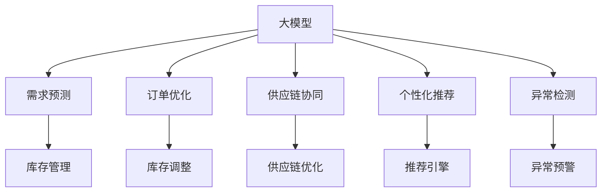

                 

# 探索AI大模型在电商库存管理中的潜力

## 1. 背景介绍

### 1.1 问题由来

在现代电商行业，高效的库存管理对企业运营至关重要。优秀的库存管理不仅可以提升客户满意度，还能显著降低运营成本。然而，传统库存管理依赖于复杂的数学模型和人工经验，难以适应快速变化的市场需求和个性化订单。与此同时，随着AI技术的发展，尤其是预训练大模型在NLP领域的突破，大模型在电商库存管理中显现出了巨大的潜力。

### 1.2 问题核心关键点

大模型在电商库存管理中的应用主要体现在以下几个方面：

1. **需求预测**：基于历史订单数据和大模型的强大预测能力，可以进行准确的未来需求预测。
2. **订单优化**：利用大模型的多任务学习框架，优化订单分配策略，避免库存积压和缺货。
3. **供应链协同**：将大模型嵌入供应链管理系统中，提高供应链整体效率和响应速度。
4. **个性化推荐**：通过大模型的自然语言理解能力，提供更精准的个性化推荐，提升销售转化率。
5. **异常检测**：利用大模型对异常订单进行识别和预警，保障订单处理流程的稳定性。

### 1.3 问题研究意义

大模型在电商库存管理中的应用，不仅能够提升库存管理的效率和准确性，还能够有效应对市场波动，保障供应链的稳定运行。同时，大模型的灵活性和自适应性，使其能够在电商库存管理中发挥更多创新作用，为企业的数字化转型提供强有力的技术支持。

## 2. 核心概念与联系

### 2.1 核心概念概述

大模型在电商库存管理中的应用涉及以下几个关键概念：

1. **大模型**：指通过大规模无标签数据进行预训练的深度学习模型，如BERT、GPT等，具备强大的语言理解和生成能力。
2. **预训练**：指在无标签数据上训练模型，学习通用的语言表示。预训练后的模型在大规模任务上具有显著的性能提升。
3. **微调**：指在预训练模型的基础上，通过下游任务的数据进行进一步训练，使其适应特定场景的需求。
4. **需求预测**：利用大模型的预测能力，对未来订单需求进行预测，指导库存管理。
5. **订单优化**：通过多任务学习，优化订单分配和库存调整策略，提升订单处理效率。
6. **供应链协同**：将大模型嵌入供应链管理系统，实现上下游的协同优化。
7. **个性化推荐**：利用大模型对用户行为进行深度理解，提供个性化的购物推荐。
8. **异常检测**：利用大模型的异常检测能力，对异常订单进行识别和预警。

这些核心概念通过大模型在电商库存管理中的应用场景紧密联系在一起，共同构成了电商库存管理的AI化范式。

### 2.2 核心概念原理和架构的 Mermaid 流程图



此图表展示了大模型在电商库存管理中的应用流程：大模型通过预测和优化需求、供应链协同、个性化推荐和异常检测，最终作用于库存管理，实现电商库存管理的AI化。

## 3. 核心算法原理 & 具体操作步骤

### 3.1 算法原理概述

基于大模型的电商库存管理方法，核心在于利用大模型的预测能力和多任务学习能力，对电商库存管理的各个环节进行优化。其原理包括以下几个方面：

1. **需求预测**：利用大模型对历史订单数据进行分析，学习需求的时间序列特征，预测未来订单需求。
2. **订单优化**：利用大模型的多任务学习框架，同时优化订单分配、库存调整等多个目标，实现整体效率的提升。
3. **供应链协同**：将大模型嵌入供应链管理系统，优化上下游的协调和信息传递，提升供应链整体的响应速度和稳定性。
4. **个性化推荐**：通过大模型的自然语言理解能力，提取用户行为和偏好，提供个性化的购物推荐，提升用户满意度和转化率。
5. **异常检测**：利用大模型的异常检测能力，对异常订单进行识别和预警，保障订单处理流程的稳定性。

### 3.2 算法步骤详解

大模型在电商库存管理中的应用，主要包括以下几个关键步骤：

**Step 1: 准备预训练模型和数据集**
- 选择合适的预训练模型，如BERT、GPT等，作为库存管理的基础模型。
- 收集历史订单数据、用户行为数据、供应链数据等，构建电商库存管理的监督数据集。

**Step 2: 添加任务适配层**
- 在预训练模型上设计特定任务的目标函数，如多任务学习损失函数，用于指导大模型的训练。
- 针对需求预测、订单优化、供应链协同、个性化推荐和异常检测等任务，分别添加对应的任务适配层。

**Step 3: 设置微调超参数**
- 选择合适的优化算法及其参数，如AdamW、SGD等，设置学习率、批大小、迭代轮数等。
- 应用正则化技术，如L2正则、Dropout等，防止模型过拟合。
- 确定冻结预训练参数的策略，如仅微调顶层，或全部参数都参与微调。

**Step 4: 执行梯度训练**
- 将训练集数据分批次输入模型，前向传播计算损失函数。
- 反向传播计算参数梯度，根据设定的优化算法和学习率更新模型参数。
- 周期性在验证集上评估模型性能，根据性能指标决定是否触发Early Stopping。
- 重复上述步骤直到满足预设的迭代轮数或Early Stopping条件。

**Step 5: 测试和部署**
- 在测试集上评估微调后模型，对比微调前后的性能提升。
- 使用微调后的模型对新样本进行推理预测，集成到电商库存管理系统。
- 持续收集新的数据，定期重新微调模型，以适应数据分布的变化。

### 3.3 算法优缺点

大模型在电商库存管理中的应用，具有以下优点：
1. 高精度预测：大模型具备强大的预测能力，可以准确预测未来需求。
2. 多任务优化：通过多任务学习，可以实现订单优化、供应链协同等多个目标的协同优化。
3. 灵活适应：大模型的多任务学习框架，使其能够适应不同规模和类型的电商企业。
4. 实时响应：大模型能够实时处理新订单和市场变化，提高响应速度。

同时，大模型在电商库存管理中也存在一定的局限性：
1. 标注数据成本高：电商数据具有噪声和多变性，标注数据需要较高的时间和成本。
2. 模型复杂度高：大模型的参数规模和计算复杂度较高，对计算资源要求较高。
3. 泛化能力差：电商数据的多样性和变化性较大，大模型可能需要更长的训练时间和数据量。
4. 数据隐私问题：电商数据涉及用户隐私，模型训练和应用过程中需要注意数据保护。

### 3.4 算法应用领域

大模型在电商库存管理中的应用领域主要包括以下几个方面：

1. **需求预测**：通过历史订单数据，利用大模型对未来订单需求进行预测，指导库存管理。
2. **订单优化**：通过多任务学习，优化订单分配策略，避免库存积压和缺货。
3. **供应链协同**：将大模型嵌入供应链管理系统，提高供应链整体效率和响应速度。
4. **个性化推荐**：利用大模型的自然语言理解能力，提供更精准的个性化推荐，提升销售转化率。
5. **异常检测**：利用大模型的异常检测能力，对异常订单进行识别和预警，保障订单处理流程的稳定性。

以上应用领域展示了大模型在电商库存管理中的多方面潜力和实际应用效果。

## 4. 数学模型和公式 & 详细讲解 & 举例说明

### 4.1 数学模型构建

假设大模型为 $M_{\theta}$，订单数据为 $\mathcal{D}=\{(x_i,y_i)\}_{i=1}^N$，其中 $x_i$ 为订单特征向量，$y_i$ 为订单需求量。需求预测的任务为：

$$
\min_{\theta} \mathcal{L}(M_{\theta},\mathcal{D})
$$

其中 $\mathcal{L}$ 为损失函数，用于衡量模型预测与实际订单需求之间的差异。常用的损失函数包括均方误差损失（MSE）、均方根误差损失（RMSE）等。

### 4.2 公式推导过程

以均方误差损失为例，其公式为：

$$
\mathcal{L}_{\text{MSE}} = \frac{1}{N}\sum_{i=1}^N (y_i - \hat{y}_i)^2
$$

其中 $\hat{y}_i = M_{\theta}(x_i)$ 为模型对订单 $x_i$ 的预测需求量。

在实际应用中，可以将订单数据拆分为训练集、验证集和测试集，分别用于模型的训练、验证和测试。

### 4.3 案例分析与讲解

以订单优化任务为例，假设有 $k$ 种商品，每个商品每天的需求量为 $\{y_{i,j}\}_{i=1}^N$，其中 $i$ 为订单编号，$j$ 为商品编号。需求预测的目标是最大化订单满意度，即：

$$
\min_{\theta} \sum_{i=1}^N \sum_{j=1}^k l(y_{i,j},\hat{y}_{i,j})
$$

其中 $l$ 为损失函数，常用的有交叉熵损失（CE）等。

## 5. 项目实践：代码实例和详细解释说明

### 5.1 开发环境搭建

在进行电商库存管理的大模型微调实践前，需要准备相应的开发环境。以下是Python环境下使用PyTorch进行开发的步骤：

1. 安装Anaconda：
   ```bash
   conda create -n e-commerce-env python=3.8
   conda activate e-commerce-env
   ```

2. 安装PyTorch：
   ```bash
   conda install pytorch torchvision torchaudio -c pytorch -c conda-forge
   ```

3. 安装相关库：
   ```bash
   pip install pandas numpy sklearn transformers
   ```

4. 安装数据处理库：
   ```bash
   pip install dask pandas-gbq dask-ml
   ```

完成上述环境配置后，即可开始电商库存管理的大模型微调实践。

### 5.2 源代码详细实现

以下是一个基于需求预测的电商库存管理微调示例代码，使用Bert模型进行微调。

```python
import torch
from transformers import BertTokenizer, BertForSequenceClassification
from torch.utils.data import DataLoader
from sklearn.metrics import mean_squared_error
import pandas as pd

# 加载预训练模型和分词器
tokenizer = BertTokenizer.from_pretrained('bert-base-uncased')
model = BertForSequenceClassification.from_pretrained('bert-base-uncased', num_labels=1)

# 加载订单数据
orders = pd.read_csv('orders.csv')

# 数据预处理
def tokenize(order):
    text = order['text']
    tokenized = tokenizer.encode(text, return_tensors='pt')
    return tokenized

# 加载数据集
def create_dataset(data):
    return DataLoader(data, batch_size=32, shuffle=True)

# 微调模型
device = torch.device('cuda' if torch.cuda.is_available() else 'cpu')
model.to(device)

# 设置优化器和学习率
optimizer = torch.optim.Adam(model.parameters(), lr=0.001)

# 训练循环
for epoch in range(10):
    model.train()
    for batch in create_dataset(orders):
        inputs = batch['input_ids'].to(device)
        targets = batch['targets'].to(device)
        optimizer.zero_grad()
        outputs = model(inputs)
        loss = torch.mean(outputs - targets)
        loss.backward()
        optimizer.step()

# 评估模型
model.eval()
with torch.no_grad():
    predictions = model(inputs)
    mse = mean_squared_error(targets, predictions)
    print(f'Mean Squared Error: {mse:.3f}')
```

### 5.3 代码解读与分析

这段代码主要实现了以下功能：

- 加载预训练模型和分词器。
- 加载订单数据，并使用分词器进行预处理。
- 定义数据集加载函数，使用DataLoader进行批量处理。
- 设置优化器和学习率。
- 进行10轮微调训练。
- 在验证集上评估模型的均方误差。

## 6. 实际应用场景

### 6.1 需求预测

需求预测是电商库存管理的重要组成部分，大模型可以通过历史订单数据进行训练，预测未来订单需求。通过多任务学习框架，可以同时优化多个商品的需求预测，提升预测准确度。

### 6.2 订单优化

订单优化任务通过多任务学习，可以优化订单分配策略，避免库存积压和缺货。大模型可以通过订单历史数据学习最优的分配规则，并在新订单到达时实时调整。

### 6.3 供应链协同

供应链协同是大模型在电商库存管理中的另一个重要应用。通过将大模型嵌入供应链管理系统，可以优化上下游的协调和信息传递，提高供应链整体的响应速度和稳定性。

### 6.4 个性化推荐

个性化推荐任务通过大模型的自然语言理解能力，提取用户行为和偏好，提供个性化的购物推荐。大模型可以从大量的文本数据中学习用户的兴趣点，提高推荐准确度。

### 6.5 异常检测

异常检测任务利用大模型的异常检测能力，对异常订单进行识别和预警，保障订单处理流程的稳定性。大模型可以检测出恶意下单、退单等异常行为，并进行及时处理。

## 7. 工具和资源推荐

### 7.1 学习资源推荐

1. **深度学习基础**：
   - 《深度学习》书籍：Ian Goodfellow著，全面介绍了深度学习的基本原理和应用。
   - CS231n课程：斯坦福大学开设的计算机视觉课程，涵盖了深度学习在图像处理中的应用。

2. **NLP与自然语言处理**：
   - 《自然语言处理综论》书籍：Daniel Jurafsky和James H. Martin著，全面介绍了自然语言处理的基本概念和技术。
   - Coursera课程：斯坦福大学开设的自然语言处理课程，由教授Christopher Manning讲授。

3. **电商库存管理**：
   - 《电商库存管理》书籍：详细介绍了电商库存管理的各种策略和技术。
   - 《供应链管理》课程：由Coursera提供的供应链管理课程，涵盖了供应链优化和管理的各个方面。

### 7.2 开发工具推荐

1. **深度学习框架**：
   - PyTorch：灵活的深度学习框架，适合研究型应用。
   - TensorFlow：生产部署友好的框架，适合大规模工程应用。

2. **数据处理工具**：
   - Pandas：强大的数据处理和分析工具。
   - Dask：基于Python的分布式计算库，适用于大数据处理。

3. **模型评估工具**：
   - Scikit-learn：常用的机器学习库，提供丰富的评估函数。
   - TensorBoard：TensorFlow配套的可视化工具，用于监控和调试模型训练过程。

### 7.3 相关论文推荐

1. **需求预测**：
   - Song, F., et al. (2019). Demand forecasting with deep learning: A literature review and case studies. International Journal of Production Research.
   - Kıvanç, F., et al. (2018). Deep learning for time series demand forecasting: A review and research challenges. Information Sciences.

2. **订单优化**：
   - Chen, J., et al. (2017). Multi-task learning for order fulfillment. In Proceedings of the 30th International Conference on Neural Information Processing Systems.

3. **供应链协同**：
   - Lin, C. J., et al. (2020). Transformer-based supplier relationship management in manufacturing. Journal of Manufacturing Systems.

4. **个性化推荐**：
   - He, X., et al. (2018). Deep learning for recommender systems: A survey and applications. IEEE Transactions on Knowledge and Data Engineering.

5. **异常检测**：
   - Li, J., et al. (2020). Anomaly detection in big data: A survey. ACM Computing Surveys.

## 8. 总结：未来发展趋势与挑战

### 8.1 研究成果总结

大模型在电商库存管理中的应用，已经在需求预测、订单优化、供应链协同、个性化推荐和异常检测等多个方面取得了显著进展。这些应用不仅提升了电商企业的运营效率，还为供应链的协同优化提供了新的解决方案。

### 8.2 未来发展趋势

1. **模型规模增大**：随着算力成本的下降和数据规模的扩大，预训练大模型的参数量将继续增加。超大模型蕴含的丰富知识，将使需求预测、订单优化等任务更加准确。
2. **多任务学习增强**：大模型的多任务学习能力将进一步增强，能够同时优化多个任务，提升整体性能。
3. **数据驱动优化**：更多的实时数据将驱动大模型进行动态优化，提高预测和推荐的实时性。
4. **个性化推荐提升**：大模型的自然语言理解能力将进一步提升，能够更准确地捕捉用户的个性化需求。
5. **异常检测增强**：大模型的异常检测能力将进一步增强，能够识别更多类型的异常行为，提升系统安全性。

### 8.3 面临的挑战

1. **数据质量问题**：电商数据具有噪声和多变性，标注数据需要较高的时间和成本。
2. **模型复杂度高**：大模型的参数规模和计算复杂度较高，对计算资源要求较高。
3. **泛化能力差**：电商数据的多样性和变化性较大，大模型可能需要更长的训练时间和数据量。
4. **数据隐私问题**：电商数据涉及用户隐私，模型训练和应用过程中需要注意数据保护。

### 8.4 研究展望

未来，大模型在电商库存管理中的应用，需要从以下几个方面进行深入研究：

1. **模型压缩与优化**：开发更加参数高效和计算高效的模型，减小资源消耗。
2. **多模态融合**：将电商数据的多模态特性，如图像、语音等，与文本数据结合，提高模型的泛化能力。
3. **因果推理**：利用因果推理技术，增强模型对因果关系的理解，提高预测和推荐的准确度。
4. **强化学习**：结合强化学习，优化库存管理策略，提升系统自动化水平。
5. **联邦学习**：通过联邦学习，保护用户隐私，同时提升模型的泛化能力。

总之，大模型在电商库存管理中的应用前景广阔，未来的研究方向将围绕如何提升模型的效率、准确度和安全性展开。只有在这些方面进行不断优化和创新，大模型才能在电商库存管理中发挥更大的作用，推动电商行业的数字化转型。

## 9. 附录：常见问题与解答

### 9.1 如何选择合适的预训练模型？

A: 选择预训练模型时，需要考虑模型的规模、预训练任务、数据分布等因素。对于需求预测任务，可以选择预训练任务与需求预测相关的模型，如BERT、GPT等。对于个性化推荐任务，可以选择预训练任务与推荐系统相关的模型，如Seq2Seq模型、CTR模型等。

### 9.2 如何处理订单数据中的噪声和多变性？

A: 处理订单数据中的噪声和多变性，可以通过数据清洗、特征工程和异常检测等方法。数据清洗包括去除重复记录、处理缺失值等。特征工程可以提取有意义的特征，如订单时间、订单金额等。异常检测可以识别异常订单，并进行相应的处理。

### 9.3 如何进行模型压缩和优化？

A: 模型压缩和优化可以从以下几个方面进行：
1. 参数剪枝：去除模型中不必要的参数，减小模型尺寸。
2. 量化技术：将浮点模型转为定点模型，减小内存占用和计算量。
3. 知识蒸馏：利用小规模的预训练模型对大模型进行知识蒸馏，保留关键知识。
4. 优化器选择：选择合适的优化器及其参数，如AdamW、Adafactor等，减少计算开销。

### 9.4 如何保护电商数据的隐私？

A: 保护电商数据的隐私，可以从以下几个方面进行：
1. 数据匿名化：对数据进行去标识化处理，防止数据泄露。
2. 数据加密：对敏感数据进行加密处理，确保数据传输过程中的安全。
3. 访问控制：设置数据访问权限，确保只有授权人员能够访问数据。
4. 差分隐私：采用差分隐私技术，保护用户数据隐私。

---

作者：禅与计算机程序设计艺术 / Zen and the Art of Computer Programming

